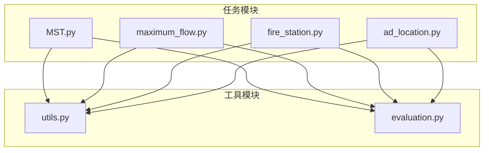
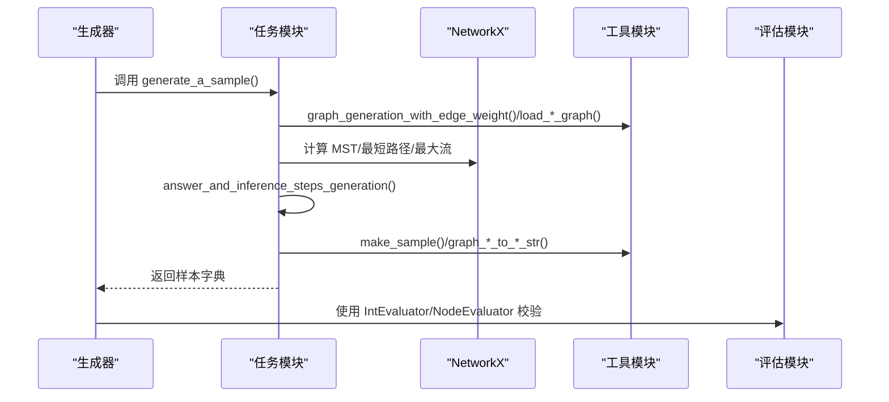
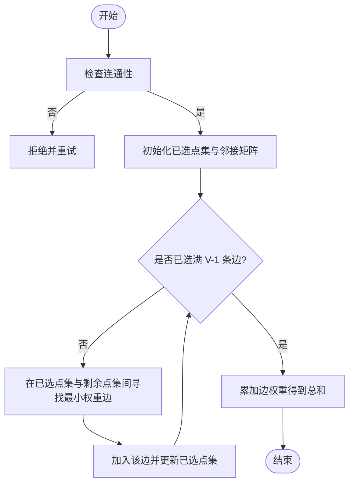
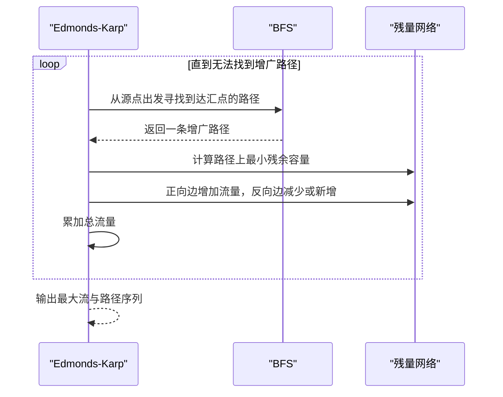
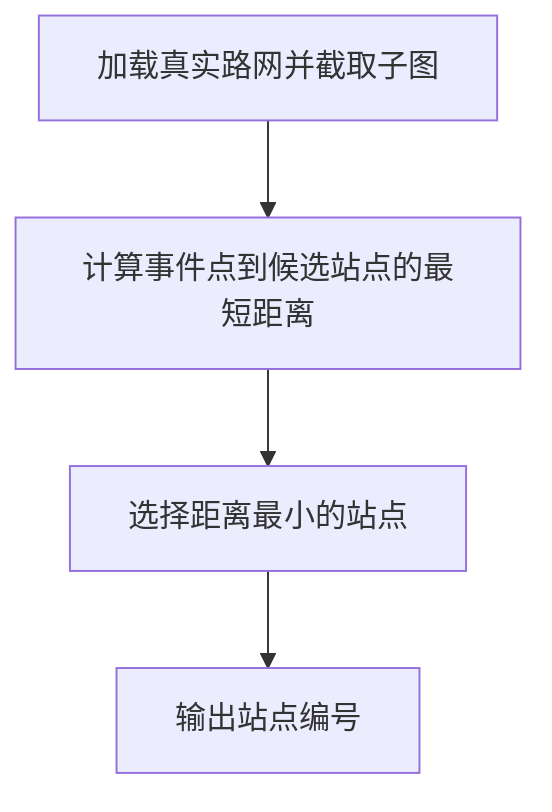
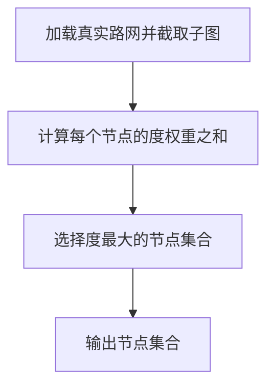
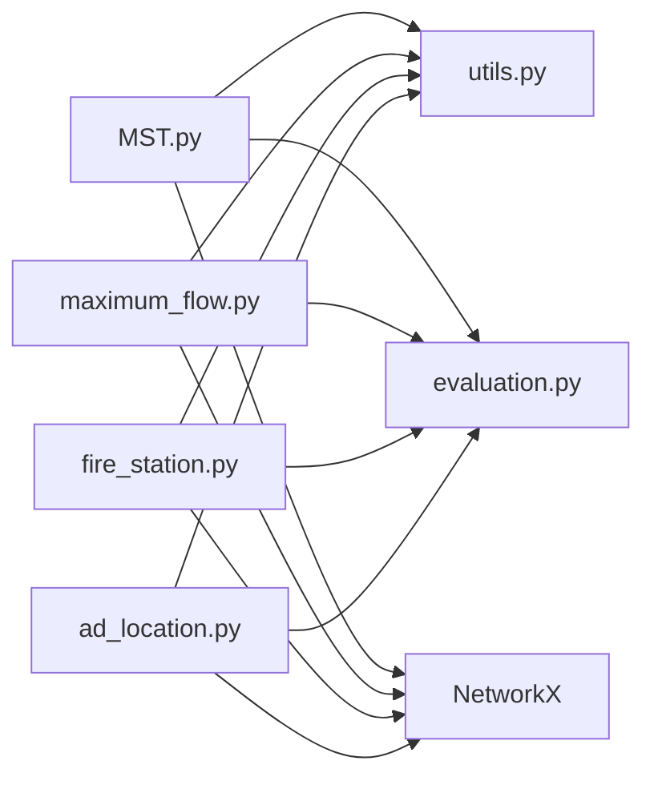

# 优化问题

<cite>
**本文引用的文件**
- [GTG/tasks/MST/MST.py](file://GTG/tasks/MST/MST.py)
- [GTG/tasks/maximum_flow/maximum_flow.py](file://GTG/tasks/maximum_flow/maximum_flow.py)
- [GTG/tasks/fire_station/fire_station.py](file://GTG/tasks/fire_station/fire_station.py)
- [GTG/tasks/ad_location/ad_location.py](file://GTG/tasks/ad_location/ad_location.py)
- [GTG/utils/utils.py](file://GTG/utils/utils.py)
- [GTG/utils/evaluation.py](file://GTG/utils/evaluation.py)
</cite>

## 目录
1. [引言](#引言)
2. [项目结构](#项目结构)
3. [核心组件](#核心组件)
4. [架构总览](#架构总览)
5. [详细组件分析](#详细组件分析)
6. [依赖关系分析](#依赖关系分析)
7. [性能考量](#性能考量)
8. [故障排查指南](#故障排查指南)
9. [结论](#结论)

## 引言
本文件围绕仓库中的图优化任务，系统性解析以下内容：
- 最小生成树（MST）：Kruskal/Prim 的实现细节与教学式推理步骤
- 最大流：Edmonds-Karp 算法的流程与残量网络更新机制
- 设施选址：消防站选址与广告位选址的图建模与近似策略
- 优化目标与约束：目标函数定义、约束编码方式与最优解验证机制
- 大规模图上的性能优化建议

## 项目结构
该仓库采用“任务模块 + 工具与评估”的分层组织方式：
- 任务模块位于 GTG/tasks 下，每个任务包含独立的 question_generation、answer_and_inference_steps_generation、choices_generation、generate_a_sample 等函数，统一导出 TASK_NAME 并使用 IntEvaluator/NodeEvaluator 等评估器
- 工具模块 GTG/utils 提供图生成、权重转换、自然语言描述、邻接表示等通用能力
- 评估模块 GTG/utils/evaluation 定义评测基类与解析/校验逻辑

图表来源
- [GTG/tasks/MST/MST.py](file://GTG/tasks/MST/MST.py#L1-L267)
- [GTG/tasks/maximum_flow/maximum_flow.py](file://GTG/tasks/maximum_flow/maximum_flow.py#L1-L122)
- [GTG/tasks/fire_station/fire_station.py](file://GTG/tasks/fire_station/fire_station.py#L1-L78)
- [GTG/tasks/ad_location/ad_location.py](file://GTG/tasks/ad_location/ad_location.py#L1-L70)
- [GTG/utils/utils.py](file://GTG/utils/utils.py#L1-L200)
- [GTG/utils/evaluation.py](file://GTG/utils/evaluation.py#L1-L200)

章节来源
- [GTG/tasks/MST/MST.py](file://GTG/tasks/MST/MST.py#L1-L267)
- [GTG/tasks/maximum_flow/maximum_flow.py](file://GTG/tasks/maximum_flow/maximum_flow.py#L1-L122)
- [GTG/tasks/fire_station/fire_station.py](file://GTG/tasks/fire_station/fire_station.py#L1-L78)
- [GTG/tasks/ad_location/ad_location.py](file://GTG/tasks/ad_location/ad_location.py#L1-L70)
- [GTG/utils/utils.py](file://GTG/utils/utils.py#L1-L200)
- [GTG/utils/evaluation.py](file://GTG/utils/evaluation.py#L1-L200)

## 核心组件
- MST 任务：提供 Prim 教学式实现与 NetworkX 最小生成树结果对比，输出总权重与逐步推理
- 最大流任务：基于 Edmonds-Karp 的 BFS 寻找增广路径与残量更新，输出最大流值与路径记录
- 消防站选址：从真实路网加载子图，计算事件点到候选站点的最短距离，选择最近站点
- 广告位选址：从真实路网加载子图，统计各节点的“流量”度（以边权重之和衡量），选择最大者

章节来源
- [GTG/tasks/MST/MST.py](file://GTG/tasks/MST/MST.py#L16-L110)
- [GTG/tasks/maximum_flow/maximum_flow.py](file://GTG/tasks/maximum_flow/maximum_flow.py#L12-L77)
- [GTG/tasks/fire_station/fire_station.py](file://GTG/tasks/fire_station/fire_station.py#L15-L48)
- [GTG/tasks/ad_location/ad_location.py](file://GTG/tasks/ad_location/ad_location.py#L15-L40)
- [GTG/utils/utils.py](file://GTG/utils/utils.py#L550-L617)

## 架构总览
整体流程由“数据生成—问题构造—推理步骤—答案与选项—样本封装—评估”构成。MST 与最大流任务直接使用 NetworkX 进行精确求解；消防站与广告位任务通过真实路网数据进行近似建模与启发式选择。

图表来源
- [GTG/tasks/MST/MST.py](file://GTG/tasks/MST/MST.py#L241-L261)
- [GTG/tasks/maximum_flow/maximum_flow.py](file://GTG/tasks/maximum_flow/maximum_flow.py#L97-L116)
- [GTG/tasks/fire_station/fire_station.py](file://GTG/tasks/fire_station/fire_station.py#L50-L69)
- [GTG/tasks/ad_location/ad_location.py](file://GTG/tasks/ad_location/ad_location.py#L42-L61)
- [GTG/utils/utils.py](file://GTG/utils/utils.py#L99-L175)
- [GTG/utils/evaluation.py](file://GTG/utils/evaluation.py#L69-L80)

## 详细组件分析

### 最小生成树（MST）
- 问题与目标
  - 输入：带权无向连通图
  - 输出：MST 总权重与逐步推理（Prim 教学式）
- 实现要点
  - 连通性检查：非连通图直接拒绝
  - 教学式 Prim：每次从已选点集到剩余点集中选取最小权重边，逐步扩展
  - 精确验证：同时调用 NetworkX 的最小生成树计算总权重，用于答案一致性校验
- 数据结构与复杂度
  - 邻接矩阵存储边权重，Prim 的朴素实现为 O(V^2)，适合中小规模
- 错误处理
  - 非连通图返回 reject，重新生成样本

图表来源
- [GTG/tasks/MST/MST.py](file://GTG/tasks/MST/MST.py#L22-L109)

章节来源
- [GTG/tasks/MST/MST.py](file://GTG/tasks/MST/MST.py#L16-L110)

### 最大流（Maximum Flow）
- 问题与目标
  - 输入：有向带权图（容量）、源点与汇点
  - 输出：最大流值与增广路径序列
- 实现要点
  - Edmonds-Karp：以 BFS 寻找最短增广路径（按边数最少）
  - 残量网络：正向边增加流量，反向边减少流量或新增反向边
  - 步骤化输出：记录每轮发现的路径与最小残余容量
- 数据结构与复杂度
  - 每次 BFS 查找增广路径，整体复杂度 O(VE^2)；对稀疏图较友好
- 错误处理
  - 若生成的最大流为 0 则重试，确保样本有效

图表来源
- [GTG/tasks/maximum_flow/maximum_flow.py](file://GTG/tasks/maximum_flow/maximum_flow.py#L35-L77)

章节来源
- [GTG/tasks/maximum_flow/maximum_flow.py](file://GTG/tasks/maximum_flow/maximum_flow.py#L12-L77)

### 消防站选址（Fire Station）
- 问题与目标
  - 输入：城市路网（有向边，长度为权重）、事件发生点、候选站点集合
  - 输出：距离最近的站点编号
- 建模与算法
  - 图建模：从真实路网文件加载，截取 ego_graph 子图，节点重映射
  - 近似策略：计算事件点到各候选站点的最短路径长度，选择最小者
- 约束与验证
  - 保证事件点不在候选集合内且均可达
  - 评估器支持“答案节点”匹配

图表来源
- [GTG/tasks/fire_station/fire_station.py](file://GTG/tasks/fire_station/fire_station.py#L15-L48)
- [GTG/utils/utils.py](file://GTG/utils/utils.py#L585-L613)

章节来源
- [GTG/tasks/fire_station/fire_station.py](file://GTG/tasks/fire_station/fire_station.py#L15-L48)
- [GTG/utils/utils.py](file://GTG/utils/utils.py#L585-L613)

### 广告位选址（Ad Location）
- 问题与目标
  - 输入：城市路网（有向边，volume 为权重）
  - 输出：能获得最大“曝光量”（以节点度权重之和衡量）的节点集合
- 建模与算法
  - 图建模：从真实路网文件加载，截取子图，节点重映射
  - 近似策略：计算每个节点的度（以边权重之和为度量），选择最大者
- 约束与验证
  - 支持多解输出（列表形式）

图表来源
- [GTG/tasks/ad_location/ad_location.py](file://GTG/tasks/ad_location/ad_location.py#L15-L40)
- [GTG/utils/utils.py](file://GTG/utils/utils.py#L553-L581)

章节来源
- [GTG/tasks/ad_location/ad_location.py](file://GTG/tasks/ad_location/ad_location.py#L15-L40)
- [GTG/utils/utils.py](file://GTG/utils/utils.py#L553-L581)

## 依赖关系分析
- 任务到工具
  - MST/最大流/选址任务均依赖 utils 中的图生成、权重转换、邻接表示与自然语言描述
  - 评估器依赖 evaluation 中的解析与校验逻辑
- 任务到 NetworkX
  - MST 使用 nx.minimum_spanning_tree
  - 最大流使用自实现的 Edmonds-Karp（可替换为 nx.maximum_flow）
  - 选址使用 nx.shortest_path_length 与 ego_graph
- 任务到评估器
  - MST/最大流使用 IntEvaluator
  - 消防站/广告位使用 Node/NodeListEvaluator（由 eval_a_node/eval_node_in_list 支持）

图表来源
- [GTG/tasks/MST/MST.py](file://GTG/tasks/MST/MST.py#L1-L267)
- [GTG/tasks/maximum_flow/maximum_flow.py](file://GTG/tasks/maximum_flow/maximum_flow.py#L1-L122)
- [GTG/tasks/fire_station/fire_station.py](file://GTG/tasks/fire_station/fire_station.py#L1-L78)
- [GTG/tasks/ad_location/ad_location.py](file://GTG/tasks/ad_location/ad_location.py#L1-L70)
- [GTG/utils/utils.py](file://GTG/utils/utils.py#L1-L200)
- [GTG/utils/evaluation.py](file://GTG/utils/evaluation.py#L1-L200)

章节来源
- [GTG/tasks/MST/MST.py](file://GTG/tasks/MST/MST.py#L1-L267)
- [GTG/tasks/maximum_flow/maximum_flow.py](file://GTG/tasks/maximum_flow/maximum_flow.py#L1-L122)
- [GTG/tasks/fire_station/fire_station.py](file://GTG/tasks/fire_station/fire_station.py#L1-L78)
- [GTG/tasks/ad_location/ad_location.py](file://GTG/tasks/ad_location/ad_location.py#L1-L70)
- [GTG/utils/utils.py](file://GTG/utils/utils.py#L1-L200)
- [GTG/utils/evaluation.py](file://GTG/utils/evaluation.py#L1-L200)

## 性能考量
- MST（Prim 教学式）
  - 朴素实现 O(V^2)，适合中小规模；若需大规模，可考虑堆优化的 Prim 或 Kruskal（并查集）
- 最大流（Edmonds-Karp）
  - O(VE^2)，对稀疏图较友好；可考虑 Dinic 或 Push-Relabel 以提升性能
- 选址任务
  - 加载真实路网后进行 ego_graph 截取，控制半径与节点规模可避免超大规模
  - 多候选站点场景可预计算关键节点间的距离，减少重复计算
- 通用优化
  - 使用邻接表而非邻接矩阵可降低空间与常数开销
  - 对稠密图优先考虑矩阵运算（如 NumPy）加速边权访问
  - 合理缓存中间结果（如最短路径矩阵）以复用

## 故障排查指南
- MST 非连通图
  - 现象：answer_and_inference_steps_generation 返回 reject
  - 处理：重新生成样本直至连通
- 最大流为 0
  - 现象：generate_a_sample 循环重试直到 ans != 0
  - 处理：检查源点/汇点可达性与边容量设置
- 选址不可达
  - 现象：question_generation 中候选站点存在不可达情况
  - 处理：重新采样候选站点，确保可达且不包含事件点
- 评估失败
  - 现象：eval_a_sample 解析不到“Answer:”或答案不匹配
  - 处理：确认输出格式与答案节点字符串一致；必要时调整解析规则

章节来源
- [GTG/tasks/MST/MST.py](file://GTG/tasks/MST/MST.py#L22-L33)
- [GTG/tasks/maximum_flow/maximum_flow.py](file://GTG/tasks/maximum_flow/maximum_flow.py#L97-L116)
- [GTG/tasks/fire_station/fire_station.py](file://GTG/tasks/fire_station/fire_station.py#L15-L33)
- [GTG/tasks/ad_location/ad_location.py](file://GTG/tasks/ad_location/ad_location.py#L15-L20)
- [GTG/utils/evaluation.py](file://GTG/utils/evaluation.py#L1-L200)

## 结论
本仓库以清晰的任务模块化设计实现了三类典型图优化问题：
- MST 通过教学式 Prim 展示贪心思想，结合 NetworkX 精确验证
- 最大流采用 Edmonds-Karp 的 BFS 寻路与残量更新，具备良好的可解释性
- 选址类问题通过真实路网数据进行近似建模，体现“启发式 + 可解释”的工程实践

在大规模图场景下，建议优先采用更高效的算法实现（如堆优化 Prim/Kruskal、Dinic/PreFlow Push-Relabel）与合理的数据结构选择，并通过缓存与预计算进一步提升性能。