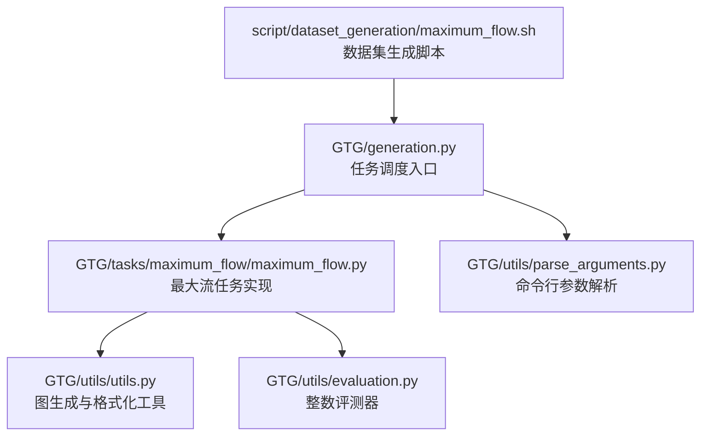
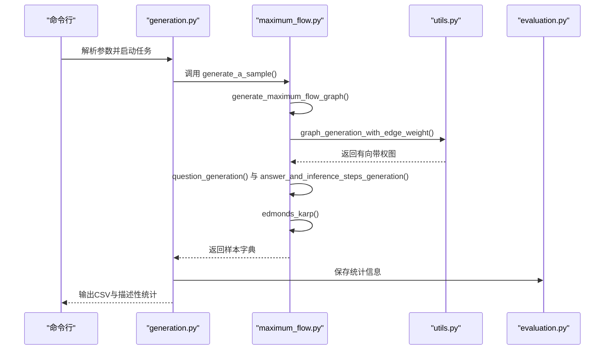
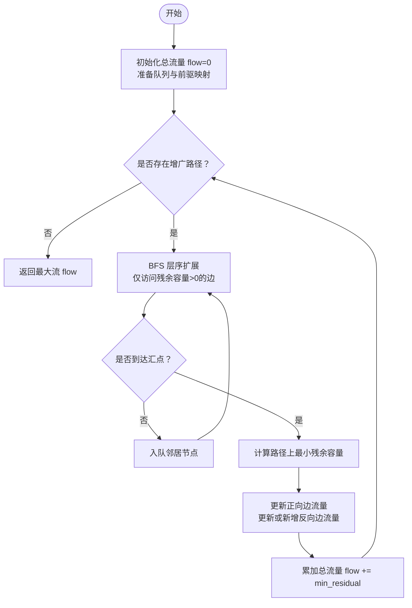
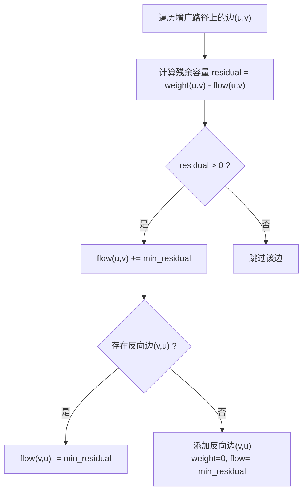
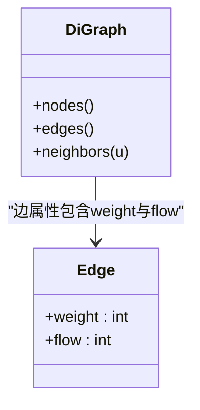
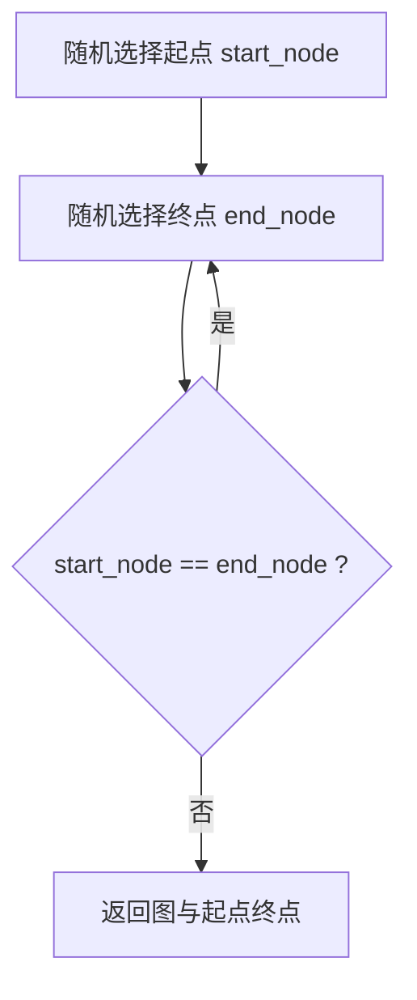
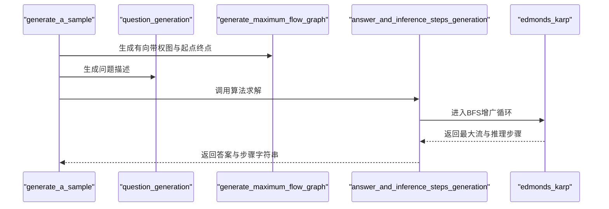
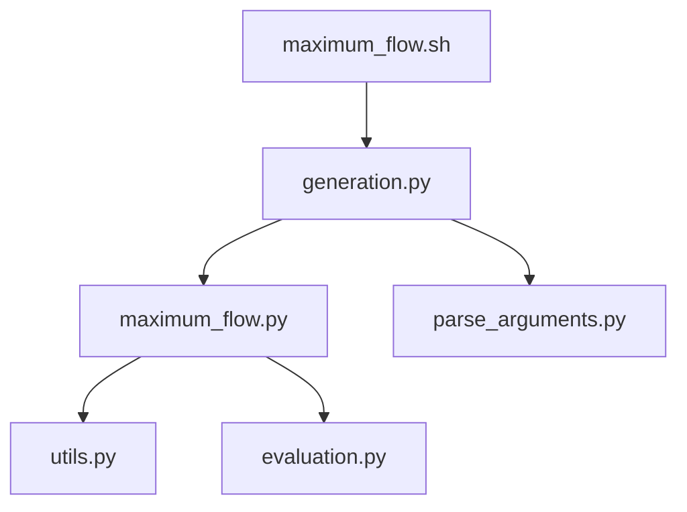

# 最大流问题

<cite>
**本文引用的文件**
- [maximum_flow.py](file://GTG/tasks/maximum_flow/maximum_flow.py)
- [utils.py](file://GTG/utils/utils.py)
- [evaluation.py](file://GTG/utils/evaluation.py)
- [generation.py](file://GTG/generation.py)
- [parse_arguments.py](file://GTG/utils/parse_arguments.py)
- [maximum_flow.sh](file://script/dataset_generation/maximum_flow.sh)
</cite>

## 目录
1. [引言](#引言)
2. [项目结构](#项目结构)
3. [核心组件](#核心组件)
4. [架构总览](#架构总览)
5. [详细组件分析](#详细组件分析)
6. [依赖分析](#依赖分析)
7. [性能考虑](#性能考虑)
8. [故障排查指南](#故障排查指南)
9. [结论](#结论)
10. [附录](#附录)

## 引言
本文件围绕最大流问题中的Ford-Fulkerson框架与Edmonds-Karp算法实现进行系统化解读，重点覆盖以下方面：
- 残量图的动态更新机制：如何在每次增广后更新正向边与反向边的剩余容量，并维护反向边的流量变化。
- 广度优先搜索（BFS）增广路径的查找过程：以队列为基础的逐层扩展，确保每次选择最短可增广路径。
- 流值累计策略：在每条增广路径上按最小残余容量进行增量更新，并累加到全局最大流。
- 源点与汇点的建模方式：随机生成有向图并选取起点与终点，保证两者不相同。
- 容量矩阵的存储结构：采用NetworkX的有向图，边属性包含容量weight与当前流量flow。
- 反向边的构建逻辑：在增广过程中动态添加或更新反向边，以支持回退与流量调整。
- 关键函数调用关系与状态变迁：从样本生成到答案推理步骤的完整流程。
- 最坏情况下的时间复杂度分析：O(V·E^2)。
- 多路径网络测试案例：展示收敛性验证与最大流最小割定理的实践应用。

## 项目结构
该实现位于GTG/tasks/maximum_flow/maximum_flow.py，配合通用工具与评估器完成数据生成、推理与评测。下图给出与最大流任务直接相关的文件与模块关系。

图表来源
- [generation.py](file://GTG/generation.py#L1-L107)
- [maximum_flow.py](file://GTG/tasks/maximum_flow/maximum_flow.py#L1-L122)
- [utils.py](file://GTG/utils/utils.py#L1-L200)
- [evaluation.py](file://GTG/utils/evaluation.py#L1-L200)
- [parse_arguments.py](file://GTG/utils/parse_arguments.py#L1-L28)
- [maximum_flow.sh](file://script/dataset_generation/maximum_flow.sh#L1-L36)

章节来源
- [generation.py](file://GTG/generation.py#L1-L107)
- [maximum_flow.py](file://GTG/tasks/maximum_flow/maximum_flow.py#L1-L122)
- [utils.py](file://GTG/utils/utils.py#L1-L200)
- [evaluation.py](file://GTG/utils/evaluation.py#L1-L200)
- [parse_arguments.py](file://GTG/utils/parse_arguments.py#L1-L28)
- [maximum_flow.sh](file://script/dataset_generation/maximum_flow.sh#L1-L36)

## 核心组件
- 任务名称常量：用于标识最大流任务。
- 图生成与起点终点选择：生成有向带权图并随机挑选起点与终点。
- Edmonds-Karp主算法：基于BFS寻找增广路径，动态更新残量图与总流量。
- 样本生成与推理步骤：输出逐步推理字符串，便于教学与验证。
- 评测器：继承整数评测器，解析模型输出并判定正确性。

章节来源
- [maximum_flow.py](file://GTG/tasks/maximum_flow/maximum_flow.py#L9-L122)

## 架构总览
下图展示最大流任务从命令行到最终样本输出的整体流程。

图表来源
- [generation.py](file://GTG/generation.py#L1-L107)
- [maximum_flow.py](file://GTG/tasks/maximum_flow/maximum_flow.py#L1-L122)
- [utils.py](file://GTG/utils/utils.py#L352-L366)
- [evaluation.py](file://GTG/utils/evaluation.py#L69-L80)

## 详细组件分析

### Edmonds-Karp算法实现
- Ford-Fulkerson框架：以“寻找增广路径并沿路径增加流量”的思想为核心，通过BFS保证每次选择最短可增广路径，从而避免最坏情况下指数级退化。
- BFS增广路径查找：使用队列进行逐层扩展，仅允许访问残余容量大于0的边；一旦到达汇点即停止扩展，记录该路径。
- 残量图动态更新：在每条增广路径上，计算最小残余容量，然后对正向边增加流量、对反向边减少流量（若存在），或新增反向边（容量为0，流量为负）。
- 流值累计：将每步的最小残余容量累加到总流量，直至无法再找到增广路径为止。

图表来源
- [maximum_flow.py](file://GTG/tasks/maximum_flow/maximum_flow.py#L35-L76)

章节来源
- [maximum_flow.py](file://GTG/tasks/maximum_flow/maximum_flow.py#L35-L76)

### 残量图与反向边的构建逻辑
- 残余容量计算：对于(u,v)，残余容量 = 容量 - 当前流量。仅当残余容量>0时才允许增广。
- 正向边更新：沿增广路径对每条边的流量加上最小残余容量。
- 反向边更新/新增：若存在(v,u)，则其流量减去最小残余容量；否则新增一条反向边(v,u)，容量为0，流量为负的最小残余容量。这样可以实现流量回退与后续增广。

图表来源
- [maximum_flow.py](file://GTG/tasks/maximum_flow/maximum_flow.py#L44-L67)

章节来源
- [maximum_flow.py](file://GTG/tasks/maximum_flow/maximum_flow.py#L44-L67)

### 容量矩阵的存储结构与访问
- 存储结构：使用NetworkX的DiGraph，边属性包含weight（容量）与flow（当前流量）。邻接关系通过neighbors()访问，边属性通过edges[u,v]['weight']与edges[u,v].get('flow',0)读取。
- 访问模式：在BFS阶段仅检查残余容量；在增广阶段同时更新正向与反向边的flow。

图表来源
- [maximum_flow.py](file://GTG/tasks/maximum_flow/maximum_flow.py#L44-L67)
- [utils.py](file://GTG/utils/utils.py#L352-L366)

章节来源
- [maximum_flow.py](file://GTG/tasks/maximum_flow/maximum_flow.py#L44-L67)
- [utils.py](file://GTG/utils/utils.py#L352-L366)

### 源点与汇点的建模方式
- 随机选择：从图节点集合中随机挑选起点与终点，确保二者不同。
- 有向图约束：由于是最大流问题，起点与终点必须不同，且图为有向图，以保证流量方向性。

图表来源
- [maximum_flow.py](file://GTG/tasks/maximum_flow/maximum_flow.py#L17-L24)

章节来源
- [maximum_flow.py](file://GTG/tasks/maximum_flow/maximum_flow.py#L17-L24)

### 关键函数调用关系与状态变迁
- generate_a_sample：生成样本，包含问题描述、推理步骤、答案与选项。
- answer_and_inference_steps_generation：调用edmonds_karp得到最大流与推理字符串。
- edmonds_karp：执行BFS增广循环，动态更新残量图与总流量，记录每步路径与最小残余容量。
- generate_maximum_flow_graph：生成有向带权图并选择起点终点。
- question_generation：构造自然语言问题描述。

图表来源
- [maximum_flow.py](file://GTG/tasks/maximum_flow/maximum_flow.py#L12-L33)
- [maximum_flow.py](file://GTG/tasks/maximum_flow/maximum_flow.py#L27-L33)
- [maximum_flow.py](file://GTG/tasks/maximum_flow/maximum_flow.py#L35-L76)

章节来源
- [maximum_flow.py](file://GTG/tasks/maximum_flow/maximum_flow.py#L12-L33)
- [maximum_flow.py](file://GTG/tasks/maximum_flow/maximum_flow.py#L27-L33)
- [maximum_flow.py](file://GTG/tasks/maximum_flow/maximum_flow.py#L35-L76)

### 时间复杂度分析
- 每次BFS寻找增广路径的时间复杂度为O(E)。
- 在最坏情况下，可能需要O(V·E)次增广（每次增广至少使某条边的残余容量增加一个单位，且最大流为O(V·E)）。
- 因此，整体最坏时间复杂度为O(V·E^2)。

章节来源
- [maximum_flow.py](file://GTG/tasks/maximum_flow/maximum_flow.py#L35-L76)

### 多路径网络测试案例与收敛性验证
- 测试思路：构造多路径网络（例如源点连接多个中间节点，再汇聚到汇点），观察算法在多次增广后逐步填满瓶颈边，最终达到最大流。
- 收敛性验证：当BFS无法从源点到达汇点时，算法终止，此时的总流量即为最大流。
- 最小割定理实践：根据König定理与Fulkerson定理，最大流等于最小割。可在样例中标注最小割边集，验证其容量之和等于最大流。

章节来源
- [maximum_flow.py](file://GTG/tasks/maximum_flow/maximum_flow.py#L35-L76)

## 依赖分析
- 任务模块依赖：
  - GTG/utils/utils.py：提供图生成、边权重处理、格式化输出等工具。
  - GTG/utils/evaluation.py：提供整数评测器，用于解析模型输出并判定正确性。
  - GTG/generation.py：统一的任务调度入口，负责参数解析、样本生成与统计输出。
  - GTG/utils/parse_arguments.py：命令行参数解析。
  - script/dataset_generation/maximum_flow.sh：数据集生成脚本，调用generation.py。

图表来源
- [maximum_flow.py](file://GTG/tasks/maximum_flow/maximum_flow.py#L1-L122)
- [utils.py](file://GTG/utils/utils.py#L1-L200)
- [evaluation.py](file://GTG/utils/evaluation.py#L1-L200)
- [generation.py](file://GTG/generation.py#L1-L107)
- [parse_arguments.py](file://GTG/utils/parse_arguments.py#L1-L28)
- [maximum_flow.sh](file://script/dataset_generation/maximum_flow.sh#L1-L36)

章节来源
- [maximum_flow.py](file://GTG/tasks/maximum_flow/maximum_flow.py#L1-L122)
- [utils.py](file://GTG/utils/utils.py#L1-L200)
- [evaluation.py](file://GTG/utils/evaluation.py#L1-L200)
- [generation.py](file://GTG/generation.py#L1-L107)
- [parse_arguments.py](file://GTG/utils/parse_arguments.py#L1-L28)
- [maximum_flow.sh](file://script/dataset_generation/maximum_flow.sh#L1-L36)

## 性能考虑
- 数据结构选择：使用NetworkX的DiGraph与边属性存储，便于快速查询与更新。
- BFS效率：每次增广使用队列进行层序遍历，避免深度优先导致的路径过长。
- 反向边策略：动态维护反向边，避免重复计算，提升整体效率。
- 输入规模：节点数V与边数E越大，算法迭代次数越多，应关注内存与时间开销。

[本节为一般性指导，无需列出具体文件来源]

## 故障排查指南
- 答案解析失败：检查模型输出是否包含整数答案，必要时调整提示词或后处理规则。
- 评测不通过：确认样本中的答案字符串与模型输出一致，注意单位与格式差异。
- 样本生成异常：若生成的最大流为0，需重新生成图或调整起点终点。

章节来源
- [evaluation.py](file://GTG/utils/evaluation.py#L69-L80)
- [maximum_flow.py](file://GTG/tasks/maximum_flow/maximum_flow.py#L97-L115)

## 结论
该实现以Edmonds-Karp为核心，结合BFS寻找增广路径与残量图动态更新机制，有效实现了最大流问题的求解。通过清晰的函数职责划分与逐步推理输出，既满足教学演示需求，也便于自动化评测。在实际部署中，建议关注输入规模与反向边管理策略，以获得更优的性能表现。

[本节为总结性内容，无需列出具体文件来源]

## 附录
- 命令行参数示例：可通过命令行指定任务名、输出文件、样本数量、节点范围等。
- 数据集生成脚本：maximum_flow.sh提供从原始CSV到整数ID与字母ID版本的转换流程。

章节来源
- [parse_arguments.py](file://GTG/utils/parse_arguments.py#L1-L28)
- [maximum_flow.sh](file://script/dataset_generation/maximum_flow.sh#L1-L36)