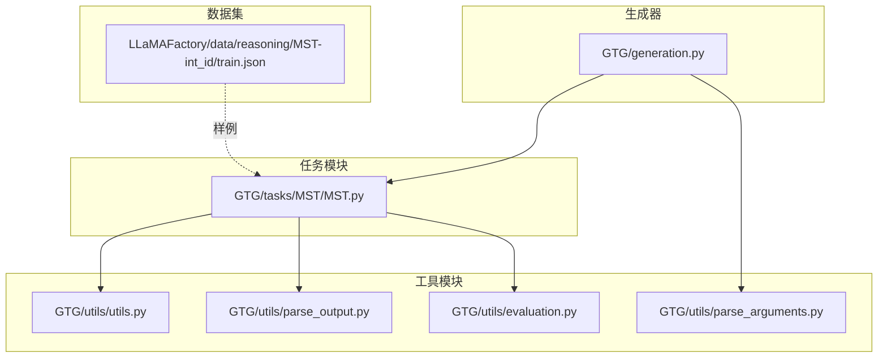
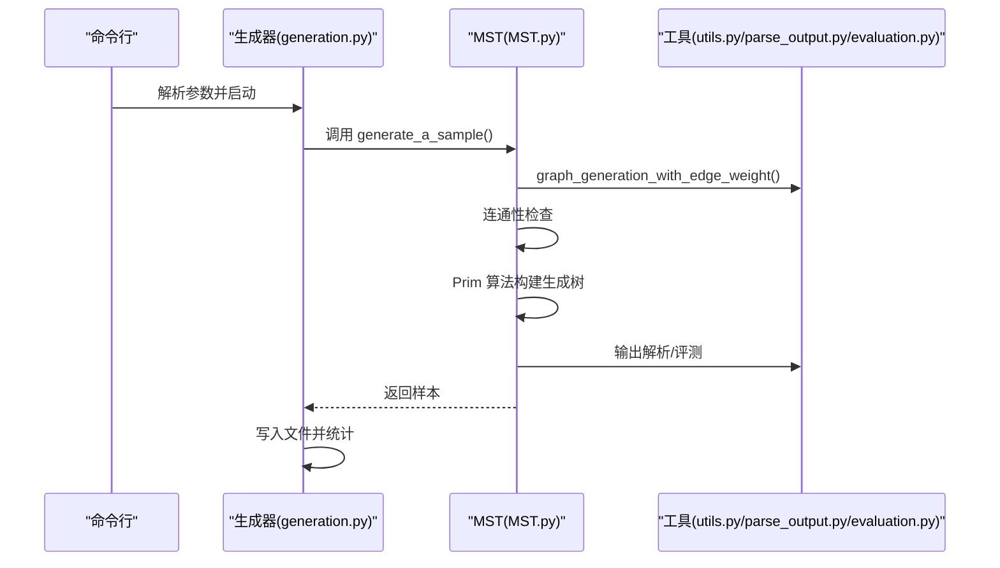
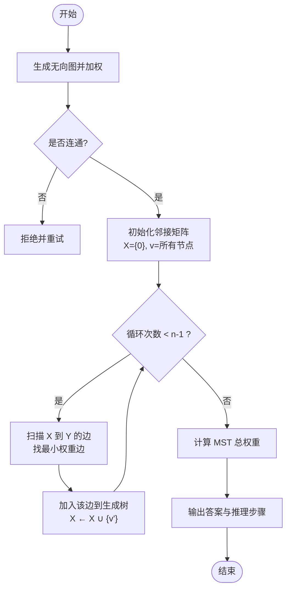
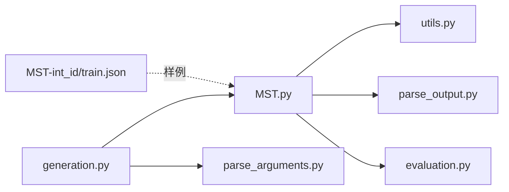

# 最小生成树

<cite>
**本文引用的文件**
- [MST.py](file://GTG/tasks/MST/MST.py)
- [utils.py](file://GTG/utils/utils.py)
- [generation.py](file://GTG/generation.py)
- [parse_arguments.py](file://GTG/utils/parse_arguments.py)
- [parse_output.py](file://GTG/utils/parse_output.py)
- [evaluation.py](file://GTG/utils/evaluation.py)
- [MST-int_id/train.json](file://LLaMAFactory/data/reasoning/MST-int_id/train.json)
</cite>

## 目录
1. [引言](#引言)
2. [项目结构](#项目结构)
3. [核心组件](#核心组件)
4. [架构总览](#架构总览)
5. [详细组件分析](#详细组件分析)
6. [依赖关系分析](#依赖关系分析)
7. [性能考量](#性能考量)
8. [故障排查指南](#故障排查指南)
9. [结论](#结论)
10. [附录](#附录)

## 引言
本文件围绕 GraphInstruct 仓库中的最小生成树（Minimum Spanning Tree, MST）任务进行系统化技术文档梳理。目标是深入解析 MST.py 中的 Prim 算法实现机制，阐明其在图结构输入预处理、权重边排序策略、生成树构建过程中的环检测逻辑、终止条件与时间复杂度优化；同时指出该实现未包含 Kruskal 算法与并查集、最小堆等数据结构的使用情况，并给出针对稀疏图与稠密图的性能差异与改进建议。此外，提供典型测试用例的构建方式与正确性验证方法。

## 项目结构
MST 任务位于 GTG/tasks/MST/MST.py，配套的图生成、解析与评估工具位于 GTG/utils 下，训练数据样例位于 LLaMAFactory/data/reasoning/MST-int_id/train.json。

图表来源
- [MST.py](file://GTG/tasks/MST/MST.py#L1-L267)
- [utils.py](file://GTG/utils/utils.py#L1-L617)
- [parse_output.py](file://GTG/utils/parse_output.py#L1-L213)
- [evaluation.py](file://GTG/utils/evaluation.py#L1-L283)
- [generation.py](file://GTG/generation.py#L1-L107)
- [MST-int_id/train.json](file://LLaMAFactory/data/reasoning/MST-int_id/train.json#L1-L200)

章节来源
- [MST.py](file://GTG/tasks/MST/MST.py#L1-L267)
- [generation.py](file://GTG/generation.py#L1-L107)

## 核心组件
- MST 任务主文件：提供问题生成、答案与推理步骤生成、选项生成、样本生成与评测器。
- 图工具：提供图生成、邻接矩阵转换、节点 ID 映射、自然语言描述等。
- 输出解析：提供包裹答案提取、整数/浮点解析、列表/字典解析等。
- 评测器：提供整数评测器，用于最终答案正确性判定。
- 生成器：统一入口，按配置生成样本并保存统计信息。

章节来源
- [MST.py](file://GTG/tasks/MST/MST.py#L1-L267)
- [utils.py](file://GTG/utils/utils.py#L1-L617)
- [parse_output.py](file://GTG/utils/parse_output.py#L1-L213)
- [evaluation.py](file://GTG/utils/evaluation.py#L1-L283)
- [generation.py](file://GTG/generation.py#L1-L107)

## 架构总览
MST 的运行流程如下：
- 生成器读取命令行参数，定位 MST 模块。
- MST 模块生成随机无向图（带权重），检查连通性后进入推理步骤生成。
- 推理步骤采用 Prim 算法逐步扩展生成树，记录每一步选择的边与累计权重。
- 生成器将样本写入文件并输出统计信息。

图表来源
- [generation.py](file://GTG/generation.py#L1-L107)
- [MST.py](file://GTG/tasks/MST/MST.py#L1-L267)
- [utils.py](file://GTG/utils/utils.py#L352-L366)
- [parse_output.py](file://GTG/utils/parse_output.py#L1-L213)
- [evaluation.py](file://GTG/utils/evaluation.py#L69-L80)

## 详细组件分析

### MST.py：Prim 算法实现与样本生成
- 问题生成：返回“求该图的最小生成树总权重”的指令字符串。
- 样本生成：
  - 使用图生成器生成无向图并添加随机权重。
  - 检查连通性，非连通则拒绝重试。
  - 将图转换为对称邻接矩阵（双向边权重相同），对角线设为 0。
  - 从节点 0 开始，循环执行 Prim 步骤：在已收集集合 X 与剩余集合 Y 间寻找最小权重边，加入该边并更新 X。
  - 终止条件：共收集 n-1 条边或完成 n-1 轮。
  - 同时通过 NetworkX 计算 MST 总权重作为参考答案，用于评测器比对。
- 选项生成：基于参考答案构造干扰项，形成四选一选择题格式。
- 评测器：IntEvaluator 将模型输出解析为整数并与参考答案比较。

图表来源
- [MST.py](file://GTG/tasks/MST/MST.py#L1-L267)

章节来源
- [MST.py](file://GTG/tasks/MST/MST.py#L16-L109)
- [MST.py](file://GTG/tasks/MST/MST.py#L112-L200)
- [MST.py](file://GTG/tasks/MST/MST.py#L241-L261)

### 图结构输入预处理与权重处理
- 图生成：调用图生成器生成随机无向图，再为每条边分配随机权重。
- 邻接矩阵：将边数据转换为对称邻接矩阵，对角线置 0，自环或重复边以较小权重保留。
- 节点映射：使用 NID 对节点 ID 进行格式化输出，便于人类阅读。

章节来源
- [utils.py](file://GTG/utils/utils.py#L352-L366)
- [utils.py](file://GTG/utils/utils.py#L1-L617)

### 输出解析与评测
- 包裹答案提取：从模型输出中提取 <<<ANSWER>>> 区域内的文本。
- 整数解析：提取首个整数作为候选答案。
- 评测：IntEvaluator 将解析结果与参考答案比较，返回正确与否。

章节来源
- [parse_output.py](file://GTG/utils/parse_output.py#L1-L213)
- [evaluation.py](file://GTG/utils/evaluation.py#L69-L80)

### 生成器与配置
- 命令行参数：支持任务名、文件路径、采样数量、节点范围、链接概率、随机种子等。
- 统计输出：生成 CSV 文件并统计平均度、是否定向等指标。

章节来源
- [parse_arguments.py](file://GTG/utils/parse_arguments.py#L1-L28)
- [generation.py](file://GTG/generation.py#L1-L107)

## 依赖关系分析
- MST.py 依赖 utils.py 的图生成与邻接矩阵转换、NID 节点 ID 格式化。
- MST.py 依赖 parse_output.py 的答案包裹提取与整数解析。
- MST.py 依赖 evaluation.py 的评测器。
- generation.py 作为统一入口，负责加载任务模块并生成样本。

图表来源
- [MST.py](file://GTG/tasks/MST/MST.py#L1-L267)
- [utils.py](file://GTG/utils/utils.py#L1-L617)
- [parse_output.py](file://GTG/utils/parse_output.py#L1-L213)
- [evaluation.py](file://GTG/utils/evaluation.py#L1-L283)
- [generation.py](file://GTG/generation.py#L1-L107)
- [parse_arguments.py](file://GTG/utils/parse_arguments.py#L1-L28)
- [MST-int_id/train.json](file://LLaMAFactory/data/reasoning/MST-int_id/train.json#L1-L200)

章节来源
- [MST.py](file://GTG/tasks/MST/MST.py#L1-L267)
- [generation.py](file://GTG/generation.py#L1-L107)

## 性能考量

### 当前实现的复杂度与优化
- Prim 实现细节：
  - 使用邻接矩阵存储图，每次在 X 到 Y 之间扫描所有可能边，寻找最小权重边。
  - 时间复杂度约为 O(n^2)，空间复杂度 O(n^2)。
  - 未使用最小堆优化，也未显式维护“跨切分的候选边集合”。
- 稀疏图 vs 稠密图：
  - 稀疏图：n 较大但边数较少，O(n^2) 扫描仍较高效，但可考虑使用最小堆优化。
  - 稠密图：n 较大且接近完全图，O(n^2) 可能成为瓶颈。
- 可选优化方向（当前实现未采用）：
  - 使用最小堆维护“跨切分的候选边”，每次弹出最小边，避免全表扫描。
  - 若需要 Kruskal 算法，需引入并查集（Union-Find）以检测环，边排序后按权重递增选取。
  - 并查集路径压缩与按秩合并可将查找与合并近似 O(α(n))。

章节来源
- [MST.py](file://GTG/tasks/MST/MST.py#L42-L109)
- [MST.py](file://GTG/tasks/MST/MST.py#L132-L200)

## 故障排查指南
- 连通性问题：若生成的图不连通，将被拒绝并重新生成。可通过增大平均度或调整图生成策略缓解。
- 输出格式：确保模型输出符合 <<<ANSWER>>> 包裹格式，否则解析失败。
- 节点 ID：使用 NID 格式化节点 ID，避免混淆。
- 评测失败：确认模型输出整数，且与参考答案一致。

章节来源
- [MST.py](file://GTG/tasks/MST/MST.py#L22-L31)
- [parse_output.py](file://GTG/utils/parse_output.py#L1-L213)
- [evaluation.py](file://GTG/utils/evaluation.py#L69-L80)

## 结论
- MST.py 当前实现采用 Prim 算法，通过邻接矩阵扫描实现，时间复杂度 O(n^2)，适用于中小规模图；未使用最小堆与并查集。
- 通过 NetworkX 计算 MST 总权重作为参考答案，配合 IntEvaluator 完成评测。
- 若需进一步提升性能与覆盖 Kruskal 算法，建议引入最小堆与并查集，并在稀疏图场景优先使用堆优化的 Prim 或 Kruskal。

## 附录

### 典型测试用例构建与验证
- 构建方式：
  - 使用命令行参数指定任务为 MST，设置采样数量与节点范围，运行生成器。
  - 生成器会调用 MST.generate_a_sample()，内部完成图生成、连通性检查、Prim 推理步骤与答案计算。
- 验证方法：
  - 使用 IntEvaluator 将模型输出解析为整数并与参考答案比对。
  - 可参考训练数据样例，观察输出格式与推理步骤是否与预期一致。

章节来源
- [generation.py](file://GTG/generation.py#L1-L107)
- [MST-int_id/train.json](file://LLaMAFactory/data/reasoning/MST-int_id/train.json#L1-L200)
- [evaluation.py](file://GTG/utils/evaluation.py#L69-L80)