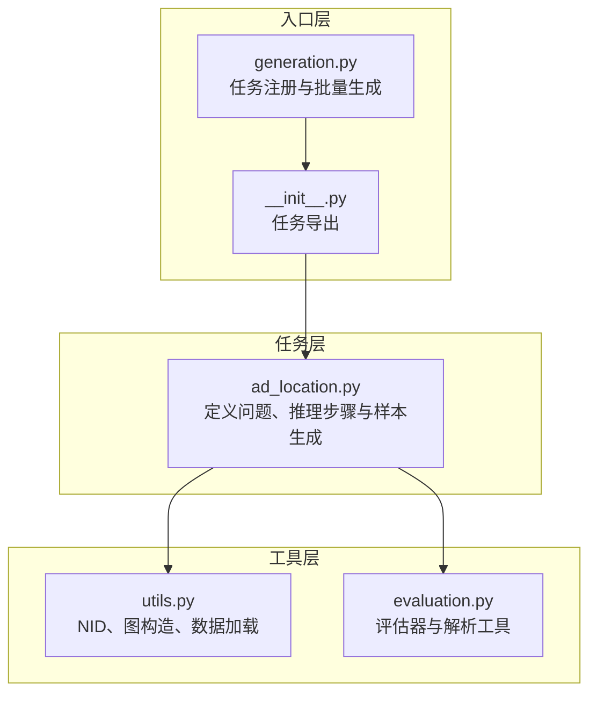
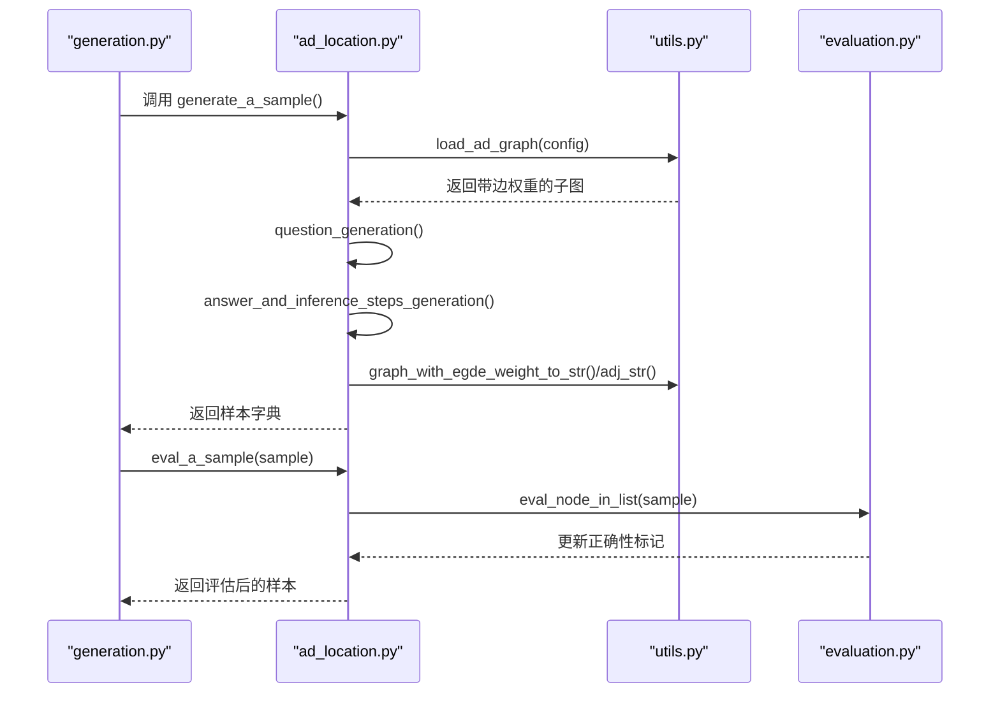
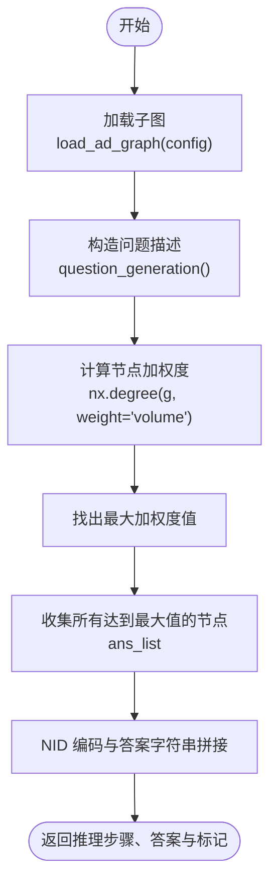
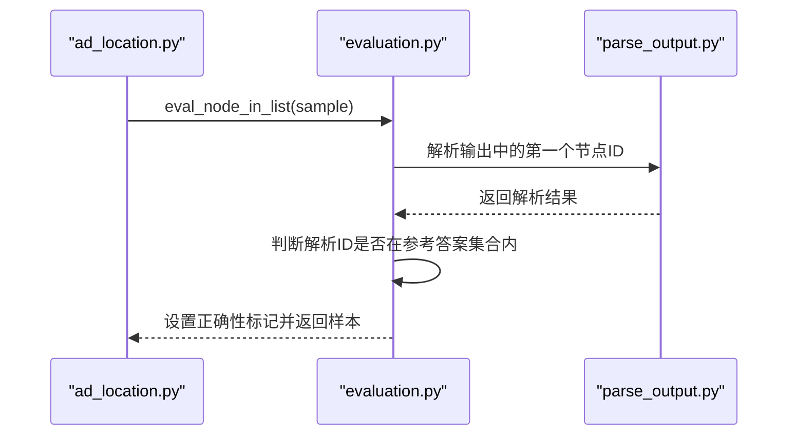
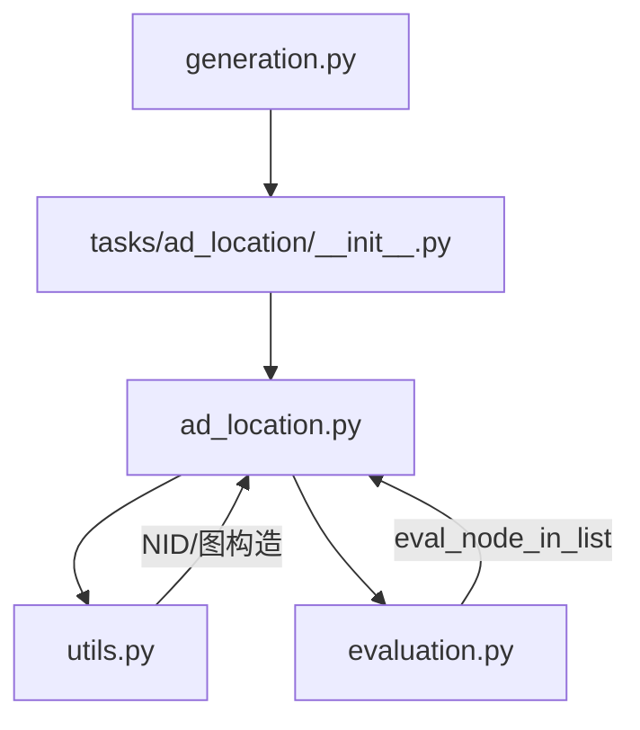

# 广告位布局优化

<cite>
**本文引用的文件**
- [ad_location.py](file://GTG/tasks/ad_location/ad_location.py)
- [evaluation.py](file://GTG/utils/evaluation.py)
- [utils.py](file://GTG/utils/utils.py)
- [generation.py](file://GTG/generation.py)
- [__init__.py](file://GTG/tasks/ad_location/__init__.py)
</cite>

## 目录
1. [引言](#引言)
2. [项目结构](#项目结构)
3. [核心组件](#核心组件)
4. [架构总览](#架构总览)
5. [详细组件分析](#详细组件分析)
6. [依赖关系分析](#依赖关系分析)
7. [性能考量](#性能考量)
8. [故障排查指南](#故障排查指南)
9. [结论](#结论)
10. [附录](#附录)

## 引言
本文件围绕广告位布局优化问题在图论上的建模与实现进行系统化讲解。该问题被抽象为“最大化曝光选址”问题：给定城市路网（有向图），边上的权重表示交通流量，目标是选择一个节点作为广告牌位置，使得该节点的“入出流量之和”（即节点的加权度）最大，从而获得最多的潜在观看人数。本文将从问题建模、通用性设计、算法实现、答案解析与评估、以及局限性与改进方向等方面展开，帮助读者全面理解该任务的设计思想与工程实现。

## 项目结构
与广告位布局优化直接相关的模块与文件如下：
- 任务定义与生成：GTG/tasks/ad_location/ad_location.py
- 通用评估工具：GTG/utils/evaluation.py
- 图与节点ID处理工具：GTG/utils/utils.py
- 数据集加载与采样：GTG/utils/utils.py 中的 load_ad_graph
- 任务注册与入口：GTG/generation.py、GTG/tasks/ad_location/__init__.py

图表来源
- [ad_location.py](file://GTG/tasks/ad_location/ad_location.py#L1-L70)
- [utils.py](file://GTG/utils/utils.py#L553-L581)
- [evaluation.py](file://GTG/utils/evaluation.py#L202-L263)
- [generation.py](file://GTG/generation.py#L29-L57)
- [__init__.py](file://GTG/tasks/ad_location/__init__.py#L1-L2)

章节来源
- [ad_location.py](file://GTG/tasks/ad_location/ad_location.py#L1-L70)
- [utils.py](file://GTG/utils/utils.py#L553-L581)
- [evaluation.py](file://GTG/utils/evaluation.py#L202-L263)
- [generation.py](file://GTG/generation.py#L29-L57)
- [__init__.py](file://GTG/tasks/ad_location/__init__.py#L1-L2)

## 核心组件
- 问题生成函数：question_generation，负责构造自然语言问题描述，强调“最大化曝光”的目标与“交通流量”作为权重的背景。
- 推理与答案生成函数：answer_and_inference_steps_generation，核心算法通过计算每个节点的加权度（基于边权重“volume”）来确定最优候选节点集合。
- 样本生成函数：generate_a_sample，封装问题、推理步骤、答案字符串与图的字符串表示，形成标准样本格式。
- 评估函数：eval_a_sample，调用 eval_node_in_list 实现对多答案集合的匹配验证。

章节来源
- [ad_location.py](file://GTG/tasks/ad_location/ad_location.py#L15-L69)

## 架构总览
下图展示了广告位布局优化任务从数据加载到样本生成与评估的整体流程。

图表来源
- [generation.py](file://GTG/generation.py#L29-L57)
- [ad_location.py](file://GTG/tasks/ad_location/ad_location.py#L42-L69)
- [utils.py](file://GTG/utils/utils.py#L99-L175)
- [evaluation.py](file://GTG/utils/evaluation.py#L202-L263)

## 详细组件分析

### 问题建模与通用性设计
- 建模思路：将“广告位布局优化”抽象为“最大化曝光选址”。节点的“曝光量”由其邻接边的流量权重之和衡量，即节点的加权度。因此，问题转化为在给定图上寻找加权度最大的节点集合。
- 通用性设计：question_generation 不指定具体节点，而是以“最大化曝光”为目标，面向任意输入图（只要边权重为“volume”）。这保证了问题描述的可迁移性与通用性，适用于不同规模与拓扑的路网。

章节来源
- [ad_location.py](file://GTG/tasks/ad_location/ad_location.py#L15-L19)

### 答案生成与推理步骤
- 核心算法：answer_and_inference_steps_generation 使用 NetworkX 的度计算接口，按边权重“volume”聚合每个节点的总流量，得到“节点加权度”。
- 最优解筛选：找到最大加权度值，收集所有达到该值的节点，形成候选集合 ans_list。
- NID 编码：将候选节点列表转换为统一的 NID 格式输出；同时生成人类可读的答案字符串列表，便于展示与调试。
- 多解处理：当存在多个最优解时，ans_list 包含全部最优节点，确保评估阶段能接受任一正确答案。

图表来源
- [ad_location.py](file://GTG/tasks/ad_location/ad_location.py#L22-L39)
- [utils.py](file://GTG/utils/utils.py#L56-L63)

章节来源
- [ad_location.py](file://GTG/tasks/ad_location/ad_location.py#L22-L39)
- [utils.py](file://GTG/utils/utils.py#L56-L63)

### 数据加载与图构造
- 数据来源：load_ad_graph 从外部交通网络文件加载，构建有向图，边属性包含“volume”（流量）与“cost”（成本）。
- 子图采样：通过 ego_graph 以随机中心节点为中心，半径为固定值，截取局部子图，限制节点规模，提升训练效率与稳定性。
- 节点重映射：将原始节点 ID 重新映射为连续整数，保证节点编号规范且与 NID 编码一致。

章节来源
- [utils.py](file://GTG/utils/utils.py#L553-L581)

### 样本生成与展示
- 样本字段：generate_a_sample 组装标准样本字典，包含任务名、图的边列表字符串、邻接表字符串、节点列表、节点数量、边数量、是否为有向图、问题、答案等。
- 可视化：graph_with_egde_weight_to_str 与 graph_with_egde_weight_to_adj_str 将带权重的图转为人类可读字符串，便于展示与调试。

章节来源
- [ad_location.py](file://GTG/tasks/ad_location/ad_location.py#L42-L59)
- [utils.py](file://GTG/utils/utils.py#L99-L175)

### 评估与多答案匹配
- 评估器：eval_a_sample 调用 eval_node_in_list，实现对“输出中首个节点ID”的解析与匹配。该评估器允许输出中包含多个候选节点，只要其中任一节点属于参考答案集合，即判定为正确。
- 多答案支持：由于可能存在多个最优节点，ans_list 会包含全部最优节点；eval_node_in_list 的匹配逻辑天然支持多答案集合的验证。

图表来源
- [ad_location.py](file://GTG/tasks/ad_location/ad_location.py#L64-L69)
- [evaluation.py](file://GTG/utils/evaluation.py#L202-L263)

章节来源
- [ad_location.py](file://GTG/tasks/ad_location/ad_location.py#L64-L69)
- [evaluation.py](file://GTG/utils/evaluation.py#L202-L263)

## 依赖关系分析
- 模块耦合：
  - ad_location.py 依赖 utils.py 中的 NID、图构造与数据加载函数，以及 evaluation.py 中的 eval_node_in_list。
  - generation.py 通过任务注册将 ad_location 模块纳入统一生成流程。
- 关键依赖链：
  - generation.py -> ad_location.__init__ -> ad_location.generate_a_sample -> utils.load_ad_graph -> utils.graph_with_egde_weight_to_str/adj_str
  - ad_location.eval_a_sample -> utils.NID -> evaluation.eval_node_in_list

图表来源
- [generation.py](file://GTG/generation.py#L29-L57)
- [__init__.py](file://GTG/tasks/ad_location/__init__.py#L1-L2)
- [ad_location.py](file://GTG/tasks/ad_location/ad_location.py#L1-L70)
- [utils.py](file://GTG/utils/utils.py#L56-L63)
- [evaluation.py](file://GTG/utils/evaluation.py#L202-L263)

章节来源
- [generation.py](file://GTG/generation.py#L29-L57)
- [__init__.py](file://GTG/tasks/ad_location/__init__.py#L1-L2)
- [ad_location.py](file://GTG/tasks/ad_location/ad_location.py#L1-L70)
- [utils.py](file://GTG/utils/utils.py#L56-L63)
- [evaluation.py](file://GTG/utils/evaluation.py#L202-L263)

## 性能考量
- 度计算复杂度：NetworkX 的度计算在稀疏图上通常为 O(E)，E 为边数；在大规模路网中，建议控制子图规模（ego_graph 半径与节点上限）以避免度计算开销过大。
- 多解处理：当存在多个最优节点时，ans_list 会包含全部最优节点，评估阶段仍为 O(k)（k 为候选数量），k 通常较小。
- I/O 与数据加载：load_ad_graph 从外部文件读取并构造图，建议缓存常用子图或预处理数据以减少重复 I/O。

[本节提供一般性指导，无需特定文件来源]

## 故障排查指南
- 输出未命中答案：
  - 检查输出是否包含“Answer:”后的节点ID；eval_a_sample 会尝试解析首个节点ID并与答案集合比较。
  - 若输出包含多个候选节点，确认至少有一个在答案集合中。
- 节点ID格式问题：
  - 确认输出节点ID与 NID 编码一致（形如“<x>”），避免纯数字或无格式导致解析失败。
- 数据加载异常：
  - 确认外部交通文件路径与列名一致；检查 ego_graph 截取是否成功以及节点重映射是否正确。

章节来源
- [ad_location.py](file://GTG/tasks/ad_location/ad_location.py#L64-L69)
- [evaluation.py](file://GTG/utils/evaluation.py#L202-L263)

## 结论
该任务将广告位布局优化问题转化为“最大化节点加权度”的图论问题，通过边权重“volume”衡量流量，使用 NetworkX 的度计算快速定位最优候选节点集合。问题描述采用通用化设计，不绑定具体节点，适合大规模、多样化的路网场景。评估阶段支持多答案匹配，增强了鲁棒性。整体实现简洁高效，具备良好的可扩展性。

[本节为总结性内容，无需特定文件来源]

## 附录

### 与实际应用的契合度与局限性
- 合理性：
  - 将“流量”作为曝光潜力的代理变量，符合直觉；在城市路网中，靠近主干道或交叉口的节点通常具有更高的车流/人流。
- 局限性：
  - 未考虑广告位竞争：同一地点可能已有其他广告牌，影响实际曝光效果。
  - 未考虑视线遮挡：高层建筑、树木、护栏等可能遮挡广告牌，降低可视性。
  - 未考虑时间变化：交通流量随时间段变化，静态权重无法反映高峰/平峰差异。
  - 未考虑节点容量：某些节点可能物理空间有限，无法承载过多广告牌。
  - 未考虑用户行为：不同区域的人群密度、移动方向、注意力分布不同，仅靠流量难以完全刻画曝光价值。

### 改进建议
- 引入节点容量约束：为每个节点设置最大广告牌数量，避免过度拥挤。
- 动态流量权重：按时间段或天气条件调整边权重，使模型更具时效性。
- 多因子融合：将流量、人口密度、视线质量、竞争程度等综合建模为节点评分。
- 场景化细化：针对商业区、住宅区、工业区等不同区域设定差异化权重策略。

[本节为概念性讨论，无需特定文件来源]