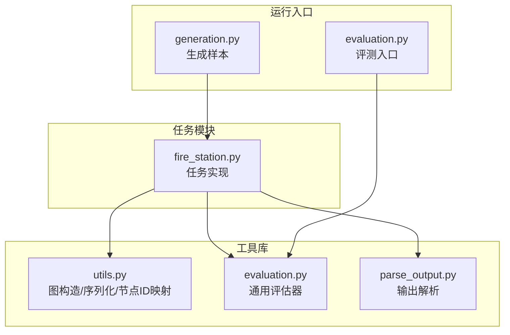
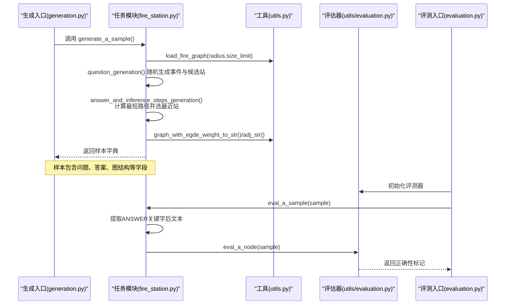
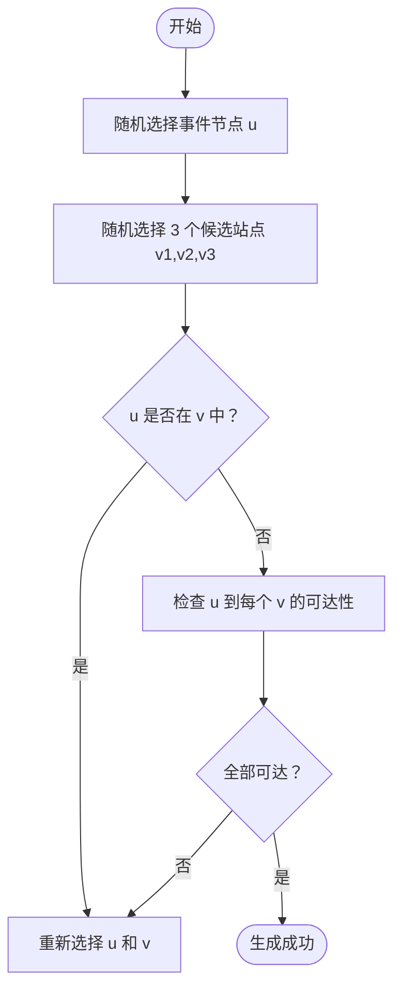
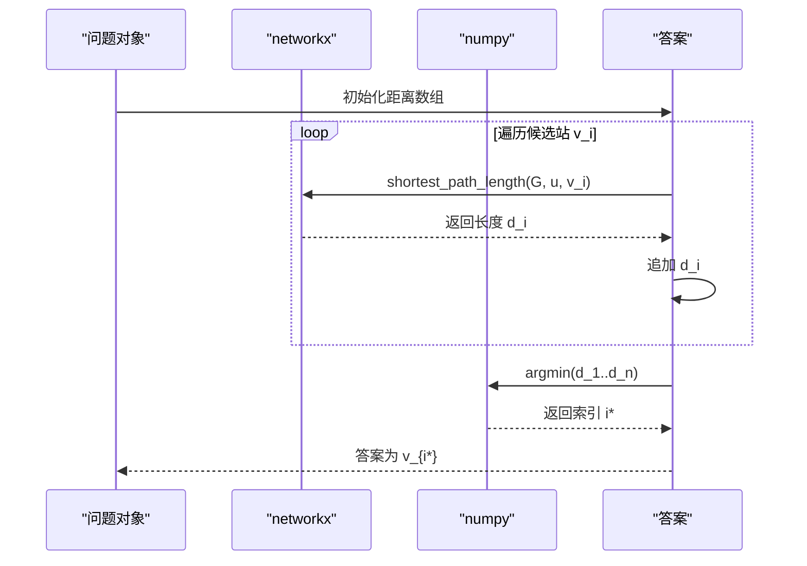
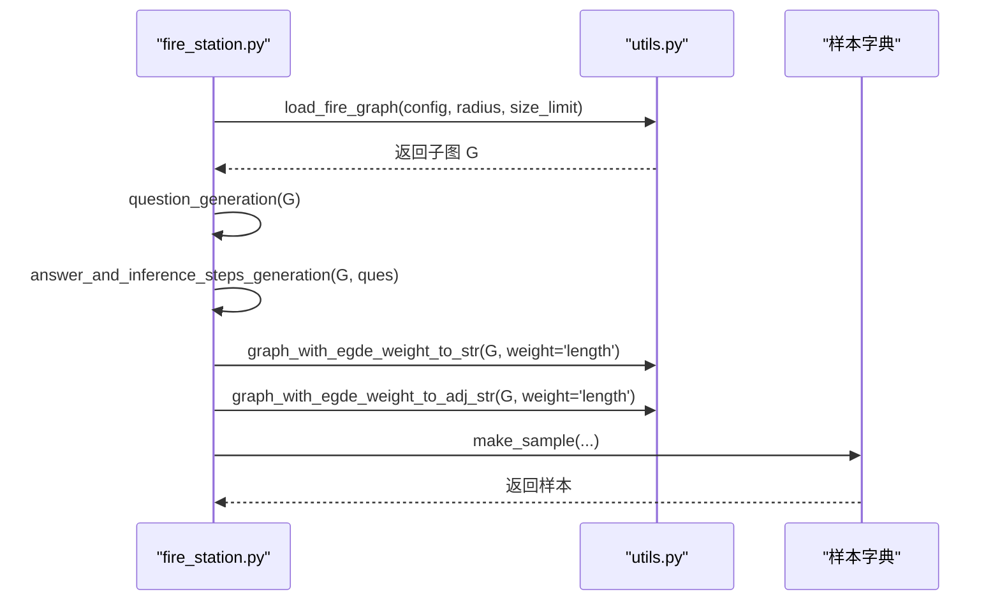
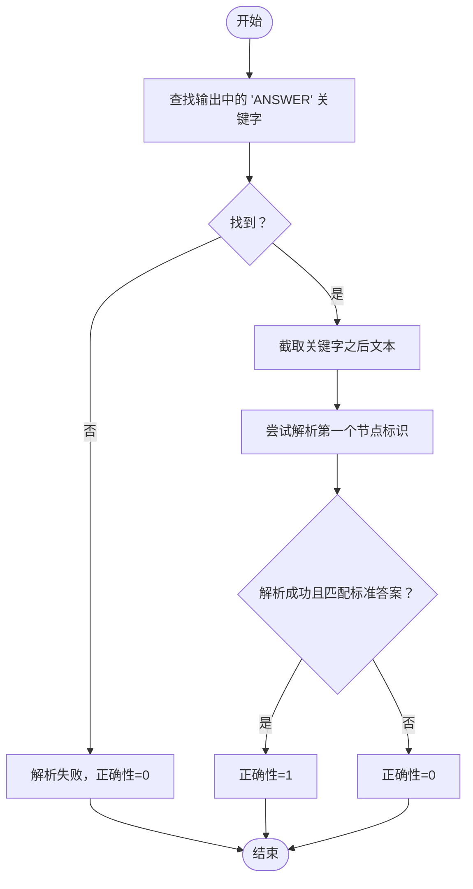
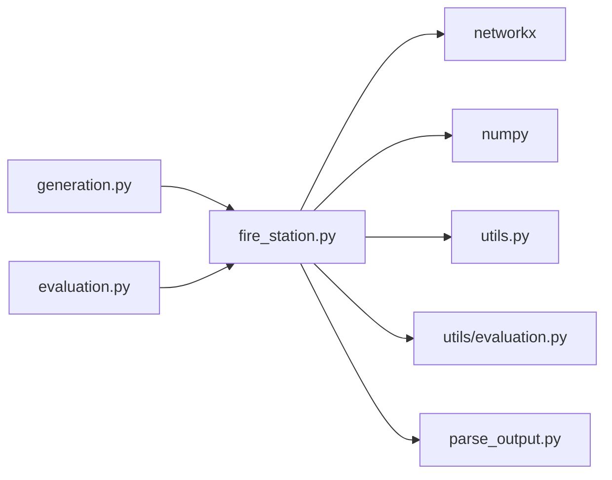

# 消防站选址问题

<cite>
**本文引用的文件列表**
- [fire_station.py](file://GTG/tasks/fire_station/fire_station.py)
- [utils.py](file://GTG/utils/utils.py)
- [evaluation.py](file://GTG/utils/evaluation.py)
- [generation.py](file://GTG/generation.py)
- [parse_output.py](file://GTG/utils/parse_output.py)
</cite>

## 目录
1. [引言](#引言)
2. [项目结构](#项目结构)
3. [核心组件](#核心组件)
4. [架构总览](#架构总览)
5. [详细组件分析](#详细组件分析)
6. [依赖关系分析](#依赖关系分析)
7. [性能考量](#性能考量)
8. [故障排查指南](#故障排查指南)
9. [结论](#结论)
10. [附录](#附录)

## 引言
本文件围绕“消防站选址问题”展开，系统解析 fire_station.py 中如何将现实中的应急响应决策建模为基于最短路径的图论问题：以事件发生地为起点，候选消防站为多个终点，通过网络拓扑与边权重（交通距离）计算最短路径，优先选择最近的消防站进行响应。文档还覆盖了问题样本生成、连通性约束、路径计算与答案解析规则，并给出在真实城市路网数据上的测试建议与扩展思路。

## 项目结构
本任务位于 GTG/tasks/fire_station/fire_station.py，配套的图构建、可视化与评估工具位于 GTG/utils/utils.py、GTG/utils/evaluation.py、GTG/utils/parse_output.py，以及生成与评估入口脚本 GTG/generation.py、GTG/evaluation.py。

图表来源
- [fire_station.py](file://GTG/tasks/fire_station/fire_station.py#L1-L78)
- [utils.py](file://GTG/utils/utils.py#L585-L616)
- [evaluation.py](file://GTG/utils/evaluation.py#L224-L242)
- [parse_output.py](file://GTG/utils/parse_output.py#L56-L63)
- [generation.py](file://GTG/generation.py#L1-L107)
- [evaluation.py](file://GTG/evaluation.py#L1-L73)

章节来源
- [fire_station.py](file://GTG/tasks/fire_station/fire_station.py#L1-L78)
- [utils.py](file://GTG/utils/utils.py#L585-L616)
- [generation.py](file://GTG/generation.py#L1-L107)
- [evaluation.py](file://GTG/evaluation.py#L1-L73)

## 核心组件
- 任务名称与计数：定义任务名并维护样本计数。
- 问题生成：随机生成火灾事件与候选消防站位置，确保事件与各候选站之间存在路径（连通性）。
- 推理步骤与答案：对每个候选站计算到事件点的最短路径长度，取最小者作为答案。
- 样本生成：加载真实城市路网子图，构造自然语言问题与图结构字符串，封装为样本。
- 答案解析：从模型输出中提取“ANSWER”关键字后的文本，再按节点格式解析并比对标准答案。

章节来源
- [fire_station.py](file://GTG/tasks/fire_station/fire_station.py#L10-L13)
- [fire_station.py](file://GTG/tasks/fire_station/fire_station.py#L15-L33)
- [fire_station.py](file://GTG/tasks/fire_station/fire_station.py#L36-L47)
- [fire_station.py](file://GTG/tasks/fire_station/fire_station.py#L50-L69)
- [fire_station.py](file://GTG/tasks/fire_station/fire_station.py#L72-L77)

## 架构总览
下图展示从生成到评测的整体流程，以及关键模块之间的调用关系。

图表来源
- [generation.py](file://GTG/generation.py#L1-L107)
- [fire_station.py](file://GTG/tasks/fire_station/fire_station.py#L50-L69)
- [utils.py](file://GTG/utils/utils.py#L99-L175)
- [evaluation.py](file://GTG/utils/evaluation.py#L224-L242)

## 详细组件分析

### 问题建模与事件/站点选择逻辑
- 事件节点与候选站点：事件节点 u 与候选站点集合 v 均来自同一图 G 的节点集。候选数量固定为 3。
- 连通性约束：在生成阶段，要求事件节点与每个候选站点之间均存在路径，避免出现不可达的情况导致推理无意义。
- 图结构与权重：真实路网数据以有向图为基础，通过 ego_graph 截取局部子图，边权重为 length（交通距离），用于后续最短路径计算。

图表来源
- [fire_station.py](file://GTG/tasks/fire_station/fire_station.py#L15-L33)

章节来源
- [fire_station.py](file://GTG/tasks/fire_station/fire_station.py#L15-L33)

### 最短路径计算与最小距离选择策略
- 路径计算：对每个候选站点，使用 networkx.shortest_path_length 计算事件节点到该站点的最短路径长度。
- 最小距离选择：比较所有候选站的距离，取最小值对应的站点作为最终答案。
- 步骤字符串：当前实现未生成推理步骤字符串，仅返回空串。

图表来源
- [fire_station.py](file://GTG/tasks/fire_station/fire_station.py#L36-L47)

章节来源
- [fire_station.py](file://GTG/tasks/fire_station/fire_station.py#L36-L47)

### 样本生成与图结构序列化
- 图加载：使用 load_fire_graph 加载真实城市路网子图，支持 radius 与 size_limit 参数控制截取范围与规模。
- 问题构造：将事件与候选站信息格式化为自然语言问题字符串。
- 样本封装：通过 make_sample 将图结构（边列表与邻接表，带权重）与问题、答案等打包为样本字典。

图表来源
- [fire_station.py](file://GTG/tasks/fire_station/fire_station.py#L50-L69)
- [utils.py](file://GTG/utils/utils.py#L99-L175)
- [utils.py](file://GTG/utils/utils.py#L585-L616)

章节来源
- [fire_station.py](file://GTG/tasks/fire_station/fire_station.py#L50-L69)
- [utils.py](file://GTG/utils/utils.py#L99-L175)
- [utils.py](file://GTG/utils/utils.py#L585-L616)

### 答案解析规则与节点匹配验证
- 关键字提取：从模型输出中查找“ANSWER”关键字，截取其后的文本作为候选答案片段。
- 节点解析：使用 eval_a_node 对候选答案进行节点格式解析，要求输出必须是合法节点标识（形如 <x>）且与标准答案一致。
- 评测流程：eval_a_sample 先做关键字提取，再委托通用评估器完成解析与正确性判定。

图表来源
- [fire_station.py](file://GTG/tasks/fire_station/fire_station.py#L72-L77)
- [evaluation.py](file://GTG/utils/evaluation.py#L224-L242)
- [parse_output.py](file://GTG/utils/parse_output.py#L56-L63)

章节来源
- [fire_station.py](file://GTG/tasks/fire_station/fire_station.py#L72-L77)
- [evaluation.py](file://GTG/utils/evaluation.py#L224-L242)
- [parse_output.py](file://GTG/utils/parse_output.py#L56-L63)

## 依赖关系分析
- fire_station.py 依赖：
  - utils.py：节点 ID 映射、图序列化、真实路网加载。
  - networkx：最短路径计算。
  - numpy：数组与 argmin。
- 评测链路：
  - generation.py 调用 fire_station.generate_a_sample 生成样本。
  - evaluation.py 调用 fire_station.eval_a_sample 对样本进行评测。
  - utils/evaluation.py 提供 eval_a_node 通用节点解析与正确性判断。

图表来源
- [fire_station.py](file://GTG/tasks/fire_station/fire_station.py#L1-L78)
- [utils.py](file://GTG/utils/utils.py#L585-L616)
- [generation.py](file://GTG/generation.py#L1-L107)
- [evaluation.py](file://GTG/evaluation.py#L1-L73)
- [parse_output.py](file://GTG/utils/parse_output.py#L56-L63)

章节来源
- [fire_station.py](file://GTG/tasks/fire_station/fire_station.py#L1-L78)
- [utils.py](file://GTG/utils/utils.py#L585-L616)
- [generation.py](file://GTG/generation.py#L1-L107)
- [evaluation.py](file://GTG/evaluation.py#L1-L73)
- [parse_output.py](file://GTG/utils/parse_output.py#L56-L63)

## 性能考量
- 路径计算复杂度：对每个候选站执行一次 shortest_path_length，整体复杂度近似 O(k·(V+E)) 或 O(k·V^2)，k=3，因此可忽略常数影响；在中小规模城市子图上通常可快速完成。
- 图规模控制：通过 load_fire_graph 的 radius 与 size_limit 控制子图规模，避免过大图导致路径计算耗时上升。
- 随机采样与重试：若候选站不可达，会重新采样，极端情况下可能多次重试，但概率较低。

[本节为一般性讨论，不直接分析具体文件，故无章节来源]

## 故障排查指南
- 输出未包含“ANSWER”关键字：eval_a_sample 会先定位关键字，若找不到则判定为错误。
- 节点格式不正确：eval_a_node 期望输出为形如 <x> 的节点标识，否则解析失败。
- 可达性问题：若事件与候选站之间不存在路径，question_generation 会持续重试，直到满足连通性为止。
- 图加载异常：load_fire_graph 依赖真实路网文件路径，若路径或列名不匹配会导致加载失败。

章节来源
- [fire_station.py](file://GTG/tasks/fire_station/fire_station.py#L72-L77)
- [utils.py](file://GTG/utils/utils.py#L585-L616)

## 结论
本任务将“应急响应选址”抽象为“事件到候选站的最短路径选择”，通过真实路网数据与连通性约束保证问题的现实合理性。生成与评测流程清晰，答案解析严格遵循节点格式规范。未来可在现有基础上扩展多消防站响应、服务半径限制与动态权重等更贴近实战的场景。

[本节为总结性内容，不直接分析具体文件，故无章节来源]

## 附录

### 在真实城市路网数据上的测试建议
- 图结构加载
  - 使用 load_fire_graph 加载 ChicagoRegional_net.tntp 数据，设置合理的 radius 与 size_limit，确保子图规模适中。
  - 可对比不同 radius 下的连通性与样本质量，观察子图密度与平均度的变化趋势。
- 服务半径敏感性分析
  - 固定事件与候选站，改变 radius，统计“可达性比例”“最短路径分布”“答案稳定性”等指标，评估半径对决策的影响。
- 多消防站响应扩展
  - 当前仅选择最近一站；可扩展为“在给定服务半径内选择若干最优站”，或引入“覆盖最大化”目标，结合图的中心性与可达性进行排序。
- 评测与可视化
  - 保存样本的图结构字符串与邻接表，便于人工复核与可视化分析。
  - 统计评测准确率、错误类型（解析失败/节点不匹配/可达性不足），定位问题根因。

[本节为实践建议，不直接分析具体文件，故无章节来源]