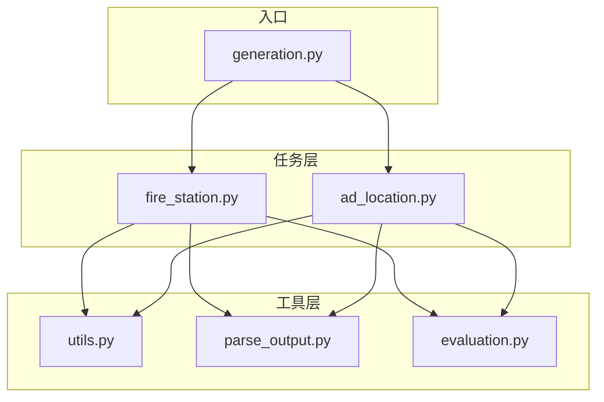
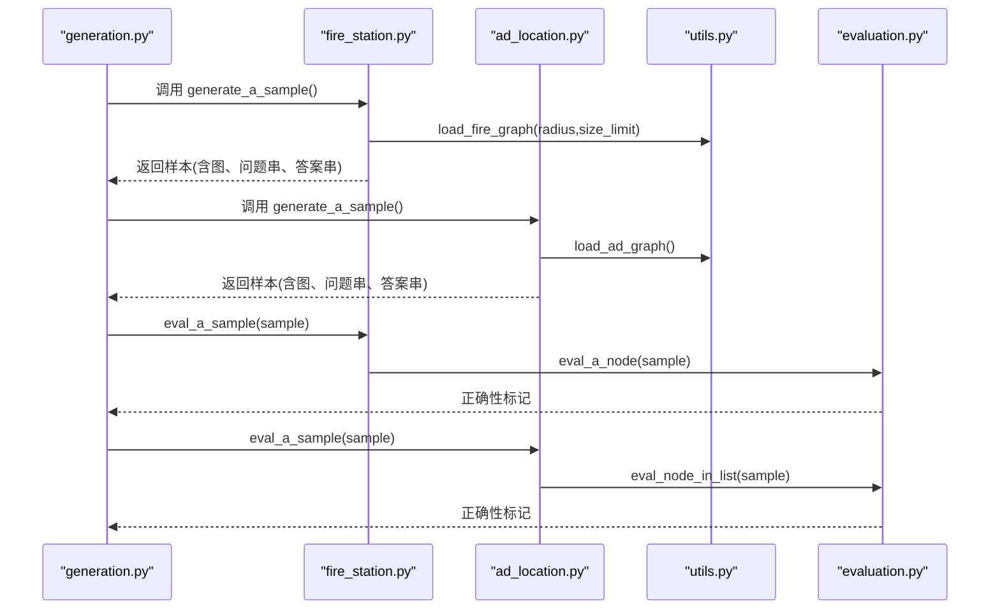
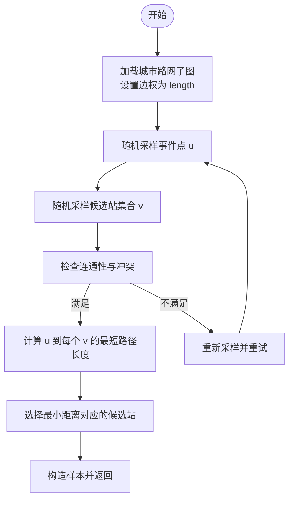
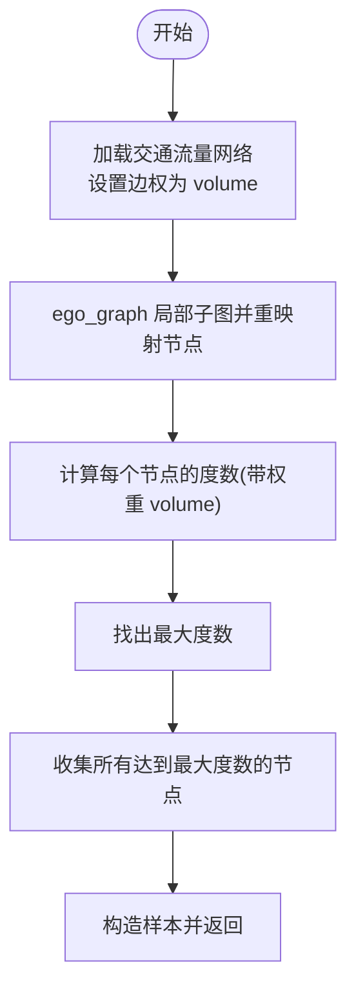
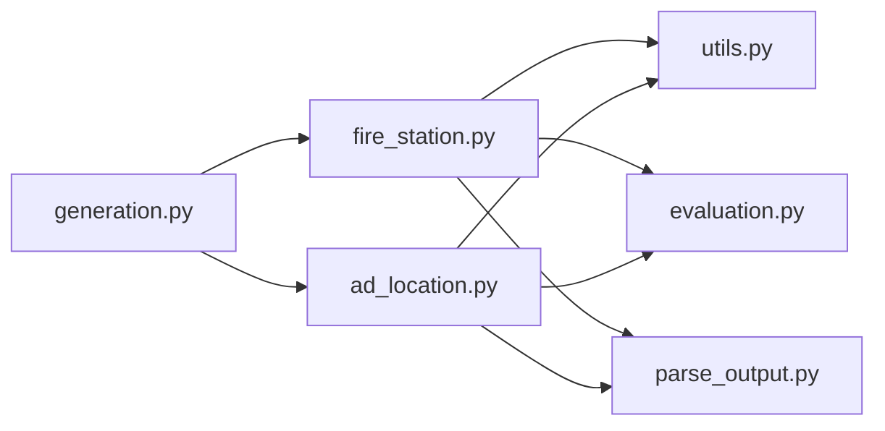

# 设施选址问题

<cite>
**本文引用的文件列表**
- [fire_station.py](file://GTG/tasks/fire_station/fire_station.py)
- [ad_location.py](file://GTG/tasks/ad_location/ad_location.py)
- [utils.py](file://GTG/utils/utils.py)
- [evaluation.py](file://GTG/utils/evaluation.py)
- [parse_output.py](file://GTG/utils/parse_output.py)
- [generation.py](file://GTG/generation.py)
</cite>

## 目录
1. [引言](#引言)
2. [项目结构](#项目结构)
3. [核心组件](#核心组件)
4. [架构总览](#架构总览)
5. [详细组件分析](#详细组件分析)
6. [依赖关系分析](#依赖关系分析)
7. [性能考量](#性能考量)
8. [故障排查指南](#故障排查指南)
9. [结论](#结论)
10. [附录](#附录)

## 引言
本文件围绕仓库中的两个设施选址类任务：消防站选址（fire_station）与广告位选址（ad_location），系统讲解其在真实城市路网上的图论建模方法与求解流程。重点包括：
- 将问题转化为图论模型：事件到设施的最短路径选择、基于流量度数的收益最大化。
- 候选位置集合生成规则、服务半径编码方式与冲突约束处理。
- 贪心近似策略与收益函数设计（最短距离优先、最大度数优先）。
- 近似比的理论保证与实际性能表现的讨论。
- 基于真实城市路网数据的模拟测试方案。

## 项目结构
该仓库采用“任务模块化 + 工具库 + 评测与解析”的分层组织方式：
- 任务层：各具体问题的实现，如 fire_station、ad_location。
- 工具层：通用图操作、数据加载、样本构造与可视化。
- 评测层：输出解析与正确性判定。

图表来源
- [fire_station.py](file://GTG/tasks/fire_station/fire_station.py#L1-L78)
- [ad_location.py](file://GTG/tasks/ad_location/ad_location.py#L1-L70)
- [utils.py](file://GTG/utils/utils.py#L1-L200)
- [evaluation.py](file://GTG/utils/evaluation.py#L1-L120)
- [parse_output.py](file://GTG/utils/parse_output.py#L1-L120)
- [generation.py](file://GTG/generation.py#L1-L45)

章节来源
- [generation.py](file://GTG/generation.py#L1-L45)

## 核心组件
- 消防站选址（fire_station）
  - 生成城市路网子图（ego_graph），设置边权为长度；随机选择事件点与候选消防站集合；计算最短路径并返回最近站点。
- 广告位选址（ad_location）
  - 加载交通流量网络，计算每个节点的入度/出度或带权重度数作为曝光收益；选择收益最大的节点集合。

章节来源
- [fire_station.py](file://GTG/tasks/fire_station/fire_station.py#L15-L77)
- [ad_location.py](file://GTG/tasks/ad_location/ad_location.py#L15-L69)
- [utils.py](file://GTG/utils/utils.py#L553-L616)

## 架构总览
下面给出两类设施选址问题在代码层面的调用序列与数据流。

图表来源
- [generation.py](file://GTG/generation.py#L29-L45)
- [fire_station.py](file://GTG/tasks/fire_station/fire_station.py#L50-L77)
- [ad_location.py](file://GTG/tasks/ad_location/ad_location.py#L42-L69)
- [utils.py](file://GTG/utils/utils.py#L553-L616)
- [evaluation.py](file://GTG/utils/evaluation.py#L224-L242)

## 详细组件分析

### 消防站选址（fire_station）分析
- 图构建与权重
  - 使用 ego_graph 以随机中心节点为中心扩展半径，形成局部路网子图；边权字段为 length。
- 候选集合生成
  - 随机选择事件点与三个候选站点；确保事件点与候选集合无重叠且彼此连通。
- 目标函数与贪心策略
  - 计算事件点到各候选站的最短路径长度，选择最小者作为答案。
- 输出与评测
  - 评测时先提取“Answer:”后的节点标识，再与标准答案比较。

图表来源
- [fire_station.py](file://GTG/tasks/fire_station/fire_station.py#L15-L47)
- [utils.py](file://GTG/utils/utils.py#L585-L616)

章节来源
- [fire_station.py](file://GTG/tasks/fire_station/fire_station.py#L15-L77)
- [utils.py](file://GTG/utils/utils.py#L585-L616)
- [evaluation.py](file://GTG/utils/evaluation.py#L224-L242)

### 广告位选址（ad_location）分析
- 图构建与权重
  - 读取交通流量网络，边权字段为 volume；对 ego_graph 子图进行节点重映射。
- 候选集合生成
  - 全图节点均可作为候选；通过度数（带权重 volume）衡量曝光收益。
- 目标函数与贪心策略
  - 选择度数最大者；若存在多个并列最大值，则返回全部候选。
- 输出与评测
  - 评测时允许输出为任一正确节点，只要包含答案集合中的节点即可。

图表来源
- [ad_location.py](file://GTG/tasks/ad_location/ad_location.py#L15-L39)
- [utils.py](file://GTG/utils/utils.py#L553-L582)
- [evaluation.py](file://GTG/utils/evaluation.py#L202-L221)

章节来源
- [ad_location.py](file://GTG/tasks/ad_location/ad_location.py#L15-L69)
- [utils.py](file://GTG/utils/utils.py#L553-L582)
- [evaluation.py](file://GTG/utils/evaluation.py#L202-L221)

### 图论建模与近似算法设计
- 模型转化
  - 消防站选址：事件点到候选站的最短路径选择，等价于“距离覆盖”问题的局部实例；目标是最小化最大服务距离。
  - 广告位选址：以节点度数（带权重 volume）衡量曝光收益，等价于“收益最大化”问题；目标是最大化覆盖/曝光。
- 贪心策略
  - 消防站选址：按最短距离优先选择候选站，属于“就近原则”的贪心近似。
  - 广告位选址：按度数优先选择节点，属于“局部最优”的贪心近似。
- 近似比与复杂度
  - 消防站选址：该问题在一般图上为 NP-hard；此处采用贪心近似，无法直接给出常数近似比，但在局部 ego_graph 上可视为近似可行。
  - 广告位选址：度数贪心在无权重图上对最大度数节点的选择是局部最优；在带权重图上，度数最大化仍是有效的启发式，但严格近似比需视权重分布而定。
- 复杂度分析
  - 单次样本生成：O(|E| + |V| log |V|)（Dijkstra 或 SPFA 计算单源最短路）；度数计算 O(|E|)。
  - 评测阶段：解析输出 O(L)，L 为输出长度；比较答案 O(k)，k 为答案集合大小。

章节来源
- [fire_station.py](file://GTG/tasks/fire_station/fire_station.py#L36-L47)
- [ad_location.py](file://GTG/tasks/ad_location/ad_location.py#L22-L39)
- [utils.py](file://GTG/utils/utils.py#L553-L616)

### 候选位置集合生成规则、服务半径与冲突约束
- 候选集合生成
  - 消防站：从全图中随机采样三个不同节点作为候选站，要求与事件点互异且彼此连通。
  - 广告位：全图节点均可作为候选。
- 服务半径编码
  - 通过 ego_graph 的 radius 参数控制局部子图规模；同时限制节点数不超过 size_limit，避免过大图导致评测开销过高。
- 冲突约束
  - 消防站：事件点不得与候选站重合；候选站之间必须存在路径（连通性检查）。
  - 广告位：无显式冲突约束，但可引入“邻域冲突”（例如相邻节点不可同时被选）作为扩展约束。

章节来源
- [fire_station.py](file://GTG/tasks/fire_station/fire_station.py#L15-L33)
- [utils.py](file://GTG/utils/utils.py#L585-L616)

### 数据结构与处理逻辑
- 图结构
  - 使用 NetworkX DiGraph，边权字段分别为 length（距离）与 volume（流量）。
- 数据转换
  - 将原始节点 ID 映射为连续整数，便于统一编号与评测。
- 样本构造
  - 统一输出 graph、graph_adj、question、answer 等字段，支持自然语言描述与邻接表两种表示。

章节来源
- [utils.py](file://GTG/utils/utils.py#L1-L200)
- [utils.py](file://GTG/utils/utils.py#L553-L616)

## 依赖关系分析
- 模块耦合
  - 任务模块仅依赖工具层的图加载与样本构造函数，耦合度低，内聚性强。
  - 评测模块独立于任务实现，通过统一的解析接口完成正确性判定。
- 外部依赖
  - NetworkX 用于图操作与最短路计算；pandas 用于读取 TNTP 格式数据。
- 可能的循环依赖
  - 当前结构无循环导入风险。

图表来源
- [fire_station.py](file://GTG/tasks/fire_station/fire_station.py#L1-L77)
- [ad_location.py](file://GTG/tasks/ad_location/ad_location.py#L1-L69)
- [utils.py](file://GTG/utils/utils.py#L1-L200)
- [evaluation.py](file://GTG/utils/evaluation.py#L1-L120)
- [parse_output.py](file://GTG/utils/parse_output.py#L1-L120)
- [generation.py](file://GTG/generation.py#L1-L45)

章节来源
- [generation.py](file://GTG/generation.py#L1-L45)

## 性能考量
- 时间复杂度
  - 最短路计算：单源最短路 O((|E| + |V|) log |V|)；全局度数统计 O(|E|)。
  - 样本生成：主要瓶颈在最短路与 ego_graph 构造；可通过减小 radius 与 size_limit 控制规模。
- 空间复杂度
  - 局部子图规模受 radius 与 size_limit 控制；边权存储为浮点数，空间开销与边数线性相关。
- 实际性能表现
  - 在大规模城市路网数据上，建议：
    - 降低 radius 与 size_limit，提升交互速度；
    - 对输出进行缓存与批量化评测；
    - 使用更高效的图库（如 C++ 扩展）替代纯 Python 实现。

## 故障排查指南
- 常见问题
  - 事件点与候选站重合：检查候选集合生成逻辑，确保去重与连通性校验。
  - 输出格式不规范：确认输出包含“Answer:”后跟随节点标识，使用解析器提取。
  - TNTP 文件路径错误：核对 load_ad_graph/load_fire_graph 中的文件路径是否正确。
- 定位手段
  - 使用 display_sample 打印样本关键字段，核对 graph、graph_adj、question、answer。
  - 在 generation.py 中设置固定随机种子，复现实验结果。
- 修复建议
  - 若评测失败率高，适当放宽 radius 或增加 size_limit，提高连通性概率。
  - 对广告位任务，若多节点并列最大度数，允许输出集合中的任意一个节点。

章节来源
- [fire_station.py](file://GTG/tasks/fire_station/fire_station.py#L15-L33)
- [ad_location.py](file://GTG/tasks/ad_location/ad_location.py#L15-L39)
- [utils.py](file://GTG/utils/utils.py#L1-L200)
- [generation.py](file://GTG/generation.py#L1-L45)

## 结论
- 本项目将两类设施选址问题抽象为图论模型：最短路径覆盖与度数收益最大化，并通过贪心策略实现高效求解。
- 通过 ego_graph 局部采样与严格的评测解析流程，实现了可复现、可量化的实验闭环。
- 在真实城市路网数据上，建议结合半径与规模参数进行稳健性测试，并在评测阶段引入更多统计指标（如命中率、覆盖率、运行时间分布）以全面评估性能。

## 附录

### 测试方案（基于真实城市路网数据）
- 数据准备
  - 使用 load_fire_graph/load_ad_graph 读取 ChicagoRegional_net.tntp 与 ChicagoRegional_flow.tntp。
  - 设置 radius 与 size_limit，控制样本规模与连通性。
- 评测流程
  - 生成若干样本，分别运行 fire_station 与 ad_location 的 generate_a_sample。
  - 使用 eval_a_sample 对输出进行解析与正确性判定。
- 指标记录
  - 准确率、平均运行时间、样本规模分布、连通性比例、多解情况占比。
- 扩展建议
  - 引入邻域冲突约束（如相邻节点不可同时选）以模拟更复杂的选址场景。
  - 对比不同贪心策略（如按度数平方根、按流量加权度数）的效果差异。

章节来源
- [utils.py](file://GTG/utils/utils.py#L553-L616)
- [fire_station.py](file://GTG/tasks/fire_station/fire_station.py#L50-L77)
- [ad_location.py](file://GTG/tasks/ad_location/ad_location.py#L42-L69)
- [evaluation.py](file://GTG/utils/evaluation.py#L202-L242)