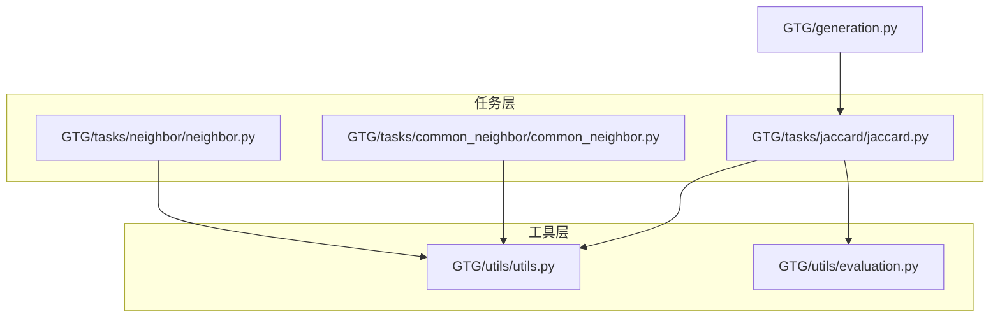
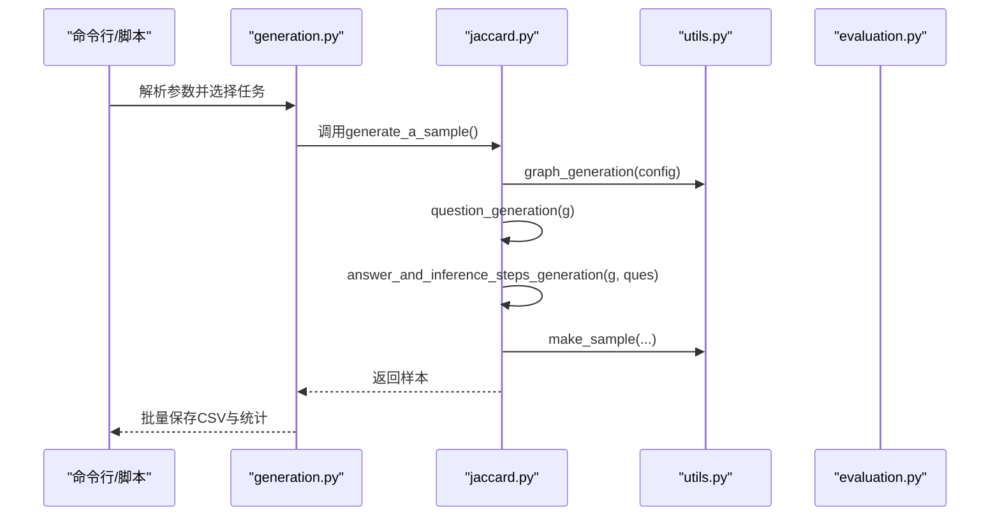
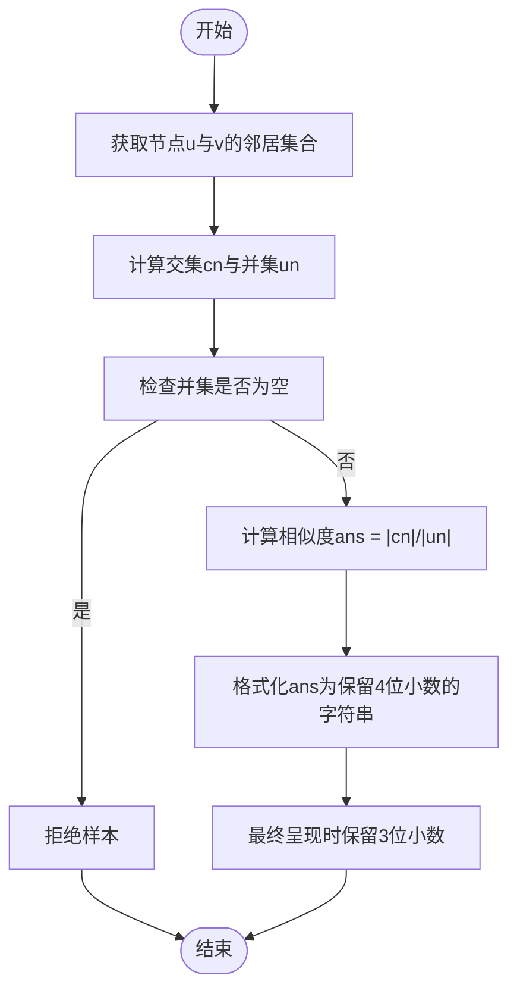
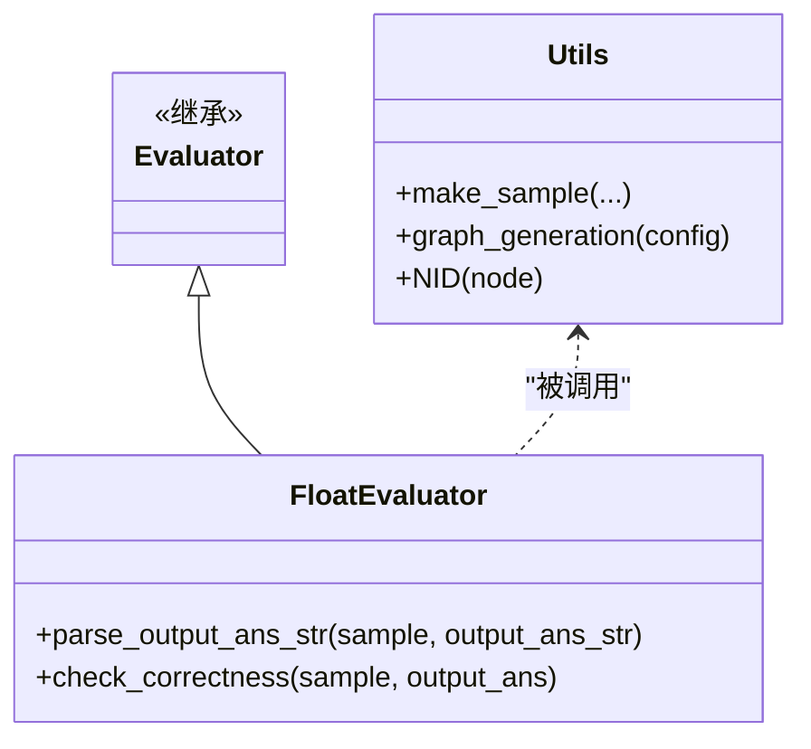
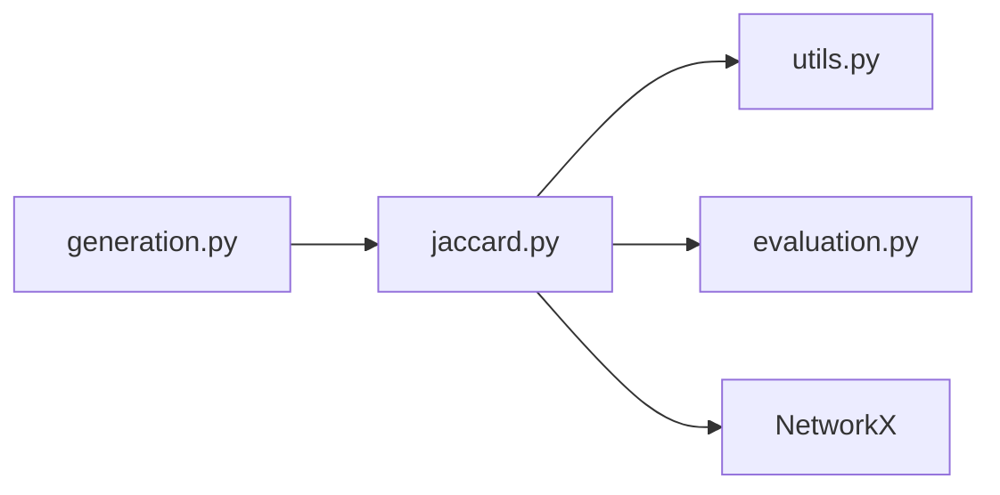

# Jaccard相似度

<cite>
**本文引用的文件**
- [GTG/tasks/jaccard/jaccard.py](file://GTG/tasks/jaccard/jaccard.py)
- [GTG/utils/utils.py](file://GTG/utils/utils.py)
- [GTG/utils/evaluation.py](file://GTG/utils/evaluation.py)
- [GTG/generation.py](file://GTG/generation.py)
- [GTG/tasks/common_neighbor/common_neighbor.py](file://GTG/tasks/common_neighbor/common_neighbor.py)
- [GTG/tasks/neighbor/neighbor.py](file://GTG/tasks/neighbor/neighbor.py)
- [script/dataset_generation/jaccard.sh](file://script/dataset_generation/jaccard.sh)
</cite>

## 目录
1. [引言](#引言)
2. [项目结构](#项目结构)
3. [核心组件](#核心组件)
4. [架构总览](#架构总览)
5. [详细组件分析](#详细组件分析)
6. [依赖关系分析](#依赖关系分析)
7. [性能考量](#性能考量)
8. [故障排查指南](#故障排查指南)
9. [结论](#结论)
10. [附录](#附录)

## 引言
本节面向希望理解Jaccard相似度在图论中如何用于衡量节点邻居重叠程度的读者。我们将从集合论基础出发，结合jaccard.py中的实现细节，说明如何从两个节点的邻居集合出发，计算交集与并集的大小比值作为相似度得分，并对分数归一化（保留4位小数并在最终呈现时保留3位小数）与边界情况进行处理。同时，我们总结问题生成模板的设计原则，强调查询意图明确、推理步骤清晰、可解释性强，并讨论该指标在推荐系统与社区发现中的实际意义与应用建议。

## 项目结构
本仓库采用“任务模块化 + 工具库”的组织方式：
- 任务层：每个具体问题（如Jaccard、Common Neighbor等）位于GTG/tasks/<task>/下，包含问题生成、答案与推理步骤生成、选项构造、样本封装与评估器等。
- 工具层：GTG/utils提供通用工具（随机种子、图生成、节点ID格式化、样本封装、解析输出等）。
- 运行入口：GTG/generation.py负责根据配置选择任务模块并批量生成数据集。

图表来源
- [GTG/generation.py](file://GTG/generation.py#L29-L57)
- [GTG/tasks/jaccard/jaccard.py](file://GTG/tasks/jaccard/jaccard.py#L1-L135)
- [GTG/utils/utils.py](file://GTG/utils/utils.py#L1-L120)
- [GTG/utils/evaluation.py](file://GTG/utils/evaluation.py#L82-L95)

章节来源
- [GTG/generation.py](file://GTG/generation.py#L29-L57)
- [GTG/tasks/jaccard/jaccard.py](file://GTG/tasks/jaccard/jaccard.py#L1-L135)
- [GTG/utils/utils.py](file://GTG/utils/utils.py#L1-L120)
- [GTG/utils/evaluation.py](file://GTG/utils/evaluation.py#L82-L95)

## 核心组件
- 问题生成(question_generation)：随机选取两个不同节点，构造明确的查询意图（计算Jaccard系数），并区分有向/无向图的邻居定义。
- 答案与推理步骤(answer_and_inference_steps_generation)：提取两节点邻居集合，计算交集与并集大小，得到相似度；当并集为空时拒绝样本；将结果格式化为保留4位小数的字符串，并在最终呈现时保留3位小数。
- 选项生成(choices_generation)：构造干扰项，避免与正确答案过于接近，确保选择题的有效性。
- 样本生成(generate_a_sample)：循环生成直到满足拒绝条件，封装为标准样本字典。
- 评估(Evaluator)：继承浮点数评估器，使用相对误差阈值判断LLM输出是否正确。

章节来源
- [GTG/tasks/jaccard/jaccard.py](file://GTG/tasks/jaccard/jaccard.py#L14-L128)
- [GTG/utils/evaluation.py](file://GTG/utils/evaluation.py#L82-L95)

## 架构总览
Jaccard任务的执行流如下：

图表来源
- [GTG/generation.py](file://GTG/generation.py#L29-L57)
- [GTG/tasks/jaccard/jaccard.py](file://GTG/tasks/jaccard/jaccard.py#L111-L128)
- [GTG/utils/utils.py](file://GTG/utils/utils.py#L14-L35)

## 详细组件分析

### 集合论基础与Jaccard相似度
- 定义：对于节点u与v，令N(u)、N(v)分别为其邻居集合，则Jaccard系数定义为：
  J(u,v) = |N(u) ∩ N(v)| / |N(u) ∪ N(v)|
- 特殊情况：
  - 若N(u) ∪ N(v) = ∅，则J(u,v)未定义；本实现将其视为拒绝样本，避免无效评分。
  - 当J(u,v)=0时，表示两节点无共同邻居；本实现对零相似度样本进行比例控制，防止训练集中零相似度过高。

章节来源
- [GTG/tasks/jaccard/jaccard.py](file://GTG/tasks/jaccard/jaccard.py#L35-L89)

### 代码级流程与数据结构
- 输入：NetworkX图对象g，包含节点与边信息；ques包含节点u、v。
- 中间集合：
  - u_nei = list(g.neighbors(u))
  - v_nei = list(g.neighbors(v))
  - cn = u_nei ∩ v_nei（交集）
  - un = u_nei ∪ v_nei（并集）
- 输出：
  - ans = len(cn)/len(un)
  - ans_str = "{:.4f}".format(ans)，最终呈现时保留3位小数（见后续“分数归一化”）。

图表来源
- [GTG/tasks/jaccard/jaccard.py](file://GTG/tasks/jaccard/jaccard.py#L40-L89)

章节来源
- [GTG/tasks/jaccard/jaccard.py](file://GTG/tasks/jaccard/jaccard.py#L40-L89)

### 分数归一化与边界情况
- 归一化策略：
  - 计算阶段：ans = len(cn)/len(un)，ans_str = "{:.4f}".format(ans)（保留4位小数）。
  - 最终呈现：在最终输出字符串中保留3位小数，便于人类阅读与对比。
- 边界情况：
  - 并集为空：直接拒绝该样本，避免除零与未定义值。
  - 零相似度：对ans==0的情况进行比例控制（零样本占比不超过20%），超过阈值则拒绝，重新采样。

章节来源
- [GTG/tasks/jaccard/jaccard.py](file://GTG/tasks/jaccard/jaccard.py#L63-L89)

### 问题生成模板设计原则
- 明确查询意图：问题字符串要求明确指出“计算节点u和v的Jaccard系数”，并说明有向图情况下邻居定义为后继节点。
- 可解释性：推理步骤包含邻居集合、交集与并集的展示，以及最终的除法表达式，帮助模型与用户理解每一步。
- 一致性：与同类任务（如Common Neighbor）保持一致的问题生成风格，便于统一训练与评测。

章节来源
- [GTG/tasks/jaccard/jaccard.py](file://GTG/tasks/jaccard/jaccard.py#L14-L33)
- [GTG/tasks/jaccard/jaccard.py](file://GTG/tasks/jaccard/jaccard.py#L35-L89)
- [GTG/tasks/common_neighbor/common_neighbor.py](file://GTG/tasks/common_neighbor/common_neighbor.py#L14-L33)
- [GTG/tasks/neighbor/neighbor.py](file://GTG/tasks/neighbor/neighbor.py#L14-L27)

### 选项构造与评估
- 选项构造：当正确答案非0时，强制包含0作为干扰项；当正确答案为0时，避免引入过多0干扰项，确保分布合理。
- 评估：继承FloatEvaluator，使用相对误差阈值判断LLM输出是否正确，保证对浮点数答案的鲁棒性。

章节来源
- [GTG/tasks/jaccard/jaccard.py](file://GTG/tasks/jaccard/jaccard.py#L91-L109)
- [GTG/utils/evaluation.py](file://GTG/utils/evaluation.py#L82-L95)

### 类关系与职责

图表来源
- [GTG/utils/evaluation.py](file://GTG/utils/evaluation.py#L82-L95)
- [GTG/utils/utils.py](file://GTG/utils/utils.py#L14-L35)

## 依赖关系分析
- jaccard.py依赖：
  - utils.py：节点ID格式化、图生成、样本封装。
  - evaluation.py：浮点数评估器。
  - NetworkX：图操作与邻居查询。
- generation.py通过任务名映射到具体任务模块，驱动批量生成。

图表来源
- [GTG/generation.py](file://GTG/generation.py#L29-L57)
- [GTG/tasks/jaccard/jaccard.py](file://GTG/tasks/jaccard/jaccard.py#L1-L135)
- [GTG/utils/utils.py](file://GTG/utils/utils.py#L1-L120)
- [GTG/utils/evaluation.py](file://GTG/utils/evaluation.py#L82-L95)

章节来源
- [GTG/generation.py](file://GTG/generation.py#L29-L57)
- [GTG/tasks/jaccard/jaccard.py](file://GTG/tasks/jaccard/jaccard.py#L1-L135)
- [GTG/utils/utils.py](file://GTG/utils/utils.py#L1-L120)
- [GTG/utils/evaluation.py](file://GTG/utils/evaluation.py#L82-L95)

## 性能考量
- 时间复杂度：邻居查询与集合运算均为O(deg(u)+deg(v))，整体近似线性于两节点邻居规模之和。
- 内存开销：主要来自邻居列表与中间集合（交集、并集）的构建，通常较小。
- 拒绝采样：当并集为空或零相似度过高时会拒绝样本并重试，可能增加少量额外时间，但能显著提升数据质量。

章节来源
- [GTG/tasks/jaccard/jaccard.py](file://GTG/tasks/jaccard/jaccard.py#L40-L89)

## 故障排查指南
- 并集为空导致拒绝样本：若多次出现并集为空，检查图生成策略与节点度分布，确保不存在孤立节点且平均度适中。
- 零相似度过高：若零样本比例超过阈值，系统会拒绝部分样本以维持分布平衡；可通过调整配置或增大图规模缓解。
- 输出格式不匹配：确保LLM输出包含数值，且相对误差在允许范围内；必要时检查解析与评估阈值设置。

章节来源
- [GTG/tasks/jaccard/jaccard.py](file://GTG/tasks/jaccard/jaccard.py#L63-L89)
- [GTG/utils/evaluation.py](file://GTG/utils/evaluation.py#L82-L95)

## 结论
Jaccard相似度在图论中是衡量节点邻居重叠程度的重要指标。本实现以明确的问题模板、清晰的推理步骤与严格的边界处理，确保了训练数据的质量与可解释性。通过对零相似度比例的控制与相对误差评估，既提升了数据分布的合理性，也增强了对模型输出的鲁棒性。该指标在推荐系统与社区发现中具有广泛价值，可用于衡量用户兴趣重叠与社区内成员联系紧密程度。

## 附录

### 应用场景指导
- 推荐系统：
  - 用户画像重叠：利用Jaccard相似度衡量用户对物品的偏好重叠，辅助协同过滤与内容推荐。
  - 物品共现：衡量物品被同一用户购买或浏览的频率，作为关联规则与热门推荐的依据。
- 社区发现：
  - 节点亲密度：在社交网络中，Jaccard相似度高的节点更可能属于同一社区或群体。
  - 局部连通性：结合局部聚类系数，识别强连接的子群，辅助社区划分算法。

### 运行示例与脚本
- 使用脚本生成Jaccard数据集：指定数据根目录、节点规模范围、样本数量与标签，脚本将生成原始CSV并转换为整数ID与字母ID版本。

章节来源
- [script/dataset_generation/jaccard.sh](file://script/dataset_generation/jaccard.sh#L1-L36)