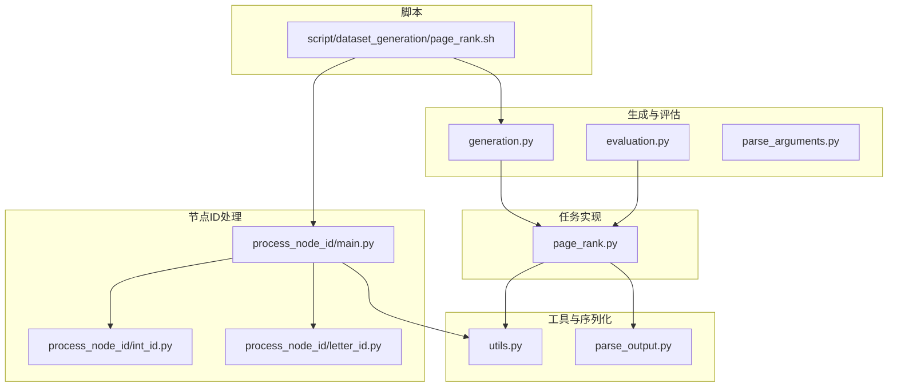
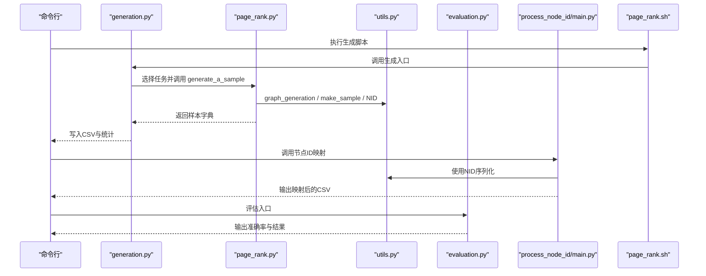
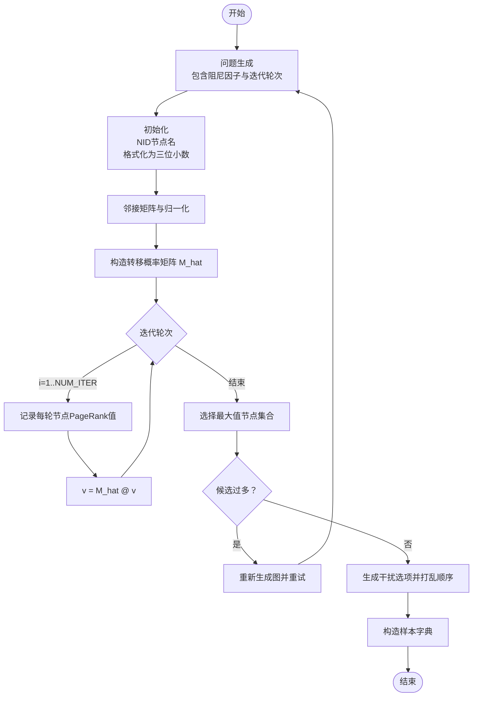
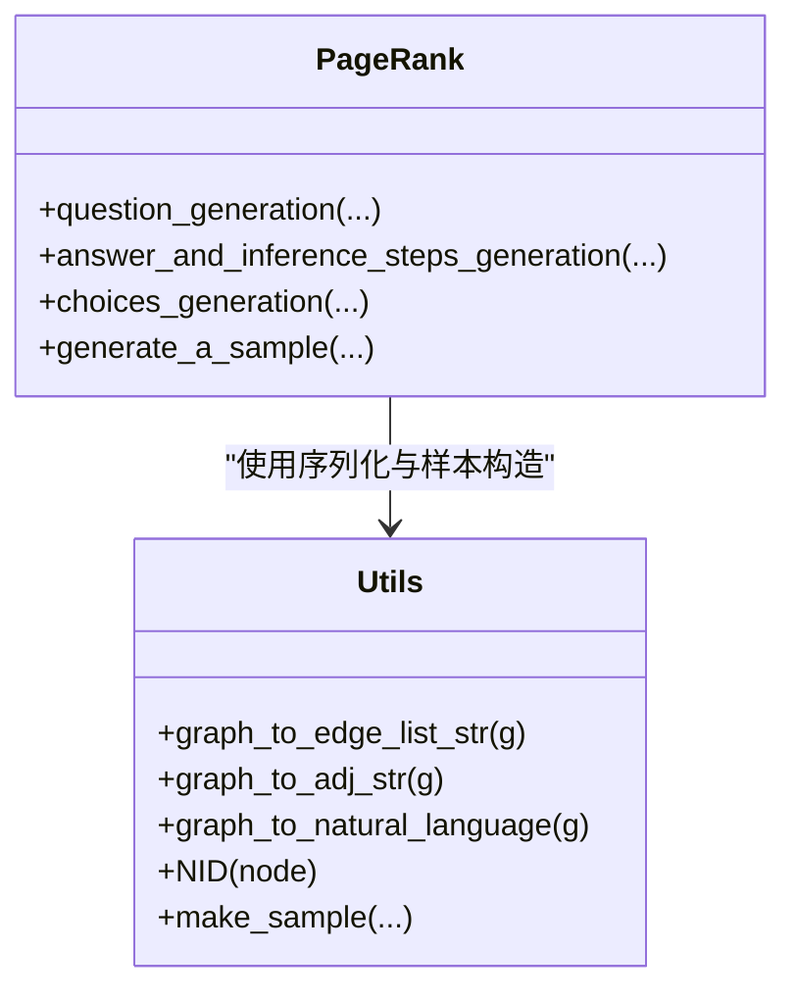
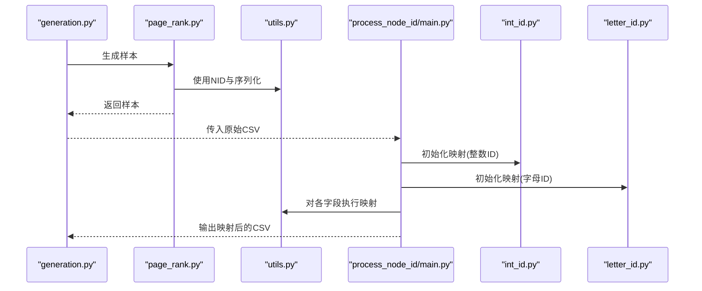
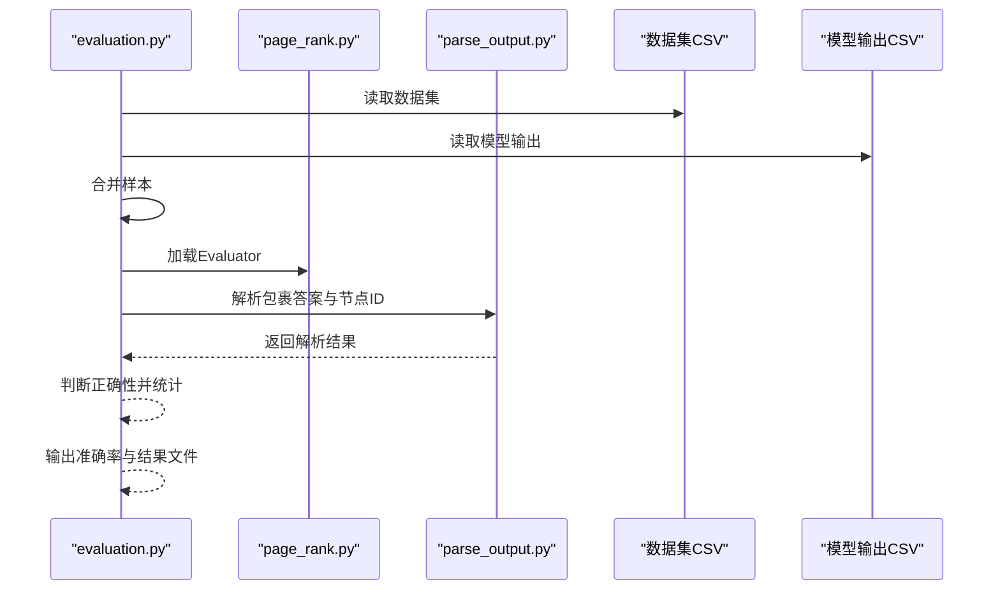
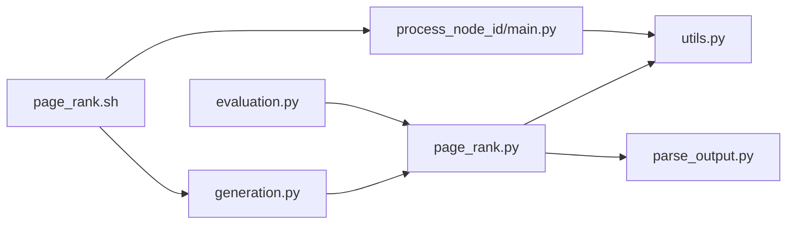

# PageRank

<cite>
**本文引用的文件列表**
- [page_rank.py](file://GTG/tasks/page_rank/page_rank.py)
- [utils.py](file://GTG/utils/utils.py)
- [generation.py](file://GTG/generation.py)
- [evaluation.py](file://GTG/evaluation.py)
- [parse_output.py](file://GTG/utils/parse_output.py)
- [parse_arguments.py](file://GTG/utils/parse_arguments.py)
- [page_rank.sh](file://script/dataset_generation/page_rank.sh)
- [main.py](file://GTG/process_node_id/main.py)
- [int_id.py](file://GTG/process_node_id/int_id.py)
- [letter_id.py](file://GTG/process_node_id/letter_id.py)
</cite>

## 目录
1. [引言](#引言)
2. [项目结构](#项目结构)
3. [核心组件](#核心组件)
4. [架构总览](#架构总览)
5. [详细组件分析](#详细组件分析)
6. [依赖关系分析](#依赖关系分析)
7. [性能考量](#性能考量)
8. [故障排查指南](#故障排查指南)
9. [结论](#结论)
10. [附录](#附录)

## 引言
本文件系统性讲解 PageRank 算法在该仓库中的实现与应用，重点覆盖：
- PageRank 基本原理与迭代计算过程
- 在代码中如何通过网络库构建概率转移矩阵并执行迭代
- 阻尼因子、收敛阈值与最大迭代次数等参数对结果的影响
- 将连续型 PageRank 值规范化为三位小数输出，并生成自然语言问题
- 推理步骤设计思路：强调 PageRank 反映节点重要性而非简单连接数，体现随机游走的概率模型本质
- 结合图结构序列化方法，为 PageRank 计算提供完整上下文，保证样本语义一致性与可解释性

## 项目结构
与 PageRank 相关的关键模块分布如下：
- 任务实现层：GTG/tasks/page_rank/page_rank.py
- 工具与图序列化：GTG/utils/utils.py
- 数据生成入口：GTG/generation.py
- 评估入口：GTG/evaluation.py
- 输出解析：GTG/utils/parse_output.py
- 参数解析：GTG/utils/parse_arguments.py
- 节点ID处理与脚本：GTG/process_node_id/* 与 script/dataset_generation/page_rank.sh

图表来源
- [page_rank.py](file://GTG/tasks/page_rank/page_rank.py#L1-L129)
- [utils.py](file://GTG/utils/utils.py#L1-L617)
- [generation.py](file://GTG/generation.py#L1-L107)
- [evaluation.py](file://GTG/evaluation.py#L1-L73)
- [parse_output.py](file://GTG/utils/parse_output.py#L1-L213)
- [parse_arguments.py](file://GTG/utils/parse_arguments.py#L1-L28)
- [main.py](file://GTG/process_node_id/main.py#L1-L58)
- [int_id.py](file://GTG/process_node_id/int_id.py#L1-L21)
- [letter_id.py](file://GTG/process_node_id/letter_id.py#L1-L33)
- [page_rank.sh](file://script/dataset_generation/page_rank.sh#L1-L36)

章节来源
- [page_rank.py](file://GTG/tasks/page_rank/page_rank.py#L1-L129)
- [utils.py](file://GTG/utils/utils.py#L1-L617)
- [generation.py](file://GTG/generation.py#L1-L107)
- [evaluation.py](file://GTG/evaluation.py#L1-L73)
- [parse_output.py](file://GTG/utils/parse_output.py#L1-L213)
- [parse_arguments.py](file://GTG/utils/parse_arguments.py#L1-L28)
- [page_rank.sh](file://script/dataset_generation/page_rank.sh#L1-L36)
- [main.py](file://GTG/process_node_id/main.py#L1-L58)
- [int_id.py](file://GTG/process_node_id/int_id.py#L1-L21)
- [letter_id.py](file://GTG/process_node_id/letter_id.py#L1-L33)

## 核心组件
- PageRank 任务实现：负责生成问题、推理步骤、答案与选项，以及样本构造与评估器
- 图序列化与自然语言描述：提供边列表、邻接表、自然语言描述等多模态上下文
- 数据生成与评估：统一入口，按任务调度样本生成与评估
- 节点ID映射：支持整数与字母ID两种形式，提升可读性与一致性

章节来源
- [page_rank.py](file://GTG/tasks/page_rank/page_rank.py#L1-L129)
- [utils.py](file://GTG/utils/utils.py#L1-L617)
- [generation.py](file://GTG/generation.py#L1-L107)
- [evaluation.py](file://GTG/evaluation.py#L1-L73)

## 架构总览
下图展示了从命令行到样本生成、再到节点ID映射与最终输出的端到端流程。

图表来源
- [page_rank.sh](file://script/dataset_generation/page_rank.sh#L1-L36)
- [generation.py](file://GTG/generation.py#L1-L107)
- [page_rank.py](file://GTG/tasks/page_rank/page_rank.py#L1-L129)
- [utils.py](file://GTG/utils/utils.py#L1-L617)
- [evaluation.py](file://GTG/evaluation.py#L1-L73)
- [main.py](file://GTG/process_node_id/main.py#L1-L58)

## 详细组件分析

### PageRank 实现与推理步骤
- 问题生成：包含阻尼因子与迭代轮次提示，明确初始值设定
- 迭代计算：使用 NumPy 构造概率转移矩阵，按固定轮次迭代更新节点 PageRank 值
- 规范化输出：将连续型浮点值格式化为三位小数，便于人类阅读与比较
- 答案与选项：选取最大值节点集合，若存在多个候选节点比例过高则拒绝重采样
- 样本构造：通过工具函数将图、邻接表、自然语言描述、节点列表等打包为样本字典

图表来源
- [page_rank.py](file://GTG/tasks/page_rank/page_rank.py#L1-L129)

章节来源
- [page_rank.py](file://GTG/tasks/page_rank/page_rank.py#L1-L129)

### 图结构序列化与自然语言描述
- 边列表字符串：将图的边以“[(u,v), ...]”形式输出
- 邻接表字符串：以“{u: [v,...], ...}”形式输出
- 自然语言描述：逐节点描述邻居数量与关系，形成可读性强的上下文
- 节点ID格式化：统一使用“<i>”包裹，便于后续映射与解析

图表来源
- [utils.py](file://GTG/utils/utils.py#L1-L617)
- [page_rank.py](file://GTG/tasks/page_rank/page_rank.py#L1-L129)

章节来源
- [utils.py](file://GTG/utils/utils.py#L1-L617)

### 节点ID映射与可读性增强
- 整数ID映射：将“<u>”映射为数字字符串，保持数值语义
- 字母ID映射：将“<u>”映射为三字母大写组合，提升可读性
- 统一处理：在生成后对所有字段进行映射，确保样本语义一致

图表来源
- [main.py](file://GTG/process_node_id/main.py#L1-L58)
- [int_id.py](file://GTG/process_node_id/int_id.py#L1-L21)
- [letter_id.py](file://GTG/process_node_id/letter_id.py#L1-L33)
- [utils.py](file://GTG/utils/utils.py#L1-L617)
- [page_rank.py](file://GTG/tasks/page_rank/page_rank.py#L1-L129)

章节来源
- [main.py](file://GTG/process_node_id/main.py#L1-L58)
- [int_id.py](file://GTG/process_node_id/int_id.py#L1-L21)
- [letter_id.py](file://GTG/process_node_id/letter_id.py#L1-L33)
- [utils.py](file://GTG/utils/utils.py#L1-L617)

### 评估与输出解析
- 评估器：针对节点类问题，解析模型输出中的节点标识，判断是否命中标准答案集合
- 输出解析：支持包裹标记、节点ID提取、列表解析等，保证鲁棒性
- 评估流程：合并数据集与模型输出，逐样本评估并统计准确率

图表来源
- [evaluation.py](file://GTG/evaluation.py#L1-L73)
- [parse_output.py](file://GTG/utils/parse_output.py#L1-L213)
- [page_rank.py](file://GTG/tasks/page_rank/page_rank.py#L113-L129)

章节来源
- [evaluation.py](file://GTG/evaluation.py#L1-L73)
- [parse_output.py](file://GTG/utils/parse_output.py#L1-L213)
- [page_rank.py](file://GTG/tasks/page_rank/page_rank.py#L113-L129)

## 依赖关系分析
- 任务实现依赖工具模块提供的图序列化与样本构造能力
- 生成入口按任务动态加载模块，统一调度样本生成与保存
- 评估入口按任务加载对应评估器，统一解析输出并评估
- 节点ID映射独立于任务实现，通过脚本串联生成与后处理

图表来源
- [generation.py](file://GTG/generation.py#L1-L107)
- [evaluation.py](file://GTG/evaluation.py#L1-L73)
- [page_rank.py](file://GTG/tasks/page_rank/page_rank.py#L1-L129)
- [utils.py](file://GTG/utils/utils.py#L1-L617)
- [parse_output.py](file://GTG/utils/parse_output.py#L1-L213)
- [page_rank.sh](file://script/dataset_generation/page_rank.sh#L1-L36)
- [main.py](file://GTG/process_node_id/main.py#L1-L58)

章节来源
- [generation.py](file://GTG/generation.py#L1-L107)
- [evaluation.py](file://GTG/evaluation.py#L1-L73)
- [page_rank.py](file://GTG/tasks/page_rank/page_rank.py#L1-L129)
- [utils.py](file://GTG/utils/utils.py#L1-L617)
- [parse_output.py](file://GTG/utils/parse_output.py#L1-L213)
- [page_rank.sh](file://script/dataset_generation/page_rank.sh#L1-L36)
- [main.py](file://GTG/process_node_id/main.py#L1-L58)

## 性能考量
- 迭代次数控制：当前实现固定迭代轮次，避免过长计算时间；如需更高精度可适度增加轮次
- 矩阵归一化：邻接矩阵按行求和归一化，注意处理度为零节点的稳定性（代码中加入微小常数）
- 数值格式化：仅影响显示精度，不改变计算结果
- 随机性与重采样：当候选节点过多时拒绝样本，有助于维持问答难度与公平性

[本节为通用建议，无需特定文件来源]

## 故障排查指南
- 生成脚本参数缺失：确认 num_nodes_range、num_samples、dataset_tag 等参数是否正确传入
- 节点ID映射异常：检查映射逻辑是否覆盖全部“<u>”占位符，确保映射字典完整
- 评估失败：确认模型输出包含包裹标记或节点ID，否则解析会返回空值导致错误率升高
- 样本被拒绝：若候选节点过多触发拒绝条件，可调整图生成策略或放宽阈值

章节来源
- [page_rank.sh](file://script/dataset_generation/page_rank.sh#L1-L36)
- [parse_arguments.py](file://GTG/utils/parse_arguments.py#L1-L28)
- [parse_output.py](file://GTG/utils/parse_output.py#L1-L213)
- [page_rank.py](file://GTG/tasks/page_rank/page_rank.py#L1-L129)

## 结论
本实现以简洁清晰的方式实现了 PageRank 的端到端流程：从图生成、序列化、推理步骤到样本构造与评估。通过固定阻尼因子与迭代轮次，配合数值格式化与节点ID映射，既保证了可解释性，也提升了可读性与一致性。建议在实际应用中根据任务需求调整迭代次数与阈值，并结合更丰富的图生成策略以覆盖更多拓扑场景。

[本节为总结性内容，无需特定文件来源]

## 附录

### PageRank 基本原理与参数说明
- 阻尼因子（damping factor）：控制随机游走中继续跳转的概率，默认值体现了“页面跳转”的现实假设
- 收敛阈值：当前实现未显式设置收敛阈值，采用固定轮次；如需自适应收敛可在迭代中加入误差判断
- 最大迭代次数：当前实现固定轮次，便于复现与控制计算成本

章节来源
- [page_rank.py](file://GTG/tasks/page_rank/page_rank.py#L1-L129)

### 生成与评估脚本
- 生成脚本：负责调用生成入口、生成样本并保存 CSV，随后进行节点ID映射
- 评估脚本：负责读取数据集与模型输出，统一评估并输出准确率

章节来源
- [page_rank.sh](file://script/dataset_generation/page_rank.sh#L1-L36)
- [generation.py](file://GTG/generation.py#L1-L107)
- [evaluation.py](file://GTG/evaluation.py#L1-L73)