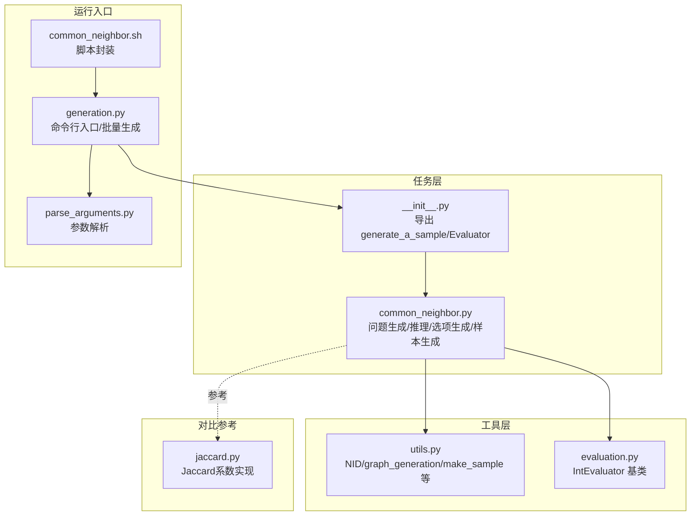
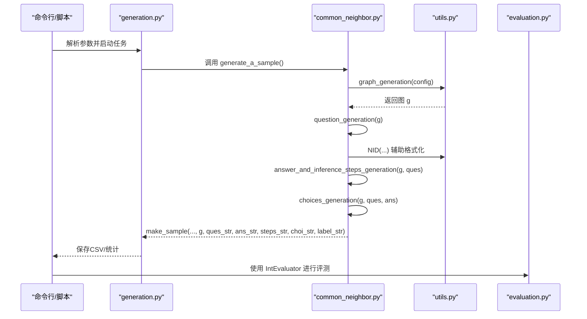
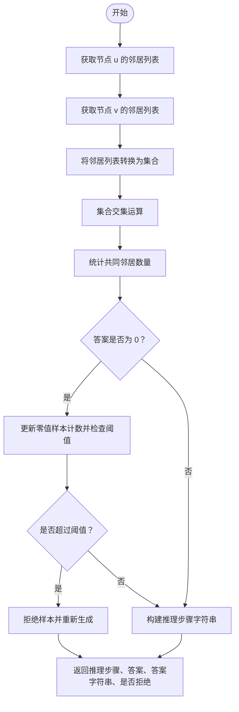
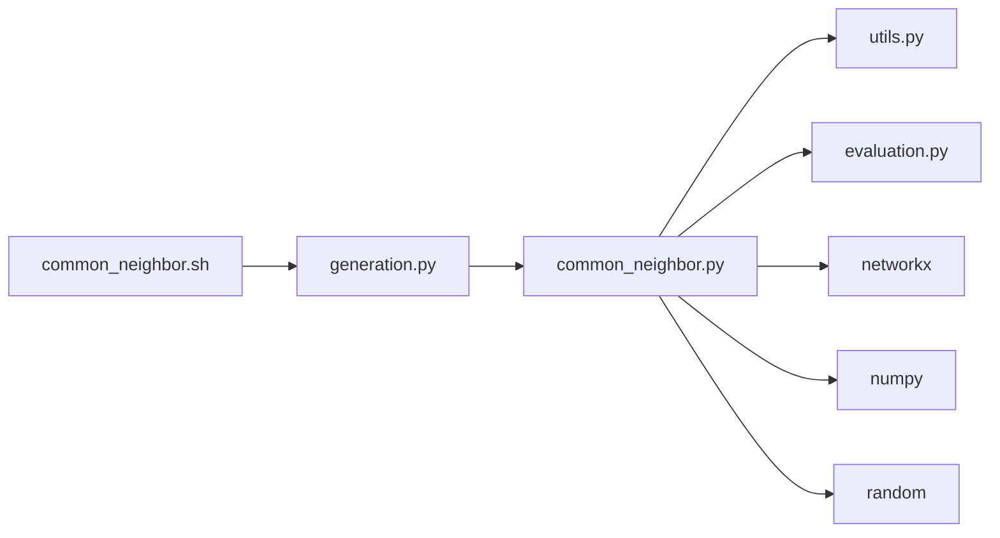

# 共同邻居

<cite>
**本文引用的文件**
- [common_neighbor.py](file://GTG/tasks/common_neighbor/common_neighbor.py)
- [__init__.py](file://GTG/tasks/common_neighbor/__init__.py)
- [utils.py](file://GTG/utils/utils.py)
- [evaluation.py](file://GTG/utils/evaluation.py)
- [generation.py](file://GTG/generation.py)
- [parse_arguments.py](file://GTG/utils/parse_arguments.py)
- [common_neighbor.sh](file://script/dataset_generation/common_neighbor.sh)
- [jaccard.py](file://GTG/tasks/jaccard/jaccard.py)
</cite>

## 目录
1. [引言](#引言)
2. [项目结构](#项目结构)
3. [核心组件](#核心组件)
4. [架构总览](#架构总览)
5. [详细组件分析](#详细组件分析)
6. [依赖分析](#依赖分析)
7. [性能考虑](#性能考虑)
8. [故障排查指南](#故障排查指南)
9. [结论](#结论)
10. [附录](#附录)

## 引言
本文件围绕“共同邻居”指标在链路预测中的作用展开，基于 common_neighbor.py 的实现，系统阐述以下内容：
- 如何从图中获取两个目标节点的邻居集合，并通过集合交集运算确定共同邻居的数量；
- 问题生成过程中节点对的选择策略，确保所选节点对在图中存在合理的拓扑关系；
- 推理步骤的构建方式：逐步展示每个节点的邻居列表，然后进行对比找出重复元素，并最终统计数量；
- 强调该特征作为节点相似性基础度量的重要性，并说明其在复杂网络分析中的前置处理地位；
- 提供代码级示例说明输入图结构、节点对参数到输出答案的完整数据流。

## 项目结构
与“共同邻居”任务直接相关的核心模块如下：
- 任务实现：GTG/tasks/common_neighbor/common_neighbor.py
- 导出接口：GTG/tasks/common_neighbor/__init__.py
- 工具函数与图生成：GTG/utils/utils.py
- 评测器基类与整数评测器：GTG/utils/evaluation.py
- 数据集生成入口：GTG/generation.py
- 参数解析：GTG/utils/parse_arguments.py
- 脚本：script/dataset_generation/common_neighbor.sh
- 对比参考（Jaccard系数）：GTG/tasks/jaccard/jaccard.py

图表来源
- [common_neighbor.py](file://GTG/tasks/common_neighbor/common_neighbor.py#L1-L120)
- [__init__.py](file://GTG/tasks/common_neighbor/__init__.py#L1-L3)
- [utils.py](file://GTG/utils/utils.py#L1-L200)
- [evaluation.py](file://GTG/utils/evaluation.py#L69-L80)
- [generation.py](file://GTG/generation.py#L1-L107)
- [parse_arguments.py](file://GTG/utils/parse_arguments.py#L1-L28)
- [common_neighbor.sh](file://script/dataset_generation/common_neighbor.sh#L1-L36)
- [jaccard.py](file://GTG/tasks/jaccard/jaccard.py#L1-L108)

章节来源
- [common_neighbor.py](file://GTG/tasks/common_neighbor/common_neighbor.py#L1-L120)
- [__init__.py](file://GTG/tasks/common_neighbor/__init__.py#L1-L3)
- [utils.py](file://GTG/utils/utils.py#L1-L200)
- [evaluation.py](file://GTG/utils/evaluation.py#L69-L80)
- [generation.py](file://GTG/generation.py#L1-L107)
- [parse_arguments.py](file://GTG/utils/parse_arguments.py#L1-L28)
- [common_neighbor.sh](file://script/dataset_generation/common_neighbor.sh#L1-L36)
- [jaccard.py](file://GTG/tasks/jaccard/jaccard.py#L1-L108)

## 核心组件
- 问题生成（question_generation）
  - 随机选择两个不同的节点作为目标节点对，构造问题字符串并考虑有向图的邻居定义（后继者）。
- 推理与答案生成（answer_and_inference_steps_generation）
  - 获取两个节点的邻居列表，转换为集合求交集，得到共同邻居集合，并统计数量；同时构建可读的推理步骤字符串。
  - 当答案为0时，控制零值比例不超过阈值，必要时拒绝样本并重新生成。
- 选项生成（choices_generation）
  - 构造若干个干扰选项，避免与正确答案过于接近，保证选择题的有效性。
- 样本生成（generate_a_sample）
  - 组合上述步骤，生成一条完整的样本记录（包含图、问题、推理步骤、答案、选项等），并维护计数器。
- 评测器（Evaluator）
  - 继承整数评测器，用于解析模型输出并判断正确性。

章节来源
- [common_neighbor.py](file://GTG/tasks/common_neighbor/common_neighbor.py#L14-L113)
- [evaluation.py](file://GTG/utils/evaluation.py#L69-L80)

## 架构总览
下图展示了“共同邻居”任务从图生成到样本产出的整体流程，以及与评测器的关系。

图表来源
- [generation.py](file://GTG/generation.py#L1-L107)
- [common_neighbor.py](file://GTG/tasks/common_neighbor/common_neighbor.py#L96-L113)
- [utils.py](file://GTG/utils/utils.py#L14-L36)
- [evaluation.py](file://GTG/utils/evaluation.py#L69-L80)

## 详细组件分析

### 问题生成（question_generation）
- 节点对选择策略
  - 在图的节点集中随机选择两个不同的节点作为目标节点对，避免自反（start ≠ end）。
  - 若图为有向图，则在问题字符串中明确邻居定义为“后继者”，确保语义一致。
- 输出
  - 返回问题字典（包含 u、v）和问题字符串。

章节来源
- [common_neighbor.py](file://GTG/tasks/common_neighbor/common_neighbor.py#L14-L33)

### 推理步骤与答案生成（answer_and_inference_steps_generation）
- 邻居集合获取
  - 分别查询两个目标节点的邻居列表，并转换为数组以便后续处理。
- 集合交集与统计
  - 将邻居列表转换为集合，执行交集运算，得到共同邻居集合，并统计其大小作为答案。
- 推理步骤构建
  - 逐步输出两个节点的邻居列表，再输出共同邻居集合及数量，最后给出最终答案。
- 零值样本控制
  - 当答案为0时，统计零值样本占比，超过阈值则拒绝当前样本并重新生成，确保训练/评测数据分布合理。

图表来源
- [common_neighbor.py](file://GTG/tasks/common_neighbor/common_neighbor.py#L35-L73)

章节来源
- [common_neighbor.py](file://GTG/tasks/common_neighbor/common_neighbor.py#L35-L73)

### 选项生成（choices_generation）
- 干扰项构造
  - 若答案非零，强制包含0作为干扰项；
  - 在一定范围内随机采样其他候选值，避免与正确答案过于接近（绝对差不超过阈值）。
- 打乱顺序与标签
  - 将正确答案与干扰项合并后打乱顺序，记录正确选项索引作为标签。

章节来源
- [common_neighbor.py](file://GTG/tasks/common_neighbor/common_neighbor.py#L75-L93)

### 样本生成与导出（generate_a_sample）
- 样本构成
  - 包含任务名、图（边列表/邻接表/自然语言描述）、节点列表、节点/边数量、是否为有向图、问题、答案、推理步骤、选项、标签等字段。
- 计数器维护
  - 维护样本总数与零值样本计数，用于控制零值比例。

章节来源
- [common_neighbor.py](file://GTG/tasks/common_neighbor/common_neighbor.py#L96-L113)
- [utils.py](file://GTG/utils/utils.py#L14-L36)

### 评测器（Evaluator）
- 继承整数评测器，解析模型输出中的第一个整数，与标准答案比较，判断正确性。
- 与 common_neighbor 的集成
  - 由于答案为整数（共同邻居数量），使用 IntEvaluator 即可完成评测。

章节来源
- [common_neighbor.py](file://GTG/tasks/common_neighbor/common_neighbor.py#L116-L120)
- [evaluation.py](file://GTG/utils/evaluation.py#L69-L80)

### 与 Jaccard 系数的对比参考
- Jaccard 系数在 common_neighbor 的基础上，进一步计算了“并集”的大小，从而得到相似度分数；
- 两者共享相同的邻居集合获取与集合交集/并集的处理流程，但 common_neighbor 更偏向于“原始相似性计数”。

章节来源
- [jaccard.py](file://GTG/tasks/jaccard/jaccard.py#L35-L88)

## 依赖分析
- 内部依赖
  - common_neighbor.py 依赖 utils.py 中的 NID、graph_generation、make_sample；
  - 依赖 evaluation.py 中的 IntEvaluator；
  - 通过 generation.py 的入口统一调度。
- 外部依赖
  - NetworkX 用于图操作（邻居查询、有向/无向图判定）；
  - NumPy 用于数组与集合运算；
  - Python 标准库 random 用于随机采样。

图表来源
- [common_neighbor.py](file://GTG/tasks/common_neighbor/common_neighbor.py#L1-L120)
- [utils.py](file://GTG/utils/utils.py#L1-L200)
- [evaluation.py](file://GTG/utils/evaluation.py#L1-L200)
- [generation.py](file://GTG/generation.py#L1-L107)
- [common_neighbor.sh](file://script/dataset_generation/common_neighbor.sh#L1-L36)

章节来源
- [common_neighbor.py](file://GTG/tasks/common_neighbor/common_neighbor.py#L1-L120)
- [utils.py](file://GTG/utils/utils.py#L1-L200)
- [evaluation.py](file://GTG/utils/evaluation.py#L1-L200)
- [generation.py](file://GTG/generation.py#L1-L107)
- [common_neighbor.sh](file://script/dataset_generation/common_neighbor.sh#L1-L36)

## 性能考虑
- 邻居查询与集合运算
  - 邻居查询的时间复杂度为 O(k_u + k_v)，其中 k_u、k_v 为两节点的度数；
  - 集合交集/并集的时间复杂度取决于集合大小，通常为 O(min(k_u, k_v)) 或 O(k_u + k_v)；
  - 对于大规模图，建议优先使用较小度数的节点作为基准，减少集合转换成本。
- 零值样本控制
  - 通过阈值限制零值比例，有助于避免模型学习偏差，但会增加样本生成的重试次数，需权衡生成效率。
- 数组与集合转换
  - 使用 NumPy 数组便于格式化输出，但频繁转换可能带来额外开销；可在保证可读性的前提下尽量减少中间对象创建。

## 故障排查指南
- 零值样本过多被拒绝
  - 现象：generate_a_sample 循环多次才产出有效样本；
  - 原因：零值样本占比超过阈值，触发拒绝机制；
  - 处理：调整图生成策略或增大图规模，降低零值概率。
- 节点对选择异常
  - 现象：出现相同节点对；
  - 原因：question_generation 中未严格保证 start ≠ end；
  - 处理：确认循环重采样的逻辑已生效。
- 评测失败
  - 现象：模型输出解析失败或答案不匹配；
  - 原因：输出格式不符合预期或解析规则不一致；
  - 处理：检查 IntEvaluator 的解析逻辑与模型输出格式一致性。

章节来源
- [common_neighbor.py](file://GTG/tasks/common_neighbor/common_neighbor.py#L14-L113)
- [evaluation.py](file://GTG/utils/evaluation.py#L69-L80)

## 结论
- 共同邻居作为节点相似性的基础计数指标，在链路预测中具有重要地位：它直观反映两个节点共享的“桥接”邻居数量，是许多高阶相似性度量（如 Jaccard 系数）的前置步骤。
- 本实现通过清晰的问题生成、严谨的推理步骤与严格的零值控制，确保了训练/评测数据的质量与稳定性。
- 在实际应用中，可结合更多拓扑特征（如路径长度、公共祖先等）与机器学习方法，进一步提升链路预测的准确性。

## 附录

### 输入到输出的数据流示例（代码级路径）
- 图生成
  - 调用路径：[generation.py](file://GTG/generation.py#L1-L107) → [utils.py](file://GTG/utils/utils.py#L312-L349)
- 问题生成
  - 调用路径：[common_neighbor.py](file://GTG/tasks/common_neighbor/common_neighbor.py#L14-L33)
- 推理与答案
  - 调用路径：[common_neighbor.py](file://GTG/tasks/common_neighbor/common_neighbor.py#L35-L73)
- 选项生成
  - 调用路径：[common_neighbor.py](file://GTG/tasks/common_neighbor/common_neighbor.py#L75-L93)
- 样本导出
  - 调用路径：[common_neighbor.py](file://GTG/tasks/common_neighbor/common_neighbor.py#L96-L113) → [utils.py](file://GTG/utils/utils.py#L14-L36)
- 评测
  - 调用路径：[evaluation.py](file://GTG/utils/evaluation.py#L69-L80)