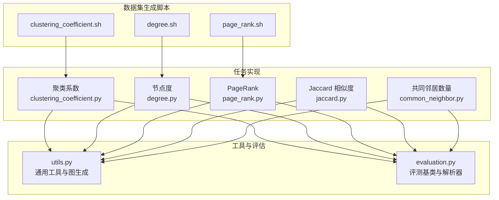
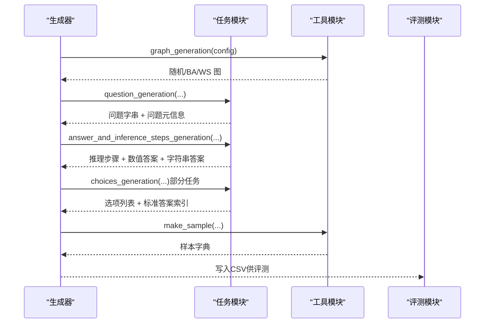
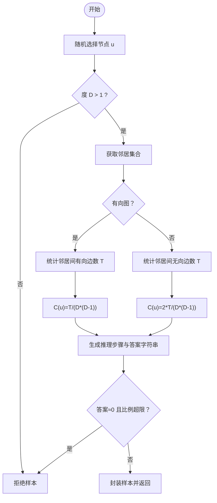
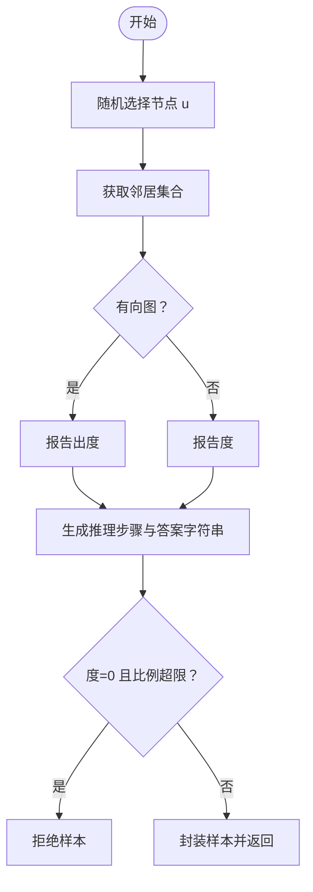
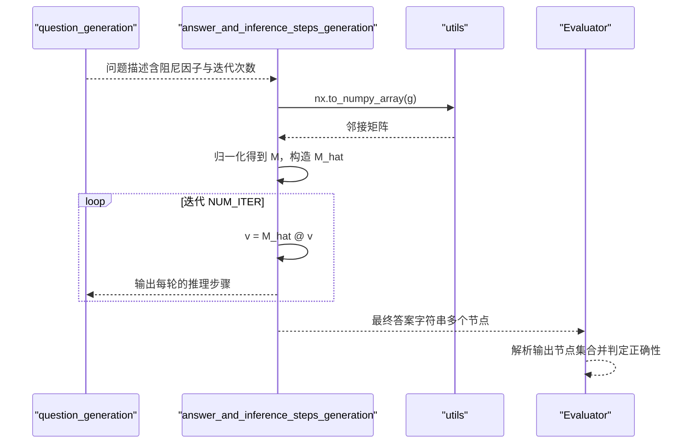
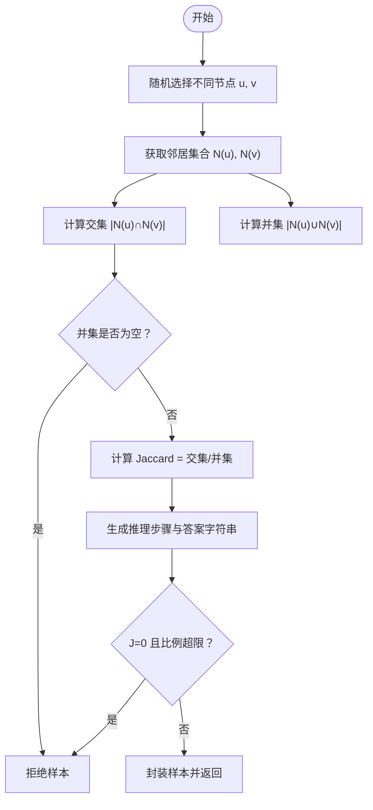
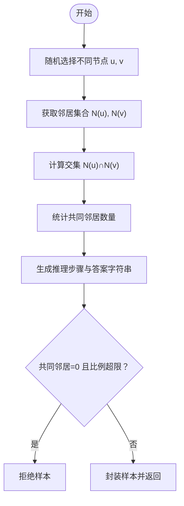
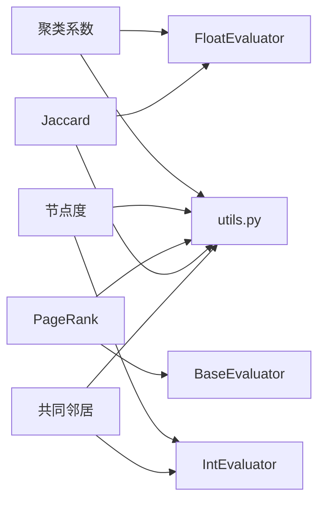

# 图属性计算

<cite>
**本文引用的文件列表**
- [clustering_coefficient.py](file://GTG/tasks/clustering_coefficient/clustering_coefficient.py)
- [degree.py](file://GTG/tasks/degree/degree.py)
- [page_rank.py](file://GTG/tasks/page_rank/page_rank.py)
- [jaccard.py](file://GTG/tasks/jaccard/jaccard.py)
- [common_neighbor.py](file://GTG/tasks/common_neighbor/common_neighbor.py)
- [utils.py](file://GTG/utils/utils.py)
- [evaluation.py](file://GTG/utils/evaluation.py)
- [clustering_coefficient.sh](file://script/dataset_generation/clustering_coefficient.sh)
- [degree.sh](file://script/dataset_generation/degree.sh)
- [page_rank.sh](file://script/dataset_generation/page_rank.sh)
</cite>

## 目录
1. [引言](#引言)
2. [项目结构](#项目结构)
3. [核心组件](#核心组件)
4. [架构总览](#架构总览)
5. [详细组件分析](#详细组件分析)
6. [依赖关系分析](#依赖关系分析)
7. [性能考量](#性能考量)
8. [故障排查指南](#故障排查指南)
9. [结论](#结论)
10. [附录](#附录)

## 引言
本文件围绕图属性计算类任务的实现机制进行系统化解析，重点覆盖以下指标：
- 聚类系数（Clustering Coefficient）
- 节点度（Degree）
- PageRank
- Jaccard 相似度
- 共同邻居数量（Common Neighbor）

文档从数学定义、网络库实现映射、推理步骤生成、数值到自然语言问答对的转换、精度控制、归一化与异常值过滤等方面展开，帮助读者理解代码如何将数值计算结果转化为可读性强且准确的“问题-答案”对，并讨论在不同任务中如何平衡数据分布与稳定性。

## 项目结构
该仓库采用模块化的任务组织方式，每个图算法任务位于独立目录下，统一通过工具模块生成样本、评估输出。关键路径如下：
- 任务实现：GTG/tasks/<task_name>/<task_name>.py
- 工具与评估：GTG/utils/utils.py、GTG/utils/evaluation.py
- 数据集生成脚本：script/dataset_generation/<task_name>.sh

图表来源
- [clustering_coefficient.py](file://GTG/tasks/clustering_coefficient/clustering_coefficient.py#L1-L140)
- [degree.py](file://GTG/tasks/degree/degree.py#L1-L110)
- [page_rank.py](file://GTG/tasks/page_rank/page_rank.py#L1-L129)
- [jaccard.py](file://GTG/tasks/jaccard/jaccard.py#L1-L135)
- [common_neighbor.py](file://GTG/tasks/common_neighbor/common_neighbor.py#L1-L120)
- [utils.py](file://GTG/utils/utils.py#L1-L200)
- [evaluation.py](file://GTG/utils/evaluation.py#L1-L200)
- [clustering_coefficient.sh](file://script/dataset_generation/clustering_coefficient.sh#L1-L36)
- [degree.sh](file://script/dataset_generation/degree.sh#L1-L36)
- [page_rank.sh](file://script/dataset_generation/page_rank.sh#L1-L36)

章节来源
- [clustering_coefficient.py](file://GTG/tasks/clustering_coefficient/clustering_coefficient.py#L1-L140)
- [degree.py](file://GTG/tasks/degree/degree.py#L1-L110)
- [page_rank.py](file://GTG/tasks/page_rank/page_rank.py#L1-L129)
- [jaccard.py](file://GTG/tasks/jaccard/jaccard.py#L1-L135)
- [common_neighbor.py](file://GTG/tasks/common_neighbor/common_neighbor.py#L1-L120)
- [utils.py](file://GTG/utils/utils.py#L1-L200)
- [evaluation.py](file://GTG/utils/evaluation.py#L1-L200)
- [clustering_coefficient.sh](file://script/dataset_generation/clustering_coefficient.sh#L1-L36)
- [degree.sh](file://script/dataset_generation/degree.sh#L1-L36)
- [page_rank.sh](file://script/dataset_generation/page_rank.sh#L1-L36)

## 核心组件
- 通用工具与图生成
  - 节点ID格式化、边列表与邻接表字符串化、自然语言描述、随机种子设置、图生成策略（随机图、BA无标度、WS小世界）等。
- 评测基类与解析器
  - 整数/浮点/布尔/节点集合等评测器，提供输出解析与正确性判定接口。
- 任务实现
  - 各任务的“问题生成”“推理步骤生成”“答案生成”“选项生成”“样本封装”“评测器”等流程。

章节来源
- [utils.py](file://GTG/utils/utils.py#L1-L200)
- [evaluation.py](file://GTG/utils/evaluation.py#L1-L200)
- [clustering_coefficient.py](file://GTG/tasks/clustering_coefficient/clustering_coefficient.py#L1-L140)
- [degree.py](file://GTG/tasks/degree/degree.py#L1-L110)
- [page_rank.py](file://GTG/tasks/page_rank/page_rank.py#L1-L129)
- [jaccard.py](file://GTG/tasks/jaccard/jaccard.py#L1-L135)
- [common_neighbor.py](file://GTG/tasks/common_neighbor/common_neighbor.py#L1-L120)

## 架构总览
整体流程由“生成器”驱动，按任务分别执行：
- 生成随机图（或特定拓扑）
- 随机采样节点/节点对
- 计算目标属性（度、聚类系数、PageRank、Jaccard、共同邻居）
- 生成推理步骤与自然语言问答对
- 封装样本并写入CSV
- 评测阶段使用解析器提取模型输出并判定正确性

图表来源
- [utils.py](file://GTG/utils/utils.py#L313-L349)
- [clustering_coefficient.py](file://GTG/tasks/clustering_coefficient/clustering_coefficient.py#L116-L134)
- [degree.py](file://GTG/tasks/degree/degree.py#L86-L103)
- [page_rank.py](file://GTG/tasks/page_rank/page_rank.py#L96-L110)
- [jaccard.py](file://GTG/tasks/jaccard/jaccard.py#L111-L129)
- [common_neighbor.py](file://GTG/tasks/common_neighbor/common_neighbor.py#L96-L114)
- [evaluation.py](file://GTG/utils/evaluation.py#L1-L200)

## 详细组件分析

### 聚类系数（Clustering Coefficient）
- 数学定义与网络库映射
  - 无向图：C(u) = 2T / (D·(D-1))，其中T为邻居之间实际存在的边数，D为节点度。
  - 有向图：C(u) = T / (D·(D-1))，其中T为邻居之间存在方向边的数量，D为出度。
- 实现要点
  - 随机采样节点；若度≤1则拒绝样本（避免零或退化情况）。
  - 无向图遍历所有邻居对组合，有向图仅考虑有序对。
  - 生成推理步骤：列出邻居、统计邻居间边数、写出度/度并给出最终公式与结果。
  - 精度与异常值控制：对极小值（阈值附近）样本进行比例限制，避免训练集过度偏向零值。
- 推理步骤到问答对
  - 将推理过程拼接为自然语言，答案保留固定小数位数，便于模型输出解析与比较。

图表来源
- [clustering_coefficient.py](file://GTG/tasks/clustering_coefficient/clustering_coefficient.py#L14-L93)

章节来源
- [clustering_coefficient.py](file://GTG/tasks/clustering_coefficient/clustering_coefficient.py#L14-L93)

### 节点度（Degree）
- 数学定义与网络库映射
  - 无向图：度为邻接数；有向图：通常报告出度。
- 实现要点
  - 随机采样节点，统计其邻居数作为度。
  - 生成推理步骤：列出邻居并计数，给出度的含义与答案。
  - 对零度样本进行比例限制，避免极端不平衡。
- 推理步骤到问答对
  - 自然语言解释邻居集合与度数，答案为整数。

图表来源
- [degree.py](file://GTG/tasks/degree/degree.py#L14-L63)

章节来源
- [degree.py](file://GTG/tasks/degree/degree.py#L14-L63)

### PageRank
- 数学定义与网络库映射
  - 使用标准化转移矩阵与阻尼因子迭代更新，最终取最大值对应的节点（允许多个并列）。
- 实现要点
  - 生成问题描述，包含阻尼因子与迭代轮次。
  - 将邻接矩阵归一化得到转移概率矩阵，按公式迭代求解。
  - 生成每轮的推理步骤与最终答案字符串（多个节点以空格分隔）。
  - 对“最大值节点过多”的样本进行拒绝，保证判别难度与唯一性。
- 推理步骤到问答对
  - 逐步展示转移矩阵构造、迭代过程与最终结果，答案为节点ID集合字符串。

图表来源
- [page_rank.py](file://GTG/tasks/page_rank/page_rank.py#L15-L76)
- [page_rank.py](file://GTG/tasks/page_rank/page_rank.py#L96-L110)
- [evaluation.py](file://GTG/utils/evaluation.py#L97-L141)

章节来源
- [page_rank.py](file://GTG/tasks/page_rank/page_rank.py#L15-L76)
- [page_rank.py](file://GTG/tasks/page_rank/page_rank.py#L96-L110)
- [evaluation.py](file://GTG/utils/evaluation.py#L97-L141)

### Jaccard 相似度
- 数学定义与网络库映射
  - J(u,v) = |N(u) ∩ N(v)| / |N(u) ∪ N(v)|，其中N(u)为节点u的邻居集合。
- 实现要点
  - 随机采样两个不同节点，计算交集与并集大小。
  - 若并集为空则拒绝样本（未定义）。
  - 生成推理步骤：列出邻居、交集与并集，给出计算式与结果。
  - 对零Jaccard值样本进行比例限制，避免极端偏态。
- 推理步骤到问答对
  - 自然语言解释交并集含义与计算过程，答案保留固定小数位。

图表来源
- [jaccard.py](file://GTG/tasks/jaccard/jaccard.py#L14-L88)

章节来源
- [jaccard.py](file://GTG/tasks/jaccard/jaccard.py#L14-L88)

### 共同邻居数量（Common Neighbor）
- 数学定义与网络库映射
  - 定义为 |N(u) ∩ N(v)| 的大小。
- 实现要点
  - 与Jaccard类似，但答案为整数（邻居数量）。
  - 对零共同邻居样本进行比例限制。
- 推理步骤到问答对
  - 列举邻居、交集、计数，给出答案。

图表来源
- [common_neighbor.py](file://GTG/tasks/common_neighbor/common_neighbor.py#L14-L71)

章节来源
- [common_neighbor.py](file://GTG/tasks/common_neighbor/common_neighbor.py#L14-L71)

## 依赖关系分析
- 任务到工具
  - 各任务均依赖utils中的图生成、节点ID格式化、样本封装等能力。
- 任务到评测
  - 不同任务使用不同的评测器：整数型（度、共同邻居）、浮点型（聚类系数、Jaccard）、基类（PageRank）。
- 评测器到解析器
  - 浮点型评测器采用相对误差阈值；PageRank评测器自定义解析与集合匹配逻辑。

图表来源
- [clustering_coefficient.py](file://GTG/tasks/clustering_coefficient/clustering_coefficient.py#L136-L140)
- [degree.py](file://GTG/tasks/degree/degree.py#L106-L110)
- [page_rank.py](file://GTG/tasks/page_rank/page_rank.py#L113-L129)
- [jaccard.py](file://GTG/tasks/jaccard/jaccard.py#L131-L135)
- [common_neighbor.py](file://GTG/tasks/common_neighbor/common_neighbor.py#L116-L120)
- [evaluation.py](file://GTG/utils/evaluation.py#L1-L200)

章节来源
- [evaluation.py](file://GTG/utils/evaluation.py#L1-L200)
- [clustering_coefficient.py](file://GTG/tasks/clustering_coefficient/clustering_coefficient.py#L136-L140)
- [degree.py](file://GTG/tasks/degree/degree.py#L106-L110)
- [page_rank.py](file://GTG/tasks/page_rank/page_rank.py#L113-L129)
- [jaccard.py](file://GTG/tasks/jaccard/jaccard.py#L131-L135)
- [common_neighbor.py](file://GTG/tasks/common_neighbor/common_neighbor.py#L116-L120)

## 性能考量
- 时间复杂度
  - 聚类系数：O(D^2)，其中D为节点度；有向图需检查所有有序对，无向图只需上三角组合。
  - 节点度：O(D)。
  - PageRank：O(N^2)（矩阵乘法）或 O(N+E)（稀疏迭代，取决于实现），迭代轮次固定。
  - Jaccard/共同邻居：O(D_u + D_v)（集合交并）。
- 空间复杂度
  - PageRank使用向量存储，空间 O(N)。
  - 其他任务主要为常数级额外空间。
- 稳定性与数值
  - PageRank中使用了归一化与阻尼因子，避免不可达与死链问题。
  - 浮点比较采用相对误差阈值，减少舍入误差影响。
- 异常值与零值过滤
  - 通过全局计数与比例阈值（如不超过20%）控制零值样本占比，提升训练稳定性。

[本节为通用性能讨论，不直接分析具体文件]

## 故障排查指南
- PageRank答案解析失败
  - 现象：评测器无法识别模型输出的节点ID。
  - 处理：确认输出是否包含合法节点ID，参考评测器解析逻辑与节点集合。
- Jaccard/聚类系数/共同邻居为0
  - 现象：样本被拒绝或训练集零值过多。
  - 处理：检查零值比例控制逻辑，适当调整阈值或样本规模。
- 度为0
  - 现象：样本被拒绝。
  - 处理：增加图规模或连接概率，或放宽零度样本比例阈值。
- 生成脚本参数
  - 确认脚本传入的数据根目录、节点规模范围、样本数量与标签哈希一致。

章节来源
- [page_rank.py](file://GTG/tasks/page_rank/page_rank.py#L113-L129)
- [evaluation.py](file://GTG/utils/evaluation.py#L97-L141)
- [jaccard.py](file://GTG/tasks/jaccard/jaccard.py#L64-L88)
- [clustering_coefficient.py](file://GTG/tasks/clustering_coefficient/clustering_coefficient.py#L84-L93)
- [degree.py](file://GTG/tasks/degree/degree.py#L53-L63)
- [clustering_coefficient.sh](file://script/dataset_generation/clustering_coefficient.sh#L1-L36)
- [degree.sh](file://script/dataset_generation/degree.sh#L1-L36)
- [page_rank.sh](file://script/dataset_generation/page_rank.sh#L1-L36)

## 结论
本项目通过统一的任务模板与工具链，将图属性计算转化为可解释、可评测的自然语言问答样本。各任务在数学定义、实现细节、推理步骤与评测策略上各有侧重，同时通过异常值过滤与比例控制保障数据质量与训练稳定性。对于PageRank等迭代算法，采用明确的阻尼因子与迭代次数，结合评测器解析规则，确保模型输出的可比性与正确性。

[本节为总结性内容，不直接分析具体文件]

## 附录
- 数据集生成脚本
  - 聚类系数、节点度、PageRank 分别对应脚本，支持原始ID与整数/字母ID两种后处理版本。
- 评测器类型选择
  - 整数型：度、共同邻居
  - 浮点型：聚类系数、Jaccard
  - 基类：PageRank（自定义解析与集合匹配）

章节来源
- [clustering_coefficient.sh](file://script/dataset_generation/clustering_coefficient.sh#L1-L36)
- [degree.sh](file://script/dataset_generation/degree.sh#L1-L36)
- [page_rank.sh](file://script/dataset_generation/page_rank.sh#L1-L36)
- [evaluation.py](file://GTG/utils/evaluation.py#L1-L200)