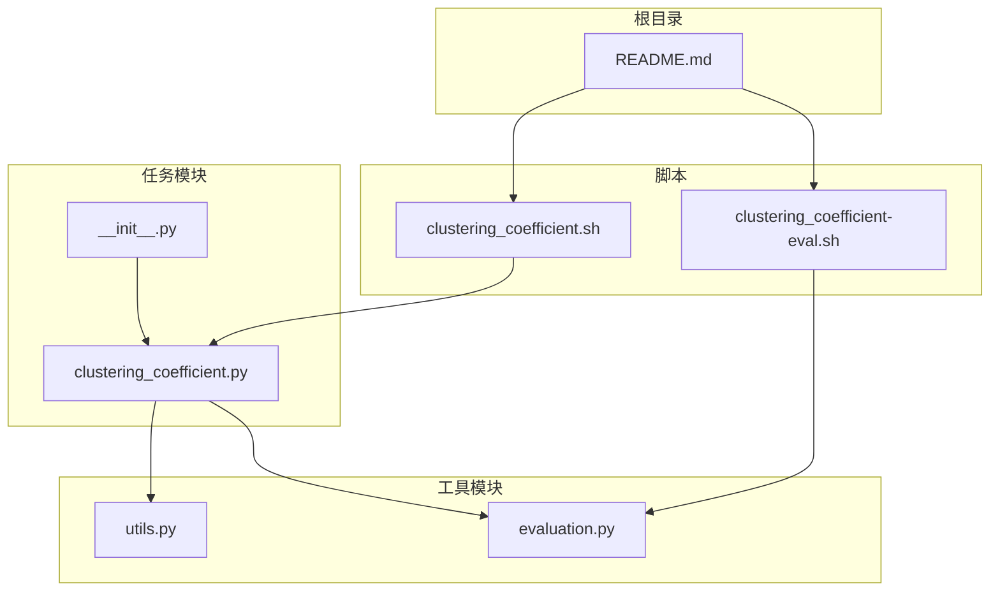
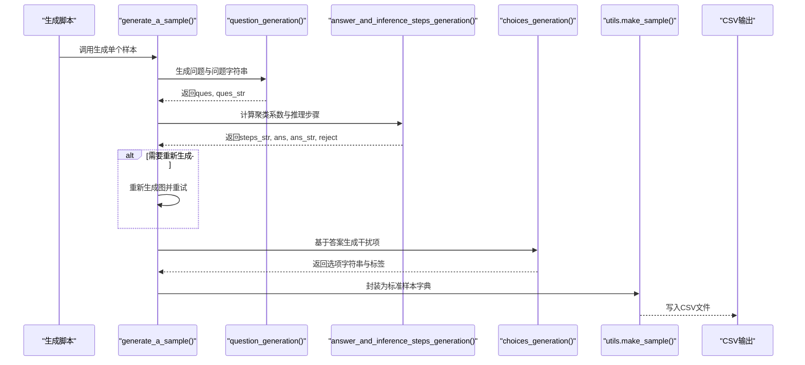
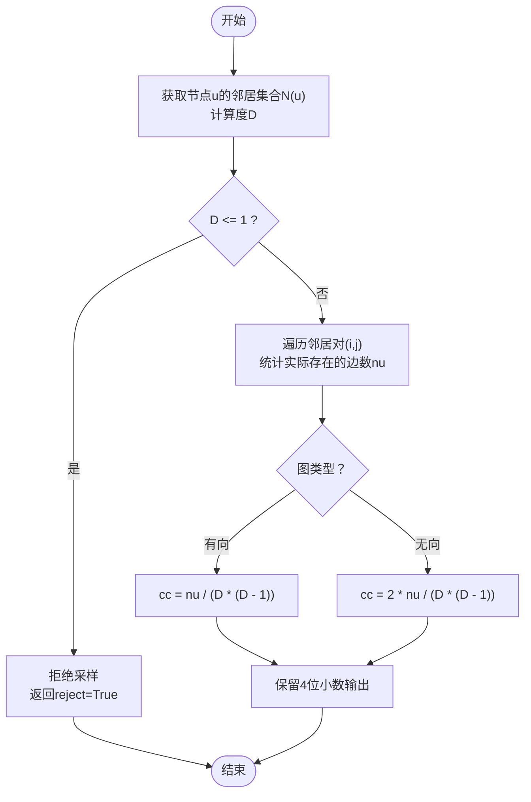
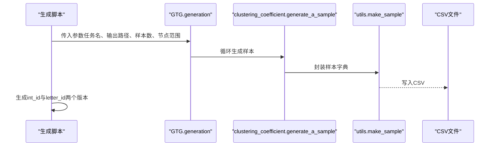
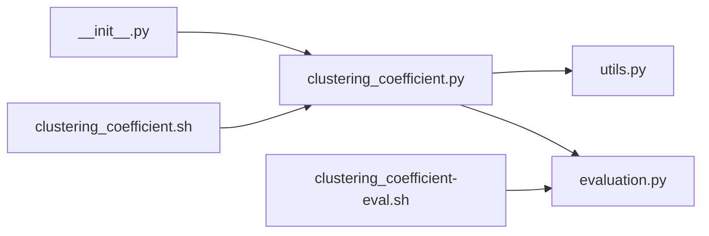

# 聚类系数

<cite>
**本文引用的文件**
- [clustering_coefficient.py](file://GTG/tasks/clustering_coefficient/clustering_coefficient.py)
- [__init__.py](file://GTG/tasks/clustering_coefficient/__init__.py)
- [utils.py](file://GTG/utils/utils.py)
- [evaluation.py](file://GTG/utils/evaluation.py)
- [clustering_coefficient.sh](file://script/dataset_generation/clustering_coefficient.sh)
- [clustering_coefficient-eval.sh](file://script/evaluation/clustering_coefficient-eval.sh)
- [README.md](file://README.md)
</cite>

## 目录
1. [引言](#引言)
2. [项目结构](#项目结构)
3. [核心组件](#核心组件)
4. [架构总览](#架构总览)
5. [详细组件分析](#详细组件分析)
6. [依赖分析](#依赖分析)
7. [性能考虑](#性能考虑)
8. [故障排查指南](#故障排查指南)
9. [结论](#结论)
10. [附录](#附录)

## 引言
本文件围绕“聚类系数”的数学定义与实现进行系统化解析，重点覆盖：
- 局部聚类系数的数学定义：以“三元组闭合比例”为核心，解释其在有向与无向图中的差异。
- 在该代码库中的实现逻辑：从图结构中提取邻居节点关系，计算邻接子图中实际存在的边数与可能边数的比例，并给出推理步骤与答案字符串。
- 值域范围与社交网络意义：解释取值范围为0到1的含义，以及在社交网络分析中的解读。
- 边界情况处理：孤立节点或度小于2的节点的拒绝策略；以及零值样本占比上限控制。
- 浮点数精度控制：统一保留四位小数输出格式。
- 完整流程：问题生成、推理步骤构建、答案生成与选择题构造，以及如何调用相关函数生成自然语言问题与答案对。

## 项目结构
聚类系数任务位于 GTG/tasks/clustering_coefficient 目录下，包含任务实现与导出入口；配套的工具函数与评估器位于 GTG/utils；数据集生成与评估脚本位于 script。

图表来源
- [clustering_coefficient.py](file://GTG/tasks/clustering_coefficient/clustering_coefficient.py#L1-L140)
- [__init__.py](file://GTG/tasks/clustering_coefficient/__init__.py#L1-L3)
- [utils.py](file://GTG/utils/utils.py#L1-L200)
- [evaluation.py](file://GTG/utils/evaluation.py#L1-L200)
- [clustering_coefficient.sh](file://script/dataset_generation/clustering_coefficient.sh#L1-L36)
- [clustering_coefficient-eval.sh](file://script/evaluation/clustering_coefficient-eval.sh#L1-L13)
- [README.md](file://README.md#L1-L90)

章节来源
- [clustering_coefficient.py](file://GTG/tasks/clustering_coefficient/clustering_coefficient.py#L1-L140)
- [__init__.py](file://GTG/tasks/clustering_coefficient/__init__.py#L1-L3)
- [utils.py](file://GTG/utils/utils.py#L1-L200)
- [evaluation.py](file://GTG/utils/evaluation.py#L1-L200)
- [clustering_coefficient.sh](file://script/dataset_generation/clustering_coefficient.sh#L1-L36)
- [clustering_coefficient-eval.sh](file://script/evaluation/clustering_coefficient-eval.sh#L1-L13)
- [README.md](file://README.md#L1-L90)

## 核心组件
- 任务名称常量与全局计数器：用于统计样本总数与零值样本数量，控制零值样本占比不超过阈值。
- 问题生成：随机选择一个节点作为目标节点，生成自然语言问题文本，并根据图是否为有向图附加邻居定义说明。
- 推理与答案生成：计算局部聚类系数，输出逐步推理过程、数值答案与字符串答案；对度小于等于1的节点直接拒绝采样。
- 选项生成：基于正确答案生成干扰项，避免与正确答案过于接近，保证选择题质量。
- 采样生成：循环生成满足条件的样本，直到不被拒绝为止；最终封装为标准样本字典。

章节来源
- [clustering_coefficient.py](file://GTG/tasks/clustering_coefficient/clustering_coefficient.py#L9-L140)

## 架构总览
聚类系数任务的运行时流程如下：脚本驱动生成器，生成随机图并抽取节点，计算局部聚类系数，输出问题、推理步骤与答案，再写入CSV供后续评估使用。

图表来源
- [clustering_coefficient.py](file://GTG/tasks/clustering_coefficient/clustering_coefficient.py#L116-L134)
- [clustering_coefficient.py](file://GTG/tasks/clustering_coefficient/clustering_coefficient.py#L14-L27)
- [clustering_coefficient.py](file://GTG/tasks/clustering_coefficient/clustering_coefficient.py#L29-L115)
- [utils.py](file://GTG/utils/utils.py#L14-L35)
- [clustering_coefficient.sh](file://script/dataset_generation/clustering_coefficient.sh#L1-L36)

## 详细组件分析

### 数学定义与实现要点
- 局部聚类系数的直观含义：衡量某个节点的邻居之间形成“闭合三角形”的程度。对于节点u，设其邻居集合为N(u)，度为D，则：
  - 无向图：聚类系数 = 2 × 实际存在于N(u)中的边数 / 可能边数
  - 有向图：聚类系数 = 实际存在于N(u)中的边数 / 可能边数
- 可能边数的计算：当邻居数为D时，可能边数为 D×(D−1)/2（无向）或 D×(D−1)（有向），因此：
  - 无向图：聚类系数 = 2 × 实际边数 / [D×(D−1)]
  - 有向图：聚类系数 = 实际边数 / [D×(D−1)]

图表来源
- [clustering_coefficient.py](file://GTG/tasks/clustering_coefficient/clustering_coefficient.py#L29-L83)

章节来源
- [clustering_coefficient.py](file://GTG/tasks/clustering_coefficient/clustering_coefficient.py#L29-L83)

### 图结构与邻居关系提取
- 邻居提取：通过图对象的邻居接口获取节点的直接邻居列表，随后统计度数。
- 邻接子图边数统计：
  - 有向图：对邻居集合做笛卡尔积，统计实际存在的边数。
  - 无向图：对邻居集合做组合（避免重复），统计实际存在的边数。
- 输出格式：使用工具函数将节点与边列表格式化为可读字符串，便于推理步骤展示。

章节来源
- [clustering_coefficient.py](file://GTG/tasks/clustering_coefficient/clustering_coefficient.py#L40-L63)
- [utils.py](file://GTG/utils/utils.py#L56-L71)

### 浮点数精度与边界情况处理
- 精度控制：答案字符串统一保留四位小数，确保输出一致性。
- 度小于等于1的节点拒绝：此类节点无法构成有效三元组，直接拒绝采样，避免无效样本污染数据集。
- 零值样本占比控制：维护零值样本计数与总样本计数，若零值占比超过阈值则拒绝当前样本，防止零值样本过多影响分布均衡。

章节来源
- [clustering_coefficient.py](file://GTG/tasks/clustering_coefficient/clustering_coefficient.py#L80-L93)

### 选择题构造与答案生成
- 正确答案：由聚类系数计算得到。
- 干扰项生成：在[0,1]区间内随机采样，排除与正确答案相对误差过小的候选，避免“陷阱选项”。
- 选项排列：将正确答案与干扰项合并后随机打乱，记录正确选项索引。

章节来源
- [clustering_coefficient.py](file://GTG/tasks/clustering_coefficient/clustering_coefficient.py#L96-L114)

### 评估器与输出解析
- 评估器：继承浮点型评估器，采用相对误差阈值判断答案正确性。
- 输出解析：从模型输出中解析首个浮点数，再与标准答案比较，得出正确与否。

章节来源
- [evaluation.py](file://GTG/utils/evaluation.py#L82-L95)

### 完整流程与调用示例
- 数据集生成：通过脚本调用生成器，指定节点数范围、样本数量与数据集标签，生成原始CSV，再分别生成整数ID与字母ID版本。
- 评估流程：将模型输出整理为CSV，使用评估脚本对结果进行统计与评分。

图表来源
- [clustering_coefficient.sh](file://script/dataset_generation/clustering_coefficient.sh#L1-L36)
- [clustering_coefficient.py](file://GTG/tasks/clustering_coefficient/clustering_coefficient.py#L116-L134)
- [utils.py](file://GTG/utils/utils.py#L14-L35)

章节来源
- [clustering_coefficient.sh](file://script/dataset_generation/clustering_coefficient.sh#L1-L36)
- [clustering_coefficient-eval.sh](file://script/evaluation/clustering_coefficient-eval.sh#L1-L13)
- [clustering_coefficient.py](file://GTG/tasks/clustering_coefficient/clustering_coefficient.py#L116-L134)
- [utils.py](file://GTG/utils/utils.py#L14-L35)

## 依赖分析
- 模块间依赖关系：
  - clustering_coefficient.py 依赖 utils 中的节点ID格式化、边列表格式化、图生成与样本封装。
  - clustering_coefficient.py 依赖 evaluation 中的浮点型评估器。
  - __init__.py 导出 generate_a_sample 与 Evaluator，供上层模块使用。
  - 脚本通过命令行调用生成与评估流程。

图表来源
- [clustering_coefficient.py](file://GTG/tasks/clustering_coefficient/clustering_coefficient.py#L1-L140)
- [__init__.py](file://GTG/tasks/clustering_coefficient/__init__.py#L1-L3)
- [utils.py](file://GTG/utils/utils.py#L1-L200)
- [evaluation.py](file://GTG/utils/evaluation.py#L1-L200)
- [clustering_coefficient.sh](file://script/dataset_generation/clustering_coefficient.sh#L1-L36)
- [clustering_coefficient-eval.sh](file://script/evaluation/clustering_coefficient-eval.sh#L1-L13)

章节来源
- [clustering_coefficient.py](file://GTG/tasks/clustering_coefficient/clustering_coefficient.py#L1-L140)
- [__init__.py](file://GTG/tasks/clustering_coefficient/__init__.py#L1-L3)
- [utils.py](file://GTG/utils/utils.py#L1-L200)
- [evaluation.py](file://GTG/utils/evaluation.py#L1-L200)
- [clustering_coefficient.sh](file://script/dataset_generation/clustering_coefficient.sh#L1-L36)
- [clustering_coefficient-eval.sh](file://script/evaluation/clustering_coefficient-eval.sh#L1-L13)

## 性能考虑
- 时间复杂度：对节点u的邻居集合进行两两检查，复杂度约为 O(D^2)，其中D为度数。对于高密度图或大节点度，应关注计算开销。
- 空间复杂度：主要为存储邻居列表与边列表，通常为 O(D)。
- 优化建议：
  - 对于大规模图，可优先筛选度较大的节点，减少整体样本数量。
  - 使用图的邻接表示（如邻接矩阵或稀疏存储）可降低查询成本。
  - 合理设置节点数范围与平均度，避免极端稀疏或稠密导致的无效样本过多。

## 故障排查指南
- 问题：生成的样本被拒绝
  - 可能原因：节点度数小于等于1，或零值样本占比超过阈值。
  - 处理方法：调整图生成策略或增加样本数量，确保分布合理。
- 问题：答案解析失败
  - 可能原因：模型输出未包含可解析的浮点数。
  - 处理方法：检查输出格式，确保包含数字；必要时在评估前清洗输出。
- 问题：聚类系数异常
  - 可能原因：图类型与期望不符（例如将有向图误判为无向图）。
  - 处理方法：确认图是否为有向图，并使用对应的公式计算。

章节来源
- [clustering_coefficient.py](file://GTG/tasks/clustering_coefficient/clustering_coefficient.py#L43-L93)
- [evaluation.py](file://GTG/utils/evaluation.py#L82-L95)

## 结论
本实现以“三元组闭合比例”为核心，提供了局部聚类系数在有向与无向图中的统一计算框架。通过严格的边界情况处理与零值样本占比控制，确保了数据集的质量与分布合理性。配合标准化的样本封装与评估流程，能够稳定地生成高质量的自然语言问答数据，适用于大模型在图理解与推理任务上的训练与评测。

## 附录
- 如何调用相关函数生成自然语言问题与答案对
  - 生成样本：调用 generate_a_sample，内部会依次执行问题生成、推理步骤生成、答案生成与选项生成，并封装为标准样本字典。
  - 数据集生成脚本：使用 clustering_coefficient.sh 指定输出路径、节点范围、样本数量与标签，即可生成多版本数据集。
  - 评估流程：使用 clustering_coefficient-eval.sh 指定数据集与输出路径，对模型输出进行评估并生成结果报告。

章节来源
- [clustering_coefficient.py](file://GTG/tasks/clustering_coefficient/clustering_coefficient.py#L116-L134)
- [clustering_coefficient.sh](file://script/dataset_generation/clustering_coefficient.sh#L1-L36)
- [clustering_coefficient-eval.sh](file://script/evaluation/clustering_coefficient-eval.sh#L1-L13)
- [README.md](file://README.md#L1-L90)