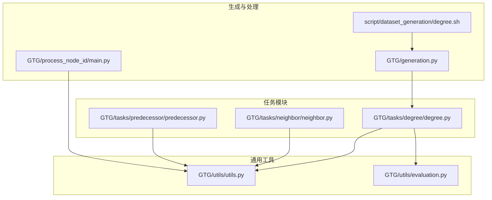
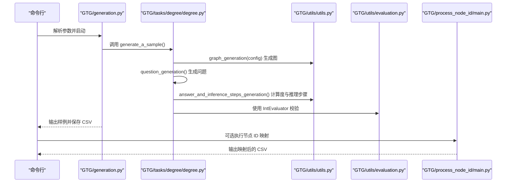
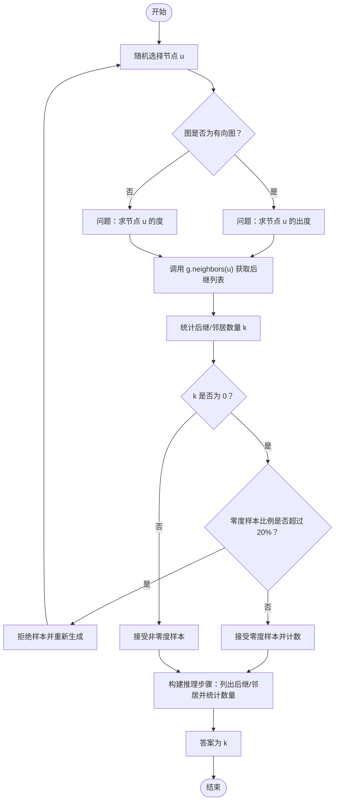
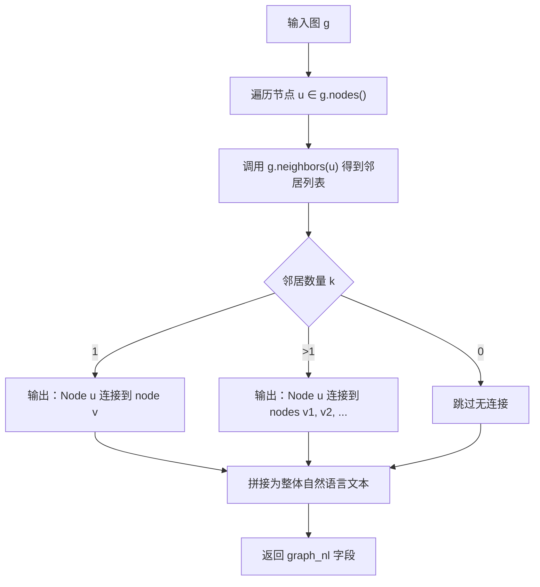
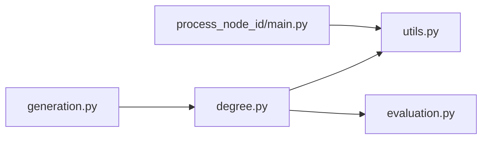

# 节点度

<cite>
**本文引用的文件**
- [GTG/tasks/degree/degree.py](file://GTG/tasks/degree/degree.py)
- [GTG/utils/utils.py](file://GTG/utils/utils.py)
- [GTG/generation.py](file://GTG/generation.py)
- [GTG/utils/evaluation.py](file://GTG/utils/evaluation.py)
- [GTG/tasks/neighbor/neighbor.py](file://GTG/tasks/neighbor/neighbor.py)
- [GTG/tasks/predecessor/predecessor.py](file://GTG/tasks/predecessor/predecessor.py)
- [GTG/process_node_id/main.py](file://GTG/process_node_id/main.py)
- [script/dataset_generation/degree.sh](file://script/dataset_generation/degree.sh)
</cite>

## 目录
1. [引言](#引言)
2. [项目结构](#项目结构)
3. [核心组件](#核心组件)
4. [架构总览](#架构总览)
5. [详细组件分析](#详细组件分析)
6. [依赖关系分析](#依赖关系分析)
7. [性能考量](#性能考量)
8. [故障排查指南](#故障排查指南)
9. [结论](#结论)
10. [附录](#附录)

## 引言
本文件围绕“节点度”的计算方法展开，系统性阐述在有向图与无向图中的差异，并基于仓库中的实现，说明如何通过 NetworkX 的 neighbors() 方法获取邻接节点列表并统计其长度作为节点度值。同时，文档解释推理步骤的生成机制：如何将图遍历过程转化为“Let’s solve this problem step by step”格式的自然语言描述；区分有向图中的“successors（后继）”与无向图中的“neighbors（邻居）”；讨论数据质量控制策略（限制零度节点样本不超过总样本的20%以避免数据偏差）；并结合 utils.py 中的图结构转自然语言函数，说明上下文信息的构建方式，确保生成的问题具有清晰的图结构背景。

## 项目结构
本项目采用按任务模块划分的组织方式，节点度任务位于 GTG/tasks/degree/ 下，通用工具与图生成逻辑位于 GTG/utils/，数据生成入口位于 GTG/generation.py，节点 ID 映射处理位于 GTG/process_node_id/，脚本入口位于 script/dataset_generation/degree.sh。

图表来源
- [GTG/tasks/degree/degree.py](file://GTG/tasks/degree/degree.py#L1-L110)
- [GTG/utils/utils.py](file://GTG/utils/utils.py#L1-L200)
- [GTG/generation.py](file://GTG/generation.py#L1-L107)
- [GTG/utils/evaluation.py](file://GTG/utils/evaluation.py#L1-L120)
- [GTG/tasks/neighbor/neighbor.py](file://GTG/tasks/neighbor/neighbor.py#L1-L49)
- [GTG/tasks/predecessor/predecessor.py](file://GTG/tasks/predecessor/predecessor.py#L1-L47)
- [GTG/process_node_id/main.py](file://GTG/process_node_id/main.py#L1-L58)
- [script/dataset_generation/degree.sh](file://script/dataset_generation/degree.sh#L1-L36)

章节来源
- [GTG/tasks/degree/degree.py](file://GTG/tasks/degree/degree.py#L1-L110)
- [GTG/utils/utils.py](file://GTG/utils/utils.py#L1-L200)
- [GTG/generation.py](file://GTG/generation.py#L1-L107)
- [script/dataset_generation/degree.sh](file://script/dataset_generation/degree.sh#L1-L36)

## 核心组件
- 节点度任务模块：负责生成节点度问题、推理步骤、答案与选择项，并进行数据质量控制。
- 通用工具模块：提供图结构转自然语言、邻接表字符串、边列表字符串、节点 ID 格式化等能力。
- 生成入口：统一解析参数、调度任务模块、保存样本与统计信息。
- 邻居与前驱任务：作为对比参考，展示 neighbors()/predecessors() 在不同图类型中的使用方式。
- 节点 ID 处理：对生成的数据集进行整数 ID 与字母 ID 的映射处理，保证下游一致性。

章节来源
- [GTG/tasks/degree/degree.py](file://GTG/tasks/degree/degree.py#L1-L110)
- [GTG/utils/utils.py](file://GTG/utils/utils.py#L1-L200)
- [GTG/generation.py](file://GTG/generation.py#L1-L107)
- [GTG/tasks/neighbor/neighbor.py](file://GTG/tasks/neighbor/neighbor.py#L1-L49)
- [GTG/tasks/predecessor/predecessor.py](file://GTG/tasks/predecessor/predecessor.py#L1-L47)
- [GTG/process_node_id/main.py](file://GTG/process_node_id/main.py#L1-L58)

## 架构总览
下图展示了从命令行到最终数据集的端到端流程，以及节点度任务在其中的位置与依赖关系。

图表来源
- [GTG/generation.py](file://GTG/generation.py#L1-L107)
- [GTG/tasks/degree/degree.py](file://GTG/tasks/degree/degree.py#L1-L110)
- [GTG/utils/utils.py](file://GTG/utils/utils.py#L1-L200)
- [GTG/utils/evaluation.py](file://GTG/utils/evaluation.py#L1-L120)
- [GTG/process_node_id/main.py](file://GTG/process_node_id/main.py#L1-L58)

## 详细组件分析

### 节点度计算与推理步骤生成
- 问题生成：随机选择一个节点，根据图是否为有向图决定问题表述（有向图问“出度”，无向图问“度”）。
- 答案与推理步骤：
  - 使用 neighbors() 获取邻接节点列表，统计其长度作为度值。
  - 有向图强调“后继（successors）”，无向图强调“邻居（neighbors）”。
  - 推理步骤以“Let’s solve this problem step by step.”开头，逐步输出邻接节点集合与数量，最后给出度值。
- 数据质量控制：
  - 当度为0时，累计零度样本数与总样本数，若零度比例超过阈值（20%），则拒绝该样本并重新生成，直到满足比例要求。

图表来源
- [GTG/tasks/degree/degree.py](file://GTG/tasks/degree/degree.py#L1-L110)

章节来源
- [GTG/tasks/degree/degree.py](file://GTG/tasks/degree/degree.py#L1-L110)

### 有向图 vs 无向图中的“successors”与“neighbors”
- 无向图：neighbors() 返回与节点直接相连的所有邻居，度即邻居数量。
- 有向图：neighbors() 返回“后继”（successors），即以该节点为起点的边所指向的节点集合；若需入度，应使用 predecessors()。
- 在本任务中，有向图问题明确问“出度”，因此使用 neighbors() 并以“后继”描述推理步骤；无向图问题问“度”，使用 neighbors() 并以“邻居”描述推理步骤。

章节来源
- [GTG/tasks/degree/degree.py](file://GTG/tasks/degree/degree.py#L1-L110)
- [GTG/tasks/neighbor/neighbor.py](file://GTG/tasks/neighbor/neighbor.py#L1-L49)
- [GTG/tasks/predecessor/predecessor.py](file://GTG/tasks/predecessor/predecessor.py#L1-L47)

### 图结构转自然语言与上下文构建
- 自然语言描述：遍历所有节点，对每个节点输出其邻居集合的自然语言描述，形成全局上下文，便于模型理解图结构。
- 上下文构建：生成样本时，会将自然语言描述写入样本字段，供下游训练或提示模板使用，确保问题具备清晰的图结构背景。

图表来源
- [GTG/utils/utils.py](file://GTG/utils/utils.py#L109-L126)

章节来源
- [GTG/utils/utils.py](file://GTG/utils/utils.py#L109-L126)

### 数据质量控制策略
- 目标：限制零度节点样本占比不超过20%，避免数据偏差导致模型偏向“无连接”场景。
- 实现：在答案为0时，检查当前零度样本比例，超过阈值则拒绝该样本并重新生成；否则接受并计数。
- 影响：通过拒绝策略动态平衡正负样本分布，提升训练数据的代表性。

章节来源
- [GTG/tasks/degree/degree.py](file://GTG/tasks/degree/degree.py#L52-L63)

### 生成入口与脚本
- 入口脚本：通过命令行参数指定任务、输出路径、样本数量与节点规模范围，自动完成样本生成与统计。
- 节点 ID 映射：可选地对生成的 CSV 执行整数 ID 或字母 ID 的映射处理，便于下游模型训练的一致性。

章节来源
- [GTG/generation.py](file://GTG/generation.py#L1-L107)
- [script/dataset_generation/degree.sh](file://script/dataset_generation/degree.sh#L1-L36)
- [GTG/process_node_id/main.py](file://GTG/process_node_id/main.py#L1-L58)

## 依赖关系分析
- 模块耦合：
  - degree.py 依赖 utils.py 的图生成、节点 ID 格式化与样本封装；依赖 evaluation.py 的整数评测器。
  - generation.py 统一调度各任务模块，负责随机种子设置、样本收集与统计。
  - process_node_id/main.py 依赖 utils 中的映射函数，对 graph_nl、graph、nodes 等字段进行 ID 重映射。
- 外部依赖：
  - NetworkX：提供图对象、neighbors()/predecessors()、is_directed() 等接口。
  - NumPy/Pandas：用于数组操作与数据持久化。

图表来源
- [GTG/tasks/degree/degree.py](file://GTG/tasks/degree/degree.py#L1-L110)
- [GTG/utils/utils.py](file://GTG/utils/utils.py#L1-L200)
- [GTG/utils/evaluation.py](file://GTG/utils/evaluation.py#L1-L120)
- [GTG/generation.py](file://GTG/generation.py#L1-L107)
- [GTG/process_node_id/main.py](file://GTG/process_node_id/main.py#L1-L58)

章节来源
- [GTG/tasks/degree/degree.py](file://GTG/tasks/degree/degree.py#L1-L110)
- [GTG/utils/utils.py](file://GTG/utils/utils.py#L1-L200)
- [GTG/utils/evaluation.py](file://GTG/utils/evaluation.py#L1-L120)
- [GTG/generation.py](file://GTG/generation.py#L1-L107)
- [GTG/process_node_id/main.py](file://GTG/process_node_id/main.py#L1-L58)

## 性能考量
- 时间复杂度：单次度计算为 O(k)，k 为节点邻居数量；整体数据生成受样本数量与图规模影响。
- 内存占用：主要来自图对象与字符串拼接（邻接表、自然语言描述），可通过批量生成与及时释放中间变量优化。
- 随机性与稳定性：通过固定随机种子与哈希种子映射，确保结果可复现；节点 ID 重映射避免标签偏置。

## 故障排查指南
- 零度样本过多：
  - 现象：生成过程中反复拒绝样本，耗时增加。
  - 原因：零度比例超过阈值。
  - 处理：调整图生成策略或增大平均度，降低孤立节点概率。
- 评测失败：
  - 现象：答案解析失败或不匹配。
  - 原因：输出格式不符合解析规则或答案错误。
  - 处理：检查推理步骤是否包含正确数值；确认评测器解析逻辑。
- 节点 ID 不一致：
  - 现象：下游模型报错或映射异常。
  - 处理：执行节点 ID 映射脚本，确保 graph_nl、graph、nodes 等字段一致。

章节来源
- [GTG/tasks/degree/degree.py](file://GTG/tasks/degree/degree.py#L52-L63)
- [GTG/utils/evaluation.py](file://GTG/utils/evaluation.py#L1-L120)
- [GTG/process_node_id/main.py](file://GTG/process_node_id/main.py#L1-L58)

## 结论
本文件系统梳理了节点度在有向图与无向图中的差异，明确了 neighbors()/successors() 的使用边界，并基于仓库实现总结了推理步骤的自然语言生成机制。通过零度样本比例控制策略，有效避免了数据偏差；借助 utils.py 的图结构转自然语言函数，构建了清晰的上下文背景，提升了问题的可解释性与可训练性。整体流程从生成入口到节点 ID 映射闭环完整，便于扩展至更多图任务。

## 附录
- 关键实现位置参考：
  - 节点度计算与推理步骤：[GTG/tasks/degree/degree.py](file://GTG/tasks/degree/degree.py#L1-L110)
  - 图结构转自然语言：[GTG/utils/utils.py](file://GTG/utils/utils.py#L109-L126)
  - 生成入口与统计：[GTG/generation.py](file://GTG/generation.py#L1-L107)
  - 评测器（整数）：[GTG/utils/evaluation.py](file://GTG/utils/evaluation.py#L69-L80)
  - 邻居与前驱任务（对比参考）：[GTG/tasks/neighbor/neighbor.py](file://GTG/tasks/neighbor/neighbor.py#L1-L49)、[GTG/tasks/predecessor/predecessor.py](file://GTG/tasks/predecessor/predecessor.py#L1-L47)
  - 节点 ID 映射：[GTG/process_node_id/main.py](file://GTG/process_node_id/main.py#L1-L58)
  - 脚本入口：[script/dataset_generation/degree.sh](file://script/dataset_generation/degree.sh#L1-L36)