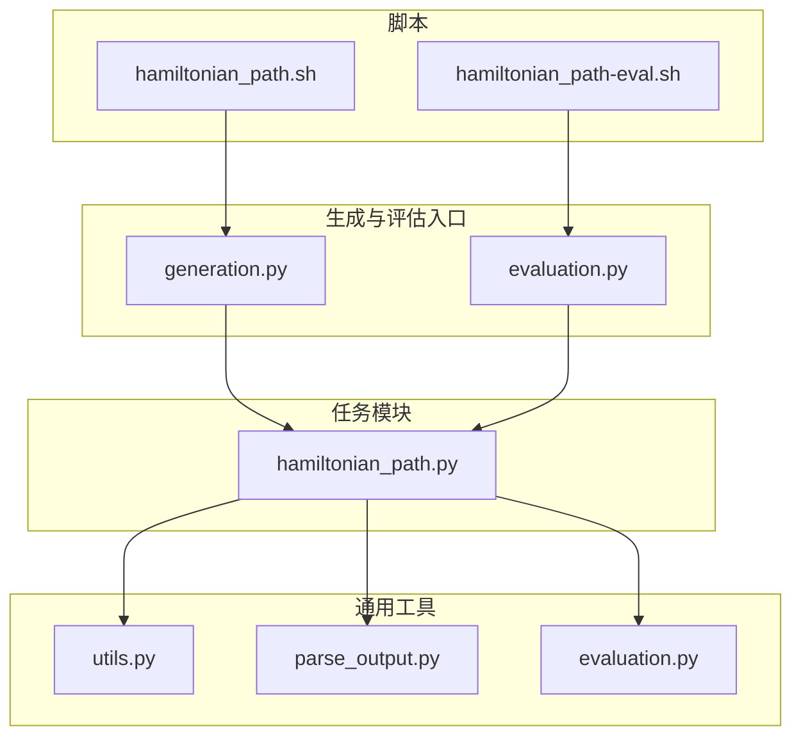
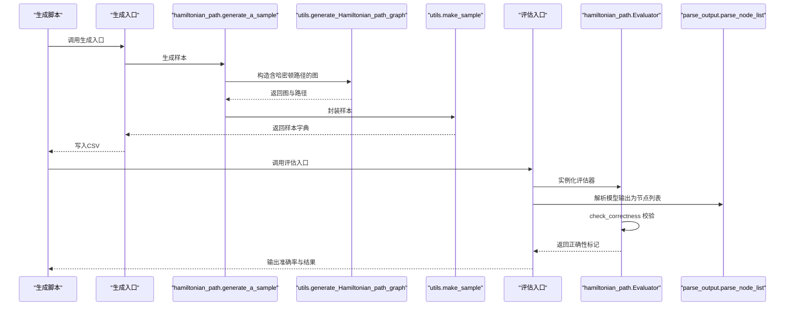
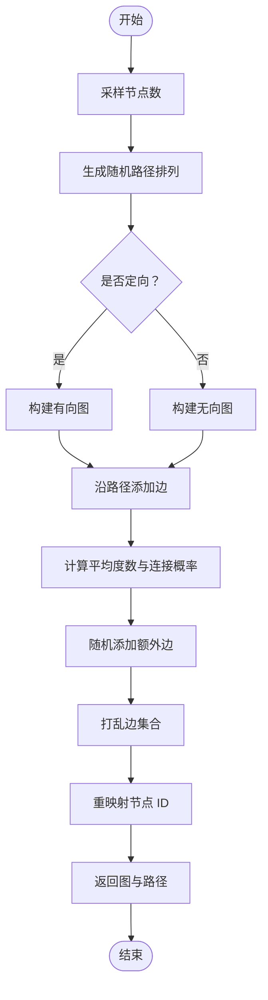
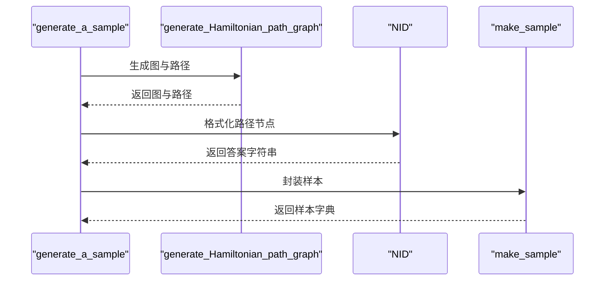
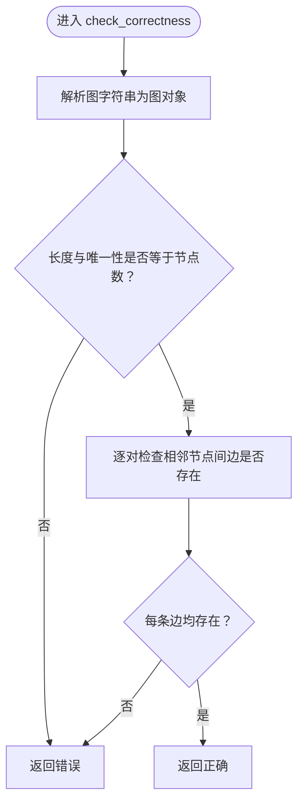
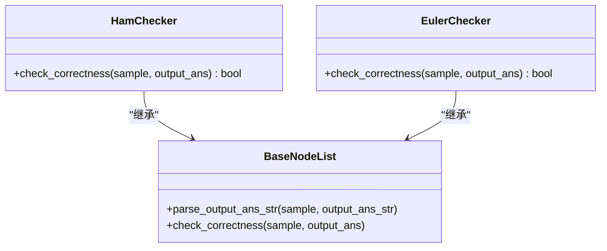
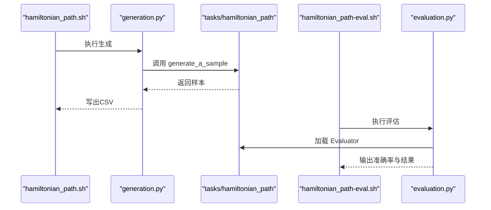
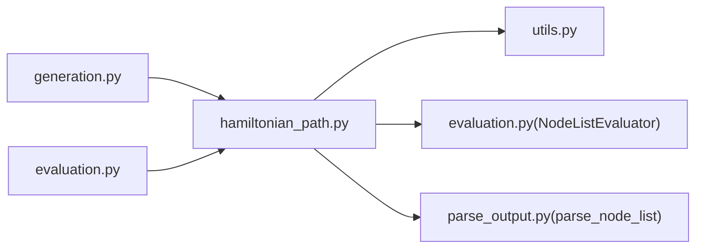

# 哈密顿路径

<cite>
**本文引用的文件**
- [hamiltonian_path.py](file://GTG/tasks/hamiltonian_path/hamiltonian_path.py)
- [utils.py](file://GTG/utils/utils.py)
- [evaluation.py](file://GTG/utils/evaluation.py)
- [euler_path.py](file://GTG/tasks/euler_path/euler_path.py)
- [parse_output.py](file://GTG/utils/parse_output.py)
- [generation.py](file://GTG/generation.py)
- [evaluation_main.py](file://GTG/evaluation.py)
- [hamiltonian_path.sh](file://script/dataset_generation/hamiltonian_path.sh)
- [hamiltonian_path-eval.sh](file://script/evaluation/hamiltonian_path-eval.sh)
</cite>

## 目录
1. [简介](#简介)
2. [项目结构](#项目结构)
3. [核心组件](#核心组件)
4. [架构总览](#架构总览)
5. [详细组件分析](#详细组件分析)
6. [依赖关系分析](#依赖关系分析)
7. [性能考量](#性能考量)
8. [故障排查指南](#故障排查指南)
9. [结论](#结论)
10. [附录](#附录)

## 简介
本文件系统化说明哈密顿路径任务在代码库中的实现方案，重点围绕以下目标展开：
- 解释 generate_Hamiltonian_path_graph 如何构造一条贯穿所有节点的路径，并在此基础上添加额外边以生成最终图，从而保证解的存在性。
- 描述 generate_a_sample 如何将这条预设路径作为正确答案。
- 深入分析 Evaluator 类的 check_correctness 方法：如何验证输出节点列表的长度和唯一性是否等于图的节点总数，以及如何逐边检查路径中相邻节点在图中是否确实存在连接。
- 对比此任务与欧拉路径在验证逻辑上的差异（节点访问 vs 边访问）。
- 讨论该 NP 完全问题的特性如何影响其在数据集生成中的应用方式。

## 项目结构
哈密顿路径任务位于 GTG/tasks/hamiltonian_path/hamiltonian_path.py，配套的通用工具、评估器基类、解析函数等位于 GTG/utils 下；数据集生成与评估通过脚本与主程序入口调用。

图表来源
- [hamiltonian_path.py](file://GTG/tasks/hamiltonian_path/hamiltonian_path.py#L1-L40)
- [utils.py](file://GTG/utils/utils.py#L437-L479)
- [evaluation.py](file://GTG/utils/evaluation.py#L114-L141)
- [parse_output.py](file://GTG/utils/parse_output.py#L107-L118)
- [generation.py](file://GTG/generation.py#L29-L57)
- [evaluation_main.py](file://GTG/evaluation.py#L14-L36)
- [hamiltonian_path.sh](file://script/dataset_generation/hamiltonian_path.sh#L1-L36)
- [hamiltonian_path-eval.sh](file://script/evaluation/hamiltonian_path-eval.sh#L1-L14)

章节来源
- [hamiltonian_path.py](file://GTG/tasks/hamiltonian_path/hamiltonian_path.py#L1-L40)
- [utils.py](file://GTG/utils/utils.py#L437-L479)
- [evaluation.py](file://GTG/utils/evaluation.py#L114-L141)
- [parse_output.py](file://GTG/utils/parse_output.py#L107-L118)
- [generation.py](file://GTG/generation.py#L29-L57)
- [evaluation_main.py](file://GTG/evaluation.py#L14-L36)
- [hamiltonian_path.sh](file://script/dataset_generation/hamiltonian_path.sh#L1-L36)
- [hamiltonian_path-eval.sh](file://script/evaluation/hamiltonian_path-eval.sh#L1-L14)

## 核心组件
- 任务定义与样本生成
  - generate_a_sample：基于配置生成一个带正确答案的样本，其中正确答案即为预设的哈密顿路径。
- 图构造与样本生成
  - generate_Hamiltonian_path_graph：按配置生成包含哈密顿路径的图，并随机添加额外边，确保解的存在性。
- 评估器
  - Evaluator（继承自 NodeListEvaluator）：对模型输出的节点序列进行校验，判断其是否为有效哈密顿路径。
- 通用工具
  - edge_list_str_to_graph：将字符串形式的边列表还原为 NetworkX 图对象。
  - NID、make_sample：用于格式化节点 ID 和封装样本字典。
- 解析与输出
  - parse_node_list：从模型输出中解析节点列表，确保节点 ID 合法。

章节来源
- [hamiltonian_path.py](file://GTG/tasks/hamiltonian_path/hamiltonian_path.py#L12-L21)
- [utils.py](file://GTG/utils/utils.py#L437-L479)
- [evaluation.py](file://GTG/utils/evaluation.py#L114-L141)
- [parse_output.py](file://GTG/utils/parse_output.py#L107-L118)

## 架构总览
下图展示了哈密顿路径任务从生成到评估的整体流程，包括数据生成、样本封装、模型推理、结果解析与评估。

图表来源
- [generation.py](file://GTG/generation.py#L29-L57)
- [hamiltonian_path.py](file://GTG/tasks/hamiltonian_path/hamiltonian_path.py#L12-L21)
- [utils.py](file://GTG/utils/utils.py#L437-L479)
- [evaluation_main.py](file://GTG/evaluation.py#L14-L36)
- [evaluation.py](file://GTG/utils/evaluation.py#L114-L141)
- [parse_output.py](file://GTG/utils/parse_output.py#L107-L118)

## 详细组件分析

### 组件A：generate_Hamiltonian_path_graph 的图构造策略
该函数负责生成一个包含哈密顿路径的图，并通过添加额外边提升问题难度与解的存在性保障。其关键步骤如下：
- 随机采样节点数并生成一条随机排列的路径。
- 根据是否定向选择图类型（有向或无向）。
- 先沿路径添加边，形成一条贯穿所有节点的路径。
- 在此基础上，按平均度数与节点对概率随机添加额外边，随后打乱边集合与重映射节点 ID，确保输出图的拓扑性质与节点标识的多样性。
- 返回最终图与路径。

图表来源
- [utils.py](file://GTG/utils/utils.py#L437-L479)

章节来源
- [utils.py](file://GTG/utils/utils.py#L437-L479)

### 组件B：generate_a_sample 如何将预设路径作为正确答案
- 生成阶段：调用 generate_Hamiltonian_path_graph 获取图与路径。
- 正确答案：使用 NID 将路径节点格式化为字符串，作为样本 answer 字段。
- 问题描述：提供哈密顿路径的定义与要求（访问每个节点恰好一次）。
- 样本封装：通过 make_sample 将图、问题、答案等字段打包为标准样本字典。

图表来源
- [hamiltonian_path.py](file://GTG/tasks/hamiltonian_path/hamiltonian_path.py#L12-L21)
- [utils.py](file://GTG/utils/utils.py#L56-L64)
- [utils.py](file://GTG/utils/utils.py#L14-L36)

章节来源
- [hamiltonian_path.py](file://GTG/tasks/hamiltonian_path/hamiltonian_path.py#L12-L21)
- [utils.py](file://GTG/utils/utils.py#L56-L64)
- [utils.py](file://GTG/utils/utils.py#L14-L36)

### 组件C：Evaluator.check_correctness 的验证逻辑
- 输入：样本字典与模型输出的节点列表。
- 还原图：使用 edge_list_str_to_graph 将样本中的图字符串还原为 NetworkX 图对象。
- 长度与唯一性检查：若输出节点列表的长度不等于节点总数，或去重后的数量不等于节点总数，则直接判定错误。
- 边连续性检查：遍历相邻节点对，检查图中是否存在相应边（考虑有向/无向）。
- 返回值：全部满足则返回正确，否则返回错误。

图表来源
- [hamiltonian_path.py](file://GTG/tasks/hamiltonian_path/hamiltonian_path.py#L24-L40)
- [utils.py](file://GTG/utils/utils.py#L82-L96)
- [evaluation.py](file://GTG/utils/evaluation.py#L114-L141)

章节来源
- [hamiltonian_path.py](file://GTG/tasks/hamiltonian_path/hamiltonian_path.py#L24-L40)
- [utils.py](file://GTG/utils/utils.py#L82-L96)
- [evaluation.py](file://GTG/utils/evaluation.py#L114-L141)

### 组件D：与欧拉路径验证逻辑的对比
- 哈密顿路径（Hamiltonian Path）
  - 关注“节点访问”：路径需访问每个节点恰好一次。
  - 验证要点：节点列表长度与唯一性必须等于节点总数；相邻节点之间必须存在边。
- 欧拉路径（Euler Path）
  - 关注“边访问”：路径需遍历每条边恰好一次。
  - 验证要点：路径长度应等于边数加一；对于有向图，不允许重复使用同一有向边；对于无向图，不允许重复使用同一无向边的两个方向。

图表来源
- [hamiltonian_path.py](file://GTG/tasks/hamiltonian_path/hamiltonian_path.py#L24-L40)
- [euler_path.py](file://GTG/tasks/euler_path/euler_path.py#L24-L55)
- [evaluation.py](file://GTG/utils/evaluation.py#L114-L141)

章节来源
- [hamiltonian_path.py](file://GTG/tasks/hamiltonian_path/hamiltonian_path.py#L24-L40)
- [euler_path.py](file://GTG/tasks/euler_path/euler_path.py#L24-L55)
- [evaluation.py](file://GTG/utils/evaluation.py#L114-L141)

### 组件E：数据集生成与评估流程
- 生成流程
  - 通过脚本调用生成入口，按配置生成指定数量的样本，写入 CSV 文件。
  - 生成示例与统计信息随生成过程输出。
- 评估流程
  - 通过脚本调用评估入口，读取数据集与模型输出，合并后逐样本评估，输出准确率与结果文件。

图表来源
- [hamiltonian_path.sh](file://script/dataset_generation/hamiltonian_path.sh#L1-L36)
- [generation.py](file://GTG/generation.py#L29-L57)
- [hamiltonian_path.py](file://GTG/tasks/hamiltonian_path/hamiltonian_path.py#L12-L21)
- [hamiltonian_path-eval.sh](file://script/evaluation/hamiltonian_path-eval.sh#L1-L14)
- [evaluation_main.py](file://GTG/evaluation.py#L14-L36)

章节来源
- [hamiltonian_path.sh](file://script/dataset_generation/hamiltonian_path.sh#L1-L36)
- [generation.py](file://GTG/generation.py#L29-L57)
- [hamiltonian_path-eval.sh](file://script/evaluation/hamiltonian_path-eval.sh#L1-L14)
- [evaluation_main.py](file://GTG/evaluation.py#L14-L36)

## 依赖关系分析
- 任务模块依赖
  - hamiltonian_path.py 依赖 utils 中的图构造、样本封装、边列表解析与图还原函数。
  - 评估器继承自 NodeListEvaluator，复用解析节点列表的通用逻辑。
- 生成与评估入口
  - generation.py 动态加载任务模块并调用 generate_a_sample。
  - evaluation.py 动态加载任务模块的评估器并执行评估。

图表来源
- [hamiltonian_path.py](file://GTG/tasks/hamiltonian_path/hamiltonian_path.py#L1-L40)
- [utils.py](file://GTG/utils/utils.py#L14-L36)
- [evaluation.py](file://GTG/utils/evaluation.py#L114-L141)
- [parse_output.py](file://GTG/utils/parse_output.py#L107-L118)
- [generation.py](file://GTG/generation.py#L29-L57)
- [evaluation_main.py](file://GTG/evaluation.py#L14-L36)

章节来源
- [hamiltonian_path.py](file://GTG/tasks/hamiltonian_path/hamiltonian_path.py#L1-L40)
- [utils.py](file://GTG/utils/utils.py#L14-L36)
- [evaluation.py](file://GTG/utils/evaluation.py#L114-L141)
- [parse_output.py](file://GTG/utils/parse_output.py#L107-L118)
- [generation.py](file://GTG/generation.py#L29-L57)
- [evaluation_main.py](file://GTG/evaluation.py#L14-L36)

## 性能考量
- 图构造复杂度
  - 路径边添加：O(n)。
  - 额外边添加：期望 O(n^2)（按平均度数与概率），但实际受随机性影响。
  - 打乱边与重映射：O(n + m)，m 为边数。
- 评估复杂度
  - 长度与唯一性检查：O(n)。
  - 边存在性检查：O(n)。
- 数据集规模
  - 生成入口支持批量生成与统计输出，便于大规模评测与分析。

[本节为一般性指导，无需列出具体文件来源]

## 故障排查指南
- 输出未被解析为节点列表
  - 检查模型输出是否包含合法节点 ID 格式；解析函数会过滤非法节点。
  - 参考路径解析逻辑与节点集合来源。
- 验证失败
  - 若长度或唯一性不满足，确认输出是否包含重复节点或遗漏节点。
  - 若相邻边不存在，确认图的方向性与边集合是否一致。
- 图还原异常
  - 确认样本中的图字符串格式与节点 ID 格式一致。

章节来源
- [parse_output.py](file://GTG/utils/parse_output.py#L107-L118)
- [evaluation.py](file://GTG/utils/evaluation.py#L114-L141)
- [utils.py](file://GTG/utils/utils.py#L82-L96)

## 结论
- 哈密顿路径任务通过“先构造路径再随机加边”的策略，既保证了解的存在性，又兼顾了问题难度与多样性。
- 评估器采用“节点访问优先”的验证策略，强调路径的节点覆盖与边连续性，与欧拉路径的“边访问优先”形成清晰对比。
- 该 NP 完全问题在数据集生成中可通过控制平均度数与图规模来平衡可解性与挑战性，适合用于大模型在组合优化与推理能力方面的评测。

[本节为总结性内容，无需列出具体文件来源]

## 附录
- 关键实现路径参考
  - 图构造：[utils.py](file://GTG/utils/utils.py#L437-L479)
  - 样本生成：[hamiltonian_path.py](file://GTG/tasks/hamiltonian_path/hamiltonian_path.py#L12-L21)
  - 评估器：[hamiltonian_path.py](file://GTG/tasks/hamiltonian_path/hamiltonian_path.py#L24-L40)
  - 节点列表解析：[parse_output.py](file://GTG/utils/parse_output.py#L107-L118)
  - 生成入口：[generation.py](file://GTG/generation.py#L29-L57)
  - 评估入口：[evaluation_main.py](file://GTG/evaluation.py#L14-L36)
  - 生成脚本：[hamiltonian_path.sh](file://script/dataset_generation/hamiltonian_path.sh#L1-L36)
  - 评估脚本：[hamiltonian_path-eval.sh](file://script/evaluation/hamiltonian_path-eval.sh#L1-L14)