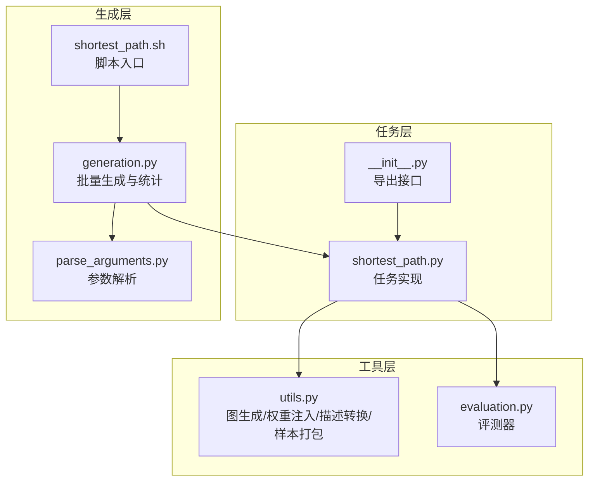
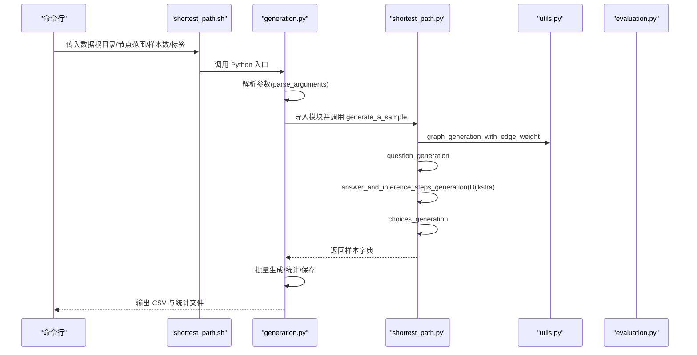
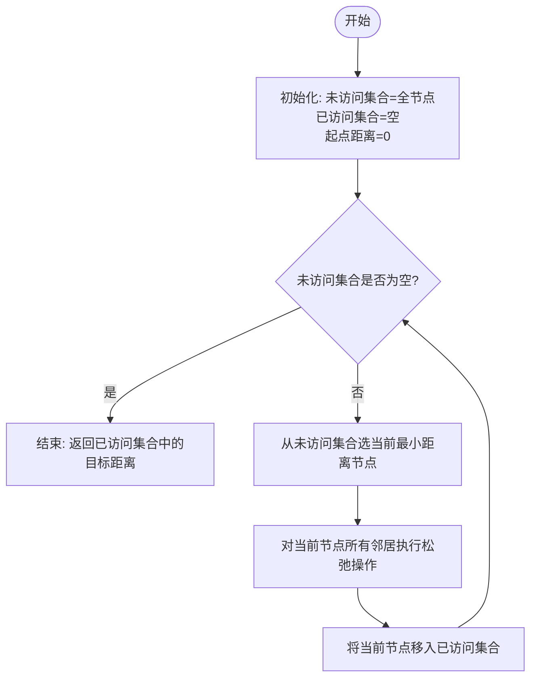
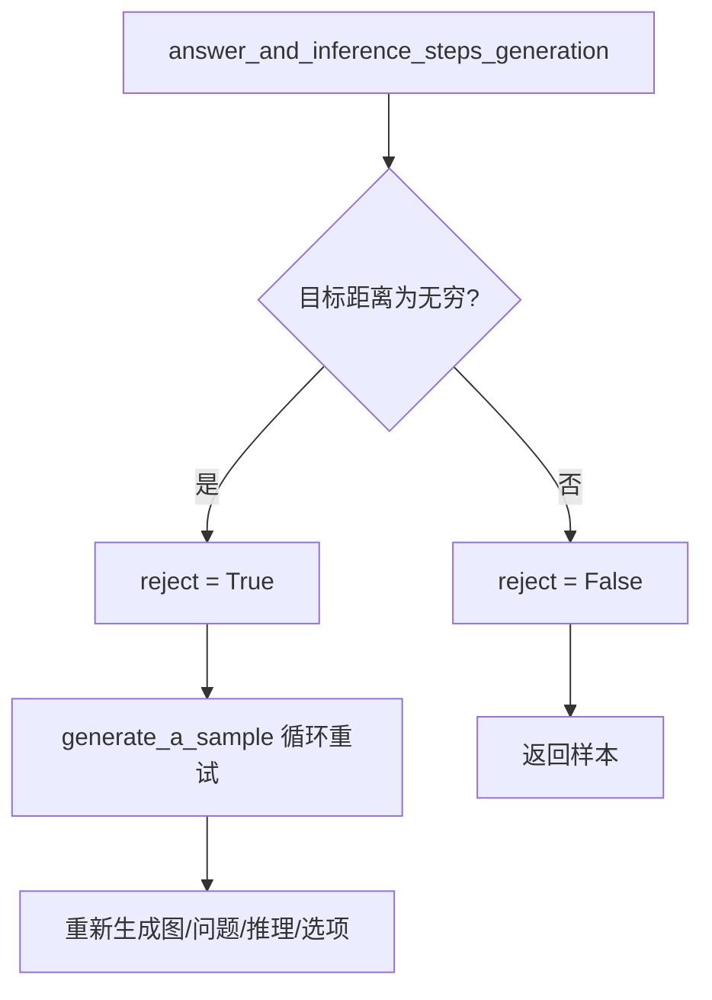
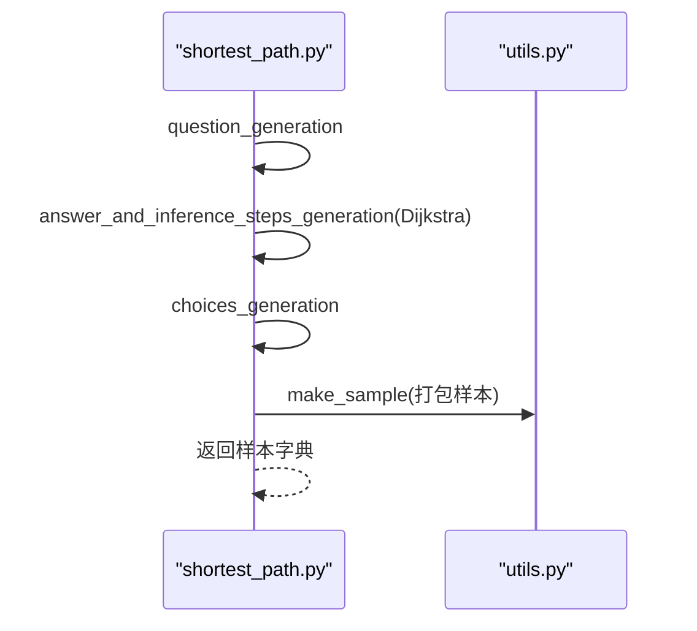
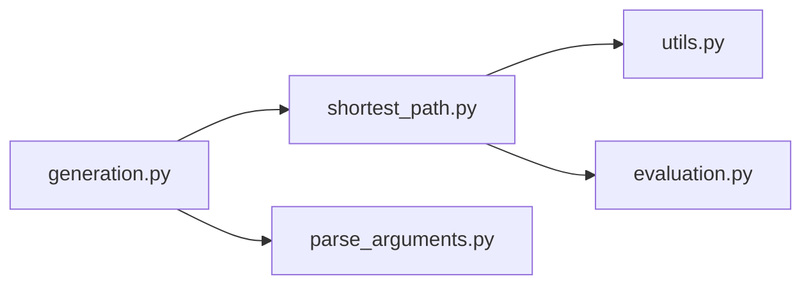

# 最短路径

<cite>
**本文引用的文件**
- [shortest_path.py](file://GTG/tasks/shortest_path/shortest_path.py)
- [__init__.py](file://GTG/tasks/shortest_path/__init__.py)
- [generation.py](file://GTG/generation.py)
- [utils.py](file://GTG/utils/utils.py)
- [evaluation.py](file://GTG/utils/evaluation.py)
- [parse_arguments.py](file://GTG/utils/parse_arguments.py)
- [shortest_path.sh](file://script/dataset_generation/shortest_path.sh)
</cite>

## 目录
1. [引言](#引言)
2. [项目结构](#项目结构)
3. [核心组件](#核心组件)
4. [架构总览](#架构总览)
5. [详细组件分析](#详细组件分析)
6. [依赖关系分析](#依赖关系分析)
7. [性能考量](#性能考量)
8. [故障排查指南](#故障排查指南)
9. [结论](#结论)
10. [附录](#附录)

## 引言
本文件围绕 GraphInstruct 中“最短路径”任务的实现进行系统性解析，重点聚焦于 shortest_path.py 中基于 Dijkstra 算法的路径计算逻辑与样本生成流水线。文档将从数据结构与算法细节入手，阐述节点距离初始化、未访问节点集合管理、松弛操作的实现要点；并说明如何生成包含逐步推理过程的文本描述；解释输入图的加权有向/无向特性要求；当起点与终点不连通时的无穷距离处理与样本重生成策略；最后梳理问题构建（question_generation）、答案与推理步骤生成（answer_and_inference_steps_generation）、选择题选项生成（choices_generation）三阶段的协作流程，并讨论 O(V^2) 时间复杂度对大规模图样本生成效率的影响与优化建议。

## 项目结构
- 任务模块位于 GTG/tasks/shortest_path，包含 shortest_path.py（任务实现）与 __init__.py（导出接口）。
- 样本生成入口位于 GTG/generation.py，负责解析参数、调度任务模块、批量生成样本并保存统计信息。
- 工具函数与图构造位于 GTG/utils/utils.py，提供图生成、权重注入、自然语言描述转换、样本打包等能力。
- 评估器位于 GTG/utils/evaluation.py，提供整数类评测器以匹配最短路径输出格式。
- 脚本层通过 shell 脚本 shortest_path.sh 统一调用生成流程，支持不同节点 ID 类型的后处理。

图表来源
- [shortest_path.py](file://GTG/tasks/shortest_path/shortest_path.py#L1-L140)
- [__init__.py](file://GTG/tasks/shortest_path/__init__.py#L1-L3)
- [generation.py](file://GTG/generation.py#L1-L107)
- [utils.py](file://GTG/utils/utils.py#L1-L617)
- [evaluation.py](file://GTG/utils/evaluation.py#L1-L283)
- [parse_arguments.py](file://GTG/utils/parse_arguments.py#L1-L28)
- [shortest_path.sh](file://script/dataset_generation/shortest_path.sh#L1-L36)

章节来源
- [shortest_path.py](file://GTG/tasks/shortest_path/shortest_path.py#L1-L140)
- [generation.py](file://GTG/generation.py#L1-L107)
- [utils.py](file://GTG/utils/utils.py#L1-L617)
- [evaluation.py](file://GTG/utils/evaluation.py#L1-L283)
- [parse_arguments.py](file://GTG/utils/parse_arguments.py#L1-L28)
- [shortest_path.sh](file://script/dataset_generation/shortest_path.sh#L1-L36)

## 核心组件
- 任务名称常量：用于标识任务类型，便于统一存储与后续处理。
- 问题生成：随机选择起点与终点，避免相同节点，生成自然语言问题描述。
- 答案与推理步骤生成：基于 Dijkstra 算法迭代更新距离，记录每轮未访问/已访问节点状态，最终得到最短距离与可读化推理文本。
- 选项生成：在合理范围内生成若干错误选项，确保与正确答案差异足够大且不重复，打乱顺序并标注正确标签。
- 样本生成：循环直至满足连通条件（非无穷），拼装完整样本并返回。

章节来源
- [shortest_path.py](file://GTG/tasks/shortest_path/shortest_path.py#L12-L140)

## 架构总览
下图展示了从命令行到样本产出的整体流程，以及各模块间的依赖关系。

图表来源
- [shortest_path.sh](file://script/dataset_generation/shortest_path.sh#L1-L36)
- [generation.py](file://GTG/generation.py#L1-L107)
- [shortest_path.py](file://GTG/tasks/shortest_path/shortest_path.py#L115-L133)
- [utils.py](file://GTG/utils/utils.py#L352-L366)

## 详细组件分析

### Dijkstra 算法实现与逐步推理
- 节点距离初始化：使用字典维护每个节点的当前最短距离，起始节点设为 0，其余初始化为无穷大。
- 未访问节点集合管理：采用字典形式存储未访问节点及其距离，便于按距离排序与删除。
- 松弛操作：遍历当前节点的所有邻居，若通过当前节点到达邻居的距离更小，则更新邻居的最短距离。
- 已访问集合：每次从未访问集合中选取当前最小距离节点，将其移入已访问集合。
- 连通性检测：若最终目标节点仍为无穷大，则判定不连通，触发样本重生成。

图表来源
- [shortest_path.py](file://GTG/tasks/shortest_path/shortest_path.py#L41-L91)

章节来源
- [shortest_path.py](file://GTG/tasks/shortest_path/shortest_path.py#L41-L91)

### 输入图的加权有向/无向特性要求
- 图生成与权重注入：graph_generation_with_edge_weight 在生成基础图后，为每条边随机赋予 1 到 10 的正整数权重，从而保证输入图为加权图。
- 方向性：底层图生成函数会根据概率随机选择有向或无向，随后复制到 DiGraph 或 Graph 并注入权重。
- 自然语言描述：utils 提供将带权重的邻接关系转为自然语言的功能，便于人类理解。

章节来源
- [utils.py](file://GTG/utils/utils.py#L352-L366)
- [utils.py](file://GTG/utils/utils.py#L164-L175)
- [utils.py](file://GTG/utils/utils.py#L129-L147)

### 不连通与样本重生成策略
- 无穷距离处理：当目标节点最终仍为无穷大时，标记 reject 为真，触发重新生成流程。
- 重生成循环：在 generate_a_sample 中，若 reject 为真则继续循环，直到得到有限距离的样本为止。

图表来源
- [shortest_path.py](file://GTG/tasks/shortest_path/shortest_path.py#L86-L91)
- [shortest_path.py](file://GTG/tasks/shortest_path/shortest_path.py#L115-L133)

章节来源
- [shortest_path.py](file://GTG/tasks/shortest_path/shortest_path.py#L86-L91)
- [shortest_path.py](file://GTG/tasks/shortest_path/shortest_path.py#L115-L133)

### 问题构建、推理与选项生成的协作流程
- 问题构建（question_generation）：随机选择起点与终点，避免相同节点，生成自然语言问题描述。
- 答案与推理步骤生成（answer_and_inference_steps_generation）：执行 Dijkstra 算法，记录每轮未访问/已访问集合状态，最终输出答案与推理文本。
- 选项生成（choices_generation）：在合理范围内生成若干错误选项，确保与正确答案差异足够大且不重复，打乱顺序并标注正确标签。
- 样本组装（make_sample）：将任务名、图结构、问题、答案、推理、选项与标签等字段整合为样本字典。

图表来源
- [shortest_path.py](file://GTG/tasks/shortest_path/shortest_path.py#L22-L133)
- [utils.py](file://GTG/utils/utils.py#L14-L35)

章节来源
- [shortest_path.py](file://GTG/tasks/shortest_path/shortest_path.py#L22-L133)
- [utils.py](file://GTG/utils/utils.py#L14-L35)

### 评测器与输出解析
- 整数评测器（IntEvaluator）：将模型输出解析为首个整数，与样本答案比较，用于最短路径任务的正确性判定。
- 输出解析链路：generation.py 中通过 parse_arguments 获取参数，调用任务模块生成样本，随后可接入评测流程。

章节来源
- [evaluation.py](file://GTG/utils/evaluation.py#L69-L80)
- [generation.py](file://GTG/generation.py#L1-L107)
- [parse_arguments.py](file://GTG/utils/parse_arguments.py#L1-L28)

## 依赖关系分析
- shortest_path.py 依赖：
  - utils.graph_generation_with_edge_weight：生成带权重的图。
  - utils.get_neighbor_and_edge_weight：获取邻居与其权重。
  - utils.graph_with_egde_weight_to_str/graph_with_egde_weight_to_adj_str/graph_with_edge_weight_to_natural_language：将图转为字符串/邻接表/自然语言描述。
  - utils.make_sample：封装样本字典。
  - evaluation.IntEvaluator：用于评测。
- generation.py 依赖：
  - parse_arguments：解析命令行参数。
  - 各任务模块的 generate_a_sample 接口。
- utils.py 提供：
  - 图生成与权重注入。
  - 格式化与描述转换。
  - 样本打包与显示。

图表来源
- [shortest_path.py](file://GTG/tasks/shortest_path/shortest_path.py#L1-L140)
- [utils.py](file://GTG/utils/utils.py#L1-L617)
- [evaluation.py](file://GTG/utils/evaluation.py#L1-L283)
- [generation.py](file://GTG/generation.py#L1-L107)
- [parse_arguments.py](file://GTG/utils/parse_arguments.py#L1-L28)

章节来源
- [shortest_path.py](file://GTG/tasks/shortest_path/shortest_path.py#L1-L140)
- [utils.py](file://GTG/utils/utils.py#L1-L617)
- [evaluation.py](file://GTG/utils/evaluation.py#L1-L283)
- [generation.py](file://GTG/generation.py#L1-L107)
- [parse_arguments.py](file://GTG/utils/parse_arguments.py#L1-L28)

## 性能考量
- 时间复杂度：当前实现采用字典维护未访问集合，并在每轮迭代中对候选节点进行排序，整体复杂度约为 O(V^2)（V 为节点数）。该复杂度在大规模图上会导致样本生成效率显著下降。
- 影响因素：
  - 字典键值对数量随 V 增长而增加。
  - 每轮排序操作为 O(V log V)，整体约 O(V^2)。
- 优化建议：
  - 使用优先队列（最小堆）维护未访问节点，将每次取最小距离的复杂度降至 O(log V)，整体复杂度降为 O((V + E) log V)。
  - 对于稠密图，可考虑使用邻接矩阵与线性扫描的简化实现，减少 Python 层开销。
  - 并行化：在多进程/多线程环境下并行生成多个样本，但需注意随机种子与一致性。
  - 缓存中间结果：对频繁查询的邻居与权重进行缓存，减少重复计算。
  - 早停策略：在目标节点进入已访问集合后立即终止，避免多余迭代。

章节来源
- [shortest_path.py](file://GTG/tasks/shortest_path/shortest_path.py#L41-L91)

## 故障排查指南
- 无穷距离导致样本被拒绝：
  - 现象：answer_and_inference_steps_generation 返回无穷距离，generate_a_sample 进入重生成循环。
  - 处理：检查图的方向性与连通性；确认 graph_generation_with_edge_weight 是否成功生成连通图。
- 选项生成异常：
  - 现象：选项与正确答案差距过小或重复。
  - 处理：调整 choices_generation 的范围与阈值，确保与正确答案差异足够大且唯一。
- 输出解析失败：
  - 现象：评测器无法解析模型输出为整数。
  - 处理：检查模型输出格式，确保包含整数；必要时在 generation.py 中完善解析链路。

章节来源
- [shortest_path.py](file://GTG/tasks/shortest_path/shortest_path.py#L86-L112)
- [evaluation.py](file://GTG/utils/evaluation.py#L69-L80)

## 结论
shortest_path.py 实现了一个完整的最短路径样本生成流水线，涵盖问题构建、Dijkstra 算法推理与选项生成，并通过 reject 机制保证样本质量。当前实现以 O(V^2) 的时间复杂度运行，适合中小规模图场景；对于大规模图，建议引入优先队列等优化手段以提升生成效率。整体设计清晰、模块职责明确，便于扩展与维护。

## 附录
- 命令行参数示例：可通过 shortest_path.sh 传入数据根目录、节点范围、样本数与标签，完成端到端生成与后处理。

章节来源
- [shortest_path.sh](file://script/dataset_generation/shortest_path.sh#L1-L36)