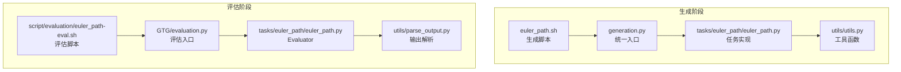
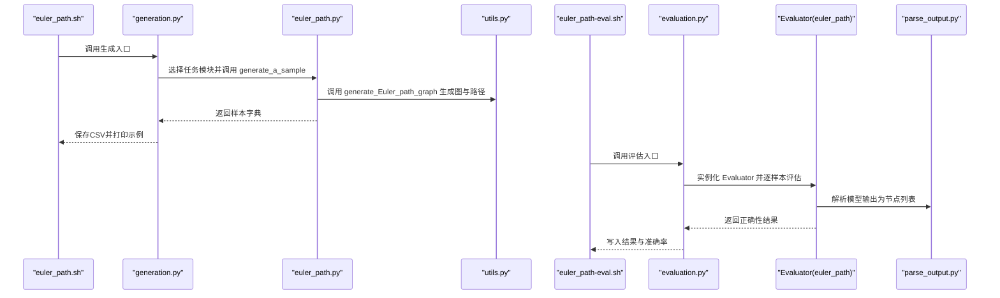
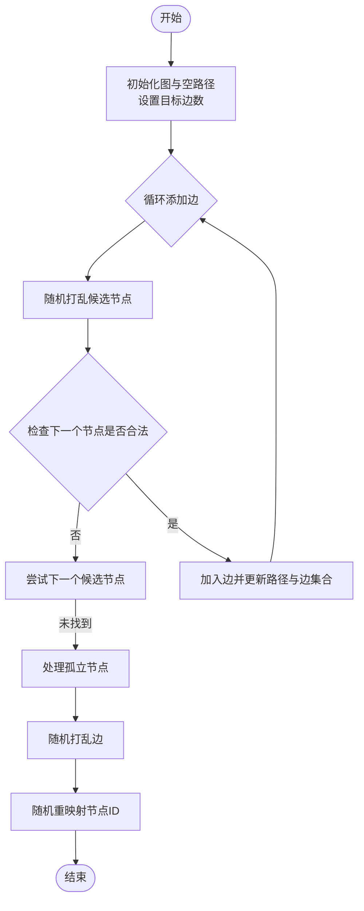
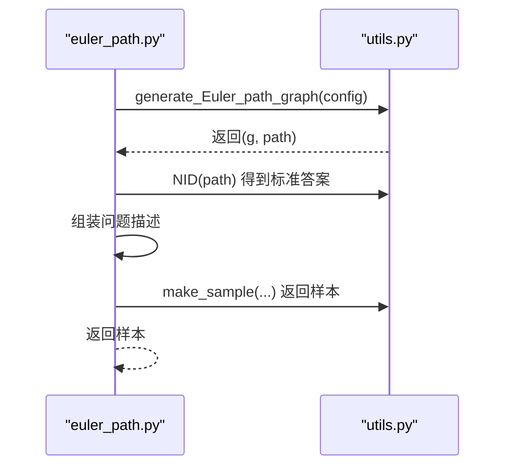
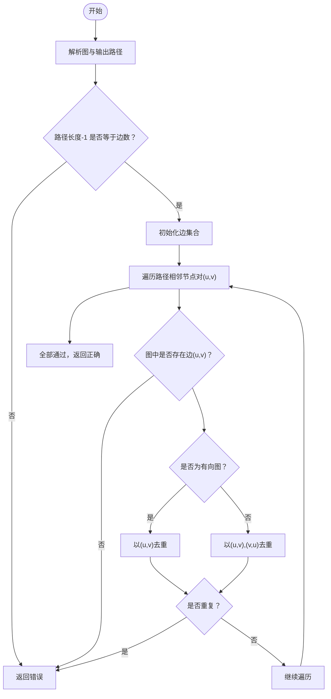
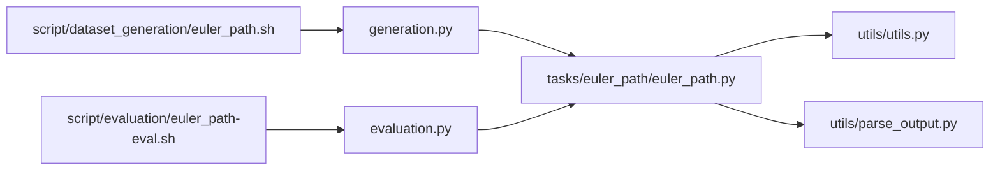

# 欧拉路径

<cite>
**本文引用的文件**
- [euler_path.py](file://GTG/tasks/euler_path/euler_path.py)
- [utils.py](file://GTG/utils/utils.py)
- [evaluation.py（评估器基类）](file://GTG/utils/evaluation.py)
- [parse_output.py](file://GTG/utils/parse_output.py)
- [generation.py](file://GTG/generation.py)
- [euler_path-eval.sh](file://script/evaluation/euler_path-eval.sh)
- [euler_path.sh](file://script/dataset_generation/euler_path.sh)
- [README.md](file://README.md)
</cite>

## 目录
1. [引言](#引言)
2. [项目结构](#项目结构)
3. [核心组件](#核心组件)
4. [架构总览](#架构总览)
5. [详细组件分析](#详细组件分析)
6. [依赖关系分析](#依赖关系分析)
7. [性能考量](#性能考量)
8. [故障排查指南](#故障排查指南)
9. [结论](#结论)
10. [附录](#附录)

## 引言
本文件围绕欧拉路径任务在代码库中的实现进行系统化解读，重点覆盖以下方面：
- generate_Euler_path_graph 如何确保生成的图满足欧拉路径存在条件（恰好零个或两个度数为奇数的顶点），并解释其构造策略与约束。
- generate_a_sample 如何直接使用预生成的欧拉路径作为标准答案，并构造自然语言问题描述。
- Evaluator 类中 check_correctness 的验证逻辑：如何检查输出路径的边数与图的总边数一致，以及如何遍历路径验证每条边的存在性和唯一性（区分有向图与无向图的边集去重方式）。
- 该任务不生成中间推理步骤的原因及其对模型推理能力评估的特定要求。

## 项目结构
欧拉路径任务位于 GTG/tasks/euler_path/euler_path.py，配套的通用工具、评估器基类、输出解析与生成/评估脚本分别位于 GTG/utils/* 与 script/*。整体流程如下：
- 数据生成：通过脚本调用 GTG/generation.py，选择 euler_path 任务模块，生成样本并保存为 CSV。
- 样本格式：包含图的邻接表示、自然语言描述、有向性标记、问题文本与标准答案（欧拉路径节点序列）。
- 评估：通过脚本调用 GTG/evaluation.py，读取模型输出与数据集，使用任务对应的 Evaluator 进行正确性判定。

图表来源
- [euler_path.sh](file://script/dataset_generation/euler_path.sh#L1-L36)
- [generation.py](file://GTG/generation.py#L1-L107)
- [euler_path.py](file://GTG/tasks/euler_path/euler_path.py#L1-L55)
- [utils.py](file://GTG/utils/utils.py#L1-L617)
- [euler_path-eval.sh](file://script/evaluation/euler_path-eval.sh#L1-L14)
- [evaluation.py](file://GTG/evaluation.py#L1-L73)
- [parse_output.py](file://GTG/utils/parse_output.py#L1-L213)

章节来源
- [euler_path.sh](file://script/dataset_generation/euler_path.sh#L1-L36)
- [generation.py](file://GTG/generation.py#L1-L107)
- [euler_path-eval.sh](file://script/evaluation/euler_path-eval.sh#L1-L14)
- [evaluation.py](file://GTG/evaluation.py#L1-L73)

## 核心组件
- 任务模块：提供 generate_a_sample 与 Evaluator 类，负责生成样本与评估输出。
- 工具函数：包括图生成、节点 ID 格式化、图字符串解析等。
- 评估器基类：定义统一的解析与正确性判断流程。
- 输出解析：从模型输出中提取节点列表并进行合法性校验。

章节来源
- [euler_path.py](file://GTG/tasks/euler_path/euler_path.py#L1-L55)
- [utils.py](file://GTG/utils/utils.py#L1-L617)
- [evaluation.py（评估器基类）](file://GTG/utils/evaluation.py#L1-L283)
- [parse_output.py](file://GTG/utils/parse_output.py#L1-L213)

## 架构总览
下图展示了欧拉路径任务从生成到评估的关键交互：

图表来源
- [euler_path.sh](file://script/dataset_generation/euler_path.sh#L1-L36)
- [generation.py](file://GTG/generation.py#L1-L107)
- [euler_path.py](file://GTG/tasks/euler_path/euler_path.py#L1-L55)
- [utils.py](file://GTG/utils/utils.py#L1-L617)
- [euler_path-eval.sh](file://script/evaluation/euler_path-eval.sh#L1-L14)
- [evaluation.py](file://GTG/evaluation.py#L1-L73)
- [parse_output.py](file://GTG/utils/parse_output.py#L1-L213)

## 详细组件分析

### generate_Euler_path_graph：欧拉路径图的构造与度数约束
该函数的目标是生成一个包含欧拉路径的图，并确保其满足欧拉路径存在的必要条件：连通分量内恰有零个或两个度数为奇数的顶点。实现要点如下：
- 节点与边的生成
  - 随机采样节点数量与平均度数，构建目标边数。
  - 使用路径扩展策略逐步添加边，避免重复边与自环，同时限制每个节点的出度/入度或度数上限（无向图时不超过节点总数减一）。
  - 对于度数为零的孤立节点，强制将其连接到路径上的某个节点，保证所有节点至少参与一次边的构造。
- 边集合去重
  - 在无向图中，同时记录(u,v)与(v,u)，以支持无向边的双向匹配；在有向图中仅记录(u,v)。
- 打乱与重映射
  - 通过随机打乱边与节点 ID 重映射，使生成的图具有良好的泛化性与可读性。

图表来源
- [utils.py](file://GTG/utils/utils.py#L481-L551)

章节来源
- [utils.py](file://GTG/utils/utils.py#L481-L551)

### generate_a_sample：构造自然语言问题与标准答案
该函数基于 generate_Euler_path_graph 生成的图与欧拉路径，完成以下工作：
- 生成图与路径：调用 generate_Euler_path_graph 获取 g 与 path。
- 标准答案：使用 NID 将路径节点序列格式化为标准答案字符串。
- 问题描述：构造自然语言问题，强调“遍历每条边恰好一次”的欧拉路径定义。
- 样本封装：调用 make_sample 组装样本字典，包含图的邻接表示、自然语言描述、有向性标记、问题与答案字段。

图表来源
- [euler_path.py](file://GTG/tasks/euler_path/euler_path.py#L12-L21)
- [utils.py](file://GTG/utils/utils.py#L14-L35)

章节来源
- [euler_path.py](file://GTG/tasks/euler_path/euler_path.py#L12-L21)
- [utils.py](file://GTG/utils/utils.py#L14-L35)

### Evaluator 类：check_correctness 的验证逻辑
Evaluator 继承自 NodeListEvaluator，负责将模型输出解析为节点列表，并进行正确性判断。关键逻辑如下：
- 图解析与参数准备
  - 使用 edge_list_str_to_graph 将样本中的图字符串解析为 NetworkX 图对象，并根据样本的 directed 字段确定是有向还是无向图。
- 边数一致性检查
  - 路径长度应比边数多1（节点数-1=边数），若不一致则直接返回错误。
- 边存在性与唯一性检查
  - 遍历路径相邻节点对(u, v)，检查图中是否存在该边。
  - 去重策略：
    - 有向图：以(u, v)为键去重，若重复则判错。
    - 无向图：以(u, v)与(v, u)共同去重，避免重复计数同一条无向边。
- 返回值
  - 若上述检查全部通过，则返回正确；否则返回错误。

图表来源
- [euler_path.py](file://GTG/tasks/euler_path/euler_path.py#L24-L55)
- [utils.py](file://GTG/utils/utils.py#L82-L96)

章节来源
- [euler_path.py](file://GTG/tasks/euler_path/euler_path.py#L24-L55)
- [utils.py](file://GTG/utils/utils.py#L82-L96)

### 不生成中间推理步骤的原因与对模型推理能力的要求
- 不生成中间推理步骤的原因
  - 该任务聚焦于“欧拉路径存在性与构造”的判定，而非中间推导过程。评测更关注最终路径的完整性与正确性，避免引入额外的推理噪声。
- 对模型推理能力的特定要求
  - 模型需具备对图结构的全局理解能力，能够识别连通性与度数奇偶性条件，并据此给出正确的路径序列。
  - 输出必须严格遵循节点列表格式，且路径必须满足“每条边恰好一次”的约束。

章节来源
- [euler_path.py](file://GTG/tasks/euler_path/euler_path.py#L12-L21)
- [README.md](file://README.md#L1-L90)

## 依赖关系分析
- 任务模块依赖
  - euler_path.py 依赖 utils 中的 NID、make_sample、generate_Euler_path_graph、edge_list_str_to_graph 等工具。
  - 评估器依赖 parse_output 中的 parse_node_list 等解析函数。
- 生成与评估脚本
  - 生成脚本 euler_path.sh 调用 generation.py，后者按任务名动态导入任务模块并生成样本。
  - 评估脚本 euler_path-eval.sh 调用 evaluation.py，后者实例化对应任务的 Evaluator 并进行批量评估。

图表来源
- [euler_path.py](file://GTG/tasks/euler_path/euler_path.py#L1-L55)
- [utils.py](file://GTG/utils/utils.py#L1-L617)
- [parse_output.py](file://GTG/utils/parse_output.py#L1-L213)
- [generation.py](file://GTG/generation.py#L1-L107)
- [evaluation.py](file://GTG/evaluation.py#L1-L73)
- [euler_path.sh](file://script/dataset_generation/euler_path.sh#L1-L36)
- [euler_path-eval.sh](file://script/evaluation/euler_path-eval.sh#L1-L14)

章节来源
- [euler_path.py](file://GTG/tasks/euler_path/euler_path.py#L1-L55)
- [utils.py](file://GTG/utils/utils.py#L1-L617)
- [parse_output.py](file://GTG/utils/parse_output.py#L1-L213)
- [generation.py](file://GTG/generation.py#L1-L107)
- [evaluation.py](file://GTG/evaluation.py#L1-L73)
- [euler_path.sh](file://script/dataset_generation/euler_path.sh#L1-L36)
- [euler_path-eval.sh](file://script/evaluation/euler_path-eval.sh#L1-L14)

## 性能考量
- 生成复杂度
  - generate_Euler_path_graph 的主要开销在于随机采样与边集合去重，整体近似 O(E) 级别，其中 E 为目标边数。
- 验证复杂度
  - check_correctness 的验证过程为线性扫描，时间复杂度 O(P)，其中 P 为路径长度（约等于边数+1）。
- 可扩展性
  - 当前实现通过随机打乱与重映射提升多样性，适合大规模生成与评估。

[本节为一般性指导，无需列出具体文件来源]

## 故障排查指南
- 生成阶段常见问题
  - 图为空或存在孤立节点：确保生成过程中对度数为零的节点执行了强制连接。
  - 边数不足：检查目标边数与采样策略，确保在循环中成功添加足够边。
- 评估阶段常见问题
  - 输出格式不符：确认模型输出被正确解析为节点列表，且节点 ID 与样本中的节点集合一致。
  - 有向/无向图误判：确保样本的 directed 字段与图类型一致，否则会导致边存在性检查失败。
  - 路径长度与边数不一致：这是最直接的错误信号，优先检查路径解析与边数统计。

章节来源
- [euler_path.py](file://GTG/tasks/euler_path/euler_path.py#L24-L55)
- [utils.py](file://GTG/utils/utils.py#L82-L96)
- [parse_output.py](file://GTG/utils/parse_output.py#L107-L118)

## 结论
欧拉路径任务通过严格的图构造与验证流程，确保生成的样本满足欧拉路径的存在条件，并以简洁明确的正确性判定评估模型的路径构造能力。该设计既避免了中间推理步骤的干扰，又突出了对图结构全局理解与细节验证的核心要求。

[本节为总结性内容，无需列出具体文件来源]

## 附录
- 生成与评估命令参考
  - 生成：bash script/dataset_generation/euler_path.sh <data_root> <num_nodes_range> <num_sample> <dataset_tag>
  - 评估：bash script/evaluation/euler_path-eval.sh <data_root> <output_root>

章节来源
- [euler_path.sh](file://script/dataset_generation/euler_path.sh#L1-L36)
- [euler_path-eval.sh](file://script/evaluation/euler_path-eval.sh#L1-L14)
- [README.md](file://README.md#L1-L90)