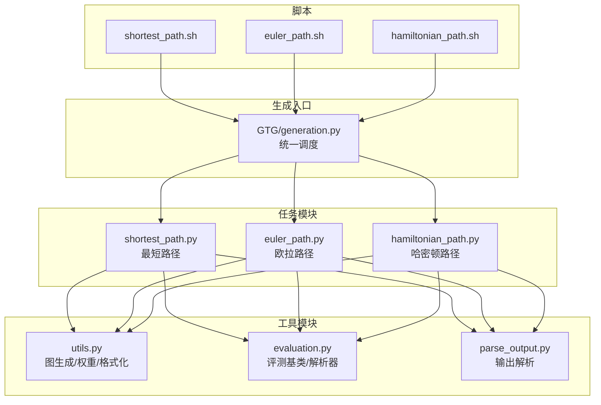
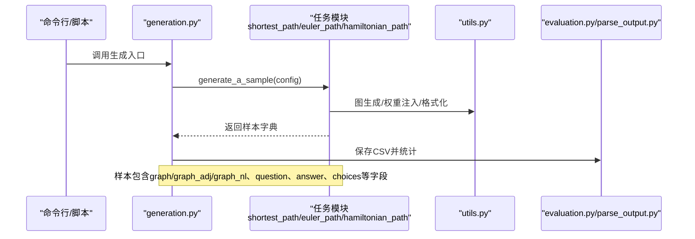
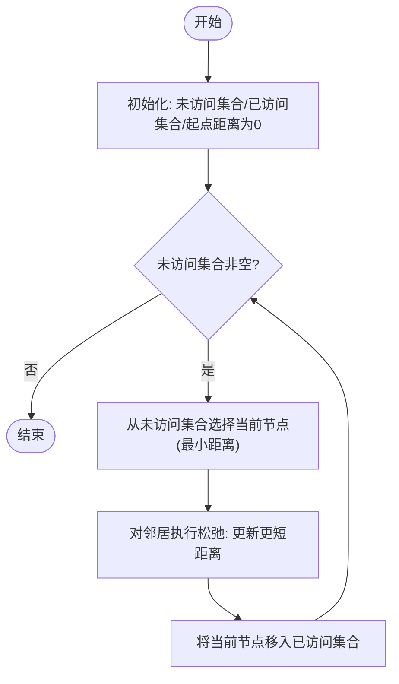
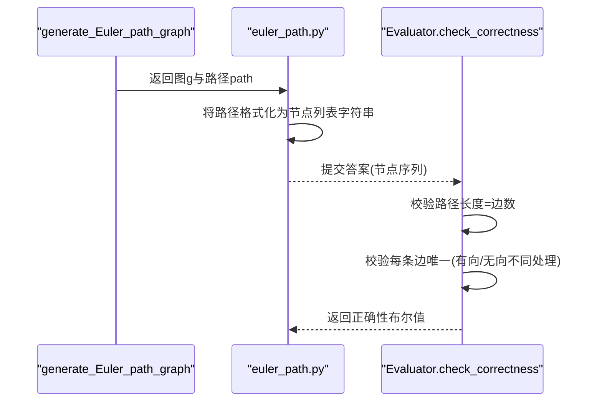
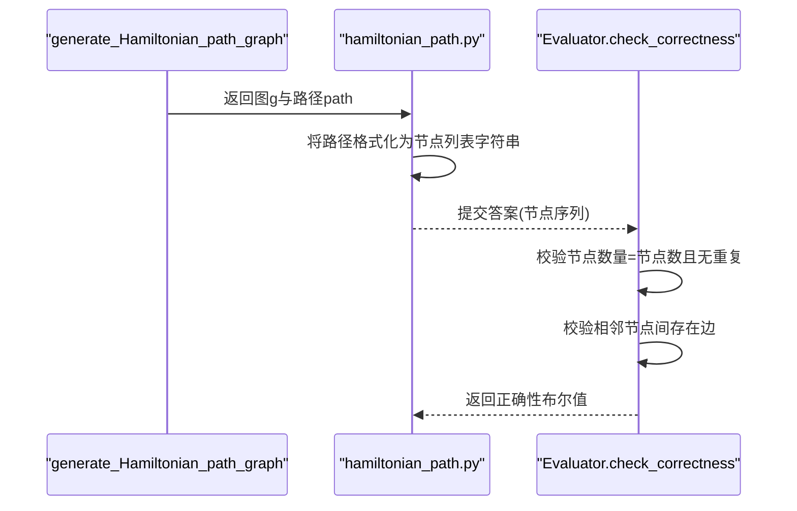
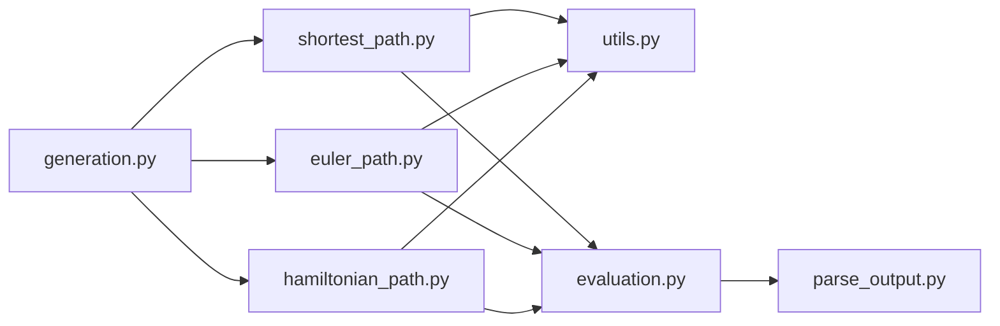

# 路径算法

<cite>
**本文引用的文件列表**
- [GTG/tasks/shortest_path/shortest_path.py](file://GTG/tasks/shortest_path/shortest_path.py)
- [GTG/tasks/euler_path/euler_path.py](file://GTG/tasks/euler_path/euler_path.py)
- [GTG/tasks/hamiltonian_path/hamiltonian_path.py](file://GTG/tasks/hamiltonian_path/hamiltonian_path.py)
- [GTG/utils/utils.py](file://GTG/utils/utils.py)
- [GTG/utils/evaluation.py](file://GTG/utils/evaluation.py)
- [GTG/utils/parse_output.py](file://GTG/utils/parse_output.py)
- [GTG/generation.py](file://GTG/generation.py)
- [script/dataset_generation/shortest_path.sh](file://script/dataset_generation/shortest_path.sh)
- [script/dataset_generation/euler_path.sh](file://script/dataset_generation/euler_path.sh)
- [script/dataset_generation/hamiltonian_path.sh](file://script/dataset_generation/hamiltonian_path.sh)
</cite>

## 目录
1. [引言](#引言)
2. [项目结构](#项目结构)
3. [核心组件](#核心组件)
4. [架构总览](#架构总览)
5. [详细组件分析](#详细组件分析)
6. [依赖关系分析](#依赖关系分析)
7. [性能与样本生成效率](#性能与样本生成效率)
8. [故障排查指南](#故障排查指南)
9. [结论](#结论)

## 引言
本文件系统化梳理 GraphInstruct 仓库中“最短路径”“欧拉路径”“哈密顿路径”三类路径问题的实现与使用。重点围绕以下目标展开：
- 最短路径：在带权图上从起点到终点计算最短距离，当前实现采用 Dijkstra 算法的近似版本（未显式使用优先队列）。
- 欧拉路径：在给定图中寻找一条遍历每条边恰好一次的路径，使用 Hierholzer 算法思想进行路径重建与验证。
- 哈密顿路径：在给定图中寻找一条访问每个节点恰好一次的路径，采用回溯法进行搜索与验证。

同时，文档说明三类问题的输入图约束、解的存在性判断机制、多解处理方式、路径重建与输出格式设计，并讨论算法复杂度对样本生成效率的影响。

## 项目结构
- 任务模块位于 GTG/tasks 下，分别提供 shortest_path、euler_path、hamiltonian_path 的生成与评估逻辑。
- 工具模块 GTG/utils 提供图生成、权重注入、节点 ID 格式化、解析输出等通用能力。
- 生成入口 GTG/generation.py 统一调度各任务的样本生成流程。
- shell 脚本位于 script/dataset_generation，负责调用生成入口并产出 CSV 数据集。

图表来源
- [GTG/generation.py](file://GTG/generation.py#L29-L57)
- [GTG/tasks/shortest_path/shortest_path.py](file://GTG/tasks/shortest_path/shortest_path.py#L1-L20)
- [GTG/tasks/euler_path/euler_path.py](file://GTG/tasks/euler_path/euler_path.py#L1-L20)
- [GTG/tasks/hamiltonian_path/hamiltonian_path.py](file://GTG/tasks/hamiltonian_path/hamiltonian_path.py#L1-L20)
- [GTG/utils/utils.py](file://GTG/utils/utils.py#L352-L366)
- [GTG/utils/evaluation.py](file://GTG/utils/evaluation.py#L97-L141)
- [GTG/utils/parse_output.py](file://GTG/utils/parse_output.py#L107-L118)
- [script/dataset_generation/shortest_path.sh](file://script/dataset_generation/shortest_path.sh#L1-L36)
- [script/dataset_generation/euler_path.sh](file://script/dataset_generation/euler_path.sh#L1-L36)
- [script/dataset_generation/hamiltonian_path.sh](file://script/dataset_generation/hamiltonian_path.sh#L1-L36)

章节来源
- [GTG/generation.py](file://GTG/generation.py#L29-L57)
- [script/dataset_generation/shortest_path.sh](file://script/dataset_generation/shortest_path.sh#L1-L36)
- [script/dataset_generation/euler_path.sh](file://script/dataset_generation/euler_path.sh#L1-L36)
- [script/dataset_generation/hamiltonian_path.sh](file://script/dataset_generation/hamiltonian_path.sh#L1-L36)

## 核心组件
- 最短路径（Dijkstra 近似）
  - 输入图：带权无向/有向图，权重为正整数。
  - 生成流程：随机选择起点与终点；逐步松弛更新距离；若终点不可达则拒绝该样本。
  - 输出：答案字符串为最短距离，可选生成干扰选项。
- 欧拉路径（Hierholzer 思想）
  - 输入图：无向/有向图，通过专用生成器保证存在欧拉路径。
  - 生成流程：生成器构造包含一条欧拉路径的图，评测器校验路径覆盖所有边且不重复。
- 哈密顿路径（回溯法）
  - 输入图：无向/有向图，通过专用生成器保证存在哈密顿路径。
  - 生成流程：生成器构造包含一条哈密顿路径的图，评测器校验路径访问每个节点恰好一次且沿边连接。

章节来源
- [GTG/tasks/shortest_path/shortest_path.py](file://GTG/tasks/shortest_path/shortest_path.py#L22-L91)
- [GTG/tasks/euler_path/euler_path.py](file://GTG/tasks/euler_path/euler_path.py#L12-L21)
- [GTG/tasks/hamiltonian_path/hamiltonian_path.py](file://GTG/tasks/hamiltonian_path/hamiltonian_path.py#L12-L21)
- [GTG/utils/utils.py](file://GTG/utils/utils.py#L437-L479)
- [GTG/utils/utils.py](file://GTG/utils/utils.py#L481-L550)

## 架构总览
下面以序列图展示三类路径任务的典型调用链：生成入口 -> 任务模块 -> 工具模块 -> 评测模块。

图表来源
- [GTG/generation.py](file://GTG/generation.py#L59-L83)
- [GTG/tasks/shortest_path/shortest_path.py](file://GTG/tasks/shortest_path/shortest_path.py#L115-L133)
- [GTG/tasks/euler_path/euler_path.py](file://GTG/tasks/euler_path/euler_path.py#L12-L21)
- [GTG/tasks/hamiltonian_path/hamiltonian_path.py](file://GTG/tasks/hamiltonian_path/hamiltonian_path.py#L12-L21)
- [GTG/utils/utils.py](file://GTG/utils/utils.py#L14-L35)

## 详细组件分析

### 最短路径（Dijkstra 近似）
- 实现要点
  - 采用 Dijkstra 的“逐轮松弛”思想：维护未访问节点集合与已访问集合，每次从未访问集中选择当前距离最小的节点进行扩展。
  - 松弛操作：对当前节点的邻居，若经由当前节点到达邻居的距离更小，则更新邻居的最短距离。
  - 终止条件：当未访问集合为空时结束；若终点仍不可达（距离仍为无穷），则拒绝该样本。
  - 多解处理：若存在多个相同最短距离的候选节点，按排序规则选择下一个；最终答案为终点的最短距离。
- 输入图约束
  - 无向/有向均可；权重为正整数。
  - 若起点与终点连通，通常能生成有效样本；否则样本会被拒绝重试。
- 解的存在性判断
  - 通过终点是否可达（距离是否为有限值）判断；不可达则拒绝并重新生成。
- 路径重建与输出
  - 当前实现仅输出最短距离；如需路径重建，可在扩展过程中记录前驱节点并在终点回溯。
  - 输出格式为纯数字字符串，作为评测器的整数解析目标。
- 复杂度与效率
  - 时间复杂度近似 O(V^2)，空间复杂度 O(V)；在大规模图上会显著影响生成速度。
  - 由于使用“逐轮选择最小值”的朴素实现，建议在更大规模场景中引入优先队列优化。

图表来源
- [GTG/tasks/shortest_path/shortest_path.py](file://GTG/tasks/shortest_path/shortest_path.py#L41-L91)

章节来源
- [GTG/tasks/shortest_path/shortest_path.py](file://GTG/tasks/shortest_path/shortest_path.py#L22-L91)
- [GTG/utils/utils.py](file://GTG/utils/utils.py#L352-L366)
- [GTG/utils/evaluation.py](file://GTG/utils/evaluation.py#L69-L81)

### 欧拉路径（Hierholzer 算法思想）
- 实现要点
  - 生成器保证存在欧拉路径：通过逐步添加边构造满足欧拉路径存在的图（无向/有向均可）。
  - 评测器校验：路径长度应等于边数；每条边仅出现一次；有向图区分方向，无向图忽略方向但避免重复计数。
- 输入图约束
  - 无向/有向均可；生成器确保存在欧拉路径。
- 解的存在性判断
  - 生成器内部构造即保证存在性；评测器通过边覆盖与重复检查进行二次确认。
- 路径重建与输出
  - 生成器直接返回一条有效路径；评测器接收节点序列，输出格式为节点列表字符串。
- 复杂度与效率
  - 生成阶段：基于随机游走与度限制的构造，整体较高效。
  - 评测阶段：线性扫描边序列，复杂度 O(E)。

图表来源
- [GTG/tasks/euler_path/euler_path.py](file://GTG/tasks/euler_path/euler_path.py#L12-L21)
- [GTG/tasks/euler_path/euler_path.py](file://GTG/tasks/euler_path/euler_path.py#L29-L54)
- [GTG/utils/utils.py](file://GTG/utils/utils.py#L481-L550)

章节来源
- [GTG/tasks/euler_path/euler_path.py](file://GTG/tasks/euler_path/euler_path.py#L12-L54)
- [GTG/utils/utils.py](file://GTG/utils/utils.py#L481-L550)

### 哈密顿路径（回溯法）
- 实现要点
  - 生成器保证存在哈密顿路径：先构造一条合法路径，再随机添加额外边，确保存在性。
  - 评测器校验：节点集合大小与数量一致；相邻节点间必须存在边。
- 输入图约束
  - 无向/有向均可；生成器确保存在哈密顿路径。
- 解的存在性判断
  - 生成器内部构造即保证存在性；评测器通过节点唯一性与边连续性进行确认。
- 路径重建与输出
  - 生成器返回一条有效路径；评测器接收节点序列，输出格式为节点列表字符串。
- 复杂度与效率
  - 生成阶段：构造路径与随机加边，整体较高效。
  - 评测阶段：线性扫描路径，复杂度 O(N)。

图表来源
- [GTG/tasks/hamiltonian_path/hamiltonian_path.py](file://GTG/tasks/hamiltonian_path/hamiltonian_path.py#L12-L21)
- [GTG/tasks/hamiltonian_path/hamiltonian_path.py](file://GTG/tasks/hamiltonian_path/hamiltonian_path.py#L29-L39)
- [GTG/utils/utils.py](file://GTG/utils/utils.py#L437-L479)

章节来源
- [GTG/tasks/hamiltonian_path/hamiltonian_path.py](file://GTG/tasks/hamiltonian_path/hamiltonian_path.py#L12-L39)
- [GTG/utils/utils.py](file://GTG/utils/utils.py#L437-L479)

## 依赖关系分析
- 任务模块依赖工具模块
  - shortest_path 依赖 utils 中的图生成、权重注入、邻接与权重提取、自然语言描述等函数。
  - euler_path 与 hamiltonian_path 依赖 utils 中的专用生成器与图解析函数。
- 评测模块
  - 三类任务均继承 NodeListEvaluator 或 IntEvaluator，使用 parse_output 的解析器将模型输出映射为结构化答案，再进行正确性判定。
- 生成入口
  - generation.py 动态导入任务模块并调用 generate_a_sample，统一产出 CSV 与统计信息。

图表来源
- [GTG/tasks/shortest_path/shortest_path.py](file://GTG/tasks/shortest_path/shortest_path.py#L1-L20)
- [GTG/tasks/euler_path/euler_path.py](file://GTG/tasks/euler_path/euler_path.py#L1-L20)
- [GTG/tasks/hamiltonian_path/hamiltonian_path.py](file://GTG/tasks/hamiltonian_path/hamiltonian_path.py#L1-L20)
- [GTG/utils/utils.py](file://GTG/utils/utils.py#L14-L35)
- [GTG/utils/evaluation.py](file://GTG/utils/evaluation.py#L97-L141)
- [GTG/utils/parse_output.py](file://GTG/utils/parse_output.py#L107-L118)
- [GTG/generation.py](file://GTG/generation.py#L29-L57)

章节来源
- [GTG/utils/evaluation.py](file://GTG/utils/evaluation.py#L97-L141)
- [GTG/utils/parse_output.py](file://GTG/utils/parse_output.py#L107-L118)
- [GTG/generation.py](file://GTG/generation.py#L29-L57)

## 性能与样本生成效率
- 最短路径
  - 当前实现为 O(V^2) 的朴素 Dijkstra，生成阶段可能成为瓶颈；建议引入优先队列优化至 O((V+E)log V)。
  - 可通过减少样本中节点数范围或边密度来提升生成速度。
- 欧拉路径与哈密顿路径
  - 生成器采用构造法，复杂度较低；评测为线性扫描，开销较小。
  - 对于大规模图，建议控制节点数上限以避免评测阶段的长路径扫描。
- 生成入口
  - generation.py 以循环方式批量生成样本，建议并行化（如多进程）以提升吞吐量。

[本节为通用性能讨论，无需列出章节来源]

## 故障排查指南
- 最短路径
  - 现象：某些样本被拒绝（reject=True）。
  - 原因：终点不可达（距离为无穷）。
  - 处理：重新生成样本；检查图连通性与权重注入逻辑。
- 欧拉路径
  - 现象：评测失败。
  - 原因：路径长度不等于边数、存在重复边、边不在原图中、有向/无向方向处理不当。
  - 处理：核对生成器构造逻辑与评测器校验分支。
- 哈密顿路径
  - 现象：评测失败。
  - 原因：节点数量或去重后数量不等于节点总数、相邻节点间不存在边。
  - 处理：检查生成器构造的初始路径与后续随机加边是否保持连通性。
- 输出解析
  - 现象：评测器无法解析模型输出。
  - 原因：输出格式不符合预期（节点列表格式、节点 ID 不匹配）。
  - 处理：使用 parse_output 的解析器规范输出格式；确保节点 ID 与样本中 nodes 集合一致。

章节来源
- [GTG/tasks/shortest_path/shortest_path.py](file://GTG/tasks/shortest_path/shortest_path.py#L86-L91)
- [GTG/tasks/euler_path/euler_path.py](file://GTG/tasks/euler_path/euler_path.py#L29-L54)
- [GTG/tasks/hamiltonian_path/hamiltonian_path.py](file://GTG/tasks/hamiltonian_path/hamiltonian_path.py#L29-L39)
- [GTG/utils/parse_output.py](file://GTG/utils/parse_output.py#L107-L118)

## 结论
- 最短路径：当前实现采用 Dijkstra 的近似版本，适合中小规模图；建议引入优先队列优化以提升性能。
- 欧拉路径：生成器保证存在性，评测器严格校验路径覆盖与唯一性，整体稳健。
- 哈密顿路径：生成器保证存在性，评测器校验节点唯一性与边连续性，适合教学与评测。
- 输出与评测：统一使用 NodeListEvaluator/IntEvaluator 与 parse_output 解析器，确保评测一致性与可扩展性。

[本节为总结性内容，无需列出章节来源]