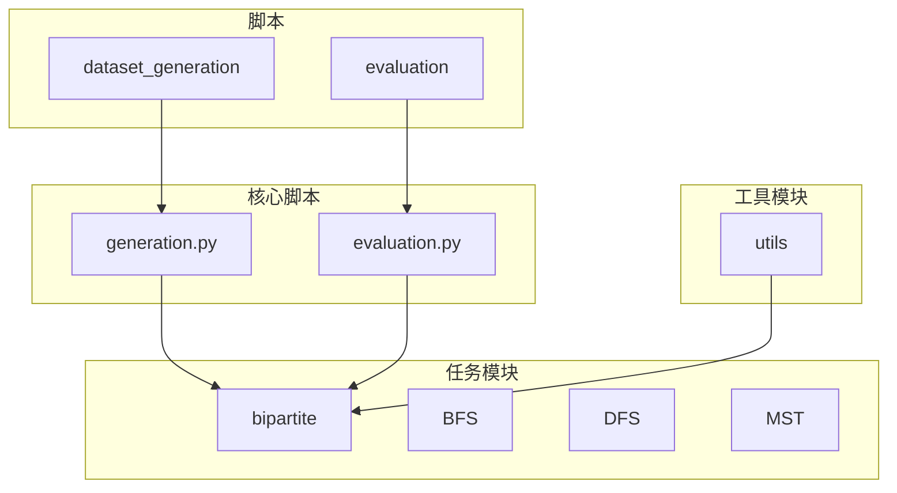
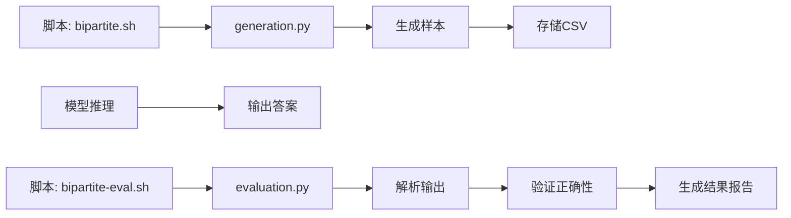
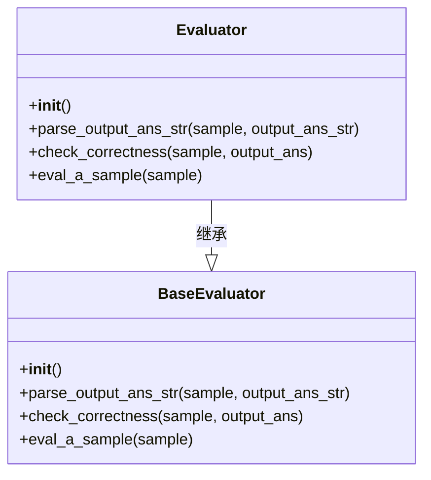
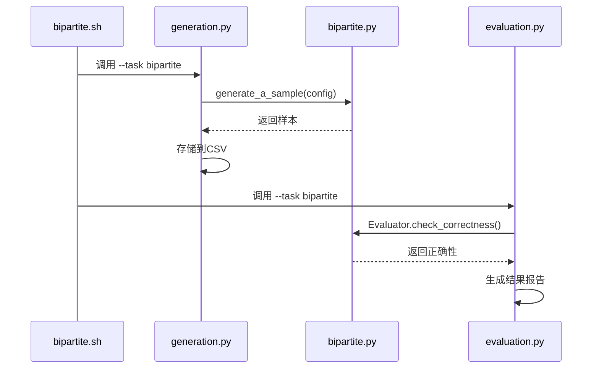
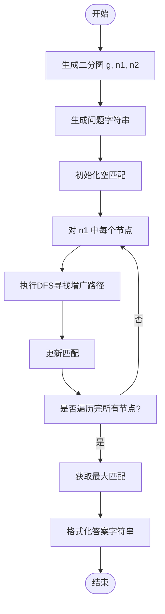
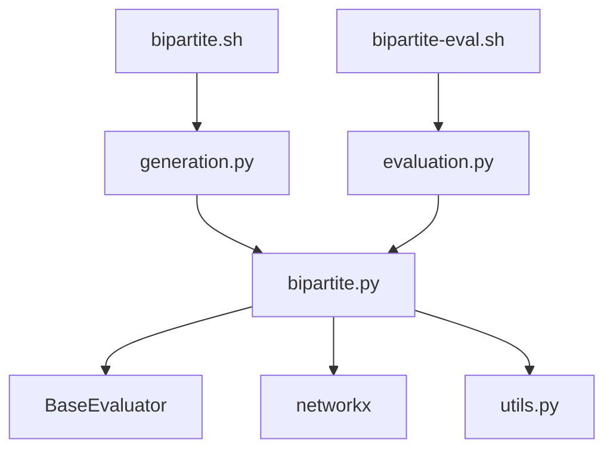

# 二分图判定

<cite>
**本文档中引用的文件**  
- [bipartite.py](file://GTG/tasks/bipartite/bipartite.py)
- [generation.py](file://GTG/generation.py)
- [evaluation.py](file://GTG/evaluation.py)
- [bipartite.sh](file://script/dataset_generation/bipartite.sh)
- [bipartite-eval.sh](file://script/evaluation/bipartite-eval.sh)
- [utils.py](file://GTG/utils/utils.py)
- [evaluation.py](file://GTG/utils/evaluation.py)
</cite>

## 目录
1. [简介](#简介)
2. [项目结构](#项目结构)
3. [核心组件](#核心组件)
4. [架构概述](#架构概述)
5. [详细组件分析](#详细组件分析)
6. [依赖分析](#依赖分析)
7. [性能考虑](#性能考虑)
8. [故障排除指南](#故障排除指南)
9. [结论](#结论)

## 简介
本文档详细说明了基于染色法算法的二分图判定功能，该算法实现在`bipartite.py`模块中。通过广度优先搜索（BFS）或深度优先搜索（DFS）对图节点进行交替着色，以检测是否存在奇数长度环，从而判断图是否为二分图。文档解释了该模块的输入输出格式、错误处理机制，以及在样本生成过程中如何构造满足二分图约束的图结构。同时，描述了其在评估阶段的验证流程，确保生成结果的正确性。

## 项目结构
本项目采用模块化设计，将图论任务划分为独立的子任务模块。二分图判定功能位于`GTG/tasks/bipartite/`目录下，与其他图论任务（如BFS、DFS、MST等）并列组织。该结构支持任务的独立开发、测试和评估。

**Diagram sources**
- [bipartite.py](file://GTG/tasks/bipartite/bipartite.py)
- [generation.py](file://GTG/generation.py)
- [evaluation.py](file://GTG/evaluation.py)

**Section sources**
- [bipartite.py](file://GTG/tasks/bipartite/bipartite.py)
- [generation.py](file://GTG/generation.py)
- [evaluation.py](file://GTG/evaluation.py)

## 核心组件
二分图判定功能的核心组件包括样本生成器、评估器和图生成工具。`generate_a_sample`函数负责创建符合二分图约束的图实例，`Evaluator`类用于验证模型输出的正确性，而`generate_bipartite_graph`工具函数则用于构造基础的二分图结构。

**Section sources**
- [bipartite.py](file://GTG/tasks/bipartite/bipartite.py#L81-L91)
- [utils.py](file://GTG/utils/utils.py)

## 架构概述
系统架构分为三个主要阶段：数据生成、模型推理和结果评估。在数据生成阶段，`bipartite.sh`脚本调用`generation.py`来创建二分图数据集。在评估阶段，`bipartite-eval.sh`脚本调用`evaluation.py`对模型输出进行验证。整个流程通过配置文件和命令行参数进行控制。

**Diagram sources**
- [bipartite.sh](file://script/dataset_generation/bipartite.sh)
- [generation.py](file://GTG/generation.py)
- [bipartite-eval.sh](file://script/evaluation/bipartite-eval.sh)
- [evaluation.py](file://GTG/evaluation.py)

## 详细组件分析

### 二分图判定分析
该模块的核心功能是生成和验证二分图的最大匹配。通过匈牙利算法的逐步执行，系统能够生成详细的推理步骤，并验证模型输出是否构成有效的最大匹配。

#### 对于对象导向组件：

**Diagram sources**
- [bipartite.py](file://GTG/tasks/bipartite/bipartite.py#L94-L135)
- [evaluation.py](file://GTG/utils/evaluation.py#L9-L54)

#### 对于API/服务组件：

**Diagram sources**
- [bipartite.sh](file://script/dataset_generation/bipartite.sh)
- [generation.py](file://GTG/generation.py)
- [bipartite.py](file://GTG/tasks/bipartite/bipartite.py)
- [evaluation.py](file://GTG/evaluation.py)

#### 对于复杂逻辑组件：

**Diagram sources**
- [bipartite.py](file://GTG/tasks/bipartite/bipartite.py#L81-L91)

**Section sources**
- [bipartite.py](file://GTG/tasks/bipartite/bipartite.py#L81-L91)
- [utils.py](file://GTG/utils/utils.py)

## 依赖分析
二分图判定模块依赖于多个核心组件。它继承自`BaseEvaluator`类以获得基本的评估功能，并使用`networkx`库进行图操作。数据生成流程依赖于`generation.py`主控制器，而评估流程则依赖于`evaluation.py`。

**Diagram sources**
- [bipartite.py](file://GTG/tasks/bipartite/bipartite.py)
- [generation.py](file://GTG/generation.py)
- [evaluation.py](file://GTG/evaluation.py)

**Section sources**
- [bipartite.py](file://GTG/tasks/bipartite/bipartite.py)
- [generation.py](file://GTG/generation.py)
- [evaluation.py](file://GTG/evaluation.py)

## 性能考虑
该实现使用DFS算法寻找增广路径，时间复杂度为O(V*E)，其中V是顶点数，E是边数。对于稀疏图，该算法具有良好的性能表现。通过使用集合数据结构进行访问标记，确保了算法的高效性。在大规模图上，可以考虑使用BFS实现的Hopcroft-Karp算法以获得更好的性能。

## 故障排除指南
当遇到评估失败时，应首先检查输出格式是否符合预期。确保匹配中的每条边都连接两个不同的节点集合，且没有节点被重复匹配。验证输入图是否确实为二分图，以及节点ID是否在有效范围内。检查日志输出以确认样本生成和评估流程是否正常执行。

**Section sources**
- [bipartite.py](file://GTG/tasks/bipartite/bipartite.py#L94-L135)
- [evaluation.py](file://GTG/utils/evaluation.py)

## 结论
二分图判定功能通过系统的样本生成和严格的评估流程，为图论任务提供了一个可靠的测试框架。其模块化设计使得功能扩展和维护变得简单。通过使用标准的图算法和清晰的接口定义，该实现为二分图相关任务提供了坚实的基础。