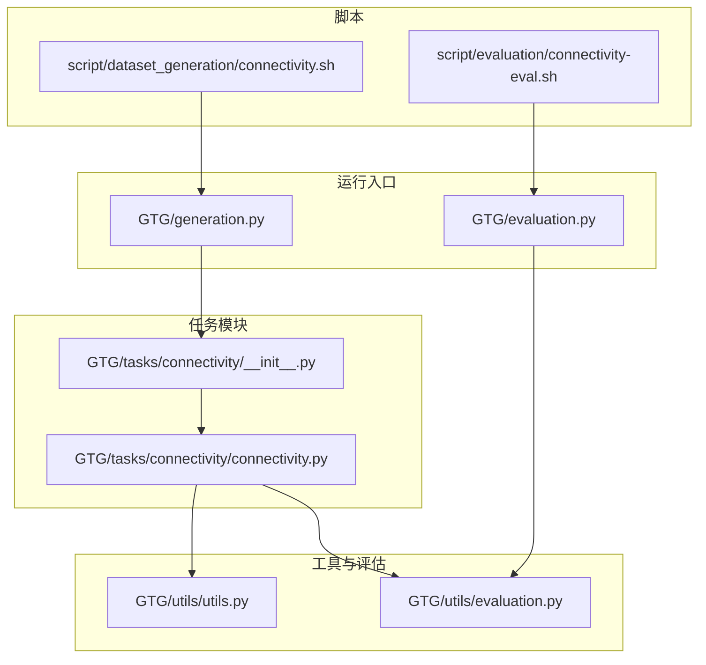
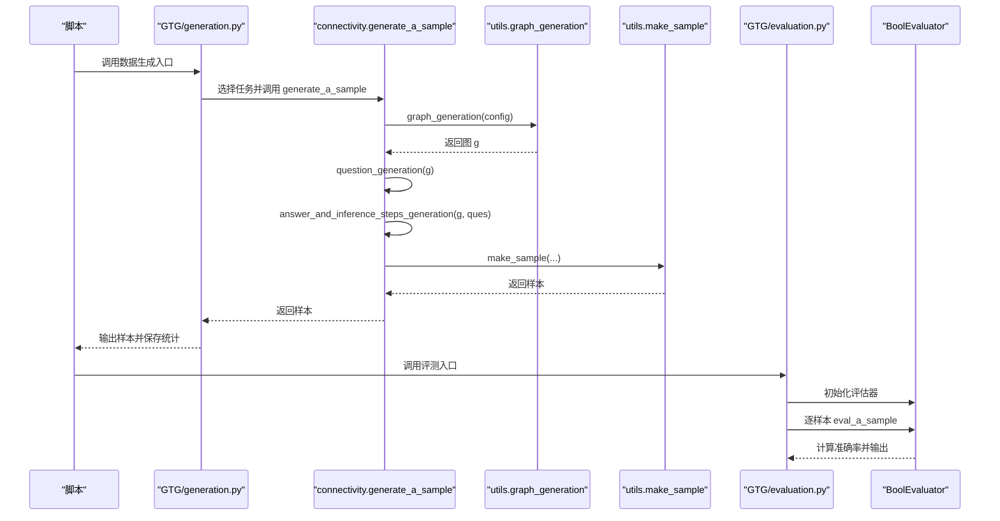
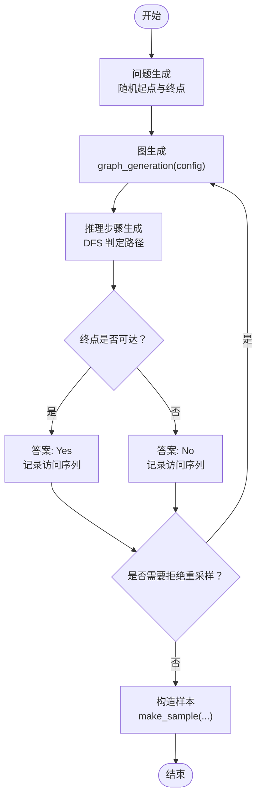
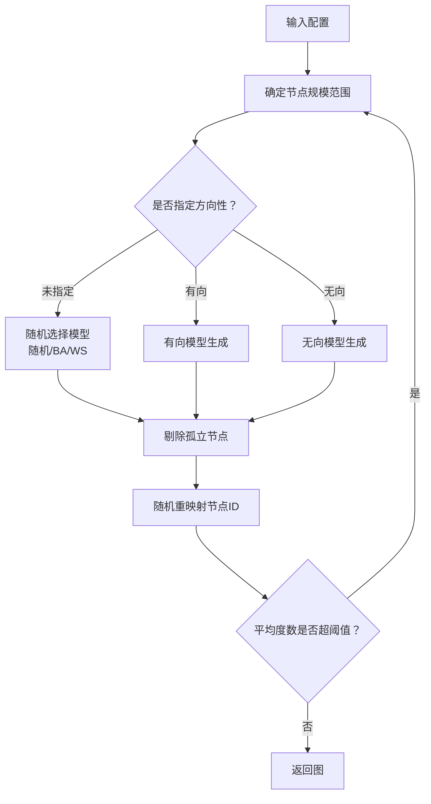
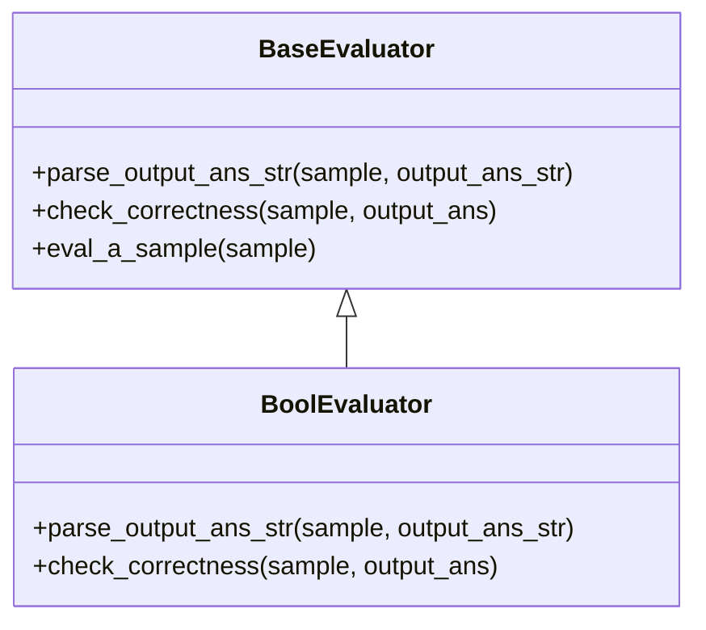
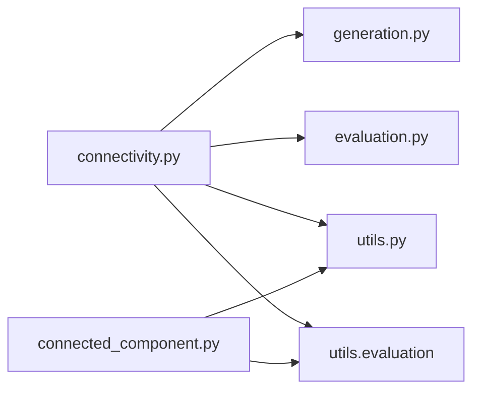

# 图连通性

<cite>
**本文引用的文件列表**
- [GTG/tasks/connectivity/connectivity.py](file://GTG/tasks/connectivity/connectivity.py)
- [GTG/tasks/connectivity/__init__.py](file://GTG/tasks/connectivity/__init__.py)
- [GTG/utils/utils.py](file://GTG/utils/utils.py)
- [GTG/utils/evaluation.py](file://GTG/utils/evaluation.py)
- [GTG/generation.py](file://GTG/generation.py)
- [GTG/evaluation.py](file://GTG/evaluation.py)
- [script/dataset_generation/connectivity.sh](file://script/dataset_generation/connectivity.sh)
- [script/evaluation/connectivity-eval.sh](file://script/evaluation/connectivity-eval.sh)
- [GTG/tasks/connected_component/connected_component.py](file://GTG/tasks/connected_component/connected_component.py)
</cite>

## 目录
1. [简介](#简介)
2. [项目结构](#项目结构)
3. [核心组件](#核心组件)
4. [架构总览](#架构总览)
5. [详细组件分析](#详细组件分析)
6. [依赖关系分析](#依赖关系分析)
7. [性能与复杂度](#性能与复杂度)
8. [极端情况与鲁棒性](#极端情况与鲁棒性)
9. [接口与使用示例](#接口与使用示例)
10. [故障排查指南](#故障排查指南)
11. [结论](#结论)

## 简介
本文件围绕“图连通性”任务展开，系统阐述如何基于仓库中的实现对无向图进行连通性判断，以及对有向图进行强连通性（SCC）或弱连通性分析。文档重点说明：
- 问题定义：给定两个节点，判断是否存在从起点到终点的路径；对于有向图，通常指存在有向路径；对于无向图，指存在无向路径。
- 实现策略：当前实现采用深度优先搜索（DFS）对单次查询进行判定，而非一次性计算全图的连通性或强连通分量。
- 与图生成器的协作：通过统一的图生成接口生成满足节点规模与平均度数约束的图实例，保证样本多样性与可评测性。
- 评估流程：结合通用的布尔型评估器，对模型输出进行解析与正确性校验。
- 复杂度与性能：单次查询的时间复杂度为 O(V+E)，空间复杂度为 O(V)；整体数据集生成与评估流程受样本数量影响。
- 鲁棒性：对零边图、自环、多重边等极端情形给出处理建议与注意事项。

## 项目结构
“图连通性”任务位于 GTG/tasks/connectivity 目录下，配合通用工具模块与评估框架共同完成数据生成、样本构造与评测。

图表来源
- [GTG/tasks/connectivity/connectivity.py](file://GTG/tasks/connectivity/connectivity.py#L1-L125)
- [GTG/tasks/connectivity/__init__.py](file://GTG/tasks/connectivity/__init__.py#L1-L3)
- [GTG/utils/utils.py](file://GTG/utils/utils.py#L1-L617)
- [GTG/utils/evaluation.py](file://GTG/utils/evaluation.py#L1-L283)
- [GTG/generation.py](file://GTG/generation.py#L1-L107)
- [GTG/evaluation.py](file://GTG/evaluation.py#L1-L73)
- [script/dataset_generation/connectivity.sh](file://script/dataset_generation/connectivity.sh#L1-L36)
- [script/evaluation/connectivity-eval.sh](file://script/evaluation/connectivity-eval.sh#L1-L14)

章节来源
- [GTG/tasks/connectivity/connectivity.py](file://GTG/tasks/connectivity/connectivity.py#L1-L125)
- [GTG/tasks/connectivity/__init__.py](file://GTG/tasks/connectivity/__init__.py#L1-L3)
- [GTG/utils/utils.py](file://GTG/utils/utils.py#L1-L617)
- [GTG/utils/evaluation.py](file://GTG/utils/evaluation.py#L1-L283)
- [GTG/generation.py](file://GTG/generation.py#L1-L107)
- [GTG/evaluation.py](file://GTG/evaluation.py#L1-L73)
- [script/dataset_generation/connectivity.sh](file://script/dataset_generation/connectivity.sh#L1-L36)
- [script/evaluation/connectivity-eval.sh](file://script/evaluation/connectivity-eval.sh#L1-L14)

## 核心组件
- 任务模块（connectivity.py）
  - 问题生成：随机选择起点与终点，区分有向与无向图，生成自然语言问题。
  - 推理步骤生成：使用深度优先搜索（DFS）对单次查询进行路径判定，并输出遍历序列与结论。
  - 样本生成：通过图生成器构造图，生成问题、推理步骤与答案，支持拒绝采样以平衡正负样本比例。
  - 评估器：继承布尔型评估器，用于评测模型输出的正确性。
- 工具模块（utils.py）
  - 统一的图生成接口：支持随机图、BA无标度图、WS小世界图，自动剔除孤立节点并重映射节点ID。
  - 样本构造：将图、问题、答案、推理步骤等打包为标准样本字典。
- 评估框架（evaluation.py）
  - 布尔型评估器：解析模型输出字符串为布尔值，与标准答案比较得到正确性标记。
- 运行入口
  - 数据生成：按配置批量生成样本并保存统计信息。
  - 评测入口：读取模型输出与数据集，计算准确率并输出结果。

章节来源
- [GTG/tasks/connectivity/connectivity.py](file://GTG/tasks/connectivity/connectivity.py#L1-L125)
- [GTG/utils/utils.py](file://GTG/utils/utils.py#L313-L349)
- [GTG/utils/evaluation.py](file://GTG/utils/evaluation.py#L56-L95)
- [GTG/generation.py](file://GTG/generation.py#L1-L107)
- [GTG/evaluation.py](file://GTG/evaluation.py#L1-L73)

## 架构总览
“图连通性”任务采用“任务模块 + 工具模块 + 评估框架”的分层设计。数据生成阶段由统一的图生成器产出符合约束的图实例；任务模块负责构造具体问题与推理步骤；评估阶段对模型输出进行解析与校验。

图表来源
- [GTG/generation.py](file://GTG/generation.py#L1-L107)
- [GTG/tasks/connectivity/connectivity.py](file://GTG/tasks/connectivity/connectivity.py#L101-L118)
- [GTG/utils/utils.py](file://GTG/utils/utils.py#L14-L36)
- [GTG/evaluation.py](file://GTG/evaluation.py#L1-L73)
- [GTG/utils/evaluation.py](file://GTG/utils/evaluation.py#L56-L95)

## 详细组件分析

### 任务模块：connectivity.py
- 问题生成（question_generation）
  - 在图中随机选择起点与终点，确保二者不相等。
  - 根据图是否为有向图，生成不同的自然语言问题表述。
- 推理步骤生成（answer_and_inference_steps_generation）
  - 使用深度优先搜索（DFS）从起点开始遍历，记录访问序列。
  - 判定终点是否出现在访问序列中，输出 Yes/No，并附带推理过程。
  - 通过全局计数器控制正负样本比例，避免极端偏向。
- 样本生成（generate_a_sample）
  - 循环调用图生成器与推理步骤生成，若被拒绝则重新生成，直至满足条件。
  - 使用统一的 make_sample 构造样本字典，包含图、问题、答案、推理步骤等字段。
- 评估器（Evaluator）
  - 继承 BoolEvaluator，直接复用布尔型解析与正确性判断逻辑。

图表来源
- [GTG/tasks/connectivity/connectivity.py](file://GTG/tasks/connectivity/connectivity.py#L14-L118)
- [GTG/utils/utils.py](file://GTG/utils/utils.py#L14-L36)

章节来源
- [GTG/tasks/connectivity/connectivity.py](file://GTG/tasks/connectivity/connectivity.py#L14-L118)

### 图生成器：utils.graph_generation
- 支持三种图模型：随机图、Barabási-Albert（BA）无标度图、Watts-Strogatz（WS）小世界图。
- 自动剔除孤立节点，避免生成退化图。
- 对节点ID进行随机重映射，提升泛化能力。
- 平均度数约束：通过计算平均度数并设定阈值，避免生成过于稠密的图。

图表来源
- [GTG/utils/utils.py](file://GTG/utils/utils.py#L313-L349)

章节来源
- [GTG/utils/utils.py](file://GTG/utils/utils.py#L313-L349)

### 评估器：utils.evaluation 中的 BoolEvaluator
- 解析模型输出字符串为布尔值。
- 与标准答案比较，得到正确性标记。
- 评测入口（GTG/evaluation.py）读取数据集与模型输出，逐样本评估并统计准确率。

图表来源
- [GTG/utils/evaluation.py](file://GTG/utils/evaluation.py#L9-L55)
- [GTG/utils/evaluation.py](file://GTG/utils/evaluation.py#L56-L95)

章节来源
- [GTG/utils/evaluation.py](file://GTG/utils/evaluation.py#L56-L95)
- [GTG/evaluation.py](file://GTG/evaluation.py#L1-L73)

### 与“连通分量/强连通分量”任务的关系
- 当前“图连通性”任务针对“两点可达性”进行单次判定，使用 DFS 遍历。
- “连通分量/强连通分量”任务提供全图层面的连通性分析（Tarjan 算法用于有向图，DFS 用于无向图），可作为整体评估流程中的验证参考。
- 两者互补：前者关注局部可达性，后者关注全局连通结构。

章节来源
- [GTG/tasks/connected_component/connected_component.py](file://GTG/tasks/connected_component/connected_component.py#L1-L258)

## 依赖关系分析
- connectivity.py 依赖：
  - utils.graph_generation：生成满足约束的图。
  - utils.make_sample：构造标准化样本。
  - utils.NID：节点ID格式化。
  - utils.evaluation.BoolEvaluator：布尔型评测。
- generation.py 与 evaluation.py 分别作为数据生成与评测的入口，统一调度各任务模块。
- connected_component 任务提供 Tarjan 算法与 DFS 的实现，可用于交叉验证。

图表来源
- [GTG/tasks/connectivity/connectivity.py](file://GTG/tasks/connectivity/connectivity.py#L1-L125)
- [GTG/generation.py](file://GTG/generation.py#L1-L107)
- [GTG/evaluation.py](file://GTG/evaluation.py#L1-L73)
- [GTG/utils/utils.py](file://GTG/utils/utils.py#L1-L617)
- [GTG/utils/evaluation.py](file://GTG/utils/evaluation.py#L1-L283)
- [GTG/tasks/connected_component/connected_component.py](file://GTG/tasks/connected_component/connected_component.py#L1-L258)

章节来源
- [GTG/tasks/connectivity/connectivity.py](file://GTG/tasks/connectivity/connectivity.py#L1-L125)
- [GTG/utils/utils.py](file://GTG/utils/utils.py#L1-L617)
- [GTG/utils/evaluation.py](file://GTG/utils/evaluation.py#L1-L283)
- [GTG/generation.py](file://GTG/generation.py#L1-L107)
- [GTG/evaluation.py](file://GTG/evaluation.py#L1-L73)
- [GTG/tasks/connected_component/connected_component.py](file://GTG/tasks/connected_component/connected_component.py#L1-L258)

## 性能与复杂度
- 单次查询（两点可达性）：
  - 时间复杂度：O(V+E)，其中 V 为节点数，E 为边数。DFS 遍历每个节点一次，检查其邻接表。
  - 空间复杂度：O(V)，栈与访问集合的空间开销。
- 整体数据集生成：
  - 受样本数量与图规模影响，生成阶段会多次调用图生成器与推理步骤生成函数。
  - 评测阶段逐样本解析与比较，准确率统计为 O(N)。

[本节为一般性讨论，无需列出具体文件来源]

## 极端情况与鲁棒性
- 零边图（或几乎零边）：
  - 由于图生成器会剔除孤立节点，极端情况下可能生成退化图。建议在生成阶段增加“至少存在一条边”的约束，或在评测阶段对退化图进行拒绝。
- 自环与多重边：
  - NetworkX 默认允许自环与多重边。当前 DFS 实现对自环与多重边具备鲁棒性（自环不影响可达性判定，多重边不会改变可达性）。若需严格去重，可在生成阶段显式清理。
- 孤立点与非连通图：
  - 生成器已剔除孤立节点；对于非连通图，当前任务仅对选定的起点与终点进行可达性判定，不改变图的整体连通性。
- 正负样本均衡：
  - 通过拒绝采样控制 Yes/No 比例，避免极端偏向，提高评测稳定性。

章节来源
- [GTG/utils/utils.py](file://GTG/utils/utils.py#L224-L255)
- [GTG/tasks/connectivity/connectivity.py](file://GTG/tasks/connectivity/connectivity.py#L76-L86)

## 接口与使用示例
- 数据生成脚本
  - 生成 CSV 数据集：传入数据根目录、节点规模范围、样本数量与数据集标签，生成原始 CSV，并进一步生成整数ID与字母ID版本。
- 评测脚本
  - 读取数据集与模型输出，计算准确率并输出结果文件。
- Python 命令行调用
  - 数据生成：python -m GTG.generation --task connectivity --file_output <path> --num_samples <N> --num_nodes_range <range> --hash_str <tag>
  - 评测：python -m GTG.evaluation --task connectivity --file_dataset <path> --file_answer <path> --file_result <path>
- 参数说明
  - num_nodes_range：节点规模范围，如 [10, 20]。
  - num_samples：生成样本数量。
  - hash_str：用于固定随机种子的哈希字符串，便于复现实验。
  - file_output/file_dataset/file_answer/file_result：文件路径。

章节来源
- [script/dataset_generation/connectivity.sh](file://script/dataset_generation/connectivity.sh#L1-L36)
- [script/evaluation/connectivity-eval.sh](file://script/evaluation/connectivity-eval.sh#L1-L14)
- [GTG/generation.py](file://GTG/generation.py#L1-L107)
- [GTG/evaluation.py](file://GTG/evaluation.py#L1-L73)

## 故障排查指南
- 模型输出无法解析为布尔值
  - 现象：评测阶段输出为空或错误标记。
  - 处理：检查输出字符串是否包含“是/否/Yes/No”等关键词，必要时调整提示词引导模型输出明确答案。
- 生成样本被拒绝
  - 现象：generate_a_sample 循环重试。
  - 处理：检查拒绝条件（正负样本比例阈值），适当放宽阈值或增加样本数量。
- 图生成失败或退化
  - 现象：生成器反复尝试或出现孤立节点。
  - 处理：确认 num_nodes_range 合理，确保平均度数不超过阈值；必要时在生成器中加入“至少存在一条边”的约束。
- 评测准确率异常
  - 现象：准确率过低或过高。
  - 处理：检查模型输出格式、评测解析逻辑与样本质量；对比“连通分量/强连通分量”任务的验证结果，辅助定位问题。

章节来源
- [GTG/utils/evaluation.py](file://GTG/utils/evaluation.py#L14-L55)
- [GTG/tasks/connectivity/connectivity.py](file://GTG/tasks/connectivity/connectivity.py#L76-L118)
- [GTG/utils/utils.py](file://GTG/utils/utils.py#L313-L349)

## 结论
- “图连通性”任务通过 DFS 对两点可达性进行判定，结合统一的图生成器与评测框架，形成完整的数据生成与评估流水线。
- 当前实现聚焦于局部可达性，若需全图连通性分析，可参考“连通分量/强连通分量”任务中的 Tarjan 算法与 DFS 实现。
- 在极端情形下，建议在生成阶段增加约束与在评测阶段完善解析逻辑，以提升鲁棒性与评测稳定性。