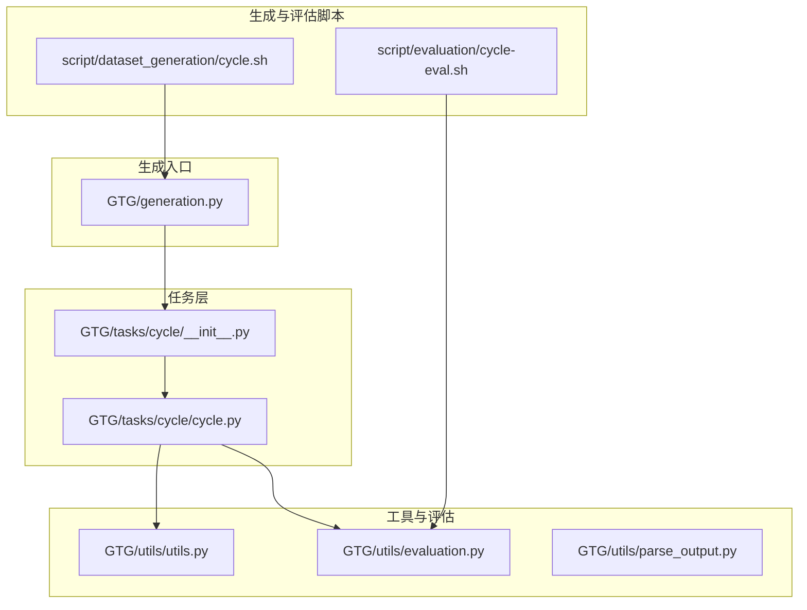
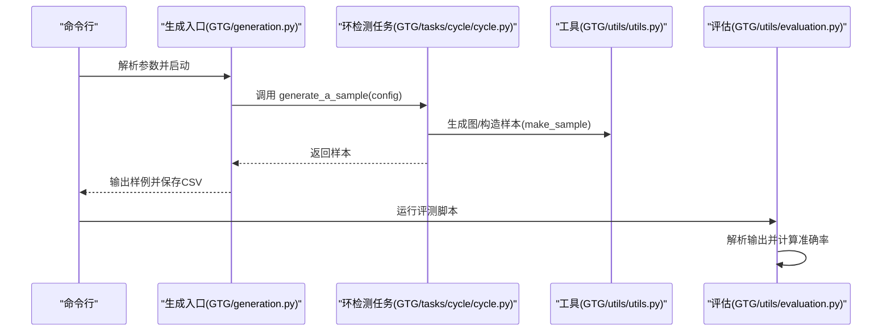
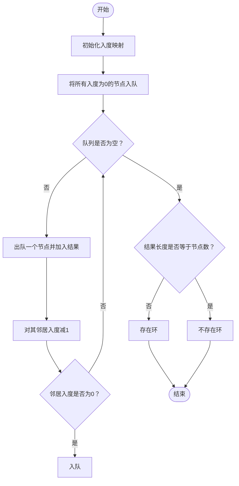
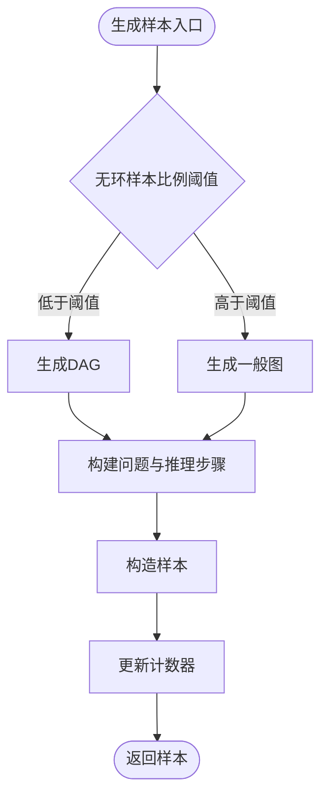
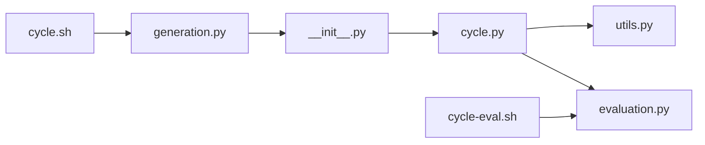

# 环检测

<cite>
**本文引用的文件**
- [GTG/tasks/cycle/cycle.py](file://GTG/tasks/cycle/cycle.py)
- [GTG/tasks/cycle/__init__.py](file://GTG/tasks/cycle/__init__.py)
- [GTG/utils/utils.py](file://GTG/utils/utils.py)
- [GTG/utils/evaluation.py](file://GTG/utils/evaluation.py)
- [GTG/generation.py](file://GTG/generation.py)
- [GTG/utils/parse_output.py](file://GTG/utils/parse_output.py)
- [script/dataset_generation/cycle.sh](file://script/dataset_generation/cycle.sh)
- [script/evaluation/cycle-eval.sh](file://script/evaluation/cycle-eval.sh)
- [GTG/tasks/topological_sort/topological_sort.py](file://GTG/tasks/topological_sort/topological_sort.py)
</cite>

## 目录
1. [简介](#简介)
2. [项目结构](#项目结构)
3. [核心组件](#核心组件)
4. [架构总览](#架构总览)
5. [详细组件分析](#详细组件分析)
6. [依赖关系分析](#依赖关系分析)
7. [性能考量](#性能考量)
8. [故障排查指南](#故障排查指南)
9. [结论](#结论)
10. [附录](#附录)

## 简介
本文件围绕环检测任务的实现进行深入解析，重点说明：
- 基于拓扑排序的环检测策略（有向图），并解释为何该方法适用于有向图而不能直接用于无向图。
- 如何通过数据生成阶段控制“是否存在环”的比例，从而生成包含不同性质的图样本。
- 在推理步骤中如何输出可解释的中间过程，帮助模型理解判定依据。
- 边界情况（自环、多重边、空图）的处理方式与评估逻辑。
- 实际调用示例与参数配置说明。

## 项目结构
环检测任务位于 GTG/tasks/cycle，配套的生成脚本与评估脚本分别位于 script/dataset_generation 与 script/evaluation 中；底层工具函数与评估框架位于 GTG/utils。

图表来源
- [GTG/tasks/cycle/cycle.py](file://GTG/tasks/cycle/cycle.py#L1-L166)
- [GTG/tasks/cycle/__init__.py](file://GTG/tasks/cycle/__init__.py#L1-L3)
- [GTG/utils/utils.py](file://GTG/utils/utils.py#L1-L200)
- [GTG/utils/evaluation.py](file://GTG/utils/evaluation.py#L1-L200)
- [GTG/generation.py](file://GTG/generation.py#L1-L107)
- [script/dataset_generation/cycle.sh](file://script/dataset_generation/cycle.sh#L1-L36)
- [script/evaluation/cycle-eval.sh](file://script/evaluation/cycle-eval.sh#L1-L14)

章节来源
- [GTG/tasks/cycle/cycle.py](file://GTG/tasks/cycle/cycle.py#L1-L166)
- [GTG/tasks/cycle/__init__.py](file://GTG/tasks/cycle/__init__.py#L1-L3)
- [GTG/utils/utils.py](file://GTG/utils/utils.py#L1-L200)
- [GTG/utils/evaluation.py](file://GTG/utils/evaluation.py#L1-L200)
- [GTG/generation.py](file://GTG/generation.py#L1-L107)
- [script/dataset_generation/cycle.sh](file://script/dataset_generation/cycle.sh#L1-L36)
- [script/evaluation/cycle-eval.sh](file://script/evaluation/cycle-eval.sh#L1-L14)

## 核心组件
- 任务模块：提供问题生成、推理步骤生成、选项生成与样本构造等能力。
- 数据生成：通过控制“是否有环”的比例，结合随机图与DAG生成策略，构造训练/评测样本。
- 评估模块：基于布尔解析器对模型输出进行正确性判定。

章节来源
- [GTG/tasks/cycle/cycle.py](file://GTG/tasks/cycle/cycle.py#L1-L166)
- [GTG/utils/utils.py](file://GTG/utils/utils.py#L1-L200)
- [GTG/utils/evaluation.py](file://GTG/utils/evaluation.py#L1-L200)

## 架构总览
环检测的整体流程如下：
- 生成阶段：根据配置选择是否生成DAG或一般图，并在两者间按比例平衡“是否有环”样本。
- 推理阶段：给出拓扑排序的推理步骤，基于入度为0节点的BFS式移除，若最终序列长度不等于节点数，则存在环。
- 评测阶段：解析模型输出的“是/否”，与样本答案比较，统计正确率。

图表来源
- [GTG/generation.py](file://GTG/generation.py#L1-L107)
- [GTG/tasks/cycle/cycle.py](file://GTG/tasks/cycle/cycle.py#L141-L159)
- [GTG/utils/utils.py](file://GTG/utils/utils.py#L14-L35)
- [GTG/utils/evaluation.py](file://GTG/utils/evaluation.py#L56-L80)

## 详细组件分析

### 1) 环检测算法与有向图判定
- 策略：拓扑排序 + 入度为0的BFS式移除。
- 判定规则：若最终得到的拓扑序长度小于节点数，则存在环；否则不存在环。
- 适用范围：仅对有向图有效；无向图需要使用其他方法（例如DFS回溯或并查集）。

图表来源
- [GTG/tasks/cycle/cycle.py](file://GTG/tasks/cycle/cycle.py#L33-L78)

章节来源
- [GTG/tasks/cycle/cycle.py](file://GTG/tasks/cycle/cycle.py#L22-L78)

### 2) 有向图 vs 无向图的检测策略差异
- 有向图：使用拓扑排序（入度为0节点BFS式移除）判定是否存在环。
- 无向图：拓扑排序不适用，应使用DFS回溯（访问状态三色标记）或并查集判定环。

本模块当前仅实现有向图的环检测，无向图的环检测不在本文件范围内。

章节来源
- [GTG/tasks/cycle/cycle.py](file://GTG/tasks/cycle/cycle.py#L22-L29)

### 3) 数据生成与环存在性控制
- 控制策略：在生成样本时，动态调整“DAG样本”与“一般图样本”的比例，使“无环”样本占比维持在约50%左右。
- DAG生成：通过随机定向边并检查是否保持DAG性质，避免引入环。
- 一般图生成：从多种图模型中采样，控制平均度以避免过于稠密导致环概率过高。

图表来源
- [GTG/tasks/cycle/cycle.py](file://GTG/tasks/cycle/cycle.py#L141-L159)
- [GTG/utils/utils.py](file://GTG/utils/utils.py#L313-L398)

章节来源
- [GTG/tasks/cycle/cycle.py](file://GTG/tasks/cycle/cycle.py#L141-L159)
- [GTG/utils/utils.py](file://GTG/utils/utils.py#L313-L398)

### 4) 推理步骤与可解释性
- 输出包含：入度统计、每轮移除节点、最终拓扑序与判定依据。
- 语言化描述：逐步解释入度变化与节点移除过程，帮助模型理解“为什么存在/不存在环”。

章节来源
- [GTG/tasks/cycle/cycle.py](file://GTG/tasks/cycle/cycle.py#L33-L78)

### 5) 选项与答案生成
- 选项：固定为“是/否”二选一。
- 标签：根据答案位置设置标签字符串，便于评测解析。

章节来源
- [GTG/tasks/cycle/cycle.py](file://GTG/tasks/cycle/cycle.py#L129-L139)

### 6) 样本结构与返回字段
- 关键字段：任务名、图的边列表/邻接表/自然语言描述、节点列表、边数、是否为有向图、问题、答案、推理步骤、选项、标签。
- 生成函数：make_sample统一构造样本字典。

章节来源
- [GTG/utils/utils.py](file://GTG/utils/utils.py#L14-L35)

### 7) 评测逻辑与解析
- 评测器：BoolEvaluator将模型输出解析为“是/否”，并与样本答案比较。
- 输出解析：parse_bool支持大小写与常见变体，parse_wrapped_answer支持包裹标记的提取。

章节来源
- [GTG/utils/evaluation.py](file://GTG/utils/evaluation.py#L56-L80)
- [GTG/utils/parse_output.py](file://GTG/utils/parse_output.py#L1-L200)

### 8) 与其他任务的对比（拓扑排序）
- 拓扑排序任务同样使用入度为0的BFS式移除，但其目标是输出拓扑序而非判定环。
- 二者共享相同的入度计算与队列处理逻辑，但判定条件不同。

章节来源
- [GTG/tasks/topological_sort/topological_sort.py](file://GTG/tasks/topological_sort/topological_sort.py#L20-L73)

## 依赖关系分析

图表来源
- [GTG/tasks/cycle/cycle.py](file://GTG/tasks/cycle/cycle.py#L1-L166)
- [GTG/tasks/cycle/__init__.py](file://GTG/tasks/cycle/__init__.py#L1-L3)
- [GTG/utils/utils.py](file://GTG/utils/utils.py#L1-L200)
- [GTG/utils/evaluation.py](file://GTG/utils/evaluation.py#L1-L200)
- [GTG/generation.py](file://GTG/generation.py#L1-L107)
- [script/dataset_generation/cycle.sh](file://script/dataset_generation/cycle.sh#L1-L36)
- [script/evaluation/cycle-eval.sh](file://script/evaluation/cycle-eval.sh#L1-L14)

章节来源
- [GTG/tasks/cycle/cycle.py](file://GTG/tasks/cycle/cycle.py#L1-L166)
- [GTG/tasks/cycle/__init__.py](file://GTG/tasks/cycle/__init__.py#L1-L3)
- [GTG/utils/utils.py](file://GTG/utils/utils.py#L1-L200)
- [GTG/utils/evaluation.py](file://GTG/utils/evaluation.py#L1-L200)
- [GTG/generation.py](file://GTG/generation.py#L1-L107)
- [script/dataset_generation/cycle.sh](file://script/dataset_generation/cycle.sh#L1-L36)
- [script/evaluation/cycle-eval.sh](file://script/evaluation/cycle-eval.sh#L1-L14)

## 性能考量
- 时间复杂度：拓扑排序 O(V+E)，适合大规模稀疏图。
- 空间复杂度：O(V+E) 存储入度与邻接信息。
- 图密度控制：生成器会过滤高平均度图，避免极端稠密导致环概率过高，提升评测稳定性。

章节来源
- [GTG/utils/utils.py](file://GTG/utils/utils.py#L313-L398)

## 故障排查指南
- 模型输出格式不符：确认输出包含“是/否”关键词，必要时使用包裹标记辅助解析。
- 评测失败：检查 parse_bool 的输入是否包含歧义词；确保答案与样本一致。
- 样本不平衡：若“无环”样本过少，可在生成阶段调整比例阈值或增加DAG生成权重。

章节来源
- [GTG/utils/parse_output.py](file://GTG/utils/parse_output.py#L1-L200)
- [GTG/utils/evaluation.py](file://GTG/utils/evaluation.py#L56-L80)

## 结论
- 本模块采用拓扑排序法对有向图进行环检测，逻辑清晰且可解释性强。
- 通过在数据生成阶段控制“是否存在环”的比例，能够稳定地覆盖两类样本。
- 评测采用布尔解析器，保证评测流程的一致性与可复现性。
- 对于无向图的环检测，建议另行实现DFS回溯或并查集方案，并与本模块解耦集成。

## 附录

### A. 实际调用示例与参数配置
- 生成数据集
  - 步骤：执行 cycle.sh，传入数据根目录、节点数量范围、样本数量、数据集标签。
  - 输出：原始CSV、整数ID版本CSV、字母ID版本CSV。
- 评测
  - 步骤：执行 cycle-eval.sh，传入数据根目录与输出根目录。
  - 输出：评测结果CSV，包含每条样本的解析后输出与正确性标记。

章节来源
- [script/dataset_generation/cycle.sh](file://script/dataset_generation/cycle.sh#L1-L36)
- [script/evaluation/cycle-eval.sh](file://script/evaluation/cycle-eval.sh#L1-L14)

### B. 返回结果结构说明
- 字段概览（来自 make_sample）：
  - task、graph、graph_adj、graph_nl、nodes、num_nodes、num_edges、directed、question、answer、steps、choices、label（可选）、id（生成器追加）。
- 生成流程：question_generation → answer_and_inference_steps_generation → choices_generation → make_sample。

章节来源
- [GTG/utils/utils.py](file://GTG/utils/utils.py#L14-L35)
- [GTG/tasks/cycle/cycle.py](file://GTG/tasks/cycle/cycle.py#L22-L139)

### C. 边界情况处理
- 自环：DAG生成器在添加边后立即检查DAG性质，若引入自环则回滚，确保无自环。
- 多重边：生成器在构造图时去重或避免重复添加，保证边唯一性。
- 空图：当节点数为0时，拓扑序长度也为0，判定为“不存在环”。

章节来源
- [GTG/utils/utils.py](file://GTG/utils/utils.py#L368-L398)
- [GTG/tasks/cycle/cycle.py](file://GTG/tasks/cycle/cycle.py#L33-L78)

### D. 与DFS回溯机制的关系
- 本模块未直接使用DFS回溯；DFS回溯通常用于无向图或有向图的另一种环检测思路（三色标记）。
- 若需扩展到无向图或更复杂的环类型（如负权环），可参考DFS回溯思想并在新模块中实现。

章节来源
- [GTG/tasks/cycle/cycle.py](file://GTG/tasks/cycle/cycle.py#L22-L29)