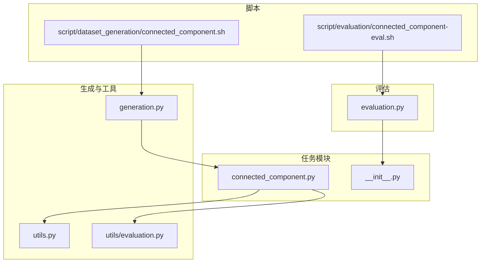
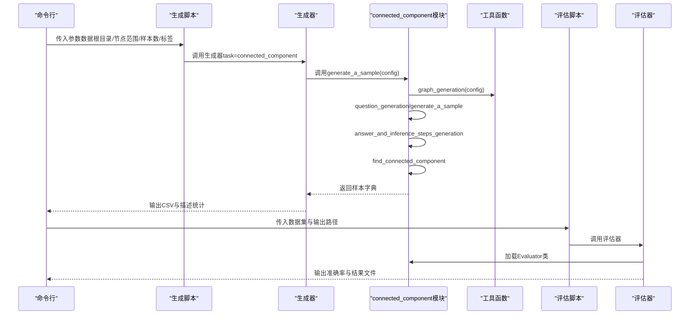
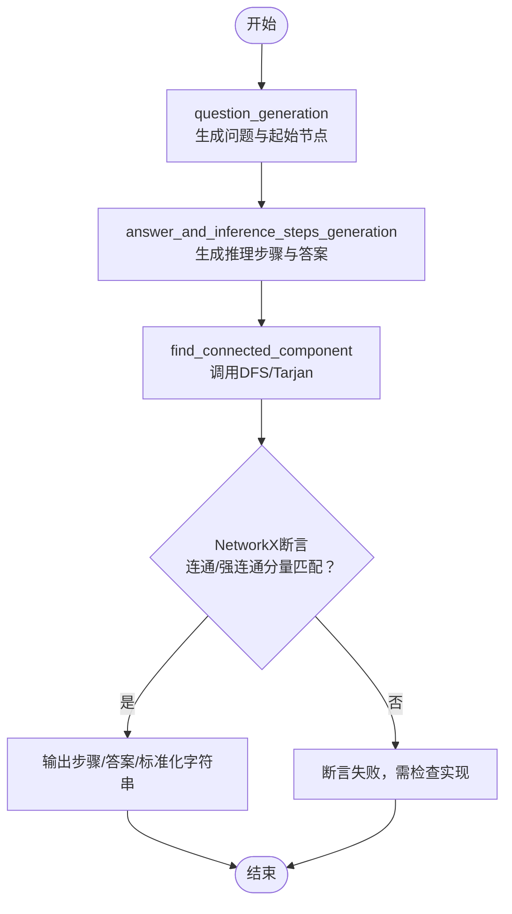
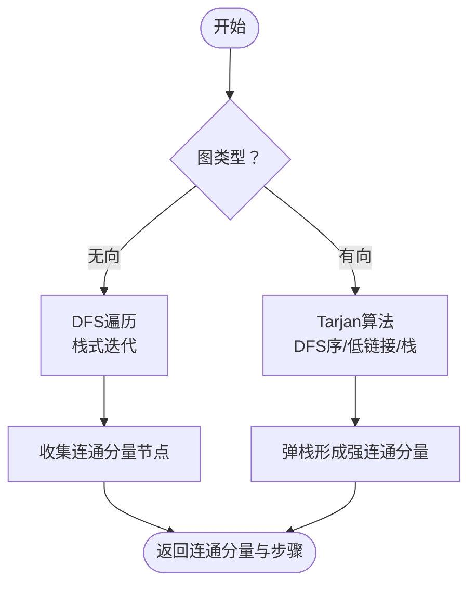
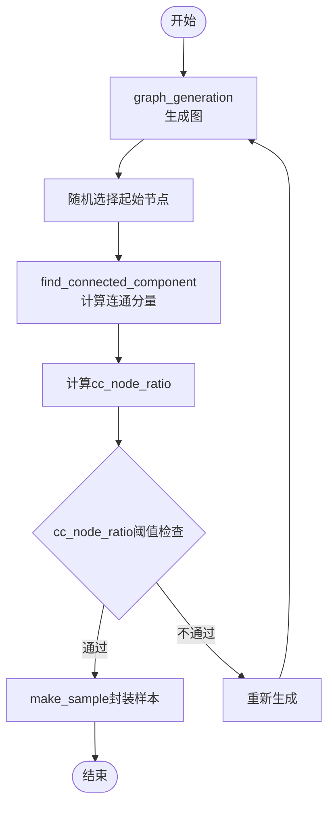
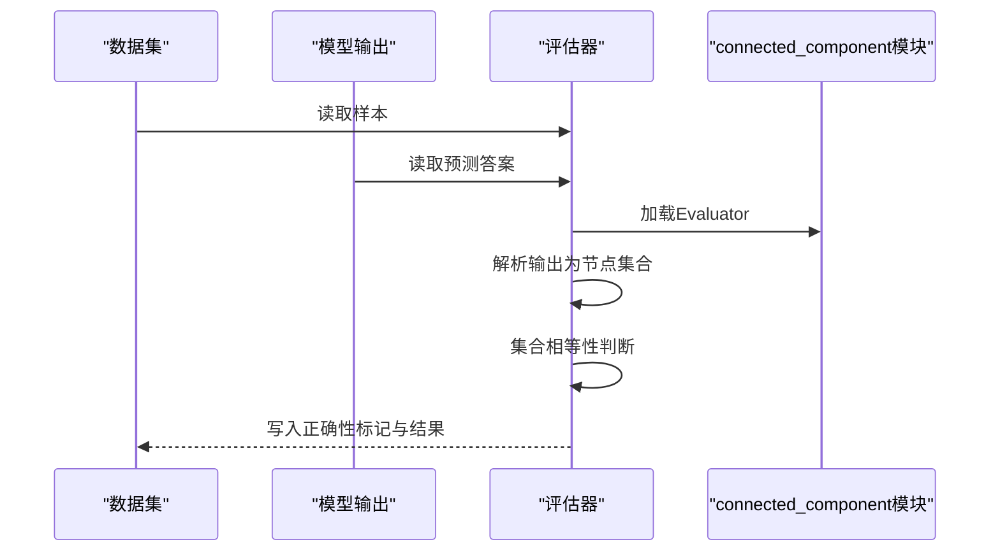
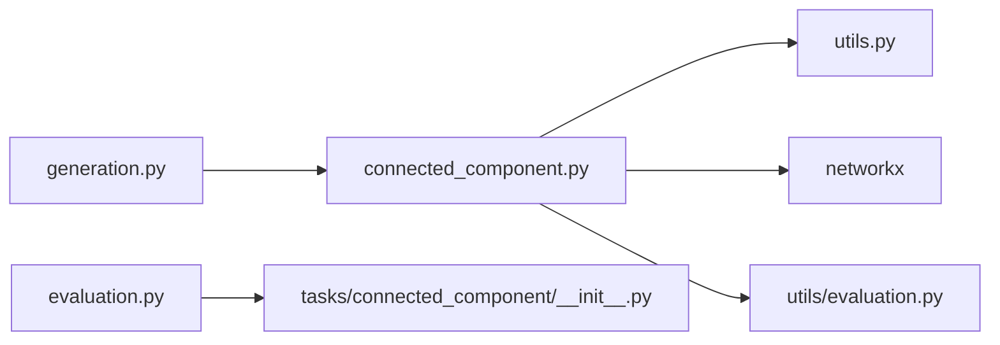

# 连通分量

<cite>
**本文引用的文件列表**
- [connected_component.py](file://GTG/tasks/connected_component/connected_component.py)
- [__init__.py](file://GTG/tasks/connected_component/__init__.py)
- [generation.py](file://GTG/generation.py)
- [utils.py](file://GTG/utils/utils.py)
- [evaluation.py](file://GTG/evaluation.py)
- [evaluation.py](file://GTG/utils/evaluation.py)
- [connected_component.sh](file://script/dataset_generation/connected_component.sh)
- [connected_component-eval.sh](file://script/evaluation/connected_component-eval.sh)
</cite>

## 目录
1. [简介](#简介)
2. [项目结构](#项目结构)
3. [核心组件](#核心组件)
4. [架构总览](#架构总览)
5. [详细组件分析](#详细组件分析)
6. [依赖关系分析](#依赖关系分析)
7. [性能与复杂度](#性能与复杂度)
8. [边界情况与鲁棒性](#边界情况与鲁棒性)
9. [评估与验证方法](#评估与验证方法)
10. [故障排查指南](#故障排查指南)
11. [结论](#结论)

## 简介
本文件围绕连通分量识别任务，系统梳理connected_component模块的实现与使用方式，重点覆盖：
- 基于Tarjan算法的有向图强连通分量检测与基于深度优先搜索（DFS）的无向图连通分量检测
- 如何统计连通分量数量并生成包含指定数量连通块的图样本
- 数据生成流程中的调用方式、输入参数结构、返回值格式与与其他任务模块的交互关系
- 在不同图结构（稀疏图、密集图、树形图）下的行为表现与边界情况处理策略
- 在评估系统中的验证方法，确保生成答案的准确性

## 项目结构
连通分量任务位于GTG/tasks/connected_component目录，配合通用生成器、工具函数与评估脚本完成端到端的数据生成与评测。

图表来源
- [connected_component.py](file://GTG/tasks/connected_component/connected_component.py#L1-L258)
- [__init__.py](file://GTG/tasks/connected_component/__init__.py#L1-L4)
- [generation.py](file://GTG/generation.py#L1-L107)
- [utils.py](file://GTG/utils/utils.py#L1-L200)
- [evaluation.py](file://GTG/utils/evaluation.py#L1-L200)
- [connected_component.sh](file://script/dataset_generation/connected_component.sh#L1-L36)
- [connected_component-eval.sh](file://script/evaluation/connected_component-eval.sh#L1-L14)
- [evaluation.py](file://GTG/evaluation.py#L1-L73)

章节来源
- [connected_component.py](file://GTG/tasks/connected_component/connected_component.py#L1-L258)
- [__init__.py](file://GTG/tasks/connected_component/__init__.py#L1-L4)
- [generation.py](file://GTG/generation.py#L1-L107)
- [utils.py](file://GTG/utils/utils.py#L1-L200)
- [evaluation.py](file://GTG/utils/evaluation.py#L1-L200)
- [connected_component.sh](file://script/dataset_generation/connected_component.sh#L1-L36)
- [connected_component-eval.sh](file://script/evaluation/connected_component-eval.sh#L1-L14)
- [evaluation.py](file://GTG/evaluation.py#L1-L73)

## 核心组件
- 任务入口与导出：通过__init__.py导出generate_a_sample、on_finished、Evaluator，供生成器与评估器使用。
- 问题生成：question_generation根据图类型（有向/无向）生成自然语言问题与起始节点。
- 推理步骤与答案生成：answer_and_inference_steps_generation调用find_connected_component，随后使用NetworkX内置的连通分量/强连通分量进行正确性断言，最终输出推理步骤、答案集合与标准化字符串。
- 连通分量检测：
  - 无向图：使用DFS（栈式迭代）遍历连通分量。
  - 有向图：使用Tarjan算法求强连通分量。
- 样本生成与筛选：generate_a_sample通过graph_generation生成图，随机选择起始节点，计算连通分量节点占比，满足阈值后封装为样本。
- 统计输出：on_finished打印cc_node_ratio的分位数统计。
- 评估器：继承NodeSetEvaluator，解析模型输出为节点集合，比较集合是否相等以判定正确性。

章节来源
- [connected_component.py](file://GTG/tasks/connected_component/connected_component.py#L1-L258)
- [__init__.py](file://GTG/tasks/connected_component/__init__.py#L1-L4)
- [utils.py](file://GTG/utils/utils.py#L1-L200)
- [evaluation.py](file://GTG/utils/evaluation.py#L128-L141)

## 架构总览
下图展示了从命令行到数据生成、再到评估的整体流程。

图表来源
- [connected_component.sh](file://script/dataset_generation/connected_component.sh#L1-L36)
- [generation.py](file://GTG/generation.py#L1-L107)
- [connected_component.py](file://GTG/tasks/connected_component/connected_component.py#L1-L258)
- [utils.py](file://GTG/utils/utils.py#L313-L349)
- [connected_component-eval.sh](file://script/evaluation/connected_component-eval.sh#L1-L14)
- [evaluation.py](file://GTG/evaluation.py#L1-L73)

## 详细组件分析

### 1) 问题与答案生成
- 问题生成：根据图是否为有向图，构造“查找包含某节点的连通/强连通分量”的自然语言问题，并随机选择起始节点。
- 答案与推理步骤：调用find_connected_component得到目标连通分量；随后使用NetworkX内置的连通分量/强连通分量进行断言，确保答案唯一且正确；最后将答案集合标准化为字符串。

图表来源
- [connected_component.py](file://GTG/tasks/connected_component/connected_component.py#L12-L44)

章节来源
- [connected_component.py](file://GTG/tasks/connected_component/connected_component.py#L12-L44)

### 2) 连通分量检测算法
- 无向图（DFS）：以起始节点为根，使用栈进行深度优先遍历，收集未访问邻居节点，逐步扩展连通分量。
- 有向图（Tarjan）：维护DFS序与Low链接，利用栈记录当前路径，当节点的low值等于其dfs序时，弹栈形成一个强连通分量。

图表来源
- [connected_component.py](file://GTG/tasks/connected_component/connected_component.py#L167-L195)
- [connected_component.py](file://GTG/tasks/connected_component/connected_component.py#L47-L104)
- [connected_component.py](file://GTG/tasks/connected_component/connected_component.py#L106-L165)

章节来源
- [connected_component.py](file://GTG/tasks/connected_component/connected_component.py#L167-L195)
- [connected_component.py](file://GTG/tasks/connected_component/connected_component.py#L47-L104)
- [connected_component.py](file://GTG/tasks/connected_component/connected_component.py#L106-L165)

### 3) 样本生成与筛选
- 图生成：graph_generation按配置生成随机图、BA图或WS小世界图，避免平均度过高导致极端连通性。
- 起始节点：随机选择。
- 过滤策略：计算连通分量节点占比，若超过阈值则拒绝样本，保证连通块规模分布合理。
- 样本封装：make_sample统一输出字段，包括图、节点、边、问题、答案、推理步骤等。

图表来源
- [connected_component.py](file://GTG/tasks/connected_component/connected_component.py#L201-L244)
- [utils.py](file://GTG/utils/utils.py#L14-L36)
- [utils.py](file://GTG/utils/utils.py#L313-L349)

章节来源
- [connected_component.py](file://GTG/tasks/connected_component/connected_component.py#L201-L244)
- [utils.py](file://GTG/utils/utils.py#L14-L36)
- [utils.py](file://GTG/utils/utils.py#L313-L349)

### 4) 评估器与验证
- 评估器：NodeSetEvaluator解析输出为节点集合，比较集合是否与标准答案一致。
- 评估流程：evaluation.py读取数据集与模型输出，逐样本调用eval_a_sample，汇总准确率与结果。

图表来源
- [evaluation.py](file://GTG/evaluation.py#L1-L73)
- [evaluation.py](file://GTG/utils/evaluation.py#L128-L141)
- [connected_component.py](file://GTG/tasks/connected_component/connected_component.py#L254-L258)

章节来源
- [evaluation.py](file://GTG/evaluation.py#L1-L73)
- [evaluation.py](file://GTG/utils/evaluation.py#L128-L141)
- [connected_component.py](file://GTG/tasks/connected_component/connected_component.py#L254-L258)

## 依赖关系分析
- connected_component模块依赖：
  - utils.graph_generation：生成多种类型的图（随机图、BA图、WS图），控制平均度与孤立点。
  - utils.make_sample：统一样本字典结构。
  - utils.NID：节点ID格式化。
  - utils.NodeSetEvaluator：节点集合型答案的解析与校验。
  - NetworkX：连通/强连通分量断言与图操作。
- generation.py：调度任务模块，批量生成样本并保存统计信息。
- evaluation.py：加载对应任务的Evaluator，合并数据与输出，计算准确率并写出结果。

图表来源
- [connected_component.py](file://GTG/tasks/connected_component/connected_component.py#L1-L258)
- [utils.py](file://GTG/utils/utils.py#L1-L200)
- [evaluation.py](file://GTG/utils/evaluation.py#L1-L200)
- [generation.py](file://GTG/generation.py#L1-L107)
- [evaluation.py](file://GTG/evaluation.py#L1-L73)
- [__init__.py](file://GTG/tasks/connected_component/__init__.py#L1-L4)

章节来源
- [connected_component.py](file://GTG/tasks/connected_component/connected_component.py#L1-L258)
- [utils.py](file://GTG/utils/utils.py#L1-L200)
- [evaluation.py](file://GTG/utils/evaluation.py#L1-L200)
- [generation.py](file://GTG/generation.py#L1-L107)
- [evaluation.py](file://GTG/evaluation.py#L1-L73)
- [__init__.py](file://GTG/tasks/connected_component/__init__.py#L1-L4)

## 性能与复杂度
- DFS（无向图）：时间复杂度O(V+E)，空间复杂度O(V)（栈与visited集合）。
- Tarjan（有向图）：时间复杂度O(V+E)，空间复杂度O(V)（栈、low、dfs、on_stack）。
- 样本生成：graph_generation按配置生成图，平均度上限与拒绝采样策略可影响生成效率。
- 评估：NodeSetEvaluator解析与集合比较为线性时间，整体受样本数量与节点规模影响。

[本节为通用性能讨论，无需特定文件来源]

## 边界情况与鲁棒性
- 空图与单节点图：find_connected_component会直接返回仅包含起始节点的连通分量；cc_node_ratio为1/n，可能触发阈值过滤策略。
- 完全孤立节点：graph_generation会避免生成孤立节点；若存在，将被拒绝重采样。
- 多连通块：cc_node_ratio用于衡量目标连通块占全图的比例，筛选策略避免极端大块或全满块。
- 有向图与无向图：is_directed分支分别走Tarjan或DFS，确保算法适用性。
- 答案断言：answer_and_inference_steps_generation使用NetworkX内置连通分量/强连通分量进行断言，提升答案可靠性。

章节来源
- [connected_component.py](file://GTG/tasks/connected_component/connected_component.py#L167-L195)
- [connected_component.py](file://GTG/tasks/connected_component/connected_component.py#L25-L44)
- [utils.py](file://GTG/utils/utils.py#L313-L349)

## 评估与验证方法
- 输入参数结构（生成阶段）：
  - task: connected_component
  - file_output: 输出CSV路径
  - num_samples: 样本数量
  - num_nodes_range: 节点数范围（字符串表达式，eval后使用）
  - hash_str: 用于确定随机种子的哈希串
- 返回值格式（样本字典）：
  - 包含task、graph、graph_adj、graph_nl、nodes、num_nodes、num_edges、directed、question、answer、steps等键，便于下游处理与可视化。
- 评估阶段：
  - 读取数据集与模型输出，逐样本解析节点集合，比较集合是否相等，输出准确率与结果文件。

章节来源
- [generation.py](file://GTG/generation.py#L1-L107)
- [utils.py](file://GTG/utils/utils.py#L14-L36)
- [evaluation.py](file://GTG/evaluation.py#L1-L73)
- [evaluation.py](file://GTG/utils/evaluation.py#L128-L141)

## 故障排查指南
- 生成阶段常见问题
  - 样本质量不佳：cc_node_ratio过高被拒绝。可调整阈值或增加样本重试次数。
  - 图过大或过密：graph_generation限制平均度，避免极端连通性；必要时降低num_nodes_range或调整生成策略。
  - 孤立节点：确保graph_generation未生成孤立节点；若出现，检查生成器逻辑。
- 评估阶段常见问题
  - 答案格式不符：NodeSetEvaluator要求输出为节点列表形式；请确认模型输出格式与解析规则一致。
  - 断言失败：answer_and_inference_steps_generation会断言答案与NetworkX结果一致；若失败，检查find_connected_component实现或输入图结构。
- 调试建议
  - 使用generation.py的示例输出查看样本结构与关键字段。
  - 在connected_component.py中临时打印中间变量（如graph_dict、stack、low等）定位问题。

章节来源
- [connected_component.py](file://GTG/tasks/connected_component/connected_component.py#L201-L244)
- [utils.py](file://GTG/utils/utils.py#L313-L349)
- [evaluation.py](file://GTG/utils/evaluation.py#L128-L141)

## 结论
connected_component模块通过统一的样本生成与评估框架，实现了对无向图连通分量（DFS）与有向图强连通分量（Tarjan）的稳定检测与验证。其设计兼顾了算法正确性与数据质量控制，能够生成多样化但可控的图样本，并通过评估器确保答案一致性。在实际应用中，建议关注cc_node_ratio阈值设置、图类型分支与NetworkX断言的配合，以获得更稳健的实验结果。