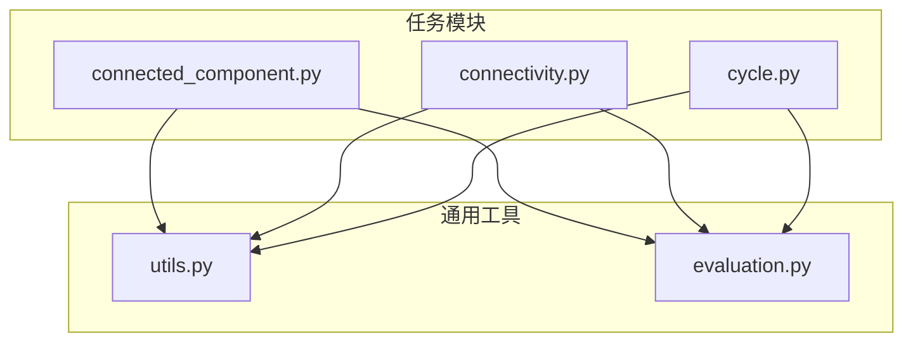
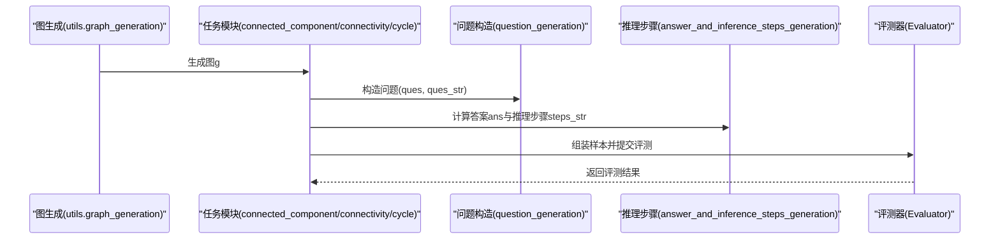
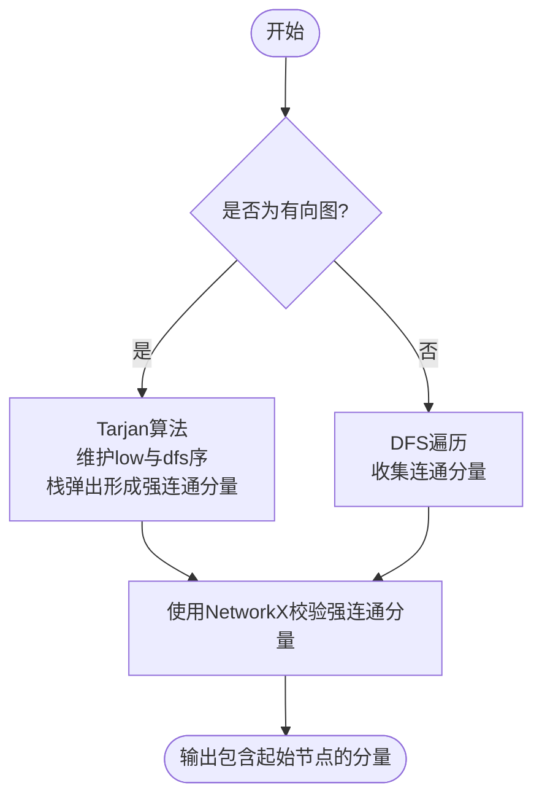
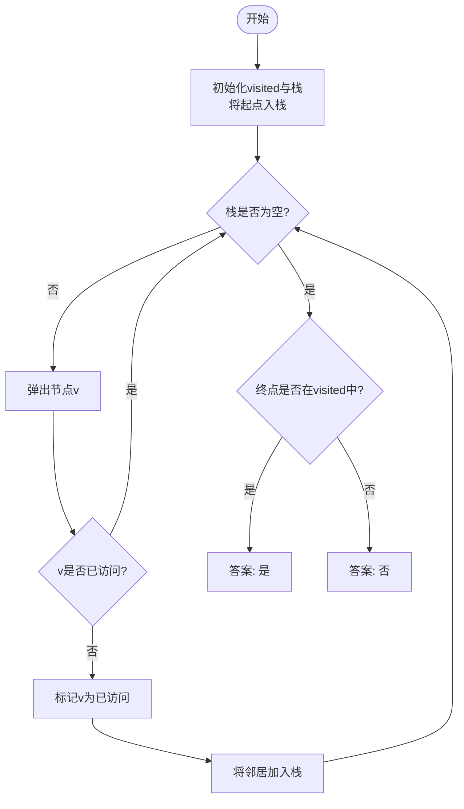
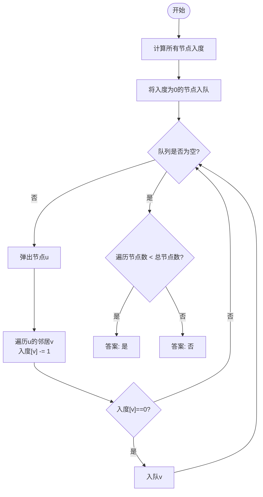
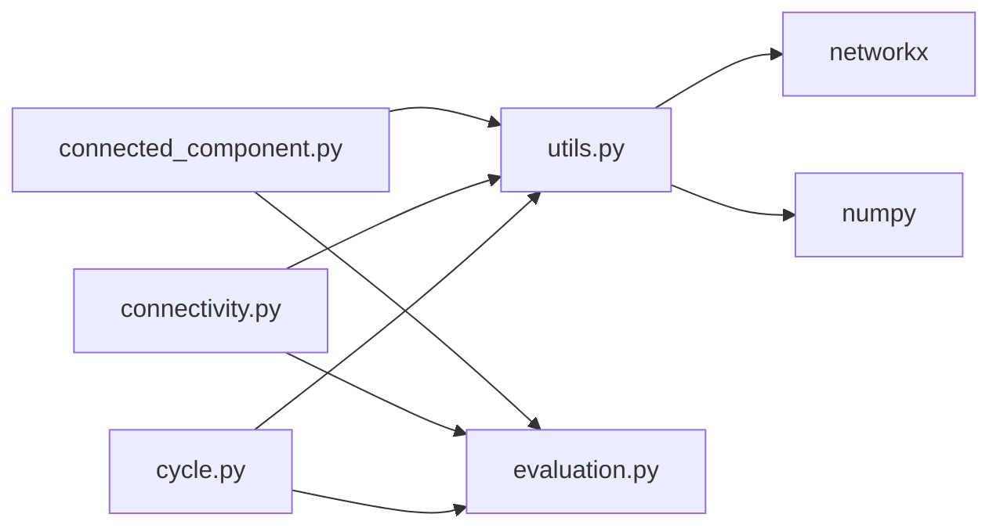

# 连通性分析

<cite>
**本文引用的文件列表**
- [connected_component.py](file://GTG/tasks/connected_component/connected_component.py)
- [connectivity.py](file://GTG/tasks/connectivity/connectivity.py)
- [cycle.py](file://GTG/tasks/cycle/cycle.py)
- [utils.py](file://GTG/utils/utils.py)
- [evaluation.py](file://GTG/utils/evaluation.py)
</cite>

## 目录
1. [引言](#引言)
2. [项目结构](#项目结构)
3. [核心组件](#核心组件)
4. [架构总览](#架构总览)
5. [详细组件分析](#详细组件分析)
6. [依赖关系分析](#依赖关系分析)
7. [性能考量](#性能考量)
8. [故障排查指南](#故障排查指南)
9. [结论](#结论)
10. [附录](#附录)

## 引言
本文件围绕“连通性分析”主题，系统梳理并解释以下任务的实现原理与工程实践：
- 无向图连通分量数量与有向图强连通分量的识别
- 有向图可达性（路径存在性）判断
- 基于拓扑排序的环检测（有向图是否存在环）
- 二分图判定与匹配（作为连通性相关任务的补充）

在实现层面，本文以connected_component.py、connectivity.py、cycle.py为核心，结合utils.py中的图生成与格式化工具，以及evaluation.py中的评测基类，给出从数据生成、推理步骤到答案校验的完整流程说明，并对边界情况（空图、孤立节点、单点图等）提供处理策略。

## 项目结构
本仓库采用按任务模块划分的组织方式，连通性相关功能集中在GTG/tasks目录下：
- connected_component：连通分量与强连通分量识别
- connectivity：两点可达性判断
- cycle：环检测（拓扑排序法）
- utils：通用工具（图生成、格式化、评测辅助）
- evaluation：评测基类与解析工具

图表来源
- [connected_component.py](file://GTG/tasks/connected_component/connected_component.py#L1-L258)
- [connectivity.py](file://GTG/tasks/connectivity/connectivity.py#L1-L125)
- [cycle.py](file://GTG/tasks/cycle/cycle.py#L1-L166)
- [utils.py](file://GTG/utils/utils.py#L1-L200)
- [evaluation.py](file://GTG/utils/evaluation.py#L1-L165)

章节来源
- [connected_component.py](file://GTG/tasks/connected_component/connected_component.py#L1-L258)
- [connectivity.py](file://GTG/tasks/connectivity/connectivity.py#L1-L125)
- [cycle.py](file://GTG/tasks/cycle/cycle.py#L1-L166)
- [utils.py](file://GTG/utils/utils.py#L1-L200)
- [evaluation.py](file://GTG/utils/evaluation.py#L1-L165)

## 核心组件
- connected_component.py
  - 功能：识别无向图连通分量或有向图强连通分量；提供Tarjan算法实现；支持生成样本与统计连通分量节点占比。
  - 关键点：根据图是否为有向图选择DFS或Tarjan；输出推理步骤字符串；使用NetworkX进行正确性校验。
- connectivity.py
  - 功能：判断两点之间是否存在路径（有向图可达性或无向图连通性）。
  - 关键点：使用DFS遍历；限制正例比例以平衡数据集；输出推理过程与答案。
- cycle.py
  - 功能：检测有向图是否存在环（拓扑排序法）。
  - 关键点：计算入度、BFS式拓扑排序；通过结果长度判断是否有环；偏向生成DAG样本但允许回退到一般图。
- utils.py
  - 功能：提供图生成（随机图、Watts-Strogatz、Barabási-Albert、DAG等）、节点ID格式化、邻接表/边列表格式化、评测辅助等。
- evaluation.py
  - 功能：定义评测基类（NodeSetEvaluator、BoolEvaluator等），统一解析与校验逻辑。

章节来源
- [connected_component.py](file://GTG/tasks/connected_component/connected_component.py#L1-L258)
- [connectivity.py](file://GTG/tasks/connectivity/connectivity.py#L1-L125)
- [cycle.py](file://GTG/tasks/cycle/cycle.py#L1-L166)
- [utils.py](file://GTG/utils/utils.py#L1-L200)
- [evaluation.py](file://GTG/utils/evaluation.py#L1-L165)

## 架构总览
整体流程由“数据生成—问题构造—推理步骤—答案校验”构成。每个任务模块均提供generate_a_sample入口，内部调用utils中的图生成函数，构造问题与答案，并通过评测器完成一致性校验。

图表来源
- [connected_component.py](file://GTG/tasks/connected_component/connected_component.py#L201-L245)
- [connectivity.py](file://GTG/tasks/connectivity/connectivity.py#L101-L118)
- [cycle.py](file://GTG/tasks/cycle/cycle.py#L141-L160)
- [utils.py](file://GTG/utils/utils.py#L313-L405)
- [evaluation.py](file://GTG/utils/evaluation.py#L1-L165)

## 详细组件分析

### 连通分量与强连通分量识别（connected_component.py）
- 任务目标
  - 无向图：返回包含起始节点的连通分量
  - 有向图：返回包含起始节点的强连通分量（Tarjan算法）
- 实现要点
  - 图表示：将NetworkX图转为邻接集合字典，便于DFS/Tarjan操作
  - 无向图DFS：从起始节点出发，迭代访问未访问邻居，收集连通分量
  - 有向图Tarjan：维护low值与dfs序，利用栈记录当前路径，当low==dfs时弹出形成强连通分量
  - 正确性校验：使用NetworkX内置的连通/强连通组件进行断言
  - 样本生成：限制连通分量节点占比不过高，避免极端样本；统计cc_node_ratio并打印分位数
- 边界处理
  - 空图/单节点图：Tarjan/DFS均可直接返回该节点；cc_node_ratio为1
  - 孤立节点：Tarjan/DFS会单独形成一个强连通/连通分量
  - 多个连通/强连通分量：Tarjan返回全部，最终选取包含起始节点的分量

图表来源
- [connected_component.py](file://GTG/tasks/connected_component/connected_component.py#L167-L196)
- [connected_component.py](file://GTG/tasks/connected_component/connected_component.py#L47-L164)

章节来源
- [connected_component.py](file://GTG/tasks/connected_component/connected_component.py#L1-L258)

### 可达性判断（connectivity.py）
- 任务目标：判断两点之间是否存在路径（有向图可达性或无向图连通性）
- 实现要点
  - 使用DFS从起点出发，维护visited集合与栈；遍历结束后检查终点是否在visited中
  - 为平衡正负例比例，若当前正例比例过高则拒绝样本并重新生成
  - 输出DFS遍历序列与结论
- 边界处理
  - 起点等于终点：视为可达（可作为特判或由DFS自然覆盖）
  - 孤立节点：不可达
  - 空图：不可达

图表来源
- [connectivity.py](file://GTG/tasks/connectivity/connectivity.py#L37-L87)

章节来源
- [connectivity.py](file://GTG/tasks/connectivity/connectivity.py#L1-L125)

### 环检测（cycle.py）
- 任务目标：判断有向图是否存在环（拓扑排序法）
- 实现要点
  - 计算每个节点的入度，将入度为0的节点入队
  - 循环弹出队首节点，减少其邻居入度；当邻居入度变为0时入队
  - 若最终遍历节点数小于总节点数，则存在环
  - 样本生成偏向DAG（通过generate_random_directed_acyclic_graph），但动态调整以维持正负例平衡
- 边界处理
  - 空图/单节点图：无环
  - 孤立节点：入度为0，会被优先处理
  - 自环或多边：自环会导致入度异常，但生成器会避免完全孤立节点，自环概率较低

图表来源
- [cycle.py](file://GTG/tasks/cycle/cycle.py#L33-L79)
- [cycle.py](file://GTG/tasks/cycle/cycle.py#L81-L127)

章节来源
- [cycle.py](file://GTG/tasks/cycle/cycle.py#L1-L166)

### 二分图判定与匹配（bipartite.py）
- 任务目标：在二分图中寻找最大匹配（匈牙利算法）
- 实现要点
  - 生成二分图：随机生成两部分节点集，按概率连接跨集合边，确保连通且无孤立节点
  - 匈牙利算法：对左侧集合逐个节点进行增广路DFS，维护匹配字典
  - 样本评测：解析输出边列表，校验匹配合法性（每侧节点仅出现一次）
- 与连通性关系
  - 二分图本身要求无奇环（无奇数长度环），因此可作为环检测的特例（无奇环即二分图）
  - 匹配问题与连通性相关，但本任务更侧重匹配而非连通性

章节来源
- [bipartite.py](file://GTG/tasks/bipartite/bipartite.py#L1-L135)
- [utils.py](file://GTG/utils/utils.py#L408-L435)

## 依赖关系分析
- 模块间依赖
  - connected_component/connectivity/cycle均依赖utils中的图生成与格式化函数
  - 评测器继承evaluation.py中的基类，统一解析与校验流程
- 外部依赖
  - NetworkX用于图结构与连通性/强连通性检测
  - NumPy用于数值计算与采样
- 潜在耦合
  - 评测器与任务模块通过统一字段（question、answer、steps等）耦合
  - 样本生成器与评测器共享正负例比例控制逻辑

图表来源
- [connected_component.py](file://GTG/tasks/connected_component/connected_component.py#L1-L258)
- [connectivity.py](file://GTG/tasks/connectivity/connectivity.py#L1-L125)
- [cycle.py](file://GTG/tasks/cycle/cycle.py#L1-L166)
- [utils.py](file://GTG/utils/utils.py#L1-L200)
- [evaluation.py](file://GTG/utils/evaluation.py#L1-L165)

章节来源
- [connected_component.py](file://GTG/tasks/connected_component/connected_component.py#L1-L258)
- [connectivity.py](file://GTG/tasks/connectivity/connectivity.py#L1-L125)
- [cycle.py](file://GTG/tasks/cycle/cycle.py#L1-L166)
- [utils.py](file://GTG/utils/utils.py#L1-L200)
- [evaluation.py](file://GTG/utils/evaluation.py#L1-L165)

## 性能考量
- 时间复杂度
  - DFS/DFS变种：O(V+E)，适合稀疏图
  - Tarjan（SCC）：O(V+E)，常数因子略大
  - 拓扑排序：O(V+E)，入度计算+队列操作
- 空间复杂度
  - 邻接表存储：O(V+E)
  - DFS/Tarjan栈与visited集合：O(V)
  - 入度数组：O(V)
- 优化建议
  - 使用邻接集合字典替代NetworkX邻接视图，减少重复封装开销
  - 对大规模图可考虑并行化（如多起点并行Tarjan）
  - 样本生成阶段避免极端密度图，降低评测器二次校验成本

## 故障排查指南
- 连通分量/强连通分量错误
  - 症状：答案与NetworkX内置结果不一致
  - 排查：确认图是否为有向图；检查Tarjan/DFS实现中栈与low/dfs更新逻辑；核对起始节点映射
  - 参考路径：[connected_component.py](file://GTG/tasks/connected_component/connected_component.py#L167-L196)
- 可达性误判
  - 症状：正例比例异常偏高
  - 排查：检查reject逻辑与_num_sample/_num_yes计数；确认起点与终点不同
  - 参考路径：[connectivity.py](file://GTG/tasks/connectivity/connectivity.py#L77-L87)
- 环检测误判
  - 症状：DAG样本过少或频繁回退
  - 排查：检查generate_random_directed_acyclic_graph生成器与正负例比例控制
  - 参考路径：[cycle.py](file://GTG/tasks/cycle/cycle.py#L141-L160)
- 格式化与评测失败
  - 症状：答案解析失败或评测不通过
  - 排查：确认NID格式化、边列表解析、匹配合法性校验
  - 参考路径：[utils.py](file://GTG/utils/utils.py#L56-L71), [evaluation.py](file://GTG/utils/evaluation.py#L1-L165)

章节来源
- [connected_component.py](file://GTG/tasks/connected_component/connected_component.py#L167-L196)
- [connectivity.py](file://GTG/tasks/connectivity/connectivity.py#L77-L87)
- [cycle.py](file://GTG/tasks/cycle/cycle.py#L141-L160)
- [utils.py](file://GTG/utils/utils.py#L56-L71)
- [evaluation.py](file://GTG/utils/evaluation.py#L1-L165)

## 结论
本项目通过统一的任务模块与评测框架，实现了连通性分析的核心能力：
- 无向图连通分量与有向图强连通分量识别（Tarjan算法）
- 有向图可达性判断（DFS）
- 有向图环检测（拓扑排序）
- 二分图匹配（匈牙利算法，作为连通性相关任务的补充）

在工程实践中，模块间职责清晰、依赖明确，配合utils与evaluation的通用能力，能够稳定生成高质量样本并进行一致性评测。针对边界情况（空图、孤立节点、单点图等），实现均提供了稳健的处理策略。

## 附录
- 边界案例处理清单
  - 空图：Tarjan/DFS/Tarjan均返回空；可达性与环检测按定义返回
  - 单节点图：Tarjan/DFS返回该节点；可达性为真；环检测为假
  - 孤立节点：Tarjan/DFS独立形成分量；可达性为假；环检测为假
  - 多分量/多SCC：Tarjan返回全部；最终选取包含起始节点的分量
  - DAG与非DAG：环检测以拓扑排序为准；DAG生成器偏向DAG但允许回退