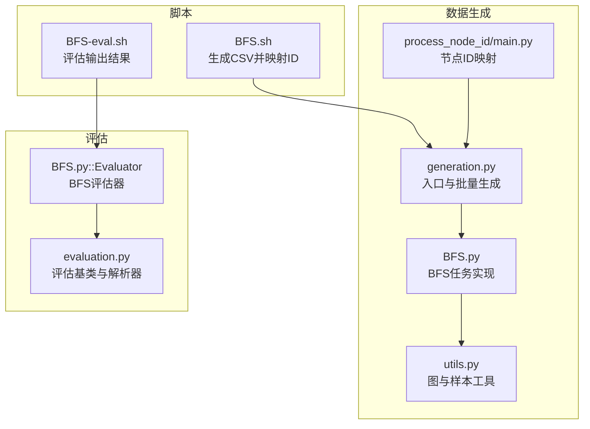
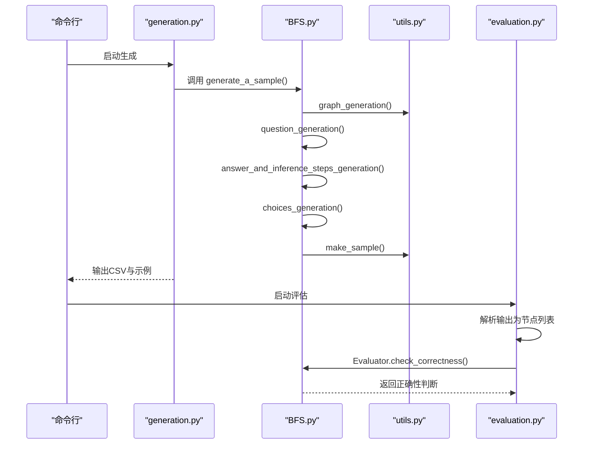
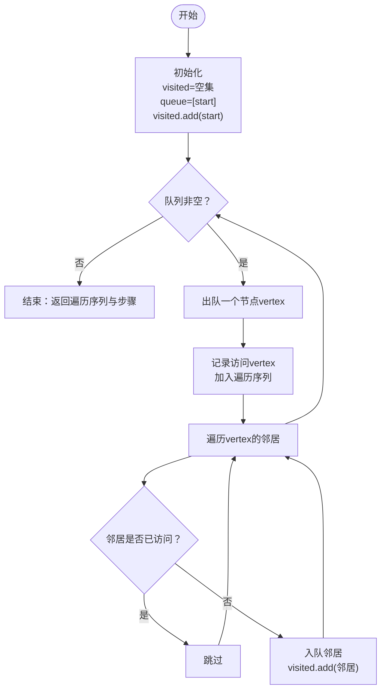
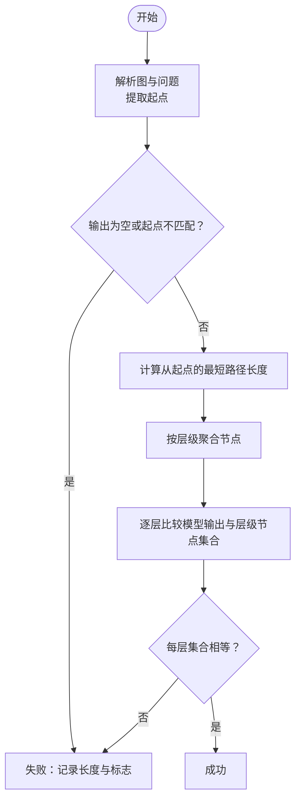
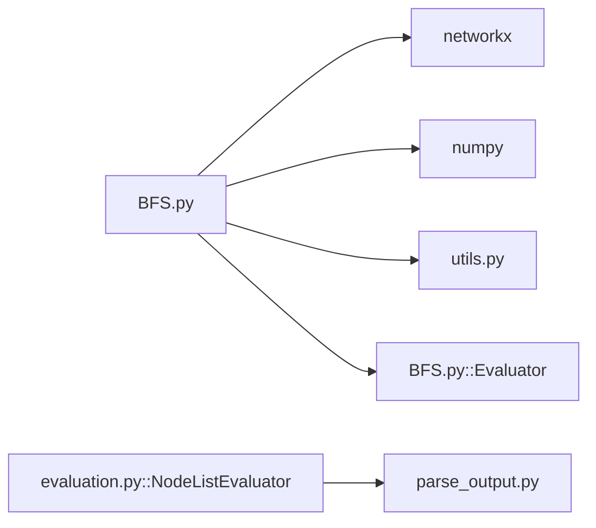

# BFS实现详解

<cite>
**本文引用的文件列表**
- [BFS.py](file://GTG/tasks/BFS/BFS.py)
- [generation.py](file://GTG/generation.py)
- [evaluation.py](file://GTG/utils/evaluation.py)
- [utils.py](file://GTG/utils/utils.py)
- [BFS.sh](file://script/dataset_generation/BFS.sh)
- [BFS-eval.sh](file://script/evaluation/BFS-eval.sh)
- [main.py](file://GTG/process_node_id/main.py)
</cite>

## 目录
1. [引言](#引言)
2. [项目结构](#项目结构)
3. [核心组件](#核心组件)
4. [架构总览](#架构总览)
5. [详细组件分析](#详细组件分析)
6. [依赖关系分析](#依赖关系分析)
7. [性能考量](#性能考量)
8. [故障排查指南](#故障排查指南)
9. [结论](#结论)
10. [附录：调用示例与最佳实践](#附录调用示例与最佳实践)

## 引言
本文件围绕BFS任务在该代码库中的实现进行系统化剖析，重点覆盖以下方面：
- question_generation函数中起始节点的选择策略
- answer_and_inference_steps_generation函数中基于队列的遍历逻辑与推理步骤生成方式
- generate_a_sample函数如何协调图生成、问题构建与答案生成的完整流程
- choices_generation函数中干扰项的构造方法（随机排序、半随机、切割拼接）
- 结合代码路径展示BFS遍历过程中visited集合与queue队列的状态变化
- Evaluator类如何通过层次化节点检查验证BFS序列的正确性
- 实际调用示例与常见问题排查方法（如遍历序列长度不足时的拒绝机制）

## 项目结构
BFS模块位于GTG/tasks/BFS目录下，配合通用工具与评估框架共同工作：
- 任务实现：GTG/tasks/BFS/BFS.py
- 数据生成入口：GTG/generation.py
- 评估框架：GTG/utils/evaluation.py
- 通用工具：GTG/utils/utils.py
- 节点ID映射：GTG/process_node_id/main.py
- 生成与评估脚本：script/dataset_generation/BFS.sh、script/evaluation/BFS-eval.sh

图表来源
- [generation.py](file://GTG/generation.py#L1-L107)
- [BFS.py](file://GTG/tasks/BFS/BFS.py#L1-L212)
- [evaluation.py](file://GTG/utils/evaluation.py#L1-L283)
- [utils.py](file://GTG/utils/utils.py#L1-L617)
- [main.py](file://GTG/process_node_id/main.py#L1-L58)
- [BFS.sh](file://script/dataset_generation/BFS.sh#L1-L36)
- [BFS-eval.sh](file://script/evaluation/BFS-eval.sh#L1-L14)

章节来源
- [generation.py](file://GTG/generation.py#L1-L107)
- [BFS.py](file://GTG/tasks/BFS/BFS.py#L1-L212)
- [evaluation.py](file://GTG/utils/evaluation.py#L1-L283)
- [utils.py](file://GTG/utils/utils.py#L1-L617)
- [main.py](file://GTG/process_node_id/main.py#L1-L58)
- [BFS.sh](file://script/dataset_generation/BFS.sh#L1-L36)
- [BFS-eval.sh](file://script/evaluation/BFS-eval.sh#L1-L14)

## 核心组件
- BFS任务实现：包含问题生成、答案与推理步骤生成、选项生成、样本组装与评估器
- 通用工具：图生成、样本封装、字符串格式化、图解析等
- 评估框架：统一的解析与校验流程，BFS评估器继承节点列表评估基类
- 脚本：命令行入口，驱动生成与评估

章节来源
- [BFS.py](file://GTG/tasks/BFS/BFS.py#L1-L212)
- [utils.py](file://GTG/utils/utils.py#L1-L617)
- [evaluation.py](file://GTG/utils/evaluation.py#L1-L283)

## 架构总览
BFS模块遵循“生成-评估”闭环：
- 生成阶段：graph_generation生成图，question_generation确定起点，answer_and_inference_steps_generation执行BFS并记录推理过程，choices_generation构造干扰项，最后make_sample封装为样本
- 评估阶段：Evaluator解析模型输出为节点列表，按层次化节点集合逐一比对，确保BFS序列满足层次约束

图表来源
- [generation.py](file://GTG/generation.py#L1-L107)
- [BFS.py](file://GTG/tasks/BFS/BFS.py#L139-L155)
- [utils.py](file://GTG/utils/utils.py#L14-L35)
- [evaluation.py](file://GTG/utils/evaluation.py#L114-L141)

## 详细组件分析

### 1) 起始节点选择策略（question_generation）
- 策略：从图的节点总数范围内均匀随机选择一个节点作为BFS起点
- 输出：返回问题字典（含start键）与问题字符串
- 关键点：问题字符串中包含格式化的起点标识，便于后续评估器提取

章节来源
- [BFS.py](file://GTG/tasks/BFS/BFS.py#L13-L21)

### 2) BFS遍历与推理步骤生成（answer_and_inference_steps_generation）
- 队列与访问集：使用集合visited跟踪已访问节点，使用双端队列deque作为BFS队列
- 遍历逻辑：每次从队首取出节点，加入遍历序列；遍历其未访问邻居，入队并标记访问
- 推理步骤：逐步输出“访问节点”与“未访问邻居”信息，形成可解释的中间步骤
- 拒绝机制：若最终遍历序列长度小于阈值，则标记reject为真，触发重新生成

图表来源
- [BFS.py](file://GTG/tasks/BFS/BFS.py#L24-L67)

章节来源
- [BFS.py](file://GTG/tasks/BFS/BFS.py#L24-L67)

### 3) 干扰项构造（choices_generation）
- 随机排序：对除起点外的序列进行随机打乱，形成一种完全随机的错误选项
- 半随机：对后半部分进行随机打乱，保留前半部分顺序，形成“局部随机”的错误选项
- 切割拼接：将序列按三段切分，重组为“前段+尾段+中段”，形成结构性错位的错误选项
- 最终打乱：将正确选项与三个错误选项随机排列，确保标签位置随机化

章节来源
- [BFS.py](file://GTG/tasks/BFS/BFS.py#L108-L136)

### 4) 样本生成与流程协调（generate_a_sample）
- 步骤：graph_generation生成图→question_generation确定起点→answer_and_inference_steps_generation执行BFS并生成推理步骤→choices_generation构造干扰项→make_sample封装为样本
- 拒绝重试：当answer_and_inference_steps_generation返回reject为真时，循环重新生成直至满足长度要求

章节来源
- [BFS.py](file://GTG/tasks/BFS/BFS.py#L139-L155)
- [utils.py](file://GTG/utils/utils.py#L14-L35)

### 5) 评估器（Evaluator）与层次化校验
- 输入解析：从样本中解析图与问题，提取起点；从模型输出解析为节点列表
- 层次化校验：计算从起点出发的最短路径长度，按层级聚合节点集合；逐层比较模型输出与层级节点集合，要求每层节点集合一致
- 失败判定：若输出为空、起点不匹配或任意一层集合不一致，则判为错误

图表来源
- [BFS.py](file://GTG/tasks/BFS/BFS.py#L157-L191)
- [utils.py](file://GTG/utils/utils.py#L82-L96)
- [evaluation.py](file://GTG/utils/evaluation.py#L114-L141)

章节来源
- [BFS.py](file://GTG/tasks/BFS/BFS.py#L157-L191)
- [utils.py](file://GTG/utils/utils.py#L82-L96)
- [evaluation.py](file://GTG/utils/evaluation.py#L114-L141)

### 6) 图生成与样本封装（graph_generation、make_sample）
- 图生成：支持随机图、Barabási-Albert、Watts-Strogatz三种生成器，自动剔除孤立节点并随机重映射节点ID
- 样本封装：将图、问题、答案、推理步骤、选项等字段统一打包为标准样本字典

章节来源
- [utils.py](file://GTG/utils/utils.py#L224-L350)
- [utils.py](file://GTG/utils/utils.py#L14-L35)

## 依赖关系分析
- BFS任务依赖NetworkX进行图操作，依赖numpy进行数组与随机化操作
- BFS任务依赖utils中的图生成、样本封装、图解析工具
- 评估器继承NodeListEvaluator，复用解析节点列表的通用能力

图表来源
- [BFS.py](file://GTG/tasks/BFS/BFS.py#L1-L212)
- [evaluation.py](file://GTG/utils/evaluation.py#L114-L141)
- [utils.py](file://GTG/utils/utils.py#L1-L617)

章节来源
- [BFS.py](file://GTG/tasks/BFS/BFS.py#L1-L212)
- [evaluation.py](file://GTG/utils/evaluation.py#L114-L141)
- [utils.py](file://GTG/utils/utils.py#L1-L617)

## 性能考量
- 时间复杂度：单次BFS遍历为O(V+E)，其中V为节点数，E为边数
- 空间复杂度：visited集合与队列最多存储全部节点，空间复杂度O(V)
- 生成阶段：graph_generation会尝试多次生成以满足平均度与连通性要求，可能增加生成时间
- 评估阶段：层次化校验需计算最短路径长度并按层级聚合，整体仍为线性于节点数的扫描

[本节为一般性讨论，无需列出具体文件来源]

## 故障排查指南
- 遍历序列长度不足被拒绝
  - 现象：answer_and_inference_steps_generation返回reject为真，generate_a_sample循环重新生成
  - 排查：确认图规模与连通性；适当增大节点范围或调整生成策略
  - 参考路径：[BFS.py](file://GTG/tasks/BFS/BFS.py#L61-L67)、[BFS.py](file://GTG/tasks/BFS/BFS.py#L144-L148)
- 评估失败（起点不匹配或层级集合不一致）
  - 现象：Evaluator.check_correctness返回False，并记录输出长度与标志
  - 排查：检查模型输出是否包含起点；确认输出节点列表解析正确；核对图结构与起点提取逻辑
  - 参考路径：[BFS.py](file://GTG/tasks/BFS/BFS.py#L162-L191)、[utils.py](file://GTG/utils/utils.py#L82-L96)
- 图生成失败（存在孤立节点）
  - 现象：graph_generation循环生成直到无孤立节点
  - 排查：检查生成参数与概率设置；必要时放宽条件或调整生成器
  - 参考路径：[utils.py](file://GTG/utils/utils.py#L224-L350)

章节来源
- [BFS.py](file://GTG/tasks/BFS/BFS.py#L61-L67)
- [BFS.py](file://GTG/tasks/BFS/BFS.py#L144-L148)
- [BFS.py](file://GTG/tasks/BFS/BFS.py#L162-L191)
- [utils.py](file://GTG/utils/utils.py#L82-L96)
- [utils.py](file://GTG/utils/utils.py#L224-L350)

## 结论
该BFS实现以清晰的模块化设计贯穿“生成-评估”全流程：问题生成采用简单而稳健的随机起点策略；BFS遍历严格遵循队列与访问集管理，同时输出可解释的推理步骤；评估器通过层次化节点集合校验确保BFS序列的正确性；干扰项构造提供了多样化的错误样例，有助于提升模型的判别能力。整体实现简洁可靠，易于扩展与维护。

[本节为总结性内容，无需列出具体文件来源]

## 附录：调用示例与最佳实践

### 1) 生成BFS数据集
- 使用脚本生成原始CSV，再分别映射为整数ID与字母ID版本
- 命令示例（路径参考）：
  - 生成：[BFS.sh](file://script/dataset_generation/BFS.sh#L13-L18)
  - 映射ID：[BFS.sh](file://script/dataset_generation/BFS.sh#L21-L36)
  - 节点ID映射入口：[main.py](file://GTG/process_node_id/main.py#L16-L20)

章节来源
- [BFS.sh](file://script/dataset_generation/BFS.sh#L1-L36)
- [main.py](file://GTG/process_node_id/main.py#L1-L58)

### 2) 评估BFS输出
- 使用脚本读取数据集与模型输出，生成评估结果
- 命令示例（路径参考）：
  - 评估：[BFS-eval.sh](file://script/evaluation/BFS-eval.sh#L10-L14)

章节来源
- [BFS-eval.sh](file://script/evaluation/BFS-eval.sh#L1-L14)

### 3) 实际调用流程（代码级路径）
- 入口与批量生成：[generation.py](file://GTG/generation.py#L1-L107)
- 样本生成主流程：[BFS.py](file://GTG/tasks/BFS/BFS.py#L139-L155)
- 图生成与封装：[utils.py](file://GTG/utils/utils.py#L224-L350)、[utils.py](file://GTG/utils/utils.py#L14-L35)
- 评估器解析与校验：[evaluation.py](file://GTG/utils/evaluation.py#L114-L141)、[BFS.py](file://GTG/tasks/BFS/BFS.py#L157-L191)

章节来源
- [generation.py](file://GTG/generation.py#L1-L107)
- [BFS.py](file://GTG/tasks/BFS/BFS.py#L139-L155)
- [utils.py](file://GTG/utils/utils.py#L224-L350)
- [utils.py](file://GTG/utils/utils.py#L14-L35)
- [evaluation.py](file://GTG/utils/evaluation.py#L114-L141)