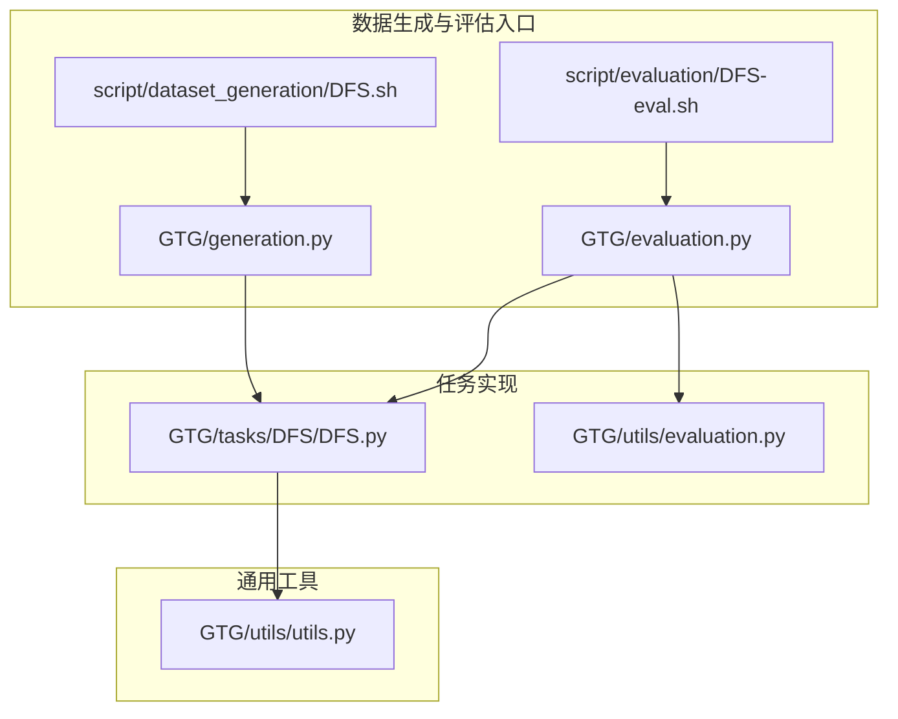
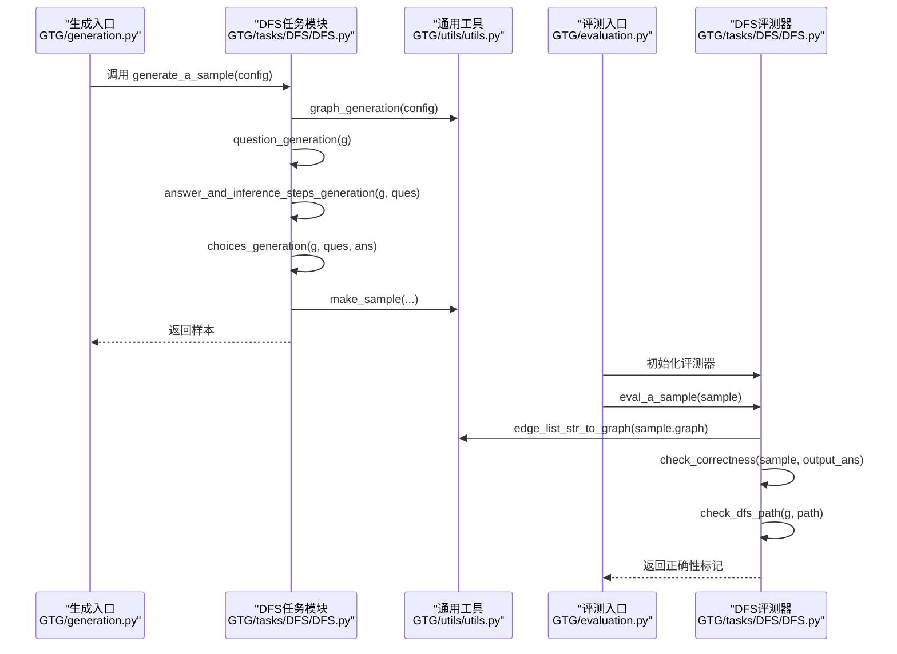
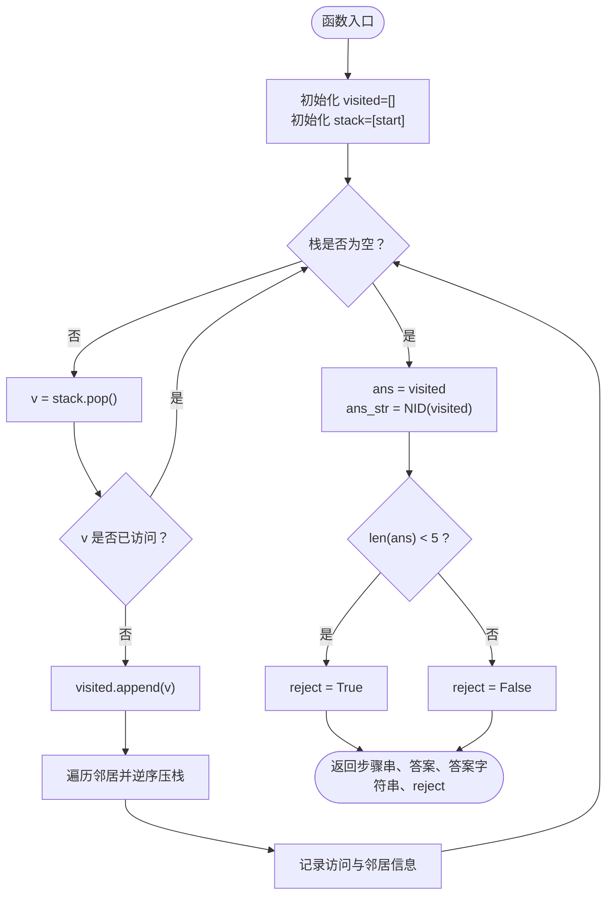
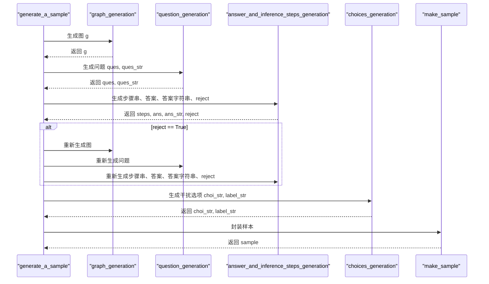
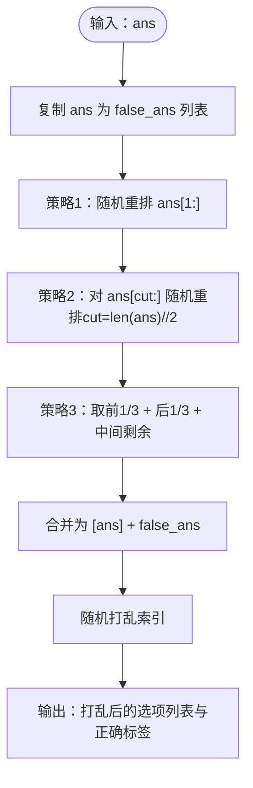
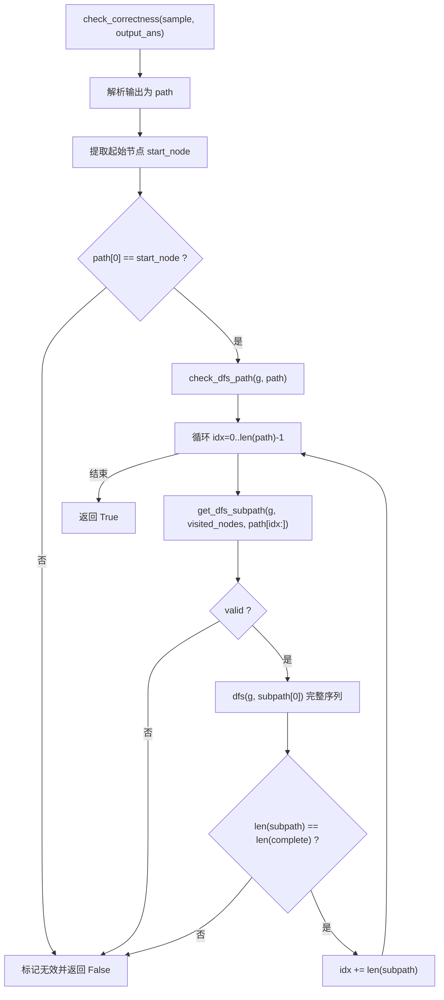
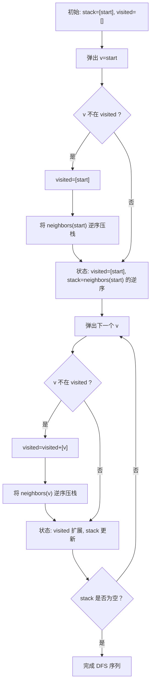
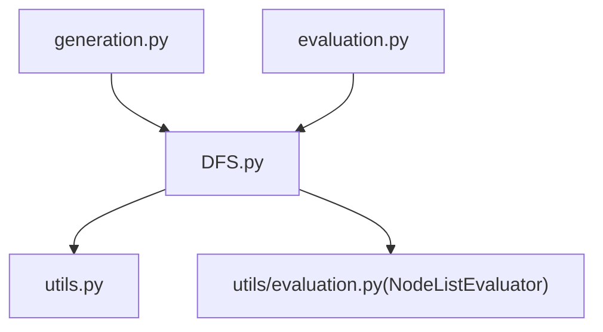

# DFS实现详解

<cite>
**本文引用的文件**
- [GTG/tasks/DFS/DFS.py](file://GTG/tasks/DFS/DFS.py)
- [GTG/utils/utils.py](file://GTG/utils/utils.py)
- [GTG/utils/evaluation.py](file://GTG/utils/evaluation.py)
- [GTG/generation.py](file://GTG/generation.py)
- [GTG/evaluation.py](file://GTG/evaluation.py)
- [script/dataset_generation/DFS.sh](file://script/dataset_generation/DFS.sh)
- [script/evaluation/DFS-eval.sh](file://script/evaluation/DFS-eval.sh)
</cite>

## 目录
1. [引言](#引言)
2. [项目结构](#项目结构)
3. [核心组件](#核心组件)
4. [架构总览](#架构总览)
5. [详细组件分析](#详细组件分析)
6. [依赖关系分析](#依赖关系分析)
7. [性能考量](#性能考量)
8. [故障排查指南](#故障排查指南)
9. [结论](#结论)
10. [附录](#附录)

## 引言
本文件面向“深度优先搜索（DFS）”任务的完整实现进行系统化解析，重点覆盖以下方面：
- question_generation函数中随机起始节点的生成方法
- answer_and_inference_steps_generation函数中基于栈的深度优先遍历机制
- generate_a_sample函数的样本生成流程
- choices_generation函数中三种干扰项生成策略
- Evaluator类的check_correctness方法及其依赖的check_dfs_path、get_dfs_subpath和dfs辅助函数，解释如何验证DFS路径的拓扑正确性
- 通过代码示例展示DFS执行过程中stack栈和visited访问列表的动态变化
- 路径有效性检查的递归验证逻辑
- 典型使用场景与常见错误处理方案

## 项目结构
DFS任务位于GTG/tasks/DFS目录下，配套工具与评估脚本分布于GTG/utils、GTG/generation.py、GTG/evaluation.py及脚本目录script/。

图表来源
- [GTG/tasks/DFS/DFS.py](file://GTG/tasks/DFS/DFS.py#L1-L140)
- [GTG/utils/utils.py](file://GTG/utils/utils.py#L1-L120)
- [GTG/utils/evaluation.py](file://GTG/utils/evaluation.py#L114-L141)
- [GTG/generation.py](file://GTG/generation.py#L29-L60)
- [GTG/evaluation.py](file://GTG/evaluation.py#L14-L36)
- [script/dataset_generation/DFS.sh](file://script/dataset_generation/DFS.sh#L1-L36)
- [script/evaluation/DFS-eval.sh](file://script/evaluation/DFS-eval.sh#L1-L14)

章节来源
- [GTG/tasks/DFS/DFS.py](file://GTG/tasks/DFS/DFS.py#L1-L140)
- [GTG/utils/utils.py](file://GTG/utils/utils.py#L1-L120)
- [GTG/generation.py](file://GTG/generation.py#L29-L60)
- [GTG/evaluation.py](file://GTG/evaluation.py#L14-L36)

## 核心组件
- DFS任务模块：负责问题生成、答案与推理步骤生成、干扰选项生成、样本封装与评测器实现
- 通用工具模块：提供图生成、样本封装、节点ID格式化、字符串到图转换等基础能力
- 评测基类：提供统一的输出解析与正确性判断框架
- 数据生成与评估入口：命令行入口，驱动样本生成与评测流程

章节来源
- [GTG/tasks/DFS/DFS.py](file://GTG/tasks/DFS/DFS.py#L1-L140)
- [GTG/utils/utils.py](file://GTG/utils/utils.py#L14-L36)
- [GTG/utils/evaluation.py](file://GTG/utils/evaluation.py#L114-L141)
- [GTG/generation.py](file://GTG/generation.py#L29-L60)
- [GTG/evaluation.py](file://GTG/evaluation.py#L14-L36)

## 架构总览
DFS任务采用“生成-评测”双阶段架构：
- 生成阶段：由generate_a_sample协调graph_generation、question_generation、answer_and_inference_steps_generation与choices_generation，最终通过make_sample封装样本
- 评测阶段：由NodeListEvaluator派生的DFS评测器对模型输出进行解析与正确性判断，check_correctness委托check_dfs_path完成拓扑合法性校验

图表来源
- [GTG/generation.py](file://GTG/generation.py#L29-L60)
- [GTG/tasks/DFS/DFS.py](file://GTG/tasks/DFS/DFS.py#L125-L140)
- [GTG/utils/utils.py](file://GTG/utils/utils.py#L14-L36)
- [GTG/evaluation.py](file://GTG/evaluation.py#L14-L36)
- [GTG/tasks/DFS/DFS.py](file://GTG/tasks/DFS/DFS.py#L143-L165)

## 详细组件分析

### 随机起始节点生成：question_generation
- 实现要点
  - 在图的节点集合上均匀采样一个起始节点
  - 将起始节点嵌入到问题字符串中，供后续推理步骤与评测使用
- 复杂度
  - 时间复杂度O(1)，空间复杂度O(1)
- 注意事项
  - 起始节点需满足图非空且索引合法

章节来源
- [GTG/tasks/DFS/DFS.py](file://GTG/tasks/DFS/DFS.py#L12-L20)

### 基于栈的DFS遍历：answer_and_inference_steps_generation
- 实现要点
  - 使用栈模拟DFS：初始将起始节点压入栈
  - 每次从栈弹出一个节点，若未访问则加入visited，并将其所有邻居逆序压入栈（保证遍历顺序稳定）
  - 过程中记录每一步访问与邻居信息，形成可读的推理步骤字符串
  - 若遍历序列长度小于阈值，则标记reject以拒绝该样本（确保题目具备足够复杂度）
- 复杂度
  - 时间复杂度O(V+E)，空间复杂度O(V)
- 动态变化示意（以伪代码流程图表示）

图表来源
- [GTG/tasks/DFS/DFS.py](file://GTG/tasks/DFS/DFS.py#L23-L56)

章节来源
- [GTG/tasks/DFS/DFS.py](file://GTG/tasks/DFS/DFS.py#L23-L56)

### 样本生成流程：generate_a_sample
- 实现要点
  - 循环调用graph_generation生成图，直到answer_and_inference_steps_generation返回的reject为False
  - 生成问题字符串与答案字符串
  - 生成干扰选项并封装为样本
- 流程示意（序列图）

图表来源
- [GTG/tasks/DFS/DFS.py](file://GTG/tasks/DFS/DFS.py#L125-L140)
- [GTG/utils/utils.py](file://GTG/utils/utils.py#L14-L36)

章节来源
- [GTG/tasks/DFS/DFS.py](file://GTG/tasks/DFS/DFS.py#L125-L140)
- [GTG/utils/utils.py](file://GTG/utils/utils.py#L14-L36)

### 干扰项生成策略：choices_generation
- 策略一：随机重排除首元素外的其余元素
- 策略二：仅对后半段进行随机重排
- 策略三：取前1/3与后1/3拼接中间剩余部分，形成“截断拼接”
- 最终将正确答案与三个干扰项打乱顺序，得到四个选项与标签

图表来源
- [GTG/tasks/DFS/DFS.py](file://GTG/tasks/DFS/DFS.py#L94-L122)

章节来源
- [GTG/tasks/DFS/DFS.py](file://GTG/tasks/DFS/DFS.py#L94-L122)

### DFS路径正确性验证：Evaluator.check_correctness与辅助函数
- check_correctness
  - 解析模型输出为节点列表
  - 提取问题中的起始节点并与输出首元素比较
  - 调用check_dfs_path进行拓扑合法性校验，并记录有效前缀长度
- check_dfs_path
  - 维护已访问节点集合，按子路径逐步验证
  - 对每个子路径调用get_dfs_subpath，判断边存在性与回溯合法性
  - 再调用dfs辅助函数计算从当前起点的完整DFS序列，比较长度一致性
- get_dfs_subpath
  - 逐个检查相邻节点之间是否存在边
  - 若目标节点已在已访问集合中，判定非法
  - 若无直接边，回溯寻找最近可用祖先节点，确认其存在未访问邻居
  - 返回当前有效子路径与合法性标记
- dfs辅助函数
  - 以给定起点执行一次完整的DFS，返回该连通分量的DFS序列

图表来源
- [GTG/tasks/DFS/DFS.py](file://GTG/tasks/DFS/DFS.py#L143-L185)
- [GTG/tasks/DFS/DFS.py](file://GTG/tasks/DFS/DFS.py#L188-L214)
- [GTG/tasks/DFS/DFS.py](file://GTG/tasks/DFS/DFS.py#L217-L229)

章节来源
- [GTG/tasks/DFS/DFS.py](file://GTG/tasks/DFS/DFS.py#L143-L185)
- [GTG/tasks/DFS/DFS.py](file://GTG/tasks/DFS/DFS.py#L188-L214)
- [GTG/tasks/DFS/DFS.py](file://GTG/tasks/DFS/DFS.py#L217-L229)

### DFS执行过程中的栈与访问列表动态变化
以下以伪代码形式描述一次典型DFS执行的栈与访问列表变化，帮助理解算法行为与评测逻辑之间的对应关系。

图表来源
- [GTG/tasks/DFS/DFS.py](file://GTG/tasks/DFS/DFS.py#L23-L56)

章节来源
- [GTG/tasks/DFS/DFS.py](file://GTG/tasks/DFS/DFS.py#L23-L56)

## 依赖关系分析
- DFS任务模块依赖通用工具模块提供的图生成、样本封装、字符串到图转换等能力
- 评测器继承自NodeListEvaluator，遵循统一的输出解析与正确性判断框架
- 生成与评测通过命令行脚本与入口模块连接，形成端到端工作流

图表来源
- [GTG/tasks/DFS/DFS.py](file://GTG/tasks/DFS/DFS.py#L1-L140)
- [GTG/utils/utils.py](file://GTG/utils/utils.py#L14-L36)
- [GTG/utils/evaluation.py](file://GTG/utils/evaluation.py#L114-L141)
- [GTG/generation.py](file://GTG/generation.py#L29-L60)
- [GTG/evaluation.py](file://GTG/evaluation.py#L14-L36)

章节来源
- [GTG/tasks/DFS/DFS.py](file://GTG/tasks/DFS/DFS.py#L1-L140)
- [GTG/utils/utils.py](file://GTG/utils/utils.py#L14-L36)
- [GTG/utils/evaluation.py](file://GTG/utils/evaluation.py#L114-L141)
- [GTG/generation.py](file://GTG/generation.py#L29-L60)
- [GTG/evaluation.py](file://GTG/evaluation.py#L14-L36)

## 性能考量
- 生成阶段
  - 图生成采用随机图、BA或WS模型，结合邻居重洗牌与节点ID重映射，避免极端结构导致评测偏差
  - 通过平均度阈值过滤，避免过于稀疏或稠密的图影响评测稳定性
- 遍历阶段
  - DFS遍历时间复杂度O(V+E)，栈空间最多为V；对于大规模图，建议控制节点规模或采用更高效的邻接表示
- 评测阶段
  - check_dfs_path对路径进行分段验证，get_dfs_subpath回溯查找祖先节点，整体复杂度与路径长度线性相关
  - dfs辅助函数用于完整性校验，避免遗漏节点或重复访问

[本节为一般性指导，不涉及具体文件分析]

## 故障排查指南
- 样本被拒绝（reject=True）
  - 可能原因：DFS遍历序列长度过短（小于阈值），导致样本质量不足
  - 处理建议：增大图规模或调整邻居压栈顺序，确保连通分量足够大
- 路径首节点不匹配
  - 可能原因：模型输出未包含正确的起始节点
  - 处理建议：检查问题字符串中的起始节点与模型输出解析逻辑
- 回溯合法性失败
  - 可能原因：路径中出现不存在的边或重复访问已访问节点
  - 处理建议：核对get_dfs_subpath的回溯逻辑与邻居集合比对
- 完整性校验失败
  - 可能原因：子路径长度与完整DFS序列不一致
  - 处理建议：检查dfs辅助函数的起点与连通性，确保同一连通分量内序列一致

章节来源
- [GTG/tasks/DFS/DFS.py](file://GTG/tasks/DFS/DFS.py#L50-L56)
- [GTG/tasks/DFS/DFS.py](file://GTG/tasks/DFS/DFS.py#L152-L164)
- [GTG/tasks/DFS/DFS.py](file://GTG/tasks/DFS/DFS.py#L188-L214)
- [GTG/tasks/DFS/DFS.py](file://GTG/tasks/DFS/DFS.py#L217-L229)

## 结论
本实现以清晰的模块划分与稳健的评测机制保障了DFS任务的质量与可解释性。question_generation的随机起始节点、answer_and_inference_steps_generation的基于栈DFS遍历、choices_generation的三类干扰项策略，以及Evaluator的拓扑正确性验证共同构成了完整的训练与评测闭环。通过脚本化的生成与评估入口，用户可以快速扩展节点ID类型、批量生成数据集并进行评测。

[本节为总结性内容，不涉及具体文件分析]

## 附录
- 典型使用场景
  - 训练阶段：使用脚本生成大规模DFS样本，配合choices_generation构造四选一选择题
  - 评测阶段：对模型输出进行解析与正确性判断，统计准确率并输出详细结果
- 常见错误处理
  - 样本质量：通过reject机制剔除低质量样本
  - 输出解析：统一使用NodeListEvaluator解析节点列表
  - 路径校验：严格验证边存在性、访问唯一性与连通完整性

章节来源
- [script/dataset_generation/DFS.sh](file://script/dataset_generation/DFS.sh#L1-L36)
- [script/evaluation/DFS-eval.sh](file://script/evaluation/DFS-eval.sh#L1-L14)
- [GTG/utils/evaluation.py](file://GTG/utils/evaluation.py#L114-L141)
- [GTG/evaluation.py](file://GTG/evaluation.py#L47-L68)