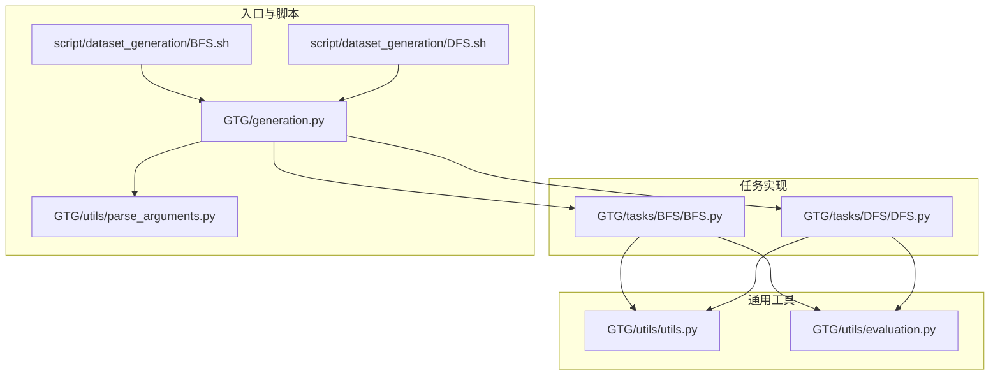
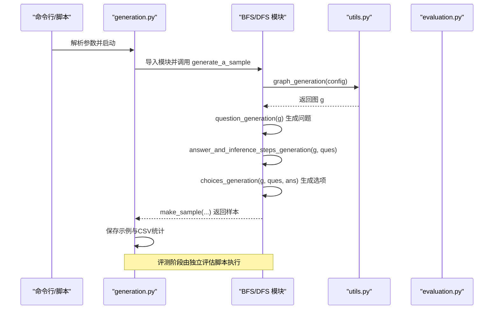
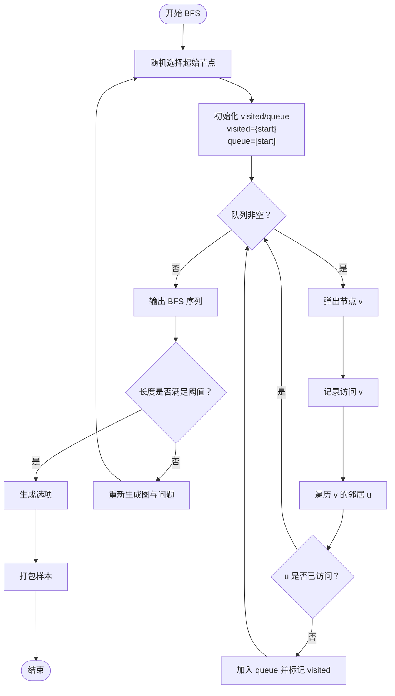
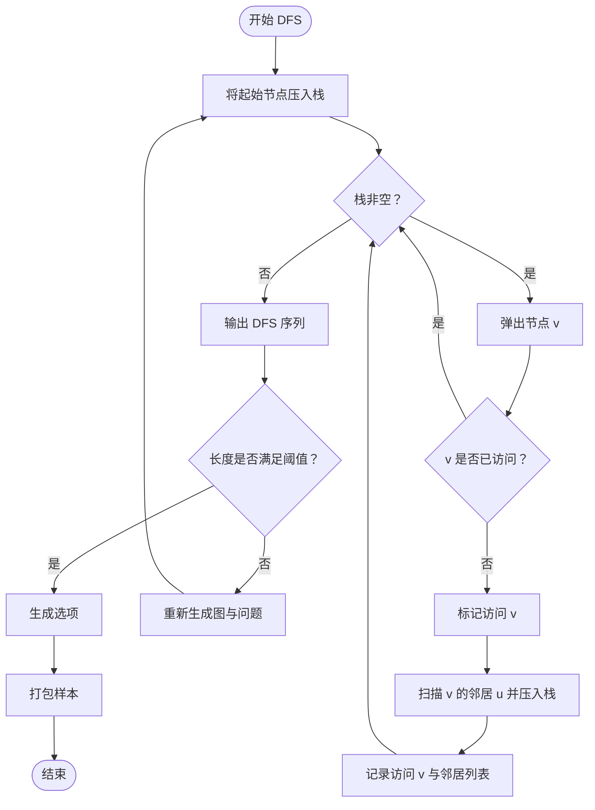
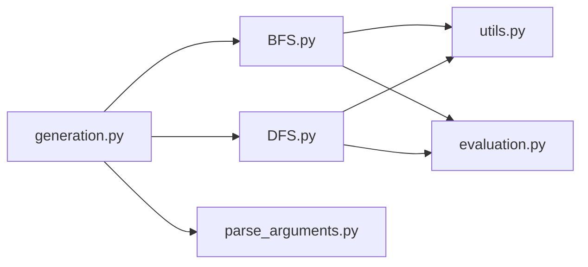

# 遍历算法

<cite>
**本文引用的文件**
- [BFS.py](file://GTG/tasks/BFS/BFS.py)
- [DFS.py](file://GTG/tasks/DFS/DFS.py)
- [generation.py](file://GTG/generation.py)
- [utils.py](file://GTG/utils/utils.py)
- [evaluation.py](file://GTG/utils/evaluation.py)
- [BFS.sh](file://script/dataset_generation/BFS.sh)
- [DFS.sh](file://script/dataset_generation/DFS.sh)
- [parse_arguments.py](file://GTG/utils/parse_arguments.py)
</cite>

## 目录
1. [引言](#引言)
2. [项目结构](#项目结构)
3. [核心组件](#核心组件)
4. [架构总览](#架构总览)
5. [详细组件分析](#详细组件分析)
6. [依赖关系分析](#依赖关系分析)
7. [性能考量](#性能考量)
8. [故障排查指南](#故障排查指南)
9. [结论](#结论)
10. [附录](#附录)

## 引言
本文件聚焦于 GraphInstruct 中“广度优先搜索（BFS）”与“深度优先搜索（DFS）”两类图遍历任务的实现与应用。我们将从系统架构、数据流、处理逻辑、集成点、错误处理与性能特征等维度进行深入剖析，并结合代码路径说明如何生成不同图结构（树状、环状、稀疏/密集）的测试样本，对比两种遍历算法在输出推理步骤上的差异，最后给出实际调用示例与常见问题排查方法。

## 项目结构
- BFS 与 DFS 的具体实现位于 GTG/tasks/BFS 与 GTG/tasks/DFS 目录下，分别提供问题生成、答案与推理步骤生成、选择题构造、样本生成与评测器。
- 通用工具与图生成逻辑集中在 GTG/utils 下，包括节点 ID 格式化、图对象与字符串互转、随机图生成（GNP、BA、WS）、样本打包等。
- 数据集生成脚本位于 script/dataset_generation，通过命令行参数驱动 generation.py 完成大规模样本生成与导出。
- generation.py 负责解析参数、按任务选择模块、生成样本、保存 CSV 统计信息。

图表来源
- [generation.py](file://GTG/generation.py#L1-L107)
- [BFS.py](file://GTG/tasks/BFS/BFS.py#L1-L155)
- [DFS.py](file://GTG/tasks/DFS/DFS.py#L1-L141)
- [utils.py](file://GTG/utils/utils.py#L1-L120)
- [evaluation.py](file://GTG/utils/evaluation.py#L1-L120)
- [BFS.sh](file://script/dataset_generation/BFS.sh#L1-L36)
- [DFS.sh](file://script/dataset_generation/DFS.sh#L1-L36)

章节来源
- [generation.py](file://GTG/generation.py#L1-L107)
- [BFS.py](file://GTG/tasks/BFS/BFS.py#L1-L155)
- [DFS.py](file://GTG/tasks/DFS/DFS.py#L1-L141)
- [utils.py](file://GTG/utils/utils.py#L1-L120)
- [evaluation.py](file://GTG/utils/evaluation.py#L1-L120)
- [BFS.sh](file://script/dataset_generation/BFS.sh#L1-L36)
- [DFS.sh](file://script/dataset_generation/DFS.sh#L1-L36)

## 核心组件
- BFS 实现
  - 问题生成：随机选择起始节点，构造自然语言问题串。
  - 答案与推理步骤：使用队列实现 BFS，逐步记录访问顺序与未访问邻居，最终输出序列。
  - 选择题构造：基于正确答案生成若干错误选项，保证首节点一致。
  - 样本生成：循环直到满足长度阈值后打包样本。
  - 评测器：对输出序列进行正确性校验，要求首节点一致且按层次（最短路层）严格匹配。
- DFS 实现
  - 问题生成：与 BFS 类似，随机选择起始节点。
  - 答案与推理步骤：使用栈实现 DFS，记录访问顺序与当前节点邻居列表。
  - 选择题构造：同上策略。
  - 样本生成：循环直到满足长度阈值后打包样本。
  - 评测器：自定义 DFS 路径合法性检查，逐段验证是否沿边前进、是否重复访问、是否存在未访问可用邻居导致回溯。
- 通用工具
  - 图生成：支持随机图（GNP）、BA 小世界（Barabási–Albert）、WS 小世界等，自动剔除孤立点并重映射节点 ID。
  - 格式化：节点 ID 包裹格式化、邻接表/边列表/自然语言描述转换、图与字符串互转。
  - 样本打包：统一字段（任务名、图、问题、答案、步骤、选项、标签等）。
- 入口与脚本
  - generation.py：解析参数、按任务选择模块、生成样本并统计导出。
  - BFS.sh/DFS.sh：封装命令行参数，生成原始 CSV 并再处理为整数 ID 与字母 ID 版本。

章节来源
- [BFS.py](file://GTG/tasks/BFS/BFS.py#L1-L155)
- [DFS.py](file://GTG/tasks/DFS/DFS.py#L1-L141)
- [utils.py](file://GTG/utils/utils.py#L200-L350)
- [generation.py](file://GTG/generation.py#L1-L107)
- [BFS.sh](file://script/dataset_generation/BFS.sh#L1-L36)
- [DFS.sh](file://script/dataset_generation/DFS.sh#L1-L36)

## 架构总览
下面以序列图展示一次 BFS/DFS 样本生成与评测的关键流程。

图表来源
- [generation.py](file://GTG/generation.py#L1-L107)
- [BFS.py](file://GTG/tasks/BFS/BFS.py#L139-L155)
- [DFS.py](file://GTG/tasks/DFS/DFS.py#L125-L141)
- [utils.py](file://GTG/utils/utils.py#L313-L349)
- [evaluation.py](file://GTG/utils/evaluation.py#L114-L126)

## 详细组件分析

### BFS 组件分析
- 问题生成
  - 从节点集合中随机选择起始节点，构造自然语言问题字符串。
  - 参考路径：[question_generation](file://GTG/tasks/BFS/BFS.py#L13-L21)
- 答案与推理步骤生成
  - 使用队列维护待访问节点，使用集合记录已访问；每次弹出一个节点，将其邻居中未访问者加入队列并标记访问。
  - 过程中逐步输出“访问节点”与“未访问邻居”信息，形成可读的推理步骤。
  - 当遍历序列长度小于阈值时拒绝该样本并重新生成。
  - 参考路径：
    - [answer_and_inference_steps_generation](file://GTG/tasks/BFS/BFS.py#L24-L67)
    - [generate_a_sample](file://GTG/tasks/BFS/BFS.py#L139-L155)
- 选择题构造
  - 基于正确序列生成多个错误选项（打乱部分元素、截断拼接等），并随机排列选项顺序。
  - 参考路径：[choices_generation](file://GTG/tasks/BFS/BFS.py#L108-L137)
- 评测器
  - 首节点必须一致；随后按最短路距离分层，每层节点集合必须与输出序列中对应位置的集合完全一致。
  - 参考路径：[Evaluator.check_correctness](file://GTG/tasks/BFS/BFS.py#L157-L191)

图表来源
- [BFS.py](file://GTG/tasks/BFS/BFS.py#L24-L67)
- [BFS.py](file://GTG/tasks/BFS/BFS.py#L139-L155)

章节来源
- [BFS.py](file://GTG/tasks/BFS/BFS.py#L13-L155)
- [evaluation.py](file://GTG/utils/evaluation.py#L114-L126)

### DFS 组件分析
- 问题生成
  - 同 BFS，随机选择起始节点并构造问题字符串。
  - 参考路径：[question_generation](file://GTG/tasks/DFS/DFS.py#L12-L21)
- 答案与推理步骤生成
  - 使用栈实现 DFS，弹出未访问节点并将其所有邻居压入栈；记录访问顺序与邻居列表，形成推理步骤。
  - 长度不足时拒绝并重试。
  - 参考路径：
    - [answer_and_inference_steps_generation](file://GTG/tasks/DFS/DFS.py#L23-L57)
    - [generate_a_sample](file://GTG/tasks/DFS/DFS.py#L125-L141)
- 选择题构造
  - 与 BFS 相同策略。
  - 参考路径：[choices_generation](file://GTG/tasks/DFS/DFS.py#L94-L123)
- 评测器
  - 自定义 DFS 路径合法性检查：
    - 逐段提取子路径，判断是否沿边前进；
    - 若遇到重复访问节点则判定非法；
    - 若某节点无未访问邻居但仍有后续节点，则回溯查找其前驱是否存在可用未访问邻居；
    - 最终比较完整 DFS 子路径与从该起点运行 DFS 得到的完整序列是否一致。
  - 参考路径：
    - [Evaluator.check_correctness](file://GTG/tasks/DFS/DFS.py#L143-L165)
    - [check_dfs_path](file://GTG/tasks/DFS/DFS.py#L171-L186)
    - [get_dfs_subpath](file://GTG/tasks/DFS/DFS.py#L188-L215)
    - [dfs](file://GTG/tasks/DFS/DFS.py#L217-L229)

图表来源
- [DFS.py](file://GTG/tasks/DFS/DFS.py#L23-L57)
- [DFS.py](file://GTG/tasks/DFS/DFS.py#L125-L141)

章节来源
- [DFS.py](file://GTG/tasks/DFS/DFS.py#L12-L141)
- [evaluation.py](file://GTG/utils/evaluation.py#L114-L126)

### 两类遍历算法在输出推理步骤上的差异
- BFS 输出
  - 按层次推进，逐步列出当前节点与其未访问邻居，强调“先近后远”的层次特性。
  - 参考路径：[answer_and_inference_steps_generation(BFS)](file://GTG/tasks/BFS/BFS.py#L24-L67)
- DFS 输出
  - 沿一条分支尽可能深地探索，遇到死胡同才回溯，强调“深入优先”的路径特性。
  - 参考路径：[answer_and_inference_steps_generation(DFS)](file://GTG/tasks/DFS/DFS.py#L23-L57)

章节来源
- [BFS.py](file://GTG/tasks/BFS/BFS.py#L24-L67)
- [DFS.py](file://GTG/tasks/DFS/DFS.py#L23-L57)

## 依赖关系分析
- 模块耦合
  - BFS/DFS 模块依赖 utils 提供的图生成、节点 ID 格式化、图与字符串互转、样本打包等能力。
  - BFS/DFS 模块依赖 evaluation 的 NodeListEvaluator 作为评测基类。
  - generation.py 通过字典映射选择具体任务模块并统一生成与统计。
- 外部依赖
  - NetworkX 用于图对象创建与查询（如邻居、最短路径长度）。
  - NumPy 用于数组操作与随机打乱。
  - Pandas 用于统计导出。

图表来源
- [BFS.py](file://GTG/tasks/BFS/BFS.py#L1-L20)
- [DFS.py](file://GTG/tasks/DFS/DFS.py#L1-L10)
- [utils.py](file://GTG/utils/utils.py#L1-L40)
- [evaluation.py](file://GTG/utils/evaluation.py#L1-L40)
- [generation.py](file://GTG/generation.py#L29-L58)
- [parse_arguments.py](file://GTG/utils/parse_arguments.py#L1-L28)

章节来源
- [BFS.py](file://GTG/tasks/BFS/BFS.py#L1-L20)
- [DFS.py](file://GTG/tasks/DFS/DFS.py#L1-L10)
- [utils.py](file://GTG/utils/utils.py#L1-L40)
- [evaluation.py](file://GTG/utils/evaluation.py#L1-L40)
- [generation.py](file://GTG/generation.py#L29-L58)
- [parse_arguments.py](file://GTG/utils/parse_arguments.py#L1-L28)

## 性能考量
- 图生成
  - 随机图（GNP）与 BA/WS 小世界图均会剔除孤立点并重映射节点 ID，避免极端连通性导致评测失败。
  - 参考路径：[graph_generation](file://GTG/utils/utils.py#L313-L349)
- 遍历复杂度
  - BFS/DFS 均为 O(V+E)，其中 V 为节点数，E 为边数；在大规模图上注意内存与栈/队列容量。
- 样本筛选
  - BFS/DFS 对输出序列长度设置阈值，避免过短样本影响训练/评测稳定性。
  - 参考路径：[reject 判定（BFS/DFS）](file://GTG/tasks/BFS/BFS.py#L61-L67), [file://GTG/tasks/DFS/DFS.py#L50-L56)

[本节为一般性指导，不直接分析具体文件]

## 故障排查指南
- 遍历顺序错误
  - BFS：若输出首节点不一致或按层次集合不匹配，评测将失败。请确认问题字符串中的起始节点与输出首节点一致，并确保按最短路距离分层的节点集合完全一致。
    - 参考路径：[BFS 评测器](file://GTG/tasks/BFS/BFS.py#L157-L191)
  - DFS：若输出序列违反“沿边前进、不重复访问、回溯时存在可用未访问邻居”的规则，将被判定为错误。请检查每一步是否沿边移动、是否出现重复访问、是否在无可用邻居时正确回溯。
    - 参考路径：[DFS 评测器与辅助函数](file://GTG/tasks/DFS/DFS.py#L143-L229)
- 节点遗漏
  - BFS/DFS 均基于队列/栈完整遍历，若出现遗漏，通常与图生成阶段剔除孤立点或节点 ID 映射有关。请检查图是否连通、节点 ID 是否正确映射。
    - 参考路径：[graph_generation](file://GTG/utils/utils.py#L313-L349)
- 输出格式问题
  - 评测依赖 NodeListEvaluator 的解析器，确保输出为合法节点列表格式。若解析失败，评测将返回错误。
    - 参考路径：[NodeListEvaluator](file://GTG/utils/evaluation.py#L114-L126)

章节来源
- [BFS.py](file://GTG/tasks/BFS/BFS.py#L157-L191)
- [DFS.py](file://GTG/tasks/DFS/DFS.py#L143-L229)
- [utils.py](file://GTG/utils/utils.py#L313-L349)
- [evaluation.py](file://GTG/utils/evaluation.py#L114-L126)

## 结论
BFS 与 DFS 在 GraphInstruct 中通过统一的任务接口与评测框架实现了可复用的图遍历样本生成。BFS 强调层次性与最短路层一致性，DFS 强调沿边前进与回溯合法性。两者均具备完善的样本筛选、推理步骤输出与选择题构造机制，并通过脚本化流程实现大规模数据集生成与导出。实践中应关注起始节点一致性、遍历顺序合法性与图连通性，以获得高质量的训练/评测样本。

[本节为总结性内容，不直接分析具体文件]

## 附录

### 如何生成不同图结构的测试样本
- 参数说明
  - 任务名称：BFS 或 DFS
  - 节点数量范围：通过 num_nodes_range 传入（字符串形式）
  - 样本数量：num_samples
  - 种子/哈希：seed 或 hash_str 用于固定随机性
  - 输出文件：file_output
- 生成流程
  - 使用脚本 BFS.sh/DFS.sh 设置数据根目录、节点范围、样本数与标签，内部调用 generation.py 完成生成。
  - generation.py 解析参数后，按任务导入对应模块，调用 generate_a_sample 生成样本并导出 CSV。
  - 参考路径：
    - [BFS.sh](file://script/dataset_generation/BFS.sh#L1-L36)
    - [DFS.sh](file://script/dataset_generation/DFS.sh#L1-L36)
    - [generation.py](file://GTG/generation.py#L1-L107)
    - [parse_arguments.py](file://GTG/utils/parse_arguments.py#L1-L28)
- 图结构策略
  - 随机图（GNP）：适合生成稀疏/中等密度图。
  - Barabási–Albert（BA）：生成幂律度分布，适合模拟真实网络的稠密区域。
  - Watts–Strogatz（WS）：在规则环基础上引入重连，生成小世界特性，适合环状/近环状结构。
  - 参考路径：[graph_generation](file://GTG/utils/utils.py#L313-L349)

章节来源
- [BFS.sh](file://script/dataset_generation/BFS.sh#L1-L36)
- [DFS.sh](file://script/dataset_generation/DFS.sh#L1-L36)
- [generation.py](file://GTG/generation.py#L1-L107)
- [parse_arguments.py](file://GTG/utils/parse_arguments.py#L1-L28)
- [utils.py](file://GTG/utils/utils.py#L313-L349)