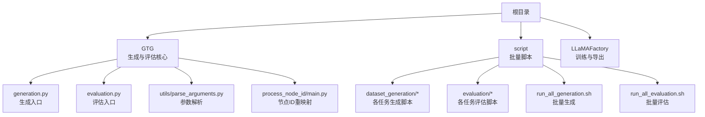
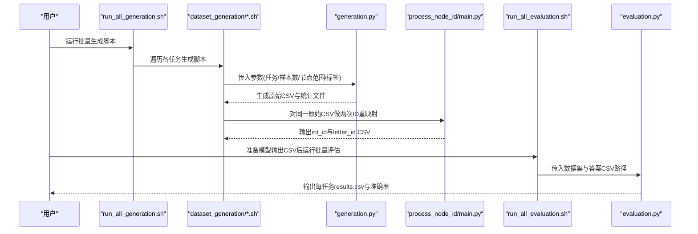
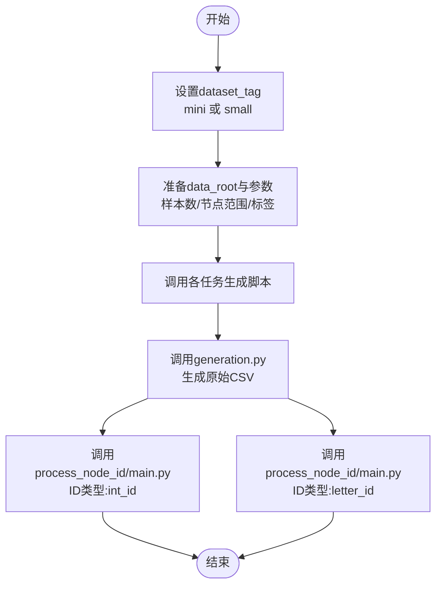
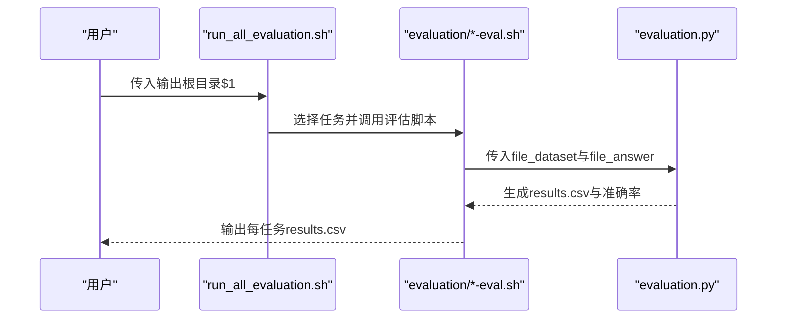
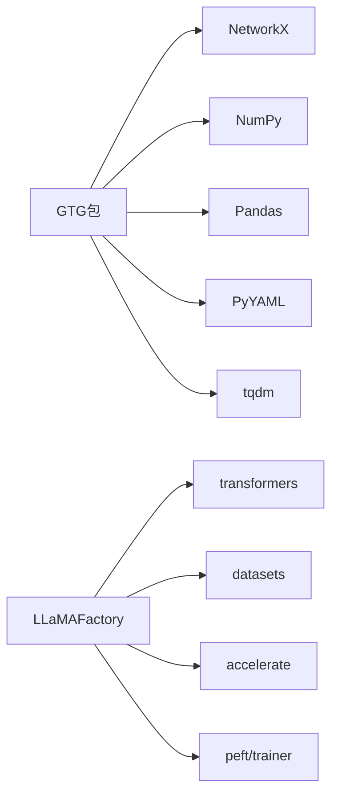

# 快速入门

<cite>
**本文引用的文件**
- [README.md](file://README.md)
- [setup.py](file://setup.py)
- [script/run_all_generation.sh](file://script/run_all_generation.sh)
- [script/run_all_evaluation.sh](file://script/run_all_evaluation.sh)
- [script/dataset_generation/shortest_path.sh](file://script/dataset_generation/shortest_path.sh)
- [script/evaluation/shortest_path-eval.sh](file://script/evaluation/shortest_path-eval.sh)
- [GTG/generation.py](file://GTG/generation.py)
- [GTG/evaluation.py](file://GTG/evaluation.py)
- [GTG/utils/parse_arguments.py](file://GTG/utils/parse_arguments.py)
- [GTG/process_node_id/main.py](file://GTG/process_node_id/main.py)
- [LLaMAFactory/requirements.txt](file://LLaMAFactory/requirements.txt)
- [LLaMAFactory/run.sh](file://LLaMAFactory/run.sh)
</cite>

## 目录
1. [简介](#简介)
2. [项目结构](#项目结构)
3. [核心组件](#核心组件)
4. [架构总览](#架构总览)
5. [详细组件分析](#详细组件分析)
6. [依赖关系分析](#依赖关系分析)
7. [性能与资源建议](#性能与资源建议)
8. [故障排查指南](#故障排查指南)
9. [结论](#结论)
10. [附录：命令与参数速查](#附录命令与参数速查)

## 简介
本指南面向首次使用者，帮助你在本地快速搭建环境、生成数据集、执行评估，并获得CSV格式的结果报告。你将学会：
- 如何安装必要的Python包与依赖
- 如何通过脚本一键生成多类图算法任务的数据集
- 如何准备模型输出的CSV并进行评估
- 关键命令行参数与输出目录结构说明

## 项目结构
该仓库包含三部分关键内容：
- GTG：数据生成与评估的核心逻辑，提供统一的生成器与评估器入口
- script：Shell脚本集合，用于批量生成与评估
- LLaMAFactory：基于LLaMA-Factory的训练与导出脚本（可选）

图表来源
- [README.md](file://README.md#L1-L90)
- [script/run_all_generation.sh](file://script/run_all_generation.sh#L1-L72)
- [script/run_all_evaluation.sh](file://script/run_all_evaluation.sh#L1-L32)
- [GTG/generation.py](file://GTG/generation.py#L1-L107)
- [GTG/evaluation.py](file://GTG/evaluation.py#L1-L73)
- [GTG/utils/parse_arguments.py](file://GTG/utils/parse_arguments.py#L1-L28)
- [GTG/process_node_id/main.py](file://GTG/process_node_id/main.py#L1-L58)

章节来源
- [README.md](file://README.md#L1-L90)

## 核心组件
- 数据生成入口：通过命令行参数选择任务、样本数量、节点规模范围等，生成CSV与统计描述文件
- 节点ID重映射：将生成的图数据中的节点ID转换为整数或字母形式，便于不同下游处理
- 评估入口：读取模型输出CSV与原始数据，逐条评测并输出准确率与完整结果CSV

章节来源
- [GTG/generation.py](file://GTG/generation.py#L1-L107)
- [GTG/evaluation.py](file://GTG/evaluation.py#L1-L73)
- [GTG/utils/parse_arguments.py](file://GTG/utils/parse_arguments.py#L1-L28)
- [GTG/process_node_id/main.py](file://GTG/process_node_id/main.py#L1-L58)

## 架构总览
下图展示了从“生成脚本”到“生成数据”再到“评估脚本”的端到端流程。

图表来源
- [script/run_all_generation.sh](file://script/run_all_generation.sh#L1-L72)
- [script/dataset_generation/shortest_path.sh](file://script/dataset_generation/shortest_path.sh#L1-L36)
- [GTG/generation.py](file://GTG/generation.py#L1-L107)
- [GTG/process_node_id/main.py](file://GTG/process_node_id/main.py#L1-L58)
- [script/run_all_evaluation.sh](file://script/run_all_evaluation.sh#L1-L32)
- [script/evaluation/shortest_path-eval.sh](file://script/evaluation/shortest_path-eval.sh#L1-L14)
- [GTG/evaluation.py](file://GTG/evaluation.py#L1-L73)

## 详细组件分析

### 生成脚本与流程
- 批量生成脚本会按顺序调用各任务的生成脚本，支持两个数据集标签：mini与small
- 每个任务生成脚本会先调用生成入口，再对同一份原始CSV分别做整数ID与字母ID的重映射
- 生成入口会根据任务模块生成样本，保存为CSV，并生成统计描述文件

图表来源
- [script/run_all_generation.sh](file://script/run_all_generation.sh#L1-L72)
- [script/dataset_generation/shortest_path.sh](file://script/dataset_generation/shortest_path.sh#L1-L36)
- [GTG/generation.py](file://GTG/generation.py#L1-L107)
- [GTG/process_node_id/main.py](file://GTG/process_node_id/main.py#L1-L58)

章节来源
- [script/run_all_generation.sh](file://script/run_all_generation.sh#L1-L72)
- [script/dataset_generation/shortest_path.sh](file://script/dataset_generation/shortest_path.sh#L1-L36)
- [GTG/generation.py](file://GTG/generation.py#L1-L107)
- [GTG/process_node_id/main.py](file://GTG/process_node_id/main.py#L1-L58)

### 评估脚本与流程
- 批量评估脚本默认注释掉大部分任务，你可以按需取消注释以评估特定任务
- 评估脚本会读取int_id数据集与模型输出CSV，合并后逐条评测，输出准确率与完整结果CSV

图表来源
- [script/run_all_evaluation.sh](file://script/run_all_evaluation.sh#L1-L32)
- [script/evaluation/shortest_path-eval.sh](file://script/evaluation/shortest_path-eval.sh#L1-L14)
- [GTG/evaluation.py](file://GTG/evaluation.py#L1-L73)

章节来源
- [script/run_all_evaluation.sh](file://script/run_all_evaluation.sh#L1-L32)
- [script/evaluation/shortest_path-eval.sh](file://script/evaluation/shortest_path-eval.sh#L1-L14)
- [GTG/evaluation.py](file://GTG/evaluation.py#L1-L73)

### 参数与命令行接口
- 通用参数（由参数解析模块提供）
  - --task：任务名称
  - --file_input/--file_output：输入/输出CSV路径
  - --file_dataset/--file_answer/--file_result：评估时的数据集、答案与结果路径
  - --seed/--hash_str：随机种子或哈希字符串
  - --num_nodes_range：节点数量范围（字符串形式，如"(5,7)"）
  - --link_prob：边概率
  - --num_samples：样本数量

- 生成入口（generation.py）会根据任务名加载对应模块并生成样本，最终输出CSV与统计文件
- 评估入口（evaluation.py）会根据任务名加载对应Evaluator，读取答案与数据，输出准确率与完整结果

章节来源
- [GTG/utils/parse_arguments.py](file://GTG/utils/parse_arguments.py#L1-L28)
- [GTG/generation.py](file://GTG/generation.py#L1-L107)
- [GTG/evaluation.py](file://GTG/evaluation.py#L1-L73)

## 依赖关系分析
- Python包依赖：GTG包安装时需要NetworkX、NumPy、Pandas、PyYAML、tqdm等
- 训练与推理：LLaMAFactory提供训练与导出脚本，训练前需调整实验配置文件

图表来源
- [setup.py](file://setup.py#L1-L26)
- [LLaMAFactory/requirements.txt](file://LLaMAFactory/requirements.txt#L1-L28)

章节来源
- [setup.py](file://setup.py#L1-L26)
- [LLaMAFactory/requirements.txt](file://LLaMAFactory/requirements.txt#L1-L28)

## 性能与资源建议
- 生成阶段：样本量较大时，建议在多核CPU上运行；若使用虚拟环境，请提前激活
- 评估阶段：CSV合并与逐条评测可能较慢，建议控制样本规模或分批评估
- 训练阶段：LLaMAFactory默认使用多GPU，确保显存充足；如显存不足，可调整训练配置

[本节为通用建议，不直接分析具体文件]

## 故障排查指南
- 安装失败
  - 确认已在GTG目录下执行安装命令
  - 若网络受限，可使用国内镜像源
- 路径错误
  - 修改批量脚本中的project_root为你的实际路径
  - 确保data_root存在且有写权限
- 未找到任务模块
  - 确认--task参数与任务模块名称一致
  - 检查任务是否在生成入口的任务映射中注册
- 评估CSV格式不符
  - 答案CSV必须包含两列：id与output
  - 确保id为整数，output为字符串
- 评估结果为空
  - 检查file_dataset与file_answer路径是否正确
  - 确认两者中的id字段匹配

章节来源
- [README.md](file://README.md#L1-L90)
- [GTG/evaluation.py](file://GTG/evaluation.py#L1-L73)

## 结论
通过本指南，你已掌握：
- 在本地安装GTG包与必要依赖
- 使用run_all_generation.sh一键生成多任务数据集
- 使用run_all_evaluation.sh评估模型输出并获得CSV结果
- 理解关键命令行参数与输出目录结构

下一步建议：
- 先运行一次mini标签的小规模生成与评估，验证流程
- 再切换到small标签进行更大规模测试
- 如需训练模型，参考LLaMAFactory的训练与导出脚本

[本节为总结性内容，不直接分析具体文件]

## 附录：命令与参数速查

- 安装GTG包
  - 在GTG目录下执行安装命令
  - 参考：[README.md](file://README.md#L1-L90)，[setup.py](file://setup.py#L1-L26)

- 生成数据集
  - 修改批量生成脚本中的project_root与dataset_tag
  - 运行：bash script/run_all_generation.sh
  - 单任务示例：bash script/dataset_generation/shortest_path.sh data_root num_nodes_range num_samples dataset_tag
  - 参考：[script/run_all_generation.sh](file://script/run_all_generation.sh#L1-L72)，[script/dataset_generation/shortest_path.sh](file://script/dataset_generation/shortest_path.sh#L1-L36)，[GTG/generation.py](file://GTG/generation.py#L1-L107)

- 评估模型输出
  - 准备CSV：包含id与output两列
  - 运行：bash script/run_all_evaluation.sh output_root
  - 单任务示例：bash script/evaluation/shortest_path-eval.sh data_root output_root
  - 参考：[script/run_all_evaluation.sh](file://script/run_all_evaluation.sh#L1-L32)，[script/evaluation/shortest_path-eval.sh](file://script/evaluation/shortest_path-eval.sh#L1-L14)，[GTG/evaluation.py](file://GTG/evaluation.py#L1-L73)

- 关键参数
  - --task：任务名称
  - --num_samples：样本数量
  - --num_nodes_range：节点范围（字符串形式，如"(5,7)"）
  - --hash_str：用于确定随机种子的字符串
  - --file_dataset/--file_answer/--file_result：评估相关路径
  - 参考：[GTG/utils/parse_arguments.py](file://GTG/utils/parse_arguments.py#L1-L28)

- 输出目录结构（示例）
  - data_root/任务名/任务名.csv（原始CSV）
  - data_root/任务名/任务名-int_id.csv（整数ID）
  - data_root/任务名/任务名-letter_id.csv（字母ID）
  - output_root/任务名-results.csv（评估结果）
  - 参考：[script/dataset_generation/shortest_path.sh](file://script/dataset_generation/shortest_path.sh#L1-L36)，[script/evaluation/shortest_path-eval.sh](file://script/evaluation/shortest_path-eval.sh#L1-L14)

- 训练与导出（可选）
  - 进入LLaMAFactory目录，修改实验配置后运行训练与导出脚本
  - 参考：[LLaMAFactory/run.sh](file://LLaMAFactory/run.sh#L1-L4)，[README.md](file://README.md#L1-L90)，[LLaMAFactory/requirements.txt](file://LLaMAFactory/requirements.txt#L1-L28)