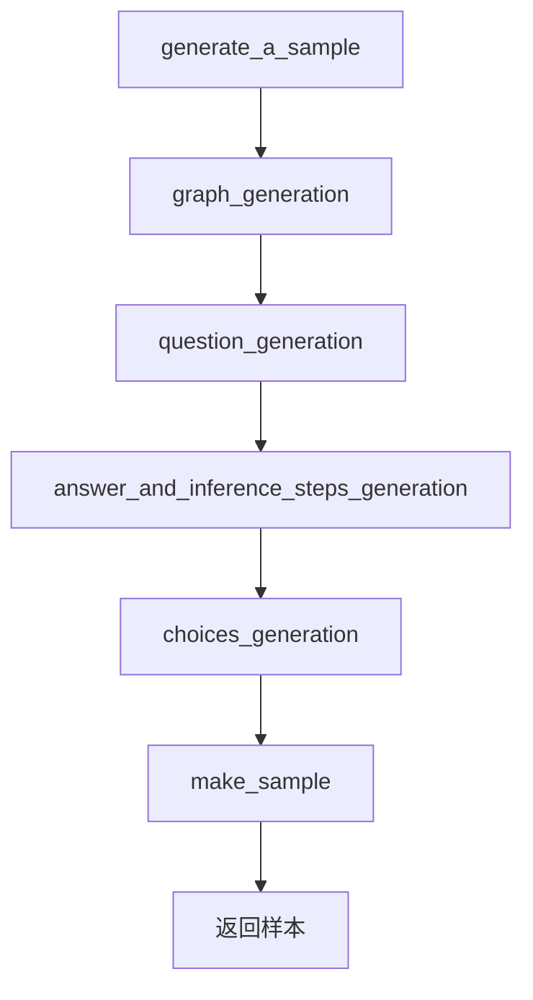
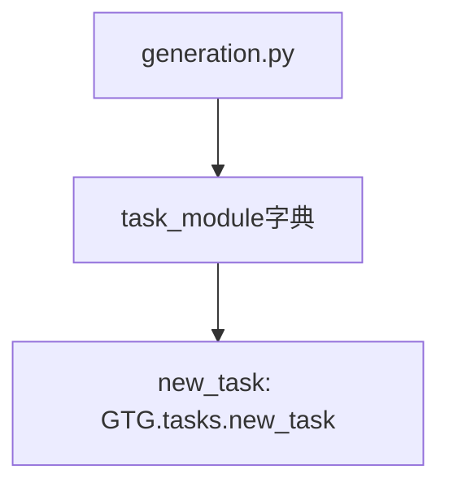
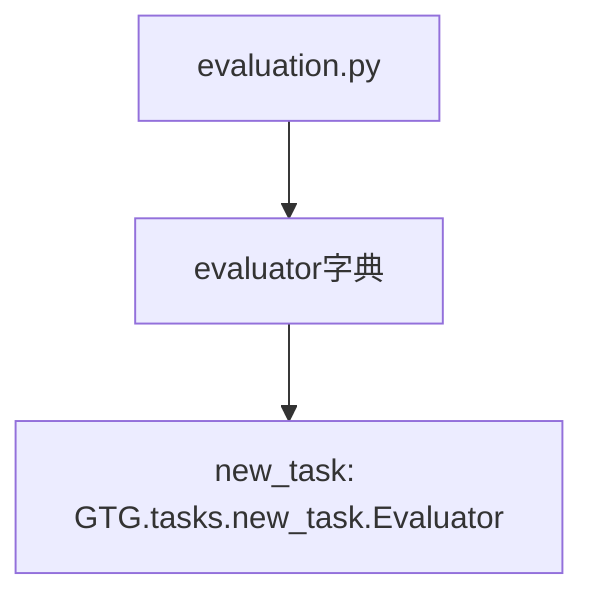
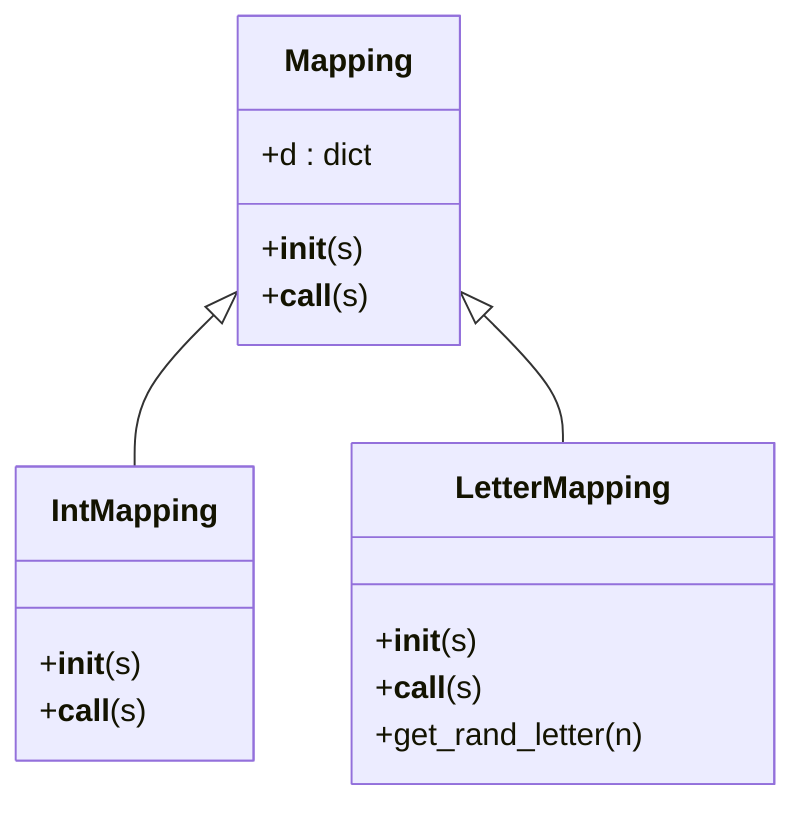
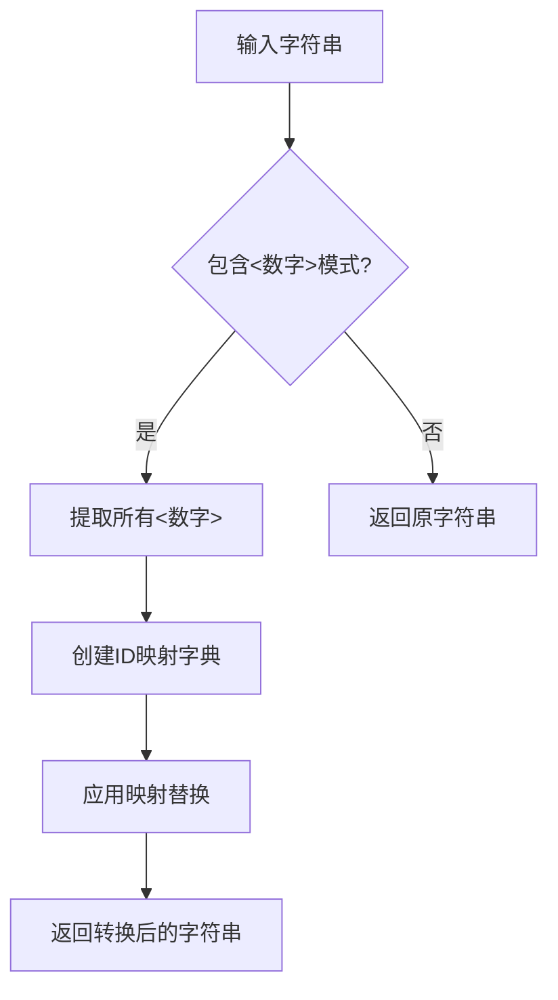
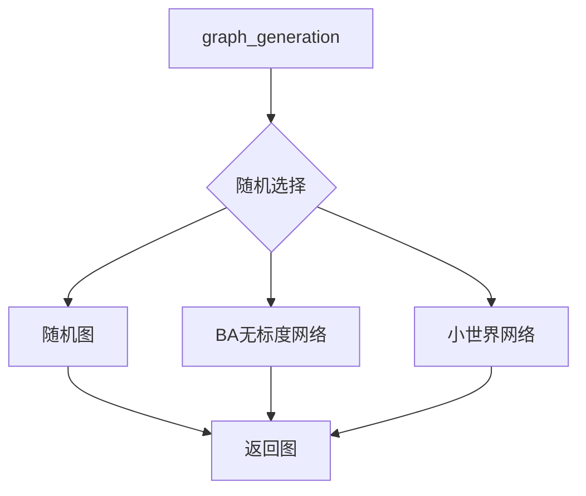
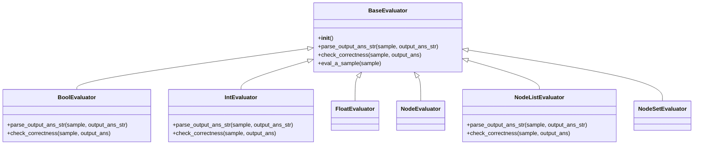

# 扩展开发

<cite>
**本文档中引用的文件**  
- [tasks/__init__.py](file://GTG/tasks/__init__.py)
- [process_node_id/__init__.py](file://GTG/process_node_id/__init__.py)
- [utils/evaluation.py](file://GTG/utils/evaluation.py)
- [generation.py](file://GTG/generation.py)
- [evaluation.py](file://GTG/evaluation.py)
- [tasks/BFS/BFS.py](file://GTG/tasks/BFS/BFS.py)
- [tasks/DFS/DFS.py](file://GTG/tasks/DFS/DFS.py)
- [tasks/MST/MST.py](file://GTG/tasks/MST/MST.py)
- [tasks/topological_sort/topological_sort.py](file://GTG/tasks/topological_sort/topological_sort.py)
- [process_node_id/int_id.py](file://GTG/process_node_id/int_id.py)
- [process_node_id/letter_id.py](file://GTG/process_node_id/letter_id.py)
- [utils/parse_output.py](file://GTG/utils/parse_output.py)
- [utils/utils.py](file://GTG/utils/utils.py)
</cite>

## 目录
1. [添加新的图论任务](#添加新的图论任务)
2. [扩展节点ID处理模块](#扩展节点id处理模块)
3. [自定义图生成策略和问题模板](#自定义图生成策略和问题模板)
4. [扩展评估器](#扩展评估器)
5. [最佳实践与常见陷阱](#最佳实践与常见陷阱)

## 添加新的图论任务

在GraphInstruct框架中添加一个新的图论任务需要遵循特定的目录结构和代码模式。每个任务都位于`GTG/tasks/`目录下的独立子目录中，包含实现算法逻辑的Python文件和初始化文件。

### 创建任务目录结构

要添加一个新任务，首先在`GTG/tasks/`目录下创建一个新的子目录，目录名称应为任务的名称（例如`new_task`）。该目录应包含两个文件：
- `new_task.py`：实现任务的核心逻辑
- `__init__.py`：用于模块导入

```bash
GTG/tasks/new_task/
├── new_task.py
└── __init__.py
```

### 实现算法逻辑

新任务的实现文件（如`new_task.py`）需要遵循标准的代码结构，包含以下关键组件：

1. **TASK_NAME常量**：定义任务的名称
2. **question_generation函数**：生成问题描述
3. **answer_and_inference_steps_generation函数**：生成答案和推理步骤
4. **generate_a_sample函数**：生成完整的样本数据
5. **Evaluator类**：用于评估模型输出的正确性

从现有任务（如BFS、DFS）可以看出，所有任务都遵循相似的模式。例如，在BFS任务中，`generate_a_sample`函数负责协调图生成、问题生成、答案生成和样本构建的整个流程。



**代码路径**
- [tasks/BFS/BFS.py](file://GTG/tasks/BFS/BFS.py#L139-L154)
- [tasks/DFS/DFS.py](file://GTG/tasks/DFS/DFS.py#L125-L140)

### 编写__init__.py文件

任务目录中的`__init__.py`文件需要将任务模块导入，以便在主程序中使用。该文件通常只包含一行导入语句：

```python
from . import new_task
```

这种模式在所有现有任务中都是一致的，确保了模块的正确导入和使用。

### 注册任务

新任务需要在系统的两个关键位置进行注册：

1. **生成模块注册**：在`GTG/generation.py`文件中，`main`函数的`task_module`字典需要添加新任务的映射。



2. **评估模块注册**：在`GTG/evaluation.py`文件中，`evaluator`字典需要添加新任务的评估器映射。



此外，还需要在`GTG/tasks/__init__.py`文件中添加相应的导入语句，确保任务模块被正确加载。

```python
from . import new_task
```

**代码路径**
- [generation.py](file://GTG/generation.py#L29-L57)
- [evaluation.py](file://GTG/evaluation.py#L14-L36)
- [tasks/__init__.py](file://GTG/tasks/__init__.py)

## 扩展节点ID处理模块

GraphInstruct框架支持不同的节点ID格式，通过`process_node_id`模块实现。该模块允许将标准的数字节点ID转换为其他格式，如字母ID。

### 现有ID处理模式

当前系统实现了两种ID处理方式：
- `int_id.py`：保持整数ID格式
- `letter_id.py`：将整数ID映射为随机字母组合

两种实现都遵循相同的接口模式，通过`Mapping`类的`__call__`方法实现ID转换。



**代码路径**
- [process_node_id/int_id.py](file://GTG/process_node_id/int_id.py)
- [process_node_id/letter_id.py](file://GTG/process_node_id/letter_id.py)

### 添加新的标识格式

要支持新的节点ID格式，需要在`GTG/process_node_id/`目录下创建新的处理模块。新模块应遵循以下步骤：

1. **创建新的处理文件**：如`custom_id.py`，实现`Mapping`类。

2. **实现Mapping类**：该类需要包含`__init__`和`__call__`方法。`__init__`方法解析输入字符串中的节点ID模式，`__call__`方法执行实际的ID替换。

3. **注册新格式**：在`GTG/process_node_id/__init__.py`文件中添加导入语句。

```python
from . import custom_id
```

4. **更新主处理模块**：确保`GTG/process_node_id/main.py`能够识别新的ID类型。

新ID格式的实现可以基于现有模式进行扩展。例如，可以创建一个`hex_id.py`模块，将节点ID转换为十六进制格式，或创建`word_id.py`模块，将ID映射为单词。



**代码路径**
- [process_node_id/__init__.py](file://GTG/process_node_id/__init__.py)
- [utils/parse_output.py](file://GTG/utils/parse_output.py#L56-L62)

## 自定义图生成策略和修改问题模板

GraphInstruct框架提供了灵活的图生成和问题模板机制，允许开发者自定义图的生成策略和问题的表述方式。

### 图生成策略

系统提供了多种图生成算法，位于`GTG/utils/utils.py`文件中，包括：
- `generate_random_graph`：随机图生成
- `generate_barabasi_albert_graph`：BA无标度网络生成
- `generate_watts_strogatz_graph`：小世界网络生成
- `generate_random_directed_acyclic_graph`：随机有向无环图生成

这些生成器可以通过`graph_generation`函数统一调用，该函数根据配置参数随机选择一种生成策略。



要自定义图生成策略，可以：
1. 在`utils/utils.py`中添加新的生成函数
2. 在`graph_generation`函数中添加新的选择分支
3. 确保新生成器返回符合要求的NetworkX图对象

### 修改问题模板

每个任务的问题模板在`question_generation`函数中定义。该函数接收图对象作为输入，返回问题描述字符串。

从现有任务可以看出，问题模板通常包含：
- 任务的具体要求
- 节点ID的格式化输出（使用`NID`函数）
- 清晰的指令说明

例如，BFS任务的问题模板为："Start from node {}, output a sequence of traversal in breadth-first search (BFS) order."

要修改问题模板，可以直接编辑任务文件中的`question_generation`函数，或创建新的变体函数。可以利用`NID`函数确保节点ID的正确格式化。

```python
def question_generation(config, g):
    v = random.randint(0, g.number_of_nodes() - 1)
    ques = {'start': v}
    ques_str = "从节点{}开始，输出广度优先搜索(BFS)的遍历序列。".format(NID(ques['start']))
    return ques, ques_str
```

这种修改可以用于创建多语言版本、不同难度级别或特定应用场景的问题模板。

**代码路径**
- [utils/utils.py](file://GTG/utils/utils.py#L224-L348)
- [tasks/BFS/BFS.py](file://GTG/tasks/BFS/BFS.py#L13-L21)

## 扩展评估器

评估器是GraphInstruct框架中用于判断模型输出正确性的关键组件。系统通过`utils/evaluation.py`文件中的评估类层次结构来实现不同类型的评估。

### 评估器架构

系统定义了一个基础评估器`BaseEvaluator`和多个具体评估器，如`BoolEvaluator`、`IntEvaluator`、`FloatEvaluator`和`NodeListEvaluator`。这些评估器遵循模板方法模式，`eval_a_sample`方法定义了评估的通用流程，而`parse_output_ans_str`和`check_correctness`方法由子类具体实现。



**代码路径**
- [utils/evaluation.py](file://GTG/utils/evaluation.py)

### 为新任务类型扩展评估器

要支持新的任务类型，需要创建相应的评估器类。步骤如下：

1. **选择合适的基类**：根据任务的输出类型选择最合适的基类。例如，如果新任务输出布尔值，则继承`BoolEvaluator`；如果输出节点列表，则继承`NodeListEvaluator`。

2. **实现check_correctness方法**：这是评估器的核心，需要根据任务的具体要求实现正确的性检查逻辑。

3. **注册评估器**：在任务模块中定义`Evaluator`类，并在`GTG/evaluation.py`的`evaluator`字典中注册。

例如，对于一个新的图匹配任务，可以创建如下评估器：

```python
class Evaluator(NodeListEvaluator):
    def __init__(self):
        super().__init__()
    
    def check_correctness(self, sample, output_ans):
        g = edge_list_str_to_graph(sample['graph'], directed=sample['directed'])
        # 实现具体的匹配正确性检查逻辑
        # 返回1表示正确，0表示错误
        return check_matching_correctness(g, output_ans)
```

评估器的`check_correctness`方法通常需要：
- 解析图结构
- 验证输出是否符合图论算法的正确性条件
- 处理边界情况和特殊情况

**代码路径**
- [tasks/BFS/BFS.py](file://GTG/tasks/BFS/BFS.py#L157-L191)
- [tasks/MST/MST.py](file://GTG/tasks/MST/MST.py#L263-L267)

## 最佳实践与常见陷阱

在扩展GraphInstruct功能时，遵循最佳实践可以提高代码质量和系统稳定性，同时避免常见陷阱。

### 最佳实践

1. **遵循现有代码模式**：新添加的任务和模块应尽量遵循现有代码的结构和命名约定，确保代码风格的一致性。

2. **模块化设计**：将功能分解为独立的函数和类，每个函数只负责单一职责，提高代码的可维护性和可测试性。

3. **充分的错误处理**：在关键函数中添加适当的错误检查和异常处理，确保系统在异常情况下能够优雅地处理。

4. **文档注释**：为新添加的函数和类添加详细的文档字符串，说明其功能、参数和返回值。

5. **测试验证**：在添加新功能后，运行相关的生成和评估脚本，验证新功能的正确性。

### 常见陷阱与规避方法

1. **任务注册遗漏**：忘记在`generation.py`或`evaluation.py`中注册新任务。解决方法是仔细检查两个文件中的字典映射，确保新任务被正确添加。

2. **ID格式化错误**：在输出节点ID时未使用`NID`函数，导致格式不一致。解决方法是在所有涉及节点ID输出的地方使用`NID`函数。

3. **图生成条件不满足**：某些算法对输入图有特定要求（如MST要求连通图），但生成的图可能不满足这些条件。解决方法是在生成样本时添加适当的检查和重试机制。

4. **评估逻辑不完整**：评估器未能覆盖所有可能的错误情况。解决方法是仔细分析算法的正确性条件，并在评估器中全面实现这些检查。

5. **性能问题**：复杂的图算法可能导致样本生成速度变慢。解决方法是优化算法实现，或在必要时添加超时机制。

通过遵循这些最佳实践并注意常见陷阱，可以有效地扩展GraphInstruct的功能，同时保持系统的稳定性和可靠性。

**代码路径**
- [utils/utils.py](file://GTG/utils/utils.py#L337-L348)
- [tasks/MST/MST.py](file://GTG/tasks/MST/MST.py#L22-L30)