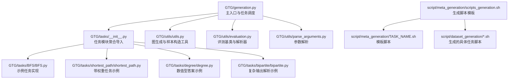
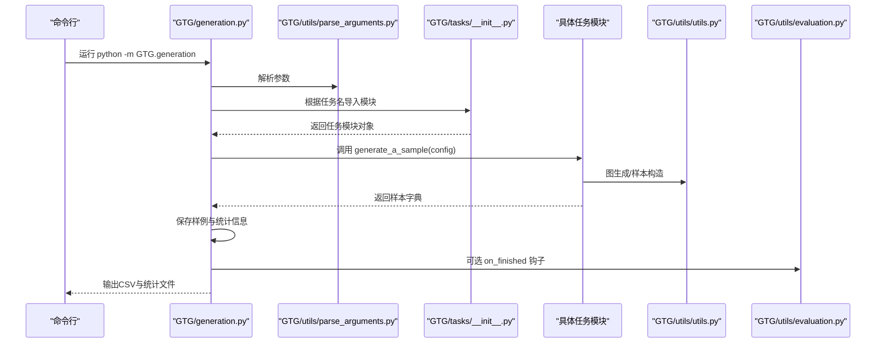
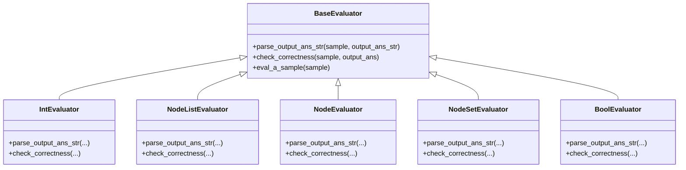
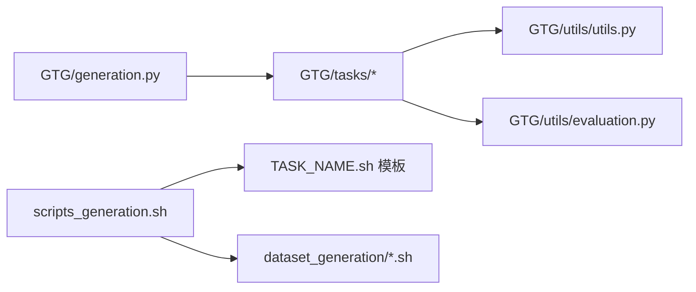

# 新任务添加指南

<cite>
**本文引用的文件列表**
- [GTG/tasks/__init__.py](file://GTG/tasks/__init__.py)
- [GTG/generation.py](file://GTG/generation.py)
- [GTG/utils/utils.py](file://GTG/utils/utils.py)
- [GTG/utils/evaluation.py](file://GTG/utils/evaluation.py)
- [GTG/utils/parse_arguments.py](file://GTG/utils/parse_arguments.py)
- [GTG/tasks/BFS/__init__.py](file://GTG/tasks/BFS/__init__.py)
- [GTG/tasks/BFS/BFS.py](file://GTG/tasks/BFS/BFS.py)
- [GTG/tasks/shortest_path/shortest_path.py](file://GTG/tasks/shortest_path/shortest_path.py)
- [GTG/tasks/degree/degree.py](file://GTG/tasks/degree/degree.py)
- [GTG/tasks/bipartite/bipartite.py](file://GTG/tasks/bipartite/bipartite.py)
- [script/meta_generation/scripts_generation.sh](file://script/meta_generation/scripts_generation.sh)
- [script/meta_generation/TASK_NAME.sh](file://script/meta_generation/TASK_NAME.sh)
- [script/dataset_generation/BFS.sh](file://script/dataset_generation/BFS.sh)
- [script/dataset_generation/shortest_path.sh](file://script/dataset_generation/shortest_path.sh)
</cite>

## 目录
1. [简介](#简介)
2. [项目结构](#项目结构)
3. [核心组件](#核心组件)
4. [架构总览](#架构总览)
5. [详细组件分析](#详细组件分析)
6. [依赖关系分析](#依赖关系分析)
7. [性能与可扩展性](#性能与可扩展性)
8. [故障排查指南](#故障排查指南)
9. [结论](#结论)
10. [附录：从零添加“graph_coloring”的完整示例](#附录从零添加graph_coloring的完整示例)

## 简介
本指南面向开发者，提供在 GTG/tasks/ 目录下添加新图论任务的完整流程与最佳实践。内容涵盖：
- 任务子目录命名规范与结构要求
- 实现任务核心逻辑（继承基类、重写关键方法、处理图输入、生成问题-答案对）
- 正确注册模块（编写 __init__.py 并在 GTG/tasks/__init__.py 中导入）
- 使用脚本生成机制（scripts_generation.sh）自动生成数据生成脚本
- 完整示例：从零添加“graph_coloring”任务（含代码结构、接口定义、测试验证步骤）
- 常见错误排查（模块导入失败、接口不匹配等）

## 项目结构
GTG 采用“按任务功能分层”的组织方式，核心入口位于 GTG/generation.py，任务模块位于 GTG/tasks/ 下的子目录，每个子目录包含任务实现与导出接口；脚本生成器位于 script/meta_generation/，用于批量生成数据生成脚本。

图表来源
- [GTG/generation.py](file://GTG/generation.py#L1-L107)
- [GTG/tasks/__init__.py](file://GTG/tasks/__init__.py#L1-L24)
- [GTG/tasks/BFS/BFS.py](file://GTG/tasks/BFS/BFS.py#L1-L212)
- [GTG/tasks/shortest_path/shortest_path.py](file://GTG/tasks/shortest_path/shortest_path.py#L1-L140)
- [GTG/tasks/degree/degree.py](file://GTG/tasks/degree/degree.py#L1-L110)
- [GTG/tasks/bipartite/bipartite.py](file://GTG/tasks/bipartite/bipartite.py#L1-L135)
- [GTG/utils/utils.py](file://GTG/utils/utils.py#L1-L617)
- [GTG/utils/evaluation.py](file://GTG/utils/evaluation.py#L1-L283)
- [GTG/utils/parse_arguments.py](file://GTG/utils/parse_arguments.py#L1-L28)
- [script/meta_generation/scripts_generation.sh](file://script/meta_generation/scripts_generation.sh#L1-L33)
- [script/meta_generation/TASK_NAME.sh](file://script/meta_generation/TASK_NAME.sh#L1-L36)

章节来源
- [GTG/generation.py](file://GTG/generation.py#L1-L107)
- [GTG/tasks/__init__.py](file://GTG/tasks/__init__.py#L1-L24)

## 核心组件
- 任务调度与入口
  - GTG/generation.py 负责解析参数、根据任务名选择对应模块、生成样本、统计与保存结果。
- 任务模块注册
  - GTG/tasks/__init__.py 将所有任务模块导入到包级命名空间，供 generation.py 动态选择。
- 工具与评测
  - GTG/utils/utils.py 提供图生成、样本构造、节点ID格式化、自然语言描述等通用能力。
  - GTG/utils/evaluation.py 提供评测基类与解析器，支持布尔、整数、浮点、节点列表、节点集合等评测类型。
- 参数解析
  - GTG/utils/parse_arguments.py 统一解析命令行参数，供 generation.py 使用。
- 脚本生成机制
  - script/meta_generation/scripts_generation.sh 批量生成 dataset_generation/*.sh，基于 script/meta_generation/TASK_NAME.sh 模板。

章节来源
- [GTG/generation.py](file://GTG/generation.py#L1-L107)
- [GTG/tasks/__init__.py](file://GTG/tasks/__init__.py#L1-L24)
- [GTG/utils/utils.py](file://GTG/utils/utils.py#L1-L617)
- [GTG/utils/evaluation.py](file://GTG/utils/evaluation.py#L1-L283)
- [GTG/utils/parse_arguments.py](file://GTG/utils/parse_arguments.py#L1-L28)
- [script/meta_generation/scripts_generation.sh](file://script/meta_generation/scripts_generation.sh#L1-L33)
- [script/meta_generation/TASK_NAME.sh](file://script/meta_generation/TASK_NAME.sh#L1-L36)

## 架构总览
下面的序列图展示了从命令行到任务模块执行再到样本生成与保存的整体流程。

图表来源
- [GTG/generation.py](file://GTG/generation.py#L1-L107)
- [GTG/utils/parse_arguments.py](file://GTG/utils/parse_arguments.py#L1-L28)
- [GTG/tasks/__init__.py](file://GTG/tasks/__init__.py#L1-L24)
- [GTG/utils/utils.py](file://GTG/utils/utils.py#L1-L617)
- [GTG/utils/evaluation.py](file://GTG/utils/evaluation.py#L1-L283)

## 详细组件分析

### 任务模块接口与实现模式
- 必备导出
  - 每个任务子目录需提供 __init__.py，导出 generate_a_sample 与 Evaluator 类，以便 generation.py 动态调用。
  - 示例参考：[GTG/tasks/BFS/__init__.py](file://GTG/tasks/BFS/__init__.py#L1-L3)、[GTG/tasks/MST/__init__.py](file://GTG/tasks/MST/__init__.py#L1-L2)。
- 样本生成函数
  - generate_a_sample(config)：负责生成单个样本，内部调用图生成、问题生成、推理步骤生成、答案生成与选项生成，并通过 make_sample 构造标准样本字典。
  - 示例参考：[GTG/tasks/BFS/BFS.py](file://GTG/tasks/BFS/BFS.py#L139-L154)、[GTG/tasks/shortest_path/shortest_path.py](file://GTG/tasks/shortest_path/shortest_path.py#L115-L133)、[GTG/tasks/degree/degree.py](file://GTG/tasks/degree/degree.py#L86-L103)。
- 评测类
  - 评测类通常继承自合适的评测基类（如 IntEvaluator、NodeListEvaluator、BaseEvaluator），实现 parse_output_ans_str 与 check_correctness。
  - 示例参考：[GTG/tasks/BFS/BFS.py](file://GTG/tasks/BFS/BFS.py#L157-L191)、[GTG/tasks/shortest_path/shortest_path.py](file://GTG/tasks/shortest_path/shortest_path.py#L136-L140)、[GTG/tasks/bipartite/bipartite.py](file://GTG/tasks/bipartite/bipartite.py#L94-L135)。
- 图输入与处理
  - 任务可通过 GTG/utils/utils.py 的 graph_generation 或特定生成器（如带权重、二分图、哈密顿路径等）生成图，或使用 edge_list_str_to_graph 将字符串还原为图对象。
  - 示例参考：[GTG/utils/utils.py](file://GTG/utils/utils.py#L313-L349)、[GTG/utils/utils.py](file://GTG/utils/utils.py#L352-L366)、[GTG/utils/utils.py](file://GTG/utils/utils.py#L408-L434)、[GTG/utils/utils.py](file://GTG/utils/utils.py#L437-L479)、[GTG/utils/utils.py](file://GTG/utils/utils.py#L82-L97)。

图表来源
- [GTG/utils/evaluation.py](file://GTG/utils/evaluation.py#L1-L283)

章节来源
- [GTG/tasks/BFS/BFS.py](file://GTG/tasks/BFS/BFS.py#L139-L191)
- [GTG/tasks/shortest_path/shortest_path.py](file://GTG/tasks/shortest_path/shortest_path.py#L115-L140)
- [GTG/tasks/degree/degree.py](file://GTG/tasks/degree/degree.py#L86-L110)
- [GTG/tasks/bipartite/bipartite.py](file://GTG/tasks/bipartite/bipartite.py#L81-L135)
- [GTG/utils/evaluation.py](file://GTG/utils/evaluation.py#L1-L283)

### 任务注册与导入
- 在 GTG/tasks/__init__.py 中添加新任务模块的导入，确保 generation.py 能通过字典映射找到对应模块。
- 示例参考：[GTG/tasks/__init__.py](file://GTG/tasks/__init__.py#L1-L24)。
- generation.py 中的任务映射表需要包含新增任务名与模块路径，否则会抛出键不存在异常。
- 示例参考：[GTG/generation.py](file://GTG/generation.py#L29-L57)。

章节来源
- [GTG/tasks/__init__.py](file://GTG/tasks/__init__.py#L1-L24)
- [GTG/generation.py](file://GTG/generation.py#L29-L57)

### 脚本生成机制
- scripts_generation.sh 会遍历任务名列表，基于 TASK_NAME.sh 模板生成 script/dataset_generation/*.sh。
- 模板脚本 TASK_NAME.sh 负责调用 GTG.generation 并进行两次节点ID转换（int_id 与 letter_id）。
- 示例参考：[script/meta_generation/scripts_generation.sh](file://script/meta_generation/scripts_generation.sh#L1-L33)、[script/meta_generation/TASK_NAME.sh](file://script/meta_generation/TASK_NAME.sh#L1-L36)。
- 已有示例脚本：[script/dataset_generation/BFS.sh](file://script/dataset_generation/BFS.sh)、[script/dataset_generation/shortest_path.sh](file://script/dataset_generation/shortest_path.sh)。

章节来源
- [script/meta_generation/scripts_generation.sh](file://script/meta_generation/scripts_generation.sh#L1-L33)
- [script/meta_generation/TASK_NAME.sh](file://script/meta_generation/TASK_NAME.sh#L1-L36)

## 依赖关系分析
- generation.py 对任务模块的依赖是动态的，通过字典映射选择模块，耦合度低。
- 任务模块对 utils 与 evaluation 的依赖集中在图生成、样本构造与评测解析上。
- 脚本生成器独立于 Python 代码，仅依赖 Bash 与 Python 命令行参数。

图表来源
- [GTG/generation.py](file://GTG/generation.py#L1-L107)
- [GTG/tasks/__init__.py](file://GTG/tasks/__init__.py#L1-L24)
- [GTG/utils/utils.py](file://GTG/utils/utils.py#L1-L617)
- [GTG/utils/evaluation.py](file://GTG/utils/evaluation.py#L1-L283)
- [script/meta_generation/scripts_generation.sh](file://script/meta_generation/scripts_generation.sh#L1-L33)
- [script/meta_generation/TASK_NAME.sh](file://script/meta_generation/TASK_NAME.sh#L1-L36)

章节来源
- [GTG/generation.py](file://GTG/generation.py#L1-L107)
- [GTG/utils/utils.py](file://GTG/utils/utils.py#L1-L617)
- [GTG/utils/evaluation.py](file://GTG/utils/evaluation.py#L1-L283)
- [script/meta_generation/scripts_generation.sh](file://script/meta_generation/scripts_generation.sh#L1-L33)

## 性能与可扩展性
- 图生成策略
  - 通过 graph_generation 与多种图模型（随机、BA、WS）组合，控制平均度与连通性，避免极端稀疏或稠密导致评测无意义。
- 样本筛选
  - 任务内部可在 answer_and_inference_steps_generation 中设置 reject 标志，generation.py 会在 reject 时重新生成样本，保证样本质量。
- 批量生成与统计
  - generation.py 支持批量生成与统计文件输出，便于评估与复现实验。

章节来源
- [GTG/utils/utils.py](file://GTG/utils/utils.py#L224-L349)
- [GTG/tasks/BFS/BFS.py](file://GTG/tasks/BFS/BFS.py#L139-L154)
- [GTG/tasks/degree/degree.py](file://GTG/tasks/degree/degree.py#L86-L103)
- [GTG/generation.py](file://GTG/generation.py#L71-L103)

## 故障排查指南
- 模块导入失败
  - 症状：运行时报错找不到任务模块。
  - 排查要点：
    - 确认 GTG/tasks/__init__.py 已导入新任务模块。
    - 确认 generation.py 的任务映射表包含该任务名。
    - 确认任务目录下存在 __init__.py 并导出了 generate_a_sample 与 Evaluator。
  - 参考路径：
    - [GTG/tasks/__init__.py](file://GTG/tasks/__init__.py#L1-L24)
    - [GTG/generation.py](file://GTG/generation.py#L29-L57)
    - [GTG/tasks/BFS/__init__.py](file://GTG/tasks/BFS/__init__.py#L1-L3)
- 接口不匹配
  - 症状：运行时报错缺少 generate_a_sample 或 Evaluator 缺少必要方法。
  - 排查要点：
    - 确保 generate_a_sample(config) 返回标准样本字典。
    - 确保 Evaluator 继承自合适基类并实现 parse_output_ans_str 与 check_correctness。
  - 参考路径：
    - [GTG/tasks/BFS/BFS.py](file://GTG/tasks/BFS/BFS.py#L139-L191)
    - [GTG/utils/evaluation.py](file://GTG/utils/evaluation.py#L1-L283)
- 图输入解析错误
  - 症状：评测阶段无法从字符串还原图。
  - 排查要点：
    - 使用 edge_list_str_to_graph 将 graph 字段还原为图对象，注意 directed 标志。
  - 参考路径：
    - [GTG/utils/utils.py](file://GTG/utils/utils.py#L82-L97)
- 脚本生成失败
  - 症状：scripts_generation.sh 未生成对应脚本。
  - 排查要点：
    - 确认 scripts_generation.sh 中的任务名列表包含新任务名。
    - 确认 TASK_NAME.sh 模板存在且可执行。
  - 参考路径：
    - [script/meta_generation/scripts_generation.sh](file://script/meta_generation/scripts_generation.sh#L1-L33)
    - [script/meta_generation/TASK_NAME.sh](file://script/meta_generation/TASK_NAME.sh#L1-L36)

## 结论
通过遵循本指南，开发者可以快速、规范地在 GTG/tasks/ 下添加新图论任务。关键在于：
- 规范的目录结构与 __init__.py 导出
- 明确的 generate_a_sample 与 Evaluator 接口
- 在 GTG/tasks/__init__.py 与 generation.py 中正确注册
- 利用脚本生成机制自动化生成数据生成脚本
- 借助 utils 与 evaluation 的工具提升样本质量与评测准确性

## 附录：从零添加“graph_coloring”的完整示例
以下为从零开始添加“graph_coloring”任务的完整步骤，涵盖目录结构、接口定义与测试验证。

- 步骤1：创建任务目录与文件
  - 在 GTG/tasks/ 下创建 graph_coloring 子目录，并在其中创建 graph_coloring.py 与 __init__.py。
  - 参考现有任务的目录结构与命名规范。
  - 参考路径：
    - [GTG/tasks/BFS/__init__.py](file://GTG/tasks/BFS/__init__.py#L1-L3)
    - [GTG/tasks/BFS/BFS.py](file://GTG/tasks/BFS/BFS.py#L1-L212)

- 步骤2：实现 generate_a_sample 与评测类
  - 在 graph_coloring.py 中：
    - 定义 TASK_NAME 常量。
    - 实现 question_generation(config, g)、answer_and_inference_steps_generation(config, g, ques)、choices_generation(config, g, ques, ans)。
    - 实现 generate_a_sample(config)，内部调用图生成、问题生成、推理步骤生成、答案生成与选项生成，并通过 make_sample 构造样本。
    - 定义 Evaluator 类（建议继承合适的评测基类，如 NodeListEvaluator 或自定义 BaseEvaluator 的子类），实现 parse_output_ans_str 与 check_correctness。
  - 参考路径：
    - [GTG/tasks/shortest_path/shortest_path.py](file://GTG/tasks/shortest_path/shortest_path.py#L1-L140)
    - [GTG/tasks/degree/degree.py](file://GTG/tasks/degree/degree.py#L1-L110)
    - [GTG/tasks/bipartite/bipartite.py](file://GTG/tasks/bipartite/bipartite.py#L1-L135)
    - [GTG/utils/utils.py](file://GTG/utils/utils.py#L14-L35)

- 步骤3：导出接口
  - 在 GTG/tasks/graph_coloring/__init__.py 中导出 generate_a_sample 与 Evaluator。
  - 参考路径：
    - [GTG/tasks/BFS/__init__.py](file://GTG/tasks/BFS/__init__.py#L1-L3)

- 步骤4：注册任务模块
  - 在 GTG/tasks/__init__.py 中添加对 graph_coloring 的导入。
  - 在 GTG/generation.py 的任务映射表中添加 'graph_coloring' 到模块的映射。
  - 参考路径：
    - [GTG/tasks/__init__.py](file://GTG/tasks/__init__.py#L1-L24)
    - [GTG/generation.py](file://GTG/generation.py#L29-L57)

- 步骤5：生成数据生成脚本
  - 在 scripts_generation.sh 的任务名列表中加入 'graph_coloring'。
  - 运行 scripts_generation.sh，自动生成 script/dataset_generation/graph_coloring.sh。
  - 参考路径：
    - [script/meta_generation/scripts_generation.sh](file://script/meta_generation/scripts_generation.sh#L1-L33)
    - [script/meta_generation/TASK_NAME.sh](file://script/meta_generation/TASK_NAME.sh#L1-L36)

- 步骤6：测试验证
  - 使用生成的脚本或直接调用 GTG.generation 测试新任务：
    - python -m GTG.generation --task graph_coloring --file_output ./test/graph_coloring.csv --num_samples 100 --num_nodes_range "[10,20]" --hash_str tag
  - 检查输出 CSV 与示例文本文件是否生成，样本字段是否完整。
  - 参考路径：
    - [GTG/generation.py](file://GTG/generation.py#L60-L83)
    - [GTG/utils/parse_arguments.py](file://GTG/utils/parse_arguments.py#L1-L28)

- 步骤7：评测与调试
  - 若评测失败，检查 Evaluator 的 parse_output_ans_str 与 check_correctness 是否与样本格式一致。
  - 参考路径：
    - [GTG/utils/evaluation.py](file://GTG/utils/evaluation.py#L1-L283)