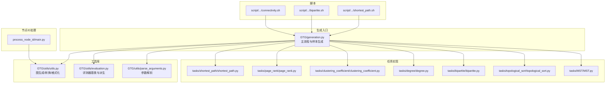
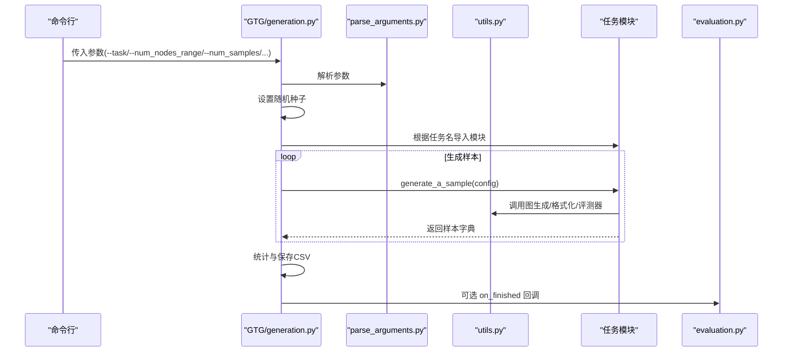
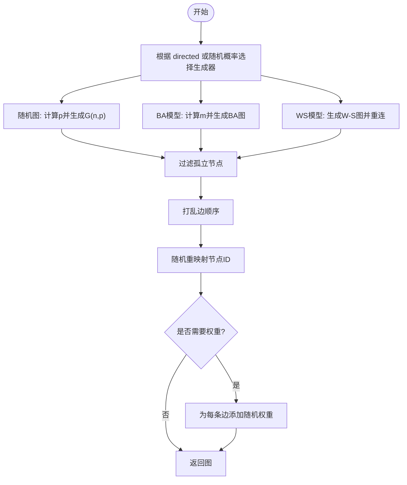
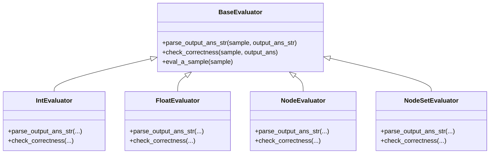
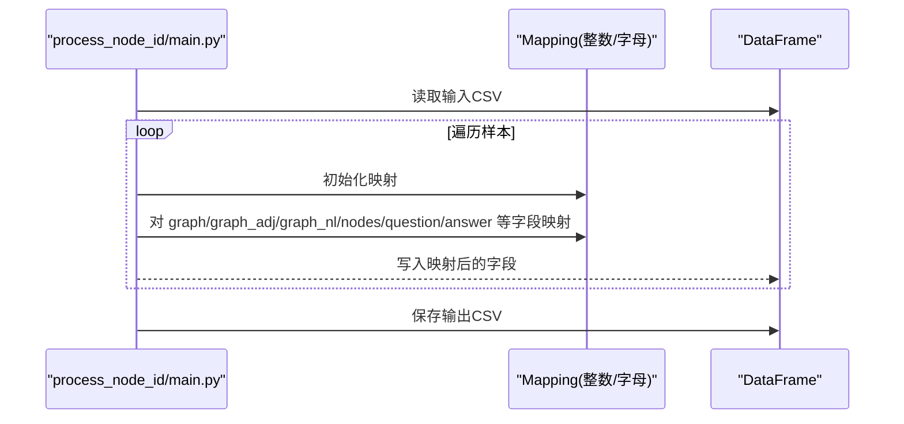
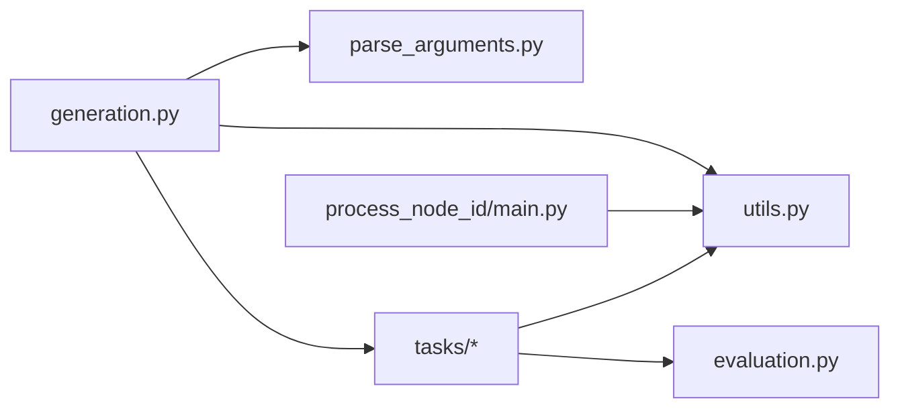

# 自定义图生成

<cite>
**本文引用的文件列表**
- [GTG/generation.py](file://GTG/generation.py)
- [GTG/utils/utils.py](file://GTG/utils/utils.py)
- [GTG/utils/parse_arguments.py](file://GTG/utils/parse_arguments.py)
- [GTG/utils/evaluation.py](file://GTG/utils/evaluation.py)
- [GTG/process_node_id/main.py](file://GTG/process_node_id/main.py)
- [GTG/tasks/shortest_path/shortest_path.py](file://GTG/tasks/shortest_path/shortest_path.py)
- [GTG/tasks/bipartite/bipartite.py](file://GTG/tasks/bipartite/bipartite.py)
- [GTG/tasks/page_rank/page_rank.py](file://GTG/tasks/page_rank/page_rank.py)
- [GTG/tasks/clustering_coefficient/clustering_coefficient.py](file://GTG/tasks/clustering_coefficient/clustering_coefficient.py)
- [GTG/tasks/degree/degree.py](file://GTG/tasks/degree/degree.py)
- [GTG/tasks/topological_sort/topological_sort.py](file://GTG/tasks/topological_sort/topological_sort.py)
- [GTG/tasks/MST/MST.py](file://GTG/tasks/MST/MST.py)
- [script/dataset_generation/shortest_path.sh](file://script/dataset_generation/shortest_path.sh)
- [script/dataset_generation/bipartite.sh](file://script/dataset_generation/bipartite.sh)
- [script/dataset_generation/connectivity.sh](file://script/dataset_generation/connectivity.sh)
</cite>

## 目录
1. [简介](#简介)
2. [项目结构](#项目结构)
3. [核心组件](#核心组件)
4. [架构总览](#架构总览)
5. [详细组件分析](#详细组件分析)
6. [依赖关系分析](#依赖关系分析)
7. [性能考量](#性能考量)
8. [故障排查指南](#故障排查指南)
9. [结论](#结论)
10. [附录](#附录)

## 简介
本指南面向开发者，系统讲解如何扩展与自定义图生成策略，覆盖以下关键目标：
- 深入解析 GTG/generation.py 中的图生成流程，包括随机图、BA 模型、WS 模型等现有生成器的工作机制
- 解释如何添加新的图生成算法（实现新的图构造函数、集成到主生成流程、配置参数暴露）
- 说明如何修改现有任务的问题模板以支持自定义图结构
- 介绍如何通过 utils 模块扩展图属性计算功能
- 提供扩展点的具体代码示例（如添加小世界网络变体或层次化图模型）
- 覆盖配置文件管理、参数验证与性能优化的最佳实践，并指出可能影响现有任务兼容性的风险点

## 项目结构
整体采用“任务驱动 + 工具库”的分层设计：
- GTG/generation.py：入口脚本，负责解析参数、选择任务、生成样本、统计与保存
- GTG/utils：通用工具与图生成函数、解析输出、评估器等
- GTG/tasks：各具体任务的生成器与评估器
- GTG/process_node_id：节点 ID 映射处理（可选）
- script/dataset_generation：批量生成脚本示例

图表来源
- [GTG/generation.py](file://GTG/generation.py#L1-L107)
- [GTG/utils/utils.py](file://GTG/utils/utils.py#L1-L617)
- [GTG/utils/parse_arguments.py](file://GTG/utils/parse_arguments.py#L1-L28)
- [GTG/utils/evaluation.py](file://GTG/utils/evaluation.py#L1-L283)
- [GTG/process_node_id/main.py](file://GTG/process_node_id/main.py#L1-L58)
- [GTG/tasks/shortest_path/shortest_path.py](file://GTG/tasks/shortest_path/shortest_path.py#L1-L140)
- [GTG/tasks/page_rank/page_rank.py](file://GTG/tasks/page_rank/page_rank.py#L1-L129)
- [GTG/tasks/clustering_coefficient/clustering_coefficient.py](file://GTG/tasks/clustering_coefficient/clustering_coefficient.py#L1-L140)
- [GTG/tasks/degree/degree.py](file://GTG/tasks/degree/degree.py#L1-L110)
- [GTG/tasks/bipartite/bipartite.py](file://GTG/tasks/bipartite/bipartite.py#L1-L135)
- [GTG/tasks/topological_sort/topological_sort.py](file://GTG/tasks/topological_sort/topological_sort.py#L1-L233)
- [GTG/tasks/MST/MST.py](file://GTG/tasks/MST/MST.py#L1-L267)
- [script/dataset_generation/shortest_path.sh](file://script/dataset_generation/shortest_path.sh#L1-L35)
- [script/dataset_generation/bipartite.sh](file://script/dataset_generation/bipartite.sh#L1-L35)
- [script/dataset_generation/connectivity.sh](file://script/dataset_generation/connectivity.sh#L1-L35)

章节来源
- [GTG/generation.py](file://GTG/generation.py#L1-L107)
- [GTG/utils/utils.py](file://GTG/utils/utils.py#L1-L617)
- [GTG/utils/parse_arguments.py](file://GTG/utils/parse_arguments.py#L1-L28)
- [GTG/utils/evaluation.py](file://GTG/utils/evaluation.py#L1-L283)
- [GTG/process_node_id/main.py](file://GTG/process_node_id/main.py#L1-L58)
- [script/dataset_generation/shortest_path.sh](file://script/dataset_generation/shortest_path.sh#L1-L35)
- [script/dataset_generation/bipartite.sh](file://script/dataset_generation/bipartite.sh#L1-L35)
- [script/dataset_generation/connectivity.sh](file://script/dataset_generation/connectivity.sh#L1-L35)

## 核心组件
- 主流程与样本生成：从命令行参数解析开始，按任务选择对应的模块，调用其 generate_a_sample 生成样本，汇总统计并保存 CSV
- 图生成工具：提供随机图、BA 模型、WS 模型、带权重图、DAG、二分图、哈密顿路径图、欧拉路径图等多种生成器；并包含节点重映射、边打乱、自然语言描述等辅助能力
- 评测器：统一的评测接口与多种派生评测器（整数、浮点、节点、节点集合等），用于解析 LLM 输出并判定正确性
- 参数解析：标准化的参数表，支持种子、哈希字符串、节点规模范围、连接概率、样本数量等
- 节点 ID 处理：对已生成数据进行节点 ID 的映射（如整数 ID、字母 ID）以增强泛化性

章节来源
- [GTG/generation.py](file://GTG/generation.py#L1-L107)
- [GTG/utils/utils.py](file://GTG/utils/utils.py#L1-L617)
- [GTG/utils/parse_arguments.py](file://GTG/utils/parse_arguments.py#L1-L28)
- [GTG/utils/evaluation.py](file://GTG/utils/evaluation.py#L1-L283)
- [GTG/process_node_id/main.py](file://GTG/process_node_id/main.py#L1-L58)

## 架构总览
下图展示从命令行到样本生成与保存的整体流程，以及任务模块与工具库之间的交互。

图表来源
- [GTG/generation.py](file://GTG/generation.py#L1-L107)
- [GTG/utils/parse_arguments.py](file://GTG/utils/parse_arguments.py#L1-L28)
- [GTG/utils/utils.py](file://GTG/utils/utils.py#L1-L617)
- [GTG/utils/evaluation.py](file://GTG/utils/evaluation.py#L1-L283)
- [GTG/tasks/shortest_path/shortest_path.py](file://GTG/tasks/shortest_path/shortest_path.py#L1-L140)
- [GTG/tasks/page_rank/page_rank.py](file://GTG/tasks/page_rank/page_rank.py#L1-L129)

## 详细组件分析

### 图生成流程与现有生成器
- 随机图：基于 G(n,p) 模型，按平均度数推导连接概率，避免孤立节点，随后对节点 ID 进行随机重映射与边重排
- BA 模型：按平均度数反推初始边数 m，使用 Barabási–Albert 模型生成无标度网络，再进行边重排与节点重映射
- WS 小世界：使用 Watts–Strogatz 模型，均匀采样重连概率，保持连通性与聚类特性，同样进行边重排与节点重映射
- 带权重图：在已有图基础上为每条边赋予随机权重
- DAG：生成随机有向无环图，保证拓扑性质
- 二分图：按比例拆分两类节点集，按概率连接两类节点，确保连通性
- 哈密顿/欧拉路径图：先构建路径，再按平均度数添加随机边，保证存在相应路径

图表来源
- [GTG/utils/utils.py](file://GTG/utils/utils.py#L224-L311)
- [GTG/utils/utils.py](file://GTG/utils/utils.py#L313-L349)
- [GTG/utils/utils.py](file://GTG/utils/utils.py#L352-L366)
- [GTG/utils/utils.py](file://GTG/utils/utils.py#L368-L406)
- [GTG/utils/utils.py](file://GTG/utils/utils.py#L408-L479)

章节来源
- [GTG/utils/utils.py](file://GTG/utils/utils.py#L224-L311)
- [GTG/utils/utils.py](file://GTG/utils/utils.py#L313-L349)
- [GTG/utils/utils.py](file://GTG/utils/utils.py#L352-L366)
- [GTG/utils/utils.py](file://GTG/utils/utils.py#L368-L406)
- [GTG/utils/utils.py](file://GTG/utils/utils.py#L408-L479)

### 新增图生成器的步骤与最佳实践
- 实现新的图构造函数
  - 在 utils.py 中新增函数，遵循现有命名规范与参数风格（如接受 config、可选 directed、返回 NetworkX 图）
  - 保证生成的图不含完全孤立节点，必要时循环重试
  - 对于有向图/无向图分别处理，保持一致性
  - 可选：对边进行重排与节点 ID 重映射，提升泛化性
- 集成到主生成流程
  - 在 utils.py 的 graph_generation 中按需加入新生成器分支（可参考现有条件分支）
  - 若需要权重，可在 graph_generation_with_edge_weight 中复用新图
- 配置参数暴露
  - 在 parse_arguments.py 中添加必要的参数键（如 num_nodes_range、link_prob、num_samples 等），并在脚本中传入
  - 使用 shell 脚本示例（如 shortest_path.sh、bipartite.sh、connectivity.sh）作为模板，统一参数传递
- 修改任务问题模板以支持自定义图结构
  - 在对应任务模块中，调用新的图生成函数或在现有函数上增加分支
  - 保持 generate_a_sample 的输入输出格式一致，确保 make_sample 与评测器可用
- 扩展图属性计算
  - 在 utils.py 中新增图属性计算函数（如聚类系数、直径、中心性等），并与任务模块配合使用
  - 对于需要自然语言描述的场景，复用 graph_to_natural_language/graph_to_adj_str 等格式化函数
- 示例：添加小世界网络变体或层次化图模型
  - 小世界变体：在 WS 生成器基础上引入局部聚类增强或非均匀重连概率
  - 层次化图：按层级划分节点，构建层次连接规则，保证连通性与度分布可控
- 兼容性与风险提示
  - 新增生成器需与现有评测器接口兼容，避免破坏任务的正确性判定
  - 注意极端参数（如极低/极高平均度）可能导致图退化或不可解，应加入阈值与重试逻辑
  - 若新增有向/无向分支，需同步更新任务模块中的方向性假设与评测逻辑

章节来源
- [GTG/utils/utils.py](file://GTG/utils/utils.py#L313-L349)
- [GTG/utils/parse_arguments.py](file://GTG/utils/parse_arguments.py#L1-L28)
- [GTG/tasks/shortest_path/shortest_path.py](file://GTG/tasks/shortest_path/shortest_path.py#L1-L140)
- [GTG/tasks/bipartite/bipartite.py](file://GTG/tasks/bipartite/bipartite.py#L1-L135)
- [script/dataset_generation/shortest_path.sh](file://script/dataset_generation/shortest_path.sh#L1-L35)
- [script/dataset_generation/bipartite.sh](file://script/dataset_generation/bipartite.sh#L1-L35)
- [script/dataset_generation/connectivity.sh](file://script/dataset_generation/connectivity.sh#L1-L35)

### 任务模块与评测器协作
- 任务模块通常包含：
  - generate_a_sample：生成单个样本（含问题、答案、推理步骤、图结构等）
  - question_generation/answer_and_inference_steps_generation：问题与答案生成逻辑
  - Evaluator：评测器派生类，负责解析 LLM 输出并判定正确性
- 评测器基类与派生类：
  - BaseEvaluator：定义 parse_output_ans_str 与 check_correctness 接口
  - IntEvaluator/FloatEvaluator/NodeEvaluator/NodeSetEvaluator 等：针对不同输出类型的解析与判定
- 与图生成的关系：
  - 任务模块通过 utils 中的图生成函数获取图，再结合自身问题模板生成样本
  - 对于带权重图的任务（如 MST、最短路径），使用 graph_generation_with_edge_weight

图表来源
- [GTG/utils/evaluation.py](file://GTG/utils/evaluation.py#L1-L283)

章节来源
- [GTG/utils/evaluation.py](file://GTG/utils/evaluation.py#L1-L283)
- [GTG/tasks/shortest_path/shortest_path.py](file://GTG/tasks/shortest_path/shortest_path.py#L1-L140)
- [GTG/tasks/page_rank/page_rank.py](file://GTG/tasks/page_rank/page_rank.py#L1-L129)
- [GTG/tasks/clustering_coefficient/clustering_coefficient.py](file://GTG/tasks/clustering_coefficient/clustering_coefficient.py#L1-L140)
- [GTG/tasks/degree/degree.py](file://GTG/tasks/degree/degree.py#L1-L110)
- [GTG/tasks/topological_sort/topological_sort.py](file://GTG/tasks/topological_sort/topological_sort.py#L1-L233)
- [GTG/tasks/MST/MST.py](file://GTG/tasks/MST/MST.py#L1-L267)

### 节点 ID 映射与数据后处理
- process_node_id/main.py 支持将已生成的数据中的节点 ID 映射为整数或字母形式，便于模型训练与测试的多样性
- 该阶段读取 CSV，逐行应用 Mapping 并写回新的 CSV 文件

图表来源
- [GTG/process_node_id/main.py](file://GTG/process_node_id/main.py#L1-L58)

章节来源
- [GTG/process_node_id/main.py](file://GTG/process_node_id/main.py#L1-L58)

## 依赖关系分析
- generation.py 依赖 parse_arguments.py 获取参数，依赖 utils.py 提供的图生成与格式化函数，依赖各任务模块的 generate_a_sample
- 各任务模块依赖 utils.py 的图生成函数、格式化函数与评测器基类
- process_node_id/main.py 依赖 utils.py 的 Mapping 与 pandas

图表来源
- [GTG/generation.py](file://GTG/generation.py#L1-L107)
- [GTG/utils/parse_arguments.py](file://GTG/utils/parse_arguments.py#L1-L28)
- [GTG/utils/utils.py](file://GTG/utils/utils.py#L1-L617)
- [GTG/utils/evaluation.py](file://GTG/utils/evaluation.py#L1-L283)
- [GTG/process_node_id/main.py](file://GTG/process_node_id/main.py#L1-L58)

章节来源
- [GTG/generation.py](file://GTG/generation.py#L1-L107)
- [GTG/utils/parse_arguments.py](file://GTG/utils/parse_arguments.py#L1-L28)
- [GTG/utils/utils.py](file://GTG/utils/utils.py#L1-L617)
- [GTG/utils/evaluation.py](file://GTG/utils/evaluation.py#L1-L283)
- [GTG/process_node_id/main.py](file://GTG/process_node_id/main.py#L1-L58)

## 性能考量
- 生成器的复杂度与规模
  - 随机图与 BA/WS 模型在大规模图上仍可高效生成，但注意避免极端平均度导致的稀疏/稠密失衡
  - 带权重图在边数较多时会增加存储与遍历成本，建议按需生成
- 数据生成与保存
  - 使用 tqdm 进度条监控生成过程
  - 保存前进行统计（平均度、是否定向等），有助于后续分析与可视化
- 节点 ID 映射
  - 映射操作为 O(N) 到 O(N log N)，对大规模数据建议批处理与内存优化
- 评测器解析
  - 对于节点集合/列表等输出，尽量使用集合比较与去重，避免 O(N^2) 比较

[本节为通用性能讨论，不直接分析具体文件]

## 故障排查指南
- 孤立节点问题
  - 现有生成器在生成后会检查孤立节点并重试，若自定义生成器未遵循此逻辑，可能导致评测失败
  - 参考路径：[has_completely_isolated_node](file://GTG/utils/utils.py#L178-L182) 与重试逻辑
- 连通性问题
  - 对于需要连通性的任务（如 MST、直径），应在生成阶段保证连通性，否则直接拒绝样本
  - 参考路径：[graph_generation_with_edge_weight](file://GTG/utils/utils.py#L352-L366) 与任务模块中的 reject 分支
- 方向性假设不一致
  - 有向/无向图混用会导致评测器判定错误，需在任务模块中显式区分
  - 参考路径：[TopologicalSort 评测器](file://GTG/tasks/topological_sort/topological_sort.py#L212-L233)
- 参数缺失或类型错误
  - 确保 num_nodes_range 为可求值表达式，link_prob、num_samples 等为数值类型
  - 参考路径：[parse_arguments](file://GTG/utils/parse_arguments.py#L1-L28)
- 节点 ID 不匹配
  - 映射前后节点 ID 必须一致，否则评测器无法匹配
  - 参考路径：[process_node_id/main.py](file://GTG/process_node_id/main.py#L1-L58)

章节来源
- [GTG/utils/utils.py](file://GTG/utils/utils.py#L178-L182)
- [GTG/utils/utils.py](file://GTG/utils/utils.py#L352-L366)
- [GTG/tasks/topological_sort/topological_sort.py](file://GTG/tasks/topological_sort/topological_sort.py#L212-L233)
- [GTG/utils/parse_arguments.py](file://GTG/utils/parse_arguments.py#L1-L28)
- [GTG/process_node_id/main.py](file://GTG/process_node_id/main.py#L1-L58)

## 结论
通过以上分析可知，该系统以“任务模块 + 工具库”为核心，提供了高度可扩展的图生成与评测框架。开发者只需在 utils.py 中实现新的图生成函数，并在 graph_generation 中接入，同时在任务模块中调用，即可快速扩展新的图结构与问题模板。配合参数解析、评测器与节点 ID 映射，可形成完整的端到端工作流。在扩展过程中，务必关注生成质量（连通性、度分布）、评测一致性与性能开销，以确保与现有任务的兼容性与稳定性。

[本节为总结性内容，不直接分析具体文件]

## 附录

### 常用配置项与含义
- --task：任务名称（如 shortest_path、page_rank、bipartite 等）
- --id_type：节点 ID 类型（如 int_id、letter_id）
- --file_input/--file_output：输入/输出文件路径
- --file_dataset/--file_answer/--file_result：数据集/答案/结果文件路径
- --seed：随机种子
- --hash_str：用于生成固定种子的哈希字符串
- --num_nodes_range：节点规模范围（字符串表达式，会被 eval）
- --link_prob：连接概率（数值）
- --num_samples：样本数量（整数）

章节来源
- [GTG/utils/parse_arguments.py](file://GTG/utils/parse_arguments.py#L1-L28)
- [GTG/generation.py](file://GTG/generation.py#L1-L107)
- [GTG/process_node_id/main.py](file://GTG/process_node_id/main.py#L1-L58)

### 批量生成脚本示例
- shortest_path.sh：演示如何传入任务、输出文件、样本数量与哈希标签
- bipartite.sh：演示二分图任务的生成流程
- connectivity.sh：演示连通性任务的生成流程

章节来源
- [script/dataset_generation/shortest_path.sh](file://script/dataset_generation/shortest_path.sh#L1-L35)
- [script/dataset_generation/bipartite.sh](file://script/dataset_generation/bipartite.sh#L1-L35)
- [script/dataset_generation/connectivity.sh](file://script/dataset_generation/connectivity.sh#L1-L35)