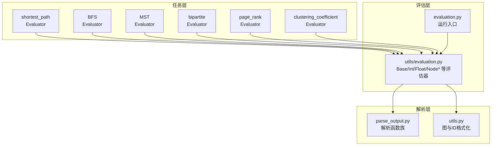
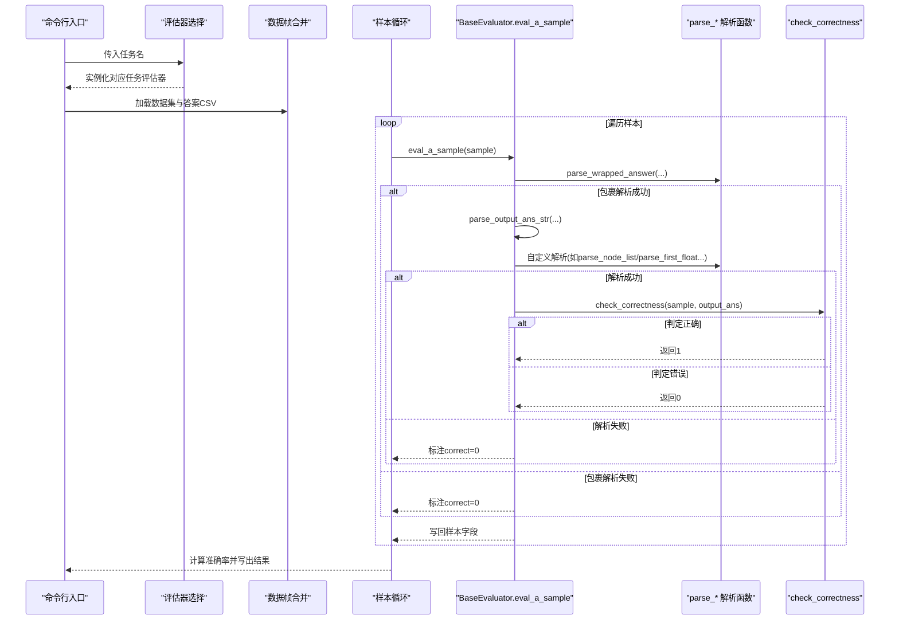
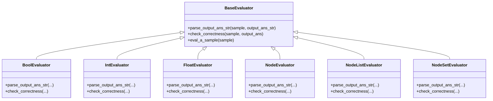
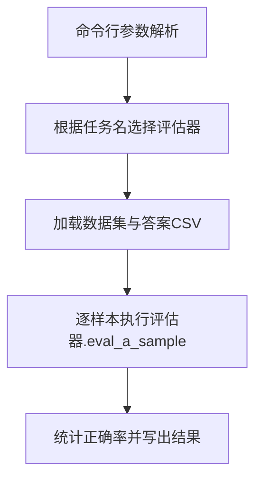
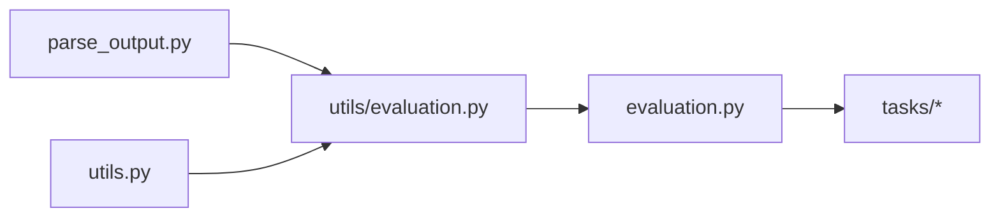

# 评估器扩展

<cite>
**本文引用的文件**
- [GTG/utils/evaluation.py](file://GTG/utils/evaluation.py)
- [GTG/utils/parse_output.py](file://GTG/utils/parse_output.py)
- [GTG/evaluation.py](file://GTG/evaluation.py)
- [GTG/utils/utils.py](file://GTG/utils/utils.py)
- [GTG/tasks/__init__.py](file://GTG/tasks/__init__.py)
- [GTG/tasks/shortest_path/shortest_path.py](file://GTG/tasks/shortest_path/shortest_path.py)
- [GTG/tasks/BFS/BFS.py](file://GTG/tasks/BFS/BFS.py)
- [GTG/tasks/MST/MST.py](file://GTG/tasks/MST/MST.py)
- [GTG/tasks/bipartite/bipartite.py](file://GTG/tasks/bipartite/bipartite.py)
- [GTG/tasks/page_rank/page_rank.py](file://GTG/tasks/page_rank/page_rank.py)
- [GTG/tasks/clustering_coefficient/clustering_coefficient.py](file://GTG/tasks/clustering_coefficient/clustering_coefficient.py)
- [GTG/utils/parse_arguments.py](file://GTG/utils/parse_arguments.py)
</cite>

## 目录
1. [简介](#简介)
2. [项目结构](#项目结构)
3. [核心组件](#核心组件)
4. [架构总览](#架构总览)
5. [详细组件分析](#详细组件分析)
6. [依赖关系分析](#依赖关系分析)
7. [性能与精度控制](#性能与精度控制)
8. [故障排查指南](#故障排查指南)
9. [结论](#结论)
10. [附录：扩展新任务的实践步骤](#附录扩展新任务的实践步骤)

## 简介
本文件面向希望扩展评估系统以支持“新任务类型”的开发者，系统性梳理评估流程、输出解析与评分机制，详解解析函数族的使用与扩展方式，并给出为新任务定义定制化解析逻辑与评估指标的完整实践路径。文档同时覆盖如何在评估器中注册新任务、处理特殊数据类型（如带权边、节点属性等），以及实现新评估器时的异常处理、精度控制与性能监控建议。

## 项目结构
评估系统由“任务生成与样本构造”、“解析与评估”、“运行入口与结果汇总”三部分组成：
- 任务层：各具体任务（如最短路、BFS、MST、二分图匹配、PageRank、聚类系数等）定义问题生成、答案推理过程与评估器。
- 解析层：统一的输出解析工具，提供布尔、整数、浮点、节点列表、字典、带权重列表/字典、边列表等解析能力。
- 评估层：通用评估器基类与具体评估器，负责从模型输出中抽取候选答案并进行正确性判定；运行入口根据任务名选择对应评估器并批量评估。

图表来源
- [GTG/evaluation.py](file://GTG/evaluation.py#L1-L73)
- [GTG/utils/evaluation.py](file://GTG/utils/evaluation.py#L1-L283)
- [GTG/utils/parse_output.py](file://GTG/utils/parse_output.py#L1-L213)
- [GTG/utils/utils.py](file://GTG/utils/utils.py#L1-L617)
- [GTG/tasks/shortest_path/shortest_path.py](file://GTG/tasks/shortest_path/shortest_path.py#L1-L140)
- [GTG/tasks/BFS/BFS.py](file://GTG/tasks/BFS/BFS.py#L1-L212)
- [GTG/tasks/MST/MST.py](file://GTG/tasks/MST/MST.py#L1-L267)
- [GTG/tasks/bipartite/bipartite.py](file://GTG/tasks/bipartite/bipartite.py#L1-L135)
- [GTG/tasks/page_rank/page_rank.py](file://GTG/tasks/page_rank/page_rank.py#L1-L129)
- [GTG/tasks/clustering_coefficient/clustering_coefficient.py](file://GTG/tasks/clustering_coefficient/clustering_coefficient.py#L1-L140)

章节来源
- [GTG/evaluation.py](file://GTG/evaluation.py#L1-L73)
- [GTG/utils/evaluation.py](file://GTG/utils/evaluation.py#L1-L283)
- [GTG/utils/parse_output.py](file://GTG/utils/parse_output.py#L1-L213)
- [GTG/utils/utils.py](file://GTG/utils/utils.py#L1-L617)
- [GTG/tasks/__init__.py](file://GTG/tasks/__init__.py#L1-L24)

## 核心组件
- 通用评估器基类与派生类
  - BaseEvaluator：定义统一的评估流程模板，包含输出包裹解析、自定义解析、正确性判定与样本标注。
  - BoolEvaluator、IntEvaluator、FloatEvaluator、NodeEvaluator、NodeListEvaluator、NodeSetEvaluator：针对不同答案类型的默认解析与判定策略。
- 输出解析工具
  - parse_wrapped_answer：提取被标记包裹的答案片段。
  - parse_bool、parse_first_integer、parse_first_float：基础类型解析。
  - parse_node_list、get_nodes_set、parse_list、parse_dict：节点列表、集合、列表/字典解析。
  - parse_list_with_weight、parse_dict_with_weight、parse_edge_list：带权重列表/字典、边列表解析。
  - remove_all_node_id：移除文本中的节点ID标记，便于数值解析。
- 运行入口
  - 通过命令行参数选择任务，加载对应任务的评估器，合并数据集与答案，逐样本评估并统计准确率。

章节来源
- [GTG/utils/evaluation.py](file://GTG/utils/evaluation.py#L1-L283)
- [GTG/utils/parse_output.py](file://GTG/utils/parse_output.py#L1-L213)
- [GTG/evaluation.py](file://GTG/evaluation.py#L1-L73)

## 架构总览
评估流程遵循“包裹解析—自定义解析—正确性判定”的三段式，所有任务共享同一套解析与评估框架，差异体现在评估器的解析与判定逻辑上。

图表来源
- [GTG/evaluation.py](file://GTG/evaluation.py#L1-L73)
- [GTG/utils/evaluation.py](file://GTG/utils/evaluation.py#L1-L283)
- [GTG/utils/parse_output.py](file://GTG/utils/parse_output.py#L1-L213)

## 详细组件分析

### 通用评估器与评估流程
- BaseEvaluator.eval_a_sample：统一的评估流程，先调用包裹解析提取答案片段，再调用子类的parse_output_ans_str进行自定义解析，最后调用check_correctness进行判定。
- 各类型评估器：
  - BoolEvaluator：基于parse_bool解析布尔答案。
  - IntEvaluator：基于parse_first_integer解析整数答案。
  - FloatEvaluator：基于parse_first_float解析浮点答案，并采用相对误差阈值进行容差比较。
  - NodeEvaluator：校验候选节点是否在合法节点集合内。
  - NodeListEvaluator/NodeSetEvaluator：解析节点序列或集合，NodeSetEvaluator进一步要求集合相等。

图表来源
- [GTG/utils/evaluation.py](file://GTG/utils/evaluation.py#L1-L283)

章节来源
- [GTG/utils/evaluation.py](file://GTG/utils/evaluation.py#L1-L283)

### 输出解析函数族与扩展方式
- 基础解析
  - parse_wrapped_answer：按左右标记提取答案片段。
  - parse_bool：识别“是/否”等关键词，返回标准化字符串。
  - parse_first_integer、parse_first_float：提取首个整数/小数，支持分数形式。
  - remove_all_node_id：移除文本中的节点ID标记，便于数值解析。
- 节点与列表解析
  - get_nodes_set/get_nodes_set_from_nodes_str：从样本或字符串构建合法节点集合。
  - parse_node_list：清理标点后解析为节点列表，并可校验节点合法性。
  - parse_list/parse_dict：解析列表/字典结构。
- 带权重与边解析
  - parse_list_with_weight/parse_dict_with_weight：解析形如键-权重对的结构。
  - parse_edge_list：将节点序列解析为边列表。

扩展要点
- 新任务若需要自定义解析，可在任务评估器中重写parse_output_ans_str，调用上述解析函数组合，或新增专用解析函数。
- 对于带权边/节点属性，优先使用parse_list_with_weight/parse_dict_with_weight/parse_edge_list，确保权重与节点ID的正确抽取与校验。

章节来源
- [GTG/utils/parse_output.py](file://GTG/utils/parse_output.py#L1-L213)

### 典型任务评估器与定制化判定
- 最短路径（IntEvaluator）
  - 评估器继承IntEvaluator，直接复用整数解析与判定。
  - 参考路径：[GTG/tasks/shortest_path/shortest_path.py](file://GTG/tasks/shortest_path/shortest_path.py#L1-L140)
- BFS（NodeListEvaluator + 自定义判定）
  - 评估器继承NodeListEvaluator，但重写check_correctness，按层次顺序校验BFS遍历合法性。
  - 参考路径：[GTG/tasks/BFS/BFS.py](file://GTG/tasks/BFS/BFS.py#L1-L212)
- MST（IntEvaluator + 辅助解析）
  - 使用parse_list_with_weight/parse_dict_with_weight解析树边与权重，评估器继承IntEvaluator。
  - 参考路径：[GTG/tasks/MST/MST.py](file://GTG/tasks/MST/MST.py#L1-L267)
- 二分图最大匹配（BaseEvaluator + 自定义判定）
  - 使用parse_edge_list解析匹配边集，重写check_correctness校验二分性与匹配约束。
  - 参考路径：[GTG/tasks/bipartite/bipartite.py](file://GTG/tasks/bipartite/bipartite.py#L1-L135)
- PageRank（BaseEvaluator + 节点集合判定）
  - 使用get_nodes_set/get_nodes_set_from_nodes_str解析候选节点，判定候选是否属于答案集合。
  - 参考路径：[GTG/tasks/page_rank/page_rank.py](file://GTG/tasks/page_rank/page_rank.py#L1-L129)
- 聚类系数（FloatEvaluator + 容差判定）
  - 评估器继承FloatEvaluator，使用相对误差阈值进行容差比较。
  - 参考路径：[GTG/tasks/clustering_coefficient/clustering_coefficient.py](file://GTG/tasks/clustering_coefficient/clustering_coefficient.py#L1-L140)

章节来源
- [GTG/tasks/shortest_path/shortest_path.py](file://GTG/tasks/shortest_path/shortest_path.py#L1-L140)
- [GTG/tasks/BFS/BFS.py](file://GTG/tasks/BFS/BFS.py#L1-L212)
- [GTG/tasks/MST/MST.py](file://GTG/tasks/MST/MST.py#L1-L267)
- [GTG/tasks/bipartite/bipartite.py](file://GTG/tasks/bipartite/bipartite.py#L1-L135)
- [GTG/tasks/page_rank/page_rank.py](file://GTG/tasks/page_rank/page_rank.py#L1-L129)
- [GTG/tasks/clustering_coefficient/clustering_coefficient.py](file://GTG/tasks/clustering_coefficient/clustering_coefficient.py#L1-L140)

### 评估器注册与运行入口
- 评估入口根据任务名动态实例化对应任务评估器，并对样本逐一评估，最终计算准确率并写出结果。
- 任务注册集中在入口处，新增任务需在此处添加映射。

图表来源
- [GTG/evaluation.py](file://GTG/evaluation.py#L1-L73)
- [GTG/utils/parse_arguments.py](file://GTG/utils/parse_arguments.py#L1-L28)

章节来源
- [GTG/evaluation.py](file://GTG/evaluation.py#L1-L73)
- [GTG/utils/parse_arguments.py](file://GTG/utils/parse_arguments.py#L1-L28)

## 依赖关系分析
- 任务模块通过导入utils/evaluation.py中的评估器基类或具体评估器，实现统一的评估接口。
- 评估器依赖parse_output.py中的解析函数完成答案抽取与结构化解析。
- 运行入口依赖utils/utils.py中的图与ID格式化工具，用于样本构造与边列表解析。

图表来源
- [GTG/utils/evaluation.py](file://GTG/utils/evaluation.py#L1-L283)
- [GTG/utils/parse_output.py](file://GTG/utils/parse_output.py#L1-L213)
- [GTG/utils/utils.py](file://GTG/utils/utils.py#L1-L617)
- [GTG/evaluation.py](file://GTG/evaluation.py#L1-L73)

章节来源
- [GTG/utils/evaluation.py](file://GTG/utils/evaluation.py#L1-L283)
- [GTG/utils/parse_output.py](file://GTG/utils/parse_output.py#L1-L213)
- [GTG/utils/utils.py](file://GTG/utils/utils.py#L1-L617)
- [GTG/evaluation.py](file://GTG/evaluation.py#L1-L73)

## 性能与精度控制
- 浮点判定容差
  - FloatEvaluator采用相对误差阈值进行容差比较，避免绝对误差导致的误判。
  - 参考路径：[GTG/utils/evaluation.py](file://GTG/utils/evaluation.py#L82-L95)
- 文本预处理
  - remove_all_node_id用于移除节点ID标记，减少噪声干扰，提升数值解析成功率。
  - 参考路径：[GTG/utils/parse_output.py](file://GTG/utils/parse_output.py#L65-L68)
- 图结构解析
  - edge_list_str_to_graph将字符串边列表还原为图对象，便于后续算法校验（如BFS层次校验）。
  - 参考路径：[GTG/utils/utils.py](file://GTG/utils/utils.py#L82-L96)
- 性能监控建议
  - 在评估入口增加计时与进度条，结合pandas批处理与多进程（如需要）优化大规模数据评估速度。
  - 对复杂判定逻辑（如BFS层次校验）进行缓存与向量化处理，降低重复计算成本。

章节来源
- [GTG/utils/evaluation.py](file://GTG/utils/evaluation.py#L82-L95)
- [GTG/utils/parse_output.py](file://GTG/utils/parse_output.py#L65-L68)
- [GTG/utils/utils.py](file://GTG/utils/utils.py#L82-L96)

## 故障排查指南
- 解析失败
  - 包裹解析失败：检查模型输出是否包含标记包裹，或调整parse_wrapped_answer的标记配置。
  - 数值解析失败：确认输出中存在可识别的整数/浮点数，必要时先调用remove_all_node_id清理节点ID后再解析。
  - 参考路径：[GTG/utils/evaluation.py](file://GTG/utils/evaluation.py#L23-L53)，[GTG/utils/parse_output.py](file://GTG/utils/parse_output.py#L65-L90)
- 类型不匹配
  - 节点列表/集合解析失败：检查样本中合法节点集合构建逻辑，确保节点ID格式一致。
  - 参考路径：[GTG/utils/parse_output.py](file://GTG/utils/parse_output.py#L93-L117)
- 特殊数据类型（带权边、节点属性）
  - 使用parse_list_with_weight/parse_dict_with_weight/parse_edge_list解析带权重结构，确保权重与节点ID的对应关系正确。
  - 参考路径：[GTG/utils/parse_output.py](file://GTG/utils/parse_output.py#L155-L212)
- 判定逻辑异常
  - 自定义check_correctness需覆盖边界情况（空序列、非法起点、集合大小不一致等），并在评估入口记录错误样本以便复盘。
  - 参考路径：[GTG/tasks/BFS/BFS.py](file://GTG/tasks/BFS/BFS.py#L162-L190)，[GTG/tasks/bipartite/bipartite.py](file://GTG/tasks/bipartite/bipartite.py#L104-L135)

章节来源
- [GTG/utils/evaluation.py](file://GTG/utils/evaluation.py#L23-L53)
- [GTG/utils/parse_output.py](file://GTG/utils/parse_output.py#L93-L212)
- [GTG/tasks/BFS/BFS.py](file://GTG/tasks/BFS/BFS.py#L162-L190)
- [GTG/tasks/bipartite/bipartite.py](file://GTG/tasks/bipartite/bipartite.py#L104-L135)

## 结论
该评估系统通过统一的评估器基类与解析函数族，实现了对多种任务类型的灵活适配。扩展新任务的关键在于：
- 明确答案类型与判定逻辑，选择合适的评估器基类或自定义评估器；
- 使用parse_output.py中的解析函数组合完成答案抽取与结构化解析；
- 在评估入口注册新任务映射，确保运行入口能够正确实例化评估器；
- 针对特殊数据类型（带权边、节点属性等）采用对应的解析函数，并在check_correctness中完善边界条件与约束校验。

## 附录：扩展新任务的实践步骤
- 步骤一：定义任务评估器
  - 若答案为整数/浮点/布尔/节点/节点列表/节点集合，可直接继承相应评估器基类并重写parse_output_ans_str与check_correctness。
  - 若答案为复杂结构（如带权重边列表、字典映射），在parse_output_ans_str中组合parse_list_with_weight/parse_dict_with_weight/parse_edge_list等解析函数。
  - 参考路径：[GTG/utils/evaluation.py](file://GTG/utils/evaluation.py#L1-L283)，[GTG/utils/parse_output.py](file://GTG/utils/parse_output.py#L155-L212)
- 步骤二：在运行入口注册任务
  - 在评估入口中添加新任务名到评估器类的映射，确保命令行可通过--task选择新任务。
  - 参考路径：[GTG/evaluation.py](file://GTG/evaluation.py#L14-L36)
- 步骤三：处理特殊数据类型
  - 对带权边/节点属性，使用parse_list_with_weight/parse_dict_with_weight/parse_edge_list进行解析，并在check_correctness中校验权重与结构一致性。
  - 参考路径：[GTG/utils/parse_output.py](file://GTG/utils/parse_output.py#L155-L212)，[GTG/utils/utils.py](file://GTG/utils/utils.py#L82-L96)
- 步骤四：异常处理与精度控制
  - 在parse_output_ans_str中对解析失败返回None，交由eval_a_sample统一标注correct=0；
  - 对浮点答案采用相对误差阈值；对集合/序列答案采用集合相等或有序结构校验。
  - 参考路径：[GTG/utils/evaluation.py](file://GTG/utils/evaluation.py#L23-L53)，[GTG/utils/evaluation.py](file://GTG/utils/evaluation.py#L82-L95)
- 步骤五：性能监控与结果输出
  - 在评估入口增加计时与进度条，批量写出结果并统计准确率。
  - 参考路径：[GTG/evaluation.py](file://GTG/evaluation.py#L52-L68)