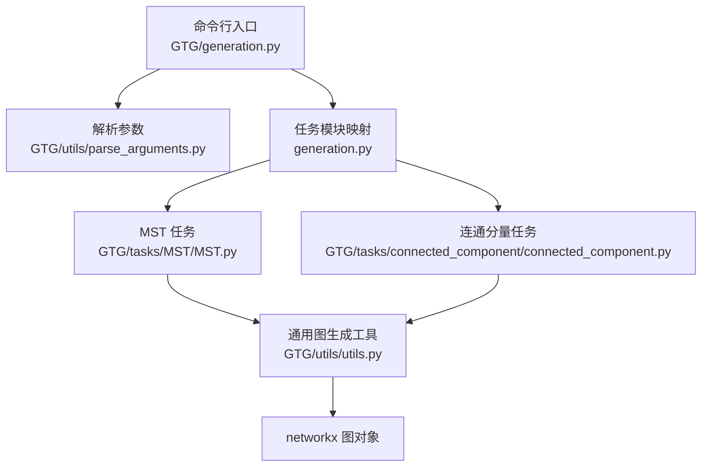
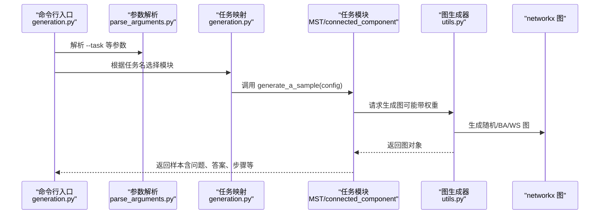
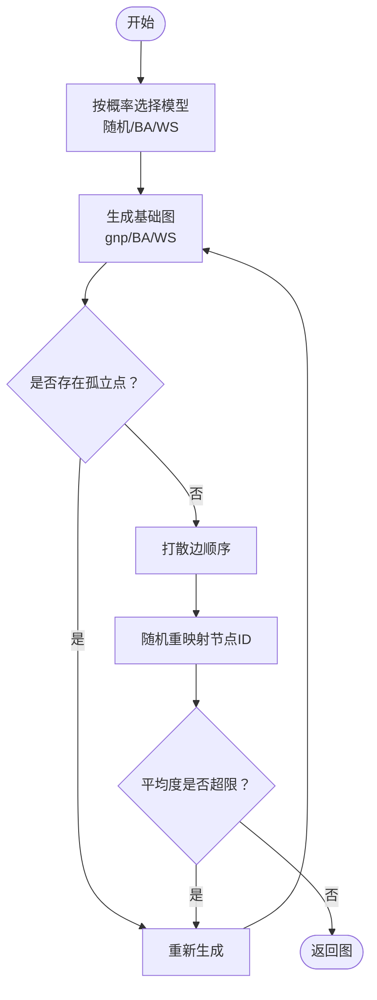
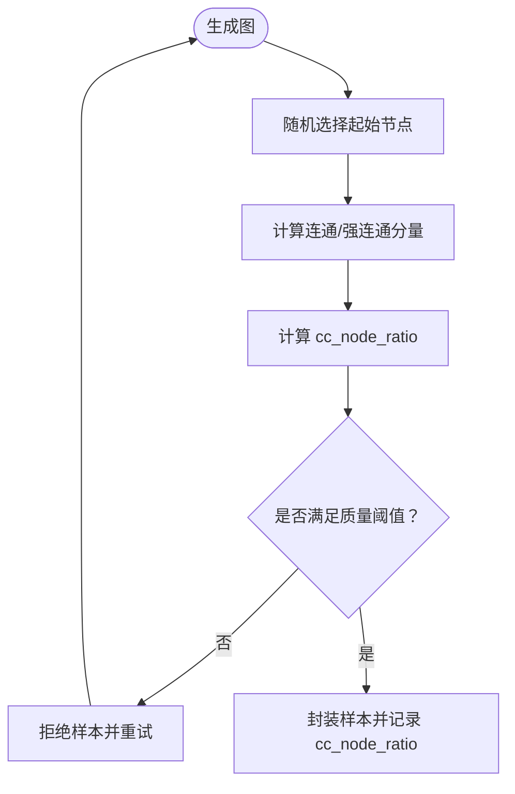
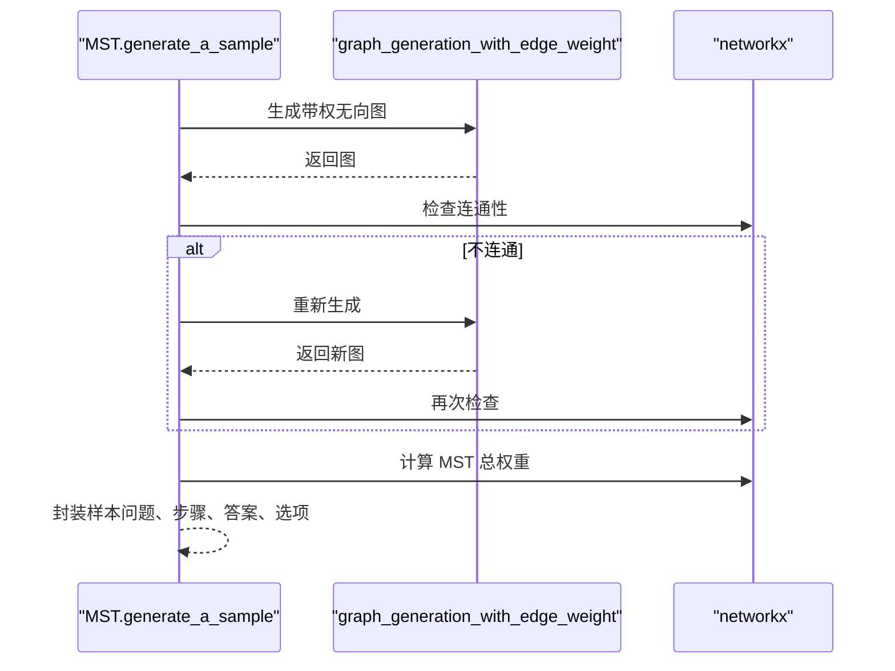
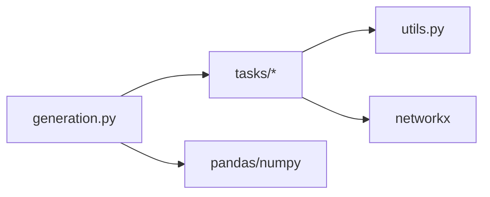

# 图生成策略

<cite>
**本文引用的文件**
- [GTG/generation.py](file://GTG/generation.py)
- [GTG/utils/utils.py](file://GTG/utils/utils.py)
- [GTG/tasks/connected_component/connected_component.py](file://GTG/tasks/connected_component/connected_component.py)
- [GTG/tasks/MST/MST.py](file://GTG/tasks/MST/MST.py)
- [GTG/utils/parse_arguments.py](file://GTG/utils/parse_arguments.py)
- [script/dataset_generation/MST.sh](file://script/dataset_generation/MST.sh)
- [script/dataset_generation/connected_component.sh](file://script/dataset_generation/connected_component.sh)
</cite>

## 目录
1. [引言](#引言)
2. [项目结构](#项目结构)
3. [核心组件](#核心组件)
4. [架构总览](#架构总览)
5. [详细组件分析](#详细组件分析)
6. [依赖关系分析](#依赖关系分析)
7. [性能考量](#性能考量)
8. [故障排查指南](#故障排查指南)
9. [结论](#结论)
10. [附录](#附录)

## 引言
本文件围绕图生成策略进行系统化说明，重点解释以下内容：
- graph_generation(config) 如何依据配置创建 networkx 图对象，涵盖随机图、Barabási–Albert（BA）模型、Watts–Strogatz（WS）模型及其生成算法。
- 配置如何控制图属性，如节点数范围、平均度（可近似反映边密度）、有向/无向等。
- 结合 connected_component 任务的质量控制实践，说明如何在生成过程中确保连通性或过滤非连通图。
- 图生成与具体任务（如 MST）的集成方式，强调 MST 要求图必须连通。
- 自定义图生成策略的扩展方法。

## 项目结构
本项目采用“任务驱动”的组织方式：每个任务（如 MST、connected_component）在其子目录下实现 generate_a_sample 以产出样本；通用图生成逻辑集中在 utils 中，由 generation.py 统一调度。

图表来源
- [GTG/generation.py](file://GTG/generation.py#L1-L107)
- [GTG/utils/parse_arguments.py](file://GTG/utils/parse_arguments.py#L1-L28)
- [GTG/tasks/MST/MST.py](file://GTG/tasks/MST/MST.py#L1-L267)
- [GTG/tasks/connected_component/connected_component.py](file://GTG/tasks/connected_component/connected_component.py#L1-L258)
- [GTG/utils/utils.py](file://GTG/utils/utils.py#L224-L399)

章节来源
- [GTG/generation.py](file://GTG/generation.py#L1-L107)
- [GTG/utils/parse_arguments.py](file://GTG/utils/parse_arguments.py#L1-L28)

## 核心组件
- 通用图生成器
  - graph_generation(config, directed=None)：按配置生成网络图，支持随机图、BA、WS 三种模式，并内置平均度约束与孤立点过滤。
  - generate_random_graph(num_nodes, ave_degree=None, directed=None)：基于快速 G(n,p) 随机图模型生成，自动采样平均度与方向。
  - generate_barabasi_albert_graph(num_nodes, ave_degree=None)：按目标平均度反推 m 参数生成 BA 图，随后打散边并重映射节点 ID。
  - generate_watts_strogatz_graph(num_nodes, ave_degree=None)：按目标平均度设定 k 并在区间内随机采样重连概率 p，生成 WS 图，随后打散边并重映射节点 ID。
  - graph_generation_with_edge_weight(config, directed=None)：在已有图基础上为每条边添加随机权重，用于带权任务（如 MST）。
- 任务侧图生成与质量控制
  - connected_component.generate_a_sample：生成图后计算连通分量占比，若超过阈值则拒绝重试，保证样本质量。
  - MST.generate_a_sample：在生成带权无向图后检查连通性，非连通则拒绝重试，确保 MST 可解。

章节来源
- [GTG/utils/utils.py](file://GTG/utils/utils.py#L224-L399)
- [GTG/tasks/connected_component/connected_component.py](file://GTG/tasks/connected_component/connected_component.py#L198-L245)
- [GTG/tasks/MST/MST.py](file://GTG/tasks/MST/MST.py#L241-L260)

## 架构总览
下图展示从命令行到任务样本生成的整体流程，以及图生成器与任务模块之间的耦合关系。

图表来源
- [GTG/generation.py](file://GTG/generation.py#L1-L107)
- [GTG/utils/parse_arguments.py](file://GTG/utils/parse_arguments.py#L1-L28)
- [GTG/utils/utils.py](file://GTG/utils/utils.py#L224-L399)
- [GTG/tasks/MST/MST.py](file://GTG/tasks/MST/MST.py#L241-L260)
- [GTG/tasks/connected_component/connected_component.py](file://GTG/tasks/connected_component/connected_component.py#L198-L245)

## 详细组件分析

### 通用图生成器：graph_generation 与三大模型
- 支持的图类型与生成策略
  - 随机图（gnp 随机图）：通过 fast_gnp_random_graph 生成，自动根据节点数与平均度计算连接概率 p，并控制方向。
  - Barabási–Albert（BA）模型：按目标平均度反推 m，生成具有幂律度分布的无标度网络，随后打散边并重映射节点 ID，避免结构偏向。
  - Watts–Strogatz（WS）模型：在规则环图基础上以概率 p 重连边，生成小世界网络，同样进行边打散与节点重映射。
- 平均度与边密度控制
  - 平均度通过 _randon_sample_ave_degree 在合理范围内随机采样，避免极端稀疏或稠密。
  - 连接概率 p 与平均度的关系在两类模型中分别由公式推导得到，确保生成图的平均度接近目标值。
- 方向性控制
  - 若未显式指定 directed，则 50% 概率生成有向图；否则强制指定方向。
- 孤立点过滤与节点重映射
  - 生成后若存在完全孤立节点，会重新生成直至满足条件。
  - 使用 id_random_re_mapping 对节点 ID 进行随机重映射，避免标签偏差。
- 平均度上限约束
  - graph_generation 内部对生成图的平均度施加上限约束，防止过度稠密导致后续任务不可解或性能退化。

图表来源
- [GTG/utils/utils.py](file://GTG/utils/utils.py#L224-L399)

章节来源
- [GTG/utils/utils.py](file://GTG/utils/utils.py#L224-L399)

### connected_component 任务的质量控制
- 生成流程
  - 通过 graph_generation 生成图，再随机选择起始节点，调用 answer_and_inference_steps_generation 计算连通分量或强连通分量。
  - 计算连通分量节点占比 cc_node_ratio = |分量| / |全图|，作为质量指标。
- 质量控制策略
  - 若 cc_node_ratio 的分位数超过阈值（例如 90% 分位数），则判定样本质量不佳，拒绝该样本并重新生成。
  - 该策略有助于避免生成过大单一分量或过于稀疏的图，提升训练/评测的多样性与挑战性。
- 输出字段
  - 任务模块在样本中附加 cc_node_ratio 字段，便于统计分析。

图表来源
- [GTG/tasks/connected_component/connected_component.py](file://GTG/tasks/connected_component/connected_component.py#L198-L245)

章节来源
- [GTG/tasks/connected_component/connected_component.py](file://GTG/tasks/connected_component/connected_component.py#L198-L245)

### MST 任务的连通性要求与集成
- 连通性要求
  - MST 仅对连通无向图有意义；因此在生成带权无向图后，立即检查连通性。
  - 若图不连通，则拒绝该样本并重新生成，直到得到连通图。
- 带权图生成
  - 使用 graph_generation_with_edge_weight 在基础图上为每条边添加随机权重，确保任务具备实际推理价值。
- 样本输出
  - 任务模块输出问题文本、推理步骤、答案（总权重）、候选选项等，并在样本中附加答案树（MST 边列表）。

图表来源
- [GTG/tasks/MST/MST.py](file://GTG/tasks/MST/MST.py#L241-L260)
- [GTG/utils/utils.py](file://GTG/utils/utils.py#L352-L366)

章节来源
- [GTG/tasks/MST/MST.py](file://GTG/tasks/MST/MST.py#L241-L260)
- [GTG/utils/utils.py](file://GTG/utils/utils.py#L352-L366)

### 配置项与控制参数
- 关键配置
  - --task：指定任务名称（如 MST、connected_component 等）。
  - --num_nodes_range：节点数范围表达式，用于 eval，决定每次生成的节点数。
  - --link_prob：连接概率（在某些专用生成器中使用）。
  - --num_samples：生成样本数量。
  - --seed 或 --hash_str：随机种子来源，影响图生成与样本一致性。
  - --file_output：输出 CSV 文件路径。
- 控制逻辑
  - graph_generation 内部对平均度进行上限约束，避免过度稠密。
  - connected_component 通过 cc_node_ratio 的分位数阈值进行质量筛选。
  - MST 通过 nx.is_connected 过滤非连通图。

章节来源
- [GTG/utils/parse_arguments.py](file://GTG/utils/parse_arguments.py#L1-L28)
- [GTG/generation.py](file://GTG/generation.py#L1-L107)
- [GTG/utils/utils.py](file://GTG/utils/utils.py#L313-L349)
- [GTG/tasks/connected_component/connected_component.py](file://GTG/tasks/connected_component/connected_component.py#L224-L238)
- [GTG/tasks/MST/MST.py](file://GTG/tasks/MST/MST.py#L241-L260)

### 自定义图生成策略的扩展方法
- 新增模型
  - 在 utils 中新增 generate_my_model(num_nodes, ...)，实现自定义生成逻辑，注意：
    - 处理方向性与平均度目标。
    - 过滤孤立点并进行边打散与节点重映射。
    - 返回 networkx 图对象。
  - 在 graph_generation 中注册新模型分支，按概率或显式参数选择。
- 新增任务
  - 在 tasks 下新建目录与模块，实现 generate_a_sample(config)，并在 generation.py 的任务映射中注册。
  - 若任务需要特定连通性或结构约束，在 generate_a_sample 中增加校验与拒绝重试逻辑。
- 配置扩展
  - 在 parse_arguments.py 中添加新的命令行参数，并在任务模块中读取使用。
  - 在脚本中为新任务提供一键生成脚本（参考 MST.sh、connected_component.sh）。

章节来源
- [GTG/utils/utils.py](file://GTG/utils/utils.py#L224-L399)
- [GTG/generation.py](file://GTG/generation.py#L1-L107)
- [script/dataset_generation/MST.sh](file://script/dataset_generation/MST.sh)
- [script/dataset_generation/connected_component.sh](file://script/dataset_generation/connected_component.sh)

## 依赖关系分析
- 模块耦合
  - generation.py 仅负责任务选择与样本收集，不直接关心具体图生成细节。
  - 任务模块依赖 utils 提供的图生成与样本封装能力。
  - connected_component 与 MST 在各自 generate_a_sample 中对图进行质量控制。
- 外部依赖
  - networkx：提供多种图模型与连通性检测。
  - pandas/numpy：用于统计与数据保存。
- 潜在循环依赖
  - 当前结构清晰，未发现循环导入；任务模块仅单向依赖 utils。

图表来源
- [GTG/generation.py](file://GTG/generation.py#L1-L107)
- [GTG/utils/utils.py](file://GTG/utils/utils.py#L1-L200)
- [GTG/tasks/connected_component/connected_component.py](file://GTG/tasks/connected_component/connected_component.py#L1-L258)
- [GTG/tasks/MST/MST.py](file://GTG/tasks/MST/MST.py#L1-L267)

章节来源
- [GTG/generation.py](file://GTG/generation.py#L1-L107)
- [GTG/utils/utils.py](file://GTG/utils/utils.py#L1-L200)

## 性能考量
- 平均度上限约束：graph_generation 对平均度施加上限，避免生成过稠密图，降低后续任务计算复杂度与内存占用。
- 孤立点过滤：has_completely_isolated_node 保证图的连通性前提，减少无效样本。
- 边打散与节点重映射：shuffle_edges 与 id_random_re_mapping 降低结构偏差，提升样本多样性。
- 任务侧拒绝重试：connected_component 与 MST 在生成后进行快速校验，避免低质量样本进入数据集。

[本节为一般性指导，无需列出具体文件来源]

## 故障排查指南
- 生成的图过于稀疏或稠密
  - 检查 --num_nodes_range 与平均度采样范围是否合理；必要时调整 _randon_sample_ave_degree 的上界。
  - 关注 graph_generation 的平均度上限约束是否触发频繁重试。
- 生成的图存在孤立点
  - 确认 has_completely_isolated_node 的过滤逻辑是否生效；检查生成器是否正确调用。
- MST 任务无法生成有效样本
  - 检查 nx.is_connected 是否被正确调用；确认 graph_generation_with_edge_weight 是否生成无向图。
- connected_component 任务样本质量不佳
  - 查看 cc_node_ratio 的分位数统计，适当提高阈值或调整任务逻辑。

章节来源
- [GTG/utils/utils.py](file://GTG/utils/utils.py#L178-L205)
- [GTG/utils/utils.py](file://GTG/utils/utils.py#L313-L349)
- [GTG/tasks/MST/MST.py](file://GTG/tasks/MST/MST.py#L241-L260)
- [GTG/tasks/connected_component/connected_component.py](file://GTG/tasks/connected_component/connected_component.py#L224-L238)

## 结论
本项目通过统一的图生成器与任务模块化设计，实现了多样化的图生成策略与严格的质量控制。graph_generation 提供了随机图、BA、WS 三类模型，并通过平均度约束、孤立点过滤与节点重映射保障样本质量；任务模块（connected_component、MST）在生成后进行针对性校验，确保任务可解性与挑战性。通过扩展 utils 中的生成器与 generation.py 的任务映射，可以方便地引入新的图模型与任务。

[本节为总结性内容，无需列出具体文件来源]

## 附录
- 示例脚本
  - MST 任务生成脚本：script/dataset_generation/MST.sh
  - 连通分量任务生成脚本：script/dataset_generation/connected_component.sh
- 相关实现参考
  - 通用图生成器与质量控制：GTG/utils/utils.py
  - 任务入口与样本收集：GTG/generation.py
  - 参数解析：GTG/utils/parse_arguments.py

章节来源
- [script/dataset_generation/MST.sh](file://script/dataset_generation/MST.sh)
- [script/dataset_generation/connected_component.sh](file://script/dataset_generation/connected_component.sh)
- [GTG/generation.py](file://GTG/generation.py#L1-L107)
- [GTG/utils/parse_arguments.py](file://GTG/utils/parse_arguments.py#L1-L28)
- [GTG/utils/utils.py](file://GTG/utils/utils.py#L224-L399)