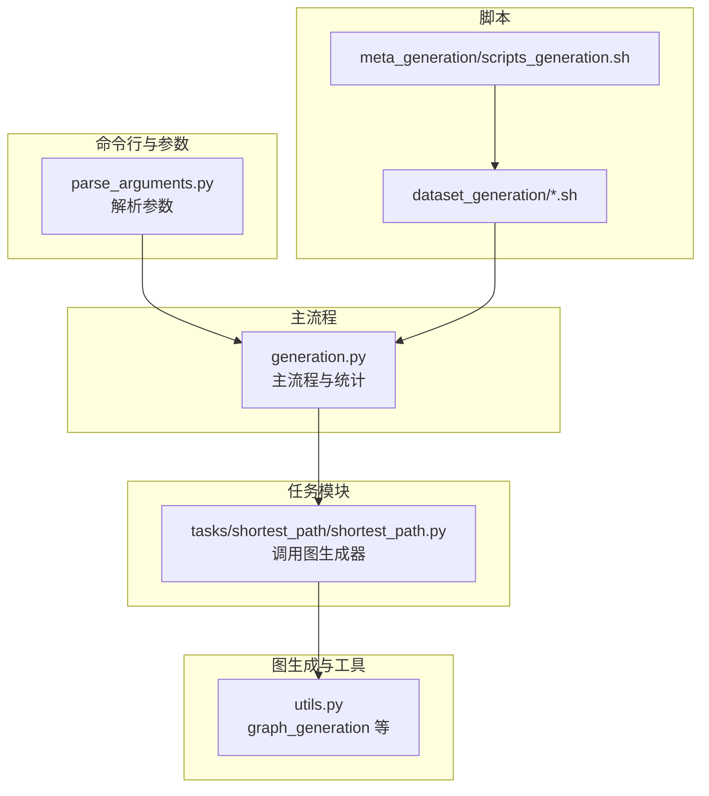
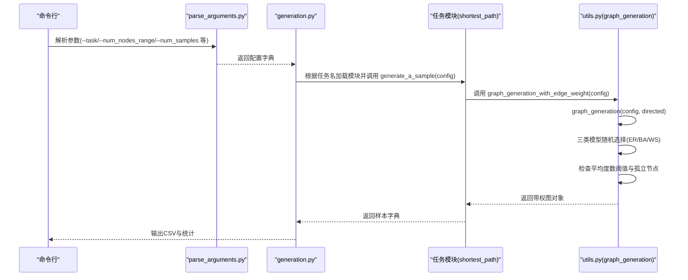
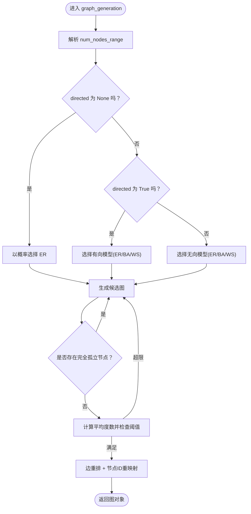
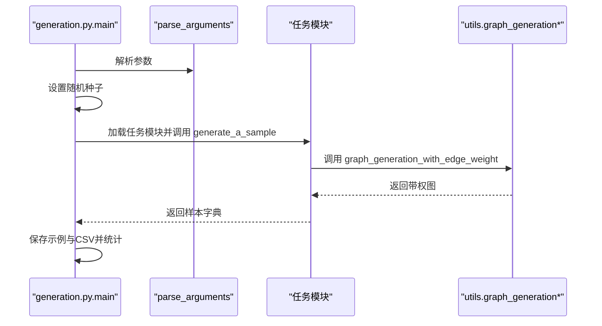
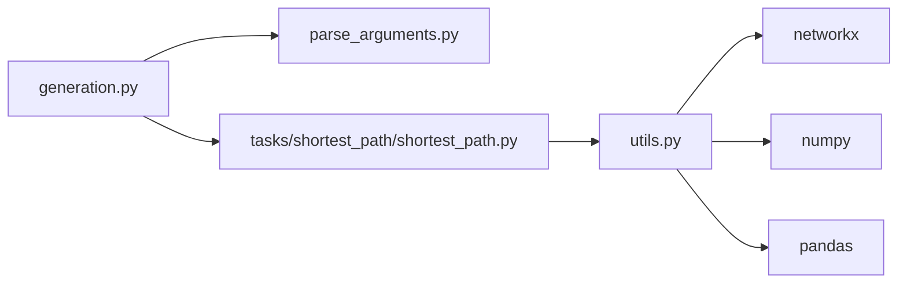

# 基础图生成

<cite>
**本文引用的文件列表**
- [GTG/generation.py](file://GTG/generation.py)
- [GTG/utils/utils.py](file://GTG/utils/utils.py)
- [GTG/utils/parse_arguments.py](file://GTG/utils/parse_arguments.py)
- [GTG/tasks/shortest_path/shortest_path.py](file://GTG/tasks/shortest_path/shortest_path.py)
- [script/dataset_generation/maximum_flow.sh](file://script/dataset_generation/maximum_flow.sh)
- [script/meta_generation/scripts_generation.sh](file://script/meta_generation/scripts_generation.sh)
</cite>

## 目录
1. [引言](#引言)
2. [项目结构](#项目结构)
3. [核心组件](#核心组件)
4. [架构总览](#架构总览)
5. [详细组件分析](#详细组件分析)
6. [依赖关系分析](#依赖关系分析)
7. [性能与复杂度](#性能与复杂度)
8. [故障排查指南](#故障排查指南)
9. [结论](#结论)
10. [附录](#附录)

## 引言
本节面向需要理解“基础图生成”机制的读者，系统阐述如何基于配置参数生成满足规模、方向性与密度要求的图对象。重点覆盖以下内容：
- graph_generation(config) 如何依据配置选择并生成三类核心图模型：随机图（Erdős–Rényi）、BA 无标度网络（Barabási–Albert）与 WS 小世界网络（Watts–Strogatz）。
- 配置项 num_nodes_range、directed 等如何控制图的规模、方向性与密度。
- 在 generation.py 主流程中，图生成器如何作为任务生成的基础组件被调用。
- 结合 shortest_path 任务示例，说明图生成器在图算法训练数据中的典型使用方式与适用场景。

## 项目结构
与“基础图生成”直接相关的核心文件与职责如下：
- GTG/generation.py：任务驱动的主流程入口，负责解析参数、按任务生成样本并统计输出。
- GTG/utils/utils.py：包含图生成与处理的工具函数，如 graph_generation、graph_generation_with_edge_weight、随机图/BA/WS 生成器、边权重注入、节点重映射与边重排等。
- GTG/utils/parse_arguments.py：命令行参数解析，为 generation.py 提供统一的配置字典。
- GTG/tasks/shortest_path/shortest_path.py：以最短路径任务为例，展示如何调用图生成器并构造训练样本。
- script/dataset_generation/*.sh 与 script/meta_generation/scripts_generation.sh：脚本化批量生成数据集的入口，体现图生成器在流水线中的位置。

图表来源
- [GTG/generation.py](file://GTG/generation.py#L1-L107)
- [GTG/utils/parse_arguments.py](file://GTG/utils/parse_arguments.py#L1-L27)
- [GTG/utils/utils.py](file://GTG/utils/utils.py#L224-L366)
- [GTG/tasks/shortest_path/shortest_path.py](file://GTG/tasks/shortest_path/shortest_path.py#L1-L140)
- [script/dataset_generation/maximum_flow.sh](file://script/dataset_generation/maximum_flow.sh#L1-L35)
- [script/meta_generation/scripts_generation.sh](file://script/meta_generation/scripts_generation.sh#L1-L32)

章节来源
- [GTG/generation.py](file://GTG/generation.py#L1-L107)
- [GTG/utils/parse_arguments.py](file://GTG/utils/parse_arguments.py#L1-L27)
- [GTG/utils/utils.py](file://GTG/utils/utils.py#L224-L366)
- [GTG/tasks/shortest_path/shortest_path.py](file://GTG/tasks/shortest_path/shortest_path.py#L1-L140)
- [script/dataset_generation/maximum_flow.sh](file://script/dataset_generation/maximum_flow.sh#L1-L35)
- [script/meta_generation/scripts_generation.sh](file://script/meta_generation/scripts_generation.sh#L1-L32)

## 核心组件
- 图生成器 graph_generation(config, directed=None)
  - 功能：根据配置随机选择一种图模型（随机图/BA/WS），并确保生成的图不包含完全孤立节点，且平均度数不超过节点数的一定比例阈值。
  - 关键点：支持由配置项 num_nodes_range 指定节点规模范围；directed 控制是否强制有向或无向；内部通过概率策略在三类模型间均匀采样。
- 辅助生成器
  - generate_random_graph(num_nodes, ave_degree=None, directed=None)：基于 G(n,p) 模型生成随机图，自动计算连接概率 link_prob 并处理方向性。
  - generate_barabasi_albert_graph(num_nodes, ave_degree=None)：按 BA 模型生成无标度网络，通过平均度数反推 m 参数。
  - generate_watts_strogatz_graph(num_nodes, ave_degree=None)：按 WS 模型生成小世界网络，设置合理的重连概率 p。
- 边权重注入 graph_generation_with_edge_weight(config, directed=None)
  - 功能：在 graph_generation 的基础上为每条边添加随机整数权重，便于带权图算法训练。
- 图预处理工具
  - shuffle_edges(g)：打乱边顺序，避免拓扑偏差。
  - id_random_re_mapping(g, return_mapping=False)：对节点 ID 进行随机重映射，提升泛化能力。
  - has_completely_isolated_node(g)：检测是否存在完全孤立节点，保证连通性与可用性。
  - _randon_sample_ave_degree(num_nodes)：在合理范围内采样平均度数，避免极端稀疏或稠密。

章节来源
- [GTG/utils/utils.py](file://GTG/utils/utils.py#L224-L366)
- [GTG/utils/utils.py](file://GTG/utils/utils.py#L178-L205)
- [GTG/utils/utils.py](file://GTG/utils/utils.py#L207-L215)
- [GTG/utils/utils.py](file://GTG/utils/utils.py#L218-L223)

## 架构总览
下图展示了从命令行到任务模块再到图生成器的整体调用链路，以及图生成器内部三类模型的选择与约束。

图表来源
- [GTG/generation.py](file://GTG/generation.py#L1-L107)
- [GTG/utils/parse_arguments.py](file://GTG/utils/parse_arguments.py#L1-L27)
- [GTG/utils/utils.py](file://GTG/utils/utils.py#L313-L366)
- [GTG/tasks/shortest_path/shortest_path.py](file://GTG/tasks/shortest_path/shortest_path.py#L115-L133)

章节来源
- [GTG/generation.py](file://GTG/generation.py#L1-L107)
- [GTG/utils/parse_arguments.py](file://GTG/utils/parse_arguments.py#L1-L27)
- [GTG/utils/utils.py](file://GTG/utils/utils.py#L313-L366)
- [GTG/tasks/shortest_path/shortest_path.py](file://GTG/tasks/shortest_path/shortest_path.py#L115-L133)

## 详细组件分析

### 组件A：graph_generation(config, directed=None)
- 输入配置要点
  - num_nodes_range：字符串形式的区间表达式，会被 eval 解析为 [a, b]，用于在该范围内随机采样节点数。
  - directed：可为 None/True/False。当为 None 时，三类模型按概率均匀采样；当为 True/False 时，强制指定方向性。
- 三类模型选择策略
  - 若 directed 为 None：随机选择 ER（约 50%）、BA（约 25%）、WS（约 25%）。
  - 若 directed 为 True：仅在随机图（有向）与 BA/WS 中按条件采样。
  - 若 directed 为 False：仅在随机图（无向）与 BA/WS 中按条件采样。
- 约束与后处理
  - 生成后检查是否存在完全孤立节点，若存在则重新生成。
  - 计算平均度数，若超过阈值（与节点数的比例），则丢弃并重新生成，直到满足约束。
  - 对生成的图进行边重排与节点 ID 随机重映射，增强泛化与稳定性。
- 返回值
  - 返回 networkx 图对象（nx.Graph 或 nx.DiGraph），满足规模、方向性与密度要求。

图表来源
- [GTG/utils/utils.py](file://GTG/utils/utils.py#L313-L366)
- [GTG/utils/utils.py](file://GTG/utils/utils.py#L178-L205)
- [GTG/utils/utils.py](file://GTG/utils/utils.py#L207-L215)

章节来源
- [GTG/utils/utils.py](file://GTG/utils/utils.py#L313-L366)

### 组件B：generate_random_graph(num_nodes, ave_degree=None, directed=None)
- 实现原理
  - 基于 G(n,p) 随机图模型，通过平均度数与图的方向性计算连接概率 link_prob。
  - 使用 nx.fast_gnp_random_graph 生成图，随后移除完全孤立节点并进行节点 ID 随机重映射。
- 复杂度与性能
  - 时间复杂度近似 O(n^2)（取决于生成器内部实现），空间复杂度 O(n + m)。
  - 由于采用快速生成器与概率阈值，适合大规模稀疏图的快速采样。
- 适用场景
  - 需要均匀随机拓扑、可控密度的任务，如最短路径、连通性、邻接关系推理等。

章节来源
- [GTG/utils/utils.py](file://GTG/utils/utils.py#L224-L255)

### 组件C：generate_barabasi_albert_graph(num_nodes, ave_degree=None)
- 实现原理
  - 基于 BA 无标度网络模型，通过平均度数反推初始边数 m，再生成无标度网络。
  - 生成后进行边重排与节点 ID 随机重映射，去除孤立节点。
- 复杂度与性能
  - 时间复杂度 O(m·n)，空间复杂度 O(n + m)。m 通常较小，整体效率较高。
- 适用场景
  - 需要幂律度分布、高聚类系数与小世界特性的任务，如 PageRank、社区发现、影响力传播等。

章节来源
- [GTG/utils/utils.py](file://GTG/utils/utils.py#L258-L284)

### 组件D：generate_watts_strogatz_graph(num_nodes, ave_degree=None)
- 实现原理
  - 基于 WS 小世界网络模型，先构建环形图，再以固定概率重连边，形成小世界特性。
  - 生成后进行边重排与节点 ID 随机重映射，去除孤立节点。
- 复杂度与性能
  - 时间复杂度 O(n·k)（k 为每个节点的邻居数），空间复杂度 O(n + m)。
- 适用场景
  - 需要高聚类与短路径长度的任务，如社交网络分析、信息传播、鲁棒性评估等。

章节来源
- [GTG/utils/utils.py](file://GTG/utils/utils.py#L287-L310)

### 组件E：graph_generation_with_edge_weight(config, directed=None)
- 实现原理
  - 先调用 graph_generation 获取基础图，再遍历原图的每条边，为新图添加随机整数权重。
- 适用场景
  - 带权图算法训练，如最短路径、最小生成树、最大流等。

章节来源
- [GTG/utils/utils.py](file://GTG/utils/utils.py#L352-L366)

### 组件F：generation.py 主流程与任务调用
- 主流程要点
  - 解析命令行参数，设置随机种子，按任务名动态加载任务模块。
  - 调用任务模块的 generate_a_sample(config) 生成样本，保存前若干示例与完整 CSV。
  - 统计并导出数据集摘要（含平均度数、是否为有向图等）。
- 与图生成的关系
  - 任务模块通过 graph_generation_with_edge_weight 等接口获取图对象，进而构造问题、答案与推理步骤。
  - 该流程体现了图生成器作为“任务数据源”的核心地位。

图表来源
- [GTG/generation.py](file://GTG/generation.py#L1-L107)
- [GTG/utils/parse_arguments.py](file://GTG/utils/parse_arguments.py#L1-L27)
- [GTG/tasks/shortest_path/shortest_path.py](file://GTG/tasks/shortest_path/shortest_path.py#L115-L133)

章节来源
- [GTG/generation.py](file://GTG/generation.py#L1-L107)
- [GTG/tasks/shortest_path/shortest_path.py](file://GTG/tasks/shortest_path/shortest_path.py#L115-L133)

## 依赖关系分析
- 模块耦合
  - generation.py 依赖 parse_arguments.py 提供统一配置；依赖任务模块的 generate_a_sample 接口。
  - 任务模块（如 shortest_path）依赖 utils.py 的图生成与样本构造工具。
  - utils.py 内部函数相互协作：graph_generation 调用三类生成器与后处理工具；graph_generation_with_edge_weight 依赖 graph_generation。
- 外部依赖
  - networkx：提供图生成与图操作接口。
  - numpy/pandas：用于数值计算与数据统计。
- 循环依赖
  - 未发现循环导入；模块职责清晰，调用方向单一。

图表来源
- [GTG/generation.py](file://GTG/generation.py#L1-L107)
- [GTG/utils/parse_arguments.py](file://GTG/utils/parse_arguments.py#L1-L27)
- [GTG/utils/utils.py](file://GTG/utils/utils.py#L1-L60)
- [GTG/tasks/shortest_path/shortest_path.py](file://GTG/tasks/shortest_path/shortest_path.py#L1-L20)

章节来源
- [GTG/generation.py](file://GTG/generation.py#L1-L107)
- [GTG/utils/parse_arguments.py](file://GTG/utils/parse_arguments.py#L1-L27)
- [GTG/utils/utils.py](file://GTG/utils/utils.py#L1-L60)
- [GTG/tasks/shortest_path/shortest_path.py](file://GTG/tasks/shortest_path/shortest_path.py#L1-L20)

## 性能与复杂度
- 时间复杂度
  - graph_generation：主要瓶颈在于三类生成器与后处理（边重排、ID 重映射、重复尝试），整体近似 O(n^2) 到 O(n·m) 不等，取决于具体模型与参数。
  - graph_generation_with_edge_weight：额外线性遍历边，O(m)。
- 空间复杂度
  - O(n + m)，存储图结构与临时数组。
- 优化建议
  - 控制 num_nodes_range 与平均度数采样范围，避免极端稀疏或稠密导致的多次重试。
  - 使用 fast_gnp_random_graph 等高效生成器，减少不必要的重试次数。
  - 批量生成时复用随机种子，便于调试与可重复性。

[本节为通用性能讨论，无需列出章节来源]

## 故障排查指南
- 生成的图包含完全孤立节点
  - 现象：has_completely_isolated_node 返回 True 导致重试。
  - 排查：检查 num_nodes_range 是否过小或平均度数过低；适当增大平均度数采样范围。
  - 参考实现位置：[has_completely_isolated_node](file://GTG/utils/utils.py#L178-L181)
- 平均度数过高被丢弃
  - 现象：graph_generation 在阈值检查阶段持续重试。
  - 排查：降低 num_nodes_range 上界或减小平均度数采样上限；确认 directed 设置是否合理。
  - 参考实现位置：[graph_generation](file://GTG/utils/utils.py#L313-L366)
- 有向/无向期望不符
  - 现象：directed=None 时仍出现方向性偏差。
  - 排查：明确 directed 参数；必要时显式传入 True/False。
  - 参考实现位置：[graph_generation](file://GTG/utils/utils.py#L313-L366)
- 样本质量不佳（拓扑偏差）
  - 现象：样本过于规则或过于随机。
  - 排查：启用 shuffle_edges 与 id_random_re_mapping；检查 num_nodes_range 与平均度数范围。
  - 参考实现位置：[shuffle_edges](file://GTG/utils/utils.py#L207-L215)、[id_random_re_mapping](file://GTG/utils/utils.py#L184-L204)

章节来源
- [GTG/utils/utils.py](file://GTG/utils/utils.py#L178-L215)
- [GTG/utils/utils.py](file://GTG/utils/utils.py#L313-L366)

## 结论
- graph_generation 通过统一的配置与约束，实现了对三类核心图模型的稳定采样，兼顾了规模、方向性与密度控制。
- 生成器与任务模块解耦良好，便于扩展更多图算法任务；脚本化入口支持批量数据生成。
- 在图算法训练数据中，随机图适用于均匀拓扑任务，BA 适合幂律分布任务，WS 适合小世界特性任务；带权版本可用于带权算法训练。

[本节为总结性内容，无需列出章节来源]

## 附录

### 配置项与参数说明
- num_nodes_range：字符串形式的区间表达式，会被 eval 解析为 [a, b]，用于在该范围内随机采样节点数。
- directed：可为 None/True/False，控制是否强制有向或无向。
- link_prob：在随机图生成中由平均度数与方向性自动计算得到。
- num_samples：generation.py 中用于控制样本数量。
- hash_str/seed：用于设置随机种子，保证可重复性。

章节来源
- [GTG/utils/parse_arguments.py](file://GTG/utils/parse_arguments.py#L1-L27)
- [GTG/utils/utils.py](file://GTG/utils/utils.py#L224-L255)
- [GTG/generation.py](file://GTG/generation.py#L1-L107)

### 实际调用示例（路径参考）
- 最短路径任务调用图生成器
  - 示例路径：[GTG/tasks/shortest_path/shortest_path.py](file://GTG/tasks/shortest_path/shortest_path.py#L115-L133)
- generation.py 主流程
  - 示例路径：[GTG/generation.py](file://GTG/generation.py#L1-L107)
- 脚本化批量生成
  - 示例路径：[script/dataset_generation/maximum_flow.sh](file://script/dataset_generation/maximum_flow.sh#L1-L35)
  - 示例路径：[script/meta_generation/scripts_generation.sh](file://script/meta_generation/scripts_generation.sh#L1-L32)

### 适用场景建议
- 随机图（ER）：均匀随机拓扑、连通性、邻接关系推理、基础最短路径等。
- BA 无标度网络：幂律度分布、高聚类、影响力传播、PageRank 等。
- WS 小世界网络：高聚类与短路径、社交网络分析、鲁棒性评估等。
- 带权图：最短路径、最小生成树、最大流等带权算法训练。

[本节为概念性说明，无需列出章节来源]