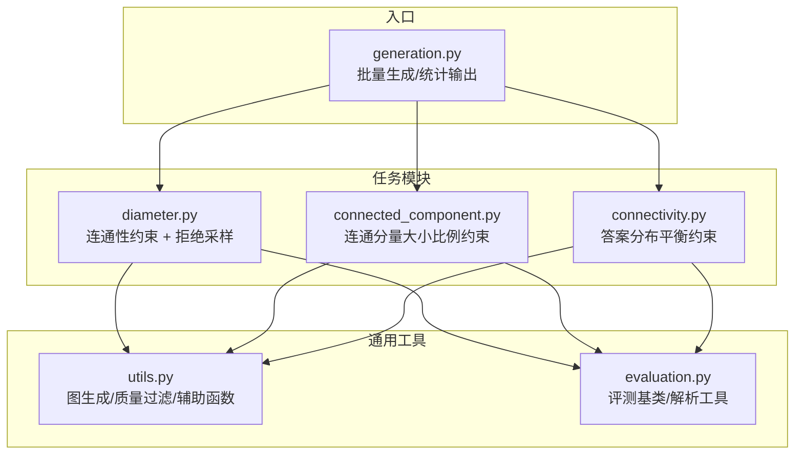
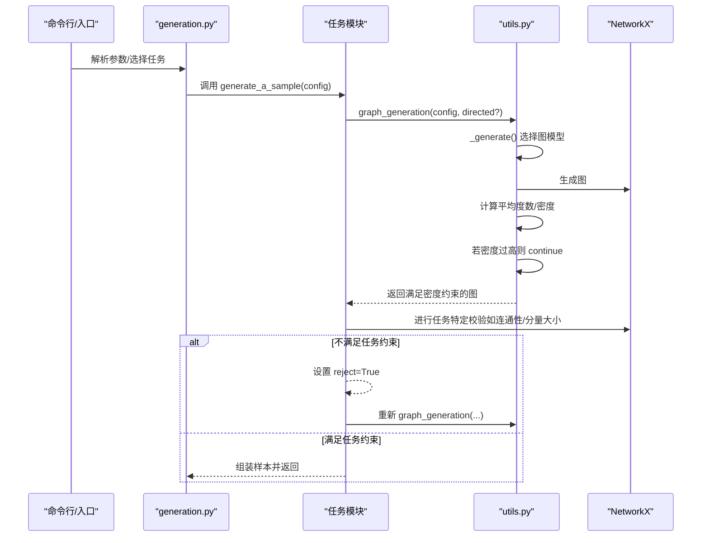
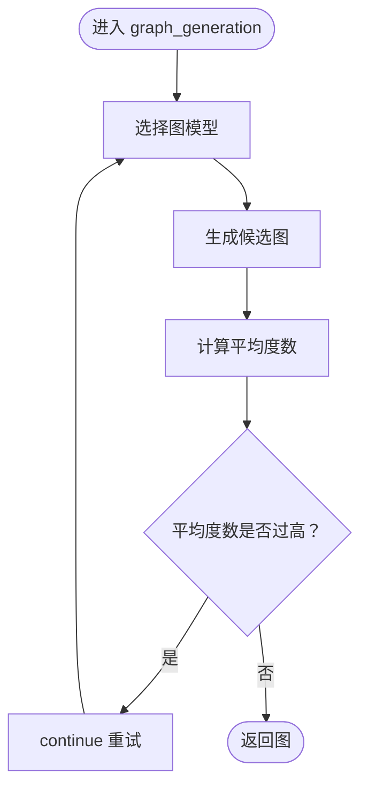
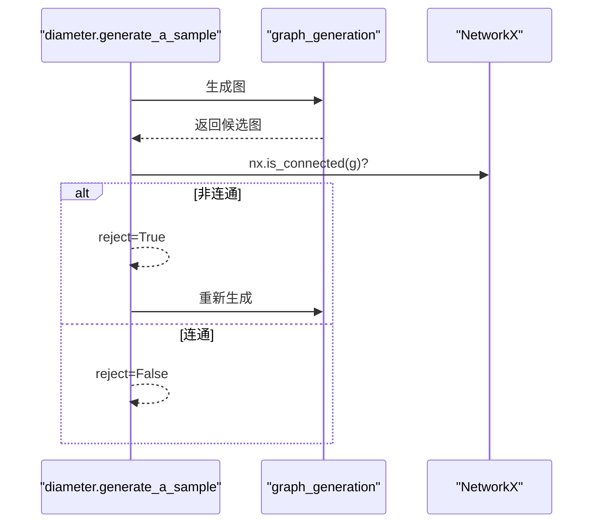
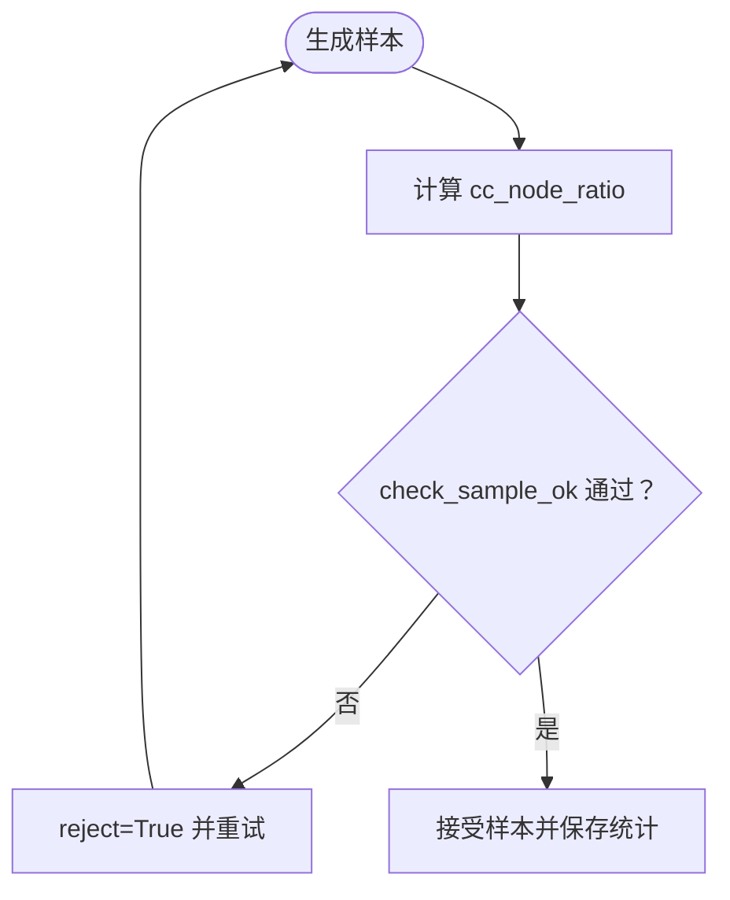
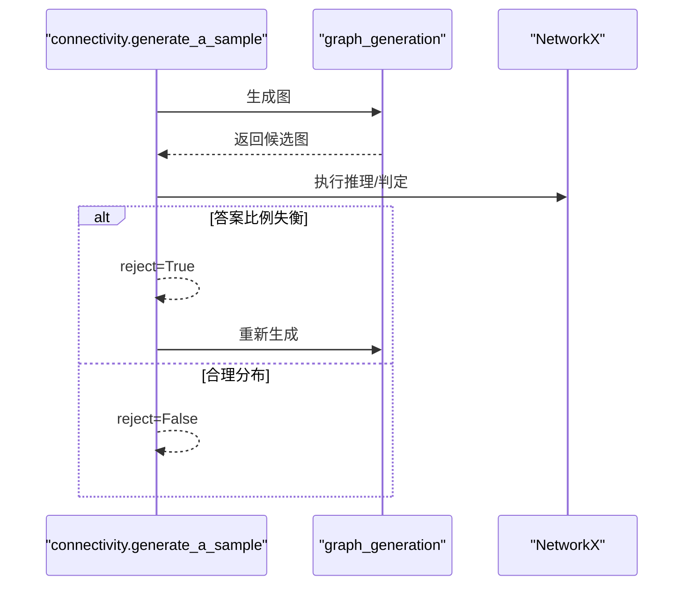
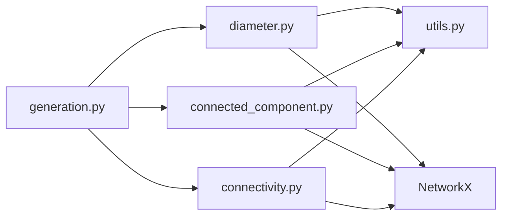

# 生成质量控制

<cite>
**本文引用的文件列表**
- [GTG/utils/utils.py](file://GTG/utils/utils.py)
- [GTG/tasks/diameter/diameter.py](file://GTG/tasks/diameter/diameter.py)
- [GTG/tasks/connected_component/connected_component.py](file://GTG/tasks/connected_component/connected_component.py)
- [GTG/tasks/connectivity/connectivity.py](file://GTG/tasks/connectivity/connectivity.py)
- [GTG/generation.py](file://GTG/generation.py)
- [GTG/utils/evaluation.py](file://GTG/utils/evaluation.py)
</cite>

## 目录
1. [简介](#简介)
2. [项目结构](#项目结构)
3. [核心组件](#核心组件)
4. [架构总览](#架构总览)
5. [详细组件分析](#详细组件分析)
6. [依赖分析](#依赖分析)
7. [性能考量](#性能考量)
8. [故障排查指南](#故障排查指南)
9. [结论](#结论)

## 简介
本文件聚焦于图生成过程中的质量控制机制，系统性解析如下主题：
- 任务特定约束如何保证生成图的有效性与适用性（如连通性、连通分量大小比例等）
- 内置质量过滤逻辑（如平均度数上限避免过度稠密）
- 基于 while True 的拒绝采样策略及其性能影响
- 质量控制与任务逻辑的耦合关系，以及通过返回 reject 标记触发样本重生成
- 预计算与缓存策略以降低重复检查开销的优化建议

## 项目结构
围绕质量控制的核心代码分布在以下模块：
- 通用图生成与质量过滤：GTG/utils/utils.py
- 任务级质量控制与拒绝采样：GTG/tasks/diameter/diameter.py、GTG/tasks/connected_component/connected_component.py、GTG/tasks/connectivity/connectivity.py
- 入口与批量生成：GTG/generation.py
- 评测基类与解析工具：GTG/utils/evaluation.py

图表来源
- [GTG/utils/utils.py](file://GTG/utils/utils.py#L313-L349)
- [GTG/tasks/diameter/diameter.py](file://GTG/tasks/diameter/diameter.py#L94-L111)
- [GTG/tasks/connected_component/connected_component.py](file://GTG/tasks/connected_component/connected_component.py#L201-L244)
- [GTG/tasks/connectivity/connectivity.py](file://GTG/tasks/connectivity/connectivity.py#L101-L118)
- [GTG/generation.py](file://GTG/generation.py#L29-L83)
- [GTG/utils/evaluation.py](file://GTG/utils/evaluation.py#L1-L283)

章节来源
- [GTG/generation.py](file://GTG/generation.py#L29-L83)

## 核心组件
- 图生成与质量过滤（utils.py）
  - graph_generation：统一的图生成入口，内置平均度数上限过滤，避免过度稠密
  - 多种图模型生成器：随机图、BA 无标度图、WS 小世界图等
  - 辅助函数：节点重映射、边洗牌、自然语言描述等
- 任务级质量控制（tasks/*）
  - diameter：要求连通，非连通则 reject=True 并重试
  - connected_component：基于连通分量大小比例的样本筛选
  - connectivity：控制 Yes/No 答案比例，避免极端分布
- 评测与解析（evaluation.py）
  - 提供基础评测接口与解析工具，支撑任务正确性校验

章节来源
- [GTG/utils/utils.py](file://GTG/utils/utils.py#L313-L349)
- [GTG/tasks/diameter/diameter.py](file://GTG/tasks/diameter/diameter.py#L20-L33)
- [GTG/tasks/connected_component/connected_component.py](file://GTG/tasks/connected_component/connected_component.py#L201-L244)
- [GTG/tasks/connectivity/connectivity.py](file://GTG/tasks/connectivity/connectivity.py#L75-L86)
- [GTG/utils/evaluation.py](file://GTG/utils/evaluation.py#L1-L283)

## 架构总览
下图展示从入口到任务模块再到质量控制的整体流程，突出拒绝采样与质量过滤的交互。

图表来源
- [GTG/generation.py](file://GTG/generation.py#L29-L83)
- [GTG/tasks/diameter/diameter.py](file://GTG/tasks/diameter/diameter.py#L94-L111)
- [GTG/tasks/connected_component/connected_component.py](file://GTG/tasks/connected_component/connected_component.py#L201-L244)
- [GTG/tasks/connectivity/connectivity.py](file://GTG/tasks/connectivity/connectivity.py#L101-L118)
- [GTG/utils/utils.py](file://GTG/utils/utils.py#L313-L349)

## 详细组件分析

### 组件A：平均度数上限与拒绝采样（utils.py）
- 内置质量过滤逻辑
  - 在 graph_generation 中，先按概率选择图模型，再计算平均度数（考虑有向/无向的边计数差异），若超过阈值（与节点数的比例）则 continue，直到满足为止
  - 该策略有效避免生成过度稠密的图，提升后续任务的可解性与稳定性
- 性能影响
  - while True 循环在极端情况下可能导致多次重试；但通过合理的图模型选择与阈值设计，通常能在较短时间内收敛
  - 可通过预估平均度数分布减少重试次数（见优化建议）

图表来源
- [GTG/utils/utils.py](file://GTG/utils/utils.py#L313-L349)

章节来源
- [GTG/utils/utils.py](file://GTG/utils/utils.py#L313-L349)

### 组件B：连通性约束（diameter.py）
- 任务约束
  - 要求图必须连通；若不连通，answer_and_inference_steps_generation 返回 reject=True
  - generate_a_sample 使用 while 循环持续重试，直至获得连通图
- 适用性
  - 直径定义需在连通图上成立；连通性是任务前提条件
- 与内置过滤的关系
  - 该约束独立于平均度数上限，二者共同保证样本质量

图表来源
- [GTG/tasks/diameter/diameter.py](file://GTG/tasks/diameter/diameter.py#L20-L33)
- [GTG/tasks/diameter/diameter.py](file://GTG/tasks/diameter/diameter.py#L94-L111)

章节来源
- [GTG/tasks/diameter/diameter.py](file://GTG/tasks/diameter/diameter.py#L20-L33)
- [GTG/tasks/diameter/diameter.py](file://GTG/tasks/diameter/diameter.py#L94-L111)

### 组件C：连通分量大小比例约束（connected_component.py）
- 任务约束
  - 计算连通分量大小与节点总数的比例 cc_node_ratio = |component| / |V|
  - 通过 check_sample_ok 判断是否接受样本；若样本的 cc_node_ratio 分布出现极端偏态（如高百分位过高），则 reject 并重试
- 适用性
  - 避免生成“单点连通分量过大”的样本，使任务更具代表性与教学价值
- 与内置过滤的关系
  - 该约束关注分量大小分布而非全局密度，与平均度数上限互补

图表来源
- [GTG/tasks/connected_component/connected_component.py](file://GTG/tasks/connected_component/connected_component.py#L201-L244)

章节来源
- [GTG/tasks/connected_component/connected_component.py](file://GTG/tasks/connected_component/connected_component.py#L201-L244)

### 组件D：答案分布平衡约束（connectivity.py）
- 任务约束
  - 通过 reject 控制 Yes/No 答案比例，避免极端偏向
- 适用性
  - 保证训练/评测数据的均衡性，提升模型泛化能力

图表来源
- [GTG/tasks/connectivity/connectivity.py](file://GTG/tasks/connectivity/connectivity.py#L75-L86)
- [GTG/tasks/connectivity/connectivity.py](file://GTG/tasks/connectivity/connectivity.py#L101-L118)

章节来源
- [GTG/tasks/connectivity/connectivity.py](file://GTG/tasks/connectivity/connectivity.py#L75-L86)
- [GTG/tasks/connectivity/connectivity.py](file://GTG/tasks/connectivity/connectivity.py#L101-L118)

### 组件E：评测与解析（evaluation.py）
- 评测基类提供统一的解析与正确性判断流程，支撑各任务的输出解析与评分
- 与质量控制的间接关系
  - 评测侧重于模型输出的正确性，质量控制侧重于输入样本的合理性；二者共同保障整体数据质量

章节来源
- [GTG/utils/evaluation.py](file://GTG/utils/evaluation.py#L1-L283)

## 依赖分析
- 低耦合高内聚
  - 通用图生成与质量过滤集中在 utils.py，任务模块仅负责调用与二次校验，职责清晰
- 关键依赖链
  - generation.py -> 任一任务模块 -> utils.graph_generation -> NetworkX
  - 任务模块 -> NetworkX（连通性/分量/最短路等）
- 潜在风险
  - while True 拒绝采样在极端条件下可能延长生成时间
  - 多任务组合时，不同约束叠加可能进一步增加重试概率

图表来源
- [GTG/generation.py](file://GTG/generation.py#L29-L83)
- [GTG/tasks/diameter/diameter.py](file://GTG/tasks/diameter/diameter.py#L94-L111)
- [GTG/tasks/connected_component/connected_component.py](file://GTG/tasks/connected_component/connected_component.py#L201-L244)
- [GTG/tasks/connectivity/connectivity.py](file://GTG/tasks/connectivity/connectivity.py#L101-L118)
- [GTG/utils/utils.py](file://GTG/utils/utils.py#L313-L349)

## 性能考量
- 拒绝采样成本
  - while True 循环在密度阈值较严或任务约束较多时，可能多次重试
- 影响因素
  - 图模型选择（随机/BA/WS）与参数（平均度、连通性、分布均衡性）
  - 任务约束强度（连通性、分量比例、答案分布）
- 优化建议（已在后文详述）

## 故障排查指南
- 生成卡顿或耗时过长
  - 检查是否启用了严格的密度阈值或多重约束叠加
  - 可临时放宽密度阈值或减少任务约束以定位瓶颈
- 样本质量异常
  - 连通性不足：确认 diameter 任务的 reject 流程是否生效
  - 分量比例极端：检查 connected_component 的 cc_node_ratio 分布统计
  - 答案分布失衡：确认 connectivity 的 reject 触发逻辑
- 数据统计与可视化
  - generation.py 输出统计文件，可据此分析平均度、密度等指标

章节来源
- [GTG/generation.py](file://GTG/generation.py#L83-L103)
- [GTG/tasks/diameter/diameter.py](file://GTG/tasks/diameter/diameter.py#L94-L111)
- [GTG/tasks/connected_component/connected_component.py](file://GTG/tasks/connected_component/connected_component.py#L247-L252)
- [GTG/tasks/connectivity/connectivity.py](file://GTG/tasks/connectivity/connectivity.py#L101-L118)

## 结论
- 质量控制贯穿“生成—校验—重试”闭环：utils 的内置密度过滤与各任务的特定约束共同作用，确保样本有效且具代表性
- 拒绝采样策略简单可靠，但需注意约束叠加带来的重试成本
- 通过预计算与缓存、约束合并、阈值自适应等手段可进一步优化性能与稳定性

## 附：优化建议（面向工程实践）
- 预计算与缓存
  - 在 graph_generation 中预先估算平均度数分布，优先选择更易满足密度阈值的图模型
  - 对连通性/分量大小等昂贵检查进行缓存，避免重复计算
- 约束合并与早停
  - 将多个任务约束整合为复合过滤器，尽量在生成阶段一次性剔除不合格样本
  - 引入早停策略：若连续多次重试仍失败，切换到更宽松的参数空间
- 阈值自适应
  - 根据任务类型与节点规模动态调整密度阈值与分布均衡阈值
- 批量生成与并发
  - 在入口层引入并发生成与队列管理，提高吞吐并降低等待时间

[本节为通用建议，不直接分析具体文件，故无章节来源]