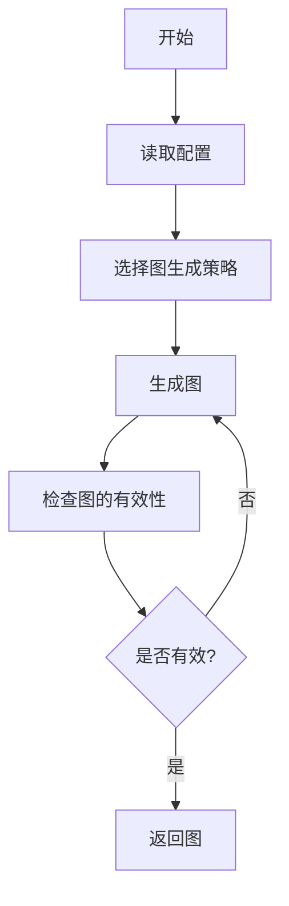
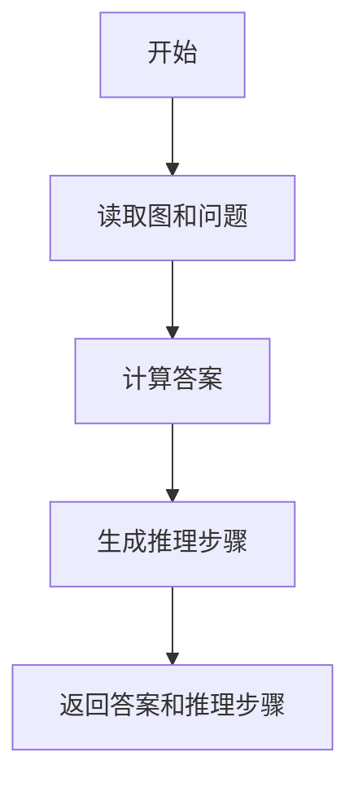
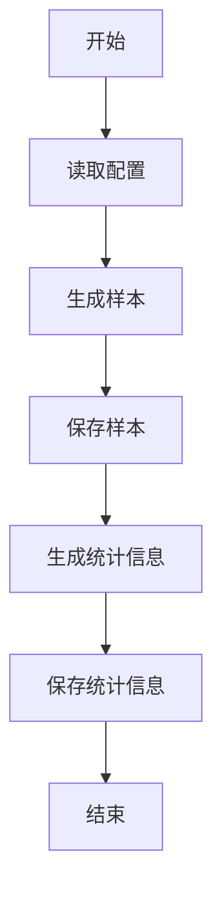

# 数据生成流程

<cite>
**本文档中引用的文件**  
- [generation.py](file://GTG/generation.py)
- [parse_arguments.py](file://GTG/utils/parse_arguments.py)
- [utils.py](file://GTG/utils/utils.py)
- [parse_output.py](file://GTG/utils/parse_output.py)
- [shortest_path.py](file://GTG/tasks/shortest_path/shortest_path.py)
- [page_rank.py](file://GTG/tasks/page_rank/page_rank.py)
- [BFS.py](file://GTG/tasks/BFS/BFS.py)
- [MST.py](file://GTG/tasks/MST/MST.py)
- [evaluation.py](file://GTG/evaluation.py)
</cite>

## 目录
1. [配置与控制机制](#配置与控制机制)
2. [图生成策略](#图生成策略)
3. [问题模板与图的结合](#问题模板与图的结合)
4. [答案与推理步骤生成](#答案与推理步骤生成)
5. [样本格式化与输出](#样本格式化与输出)
6. [评估机制](#评估机制)

## 配置与控制机制

数据生成流程通过命令行参数或配置文件进行控制。`parse_arguments.py` 文件定义了 `parse_arguments` 函数，用于解析各种配置参数，包括任务类型、节点ID类型、输入输出文件路径、随机种子、哈希字符串、节点数量范围、连接概率和样本数量等。这些参数允许用户灵活地控制生成过程。

**中文(中文)**
- **任务类型**：通过 `--task` 参数指定，如 `shortest_path`、`page_rank`、`BFS` 等。
- **节点ID类型**：通过 `--id_type` 参数指定，可以是整数或字母。
- **文件路径**：通过 `--file_input` 和 `--file_output` 参数指定输入和输出文件路径。
- **随机种子**：通过 `--seed` 参数指定，确保生成结果的可重复性。
- **节点数量范围**：通过 `--num_nodes_range` 参数指定，定义生成图的节点数量范围。
- **样本数量**：通过 `--num_samples` 参数指定，定义生成的样本数量。

**Section sources**
- [parse_arguments.py](file://GTG/utils/parse_arguments.py#L1-L28)

## 图生成策略

图生成策略根据配置创建 `networkx` 图对象。`utils.py` 文件中定义了多种图生成函数，包括随机图、BA模型、WS模型等。这些函数根据配置参数生成不同类型的图，并确保生成的图满足特定条件，如无孤立节点等。

**中文(中文)**
- **随机图生成**：使用 `generate_random_graph` 函数，根据节点数量和平均度生成随机图。
- **BA模型生成**：使用 `generate_barabasi_albert_graph` 函数，根据节点数量和平均度生成BA模型图。
- **WS模型生成**：使用 `generate_watts_strogatz_graph` 函数，根据节点数量、平均度和重连概率生成WS模型图。
- **带权重的图生成**：使用 `graph_generation_with_edge_weight` 函数，在生成的图上添加随机权重。

**Diagram sources**
- [utils.py](file://GTG/utils/utils.py#L224-L350)

**Section sources**
- [utils.py](file://GTG/utils/utils.py#L224-L350)

## 问题模板与图的结合

问题模板与生成的图结合以创建具体的自然语言问题。每个任务模块（如 `shortest_path.py`、`page_rank.py`）中定义了 `question_generation` 函数，该函数根据生成的图和配置参数生成具体的问题。

**中文(中文)**
- **最短路径问题**：在 `shortest_path.py` 中，`question_generation` 函数生成从一个节点到另一个节点的最短路径问题。
- **PageRank问题**：在 `page_rank.py` 中，`question_generation` 函数生成关于哪个节点具有最大PageRank值的问题。
- **BFS问题**：在 `BFS.py` 中，`question_generation` 函数生成从一个节点开始的广度优先搜索问题。

**Section sources**
- [shortest_path.py](file://GTG/tasks/shortest_path/shortest_path.py#L22-L38)
- [page_rank.py](file://GTG/tasks/page_rank/page_rank.py#L15-L22)
- [BFS.py](file://GTG/tasks/BFS/BFS.py#L13-L21)

## 答案与推理步骤生成

答案和推理步骤的自动化生成机制通过 `answer_and_inference_steps_generation` 函数实现。该函数根据生成的图和问题，计算正确答案并生成详细的推理步骤。

**中文(中文)**
- **最短路径答案生成**：在 `shortest_path.py` 中，`answer_and_inference_steps_generation` 函数使用Dijkstra算法计算最短路径，并生成推理步骤。
- **PageRank答案生成**：在 `page_rank.py` 中，`answer_and_inference_steps_generation` 函数计算PageRank值，并生成推理步骤。
- **BFS答案生成**：在 `BFS.py` 中，`answer_and_inference_steps_generation` 函数执行BFS遍历，并生成推理步骤。

**Diagram sources**
- [shortest_path.py](file://GTG/tasks/shortest_path/shortest_path.py#L41-L91)
- [page_rank.py](file://GTG/tasks/page_rank/page_rank.py#L25-L76)
- [BFS.py](file://GTG/tasks/BFS/BFS.py#L24-L67)

**Section sources**
- [shortest_path.py](file://GTG/tasks/shortest_path/shortest_path.py#L41-L91)
- [page_rank.py](file://GTG/tasks/page_rank/page_rank.py#L25-L76)
- [BFS.py](file://GTG/tasks/BFS/BFS.py#L24-L67)

## 样本格式化与输出

生成的样本被格式化并输出为CSV文件，供下游任务使用。`generation.py` 文件中的 `main` 函数负责生成和保存所有样本。生成的样本包含任务名称、图、问题、答案、推理步骤等信息，并保存为CSV文件。

**中文(中文)**
- **样本生成**：`main` 函数调用 `generate_a_sample` 函数生成样本。
- **样本保存**：生成的样本被保存为CSV文件，包含 `id`、`task`、`graph`、`question`、`answer`、`steps` 等字段。
- **统计信息**：生成的CSV文件还包含数据集的统计信息，如平均度、节点数量、边数量等。

**Diagram sources**
- [generation.py](file://GTG/generation.py#L71-L82)

**Section sources**
- [generation.py](file://GTG/generation.py#L71-L82)

## 评估机制

评估机制通过 `evaluation.py` 文件中的 `main` 函数实现。该函数读取生成的样本和模型输出，评估模型的正确性，并生成评估结果。

**中文(中文)**
- **评估器选择**：根据任务类型选择相应的评估器，如 `ShortestPathEvaluator`、`PageRankEvaluator` 等。
- **正确性检查**：评估器检查模型输出的正确性，并记录正确率。
- **结果保存**：评估结果被保存为CSV文件，包含每个样本的正确性信息。

**Section sources**
- [evaluation.py](file://GTG/evaluation.py#L14-L36)