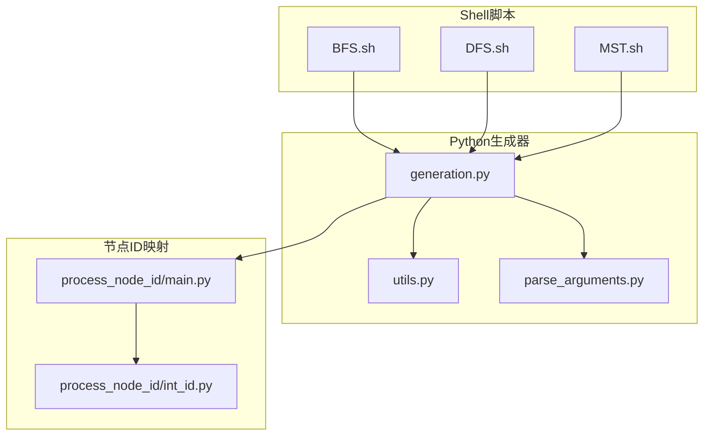
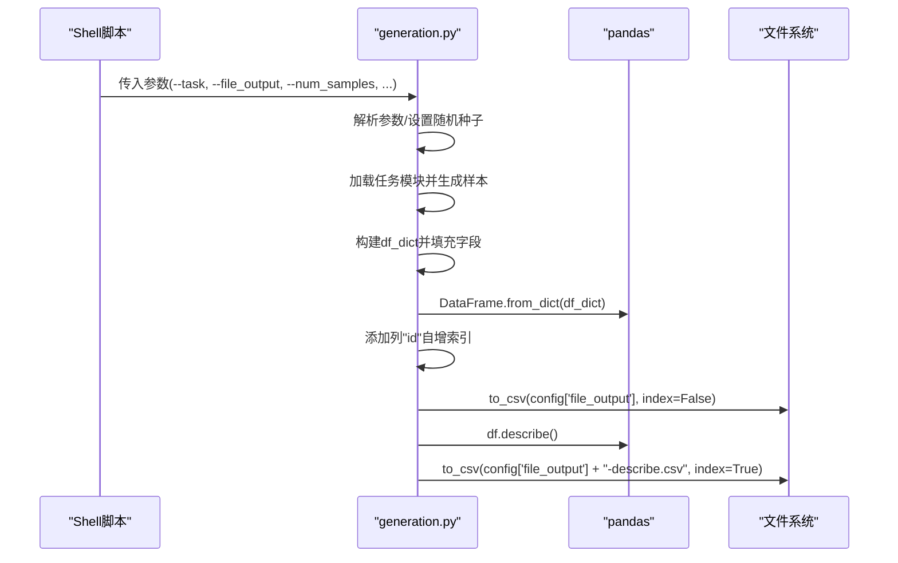
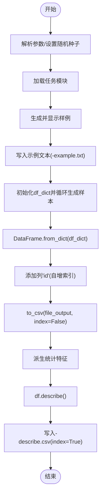
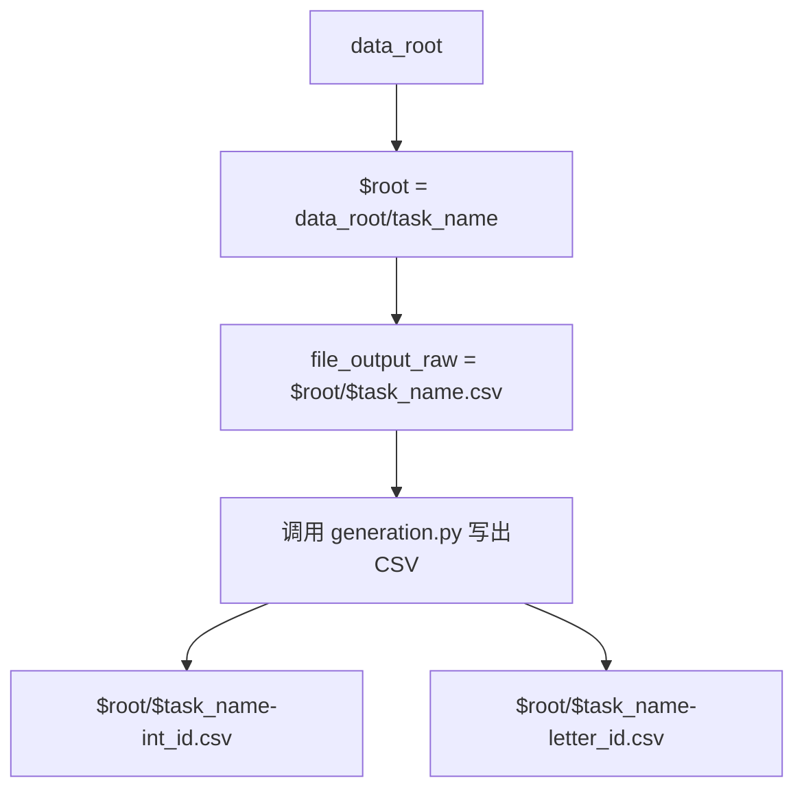
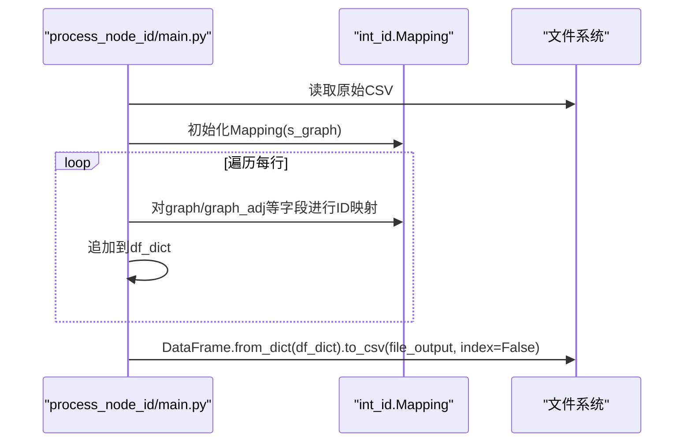
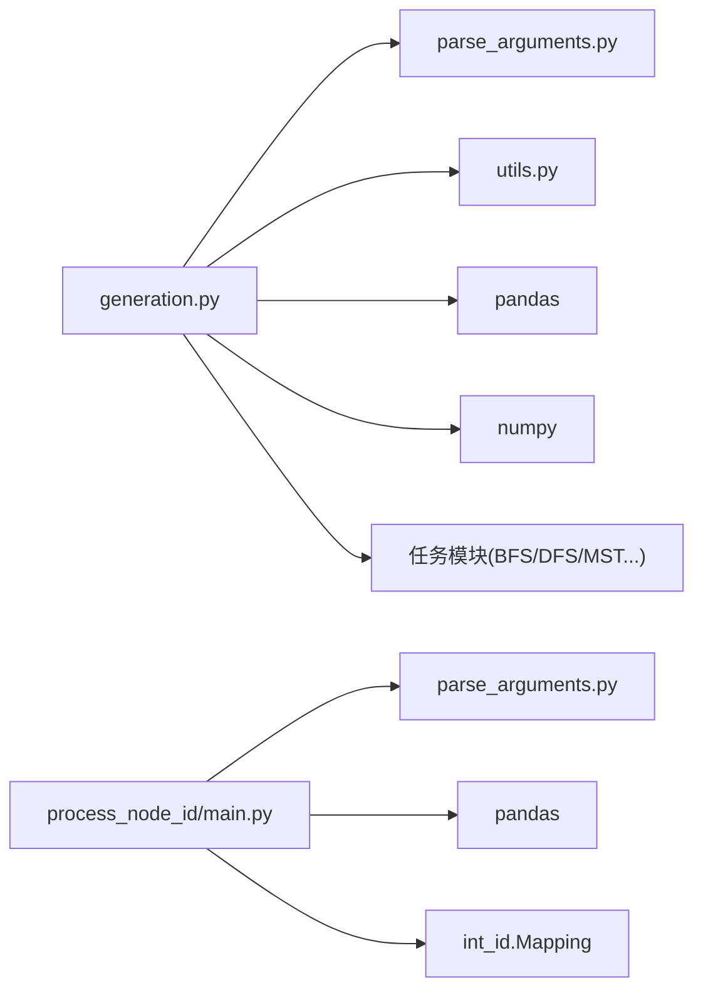

# CSV输出

<cite>
**本文引用的文件**
- [generation.py](file://GTG/generation.py)
- [BFS.sh](file://script/dataset_generation/BFS.sh)
- [DFS.sh](file://script/dataset_generation/DFS.sh)
- [MST.sh](file://script/dataset_generation/MST.sh)
- [main.py](file://GTG/process_node_id/main.py)
- [int_id.py](file://GTG/process_node_id/int_id.py)
- [utils.py](file://GTG/utils/utils.py)
- [parse_arguments.py](file://GTG/utils/parse_arguments.py)
</cite>

## 目录
1. [简介](#简介)
2. [项目结构](#项目结构)
3. [核心组件](#核心组件)
4. [架构总览](#架构总览)
5. [详细组件分析](#详细组件分析)
6. [依赖关系分析](#依赖关系分析)
7. [性能考量](#性能考量)
8. [故障排查指南](#故障排查指南)
9. [结论](#结论)
10. [附录](#附录)

## 简介
本文聚焦于生成样本数据并将其写入CSV文件的完整流程，重点解释以下内容：
- 在主程序中如何通过pandas.DataFrame.from_dict构建数据框，并调用to_csv写出CSV文件；
- 文件路径由配置项config['file_output']决定；
- 自动生成并写入一个名为“id”的自增索引列；
- 将描述性统计信息保存为“-describe.csv”文件；
- 结合shell脚本中的file_output_raw变量，说明原始输出文件的命名约定与目录结构（例如：$root/$task_name.csv）；
- 提供数据字典构建过程与CSV实际格式的示例路径说明。

## 项目结构
围绕CSV输出的关键文件与脚本如下：
- Python生成器：GTG/generation.py
- 节点ID映射与二次处理：GTG/process_node_id/main.py 及其映射实现GTG/process_node_id/int_id.py
- 样例脚本：script/dataset_generation/BFS.sh、DFS.sh、MST.sh
- 工具与参数解析：GTG/utils/utils.py、GTG/utils/parse_arguments.py

图表来源
- [generation.py](file://GTG/generation.py#L1-L107)
- [BFS.sh](file://script/dataset_generation/BFS.sh#L1-L36)
- [DFS.sh](file://script/dataset_generation/DFS.sh#L1-L36)
- [MST.sh](file://script/dataset_generation/MST.sh#L1-L36)
- [main.py](file://GTG/process_node_id/main.py#L1-L58)
- [int_id.py](file://GTG/process_node_id/int_id.py#L1-L21)
- [utils.py](file://GTG/utils/utils.py#L1-L617)
- [parse_arguments.py](file://GTG/utils/parse_arguments.py#L1-L28)

章节来源
- [generation.py](file://GTG/generation.py#L1-L107)
- [BFS.sh](file://script/dataset_generation/BFS.sh#L1-L36)
- [DFS.sh](file://script/dataset_generation/DFS.sh#L1-L36)
- [MST.sh](file://script/dataset_generation/MST.sh#L1-L36)
- [main.py](file://GTG/process_node_id/main.py#L1-L58)
- [int_id.py](file://GTG/process_node_id/int_id.py#L1-L21)
- [utils.py](file://GTG/utils/utils.py#L1-L617)
- [parse_arguments.py](file://GTG/utils/parse_arguments.py#L1-L28)

## 核心组件
- 生成器主流程（generation.py）
  - 解析命令行参数，设置随机种子；
  - 动态加载任务模块并生成样本；
  - 构建数据字典df_dict，填充各字段；
  - 使用pandas.DataFrame.from_dict创建DataFrame；
  - 自动添加“id”列作为自增索引；
  - 写出CSV文件（index=False）；
  - 计算并保存描述性统计到“-describe.csv”。

- Shell脚本（dataset_generation/*.sh）
  - 定义根目录与任务名；
  - 组装原始输出文件路径file_output_raw（形如$root/$task_name.csv）；
  - 调用Python生成器并将file_output传入；
  - 对同一原始CSV进行两次处理，分别输出int_id与letter_id版本。

- 节点ID映射（process_node_id/main.py）
  - 读取原始CSV；
  - 基于Mapping类对graph/graph_adj/graph_nl/nodes/question/answer等字段进行节点ID替换；
  - 重新写出CSV文件。

章节来源
- [generation.py](file://GTG/generation.py#L1-L107)
- [BFS.sh](file://script/dataset_generation/BFS.sh#L1-L36)
- [DFS.sh](file://script/dataset_generation/DFS.sh#L1-L36)
- [MST.sh](file://script/dataset_generation/MST.sh#L1-L36)
- [main.py](file://GTG/process_node_id/main.py#L1-L58)
- [int_id.py](file://GTG/process_node_id/int_id.py#L1-L21)

## 架构总览
下图展示了从脚本到生成器再到CSV输出的整体流程，以及描述性统计的附加输出。

图表来源
- [generation.py](file://GTG/generation.py#L1-L107)
- [BFS.sh](file://script/dataset_generation/BFS.sh#L1-L36)
- [DFS.sh](file://script/dataset_generation/DFS.sh#L1-L36)
- [MST.sh](file://script/dataset_generation/MST.sh#L1-L36)

## 详细组件分析

### 生成器主流程（generation.py）
- 参数解析与随机种子
  - 使用parse_arguments()解析命令行参数；
  - 若提供seed则直接设置；否则基于task与hash_str计算哈希种子；
  - 依据--task动态选择任务模块。

- 样本生成与示例输出
  - 先生成一个样例并在控制台打印；
  - 将前10个样例写入“-example.txt”。

- 数据字典构建与DataFrame创建
  - 初始化df_dict，键来自第一个样本的键集合；
  - 循环生成num_samples个样本，逐条追加到df_dict；
  - 使用pandas.DataFrame.from_dict(df_dict)创建DataFrame。

- 写出CSV与索引列
  - 自动添加“id”列，值为0..len(df)-1；
  - 调用to_csv(config['file_output'], index=False)写出CSV。

- 描述性统计与额外CSV
  - 从num_edges、num_nodes、directed等列派生平均度、是否定向等特征；
  - 调用df.describe()生成统计摘要；
  - 写出“-describe.csv”，index=True保留行标签。

图表来源
- [generation.py](file://GTG/generation.py#L1-L107)

章节来源
- [generation.py](file://GTG/generation.py#L1-L107)
- [parse_arguments.py](file://GTG/utils/parse_arguments.py#L1-L28)
- [utils.py](file://GTG/utils/utils.py#L1-L617)

### Shell脚本中的文件命名与目录结构
- 目录结构约定
  - 根目录=data_root，按任务名创建子目录；
  - 原始输出文件命名为$root/$task_name.csv；
  - 处理后输出分别为$root/$task_name-int_id.csv与$root/$task_name-letter_id.csv。

- 关键变量与调用链
  - file_output_raw=$root/$task_name.csv；
  - python -m GTG.generation --file_output $file_output_raw；
  - 后续调用process_node_id.main分别进行int_id与letter_id转换。

图表来源
- [BFS.sh](file://script/dataset_generation/BFS.sh#L1-L36)
- [DFS.sh](file://script/dataset_generation/DFS.sh#L1-L36)
- [MST.sh](file://script/dataset_generation/MST.sh#L1-L36)

章节来源
- [BFS.sh](file://script/dataset_generation/BFS.sh#L1-L36)
- [DFS.sh](file://script/dataset_generation/DFS.sh#L1-L36)
- [MST.sh](file://script/dataset_generation/MST.sh#L1-L36)

### 节点ID映射与二次处理（process_node_id/main.py）
- 输入与映射
  - 读取原始CSV（config['file_input']）；
  - 基于id类型选择Mapping类（int_id或letter_id）；
  - 对graph/graph_adj/graph_nl/nodes/question/answer等字段执行节点ID替换。

- 输出
  - 重建df_dict并写入新的CSV（config['file_output']），index=False。

图表来源
- [main.py](file://GTG/process_node_id/main.py#L1-L58)
- [int_id.py](file://GTG/process_node_id/int_id.py#L1-L21)

章节来源
- [main.py](file://GTG/process_node_id/main.py#L1-L58)
- [int_id.py](file://GTG/process_node_id/int_id.py#L1-L21)

## 依赖关系分析
- generation.py
  - 依赖parse_arguments.py解析参数；
  - 依赖utils.py中的make_sample、display_sample、NID等工具；
  - 依赖pandas/numpy进行数据框与统计计算；
  - 依赖任务模块（如BFS/DFS/MST等）生成样本。

- process_node_id/main.py
  - 依赖parse_arguments.py解析参数；
  - 依赖pandas进行读写；
  - 依赖int_id.Mapping进行节点ID映射。

图表来源
- [generation.py](file://GTG/generation.py#L1-L107)
- [parse_arguments.py](file://GTG/utils/parse_arguments.py#L1-L28)
- [utils.py](file://GTG/utils/utils.py#L1-L617)
- [main.py](file://GTG/process_node_id/main.py#L1-L58)
- [int_id.py](file://GTG/process_node_id/int_id.py#L1-L21)

章节来源
- [generation.py](file://GTG/generation.py#L1-L107)
- [main.py](file://GTG/process_node_id/main.py#L1-L58)
- [parse_arguments.py](file://GTG/utils/parse_arguments.py#L1-L28)
- [utils.py](file://GTG/utils/utils.py#L1-L617)
- [int_id.py](file://GTG/process_node_id/int_id.py#L1-L21)

## 性能考量
- 数据字典构建
  - 使用字典列表式累积，避免频繁的DataFrame append操作，提高写入效率；
  - 最终一次性from_dict创建DataFrame，减少中间对象开销。

- 统计计算
  - 使用向量化NumPy数组运算（如ave_degree、is_directed）提升速度；
  - describe()在内存中完成，适合中等规模数据集。

- I/O优化
  - 一次写入主CSV与一次写入-describe.csv，避免重复读取；
  - index=False减少索引列写入开销。

[本节为通用建议，不直接分析具体文件]

## 故障排查指南
- 文件未生成或路径错误
  - 检查--file_output参数是否正确传入；
  - 确认脚本中file_output_raw路径存在且可写。

- CSV列缺失或顺序异常
  - 确保每个样本包含一致的键集合；
  - 样本生成逻辑需保证make_sample返回的字段完整。

- 描述性统计为空或NaN
  - 检查num_edges、num_nodes、directed等列是否正确填充；
  - 确保数据类型兼容（整数/布尔）。

- 节点ID映射失败
  - 确认graph/graph_adj/graph_nl等字符串中包含正确的节点占位符；
  - 检查Mapping初始化时是否能提取到节点ID范围。

章节来源
- [generation.py](file://GTG/generation.py#L1-L107)
- [main.py](file://GTG/process_node_id/main.py#L1-L58)
- [int_id.py](file://GTG/process_node_id/int_id.py#L1-L21)

## 结论
- generation.py通过pandas.DataFrame.from_dict高效构建数据框，并以index=False写出CSV；
- 自动生成“id”列作为自增索引，便于后续处理与追踪；
- 通过df.describe()生成描述性统计，并以“-describe.csv”形式保存；
- shell脚本统一规范了原始输出文件命名与目录结构，便于批量处理与后续ID映射；
- process_node_id模块对graph等字段进行节点ID替换，支持int_id与letter_id两种输出变体。

[本节为总结，不直接分析具体文件]

## 附录

### 数据字典构建与CSV格式要点
- 数据字典构建
  - 初始化df_dict，键来自首个样本的键集合；
  - 循环生成样本，将每个键对应的值追加到df_dict[key]；
  - 最终from_dict创建DataFrame。

- CSV写出
  - 主CSV：config['file_output']，index=False；
  - 统计CSV：config['file_output'] + "-describe.csv"，index=True。

- 示例路径说明
  - 原始输出：$root/$task_name.csv；
  - int_id输出：$root/$task_name-int_id.csv；
  - letter_id输出：$root/$task_name-letter_id.csv。

章节来源
- [generation.py](file://GTG/generation.py#L1-L107)
- [BFS.sh](file://script/dataset_generation/BFS.sh#L1-L36)
- [DFS.sh](file://script/dataset_generation/DFS.sh#L1-L36)
- [MST.sh](file://script/dataset_generation/MST.sh#L1-L36)
- [main.py](file://GTG/process_node_id/main.py#L1-L58)
- [int_id.py](file://GTG/process_node_id/int_id.py#L1-L21)