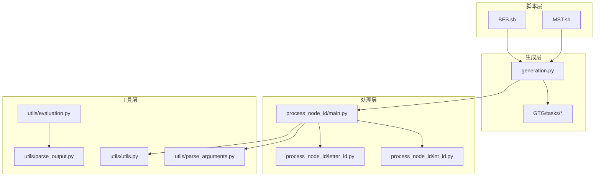
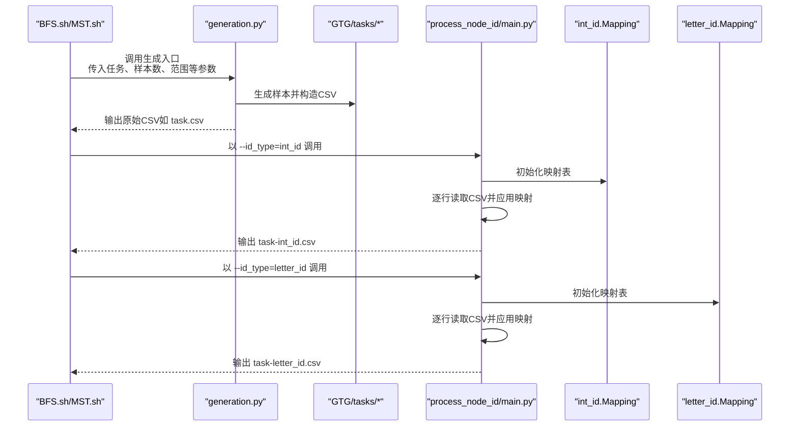
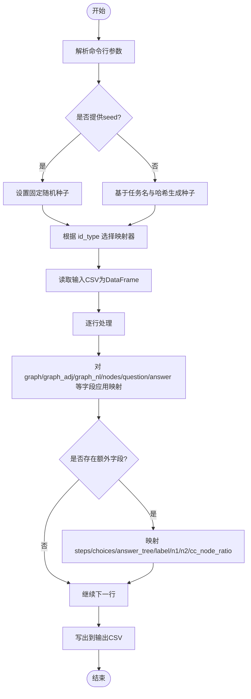
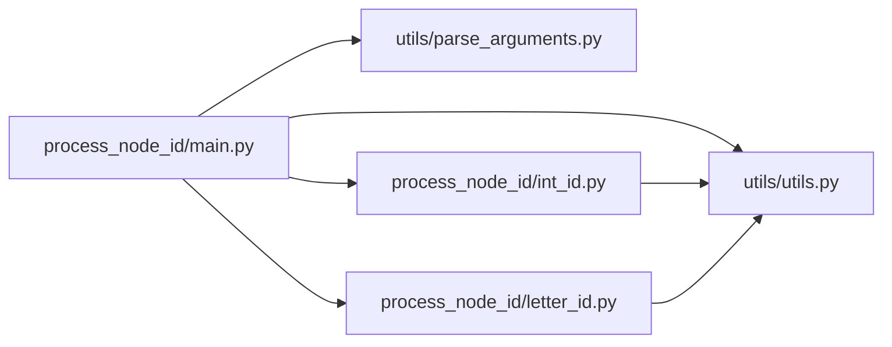

# 节点ID处理

<cite>
**本文引用的文件列表**
- [main.py](file://GTG/process_node_id/main.py)
- [int_id.py](file://GTG/process_node_id/int_id.py)
- [letter_id.py](file://GTG/process_node_id/letter_id.py)
- [parse_arguments.py](file://GTG/utils/parse_arguments.py)
- [utils.py](file://GTG/utils/utils.py)
- [generation.py](file://GTG/generation.py)
- [BFS.sh](file://script/dataset_generation/BFS.sh)
- [MST.sh](file://script/dataset_generation/MST.sh)
- [BFS.py](file://GTG/tasks/BFS/BFS.py)
- [MST.py](file://GTG/tasks/MST/MST.py)
- [evaluation.py](file://GTG/utils/evaluation.py)
- [parse_output.py](file://GTG/utils/parse_output.py)
</cite>

## 目录
1. [简介](#简介)
2. [项目结构](#项目结构)
3. [核心组件](#核心组件)
4. [架构总览](#架构总览)
5. [详细组件分析](#详细组件分析)
6. [依赖关系分析](#依赖关系分析)
7. [性能考量](#性能考量)
8. [故障排查指南](#故障排查指南)
9. [结论](#结论)
10. [附录](#附录)

## 简介
本文围绕 shell 脚本如何调用 GTG.process_node_id.main 模块进行“节点ID后处理”的完整流程展开，重点说明：
- 如何以两种模式（int_id 与 letter_id）调用该模块；
- 将原始 CSV 文件中的整数节点ID转换为字母ID的具体机制；
- 命令行接口（--id_type、--file_input、--file_output）及内部处理逻辑；
- 输出文件命名模式（如 $task_name-${id_type}.csv）与目录组织方式；
- 多ID类型输出对下游任务（评测与解析）的价值。

## 项目结构
与本主题直接相关的模块与脚本分布如下：
- GTG/process_node_id：包含主入口与两类ID映射实现
- GTG/utils：通用工具与参数解析
- GTG/generation：任务数据生成入口
- script/dataset_generation：各任务的批量生成与后处理脚本
- GTG/tasks/*：具体任务的数据样本生成逻辑
- GTG/utils/evaluation 与 GTG/utils/parse_output：下游评测与输出解析

图表来源
- [BFS.sh](file://script/dataset_generation/BFS.sh#L1-L36)
- [MST.sh](file://script/dataset_generation/MST.sh#L1-L36)
- [generation.py](file://GTG/generation.py#L1-L107)
- [main.py](file://GTG/process_node_id/main.py#L1-L58)
- [int_id.py](file://GTG/process_node_id/int_id.py#L1-L21)
- [letter_id.py](file://GTG/process_node_id/letter_id.py#L1-L33)
- [parse_arguments.py](file://GTG/utils/parse_arguments.py#L1-L28)
- [utils.py](file://GTG/utils/utils.py#L56-L64)
- [evaluation.py](file://GTG/utils/evaluation.py#L1-L200)
- [parse_output.py](file://GTG/utils/parse_output.py#L1-L200)

章节来源
- [BFS.sh](file://script/dataset_generation/BFS.sh#L1-L36)
- [MST.sh](file://script/dataset_generation/MST.sh#L1-L36)
- [generation.py](file://GTG/generation.py#L1-L107)
- [main.py](file://GTG/process_node_id/main.py#L1-L58)

## 核心组件
- 命令行接口与入口
  - 参数：--id_type、--file_input、--file_output 等（由 parse_arguments 提供）
  - 入口函数 main() 完成参数解析、随机种子设置、按 id_type 选择映射器、逐行读取并处理、写出结果
- 映射器实现
  - int_id：将形如 <u> 的节点ID映射为字符串 "u"
  - letter_id：从原始文本中提取节点ID集合，生成长度为3的随机大写字母组合作为新ID，并建立双向映射
- 工具与格式化
  - utils.NID：统一将节点ID格式化为 "<u>" 形式，便于识别与替换
- 数据结构与字段
  - 输入CSV包含 graph/graph_adj/graph_nl/nodes/question/answer 等字段；处理时对这些字段逐一应用映射器

章节来源
- [parse_arguments.py](file://GTG/utils/parse_arguments.py#L1-L28)
- [main.py](file://GTG/process_node_id/main.py#L1-L58)
- [int_id.py](file://GTG/process_node_id/int_id.py#L1-L21)
- [letter_id.py](file://GTG/process_node_id/letter_id.py#L1-L33)
- [utils.py](file://GTG/utils/utils.py#L56-L64)

## 架构总览
下面的序列图展示了从脚本到最终输出的端到端流程，涵盖生成、后处理与输出命名。

图表来源
- [BFS.sh](file://script/dataset_generation/BFS.sh#L1-L36)
- [MST.sh](file://script/dataset_generation/MST.sh#L1-L36)
- [generation.py](file://GTG/generation.py#L1-L107)
- [main.py](file://GTG/process_node_id/main.py#L1-L58)
- [int_id.py](file://GTG/process_node_id/int_id.py#L1-L21)
- [letter_id.py](file://GTG/process_node_id/letter_id.py#L1-L33)

## 详细组件分析

### 命令行接口与入口流程
- 参数解析
  - 使用 parse_arguments 提供 --id_type、--file_input、--file_output 等参数
- 随机性控制
  - 若配置含 seed，则固定随机种子；否则根据任务名与哈希字符串生成种子
- 映射器选择
  - 根据 id_type 选择 int_id 或 letter_id 的 Mapping 类
- 数据读取与写入
  - 读取 CSV 为 DataFrame，逐行遍历，对 graph/graph_adj/graph_nl/nodes/question/answer 等字段应用映射器
  - 特殊字段处理：MST 任务额外处理 answer_tree；存在 steps/choices/label/n1/n2/cc_node_ratio 等字段时也一并映射
  - 写出为新的 CSV 文件

图表来源
- [parse_arguments.py](file://GTG/utils/parse_arguments.py#L1-L28)
- [main.py](file://GTG/process_node_id/main.py#L1-L58)

章节来源
- [parse_arguments.py](file://GTG/utils/parse_arguments.py#L1-L28)
- [main.py](file://GTG/process_node_id/main.py#L1-L58)

### int_id 模式映射规则
- 提取策略
  - 从输入文本中提取所有形如 <u> 的节点ID，得到节点集合
  - 计算节点总数 num_nodes，并建立从 NID(u) 到字符串 "u" 的映射
- 替换策略
  - 对 graph/graph_adj/graph_nl/nodes/question/answer 等字段逐一执行替换
- 适用场景
  - 保持数值语义，便于下游解析器直接识别整数节点ID

章节来源
- [int_id.py](file://GTG/process_node_id/int_id.py#L1-L21)
- [utils.py](file://GTG/utils/utils.py#L56-L64)

### letter_id 模式映射规则
- 提取策略
  - 从输入文本中提取所有形如 <u> 的节点ID，得到节点集合
  - 计算节点总数 num_nodes，并生成 num_nodes 个不重复的长度为3的大写字母组合作为新ID
  - 建立从 NID(u) 到字母ID 的映射
- 替换策略
  - 对 graph/graph_adj/graph_nl/nodes/question/answer 等字段逐一执行替换
- 适用场景
  - 使节点ID更具可读性与可解释性，降低模型对数字敏感度，提升泛化能力

章节来源
- [letter_id.py](file://GTG/process_node_id/letter_id.py#L1-L33)
- [utils.py](file://GTG/utils/utils.py#L56-L64)

### 输出文件命名与目录组织
- 命名模式
  - 原始CSV：$root/$task_name.csv
  - 后处理输出：$root/$task_name-${id_type}.csv
- 目录组织
  - 每个任务在 data_root 下创建独立子目录，存放原始与两种ID类型的CSV文件

章节来源
- [BFS.sh](file://script/dataset_generation/BFS.sh#L1-L36)
- [MST.sh](file://script/dataset_generation/MST.sh#L1-L36)

### 多ID类型输出对下游任务的价值
- 统一节点ID格式
  - 通过 utils.NID 统一将节点ID格式化为 "<u>"，便于正则匹配与替换
- 评测与解析
  - evaluation 与 parse_output 提供多种解析器，支持布尔、整数、浮点、节点列表/集合等解析
  - 在解析过程中可移除或校验节点ID，确保评测一致性
- 任务差异
  - 不同任务可能包含不同字段（如 MST 的 answer_tree），process_node_id.main 会自动识别并映射相应字段

章节来源
- [utils.py](file://GTG/utils/utils.py#L56-L64)
- [evaluation.py](file://GTG/utils/evaluation.py#L1-L200)
- [parse_output.py](file://GTG/utils/parse_output.py#L1-L200)
- [BFS.py](file://GTG/tasks/BFS/BFS.py#L1-L200)
- [MST.py](file://GTG/tasks/MST/MST.py#L1-L200)

## 依赖关系分析
- 组件耦合
  - main.py 仅依赖 parse_arguments 与 utils（用于 NID），并通过 id_type 动态选择映射器
  - int_id 与 letter_id 依赖 utils.NID 与正则表达式
- 外部依赖
  - pandas 用于读写CSV
  - tqdm 用于进度条
- 可能的循环依赖
  - 当前模块间无循环导入迹象

图表来源
- [main.py](file://GTG/process_node_id/main.py#L1-L58)
- [parse_arguments.py](file://GTG/utils/parse_arguments.py#L1-L28)
- [utils.py](file://GTG/utils/utils.py#L56-L64)
- [int_id.py](file://GTG/process_node_id/int_id.py#L1-L21)
- [letter_id.py](file://GTG/process_node_id/letter_id.py#L1-L33)

章节来源
- [main.py](file://GTG/process_node_id/main.py#L1-L58)
- [parse_arguments.py](file://GTG/utils/parse_arguments.py#L1-L28)
- [utils.py](file://GTG/utils/utils.py#L56-L64)
- [int_id.py](file://GTG/process_node_id/int_id.py#L1-L21)
- [letter_id.py](file://GTG/process_node_id/letter_id.py#L1-L33)

## 性能考量
- 时间复杂度
  - 主要瓶颈在于逐行扫描与替换，整体约为 O(N × M)，其中 N 为样本数，M 为每行字段数量
  - letter_id 模式引入了随机字母生成，但规模通常较小，影响有限
- I/O 优化
  - 使用 pandas 一次性读取与写出，避免频繁磁盘访问
- 并发与加速
  - 当前实现为顺序处理；若样本量极大，可考虑分块处理或并行化（需谨慎保证映射一致性）

## 故障排查指南
- 常见问题
  - 输入文件路径错误：检查 --file_input 是否存在且可读
  - 输出目录不可写：确认目标目录权限
  - 字段缺失：若某样本缺少 steps/choices/answer_tree 等字段，程序会自动跳过，不影响其他字段
  - 随机性不一致：若未指定 --seed，系统会基于任务名与哈希生成种子，导致多次运行结果不同
- 定位方法
  - 查看 parse_arguments 的参数解析是否正确
  - 检查 utils.NID 的格式化是否符合预期
  - 对 letter_id 模式，确认生成的字母ID集合是否与节点数一致且无重复

章节来源
- [parse_arguments.py](file://GTG/utils/parse_arguments.py#L1-L28)
- [main.py](file://GTG/process_node_id/main.py#L1-L58)
- [utils.py](file://GTG/utils/utils.py#L56-L64)
- [letter_id.py](file://GTG/process_node_id/letter_id.py#L1-L33)

## 结论
- 通过 shell 脚本批量调用 GTG.generation 生成原始CSV，再由 GTG.process_node_id.main 以 int_id 与 letter_id 两种模式进行后处理，实现了对节点ID的统一转换与输出
- 输出文件采用 $task_name-${id_type}.csv 命名，目录按任务划分，便于管理与复现
- 多ID类型输出有助于下游评测与解析，提升模型对不同ID表示的鲁棒性与泛化能力

## 附录
- 关键实现位置参考
  - 命令行参数解析：[parse_arguments.py](file://GTG/utils/parse_arguments.py#L1-L28)
  - 主入口与处理逻辑：[main.py](file://GTG/process_node_id/main.py#L1-L58)
  - int_id 映射器：[int_id.py](file://GTG/process_node_id/int_id.py#L1-L21)
  - letter_id 映射器：[letter_id.py](file://GTG/process_node_id/letter_id.py#L1-L33)
  - 生成入口与样本字段：[generation.py](file://GTG/generation.py#L1-L107)
  - 任务示例（BFS/MST）：[BFS.py](file://GTG/tasks/BFS/BFS.py#L1-L200)、[MST.py](file://GTG/tasks/MST/MST.py#L1-L200)
  - 评测与解析工具：[evaluation.py](file://GTG/utils/evaluation.py#L1-L200)、[parse_output.py](file://GTG/utils/parse_output.py#L1-L200)