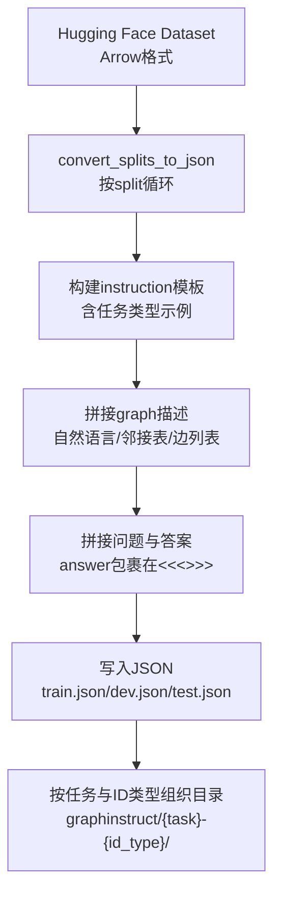
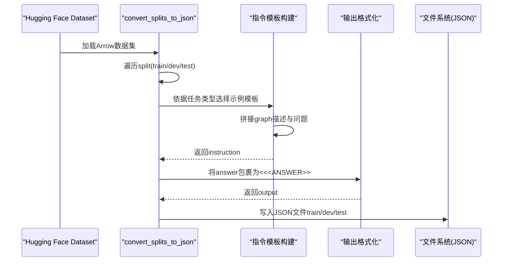
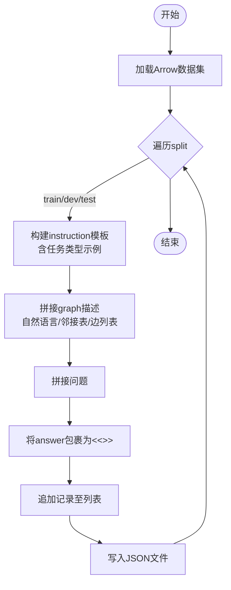
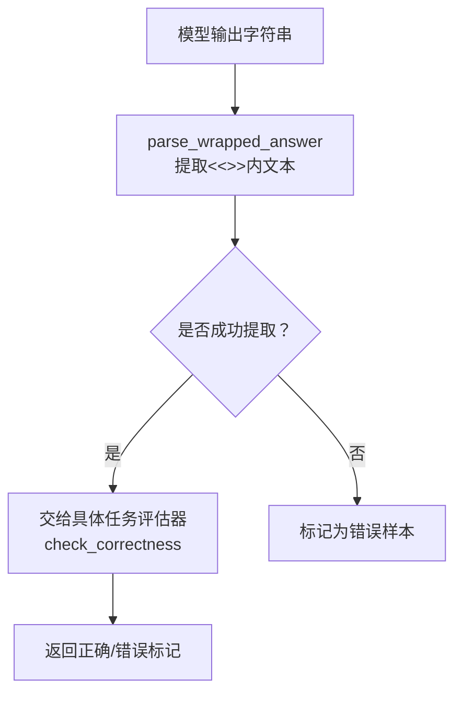
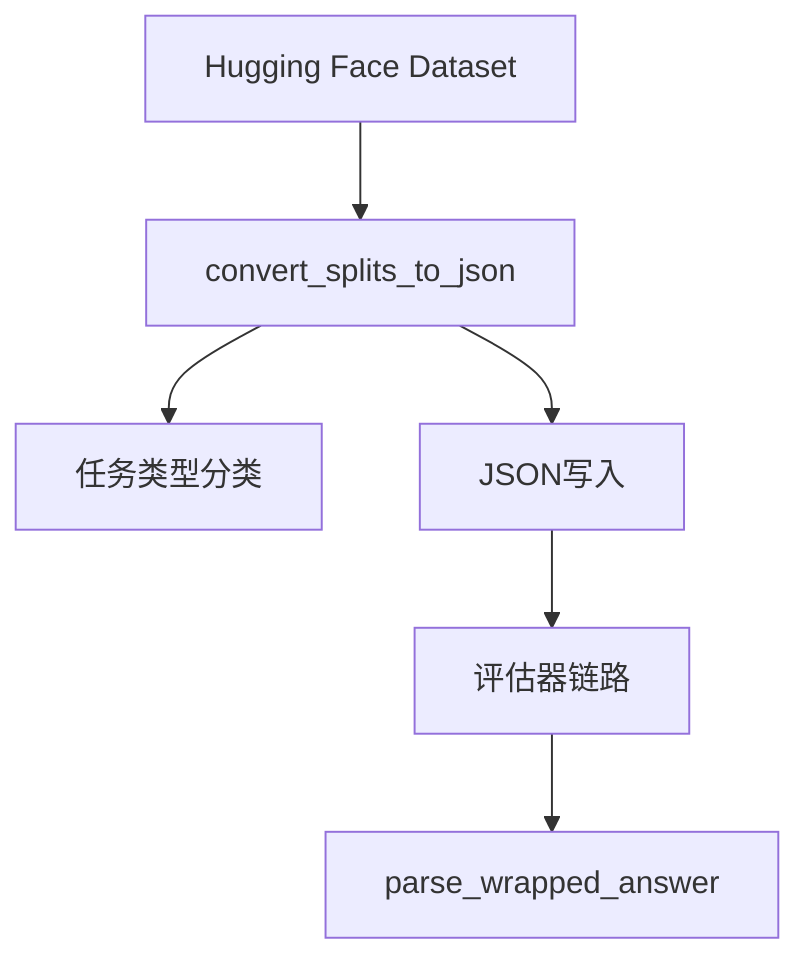

# 训练数据转换

<cite>
**本文引用的文件**
- [dataset.ipynb](file://LLaMAFactory/data/dataset.ipynb)
- [utils.py](file://GTG/utils/utils.py)
- [parse_output.py](file://GTG/utils/parse_output.py)
- [evaluation.py](file://GTG/utils/evaluation.py)
- [generation.py](file://GTG/generation.py)
- [BFS.py](file://GTG/tasks/BFS/BFS.py)
- [degree.py](file://GTG/tasks/degree/degree.py)
- [cycle.py](file://GTG/tasks/cycle/cycle.py)
- [bipartite.py](file://GTG/tasks/bipartite/bipartite.py)
- [shortest_path.py](file://GTG/tasks/shortest_path/shortest_path.py)
- [dataset_info.json](file://LLaMAFactory/data/dataset_info.json)
</cite>

## 目录
1. [简介](#简介)
2. [项目结构](#项目结构)
3. [核心组件](#核心组件)
4. [架构总览](#架构总览)
5. [详细组件分析](#详细组件分析)
6. [依赖关系分析](#依赖关系分析)
7. [性能与规模特性](#性能与规模特性)
8. [故障排查指南](#故障排查指南)
9. [结论](#结论)
10. [附录](#附录)

## 简介
本文件面向将生成的CSV/Arrow数据集转换为LLaMAFactory可直接用于监督微调（SFT）或推理的JSON格式训练样本，围绕LLaMAFactory中提供的Jupyter Notebook脚本进行系统化说明。重点覆盖以下内容：
- 如何从Hugging Face Dataset加载数据并按训练/开发/测试划分写入JSON
- 指令模板（instruction）与输出格式（output）的构建逻辑
- “<<<ANSWER>>>”标记的使用规则与解析机制
- 针对不同任务类型的动态示例构造（判断型、遍历型、数值型、配对型）
- JSON文件结构（instruction、input、output、id）与保存路径组织方式
- 训练/开发/测试集划分策略与命名约定

## 项目结构
LLaMAFactory/data/dataset.ipynb包含多套转换流程，分别针对：
- 原始Arrow数据集（msra/{task}-int_id）到JSON的转换
- 不同图描述语言（邻接表、边列表）到JSON的转换
- 字母ID与数字ID的转换
- 不同图规模（mini/medium/large）与推理步骤数据的转换

这些流程均通过统一的“convert_splits_to_json”等函数完成，将Hugging Face Dataset的每个split（train/dev/test）逐条记录转换为标准JSON样本，并按任务名与ID类型组织输出目录。

图表来源
- [dataset.ipynb](file://LLaMAFactory/data/dataset.ipynb#L56-L112)
- [dataset.ipynb](file://LLaMAFactory/data/dataset.ipynb#L355-L417)
- [dataset.ipynb](file://LLaMAFactory/data/dataset.ipynb#L499-L567)
- [dataset.ipynb](file://LLaMAFactory/data/dataset.ipynb#L668-L750)
- [dataset.ipynb](file://LLaMAFactory/data/dataset.ipynb#L808-L881)
- [dataset.ipynb](file://LLaMAFactory/data/dataset.ipynb#L927-L999)

章节来源
- [dataset.ipynb](file://LLaMAFactory/data/dataset.ipynb#L56-L112)
- [dataset.ipynb](file://LLaMAFactory/data/dataset.ipynb#L355-L417)
- [dataset.ipynb](file://LLaMAFactory/data/dataset.ipynb#L499-L567)
- [dataset.ipynb](file://LLaMAFactory/data/dataset.ipynb#L668-L750)
- [dataset.ipynb](file://LLaMAFactory/data/dataset.ipynb#L808-L881)
- [dataset.ipynb](file://LLaMAFactory/data/dataset.ipynb#L927-L999)

## 核心组件
- 数据加载与拆分：使用Hugging Face Dataset的load_from_disk加载Arrow数据集，按split（train/dev/test）迭代
- 指令模板构建：根据任务类型动态注入示例，强调最终答案必须用“<<<ANSWER>>>”包裹
- 输出格式化：将ground truth答案以“<<<答案>>>”形式写入output字段
- JSON写入：每条记录包含instruction/input/output/id四要素，按split写入对应JSON文件
- 路径组织：输出目录按“graphinstruct/{task}-{id_type}/”或“generalization/{desc_type}/{task}/”等规则组织

章节来源
- [dataset.ipynb](file://LLaMAFactory/data/dataset.ipynb#L56-L112)
- [dataset.ipynb](file://LLaMAFactory/data/dataset.ipynb#L355-L417)
- [dataset.ipynb](file://LLaMAFactory/data/dataset.ipynb#L499-L567)
- [dataset.ipynb](file://LLaMAFactory/data/dataset.ipynb#L668-L750)
- [dataset.ipynb](file://LLaMAFactory/data/dataset.ipynb#L808-L881)
- [dataset.ipynb](file://LLaMAFactory/data/dataset.ipynb#L927-L999)

## 架构总览
下图展示从原始数据到最终JSON样本的整体流程与关键节点。

图表来源
- [dataset.ipynb](file://LLaMAFactory/data/dataset.ipynb#L56-L112)
- [dataset.ipynb](file://LLaMAFactory/data/dataset.ipynb#L355-L417)
- [dataset.ipynb](file://LLaMAFactory/data/dataset.ipynb#L499-L567)
- [dataset.ipynb](file://LLaMAFactory/data/dataset.ipynb#L668-L750)
- [dataset.ipynb](file://LLaMAFactory/data/dataset.ipynb#L808-L881)
- [dataset.ipynb](file://LLaMAFactory/data/dataset.ipynb#L927-L999)

## 详细组件分析

### 组件A：convert_splits_to_json（核心转换函数）
- 输入：数据集路径、输出根目录、任务名称
- 处理流程：
  - 从本地磁盘加载Arrow数据集
  - 遍历每个split（train/dev/test）
  - 依据任务类型选择示例模板（判断/遍历/数值/配对），构造instruction
  - 读取graph描述（自然语言/邻接表/边列表）与问题
  - 将答案以“<<<ANSWER>>>”包裹作为output
  - 写入JSON文件（train.json/dev.json/test.json）

图表来源
- [dataset.ipynb](file://LLaMAFactory/data/dataset.ipynb#L56-L112)
- [dataset.ipynb](file://LLaMAFactory/data/dataset.ipynb#L355-L417)
- [dataset.ipynb](file://LLaMAFactory/data/dataset.ipynb#L499-L567)
- [dataset.ipynb](file://LLaMAFactory/data/dataset.ipynb#L668-L750)
- [dataset.ipynb](file://LLaMAFactory/data/dataset.ipynb#L808-L881)
- [dataset.ipynb](file://LLaMAFactory/data/dataset.ipynb#L927-L999)

章节来源
- [dataset.ipynb](file://LLaMAFactory/data/dataset.ipynb#L56-L112)
- [dataset.ipynb](file://LLaMAFactory/data/dataset.ipynb#L355-L417)
- [dataset.ipynb](file://LLaMAFactory/data/dataset.ipynb#L499-L567)
- [dataset.ipynb](file://LLaMAFactory/data/dataset.ipynb#L668-L750)
- [dataset.ipynb](file://LLaMAFactory/data/dataset.ipynb#L808-L881)
- [dataset.ipynb](file://LLaMAFactory/data/dataset.ipynb#L927-L999)

### 组件B：任务类型与示例模板
- 判断型（Yes/No）：示例模板要求最终输出“<<<Yes>>>”或“<<<No>>>”
- 遍历型（序列/路径）：示例模板要求最终输出形如“<<<[... , ... , ...]>>>”
- 数值型（标量）：示例模板要求最终输出形如“<<<数字>>>”
- 配对型（边集合）：示例模板要求最终输出形如“<<<[(u1,v1),(u2,v2),...]>>>”

这些模板在转换时被注入到instruction中，确保模型输出严格遵循“<<<ANSWER>>>”格式。

章节来源
- [dataset.ipynb](file://LLaMAFactory/data/dataset.ipynb#L47-L84)
- [dataset.ipynb](file://LLaMAFactory/data/dataset.ipynb#L346-L383)
- [dataset.ipynb](file://LLaMAFactory/data/dataset.ipynb#L499-L526)
- [dataset.ipynb](file://LLaMAFactory/data/dataset.ipynb#L659-L685)
- [dataset.ipynb](file://LLaMAFactory/data/dataset.ipynb#L808-L826)

### 组件C：“<<<ANSWER>>>”标记与解析机制
- 标记规则：输出必须以“<<<”开头，“>>>”结尾，且仅包含最终答案
- 解析器：parse_output.py提供parse_wrapped_answer，从模型输出中提取“<<<ANSWER>>>”内的文本
- 评估器：evaluation.py中的BaseEvaluator.eval_a_sample会先调用parse_wrapped_answer，再进入具体任务的check_correctness进行校验

图表来源
- [parse_output.py](file://GTG/utils/parse_output.py#L8-L24)
- [evaluation.py](file://GTG/utils/evaluation.py#L23-L54)

章节来源
- [parse_output.py](file://GTG/utils/parse_output.py#L8-L24)
- [evaluation.py](file://GTG/utils/evaluation.py#L23-L54)

### 组件D：JSON结构与保存路径
- JSON结构字段：
  - instruction：完整指令模板（含任务类型示例、图描述、问题）
  - input：空字符串（用于LLaMAFactory标准格式）
  - output：“<<<ANSWER>>>”包裹的答案
  - id：样本唯一标识
- 保存路径：
  - graphinstruct/{task}-{id_type}/train.json
  - graphinstruct/{task}-{id_type}/dev.json
  - graphinstruct/{task}-{id_type}/test.json
  - generalization/{desc_type}/{task}/test.json（邻接表/边列表）
  - reasoning/{task}/test.json（推理步骤数据）

章节来源
- [dataset.ipynb](file://LLaMAFactory/data/dataset.ipynb#L96-L102)
- [dataset.ipynb](file://LLaMAFactory/data/dataset.ipynb#L390-L406)
- [dataset.ipynb](file://LLaMAFactory/data/dataset.ipynb#L533-L545)
- [dataset.ipynb](file://LLaMAFactory/data/dataset.ipynb#L692-L704)
- [dataset.ipynb](file://LLaMAFactory/data/dataset.ipynb#L832-L844)

### 组件E：训练/开发/测试集划分策略
- 划分来源：Hugging Face Dataset自带train/dev/test三份split
- 写入策略：按split分别写入对应JSON文件
- 任务覆盖：脚本批量处理多个任务（如BFS、degree、cycle、bipartite等），自动创建输出目录并写入

章节来源
- [dataset.ipynb](file://LLaMAFactory/data/dataset.ipynb#L68-L112)
- [dataset.ipynb](file://LLaMAFactory/data/dataset.ipynb#L193-L224)
- [dataset.ipynb](file://LLaMAFactory/data/dataset.ipynb#L367-L417)
- [dataset.ipynb](file://LLaMAFactory/data/dataset.ipynb#L442-L450)

### 组件F：任务类型与数据来源（生成侧）
- 生成器：generation.py按任务模块生成样本，写入CSV并统计描述
- 任务实现：各任务模块（如BFS、degree、cycle、bipartite、shortest_path）定义了问题生成、推理步骤、答案生成等逻辑
- 数据结构：生成样本包含task、graph、graph_adj、graph_nl、question、answer、steps、choices、label、id等字段

章节来源
- [generation.py](file://GTG/generation.py#L11-L107)
- [BFS.py](file://GTG/tasks/BFS/BFS.py#L13-L67)
- [degree.py](file://GTG/tasks/degree/degree.py#L14-L63)
- [cycle.py](file://GTG/tasks/cycle/cycle.py#L22-L78)
- [bipartite.py](file://GTG/tasks/bipartite/bipartite.py#L21-L74)
- [shortest_path.py](file://GTG/tasks/shortest_path/shortest_path.py#L22-L91)

## 依赖关系分析
- 转换脚本依赖Hugging Face Dataset库进行数据加载
- 指令模板依赖任务类型分类（判断/遍历/数值/配对）
- 输出格式依赖parse_output.py中的“<<<ANSWER>>>”解析器
- 评估阶段依赖evaluation.py中的BaseEvaluator链路

图表来源
- [dataset.ipynb](file://LLaMAFactory/data/dataset.ipynb#L56-L112)
- [parse_output.py](file://GTG/utils/parse_output.py#L8-L24)
- [evaluation.py](file://GTG/utils/evaluation.py#L23-L54)

章节来源
- [dataset.ipynb](file://LLaMAFactory/data/dataset.ipynb#L56-L112)
- [parse_output.py](file://GTG/utils/parse_output.py#L8-L24)
- [evaluation.py](file://GTG/utils/evaluation.py#L23-L54)

## 性能与规模特性
- 数据规模：脚本批量处理多个任务，每个任务包含train/dev/test三份split，单个split通常数千条样本
- I/O开销：主要集中在JSON写入，建议在批量转换时控制并发与缓冲
- 可扩展性：通过任务类型分类与模板注入，易于新增任务类型；路径组织清晰，便于后续扩展

[本节为通用指导，不直接分析具体文件]

## 故障排查指南
- 输出未包裹“<<<ANSWER>>>”：评估器无法提取答案，导致correct字段为0
- 任务类型不匹配：示例模板与实际答案格式不符，导致模型输出不符合规范
- graph描述缺失：若graph_nl/graph_adj/graph为空，instruction拼接不完整
- split名称异常：仅支持train/dev/test，其他名称需调整脚本

章节来源
- [evaluation.py](file://GTG/utils/evaluation.py#L23-L54)
- [parse_output.py](file://GTG/utils/parse_output.py#L8-L24)
- [dataset.ipynb](file://LLaMAFactory/data/dataset.ipynb#L56-L112)

## 结论
通过LLaMAFactory的dataset.ipynb脚本，可以将Hugging Face Dataset中的Arrow数据高效转换为标准JSON格式，统一规范“<<<ANSWER>>>”输出格式，并按任务类型与ID类型组织输出目录。该流程具备良好的可扩展性与可维护性，适合大规模图推理任务的训练数据准备。

[本节为总结性内容，不直接分析具体文件]

## 附录
- 数据集信息配置：dataset_info.json中定义了训练数据映射与列名映射，便于LLaMAFactory加载与训练
- 示例JSON结构参考：alpaca_en_demo.json展示了标准的instruction/input/output/id字段组织方式

章节来源
- [dataset_info.json](file://LLaMAFactory/data/dataset_info.json#L1-L160)
- [alpaca_en_demo.json](file://LLaMAFactory/data/alpaca_en_demo.json#L1-L200)