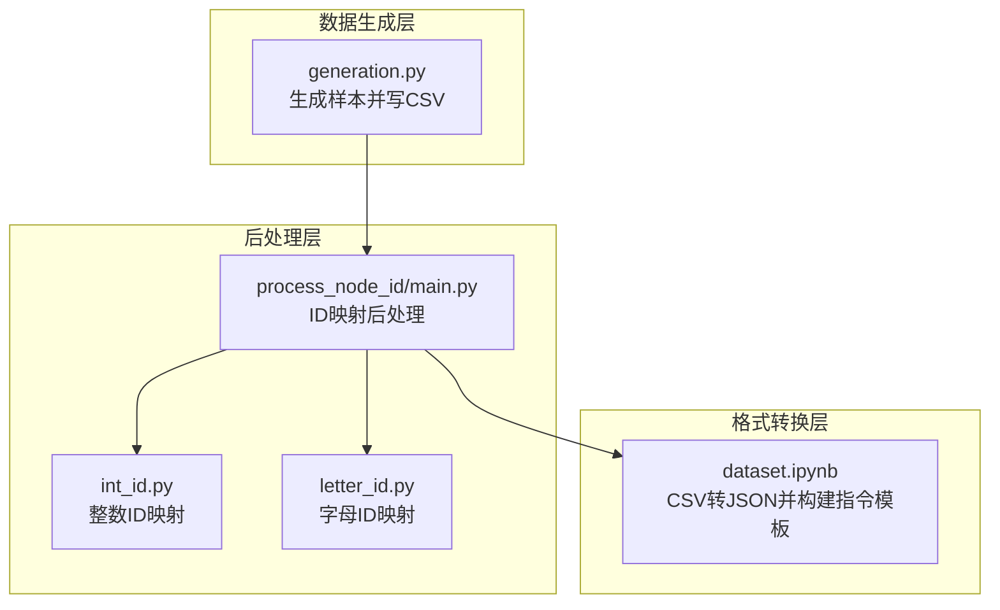
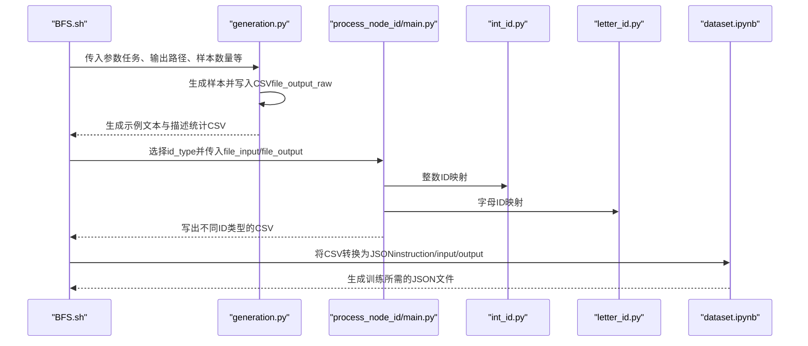
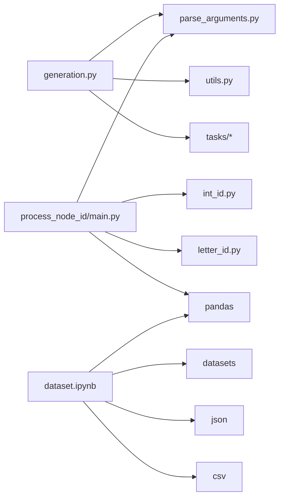

# 输出格式化

<cite>
**本文引用的文件**
- [generation.py](file://GTG/generation.py)
- [process_node_id/main.py](file://GTG/process_node_id/main.py)
- [process_node_id/int_id.py](file://GTG/process_node_id/int_id.py)
- [process_node_id/letter_id.py](file://GTG/process_node_id/letter_id.py)
- [utils/utils.py](file://GTG/utils/utils.py)
- [utils/parse_arguments.py](file://GTG/utils/parse_arguments.py)
- [script/dataset_generation/BFS.sh](file://script/dataset_generation/BFS.sh)
- [LLaMAFactory/data/dataset.ipynb](file://LLaMAFactory/data/dataset.ipynb)
</cite>

## 目录
1. [简介](#简介)
2. [项目结构](#项目结构)
3. [核心组件](#核心组件)
4. [架构总览](#架构总览)
5. [详细组件分析](#详细组件分析)
6. [依赖关系分析](#依赖关系分析)
7. [性能考量](#性能考量)
8. [故障排查指南](#故障排查指南)
9. [结论](#结论)
10. [附录](#附录)

## 简介
本文件聚焦于“生成样本的输出流程与格式化机制”，围绕以下目标展开：
- 解释 generation.py 如何将生成的样本写入 CSV 文件，包括文件路径的确定（如 file_output_raw）与字段定义。
- 说明 shell 脚本如何调用 process_node_id.main 模块，将整数节点 ID 转换为字母 ID 的后处理流程，并生成不同 ID 类型的输出文件。
- 结合 dataset.ipynb 中的内容，阐述 CSV 文件如何进一步转换为 JSON 格式以供 LLaMAFactory 训练使用，包括指令模板的构建与答案格式化要求（如 <<<ANSWER>>> 标记）。
- 提供输出文件的目录结构示例与下游使用指南。

## 项目结构
该功能链路涉及三个层面：
- 数据生成层：GTG/generation.py 负责生成样本并写入 CSV。
- 后处理层：GTG/process_node_id/main.py 将节点 ID 从整数映射到字母或保持整数，再次写回 CSV。
- 格式转换层：LLaMAFactory/data/dataset.ipynb 将 CSV 转换为 JSON，构建 instruction/input/output，并按任务类型格式化答案。

图表来源
- [generation.py](file://GTG/generation.py#L1-L107)
- [process_node_id/main.py](file://GTG/process_node_id/main.py#L1-L58)
- [process_node_id/int_id.py](file://GTG/process_node_id/int_id.py#L1-L21)
- [process_node_id/letter_id.py](file://GTG/process_node_id/letter_id.py#L1-L33)
- [LLaMAFactory/data/dataset.ipynb](file://LLaMAFactory/data/dataset.ipynb#L1-L112)

章节来源
- [generation.py](file://GTG/generation.py#L1-L107)
- [process_node_id/main.py](file://GTG/process_node_id/main.py#L1-L58)
- [LLaMAFactory/data/dataset.ipynb](file://LLaMAFactory/data/dataset.ipynb#L1-L112)

## 核心组件
- generation.py：解析参数、生成样本、统计特征、写入 CSV；生成示例文本文件与描述性统计 CSV。
- process_node_id/main.py：根据配置选择映射策略（整数ID或字母ID），对 graph/graph_adj/graph_nl/nodes/question/answer/steps/choices 等字段进行统一替换，再写回 CSV。
- int_id.py/letter_id.py：实现节点 ID 的映射逻辑，分别将占位符 <u> 替换为整数或随机字母组合。
- utils/utils.py：提供 NID、字符串哈希、样本展示、图结构序列化等工具函数。
- utils/parse_arguments.py：统一解析命令行参数。
- dataset.ipynb：将 Arrow 数据集或 CSV 转换为 JSON，构造 instruction/input/output，并按任务类型格式化答案。

章节来源
- [generation.py](file://GTG/generation.py#L1-L107)
- [process_node_id/main.py](file://GTG/process_node_id/main.py#L1-L58)
- [process_node_id/int_id.py](file://GTG/process_node_id/int_id.py#L1-L21)
- [process_node_id/letter_id.py](file://GTG/process_node_id/letter_id.py#L1-L33)
- [utils/utils.py](file://GTG/utils/utils.py#L1-L200)
- [utils/parse_arguments.py](file://GTG/utils/parse_arguments.py#L1-L28)
- [LLaMAFactory/data/dataset.ipynb](file://LLaMAFactory/data/dataset.ipynb#L1-L112)

## 架构总览
下图展示了从生成到转换的端到端流程，标注了关键文件与职责。

图表来源
- [script/dataset_generation/BFS.sh](file://script/dataset_generation/BFS.sh#L1-L36)
- [generation.py](file://GTG/generation.py#L1-L107)
- [process_node_id/main.py](file://GTG/process_node_id/main.py#L1-L58)
- [process_node_id/int_id.py](file://GTG/process_node_id/int_id.py#L1-L21)
- [process_node_id/letter_id.py](file://GTG/process_node_id/letter_id.py#L1-L33)
- [LLaMAFactory/data/dataset.ipynb](file://LLaMAFactory/data/dataset.ipynb#L1-L112)

## 详细组件分析

### generation.py：样本生成与CSV写出
- 参数解析与随机种子设置：通过 parse_arguments 获取任务、输出路径、样本数量等；若未指定 seed，则基于任务名与 hash_str 进行哈希得到固定种子，确保可复现性。
- 任务模块加载：根据任务名动态导入对应任务模块，调用 generate_a_sample(config) 生成单个样本。
- 示例输出：生成 10 个样本写入 -example.txt 文件，便于快速预览。
- 批量生成与写出：循环生成样本，累积到字典，最后转换为 DataFrame 并追加 id 列，写出 CSV。
- 统计信息：计算平均度、是否为有向图、平均度除以节点数等列，并写出 describe.csv。

字段定义（来自生成样本字典与写出逻辑）：
- 必填字段：task、graph、graph_adj、graph_nl、nodes、num_nodes、num_edges、directed、question、answer、id。
- 可选字段：steps、choices、label、n1、n2、answer_tree、cc_node_ratio 等（由具体任务决定是否包含）。
- 文件路径：由 --file_output 指定，例如在 BFS.sh 中设置为 data_root/BFS/BFS.csv（raw 原始 CSV）。

章节来源
- [generation.py](file://GTG/generation.py#L1-L107)
- [utils/parse_arguments.py](file://GTG/utils/parse_arguments.py#L1-L28)
- [utils/utils.py](file://GTG/utils/utils.py#L1-L200)
- [script/dataset_generation/BFS.sh](file://script/dataset_generation/BFS.sh#L1-L36)

### process_node_id/main.py：ID类型后处理与写出
- 参数解析：支持 id_type（int_id 或 letter_id）、file_input、file_output。
- 映射策略选择：根据 id_type 选择 Mapping 实现。
- 行级处理：逐行读取 CSV，对 graph/graph_adj/graph_nl/nodes/question/answer/steps/choices 等字段执行映射；对特定任务（如 MST）额外处理 answer_tree；保留其他字段不变。
- 写出：将映射后的记录重新组装为 DataFrame 并写出 CSV。

章节来源
- [process_node_id/main.py](file://GTG/process_node_id/main.py#L1-L58)
- [process_node_id/int_id.py](file://GTG/process_node_id/int_id.py#L1-L21)
- [process_node_id/letter_id.py](file://GTG/process_node_id/letter_id.py#L1-L33)
- [utils/parse_arguments.py](file://GTG/utils/parse_arguments.py#L1-L28)

### int_id.py 与 letter_id.py：ID映射实现
- 整数ID映射（int_id.py）：
  - 从输入字符串中提取所有形如 <u> 的节点占位符，去重后建立映射表，将占位符替换为整数形式。
- 字母ID映射（letter_id.py）：
  - 从输入字符串中提取所有形如 <u> 的节点占位符，去重后生成不重复的随机字母组合作为新名称，建立映射表，将占位符替换为字母形式。
- 共同点：均以 NID 占位符格式 <u> 作为识别依据，保证与生成阶段一致。

章节来源
- [process_node_id/int_id.py](file://GTG/process_node_id/int_id.py#L1-L21)
- [process_node_id/letter_id.py](file://GTG/process_node_id/letter_id.py#L1-L33)
- [utils/utils.py](file://GTG/utils/utils.py#L1-L200)

### dataset.ipynb：CSV到JSON的转换与指令模板
- 转换流程：
  - 读取 Arrow 数据集或 CSV。
  - 针对每个 split（train/dev/test），遍历记录，根据 directed 字段判断图类型。
  - 构建 instruction：包含任务名、图类型、自然语言描述 graph_nl 与问题 question。
  - 构建 output：将 answer 包裹在 <<<ANSWER>>> 标记中；对于带步骤的任务，将 steps 与最终答案拼接为 “步骤内容 <<<答案>>>”。
  - 写出 JSON 文件，字段为 instruction、input、output、id。
- 任务类型示例：
  - 判断类（type_1）：示例为 <<<Yes>>>。
  - 遍历类（type_2）：示例为 <<<[...列表...]>>>。
  - 数值类（type_3）：示例为 <<<数值>>>。
  - 配对类（type_4）：示例为 <<<[(a,b),(c,d)]>>>。
- 其他转换：
  - 支持将 Arrow 数据集导出为 CSV。
  - 支持将 CSV 转换为 JSON 的多场景：in-domain、OOD 图描述语言（邻接表/边列表）、OOD 图规模（mini/medium/large）、推理步骤（reasoning small）等。

章节来源
- [LLaMAFactory/data/dataset.ipynb](file://LLaMAFactory/data/dataset.ipynb#L1-L112)
- [LLaMAFactory/data/dataset.ipynb](file://LLaMAFactory/data/dataset.ipynb#L113-L451)
- [LLaMAFactory/data/dataset.ipynb](file://LLaMAFactory/data/dataset.ipynb#L452-L751)
- [LLaMAFactory/data/dataset.ipynb](file://LLaMAFactory/data/dataset.ipynb#L752-L1032)

## 依赖关系分析
- generation.py 依赖：
  - utils/parse_arguments.py：参数解析。
  - utils/utils.py：NID、字符串哈希、样本展示、图结构序列化等。
  - 各任务模块（tasks/*）：动态导入并调用 generate_a_sample/on_finished。
- process_node_id/main.py 依赖：
  - utils/parse_arguments.py：参数解析。
  - int_id.py/letter_id.py：映射实现。
  - pandas：读写 CSV。
- dataset.ipynb 依赖：
  - datasets：读取 Arrow 数据集。
  - pandas/json/csv：读写 CSV/JSON。
  - os：目录创建与文件路径拼接。

图表来源
- [generation.py](file://GTG/generation.py#L1-L107)
- [utils/parse_arguments.py](file://GTG/utils/parse_arguments.py#L1-L28)
- [utils/utils.py](file://GTG/utils/utils.py#L1-L200)
- [process_node_id/main.py](file://GTG/process_node_id/main.py#L1-L58)
- [process_node_id/int_id.py](file://GTG/process_node_id/int_id.py#L1-L21)
- [process_node_id/letter_id.py](file://GTG/process_node_id/letter_id.py#L1-L33)
- [LLaMAFactory/data/dataset.ipynb](file://LLaMAFactory/data/dataset.ipynb#L1-L112)

## 性能考量
- 生成阶段：
  - 使用 tqdm 进度条显示批量生成过程，避免长时间无反馈。
  - 采用字典收集样本，最后一次性转换为 DataFrame，减少多次 IO。
- 后处理阶段：
  - 对每行字段逐一映射，注意字段数量较多时的字符串替换开销；可通过批量替换或正则优化减少重复扫描。
- 转换阶段：
  - CSV/JSON 转换为大文件时建议分批处理或使用流式写入，避免内存峰值过高。
  - 指令模板拼接为字符串操作，注意长文本拼接的内存占用。

## 故障排查指南
- 生成 CSV 缺少字段
  - 确认任务模块返回的样本字典包含 graph/graph_adj/graph_nl/nodes/num_nodes/num_edges/directed/question/answer 等必要字段。
  - 若任务包含 steps/choices/label 等可选字段，需确保在生成阶段正确填充。
- ID 映射无效
  - 检查输入字符串是否使用 NID 占位符格式 <u>，否则无法匹配映射规则。
  - 确认映射策略（int_id/letter_id）与生成阶段一致。
- JSON 转换失败
  - 确认 CSV 字段与转换脚本期望一致（如 directed、graph_nl、question、answer、id）。
  - 检查任务类型分类（type_1/type_2/type_3/type_4）是否覆盖当前任务。
- 输出路径错误
  - 在 shell 脚本中确认 file_output_raw 与后续 file_output 的命名规范与目录存在性。

章节来源
- [generation.py](file://GTG/generation.py#L1-L107)
- [process_node_id/main.py](file://GTG/process_node_id/main.py#L1-L58)
- [process_node_id/int_id.py](file://GTG/process_node_id/int_id.py#L1-L21)
- [process_node_id/letter_id.py](file://GTG/process_node_id/letter_id.py#L1-L33)
- [LLaMAFactory/data/dataset.ipynb](file://LLaMAFactory/data/dataset.ipynb#L1-L112)

## 结论
该流程从样本生成、ID 后处理到格式转换，形成一条完整的数据管线：
- generation.py 负责生成标准化样本并写出 CSV。
- process_node_id/main.py 提供整数/字母两种 ID 映射策略，统一输出不同 ID 类型的 CSV。
- dataset.ipynb 将 CSV/Arrow 转换为 LLaMAFactory 训练所需的 JSON，构建清晰的 instruction/input/output，并按任务类型格式化答案。

通过上述组件协同，能够稳定地产出可用于下游训练的数据集，并满足不同评估与泛化场景的需求。

## 附录

### 输出文件目录结构示例
- 原始 CSV（整数ID）
  - data_root/BFS/BFS.csv
- 整数ID版本
  - data_root/BFS/BFS-int_id.csv
- 字母ID版本
  - data_root/BFS/BFS-letter_id.csv
- 示例与统计
  - data_root/BFS/BFS-example.txt
  - data_root/BFS/BFS-describe.csv

章节来源
- [script/dataset_generation/BFS.sh](file://script/dataset_generation/BFS.sh#L1-L36)

### 下游使用指南
- 训练数据准备
  - 使用 dataset.ipynb 将 CSV 转换为 JSON，字段为 instruction、input、output、id。
  - 根据任务类型选择合适的示例模板（<<<ANSWER>>> 标记）。
- 不同场景
  - in-domain：直接使用转换后的 JSON。
  - OOD 图描述语言：提供邻接表与边列表两种描述方式的 JSON。
  - OOD 图规模：按 mini/medium/large 三档规模分别转换。
  - 推理步骤：对包含 steps 的数据，输出 “步骤内容 <<<答案>>>”。

章节来源
- [LLaMAFactory/data/dataset.ipynb](file://LLaMAFactory/data/dataset.ipynb#L1-L112)
- [LLaMAFactory/data/dataset.ipynb](file://LLaMAFactory/data/dataset.ipynb#L113-L451)
- [LLaMAFactory/data/dataset.ipynb](file://LLaMAFactory/data/dataset.ipynb#L452-L751)
- [LLaMAFactory/data/dataset.ipynb](file://LLaMAFactory/data/dataset.ipynb#L752-L1032)