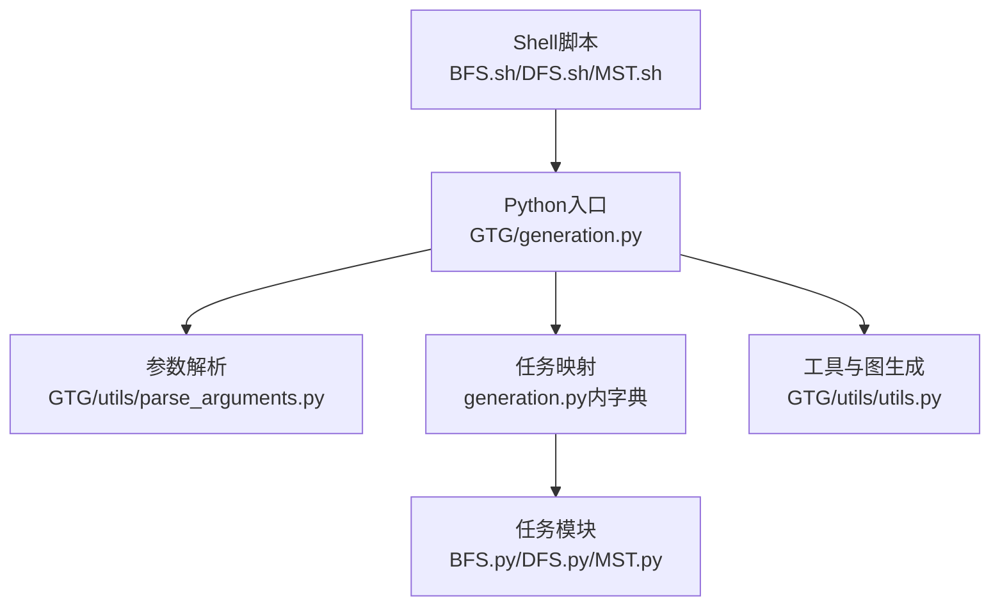
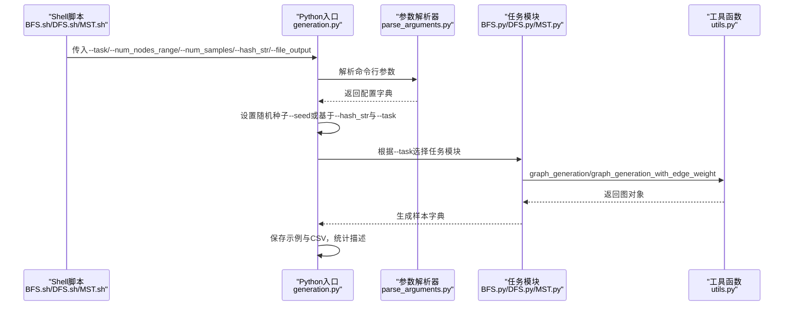
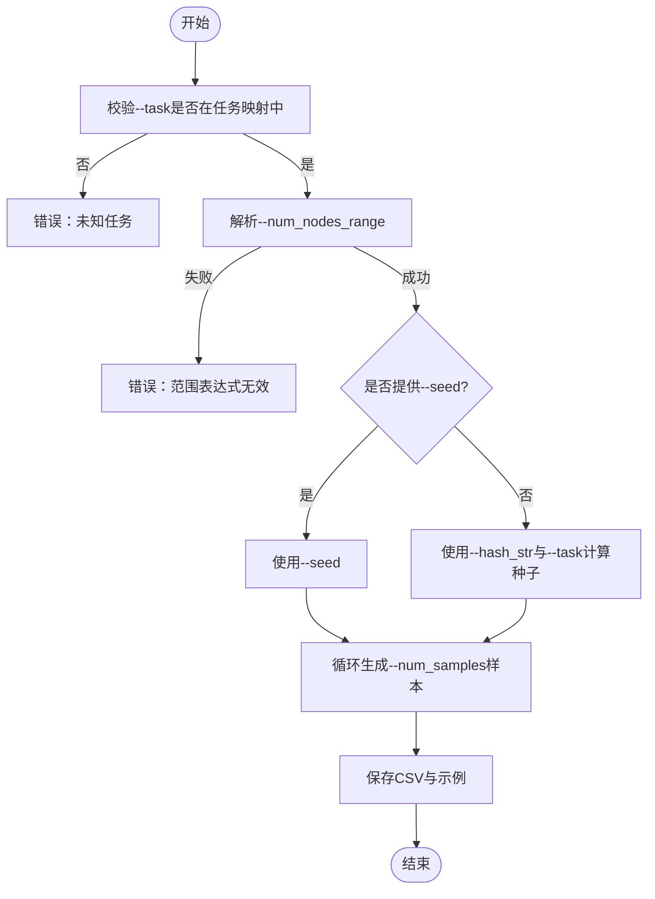

# 配置参数说明

<cite>
**本文引用的文件**
- [parse_arguments.py](file://GTG/utils/parse_arguments.py)
- [generation.py](file://GTG/generation.py)
- [utils.py](file://GTG/utils/utils.py)
- [BFS.sh](file://script/dataset_generation/BFS.sh)
- [DFS.sh](file://script/dataset_generation/DFS.sh)
- [MST.sh](file://script/dataset_generation/MST.sh)
- [BFS.py](file://GTG/tasks/BFS/BFS.py)
- [DFS.py](file://GTG/tasks/DFS/DFS.py)
- [MST.py](file://GTG/tasks/MST/MST.py)
- [scripts_generation.sh](file://script/meta_generation/scripts_generation.sh)
- [README.md](file://README.md)
</cite>

## 目录
1. [简介](#简介)
2. [项目结构与入口](#项目结构与入口)
3. [核心组件与参数体系](#核心组件与参数体系)
4. [架构总览](#架构总览)
5. [详细参数解析](#详细参数解析)
6. [依赖关系与参数约束](#依赖关系与参数约束)
7. [性能与稳定性考量](#性能与稳定性考量)
8. [故障排查指南](#故障排查指南)
9. [结论](#结论)
10. [附录：命令行示例与最佳实践](#附录命令行示例与最佳实践)

## 简介
本文围绕数据生成流程中的可配置参数进行系统化说明，重点覆盖以下方面：
- 参数作用与用法：--task、--num_nodes_range、--num_samples、--hash_str
- 在shell脚本中的传递机制
- 被parse_arguments.py解析后如何传入生成核心
- 实际命令行调用示例与参数间依赖关系
- 高级配置：如何通过修改配置字典定制图生成策略

## 项目结构与入口
- 命令行入口位于GTG/generation.py，负责解析参数、选择任务模块、生成样本并保存结果。
- 参数解析由GTG/utils/parse_arguments.py完成，统一收集命令行参数并转为字典。
- 图生成策略由GTG/utils/utils.py中的graph_generation系列函数实现，支持随机图、BA无标度图、WS小世界图等。
- 任务脚本位于script/dataset_generation/*.sh，以BFS.sh/DFS.sh/MST.sh为例，展示参数如何从shell传递到Python模块。

图表来源
- [generation.py](file://GTG/generation.py#L1-L107)
- [parse_arguments.py](file://GTG/utils/parse_arguments.py#L1-L28)
- [utils.py](file://GTG/utils/utils.py#L312-L398)
- [BFS.sh](file://script/dataset_generation/BFS.sh#L1-L36)
- [DFS.sh](file://script/dataset_generation/DFS.sh#L1-L36)
- [MST.sh](file://script/dataset_generation/MST.sh#L1-L36)

章节来源
- [generation.py](file://GTG/generation.py#L1-L107)
- [parse_arguments.py](file://GTG/utils/parse_arguments.py#L1-L28)
- [utils.py](file://GTG/utils/utils.py#L312-L398)
- [BFS.sh](file://script/dataset_generation/BFS.sh#L1-L36)
- [DFS.sh](file://script/dataset_generation/DFS.sh#L1-L36)
- [MST.sh](file://script/dataset_generation/MST.sh#L1-L36)

## 核心组件与参数体系
- 参数解析器parse_arguments.py
  - 支持参数：--task、--id_type、--file_input、--file_output、--file_dataset、--file_answer、--file_result、--seed、--hash_str、--num_nodes_range、--link_prob、--num_samples
  - 将解析结果转换为字典，忽略None值；字符串形式的“none”或“None”会被替换为空字符串
- 生成入口generation.py
  - 读取配置字典，设置随机种子（优先使用--seed，否则基于--hash_str与--task计算哈希）
  - 根据--task选择任务模块，调用其generate_a_sample生成样本
  - 循环生成--num_samples条样本，保存CSV及统计描述
- 图生成工具utils.py
  - graph_generation根据--num_nodes_range解析出范围，按概率混合生成随机图/BA/WS图，剔除孤立节点并限制平均度
  - graph_generation_with_edge_weight在已有图基础上为每条边添加随机权重

章节来源
- [parse_arguments.py](file://GTG/utils/parse_arguments.py#L1-L28)
- [generation.py](file://GTG/generation.py#L1-L107)
- [utils.py](file://GTG/utils/utils.py#L312-L398)

## 架构总览
下面的序列图展示了从shell脚本到任务模块的完整调用链路，以及参数在各层之间的传递。

图表来源
- [BFS.sh](file://script/dataset_generation/BFS.sh#L1-L36)
- [DFS.sh](file://script/dataset_generation/DFS.sh#L1-L36)
- [MST.sh](file://script/dataset_generation/MST.sh#L1-L36)
- [generation.py](file://GTG/generation.py#L1-L107)
- [parse_arguments.py](file://GTG/utils/parse_arguments.py#L1-L28)
- [utils.py](file://GTG/utils/utils.py#L312-L398)
- [BFS.py](file://GTG/tasks/BFS/BFS.py#L1-L155)
- [DFS.py](file://GTG/tasks/DFS/DFS.py#L1-L141)
- [MST.py](file://GTG/tasks/MST/MST.py#L1-L120)

## 详细参数解析

### --task 指定具体图论任务
- 作用：选择要执行的任务模块，例如BFS、DFS、MST等
- 传递机制：Shell脚本将任务名作为--task传入；generation.py通过配置字典查找任务模块并调用其generate_a_sample
- 取值范围：脚本meta_generation/scripts_generation.sh中列举了可用任务名称，包括shortest_path、page_rank、DFS、BFS、degree、common_neighbor、jaccard、connectivity、topological_sort、cycle、edge、neighbor、predecessor、bipartite、clustering_coefficient、diameter、MST、euler_path、hamiltonian_path、maximum_flow、connected_component
- 有效值：必须与GTG/tasks目录下的子包名称一致，且generation.py的任务映射字典包含该键
- 注意事项：若--task未在映射字典中，运行时会抛出KeyError

章节来源
- [scripts_generation.sh](file://script/meta_generation/scripts_generation.sh#L1-L33)
- [generation.py](file://GTG/generation.py#L29-L57)
- [BFS.sh](file://script/dataset_generation/BFS.sh#L13-L17)
- [DFS.sh](file://script/dataset_generation/DFS.sh#L13-L17)
- [MST.sh](file://script/dataset_generation/MST.sh#L13-L17)

### --num_nodes_range 控制节点规模范围
- 作用：定义生成图的节点数范围，影响图的稀疏性与复杂度
- 传递机制：Shell脚本将范围字符串传入--num_nodes_range；parse_arguments.py接收为字符串；generation.py将其传入utils.graph_generation
- 解析逻辑：utils.graph_generation内部使用eval(config['num_nodes_range'])将字符串解析为元组/列表形式的范围，再从中均匀采样得到具体节点数
- 有效值范围：应为合法的Python表达式，能被eval解析为整数区间，如"[5, 15]"或"(10, 25)"
- 兼容性：若传入字符串无法eval或范围非法，将在graph_generation中触发异常或导致生成失败
- 影响：节点数越大，平均度可能越高，生成过程可能更耗时；同时会影响后续任务（如BFS/DFS/MST）的输出长度与难度

章节来源
- [parse_arguments.py](file://GTG/utils/parse_arguments.py#L16-L16)
- [utils.py](file://GTG/utils/utils.py#L312-L349)
- [BFS.sh](file://script/dataset_generation/BFS.sh#L2-L2)
- [DFS.sh](file://script/dataset_generation/DFS.sh#L2-L2)
- [MST.sh](file://script/dataset_generation/MST.sh#L2-L2)

### --num_samples 决定样本数量
- 作用：控制生成样本总数
- 传递机制：Shell脚本将样本数传入--num_samples；generation.py读取为整数，循环调用任务模块的generate_a_sample生成样本
- 有效值范围：正整数；过大可能导致内存与I/O压力增大
- 行为：生成入口会先打印一条示例，再保存前10条示例文本，最后批量生成并保存CSV

章节来源
- [parse_arguments.py](file://GTG/utils/parse_arguments.py#L18-L18)
- [generation.py](file://GTG/generation.py#L60-L83)
- [BFS.sh](file://script/dataset_generation/BFS.sh#L3-L3)
- [DFS.sh](file://script/dataset_generation/DFS.sh#L3-L3)
- [MST.sh](file://script/dataset_generation/MST.sh#L3-L3)

### --hash_str 用于标识数据集版本
- 作用：作为随机种子生成的输入之一，用于复现实验或区分不同数据集版本
- 传递机制：Shell脚本将标签传入--hash_str；generation.py在未显式提供--seed时，使用string_to_integer_hashing(config['task']+hash_str)作为随机种子
- 建议：为不同数据集版本提供唯一标签，避免重复覆盖

章节来源
- [parse_arguments.py](file://GTG/utils/parse_arguments.py#L15-L15)
- [generation.py](file://GTG/generation.py#L16-L27)
- [utils.py](file://GTG/utils/utils.py#L38-L42)
- [BFS.sh](file://script/dataset_generation/BFS.sh#L4-L4)
- [DFS.sh](file://script/dataset_generation/DFS.sh#L4-L4)
- [MST.sh](file://script/dataset_generation/MST.sh#L4-L4)

### 其他相关参数
- --seed：显式指定随机种子，优先于--hash_str
- --file_output：指定最终CSV输出路径
- --id_type、--file_input、--file_dataset、--file_answer、--file_result、--link_prob：用于其他流程（如节点ID处理、评估等），不在本次参数解析范围内

章节来源
- [parse_arguments.py](file://GTG/utils/parse_arguments.py#L7-L19)
- [generation.py](file://GTG/generation.py#L1-L20)

## 依赖关系与参数约束
- 参数依赖
  - --task 必须与任务映射字典中的键一致，否则无法定位任务模块
  - --num_nodes_range 必须是可被eval解析的合法表达式，否则graph_generation会报错
  - --num_samples 必须为正整数，否则循环次数无效
  - --hash_str 仅在未提供--seed时生效，用于生成稳定但可区分的随机种子
- 参数约束
  - graph_generation会剔除孤立节点，并限制平均度，确保生成图具备合理连通性与稠密度
  - 不同任务模块对图有特定要求（如MST要求连通图），若生成失败会自动重试

图表来源
- [generation.py](file://GTG/generation.py#L16-L27)
- [utils.py](file://GTG/utils/utils.py#L312-L349)
- [parse_arguments.py](file://GTG/utils/parse_arguments.py#L1-L28)

章节来源
- [generation.py](file://GTG/generation.py#L16-L27)
- [utils.py](file://GTG/utils/utils.py#L312-L349)

## 性能与稳定性考量
- 随机性与可复现
  - 若提供--seed，则完全可复现
  - 未提供--seed时，--hash_str与--task共同决定种子，便于版本化管理
- 图生成策略
  - graph_generation按概率混合生成不同类型的图，剔除孤立节点并限制平均度，提升样本质量
  - 对于带权任务（如MST），graph_generation_with_edge_weight为边添加随机权重
- 批量生成
  - 使用tqdm显示进度，建议在大规模生成时关注磁盘I/O与内存占用

章节来源
- [generation.py](file://GTG/generation.py#L1-L20)
- [utils.py](file://GTG/utils/utils.py#L312-L398)

## 故障排查指南
- 任务名称错误
  - 现象：KeyError或模块导入失败
  - 处理：确认--task与任务映射字典一致，检查任务模块是否存在
- 节点范围表达式错误
  - 现象：eval失败或生成异常
  - 处理：确保--num_nodes_range为合法表达式，如"[5, 15]"或"(10, 25)"
- 样本数量异常
  - 现象：生成时间过长或内存不足
  - 处理：适当降低--num_samples，或分批生成
- 连通性问题（如MST）
  - 现象：某些样本被拒绝或生成失败
  - 处理：graph_generation会自动重试，若仍失败，尝试扩大--num_nodes_range或调整稀疏度

章节来源
- [generation.py](file://GTG/generation.py#L29-L57)
- [utils.py](file://GTG/utils/utils.py#L312-L349)
- [MST.py](file://GTG/tasks/MST/MST.py#L21-L34)

## 结论
- --task、--num_nodes_range、--num_samples、--hash_str是数据生成流程的核心参数
- Shell脚本负责参数传递，parse_arguments.py统一解析，generation.py负责调度与保存
- 通过合理设置参数，可在保证样本质量的同时高效生成多样化图论数据集

## 附录：命令行示例与最佳实践
- 基本命令格式（以BFS为例）
  - bash script/dataset_generation/BFS.sh /path/to/data "[5,15]" 100 tag001
  - 说明：数据根目录、节点范围、样本数、数据集标签
- 参数组合建议
  - 小规模探索：--num_nodes_range "[5,15]"，--num_samples "100"
  - 中等规模：--num_nodes_range "[10,25]"，--num_samples "1000"
  - 大规模：--num_nodes_range "[20,50]"，--num_samples "10000"
- 版本化管理
  - 使用不同的--hash_str区分不同版本的数据集，便于对比实验
- 高级配置
  - 修改配置字典：在调用parse_arguments()后，可直接在返回的字典上增删改键值，例如增加自定义字段或覆盖默认行为
  - 示例路径参考：[parse_arguments.py](file://GTG/utils/parse_arguments.py#L1-L28)，[generation.py](file://GTG/generation.py#L1-L20)

章节来源
- [BFS.sh](file://script/dataset_generation/BFS.sh#L1-L36)
- [DFS.sh](file://script/dataset_generation/DFS.sh#L1-L36)
- [MST.sh](file://script/dataset_generation/MST.sh#L1-L36)
- [README.md](file://README.md#L20-L30)
- [parse_arguments.py](file://GTG/utils/parse_arguments.py#L1-L28)
- [generation.py](file://GTG/generation.py#L1-L20)