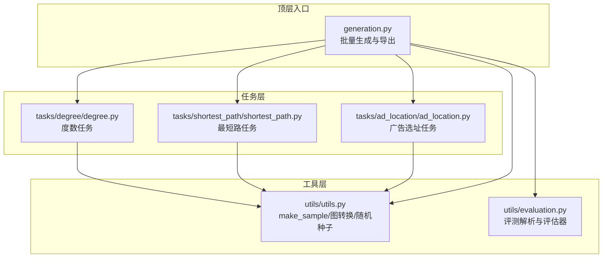
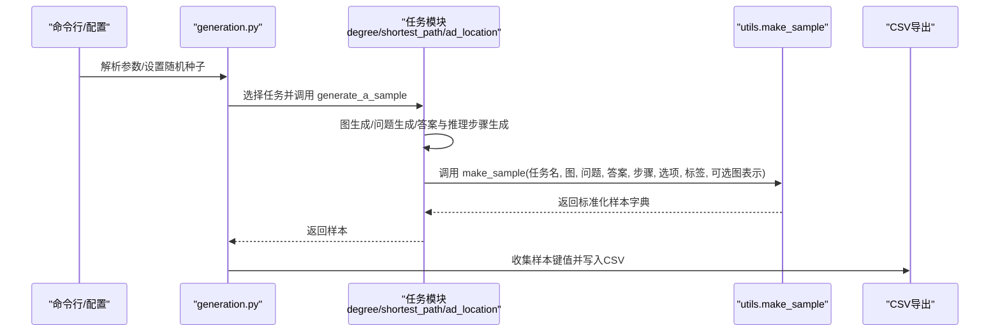
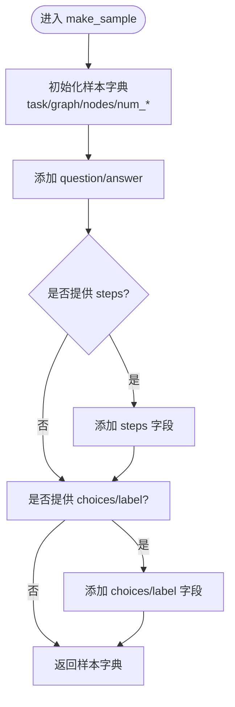
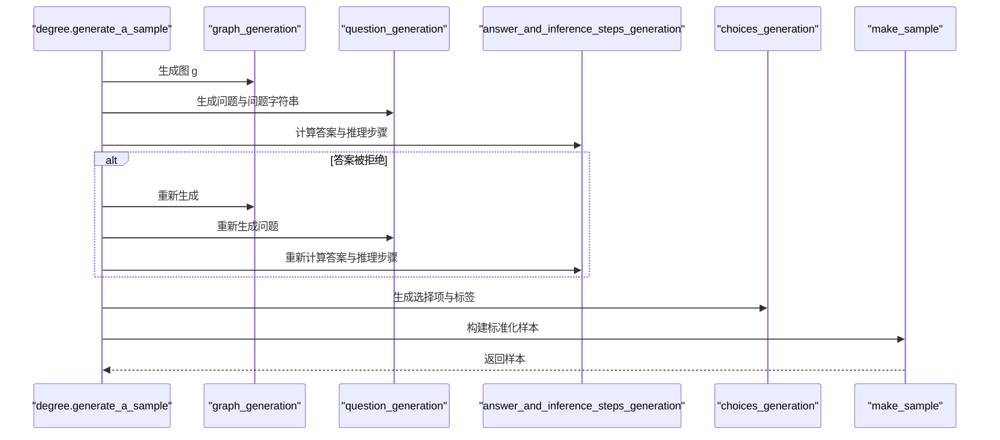
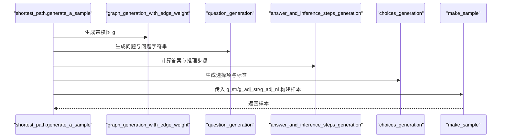
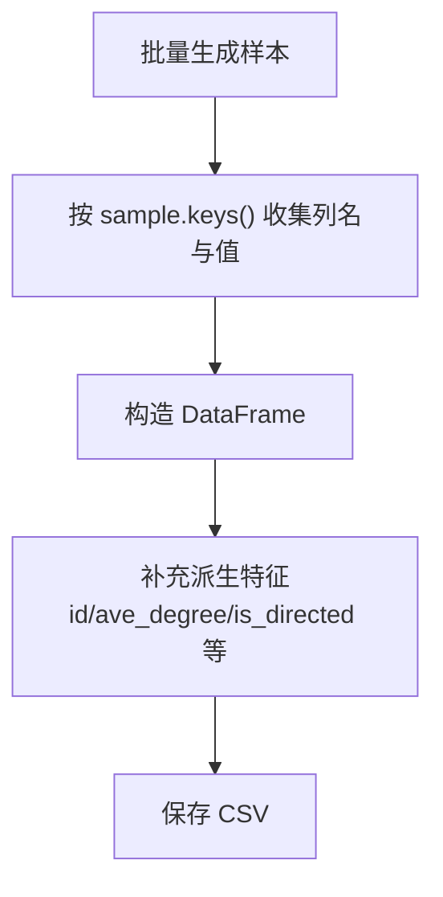
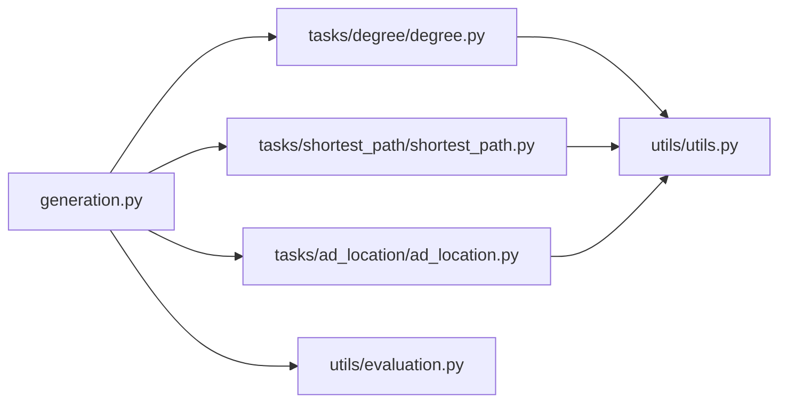

# 样本构建与标准化

<cite>
**本文引用的文件**
- [GTG/utils/utils.py](file://GTG/utils/utils.py)
- [GTG/tasks/degree/degree.py](file://GTG/tasks/degree/degree.py)
- [GTG/tasks/shortest_path/shortest_path.py](file://GTG/tasks/shortest_path/shortest_path.py)
- [GTG/tasks/ad_location/ad_location.py](file://GTG/tasks/ad_location/ad_location.py)
- [GTG/generation.py](file://GTG/generation.py)
- [GTG/utils/evaluation.py](file://GTG/utils/evaluation.py)
</cite>

## 目录
1. [引言](#引言)
2. [项目结构](#项目结构)
3. [核心组件](#核心组件)
4. [架构总览](#架构总览)
5. [详细组件分析](#详细组件分析)
6. [依赖关系分析](#依赖关系分析)
7. [性能考量](#性能考量)
8. [故障排查指南](#故障排查指南)
9. [结论](#结论)
10. [附录](#附录)

## 引言
本文件围绕“样本构建与标准化”主题，系统性解析 make_sample 函数在样本构建中的核心作用，阐明其如何将问题字符串、答案、推理步骤、图结构表示（邻接列表、自然语言描述、带权边列表等）等异构数据整合为统一的结构化样本字典；并结合 degree.py 中 generate_a_sample 的完整流程，展示从图生成、问题生成、答案计算到最终调用 make_sample 的闭环；最后说明该样本结构如何支撑后续 CSV 导出与机器学习模型训练。

## 项目结构
本仓库采用模块化组织：任务层（GTG/tasks/*）负责具体任务的样本生成与评估；工具层（GTG/utils/*）提供通用的图操作、样本构造、评估解析等能力；顶层入口（GTG/generation.py）负责参数解析、任务选择、样本批量生成与 CSV 导出。

图表来源
- [GTG/generation.py](file://GTG/generation.py#L1-L107)
- [GTG/tasks/degree/degree.py](file://GTG/tasks/degree/degree.py#L1-L110)
- [GTG/tasks/shortest_path/shortest_path.py](file://GTG/tasks/shortest_path/shortest_path.py#L115-L140)
- [GTG/tasks/ad_location/ad_location.py](file://GTG/tasks/ad_location/ad_location.py#L1-L70)
- [GTG/utils/utils.py](file://GTG/utils/utils.py#L1-L212)
- [GTG/utils/evaluation.py](file://GTG/utils/evaluation.py#L1-L283)

章节来源
- [GTG/generation.py](file://GTG/generation.py#L1-L107)

## 核心组件
- make_sample：将图对象 g 与问题、答案、推理步骤、可选的选择项与标签等异构信息，统一打包为标准样本字典。该函数是样本标准化的关键枢纽，确保不同任务产出的样本具备一致的数据结构，便于下游 CSV 导出与模型训练。
- 图结构表示：
  - 边列表字符串：graph_to_edge_list_str
  - 邻接表字符串：graph_to_adj_str
  - 自然语言描述：graph_to_natural_language
  - 带权图的边列表/邻接表/自然语言：graph_with_egde_weight_to_str / graph_with_egde_weight_to_adj_str / graph_with_edge_weight_to_natural_language
- 任务生成链路：每个任务模块均提供 generate_a_sample，按“图生成 → 问题生成 → 答案与推理步骤生成 → 可选选择项与标签生成 → 调用 make_sample 构建样本”的流程产出样本。

章节来源
- [GTG/utils/utils.py](file://GTG/utils/utils.py#L14-L36)
- [GTG/utils/utils.py](file://GTG/utils/utils.py#L73-L175)
- [GTG/tasks/degree/degree.py](file://GTG/tasks/degree/degree.py#L86-L110)
- [GTG/tasks/shortest_path/shortest_path.py](file://GTG/tasks/shortest_path/shortest_path.py#L115-L140)
- [GTG/tasks/ad_location/ad_location.py](file://GTG/tasks/ad_location/ad_location.py#L42-L69)

## 架构总览
下图展示了从任务模块到样本构建再到 CSV 导出的整体流程。

图表来源
- [GTG/generation.py](file://GTG/generation.py#L29-L102)
- [GTG/tasks/degree/degree.py](file://GTG/tasks/degree/degree.py#L86-L110)
- [GTG/tasks/shortest_path/shortest_path.py](file://GTG/tasks/shortest_path/shortest_path.py#L115-L140)
- [GTG/tasks/ad_location/ad_location.py](file://GTG/tasks/ad_location/ad_location.py#L42-L69)
- [GTG/utils/utils.py](file://GTG/utils/utils.py#L14-L36)

## 详细组件分析

### make_sample 函数：样本标准化的核心
- 输入参数
  - 必填：task_name（任务名）、g（图对象）、ques_str（问题字符串）、ans_str（答案字符串）
  - 可选：steps_str（推理步骤）、choi_str（选择项）、label_str（正确选项索引）、g_str/g_adj_str/g_adj_nl（图的多种表示形式）
- 输出：标准化样本字典，包含以下关键字段
  - task：任务名
  - graph/graph_adj/graph_nl：图的边列表/邻接表/自然语言描述
  - nodes/num_nodes/num_edges/directed：图的基本统计与性质
  - question/answer：问题与答案
  - steps（可选）：推理过程
  - choices/label（可选）：多项选择题的选项与标签
- 设计要点
  - 将图对象 g 统一转换为字符串或自然语言形式，保证样本可序列化且便于人类阅读
  - 条件性添加 steps/choices/label，兼容问答与选择题两类场景
  - 通过 g_str/g_adj_str/g_adj_nl 允许上层任务传入预生成的图表示，减少重复转换开销

图表来源
- [GTG/utils/utils.py](file://GTG/utils/utils.py#L14-L36)

章节来源
- [GTG/utils/utils.py](file://GTG/utils/utils.py#L14-L36)

### 任务模块 generate_a_sample 流程（以 degree 为例）
- 步骤
  1) 图生成：graph_generation(config)
  2) 问题生成：question_generation(config, g)
  3) 答案与推理步骤：answer_and_inference_steps_generation(config, g, ques)
  4) 可选：choices_generation(config, g, ques, ans)
  5) 调用 make_sample 构建样本并返回
- 特殊处理
  - 对于某些任务（如 degree），可能对答案进行筛选或拒绝采样，避免极端分布（例如零度节点占比过高）

图表来源
- [GTG/tasks/degree/degree.py](file://GTG/tasks/degree/degree.py#L86-L110)

章节来源
- [GTG/tasks/degree/degree.py](file://GTG/tasks/degree/degree.py#L86-L110)

### 带权图任务的样本扩展（以 shortest_path 为例）
- 在 shortest_path 中，generate_a_sample 会额外传入 g_str/g_adj_str/g_adj_nl，即带权图的边列表、邻接表与自然语言描述，使样本同时包含无权与有权两种图表示，满足不同下游需求。
- 这体现了 make_sample 的灵活性：上层任务可按需传入不同的图表示，make_sample 仅负责标准化存储。

图表来源
- [GTG/tasks/shortest_path/shortest_path.py](file://GTG/tasks/shortest_path/shortest_path.py#L115-L140)
- [GTG/utils/utils.py](file://GTG/utils/utils.py#L99-L175)

章节来源
- [GTG/tasks/shortest_path/shortest_path.py](file://GTG/tasks/shortest_path/shortest_path.py#L115-L140)
- [GTG/utils/utils.py](file://GTG/utils/utils.py#L99-L175)

### 广告选址任务的样本差异（ad_location）
- 该任务使用 load_ad_graph 加载真实交通网络子图，并以自然语言形式给出问题；由于输出格式特殊，样本构建时未提供 choices/label，但仍然通过 make_sample 标准化存储。
- 该模式展示了 make_sample 对不同任务风格的兼容性：即使不提供选择题，也能保持统一的样本结构。

章节来源
- [GTG/tasks/ad_location/ad_location.py](file://GTG/tasks/ad_location/ad_location.py#L42-L69)
- [GTG/utils/utils.py](file://GTG/utils/utils.py#L14-L36)

### 样本字段定义与用途
- task：标识任务类型，便于按任务维度统计与分析
- graph/graph_adj/graph_nl：提供多种图表示，兼顾可读性与模型输入需求
- nodes/num_nodes/num_edges/directed：图的基本统计与性质，用于数据质量控制与特征工程
- question/answer：问题与答案，构成问答对的核心
- steps（可选）：推理过程，便于人类审阅与模型训练中的思维链监督
- choices/label（可选）：多项选择题的选项与正确标签，适配选择题场景

章节来源
- [GTG/utils/utils.py](file://GTG/utils/utils.py#L14-L36)

### 从样本到 CSV 导出与模型训练
- generation.py 在批量生成样本后，将 sample.keys() 作为列名收集所有键值，构造 DataFrame 并导出 CSV，同时补充 id、平均度、是否定向等派生特征，便于后续统计分析与模型训练。
- 样本字典的标准化结构使得不同任务的样本可以合并为统一的数据集，降低数据接入成本。

图表来源
- [GTG/generation.py](file://GTG/generation.py#L71-L102)

章节来源
- [GTG/generation.py](file://GTG/generation.py#L71-L102)

## 依赖关系分析
- 任务模块依赖 utils 中的 make_sample 与图转换函数，确保样本结构一致
- generation.py 依赖任务模块的 generate_a_sample，统一调度样本生成与导出
- evaluation.py 依赖 parse_output 与样本字典中的 answer/choices 等字段，完成模型输出解析与正确性判定

图表来源
- [GTG/tasks/degree/degree.py](file://GTG/tasks/degree/degree.py#L1-L110)
- [GTG/tasks/shortest_path/shortest_path.py](file://GTG/tasks/shortest_path/shortest_path.py#L115-L140)
- [GTG/tasks/ad_location/ad_location.py](file://GTG/tasks/ad_location/ad_location.py#L1-L70)
- [GTG/utils/utils.py](file://GTG/utils/utils.py#L1-L212)
- [GTG/generation.py](file://GTG/generation.py#L1-L107)
- [GTG/utils/evaluation.py](file://GTG/utils/evaluation.py#L1-L283)

章节来源
- [GTG/utils/evaluation.py](file://GTG/utils/evaluation.py#L1-L283)

## 性能考量
- make_sample 的图表示转换（边列表、邻接表、自然语言）均为线性复杂度，与节点数和边数成正比；对于大规模图，建议上层任务直接传入已生成的 g_str/g_adj_str/g_adj_nl，避免重复转换。
- generation.py 在批量生成阶段使用字典收集样本键值，再一次性构造 DataFrame，避免频繁的 append 操作，提升导出效率。
- 任务模块内部的拒绝采样（如 degree 中对零度节点的比例控制）会增加生成时间，但有助于维持数据分布均衡，建议根据任务需求调整阈值。

## 故障排查指南
- 样本字段缺失
  - 若上层任务未传入 steps/choices/label，样本中相应字段不会出现；若下游逻辑依赖这些字段，请在任务中显式传入。
- 图表示不一致
  - 若上层任务传入了 g_str/g_adj_str/g_adj_nl，make_sample 会优先使用传入值；若传入为空则由内部函数生成。请检查传参是否正确。
- CSV 导出异常
  - generation.py 会基于首次生成样本的 keys 构造列名；若不同任务样本字段差异较大，可能导致列不一致。建议统一任务的样本字段集合。
- 评测解析失败
  - evaluation.py 依赖样本中的 answer/choices 等字段进行解析与正确性判断；若字段缺失或格式不符，评测结果可能为 0 或解析失败。请核对样本构建流程。

章节来源
- [GTG/utils/utils.py](file://GTG/utils/utils.py#L14-L36)
- [GTG/generation.py](file://GTG/generation.py#L71-L102)
- [GTG/utils/evaluation.py](file://GTG/utils/evaluation.py#L1-L283)

## 结论
make_sample 是样本构建与标准化的核心构件，它将异构的图与文本信息统一为结构化字典，为后续 CSV 导出与模型训练提供了稳定的数据接口。通过 degree、shortest_path、ad_location 等任务的 generate_a_sample 流程可见，make_sample 既兼容问答与选择题两类场景，又支持多种图表示形式，具备良好的扩展性与一致性。配合 generation.py 的批量导出与 evaluation.py 的评测解析，形成了从样本生成到数据落地的完整闭环。

## 附录
- 关键实现位置参考
  - make_sample 定义：[GTG/utils/utils.py](file://GTG/utils/utils.py#L14-L36)
  - 图表示转换函数：[GTG/utils/utils.py](file://GTG/utils/utils.py#L73-L175)
  - degree 任务生成流程：[GTG/tasks/degree/degree.py](file://GTG/tasks/degree/degree.py#L86-L110)
  - shortest_path 任务生成流程与图表示扩展：[GTG/tasks/shortest_path/shortest_path.py](file://GTG/tasks/shortest_path/shortest_path.py#L115-L140)
  - ad_location 任务生成流程与样本差异：[GTG/tasks/ad_location/ad_location.py](file://GTG/tasks/ad_location/ad_location.py#L42-L69)
  - 批量生成与导出：[GTG/generation.py](file://GTG/generation.py#L71-L102)
  - 评测解析与评估器基类：[GTG/utils/evaluation.py](file://GTG/utils/evaluation.py#L1-L283)