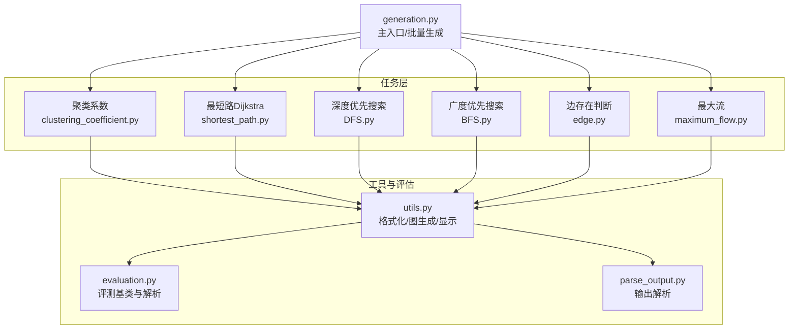
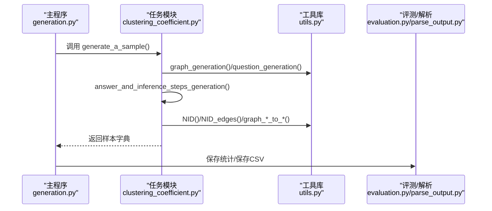
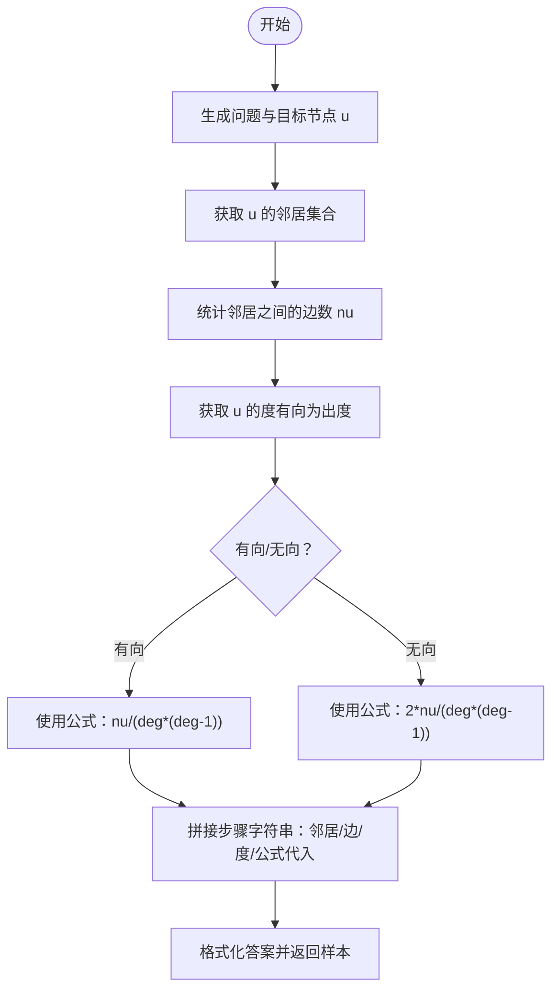
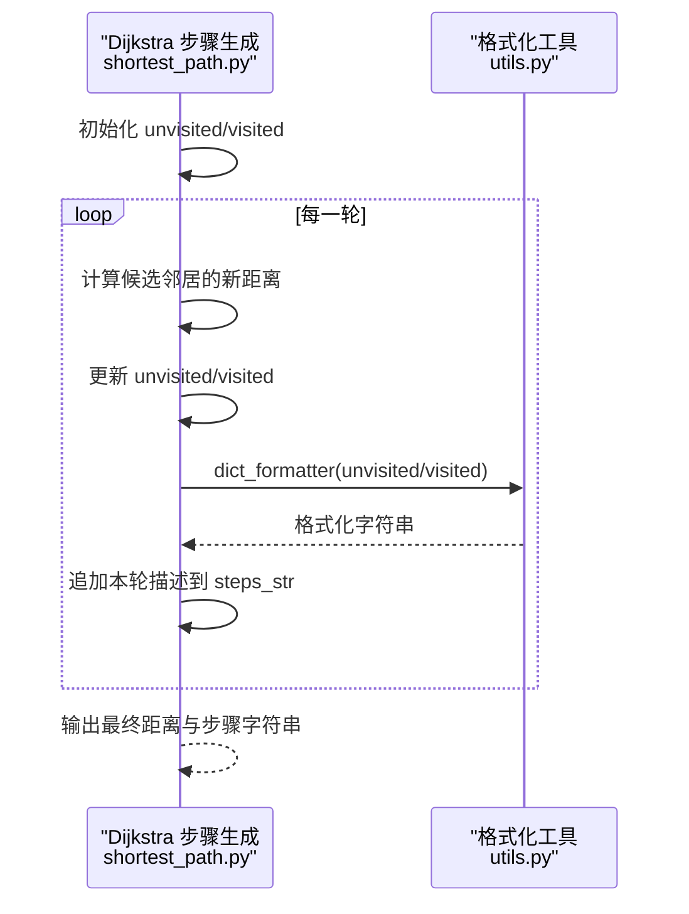
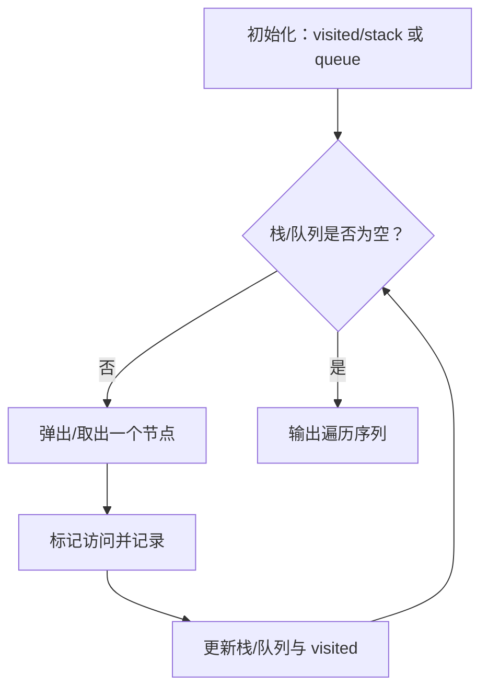
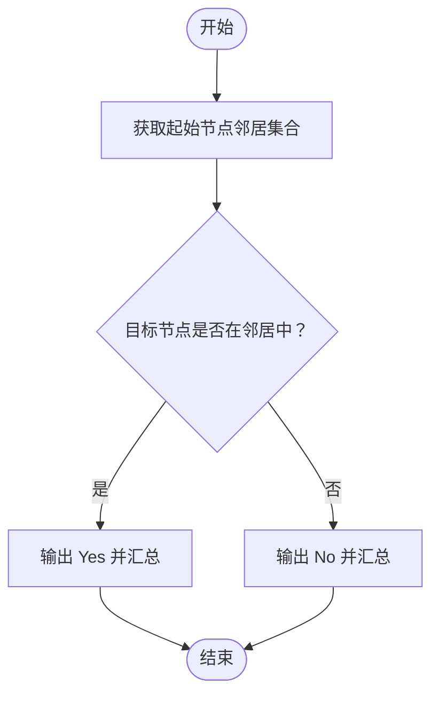
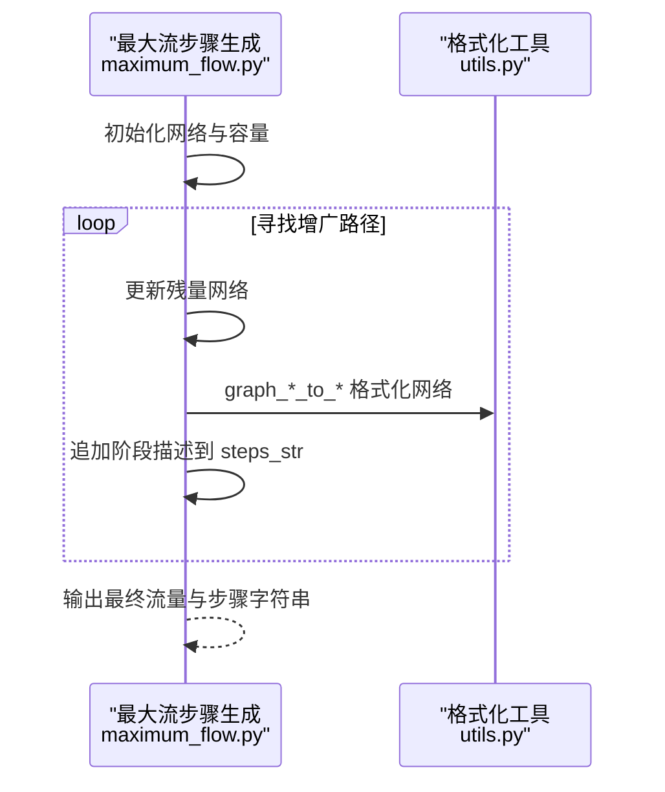
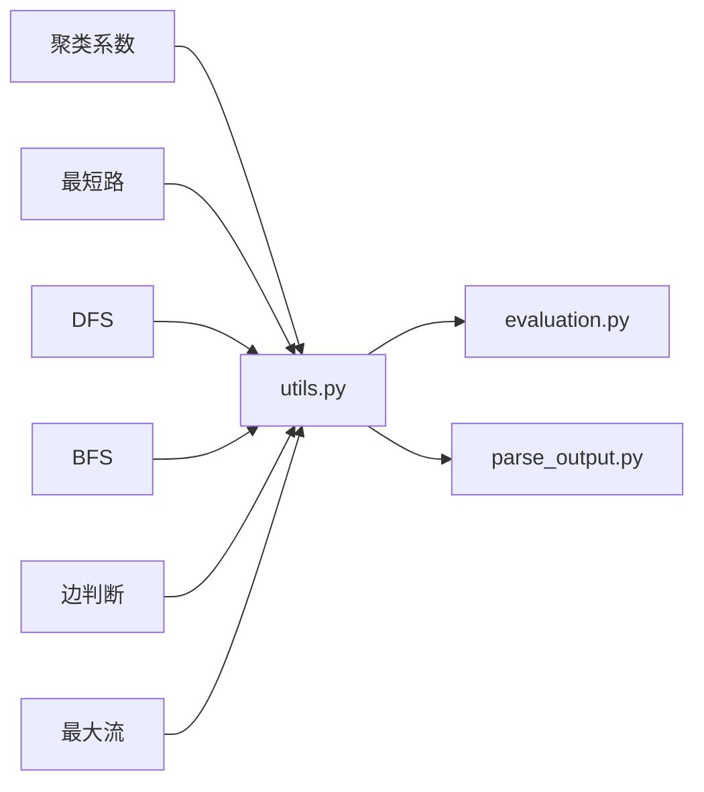

# 推理步骤构造

<cite>
**本文引用的文件**
- [README.md](file://README.md)
- [generation.py](file://GTG/generation.py)
- [utils.py](file://GTG/utils/utils.py)
- [evaluation.py](file://GTG/utils/evaluation.py)
- [parse_output.py](file://GTG/utils/parse_output.py)
- [clustering_coefficient.py](file://GTG/tasks/clustering_coefficient/clustering_coefficient.py)
- [shortest_path.py](file://GTG/tasks/shortest_path/shortest_path.py)
- [DFS.py](file://GTG/tasks/DFS/DFS.py)
- [BFS.py](file://GTG/tasks/BFS/BFS.py)
- [edge.py](file://GTG/tasks/edge/edge.py)
- [maximum_flow.py](file://GTG/tasks/maximum_flow/maximum_flow.py)
- [template.py](file://LLaMAFactory/src/llamafactory/data/template.py)
</cite>

## 目录
1. [引言](#引言)
2. [项目结构](#项目结构)
3. [核心组件](#核心组件)
4. [架构总览](#架构总览)
5. [详细组件分析](#详细组件分析)
6. [依赖关系分析](#依赖关系分析)
7. [性能考量](#性能考量)
8. [故障排查指南](#故障排查指南)
9. [结论](#结论)
10. [附录](#附录)

## 引言
本文件围绕“推理步骤文本的构造策略与实现方法”展开，重点说明如何将算法执行过程中的中间状态（例如 Dijkstra 算法中的未访问节点集、当前距离值）转化为自然语言描述，并保持逻辑连贯性；以聚类系数计算为例，展示如何分步解释邻居节点集合、边数统计、公式代入等环节的表述方式；探讨引导语（如“让我们逐步解决”）的使用规范及其在不同任务类型中的变体设计；并总结多步骤推理中信息密度控制策略，避免冗余描述同时确保关键决策点清晰可追溯。文档还结合具体代码片段路径，说明字符串拼接、格式化输出与状态同步的技术实现。

## 项目结构
该项目提供动态图任务的数据生成与评估能力，核心模块包括：
- 任务生成器：各任务目录下的生成函数负责问题构造、答案与推理步骤生成、选项构造与样本打包。
- 工具库：通用图操作、格式化、随机种子设置、样本显示与保存等。
- 评估与解析：对大模型输出进行解析与正确性判定。
- 训练框架集成：通过 LLaMAFactory 的模板系统支持“带思考”的对话格式。

图表来源
- [generation.py](file://GTG/generation.py#L1-L107)
- [utils.py](file://GTG/utils/utils.py#L1-L200)
- [evaluation.py](file://GTG/utils/evaluation.py#L1-L120)
- [parse_output.py](file://GTG/utils/parse_output.py#L1-L120)
- [clustering_coefficient.py](file://GTG/tasks/clustering_coefficient/clustering_coefficient.py#L1-L140)
- [shortest_path.py](file://GTG/tasks/shortest_path/shortest_path.py#L1-L140)
- [DFS.py](file://GTG/tasks/DFS/DFS.py#L50-L100)
- [BFS.py](file://GTG/tasks/BFS/BFS.py#L61-L109)
- [edge.py](file://GTG/tasks/edge/edge.py#L34-L77)
- [maximum_flow.py](file://GTG/tasks/maximum_flow/maximum_flow.py#L76-L116)

章节来源
- [README.md](file://README.md#L1-L90)
- [generation.py](file://GTG/generation.py#L1-L107)

## 核心组件
- 任务生成器：每个任务模块包含 question_generation、answer_and_inference_steps_generation、choices_generation、generate_a_sample 等函数，统一产出问题、答案、推理步骤与选项，并通过 make_sample 打包为样本字典。
- 工具库：提供节点 ID 格式化（NID/NID_edges）、图到自然语言描述（graph_to_natural_language/graph_with_edge_weight_to_natural_language）、图生成（随机/BA/Watts-Strogatz/DAG/二部图等）、邻接表与边列表格式化、随机重映射与洗牌等。
- 评测与解析：BaseEvaluator 及其子类定义解析与正确性判定流程；parse_output 提供包裹答案提取、布尔/整数/浮点/节点/列表/字典解析等辅助函数。
- 主入口：generation.py 根据配置选择任务模块，循环生成样本并保存统计信息。

章节来源
- [utils.py](file://GTG/utils/utils.py#L1-L200)
- [evaluation.py](file://GTG/utils/evaluation.py#L1-L120)
- [parse_output.py](file://GTG/utils/parse_output.py#L1-L120)
- [generation.py](file://GTG/generation.py#L1-L107)

## 架构总览
下图展示了从主入口到任务模块再到工具库的整体调用链与职责分工。

图表来源
- [generation.py](file://GTG/generation.py#L1-L107)
- [clustering_coefficient.py](file://GTG/tasks/clustering_coefficient/clustering_coefficient.py#L116-L134)
- [utils.py](file://GTG/utils/utils.py#L56-L126)
- [evaluation.py](file://GTG/utils/evaluation.py#L1-L120)

## 详细组件分析

### 组件A：聚类系数（Clustering Coefficient）推理步骤构造
- 目标：为给定节点 u，计算其聚类系数，区分有向与无向情形。
- 中间状态到自然语言的映射：
  - 邻居集合：使用 NID 对节点集合进行格式化输出。
  - 边计数：统计邻居之间存在的边数量 nu，并以 NID_edges 输出边列表。
  - 度量：分别输出出度（有向）或度（无向）。
  - 公式代入：按有向/无向公式写出代入过程与最终结果。
- 引导语与结构：以“让我们逐步计算聚类系数”作为引导，随后分段描述邻居、边数、度量与最终计算。
- 信息密度控制：仅在关键节点（邻居、边、度、结果）处停顿与强调，避免重复描述中间遍历细节。
- 技术实现要点：
  - 字符串拼接：使用格式化字符串组织每一步描述。
  - 状态同步：在生成步骤字符串的同时维护 nu、deg、cc 等变量，保证描述与数值一致。
  - 格式化输出：NID/NID_edges 用于节点与边的统一格式化。

图表来源
- [clustering_coefficient.py](file://GTG/tasks/clustering_coefficient/clustering_coefficient.py#L14-L93)
- [utils.py](file://GTG/utils/utils.py#L56-L126)

章节来源
- [clustering_coefficient.py](file://GTG/tasks/clustering_coefficient/clustering_coefficient.py#L14-L93)
- [utils.py](file://GTG/utils/utils.py#L56-L126)

### 组件B：最短路径（Dijkstra）推理步骤构造
- 目标：逐步展示 Dijkstra 算法的执行过程，包括未访问/已访问集合的状态更新。
- 中间状态到自然语言的映射：
  - 未访问集合：使用 dict_formatter 将 {node: distance} 格式化为可读字符串。
  - 已访问集合：同样格式化输出。
  - 每轮迭代：输出本轮的未访问/已访问状态，以及松弛后的新距离。
- 引导语与结构：以“让我们逐步解决”作为引导，随后按“轮次”组织描述。
- 信息密度控制：每轮只强调关键集合状态变化，避免重复列出完整集合。
- 技术实现要点：
  - 字符串拼接：在循环内累积 steps_str。
  - 状态同步：unvisited/visited 与 steps_str 同步更新，确保最终答案与描述一致。
  - 格式化输出：dict_formatter 统一节点与距离的展示格式。

图表来源
- [shortest_path.py](file://GTG/tasks/shortest_path/shortest_path.py#L41-L91)
- [utils.py](file://GTG/utils/utils.py#L14-L20)

章节来源
- [shortest_path.py](file://GTG/tasks/shortest_path/shortest_path.py#L41-L91)
- [utils.py](file://GTG/utils/utils.py#L14-L20)

### 组件C：DFS/BFS 推理步骤构造
- 目标：展示 DFS/BFS 的状态推进过程，包括 visited 与 stack/queue 的变化。
- 中间状态到自然语言的映射：
  - 初始状态：输出 visited 与栈/队列。
  - 每步访问：记录访问节点并更新状态。
  - 结果汇总：输出遍历序列。
- 引导语与结构：DFS 使用“初始状态/访问节点/状态更新”三段式；BFS 使用“初始状态/访问节点/状态更新”三段式。
- 信息密度控制：仅在关键节点访问与状态变更处强调，避免重复列举队列/栈内容。
- 技术实现要点：
  - 字符串拼接：在循环内累积 steps_str。
  - 状态同步：visited 与 stack/queue 与描述同步更新。
  - 格式化输出：NID 对节点序列进行格式化。

图表来源
- [DFS.py](file://GTG/tasks/DFS/DFS.py#L61-L91)
- [BFS.py](file://GTG/tasks/BFS/BFS.py#L70-L105)
- [utils.py](file://GTG/utils/utils.py#L56-L63)

章节来源
- [DFS.py](file://GTG/tasks/DFS/DFS.py#L61-L91)
- [BFS.py](file://GTG/tasks/BFS/BFS.py#L70-L105)
- [utils.py](file://GTG/utils/utils.py#L56-L63)

### 组件D：边存在判断（Edge）推理步骤构造
- 目标：判断某条边是否存在，输出邻居集合与判断依据。
- 中间状态到自然语言的映射：
  - 邻居集合：根据有向/无向选择“successors/neighbors”。
  - 判断：直接说明是否包含目标节点。
  - 结论：给出 Yes/No 并汇总。
- 引导语与结构：以“让我们逐步做”作为引导，随后直接给出邻居与结论。
- 信息密度控制：仅在邻居集合与结论处强调，避免冗余描述。
- 技术实现要点：
  - 字符串拼接：按条件分支追加描述。
  - 格式化输出：NID 对节点集合进行格式化。

图表来源
- [edge.py](file://GTG/tasks/edge/edge.py#L34-L65)
- [utils.py](file://GTG/utils/utils.py#L56-L63)

章节来源
- [edge.py](file://GTG/tasks/edge/edge.py#L34-L65)
- [utils.py](file://GTG/utils/utils.py#L56-L63)

### 组件E：最大流（Maximum Flow）推理步骤构造
- 目标：展示最大流计算的步骤链，包括网络构建、增广路径与流量更新。
- 中间状态到自然语言的映射：
  - 步骤链：按算法阶段逐步描述，如初始化、寻找增广路径、更新残量网络等。
  - 结果：输出最终流量与步骤字符串。
- 引导语与结构：以“让我们逐步求解最大流”作为引导，随后按阶段组织描述。
- 信息密度控制：仅在关键阶段（增广路径、残量更新）强调，避免重复描述中间细节。
- 技术实现要点：
  - 字符串拼接：在算法流程中累积 steps_str。
  - 状态同步：流量与步骤同步更新。
  - 格式化输出：graph_*_to_* 用于网络可视化描述。

图表来源
- [maximum_flow.py](file://GTG/tasks/maximum_flow/maximum_flow.py#L76-L116)
- [utils.py](file://GTG/utils/utils.py#L73-L175)

章节来源
- [maximum_flow.py](file://GTG/tasks/maximum_flow/maximum_flow.py#L76-L116)
- [utils.py](file://GTG/utils/utils.py#L73-L175)

### 引导语与任务类型变体设计
- 常见引导语：
  - “让我们逐步解决/做/计算/判断”：适用于大多数任务。
  - “让我们逐步计算聚类系数/最短路径/最大流”：针对具体任务的细化引导。
- 变体设计原则：
  - 简洁明确：引导语应直接指向任务目标。
  - 与算法阶段契合：引导语与步骤链的阶段性描述相匹配。
  - 一致性：同一任务类型采用相似的引导语风格，便于模型学习。

章节来源
- [clustering_coefficient.py](file://GTG/tasks/clustering_coefficient/clustering_coefficient.py#L29-L38)
- [shortest_path.py](file://GTG/tasks/shortest_path/shortest_path.py#L41-L45)
- [edge.py](file://GTG/tasks/edge/edge.py#L34-L36)
- [maximum_flow.py](file://GTG/tasks/maximum_flow/maximum_flow.py#L97-L101)

### 多步骤推理中的信息密度控制策略
- 关键点保留：仅在邻居集合、边数统计、度量、公式代入、最终答案等关键节点处强调。
- 循环与重复避免：对未访问/已访问集合、栈/队列等状态，采用格式化输出并在必要时简述变化。
- 逻辑连贯性：每一步描述与下一步决策（如选择下一个候选节点）紧密衔接，确保推理链可追溯。
- 可视化辅助：通过 NID/NID_edges/graph_*_to_* 将抽象状态转化为可读的自然语言描述。

章节来源
- [shortest_path.py](file://GTG/tasks/shortest_path/shortest_path.py#L56-L77)
- [DFS.py](file://GTG/tasks/DFS/DFS.py#L69-L79)
- [BFS.py](file://GTG/tasks/BFS/BFS.py#L79-L94)
- [utils.py](file://GTG/utils/utils.py#L56-L126)

### 字符串拼接、格式化输出与状态同步的技术实现
- 字符串拼接：
  - 使用格式化字符串累积 steps_str，按轮次/阶段追加描述。
  - 在条件分支中根据任务类型（有向/无向、布尔判断）拼接不同描述。
- 格式化输出：
  - NID/NID_edges：统一节点与边的展示格式，提升可读性。
  - dict_formatter：将字典形式的状态（如未访问/已访问）格式化为可读字符串。
  - graph_*_to_*：将图结构转换为自然语言或邻接表/边列表字符串，便于在步骤中引用。
- 状态同步：
  - 在生成步骤字符串的同时维护数值变量（如 nu、deg、cc、visited/unvisited），确保最终答案与描述一致。
  - 对于循环算法（Dijkstra、DFS、BFS），在每次状态更新后立即追加描述，避免遗漏关键步骤。

章节来源
- [clustering_coefficient.py](file://GTG/tasks/clustering_coefficient/clustering_coefficient.py#L47-L93)
- [shortest_path.py](file://GTG/tasks/shortest_path/shortest_path.py#L41-L91)
- [DFS.py](file://GTG/tasks/DFS/DFS.py#L61-L91)
- [BFS.py](file://GTG/tasks/BFS/BFS.py#L70-L105)
- [utils.py](file://GTG/utils/utils.py#L56-L175)

## 依赖关系分析
- 任务模块依赖工具库：
  - 聚类系数：依赖 NID/NID_edges、graph_*_to_*、graph_generation。
  - 最短路：依赖 dict_formatter、graph_*_to_*、graph_generation_with_edge_weight。
  - DFS/BFS：依赖 NID、graph_*_to_*。
  - 边判断：依赖 NID、graph_*_to_*。
  - 最大流：依赖 graph_*_to_*、graph_with_egde_weight_to_str/adj_str/nl。
- 评测与解析：
  - BaseEvaluator 及其子类负责解析大模型输出并判定正确性。
  - parse_output 提供包裹答案提取、布尔/整数/浮点/节点/列表/字典解析等工具。

图表来源
- [clustering_coefficient.py](file://GTG/tasks/clustering_coefficient/clustering_coefficient.py#L1-L140)
- [shortest_path.py](file://GTG/tasks/shortest_path/shortest_path.py#L1-L140)
- [DFS.py](file://GTG/tasks/DFS/DFS.py#L50-L100)
- [BFS.py](file://GTG/tasks/BFS/BFS.py#L61-L109)
- [edge.py](file://GTG/tasks/edge/edge.py#L34-L77)
- [maximum_flow.py](file://GTG/tasks/maximum_flow/maximum_flow.py#L76-L116)
- [utils.py](file://GTG/utils/utils.py#L1-L200)
- [evaluation.py](file://GTG/utils/evaluation.py#L1-L120)
- [parse_output.py](file://GTG/utils/parse_output.py#L1-L120)

章节来源
- [utils.py](file://GTG/utils/utils.py#L1-L200)
- [evaluation.py](file://GTG/utils/evaluation.py#L1-L120)
- [parse_output.py](file://GTG/utils/parse_output.py#L1-L120)

## 性能考量
- 生成效率：任务模块内部的循环与嵌套循环（如聚类系数的双重邻居遍历、最短路的松弛过程）应尽量避免重复计算，优先使用集合/字典等高效数据结构。
- I/O 优化：批量生成样本时，先在内存中收集字段，再一次性写入 CSV，减少磁盘写入次数。
- 格式化开销：NID/NID_edges/dict_formatter 等格式化函数应避免在高频循环中重复创建对象，可在必要时缓存中间结果。
- 数据规模：对于大规模图，建议在生成阶段限制平均度或节点数范围，确保样本质量与生成速度平衡。

## 故障排查指南
- 样本被拒绝：
  - 聚类系数：当答案接近零时，可能触发拒绝阈值（零答案占比上限）。可通过调整阈值或放宽样本筛选策略缓解。
  - 最短路：若目标不可达导致无穷大距离，会被拒绝。可重新生成或调整图结构。
- 输出解析失败：
  - 使用 parse_output 的解析函数（如 parse_wrapped_answer、parse_first_float、parse_bool 等）检查输出格式是否符合预期。
  - 对于浮点/整数答案，注意容差与单位格式（如空格、分数形式）。
- 格式化不一致：
  - 确保步骤字符串与最终答案在生成时同步更新，避免出现“描述与答案不一致”的情况。

章节来源
- [clustering_coefficient.py](file://GTG/tasks/clustering_coefficient/clustering_coefficient.py#L83-L93)
- [shortest_path.py](file://GTG/tasks/shortest_path/shortest_path.py#L86-L91)
- [parse_output.py](file://GTG/utils/parse_output.py#L1-L120)
- [evaluation.py](file://GTG/utils/evaluation.py#L82-L120)

## 结论
本项目通过统一的任务接口与工具库，实现了从算法中间状态到自然语言推理步骤的高可读性转换。关键在于：
- 明确引导语与阶段性描述，确保逻辑连贯；
- 在关键节点（邻居、边、度、公式代入、最终答案）处强调信息密度；
- 使用格式化工具（NID/NID_edges/dict_formatter/graph_*_to_*）提升可读性；
- 在生成步骤字符串的同时同步维护数值状态，确保描述与答案一致。

这些实践为在不同任务类型中构建高质量的推理步骤提供了可复用的模式与实现参考。

## 附录
- 训练框架集成：LLaMAFactory 的模板系统支持“带思考”的对话格式，便于在训练阶段引入推理链结构。

章节来源
- [template.py](file://LLaMAFactory/src/llamafactory/data/template.py#L398-L563)