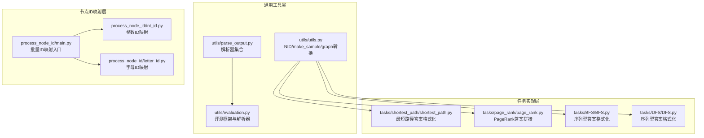
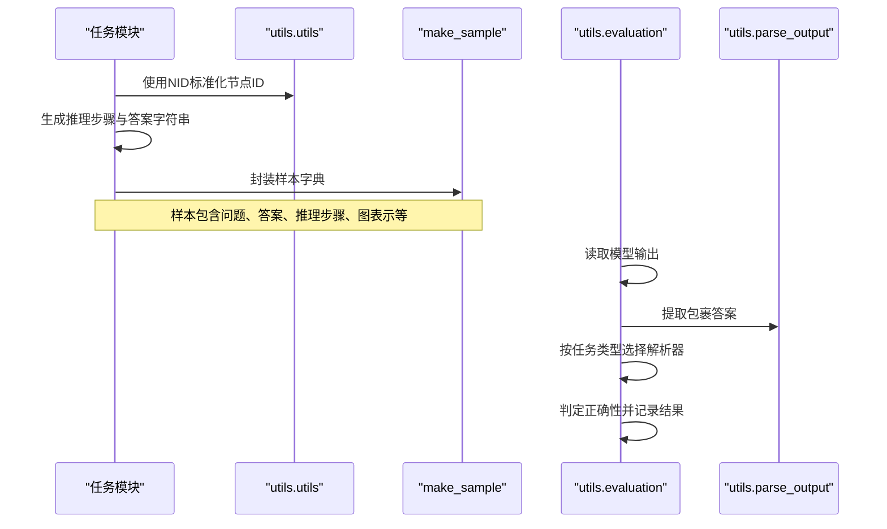
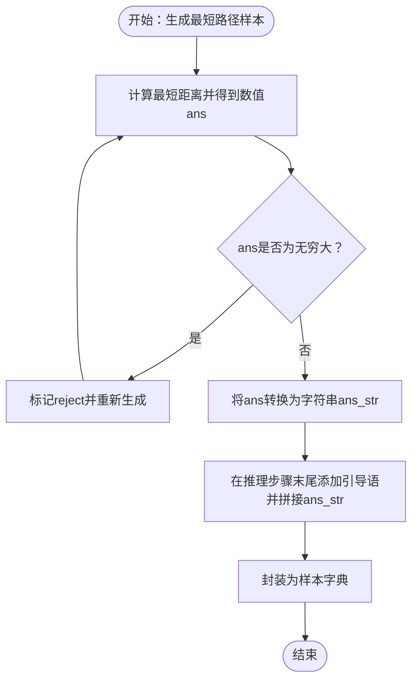
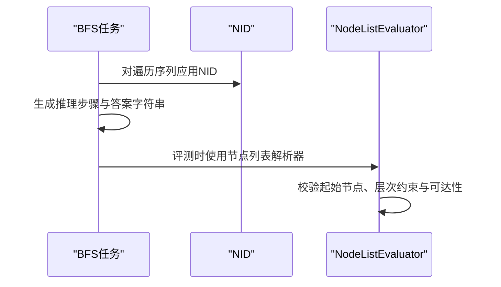
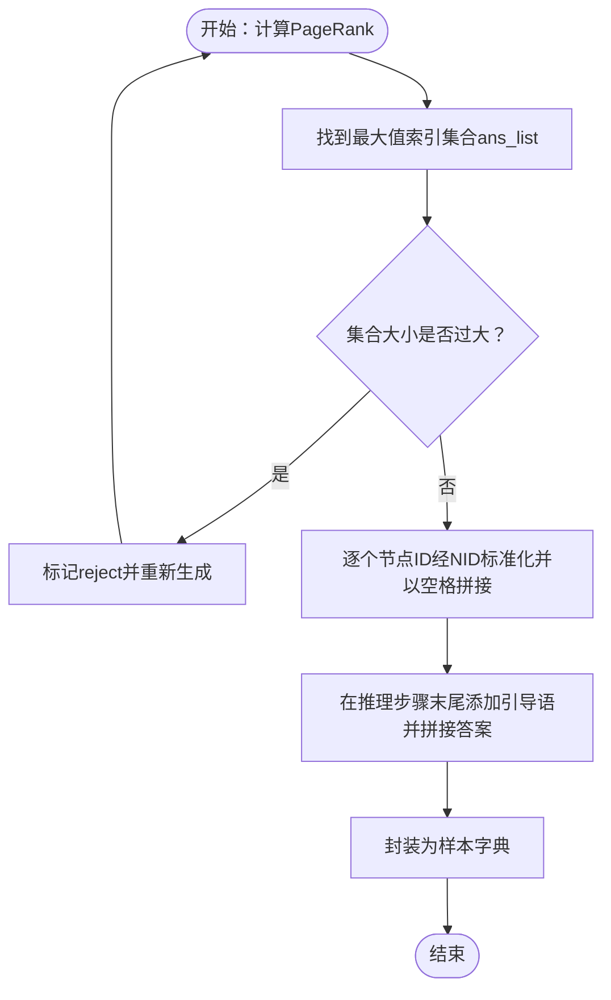
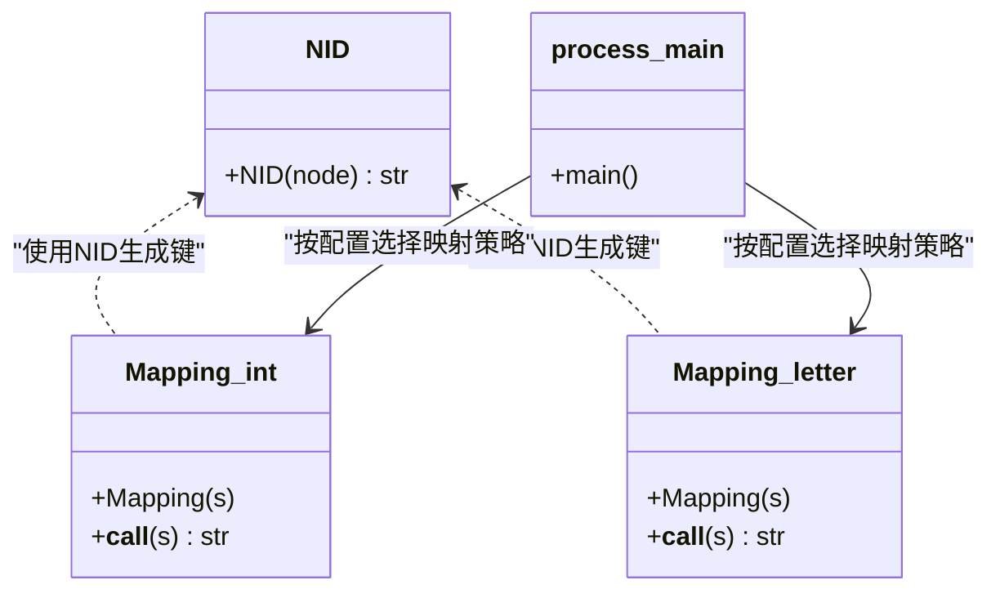
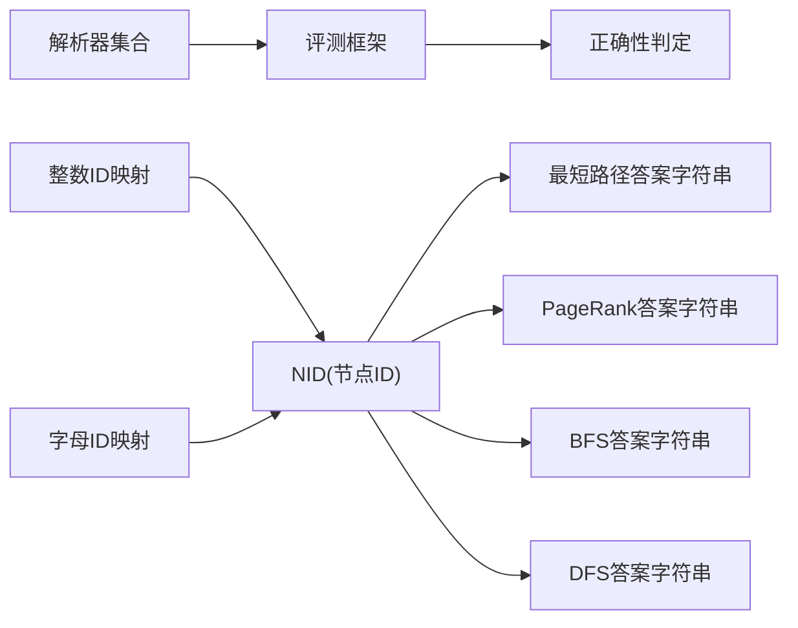

# 答案格式化

<cite>
**本文引用的文件**
- [GTG/utils/utils.py](file://GTG/utils/utils.py)
- [GTG/utils/parse_output.py](file://GTG/utils/parse_output.py)
- [GTG/utils/evaluation.py](file://GTG/utils/evaluation.py)
- [GTG/tasks/shortest_path/shortest_path.py](file://GTG/tasks/shortest_path/shortest_path.py)
- [GTG/tasks/page_rank/page_rank.py](file://GTG/tasks/page_rank/page_rank.py)
- [GTG/tasks/BFS/BFS.py](file://GTG/tasks/BFS/BFS.py)
- [GTG/tasks/DFS/DFS.py](file://GTG/tasks/DFS/DFS.py)
- [GTG/process_node_id/main.py](file://GTG/process_node_id/main.py)
- [GTG/process_node_id/int_id.py](file://GTG/process_node_id/int_id.py)
- [GTG/process_node_id/letter_id.py](file://GTG/process_node_id/letter_id.py)
</cite>

## 目录
1. [引言](#引言)
2. [项目结构](#项目结构)
3. [核心组件](#核心组件)
4. [架构总览](#架构总览)
5. [详细组件分析](#详细组件分析)
6. [依赖关系分析](#依赖关系分析)
7. [性能考量](#性能考量)
8. [故障排查指南](#故障排查指南)
9. [结论](#结论)

## 引言
本文件聚焦于系统在生成与评估图任务时的答案格式化机制，覆盖以下关键目标：
- 面向不同任务类型（数值型、布尔型、序列型、集合型）的序列化与答案提取策略
- 以最短路径任务为例，说明如何将路径长度数值转换为字符串并嵌入“所以答案是…”引导语
- 对PageRank任务：解析多节点并列最高值时的答案拼接逻辑与空格分隔格式
- 答案标准化函数NID的调用时机与节点ID转换规则（整数/字母）
- 答案与推理步骤末尾的衔接方式，确保引导语与实际答案值的无缝连接
- 异常情况下空答案的处理策略

## 项目结构
围绕答案格式化与评估，系统主要由以下模块构成：
- 通用工具层：提供节点ID标准化、图表示转换、样本构造等基础能力
- 任务实现层：各具体任务（如最短路径、PageRank、BFS、DFS）负责生成问题、推理步骤与答案
- 输出解析与评估层：统一解析模型输出，按任务类型进行答案抽取与正确性判定
- 节点ID映射层：支持整数ID与字母ID两种编码方案，贯穿数据生成与评估流程

图表来源
- [GTG/utils/utils.py](file://GTG/utils/utils.py#L56-L71)
- [GTG/utils/parse_output.py](file://GTG/utils/parse_output.py#L1-L213)
- [GTG/utils/evaluation.py](file://GTG/utils/evaluation.py#L1-L283)
- [GTG/tasks/shortest_path/shortest_path.py](file://GTG/tasks/shortest_path/shortest_path.py#L1-L140)
- [GTG/tasks/page_rank/page_rank.py](file://GTG/tasks/page_rank/page_rank.py#L1-L129)
- [GTG/tasks/BFS/BFS.py](file://GTG/tasks/BFS/BFS.py#L1-L212)
- [GTG/tasks/DFS/DFS.py](file://GTG/tasks/DFS/DFS.py#L1-L333)
- [GTG/process_node_id/main.py](file://GTG/process_node_id/main.py#L1-L58)
- [GTG/process_node_id/int_id.py](file://GTG/process_node_id/int_id.py#L1-L21)
- [GTG/process_node_id/letter_id.py](file://GTG/process_node_id/letter_id.py#L1-L33)

章节来源
- [GTG/utils/utils.py](file://GTG/utils/utils.py#L1-L120)
- [GTG/utils/parse_output.py](file://GTG/utils/parse_output.py#L1-L213)
- [GTG/utils/evaluation.py](file://GTG/utils/evaluation.py#L1-L120)
- [GTG/tasks/shortest_path/shortest_path.py](file://GTG/tasks/shortest_path/shortest_path.py#L1-L140)
- [GTG/tasks/page_rank/page_rank.py](file://GTG/tasks/page_rank/page_rank.py#L1-L129)
- [GTG/tasks/BFS/BFS.py](file://GTG/tasks/BFS/BFS.py#L1-L212)
- [GTG/tasks/DFS/DFS.py](file://GTG/tasks/DFS/DFS.py#L1-L333)
- [GTG/process_node_id/main.py](file://GTG/process_node_id/main.py#L1-L58)
- [GTG/process_node_id/int_id.py](file://GTG/process_node_id/int_id.py#L1-L21)
- [GTG/process_node_id/letter_id.py](file://GTG/process_node_id/letter_id.py#L1-L33)

## 核心组件
- NID标准化函数：用于将节点ID包装为统一格式，便于在文本中标识节点；支持单个、列表与数组输入
- make_sample：构建标准样本字典，包含任务名、图表示、节点集合、问题、答案、推理步骤、选项与标签等字段
- 解析器集合：提供布尔、整数、浮点、节点列表、节点集合、字典、带权重列表/字典等多种解析能力
- 评测框架：统一的评测流程，先包裹答案提取，再按任务类型解析并判定正确性
- 节点ID映射：整数ID与字母ID两种映射策略，支持批量替换，保证训练/评估一致性

章节来源
- [GTG/utils/utils.py](file://GTG/utils/utils.py#L56-L71)
- [GTG/utils/utils.py](file://GTG/utils/utils.py#L14-L35)
- [GTG/utils/parse_output.py](file://GTG/utils/parse_output.py#L44-L213)
- [GTG/utils/evaluation.py](file://GTG/utils/evaluation.py#L1-L120)
- [GTG/process_node_id/int_id.py](file://GTG/process_node_id/int_id.py#L1-L21)
- [GTG/process_node_id/letter_id.py](file://GTG/process_node_id/letter_id.py#L1-L33)

## 架构总览
答案格式化与评估的整体流程如下：
- 任务生成阶段：任务模块生成问题、推理步骤与答案字符串，并通过NID对节点ID进行标准化
- 样本封装阶段：使用make_sample统一打包样本字段
- 评测阶段：评测框架先从模型输出中提取包裹的答案，再根据任务类型调用相应解析器，最后判定正确性

图表来源
- [GTG/tasks/shortest_path/shortest_path.py](file://GTG/tasks/shortest_path/shortest_path.py#L115-L133)
- [GTG/tasks/page_rank/page_rank.py](file://GTG/tasks/page_rank/page_rank.py#L96-L110)
- [GTG/utils/utils.py](file://GTG/utils/utils.py#L14-L35)
- [GTG/utils/evaluation.py](file://GTG/utils/evaluation.py#L23-L54)
- [GTG/utils/parse_output.py](file://GTG/utils/parse_output.py#L8-L24)

## 详细组件分析

### 数值型任务：最短路径
- 答案序列化：最短路径任务将数值答案转换为字符串后直接拼接到“所以答案是…”引导语之后
- 引导语衔接：推理步骤末尾以“所以最短距离从节点X到节点Y是”作为引导，随后追加答案字符串
- 异常处理：若最短距离为无穷大，则拒绝该样本并重新生成，避免无效答案
- 评测解析：评测框架使用整数解析器提取答案，允许无穷远场景被拒绝

图表来源
- [GTG/tasks/shortest_path/shortest_path.py](file://GTG/tasks/shortest_path/shortest_path.py#L41-L91)
- [GTG/utils/evaluation.py](file://GTG/utils/evaluation.py#L69-L80)

章节来源
- [GTG/tasks/shortest_path/shortest_path.py](file://GTG/tasks/shortest_path/shortest_path.py#L41-L91)
- [GTG/utils/evaluation.py](file://GTG/utils/evaluation.py#L69-L80)

### 布尔型任务：示例（BFS/DFS）
- 答案序列化：序列型任务（如BFS/DFS）将遍历顺序以列表形式返回，并通过NID进行节点ID标准化
- 引导语衔接：推理步骤末尾以“所以…遍历是”作为引导，随后追加标准化后的答案字符串
- 评测解析：使用节点列表解析器，校验输出是否为有效节点序列且满足拓扑约束

图表来源
- [GTG/tasks/BFS/BFS.py](file://GTG/tasks/BFS/BFS.py#L57-L67)
- [GTG/tasks/DFS/DFS.py](file://GTG/tasks/DFS/DFS.py#L45-L56)
- [GTG/utils/utils.py](file://GTG/utils/utils.py#L56-L71)
- [GTG/utils/evaluation.py](file://GTG/utils/evaluation.py#L114-L141)

章节来源
- [GTG/tasks/BFS/BFS.py](file://GTG/tasks/BFS/BFS.py#L57-L67)
- [GTG/tasks/DFS/DFS.py](file://GTG/tasks/DFS/DFS.py#L45-L56)
- [GTG/utils/evaluation.py](file://GTG/utils/evaluation.py#L114-L141)

### 序列型任务：BFS/DFS
- 答案序列化：将遍历顺序作为节点列表，使用NID进行标准化，形成可读的序列字符串
- 引导语衔接：推理步骤末尾以“所以…遍历是”作为引导，随后追加答案字符串
- 评测解析：基于网络拓扑验证输出序列是否符合BFS/DFS的访问顺序与邻接关系

章节来源
- [GTG/tasks/BFS/BFS.py](file://GTG/tasks/BFS/BFS.py#L57-L67)
- [GTG/tasks/DFS/DFS.py](file://GTG/tasks/DFS/DFS.py#L45-L56)
- [GTG/utils/evaluation.py](file://GTG/utils/evaluation.py#L114-L141)

### 集合型任务：PageRank
- 多节点并列最高值：当多个节点具有相同的最大PageRank值时，任务会收集这些节点索引
- 答案拼接逻辑：将每个节点ID通过NID标准化后，以空格分隔拼接为答案字符串
- 引导语衔接：推理步骤末尾以“所以…最大PageRank值的节点是”作为引导，随后追加答案字符串
- 评测解析：评测器将用户输出视为节点集合，与样本中存储的答案集合进行集合相等比较

图表来源
- [GTG/tasks/page_rank/page_rank.py](file://GTG/tasks/page_rank/page_rank.py#L62-L76)
- [GTG/tasks/page_rank/page_rank.py](file://GTG/tasks/page_rank/page_rank.py#L113-L129)
- [GTG/utils/evaluation.py](file://GTG/utils/evaluation.py#L128-L141)

章节来源
- [GTG/tasks/page_rank/page_rank.py](file://GTG/tasks/page_rank/page_rank.py#L62-L76)
- [GTG/tasks/page_rank/page_rank.py](file://GTG/tasks/page_rank/page_rank.py#L113-L129)
- [GTG/utils/evaluation.py](file://GTG/utils/evaluation.py#L128-L141)

### 答案标准化函数NID的调用时机与节点ID转换规则
- 调用时机：
  - 问题生成：在构造问题字符串时，使用NID对起点/终点或起始节点进行标准化
  - 答案生成：在构造答案字符串时，使用NID对数值（最短路径）、序列（BFS/DFS）、集合（PageRank）进行标准化
  - 图表示：在生成自然语言描述、邻接表、边列表等图表示时，使用NID对节点ID进行统一包装
- 转换规则：
  - 整数ID映射：将原始整数节点ID映射为统一的“<u>”格式
  - 字母ID映射：将原始整数节点ID映射为随机三字母组合，保持一一对应
  - 批量处理：在数据预处理脚本中，对graph、graph_adj、graph_nl、nodes、question、answer、steps等字段统一执行ID映射

图表来源
- [GTG/utils/utils.py](file://GTG/utils/utils.py#L56-L71)
- [GTG/process_node_id/int_id.py](file://GTG/process_node_id/int_id.py#L1-L21)
- [GTG/process_node_id/letter_id.py](file://GTG/process_node_id/letter_id.py#L1-L33)
- [GTG/process_node_id/main.py](file://GTG/process_node_id/main.py#L16-L53)

章节来源
- [GTG/utils/utils.py](file://GTG/utils/utils.py#L56-L71)
- [GTG/process_node_id/int_id.py](file://GTG/process_node_id/int_id.py#L1-L21)
- [GTG/process_node_id/letter_id.py](file://GTG/process_node_id/letter_id.py#L1-L33)
- [GTG/process_node_id/main.py](file://GTG/process_node_id/main.py#L16-L53)

### 答案与推理步骤末尾的衔接方式
- 最短路径：在推理步骤末尾添加“所以最短距离从节点X到节点Y是”，随后追加数值字符串
- PageRank：在推理步骤末尾添加“所以…最大PageRank值的节点是”，随后追加以空格分隔的节点ID字符串
- 序列型任务：在推理步骤末尾添加“所以…遍历是”，随后追加标准化后的序列字符串
- 统一原则：引导语与答案之间不额外插入标点，确保“所以答案是…”类引导语与实际答案值的无缝连接

章节来源
- [GTG/tasks/shortest_path/shortest_path.py](file://GTG/tasks/shortest_path/shortest_path.py#L78-L91)
- [GTG/tasks/page_rank/page_rank.py](file://GTG/tasks/page_rank/page_rank.py#L69-L76)
- [GTG/tasks/BFS/BFS.py](file://GTG/tasks/BFS/BFS.py#L57-L67)
- [GTG/tasks/DFS/DFS.py](file://GTG/tasks/DFS/DFS.py#L45-L56)

### 异常情况下的空答案处理策略
- 包裹答案缺失：若模型输出未包含包裹标记，评测框架直接判定为空答案并置正确率为0
- 数值/浮点解析失败：移除输出中的节点ID标记后尝试解析首个整数或浮点数，失败则置空答案并置正确率为0
- PageRank多节点并列：当并列节点过多时拒绝该样本，避免答案歧义
- 无穷远距离：最短路径任务检测到无穷远距离时拒绝该样本，避免无效答案

章节来源
- [GTG/utils/evaluation.py](file://GTG/utils/evaluation.py#L23-L54)
- [GTG/utils/evaluation.py](file://GTG/utils/evaluation.py#L159-L178)
- [GTG/utils/evaluation.py](file://GTG/utils/evaluation.py#L180-L199)
- [GTG/tasks/shortest_path/shortest_path.py](file://GTG/tasks/shortest_path/shortest_path.py#L86-L91)
- [GTG/tasks/page_rank/page_rank.py](file://GTG/tasks/page_rank/page_rank.py#L62-L76)

## 依赖关系分析
- 任务模块依赖NID进行节点ID标准化，确保问题与答案的一致性
- 评测框架依赖解析器集合，按任务类型选择解析策略
- 节点ID映射层贯穿数据生成与评估，保证训练/测试一致

图表来源
- [GTG/utils/utils.py](file://GTG/utils/utils.py#L56-L71)
- [GTG/utils/parse_output.py](file://GTG/utils/parse_output.py#L44-L213)
- [GTG/utils/evaluation.py](file://GTG/utils/evaluation.py#L1-L120)
- [GTG/process_node_id/int_id.py](file://GTG/process_node_id/int_id.py#L1-L21)
- [GTG/process_node_id/letter_id.py](file://GTG/process_node_id/letter_id.py#L1-L33)

章节来源
- [GTG/utils/utils.py](file://GTG/utils/utils.py#L56-L71)
- [GTG/utils/parse_output.py](file://GTG/utils/parse_output.py#L44-L213)
- [GTG/utils/evaluation.py](file://GTG/utils/evaluation.py#L1-L120)
- [GTG/process_node_id/int_id.py](file://GTG/process_node_id/int_id.py#L1-L21)
- [GTG/process_node_id/letter_id.py](file://GTG/process_node_id/letter_id.py#L1-L33)

## 性能考量
- NID与映射：NID与映射操作均为字符串替换，复杂度与文本长度线性相关；批量ID映射通过DataFrame循环处理，注意I/O与内存占用
- 解析器：解析器采用正则与简单字符串处理，整体开销较小；建议在评测前尽量减少冗余节点ID标记，提高解析效率
- 评测流程：评测框架按任务类型选择解析器，避免不必要的解析尝试，提升吞吐

## 故障排查指南
- 包裹答案缺失：检查模型输出是否包含包裹标记，否则评测将直接置空答案
- 节点ID不匹配：确认使用NID进行标准化，避免混合使用原始ID与标准化ID
- PageRank并列过多：适当调整参数或样本规模，避免过多并列导致拒绝
- 浮点误差：数值型评测允许一定误差范围，若仍失败，检查答案格式与单位

章节来源
- [GTG/utils/evaluation.py](file://GTG/utils/evaluation.py#L23-L54)
- [GTG/utils/evaluation.py](file://GTG/utils/evaluation.py#L82-L95)
- [GTG/tasks/page_rank/page_rank.py](file://GTG/tasks/page_rank/page_rank.py#L62-L76)

## 结论
系统通过NID标准化、任务特定的答案格式化与统一的评测解析流程，实现了对数值型、布尔型、序列型与集合型任务的一致化处理。最短路径任务将数值答案直接拼接至引导语后，PageRank任务在多节点并列时采用空格分隔的集合式答案，序列型任务以列表形式标准化输出。评测框架在包裹答案缺失或解析失败时采取空答案策略，确保评估的稳健性。节点ID映射层提供了整数与字母两种策略，保障了数据生成与评估的连贯性与一致性。