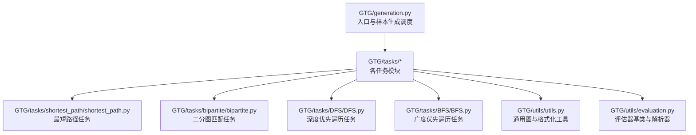
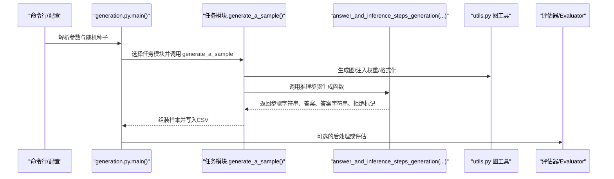
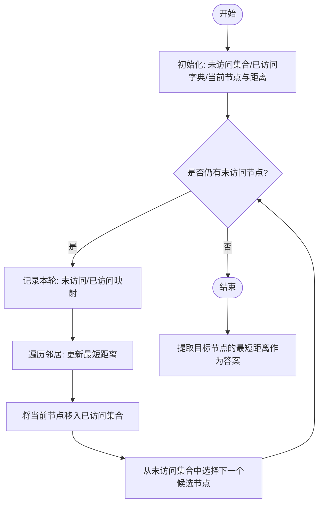
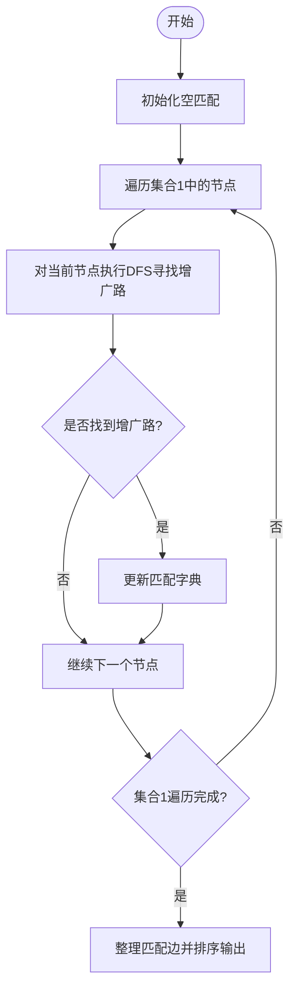
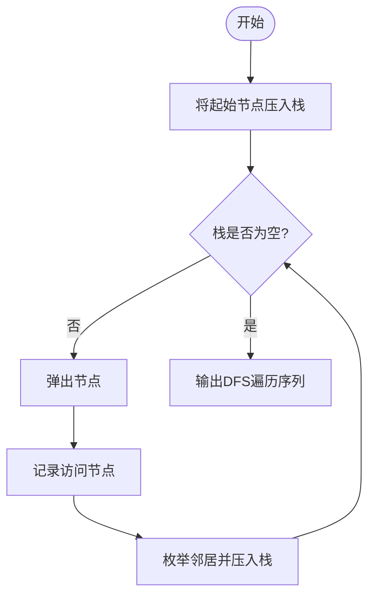
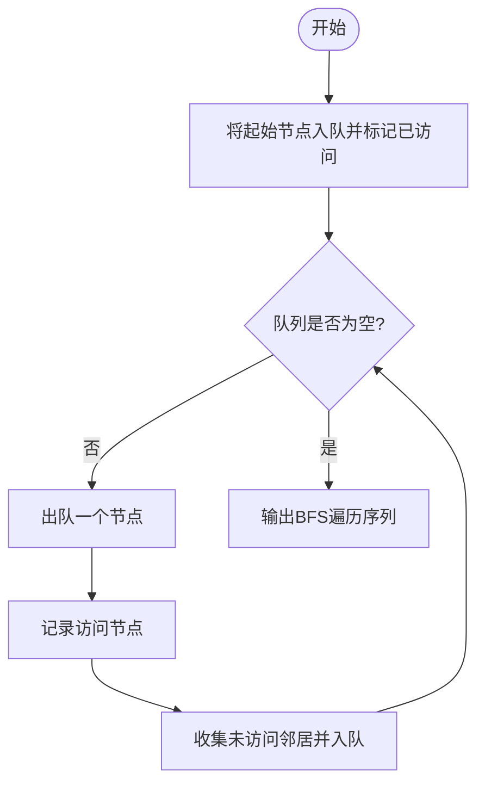
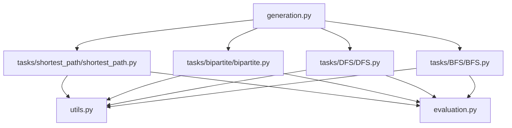

# 答案计算与推理步骤生成

<cite>
**本文引用的文件**
- [generation.py](file://GTG/generation.py)
- [shortest_path.py](file://GTG/tasks/shortest_path/shortest_path.py)
- [bipartite.py](file://GTG/tasks/bipartite/bipartite.py)
- [DFS.py](file://GTG/tasks/DFS/DFS.py)
- [BFS.py](file://GTG/tasks/BFS/BFS.py)
- [utils.py](file://GTG/utils/utils.py)
- [evaluation.py](file://GTG/utils/evaluation.py)
</cite>

## 目录
1. [引言](#引言)
2. [项目结构](#项目结构)
3. [核心组件](#核心组件)
4. [架构总览](#架构总览)
5. [详细组件分析](#详细组件分析)
6. [依赖关系分析](#依赖关系分析)
7. [性能考量](#性能考量)
8. [故障排查指南](#故障排查指南)
9. [结论](#结论)

## 引言
本文件聚焦于“答案计算与推理步骤生成”的核心逻辑，系统性解析以下要点：
- 如何通过任务模块统一生成样本并调用各算法任务的推理步骤生成函数；
- 在最短路径任务中，如何以Dijkstra算法为主线，记录每轮未访问节点、已访问节点与距离更新过程；
- 在二分图匹配任务中，如何以匈牙利算法（基于增广路DFS）为主线，逐步更新匹配状态；
- 推理步骤的自然语言构造策略，包括引导语、步骤衔接与最终答案的逻辑一致性；
- 与网络库（networkx）的交互方式与数据结构组织。

## 项目结构
该仓库采用按任务分层的组织方式：顶层入口负责参数解析与样本生成；每个任务模块提供问题生成、答案与推理步骤生成、可选的选择项生成与评估器；工具模块提供通用图操作与格式化能力。

图表来源
- [generation.py](file://GTG/generation.py#L1-L107)
- [shortest_path.py](file://GTG/tasks/shortest_path/shortest_path.py#L1-L140)
- [bipartite.py](file://GTG/tasks/bipartite/bipartite.py#L1-L135)
- [DFS.py](file://GTG/tasks/DFS/DFS.py#L1-L333)
- [BFS.py](file://GTG/tasks/BFS/BFS.py#L1-L212)
- [utils.py](file://GTG/utils/utils.py#L1-L617)
- [evaluation.py](file://GTG/utils/evaluation.py#L1-L283)

章节来源
- [generation.py](file://GTG/generation.py#L1-L107)

## 核心组件
- 入口与样本生成调度：根据配置选择任务模块，生成样本并保存统计信息。
- 任务模块：每个任务模块包含问题生成、答案与推理步骤生成、可选的选择项生成与评估器。
- 工具模块：提供图生成、权重注入、邻接与自然语言描述转换、节点ID格式化等。
- 评估器：定义输出解析与正确性校验流程，支持整数、布尔、浮点、节点序列等多种类型。

章节来源
- [generation.py](file://GTG/generation.py#L1-L107)
- [utils.py](file://GTG/utils/utils.py#L1-L617)
- [evaluation.py](file://GTG/utils/evaluation.py#L1-L283)

## 架构总览
下图展示了从入口到任务模块再到工具与评估的整体调用链。

图表来源
- [generation.py](file://GTG/generation.py#L1-L107)
- [shortest_path.py](file://GTG/tasks/shortest_path/shortest_path.py#L115-L134)
- [bipartite.py](file://GTG/tasks/bipartite/bipartite.py#L81-L91)
- [DFS.py](file://GTG/tasks/DFS/DFS.py#L125-L140)
- [BFS.py](file://GTG/tasks/BFS/BFS.py#L139-L154)
- [utils.py](file://GTG/utils/utils.py#L1-L617)
- [evaluation.py](file://GTG/utils/evaluation.py#L1-L283)

## 详细组件分析

### 最短路径任务：Dijkstra 算法的推理步骤生成
- 问题生成：随机选择起点与终点，避免重合。
- 答案与推理步骤生成：
  - 初始化未访问集合与已访问字典，当前节点与距离；
  - 每轮记录“未访问节点”和“已访问节点”的映射；
  - 遍历当前节点邻居，更新邻居的最短距离；
  - 将当前节点移入已访问集合，并从未访问集合中选取下一个候选节点（按距离升序）；
  - 循环直至无未访问节点，最终输出已访问节点中的目标距离作为答案。
- 自然语言引导：以“让我们逐步解决”开头，明确算法为Dijkstra，并在每轮输出当前状态。
- 逻辑一致性：最终答案取自已访问集合中目标节点的距离；若目标不可达则返回无穷大并在上层进行拒绝重采样。

图表来源
- [shortest_path.py](file://GTG/tasks/shortest_path/shortest_path.py#L41-L91)

章节来源
- [shortest_path.py](file://GTG/tasks/shortest_path/shortest_path.py#L22-L39)
- [shortest_path.py](file://GTG/tasks/shortest_path/shortest_path.py#L41-L91)
- [shortest_path.py](file://GTG/tasks/shortest_path/shortest_path.py#L115-L134)
- [utils.py](file://GTG/utils/utils.py#L352-L366)

### 二分图匹配任务：匈牙利算法（DFS 增广路）的推理步骤生成
- 问题生成：给出两个节点集合的名称与成员，要求求最大匹配。
- 答案与推理步骤生成：
  - 初始化空匹配；
  - 对集合1中的每个节点，执行DFS寻找增广路；若找到则更新匹配；
  - 收集所有匹配边，排序后输出；
  - 步骤字符串包含“让我们逐步解决”“初始化空匹配”“迭代集合1”“更新匹配”等引导语。
- 自然语言引导：强调“匈牙利算法”，并在每轮增广后输出当前匹配状态。
- 逻辑一致性：最终答案为匹配边集合，评估器会校验匹配合法性（边两端分别属于两集合且不重复）。

图表来源
- [bipartite.py](file://GTG/tasks/bipartite/bipartite.py#L35-L74)

章节来源
- [bipartite.py](file://GTG/tasks/bipartite/bipartite.py#L21-L33)
- [bipartite.py](file://GTG/tasks/bipartite/bipartite.py#L35-L74)
- [bipartite.py](file://GTG/tasks/bipartite/bipartite.py#L81-L91)
- [utils.py](file://GTG/utils/utils.py#L408-L434)

### 深度优先遍历任务：DFS 的推理步骤生成
- 问题生成：给定起始节点，输出DFS遍历序列。
- 答案与推理步骤生成：
  - 使用栈模拟DFS，记录每次弹出节点、访问邻居与栈状态；
  - 输出“让我们运行DFS逐步执行”等引导语；
  - 若遍历长度过短则拒绝重采样。
- 逻辑一致性：最终答案为遍历序列，评估器会校验是否满足DFS约束。

图表来源
- [DFS.py](file://GTG/tasks/DFS/DFS.py#L23-L56)

章节来源
- [DFS.py](file://GTG/tasks/DFS/DFS.py#L12-L21)
- [DFS.py](file://GTG/tasks/DFS/DFS.py#L23-L56)
- [DFS.py](file://GTG/tasks/DFS/DFS.py#L125-L140)

### 广度优先遍历任务：BFS 的推理步骤生成
- 问题生成：给定起始节点，输出BFS遍历序列。
- 答案与推理步骤生成：
  - 使用队列模拟BFS，记录每轮访问节点与未访问邻居；
  - 输出“让我们运行BFS逐步执行”等引导语；
  - 若遍历长度过短则拒绝重采样。
- 逻辑一致性：最终答案为遍历序列，评估器会校验按层次（按最短距离分层）的顺序。

图表来源
- [BFS.py](file://GTG/tasks/BFS/BFS.py#L24-L67)

章节来源
- [BFS.py](file://GTG/tasks/BFS/BFS.py#L13-L21)
- [BFS.py](file://GTG/tasks/BFS/BFS.py#L24-L67)
- [BFS.py](file://GTG/tasks/BFS/BFS.py#L139-L154)

### 通用工具与评估
- 图生成与权重注入：提供随机图、BA图、WS图等生成器，并为边注入权重。
- 格式化与转换：将图转为邻接表、边列表、自然语言描述等；提供节点ID格式化。
- 评估器基类：定义解析输出、判断正确性的统一流程；具体任务继承相应评估器并实现解析与校验。

章节来源
- [utils.py](file://GTG/utils/utils.py#L224-L366)
- [utils.py](file://GTG/utils/utils.py#L352-L366)
- [utils.py](file://GTG/utils/utils.py#L73-L175)
- [evaluation.py](file://GTG/utils/evaluation.py#L1-L283)

## 依赖关系分析
- 任务模块依赖工具模块提供的图生成、权重注入与格式化函数；
- 入口模块通过任务名映射到具体任务模块，统一调度样本生成；
- 评估器依赖解析器与网络库进行正确性判断。

图表来源
- [generation.py](file://GTG/generation.py#L29-L57)
- [shortest_path.py](file://GTG/tasks/shortest_path/shortest_path.py#L1-L20)
- [bipartite.py](file://GTG/tasks/bipartite/bipartite.py#L1-L12)
- [DFS.py](file://GTG/tasks/DFS/DFS.py#L1-L10)
- [BFS.py](file://GTG/tasks/BFS/BFS.py#L1-L10)
- [utils.py](file://GTG/utils/utils.py#L1-L617)
- [evaluation.py](file://GTG/utils/evaluation.py#L1-L283)

章节来源
- [generation.py](file://GTG/generation.py#L29-L57)

## 性能考量
- 时间复杂度：
  - Dijkstra（朴素实现）：每轮选择最小未访问节点需线性扫描，整体约为 O(V^2)，配合邻接表可达 O(V log V + E)（若使用堆优化）。
  - 匈牙利算法（DFS增广）：单次DFS为 O(V+E)，整体约为 O(V·(V+E))。
  - DFS/BFS：均为 O(V+E)。
- 空间复杂度：主要由图存储与辅助集合（栈/队列/访问集合）决定。
- 实践建议：
  - 最短路径：若图较大，建议使用堆优化的Dijkstra或networkx内置算法以提升效率。
  - 匹配问题：对于稀疏图，DFS增广路通常足够高效；若需理论最优，可考虑更高级的匹配算法。
  - 生成器：随机图生成时注意避免孤立节点与极端密度，以保证评测稳定性。

## 故障排查指南
- 最短路径不可达：当目标节点始终无法到达时，答案为无穷大，上层会拒绝该样本并重新生成。
- 匹配非法：评估器会检查边两端是否分别属于两集合、是否出现重复节点，任一不满足即判错。
- DFS/BFS序列不合法：评估器会校验遍历序列是否满足深度/广度优先约束，例如是否按最短距离分层等。
- 输出解析失败：评估器基类会尝试解析包裹的答案字符串，若无法解析则标记为错误。

章节来源
- [shortest_path.py](file://GTG/tasks/shortest_path/shortest_path.py#L84-L91)
- [bipartite.py](file://GTG/tasks/bipartite/bipartite.py#L94-L135)
- [DFS.py](file://GTG/tasks/DFS/DFS.py#L143-L165)
- [BFS.py](file://GTG/tasks/BFS/BFS.py#L157-L191)
- [evaluation.py](file://GTG/utils/evaluation.py#L1-L54)

## 结论
本项目通过统一的任务模块接口与工具库，实现了多种图算法的“答案计算+推理步骤生成”。最短路径任务以Dijkstra为主线，清晰记录每轮状态；二分图匹配任务以匈牙利算法（DFS增广）为主线，逐步更新匹配状态；DFS/BFS任务分别以栈/队列模拟遍历并输出自然语言步骤。评估器提供了统一的解析与校验框架，确保最终答案与推理步骤的逻辑一致性。在实际部署中，建议针对大规模图采用堆优化的Dijkstra与更高效的匹配算法，并持续监控样本质量与评测稳定性。