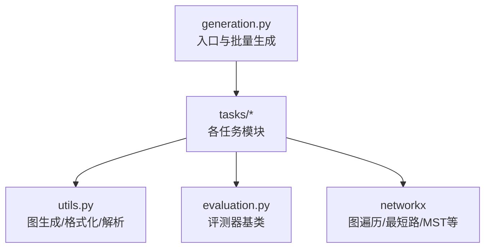
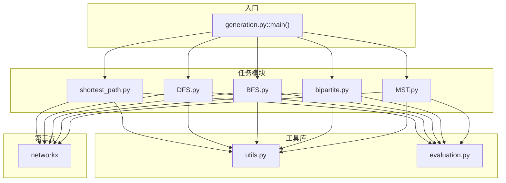
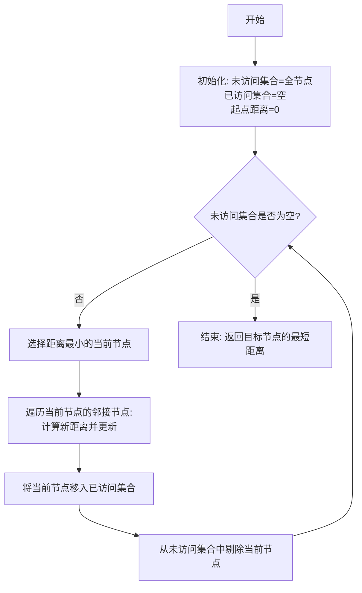
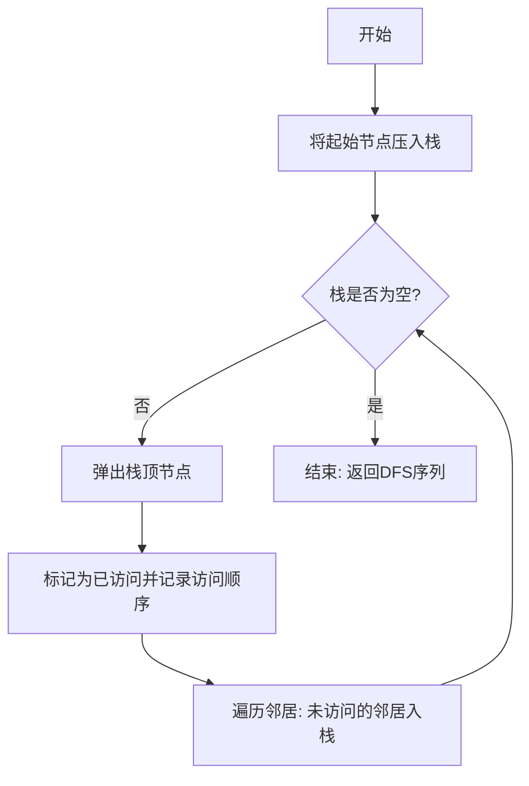
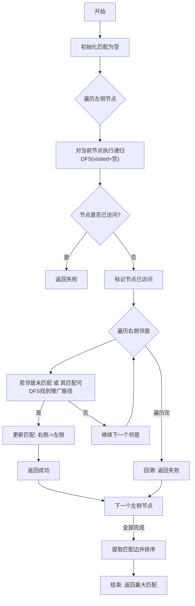
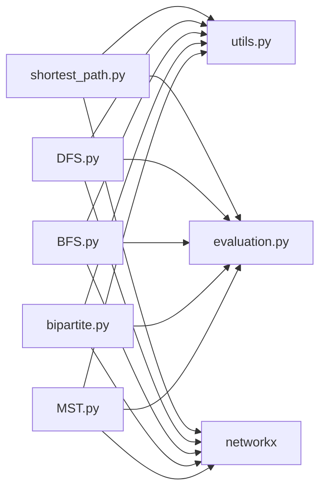

# 算法执行逻辑

<cite>
**本文引用的文件**
- [generation.py](file://GTG/generation.py)
- [utils.py](file://GTG/utils/utils.py)
- [evaluation.py](file://GTG/utils/evaluation.py)
- [shortest_path.py](file://GTG/tasks/shortest_path/shortest_path.py)
- [DFS.py](file://GTG/tasks/DFS/DFS.py)
- [BFS.py](file://GTG/tasks/BFS/BFS.py)
- [bipartite.py](file://GTG/tasks/bipartite/bipartite.py)
- [MST.py](file://GTG/tasks/MST/MST.py)
</cite>

## 目录
1. [引言](#引言)
2. [项目结构](#项目结构)
3. [核心组件](#核心组件)
4. [架构总览](#架构总览)
5. [详细组件分析](#详细组件分析)
6. [依赖关系分析](#依赖关系分析)
7. [性能考量](#性能考量)
8. [故障排查指南](#故障排查指南)
9. [结论](#结论)

## 引言
本文件围绕图论算法在答案生成过程中的执行机制展开，重点以Dijkstra最短路、DFS深度优先搜索、二分图最大匹配（匈牙利算法）为例，系统梳理：
- 如何通过维护未访问节点集合与已访问节点距离字典逐步扩展最短路径树，并在每轮迭代中记录当前节点、邻接节点及距离更新情况；
- DFS中栈结构的使用方式，如何通过后进先出策略实现深度优先遍历，并记录访问顺序与回溯过程；
- 二分图匹配任务中，匈牙利算法递归深度优先搜索的增广路径查找机制，包括访问标记、匹配状态更新与路径回溯逻辑；
- 结合networkx库的图遍历接口，说明算法实现与标准图论定义的一致性；
- 讨论时间复杂度与空间复杂度对生成样本规模的影响。

## 项目结构
该项目采用“任务模块化 + 工具库 + 评测器”的分层组织：
- 顶层入口负责参数解析、随机种子设定、任务选择与样本批量生成；
- 各任务模块提供问题生成、推理步骤生成、答案生成与可选的选择项生成；
- 工具库提供图生成、格式化输出、解析与评测器基类等通用能力；
- 评测器基类统一处理输出解析与正确性判定流程。

图表来源
- [generation.py](file://GTG/generation.py#L1-L107)
- [utils.py](file://GTG/utils/utils.py#L1-L617)
- [evaluation.py](file://GTG/utils/evaluation.py#L1-L283)

章节来源
- [generation.py](file://GTG/generation.py#L1-L107)

## 核心组件
- 入口与生成管线：根据配置选择任务模块，循环生成样本并统计描述信息。
- 图生成与格式化：提供多种图模型（随机、BA、WS），支持加权图与二分图；提供邻接表、自然语言描述等多形态输出。
- 评测器基类：统一解析输出、调用具体任务评测器进行正确性判定。

章节来源
- [generation.py](file://GTG/generation.py#L1-L107)
- [utils.py](file://GTG/utils/utils.py#L1-L617)
- [evaluation.py](file://GTG/utils/evaluation.py#L1-L283)

## 架构总览
下图展示了从入口到任务模块再到工具库与评测器的整体交互关系。

图表来源
- [generation.py](file://GTG/generation.py#L1-L107)
- [shortest_path.py](file://GTG/tasks/shortest_path/shortest_path.py#L1-L140)
- [DFS.py](file://GTG/tasks/DFS/DFS.py#L1-L333)
- [BFS.py](file://GTG/tasks/BFS/BFS.py#L1-L212)
- [bipartite.py](file://GTG/tasks/bipartite/bipartite.py#L1-L135)
- [MST.py](file://GTG/tasks/MST/MST.py#L1-L267)
- [utils.py](file://GTG/utils/utils.py#L1-L617)
- [evaluation.py](file://GTG/utils/evaluation.py#L1-L283)

## 详细组件分析

### Dijkstra 最短路径：未访问集合与距离字典的逐步扩展
- 维护数据结构
  - 未访问节点集合：以字典形式记录每个节点的当前最短距离初值（无穷大或空）。
  - 已访问节点距离字典：记录已确定最短距离的节点及其距离。
- 迭代扩展
  - 每轮迭代选择当前未访问节点中距离最小者作为当前节点；
  - 遍历其邻接节点，计算经由当前节点到达邻接节点的新距离，若更优则更新；
  - 将当前节点移入已访问集合，从未访问集合删除；
  - 当未访问集合为空时结束，返回目标节点的最短距离。
- 步骤记录
  - 在每次迭代中输出未访问与已访问集合的状态，以及邻接节点与距离更新情况，便于解释推理过程。

图表来源
- [shortest_path.py](file://GTG/tasks/shortest_path/shortest_path.py#L41-L91)
- [utils.py](file://GTG/utils/utils.py#L615-L617)

章节来源
- [shortest_path.py](file://GTG/tasks/shortest_path/shortest_path.py#L41-L91)
- [utils.py](file://GTG/utils/utils.py#L615-L617)

### DFS 深度优先搜索：栈结构与回溯过程
- 栈的使用
  - 使用栈存储待访问节点，每次弹出栈顶节点进行访问；
  - 对于刚访问的节点，将其所有未访问邻居依次压入栈，保证后进先出的探索顺序。
- 访问顺序与回溯
  - 记录访问序列与每一步的邻居列表；
  - 当栈为空时，一次DFS遍历完成；若需要完整连通分量的DFS序列，可基于该过程构造。
- 输出与校验
  - 提供带步骤说明的遍历序列输出；
  - 评测器通过子路径检查与完整DFS一致性验证，确保输出符合DFS定义。

图表来源
- [DFS.py](file://GTG/tasks/DFS/DFS.py#L23-L57)
- [DFS.py](file://GTG/tasks/DFS/DFS.py#L143-L215)

章节来源
- [DFS.py](file://GTG/tasks/DFS/DFS.py#L23-L57)
- [DFS.py](file://GTG/tasks/DFS/DFS.py#L143-L215)

### 二分图匹配：匈牙利算法的增广路径查找
- 匹配初始化
  - 初始化空匹配字典，用于记录右侧节点到左侧节点的匹配关系。
- 增广路径查找（递归DFS）
  - 对左侧每个节点调用递归DFS；
  - 若当前节点已被访问，则失败；否则标记访问；
  - 遍历其右侧邻居：若某邻居未被匹配，或其匹配对象可通过递归DFS找到新的增广路径，则更新匹配关系；
  - 成功找到增广路径即返回成功，否则失败。
- 路径回溯与结果
  - 每次从一个左侧节点发起搜索都会更新匹配状态；
  - 完成一轮遍历后，将匹配对转换为边列表并排序输出。

图表来源
- [bipartite.py](file://GTG/tasks/bipartite/bipartite.py#L35-L74)

章节来源
- [bipartite.py](file://GTG/tasks/bipartite/bipartite.py#L35-L74)

### BFS 广度优先搜索：队列与层次遍历
- 队列的使用
  - 使用双端队列维护待访问节点，按层次推进；
  - 每次从队首取出节点，记录访问顺序与未访问邻居。
- 层次校验
  - 评测器将图上从起点出发的最短步数映射到各层节点集合，逐一比对输出序列中对应层节点集合的无序相等性，从而判定BFS序列的有效性。

章节来源
- [BFS.py](file://GTG/tasks/BFS/BFS.py#L24-L68)
- [BFS.py](file://GTG/tasks/BFS/BFS.py#L157-L191)

### MST 最小生成树：Prim思想与邻接矩阵
- 生成树构建
  - 以邻接矩阵表示图，Prim思想：每次从未加入集合的节点中，选取连接已加入集合的最小权重边；
  - 记录每一步加入的边，最终得到MST的边集与总权重。
- 与networkx对比
  - 同时使用networkx的最小生成树函数验证总权重，确保实现一致性。

章节来源
- [MST.py](file://GTG/tasks/MST/MST.py#L22-L109)
- [MST.py](file://GTG/tasks/MST/MST.py#L112-L200)

## 依赖关系分析
- 任务模块依赖工具库与评测器基类：
  - shortest_path、DFS、BFS、bipartite、MST均依赖utils.py中的图生成、格式化与解析工具；
  - 评测器基类统一处理输出解析与正确性判定。
- networkx作为底层图库：
  - 用于图遍历、最短路径长度、最小生成树等标准算法接口，保证实现与理论一致。

图表来源
- [shortest_path.py](file://GTG/tasks/shortest_path/shortest_path.py#L1-L140)
- [DFS.py](file://GTG/tasks/DFS/DFS.py#L1-L333)
- [BFS.py](file://GTG/tasks/BFS/BFS.py#L1-L212)
- [bipartite.py](file://GTG/tasks/bipartite/bipartite.py#L1-L135)
- [MST.py](file://GTG/tasks/MST/MST.py#L1-L267)
- [utils.py](file://GTG/utils/utils.py#L1-L617)
- [evaluation.py](file://GTG/utils/evaluation.py#L1-L283)

## 性能考量
- 时间复杂度
  - Dijkstra（朴素实现）：O(V^2)，若使用堆优化可降至O((V+E)log V)；当前实现未显式堆优化，适合中小规模图。
  - DFS/BFS：O(V+E)，取决于图的稀疏程度。
  - 匈牙利算法（DFS版）：单次DFS增广路径为O(V+E)，整体最坏可达O(VE)；实际表现受匹配质量影响。
  - Prim：邻接矩阵实现O(V^2)，网络流/最小生成树库通常更快。
- 空间复杂度
  - Dijkstra：O(V)存储距离与访问集合；
  - DFS/BFS：O(V)栈/队列与访问集合；
  - 匈牙利算法：O(V+E)递归栈与匹配字典；
  - MST：O(V^2)邻接矩阵或O(E)边集。
- 对样本规模的影响
  - 随着节点数增加，Dijkstra与匈牙利算法的运行时间增长显著；建议控制节点规模或采用更高效的实现（如堆优化Dijkstra、二分图专用算法）。
  - BFS/DFS在大规模稀疏图上仍具备较好性能，但需注意内存占用。

## 故障排查指南
- 生成阶段
  - 若最短路径返回无穷大，说明起点与终点不连通，应重新生成图或调整起点/终点。
  - DFS/BFS输出长度过短可能触发拒绝采样，需增大图规模或放宽约束。
- 评测阶段
  - DFS评测器会记录输出有效前缀长度与首个错误位置，便于定位问题；
  - BFS评测器通过层次集合一致性校验，若某层节点集合不匹配，需检查输出顺序是否符合层次遍历规则；
  - 二分图评测器会校验匹配边是否跨两个集合且无重复节点，若不满足则判定错误。

章节来源
- [shortest_path.py](file://GTG/tasks/shortest_path/shortest_path.py#L78-L91)
- [DFS.py](file://GTG/tasks/DFS/DFS.py#L143-L191)
- [BFS.py](file://GTG/tasks/BFS/BFS.py#L157-L191)
- [bipartite.py](file://GTG/tasks/bipartite/bipartite.py#L94-L135)

## 结论
本项目通过模块化的任务实现与统一的评测流程，清晰地展示了图论算法在答案生成中的执行逻辑：
- Dijkstra通过未访问集合与距离字典逐步扩展最短路径树，并在每轮迭代中记录关键状态；
- DFS利用栈实现后进先出的深度优先遍历，并记录访问顺序与回溯过程；
- 二分图匹配采用匈牙利算法的递归DFS增广路径查找，配合访问标记与匹配状态更新；
- 借助networkx的标准接口，确保实现与理论定义一致；
- 随着样本规模增大，算法的时间与空间复杂度对生成效率与稳定性提出更高要求，需结合具体任务选择合适的数据结构与优化策略。