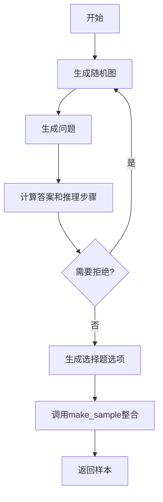
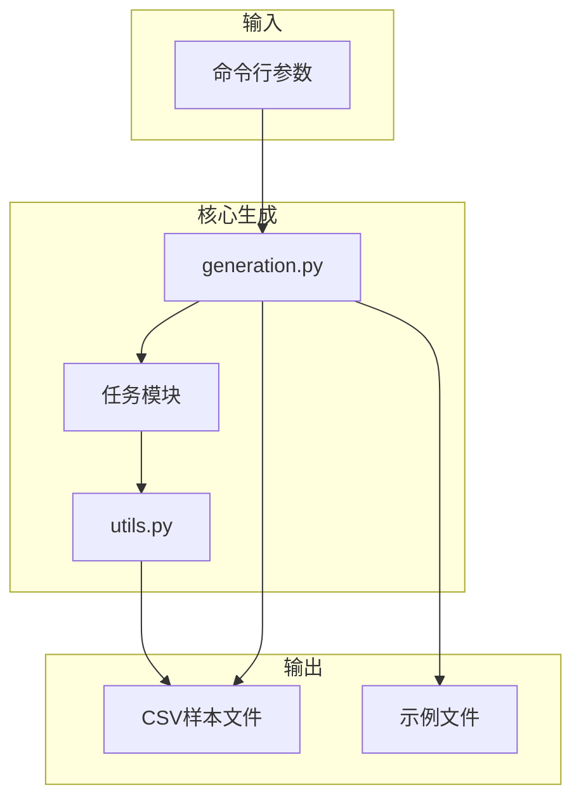

# 问题与答案生成

<cite>
**本文档引用的文件**
- [generation.py](file://GTG/generation.py)
- [edge.py](file://GTG/tasks/edge/edge.py)
- [MST.py](file://GTG/tasks/MST/MST.py)
- [BFS.py](file://GTG/tasks/BFS/BFS.py)
- [diameter.py](file://GTG/tasks/diameter/diameter.py)
- [maximum_flow.py](file://GTG/tasks/maximum_flow/maximum_flow.py)
- [connectivity.py](file://GTG/tasks/connectivity/connectivity.py)
- [neighbor.py](file://GTG/tasks/neighbor/neighbor.py)
- [utils.py](file://GTG/utils/utils.py)
- [evaluation.py](file://GTG/utils/evaluation.py)
- [parse_arguments.py](file://GTG/utils/parse_arguments.py)
</cite>

## 目录
1. [引言](#引言)
2. [问题生成机制](#问题生成机制)
3. [答案与推理步骤生成](#答案与推理步骤生成)
4. [答案格式差异分析](#答案格式差异分析)
5. [样本生成流程](#样本生成流程)
6. [选择题选项生成逻辑](#选择题选项生成逻辑)
7. [系统架构与工作流程](#系统架构与工作流程)
8. [结论](#结论)

## 引言

GraphInstruct项目旨在通过图结构生成自然语言问题和答案，用于训练和评估图推理能力。该系统通过自动化流程生成包含图结构、问题、答案、推理步骤和选择题选项的标准化样本。核心机制包括任务特定的问题生成函数、基于图算法的答案计算、详细的推理步骤生成以及最终样本的整合。本文档将深入解析这一自动化生成过程，重点关注`question_generation`、`answer_and_inference_steps_generation`和`make_sample`等核心函数的工作原理。

## 问题生成机制

问题生成机制通过任务特定的`question_generation`函数实现，该函数根据图结构和任务类型创建自然语言问题。每个任务模块（如MST、BFS、connectivity等）都实现了自己的`question_generation`函数，以生成符合其特定计算目标的问题。

对于MST（最小生成树）任务，`question_generation`函数生成一个直接的计算问题：“Output the total weight of the minimum spanning tree (MST) for this graph.” 这个问题不依赖于图中的特定节点，而是要求计算整个图的最小生成树总权重。

相比之下，BFS（广度优先搜索）任务的问题生成更具动态性。它首先随机选择一个起始节点，然后生成一个以该节点为起点的问题：“Start from node {}, output a sequence of traversal in breadth-first search (BFS) order.” 这种机制确保了每个生成的问题都是唯一的，并且与图的具体结构紧密相关。

其他任务如`edge`和`connectivity`也遵循类似的模式。`edge.py`中的`question_generation`函数会随机选择两个不同的节点，并生成一个关于它们之间是否存在边的问题，根据图的有向性生成“Is there a directed edge from node {} to node {}?”或“Is there an edge between node {} and node {}?”。

**Section sources**
- [MST.py](file://GTG/tasks/MST/MST.py#L16-L19)
- [BFS.py](file://GTG/tasks/BFS/BFS.py#L13-L21)
- [edge.py](file://GTG/tasks/edge/edge.py#L14-L31)
- [connectivity.py](file://GTG/tasks/connectivity/connectivity.py#L14-L34)

## 答案与推理步骤生成

`answer_and_inference_steps_generation`函数是系统的核心，负责执行图算法计算正确答案，并生成包含详细推理步骤的文本。该函数不仅返回最终答案，还提供了一个逐步的推理过程，这对于训练模型理解解题逻辑至关重要。

在MST任务中，该函数首先使用NetworkX库的`nx.minimum_spanning_tree`函数计算最小生成树，然后累加所有边的权重得到总权重。同时，它模拟了Prim算法的执行过程，逐步展示如何从一个起始节点开始，通过选择最小权重的边来构建生成树。推理步骤字符串详细记录了每一步收集的节点和选择的边，最终得出总权重。

对于BFS任务，`answer_and_inference_steps_generation`函数模拟了广度优先搜索的执行过程。它使用一个队列来管理待访问的节点，并逐步访问每个节点的邻居。推理步骤会记录每一步访问的节点以及发现的未访问邻居，最终形成完整的遍历序列。该函数还包含一个拒绝机制，如果生成的遍历序列过短（少于5个节点），则会拒绝该样本并重新生成，以确保问题的复杂性。

在`edge`任务中，推理过程更为直接。函数首先列出起始节点的所有邻居，然后检查目标节点是否在邻居列表中。推理步骤会明确说明“邻居是：...，其中包含/不包含节点X”，从而得出“是”或“否”的结论。

**Section sources**
- [MST.py](file://GTG/tasks/MST/MST.py#L22-L109)
- [BFS.py](file://GTG/tasks/BFS/BFS.py#L24-L67)
- [edge.py](file://GTG/tasks/edge/edge.py#L34-L65)

## 答案格式差异分析

不同任务的答案格式存在显著差异，这反映了各自计算目标的本质。系统通过不同的评估器（Evaluator）来处理这些差异。

- **布尔值（Bool）**：`connectivity`和`edge`等任务的答案是布尔值（"Yes"或"No"）。这些任务使用`BoolEvaluator`，它通过`parse_bool`函数解析输出，并与标准答案进行精确匹配。
- **数值（Int）**：`diameter`、`MST`和`degree`等任务的答案是整数。这些任务使用`IntEvaluator`，它通过`parse_first_integer`函数从输出中提取第一个整数，并与正确答案进行比较。
- **节点列表（NodeList）**：`BFS`和`DFS`等任务的答案是节点序列。这些任务使用`NodeListEvaluator`，它通过`parse_node_list`函数解析输出的节点列表。评估时，不仅检查节点是否正确，还检查顺序是否符合BFS或DFS的遍历规则。
- **节点集合（NodeSet）**：`neighbor`和`common_neighbor`等任务的答案是节点集合。这些任务使用`NodeSetEvaluator`，它允许输出中的节点顺序与标准答案不同，只要集合内容一致即可。

这种多样化的答案格式设计使得系统能够评估模型在不同类型图推理任务上的表现，从简单的存在性判断到复杂的路径和序列生成。

**Section sources**
- [evaluation.py](file://GTG/utils/evaluation.py#L56-L141)
- [diameter.py](file://GTG/tasks/diameter/diameter.py#L20-L72)
- [BFS.py](file://GTG/tasks/BFS/BFS.py#L24-L67)
- [neighbor.py](file://GTG/tasks/neighbor/neighbor.py#L29-L63)

## 样本生成流程

`make_sample`函数是整个生成流程的集成点，负责将问题、答案、推理步骤和图结构整合成一个标准化的样本。该函数定义在`utils.py`中，是所有任务模块生成样本的统一接口。

`make_sample`函数接收多个参数，包括任务名称、图对象、问题字符串、答案字符串、推理步骤字符串、选择题选项和标签。它创建一个字典，将这些信息组织成一个结构化的样本。该字典包含图的多种表示形式，如边列表字符串（`graph`）、邻接表字符串（`graph_adj`）和自然语言描述（`graph_nl`），以及图的基本属性如节点数、边数和是否有向。

每个任务模块的`generate_a_sample`函数负责调用`make_sample`。其流程通常为：首先生成一个随机图，然后调用`question_generation`生成问题，接着调用`answer_and_inference_steps_generation`计算答案和推理步骤，最后调用`choices_generation`生成选择题选项。这些组件被传递给`make_sample`，形成最终的样本。如果在生成过程中遇到需要拒绝的样本（如非连通图或过短的遍历序列），该流程会循环重试，直到生成一个有效的样本。



**Diagram sources**
- [utils.py](file://GTG/utils/utils.py#L14-L35)
- [MST.py](file://GTG/tasks/MST/MST.py#L241-L258)

**Section sources**
- [utils.py](file://GTG/utils/utils.py#L14-L35)
- [MST.py](file://GTG/tasks/MST/MST.py#L241-L260)

## 选择题选项生成逻辑

选择题选项的生成逻辑在`edge.py`和其他任务模块的`choices_generation`函数中实现。该逻辑旨在创建具有迷惑性的错误选项，同时确保正确答案的唯一性。

在`edge.py`中，`choices_generation`函数非常简单。由于答案只有“是”或“否”两种可能，选项列表固定为`[Yes, No]`。标签字符串根据正确答案是“是”还是“否”来确定，分别为'0'或'1'。

对于数值型答案的任务（如`MST`和`diameter`），`choices_generation`函数会生成三个错误答案。它首先确保0不在错误答案中（除非正确答案就是0），然后随机生成1到10之间的偏移量加到正确答案上，形成错误选项。这些选项与正确答案一起被随机打乱，以避免位置偏见。

对于节点列表或集合的任务（如`BFS`和`neighbor`），生成逻辑更为复杂。它会通过对正确答案进行随机重排、部分重排或切割重组来创建错误选项。例如，在`BFS.py`中，错误选项包括：将正确序列的后半部分随机打乱、将序列从中间切开并重新组合等。所有选项（包括正确答案）都会被随机打乱顺序，然后分配标签。

```mermaid
flowchart TD
A[开始] --> B{任务类型}
B --> |布尔值| C[固定选项: [Yes, No]]
B --> |数值| D[生成3个偏移错误答案]
B --> |节点列表| E[通过重排/切割生成错误选项]
C --> F[随机打乱选项]
D --> F
E --> F
F --> G[确定正确答案标签]
G --> H[返回选项字符串和标签]
```

**Diagram sources**
- [edge.py](file://GTG/tasks/edge/edge.py#L68-L77)
- [MST.py](file://GTG/tasks/MST/MST.py#L203-L238)
- [BFS.py](file://GTG/tasks/BFS/BFS.py#L108-L135)

**Section sources**
- [edge.py](file://GTG/tasks/edge/edge.py#L68-L77)
- [MST.py](file://GTG/tasks/MST/MST.py#L203-L238)
- [BFS.py](file://GTG/tasks/BFS/BFS.py#L108-L135)

## 系统架构与工作流程

系统的整体架构由`generation.py`中的`main`函数驱动。该函数首先解析命令行参数，设置随机种子，然后根据配置的任务名称动态导入相应的任务模块。这个设计使得系统具有高度的模块化和可扩展性，可以轻松添加新的图推理任务。

工作流程从`main`函数调用任务模块的`generate_a_sample`开始。系统会生成指定数量的样本，并将它们保存为CSV文件。在生成过程中，系统会确保样本的统计特性（如平均度数）符合要求。此外，脚本（如`MST.sh`和`BFS.sh`）会调用`process_node_id`模块，将生成的样本转换为不同的节点ID格式（如整数ID或字母ID），以增加数据的多样性。



**Diagram sources**
- [generation.py](file://GTG/generation.py#L11-L106)
- [MST.sh](file://script/dataset_generation/MST.sh#L1-L36)
- [BFS.sh](file://script/dataset_generation/BFS.sh#L1-L36)

**Section sources**
- [generation.py](file://GTG/generation.py#L11-L106)
- [parse_arguments.py](file://GTG/utils/parse_arguments.py#L4-L28)

## 结论

GraphInstruct项目通过一套精心设计的自动化流程，实现了图推理问题和答案的高效生成。该系统的核心在于任务特定的`question_generation`和`answer_and_inference_steps_generation`函数，它们能够基于图结构创建自然语言问题并执行精确的图算法计算。`make_sample`函数作为集成点，将所有组件整合成标准化的样本。通过分析`edge.py`等模块，我们理解了选择题选项的生成逻辑，该逻辑旨在创建具有挑战性的多选题。整个系统架构模块化、可扩展，能够生成多样化的图推理数据集，为训练和评估图神经网络和大语言模型提供了坚实的基础。