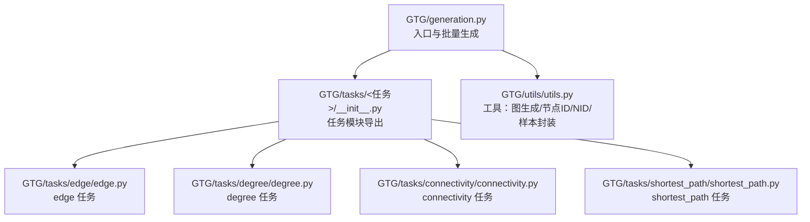
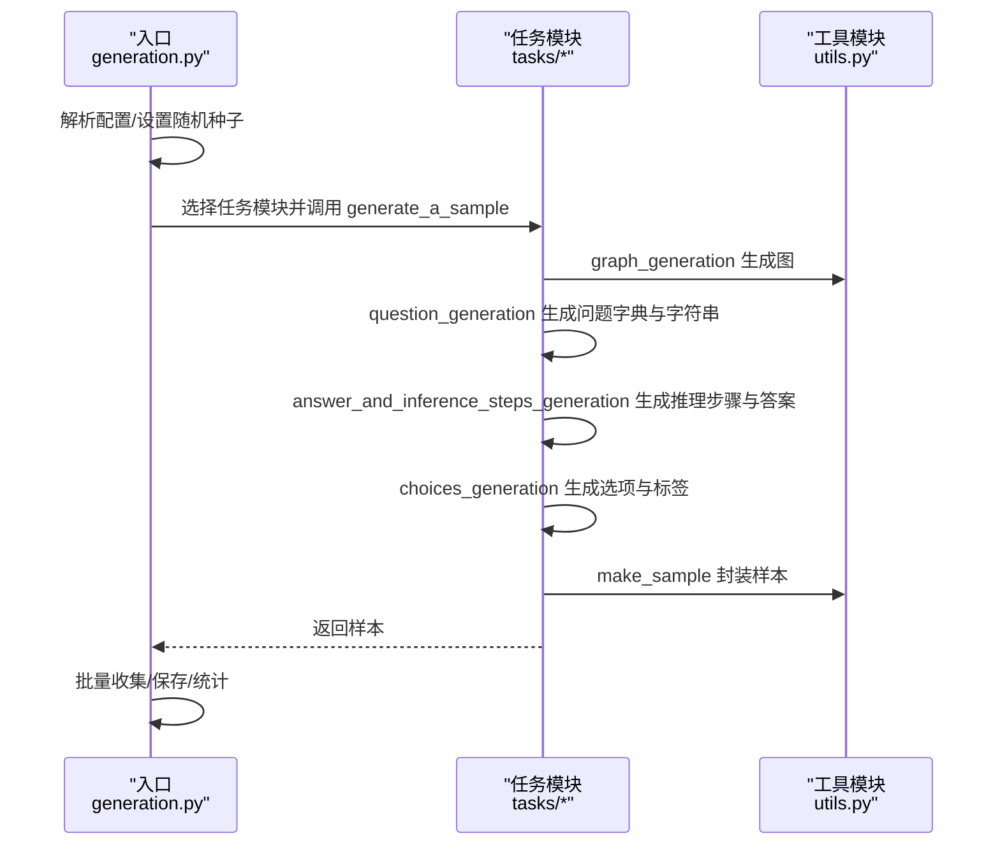
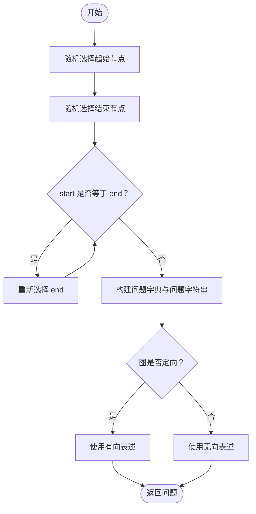
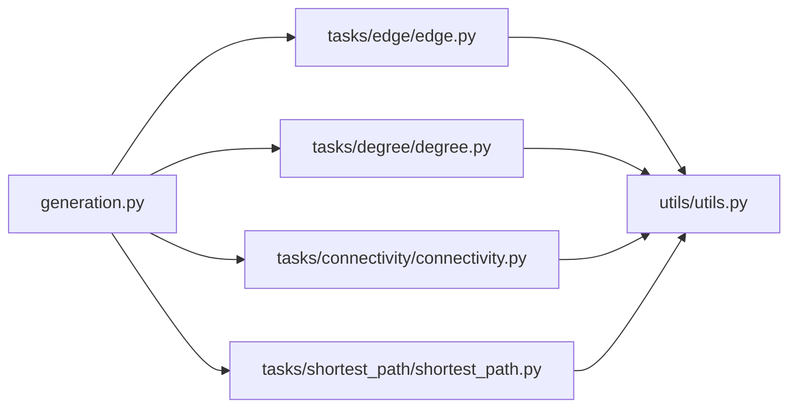

# 问题模板设计

<cite>
**本文引用的文件列表**
- [generation.py](file://GTG/generation.py)
- [utils.py](file://GTG/utils/utils.py)
- [edge.py](file://GTG/tasks/edge/edge.py)
- [degree.py](file://GTG/tasks/degree/degree.py)
- [connectivity.py](file://GTG/tasks/connectivity/connectivity.py)
- [shortest_path.py](file://GTG/tasks/shortest_path/shortest_path.py)
- [__init__.py](file://GTG/tasks/__init__.py)
</cite>

## 目录
1. [引言](#引言)
2. [项目结构](#项目结构)
3. [核心组件](#核心组件)
4. [架构总览](#架构总览)
5. [详细组件分析](#详细组件分析)
6. [依赖关系分析](#依赖关系分析)
7. [性能考量](#性能考量)
8. [故障排查指南](#故障排查指南)
9. [结论](#结论)

## 引言
本文件围绕图论任务中的“问题模板设计与实现”展开，重点说明：
- 如何通过统一的生成流程与任务模块协作，将图结构与任务类型映射为自然语言问题；
- 问题模板中占位符（如节点标识）的替换机制；
- 如何依据图的有向/无向属性动态调整问题表述；
- 在 edge 任务中，节点对的随机选择策略及约束（如避免自环）；
- 多个任务的问题生成代码示例与设计模式。

## 项目结构
- 顶层入口负责解析配置、选择任务模块并批量生成样本；
- 每个任务模块包含 question_generation、answer_and_inference_steps_generation、choices_generation 等函数，以及 generate_a_sample 统一采样流程；
- 工具模块提供通用的图生成、节点标识格式化、样本封装等能力。

图表来源
- [generation.py](file://GTG/generation.py#L1-L107)
- [__init__.py](file://GTG/tasks/__init__.py#L1-L24)
- [edge.py](file://GTG/tasks/edge/edge.py#L1-L103)
- [degree.py](file://GTG/tasks/degree/degree.py#L1-L110)
- [connectivity.py](file://GTG/tasks/connectivity/connectivity.py#L1-L125)
- [shortest_path.py](file://GTG/tasks/shortest_path/shortest_path.py#L1-L140)
- [utils.py](file://GTG/utils/utils.py#L1-L617)

章节来源
- [generation.py](file://GTG/generation.py#L1-L107)
- [__init__.py](file://GTG/tasks/__init__.py#L1-L24)

## 核心组件
- 入口与批量生成：根据配置选择任务模块，循环生成样本并统计图统计信息。
- 任务模块：每个任务定义问题生成、推理步骤生成、选项生成与样本封装的统一流程。
- 工具模块：提供 NID 节点标识格式化、graph_generation 图生成、make_sample 样本封装等。

章节来源
- [generation.py](file://GTG/generation.py#L1-L107)
- [utils.py](file://GTG/utils/utils.py#L1-L617)

## 架构总览
下图展示了从入口到任务模块再到工具模块的数据流与调用关系。

图表来源
- [generation.py](file://GTG/generation.py#L1-L107)
- [edge.py](file://GTG/tasks/edge/edge.py#L80-L96)
- [degree.py](file://GTG/tasks/degree/degree.py#L86-L103)
- [connectivity.py](file://GTG/tasks/connectivity/connectivity.py#L101-L118)
- [shortest_path.py](file://GTG/tasks/shortest_path/shortest_path.py#L115-L133)
- [utils.py](file://GTG/utils/utils.py#L14-L35)

## 详细组件分析

### 通用问题生成流程与样本封装
- generate_a_sample：统一的采样入口，依次调用图生成、问题生成、推理步骤生成、选项生成与样本封装。
- make_sample：将图、问题、答案、推理步骤、选项等打包为标准样本字典，包含是否定向、节点数、边数等元信息。

章节来源
- [edge.py](file://GTG/tasks/edge/edge.py#L80-L96)
- [degree.py](file://GTG/tasks/degree/degree.py#L86-L103)
- [connectivity.py](file://GTG/tasks/connectivity/connectivity.py#L101-L118)
- [shortest_path.py](file://GTG/tasks/shortest_path/shortest_path.py#L115-L133)
- [utils.py](file://GTG/utils/utils.py#L14-L35)

### 节点标识与占位符替换机制
- NID：将内部整型节点 ID 包裹为“<id>”形式，便于在问题字符串中作为占位符进行替换。
- NID_edges：用于边列表的格式化输出。
- graph_to_edge_list_str/graph_to_adj_str/graph_to_natural_language：将图转换为不同表达形式，供问题描述或上下文使用。

章节来源
- [utils.py](file://GTG/utils/utils.py#L56-L71)
- [utils.py](file://GTG/utils/utils.py#L73-L127)
- [utils.py](file://GTG/utils/utils.py#L150-L175)

### 有向/无向属性驱动的问题表述
- 任务模块在 question_generation 中读取图的定向属性，动态选择不同的措辞（如“out-degree/degree”、“directed edge/path”等），确保问题与图结构一致。

章节来源
- [degree.py](file://GTG/tasks/degree/degree.py#L14-L28)
- [connectivity.py](file://GTG/tasks/connectivity/connectivity.py#L14-L34)
- [edge.py](file://GTG/tasks/edge/edge.py#L14-L31)
- [shortest_path.py](file://GTG/tasks/shortest_path/shortest_path.py#L22-L38)

### 随机节点对选择与约束（以 edge 为例）
- 随机选择 start/end 节点，保证 start != end（避免自环）；
- 根据图的定向性决定问题表述（有向/无向）；
- 可选地限制答案分布（例如 edge 任务中控制 False 的比例上限）。

图表来源
- [edge.py](file://GTG/tasks/edge/edge.py#L14-L31)

章节来源
- [edge.py](file://GTG/tasks/edge/edge.py#L14-L31)

### 设计模式与扩展性
- 模块化任务接口：每个任务模块提供 generate_a_sample、question_generation、answer_and_inference_steps_generation、choices_generation 四类函数，便于统一调度与扩展。
- 统一样本封装：make_sample 提供标准化字段，便于后续评估与存储。
- 动态表述：通过图的属性（如 is_directed）在 question_generation 中动态拼接自然语言，降低硬编码差异。

章节来源
- [edge.py](file://GTG/tasks/edge/edge.py#L80-L96)
- [degree.py](file://GTG/tasks/degree/degree.py#L86-L103)
- [connectivity.py](file://GTG/tasks/connectivity/connectivity.py#L101-L118)
- [shortest_path.py](file://GTG/tasks/shortest_path/shortest_path.py#L115-L133)
- [utils.py](file://GTG/utils/utils.py#L14-L35)

### 多任务问题生成示例与对比

#### degree 任务：节点度数
- 问题生成：随机选择一个节点，依据图的定向性选择“out-degree/degree”的表述。
- 推理步骤：列出邻居集合，统计数量，给出最终答案。
- 选项生成：基于答案构造干扰项，保持唯一正确答案。

章节来源
- [degree.py](file://GTG/tasks/degree/degree.py#L14-L28)
- [degree.py](file://GTG/tasks/degree/degree.py#L31-L63)
- [degree.py](file://GTG/tasks/degree/degree.py#L66-L83)
- [degree.py](file://GTG/tasks/degree/degree.py#L86-L103)

#### connectivity 任务：两点连通性
- 问题生成：随机选择两个不同节点，依据图的定向性选择“directed path/path”的表述。
- 推理步骤：演示 DFS 过程，记录访问序列，判断目标节点是否可达。
- 选项生成：二分类选项，标签与答案一致。

章节来源
- [connectivity.py](file://GTG/tasks/connectivity/connectivity.py#L14-L34)
- [connectivity.py](file://GTG/tasks/connectivity/connectivity.py#L37-L86)
- [connectivity.py](file://GTG/tasks/connectivity/connectivity.py#L89-L99)
- [connectivity.py](file://GTG/tasks/connectivity/connectivity.py#L101-L118)

#### edge 任务：是否存在边
- 问题生成：随机选择两个不同节点，依据图的定向性选择“directed edge/edge”的表述。
- 推理步骤：列出起始节点的邻居（或后继），判断目标节点是否在其中。
- 选项生成：二分类选项，标签与答案一致；可控制 False 的比例上限。

章节来源
- [edge.py](file://GTG/tasks/edge/edge.py#L14-L31)
- [edge.py](file://GTG/tasks/edge/edge.py#L34-L65)
- [edge.py](file://GTG/tasks/edge/edge.py#L68-L77)
- [edge.py](file://GTG/tasks/edge/edge.py#L80-L96)

#### shortest_path 任务：带权最短路距离
- 问题生成：随机选择两个不同节点，要求计算从起点到终点的距离。
- 推理步骤：演示 Dijkstra 算法过程，逐步更新未访问节点的最短距离。
- 选项生成：构造干扰值，保持唯一正确答案。

章节来源
- [shortest_path.py](file://GTG/tasks/shortest_path/shortest_path.py#L22-L38)
- [shortest_path.py](file://GTG/tasks/shortest_path/shortest_path.py#L41-L91)
- [shortest_path.py](file://GTG/tasks/shortest_path/shortest_path.py#L94-L113)
- [shortest_path.py](file://GTG/tasks/shortest_path/shortest_path.py#L115-L133)

## 依赖关系分析
- 入口 generation.py 通过任务名映射到具体任务模块；
- 各任务模块依赖 utils.py 提供的图生成与样本封装能力；
- 任务模块内部函数之间存在清晰的调用链：generate_a_sample -> question_generation -> answer_and_inference_steps_generation -> choices_generation -> make_sample。

图表来源
- [generation.py](file://GTG/generation.py#L29-L57)
- [edge.py](file://GTG/tasks/edge/edge.py#L1-L103)
- [degree.py](file://GTG/tasks/degree/degree.py#L1-L110)
- [connectivity.py](file://GTG/tasks/connectivity/connectivity.py#L1-L125)
- [shortest_path.py](file://GTG/tasks/shortest_path/shortest_path.py#L1-L140)
- [utils.py](file://GTG/utils/utils.py#L1-L617)

章节来源
- [generation.py](file://GTG/generation.py#L29-L57)

## 性能考量
- 随机采样与拒绝采样：部分任务采用 reject 机制控制答案分布（如 edge 的 False 上限、degree 的零度上限、connectivity 的 True 上限），这会增加额外的采样轮次，但有助于平衡数据集分布。
- 图生成策略：graph_generation 会尝试多种生成器并过滤异常图（如孤立点），可能带来重复生成的成本。
- 输出与统计：入口在生成完成后计算平均度、是否定向等统计指标，注意 CSV 写入的 I/O 成本。

章节来源
- [edge.py](file://GTG/tasks/edge/edge.py#L54-L65)
- [degree.py](file://GTG/tasks/degree/degree.py#L53-L63)
- [connectivity.py](file://GTG/tasks/connectivity/connectivity.py#L75-L86)
- [utils.py](file://GTG/utils/utils.py#L313-L349)
- [generation.py](file://GTG/generation.py#L85-L102)

## 故障排查指南
- 问题字符串为空或格式异常：检查 question_generation 中的字符串拼接逻辑与 NID 替换是否正确。
- 答案分布不符合预期：查看各任务模块中的 reject 控制逻辑，确认阈值与计数变量是否被正确累加。
- 图生成失败或非连通：检查 graph_generation 的过滤条件与生成器参数。
- 节点 ID 不匹配：确认 NID 的包裹与替换是否一致，避免直接使用原始整数 ID。

章节来源
- [edge.py](file://GTG/tasks/edge/edge.py#L14-L31)
- [degree.py](file://GTG/tasks/degree/degree.py#L31-L63)
- [connectivity.py](file://GTG/tasks/connectivity/connectivity.py#L37-L86)
- [utils.py](file://GTG/utils/utils.py#L56-L71)
- [utils.py](file://GTG/utils/utils.py#L313-L349)

## 结论
该系统通过统一的任务接口与工具模块，实现了面向不同图论任务的自然语言问题生成。其关键特性包括：
- 使用 NID 对节点 ID 进行占位符式格式化，便于在问题字符串中动态替换；
- 基于图的定向属性动态调整问题表述，确保语义一致性；
- 在 edge 等任务中采用随机节点对选择与约束（避免自环），并通过 reject 机制控制答案分布；
- 以 generate_a_sample 为核心的统一采样流程，配合 make_sample 实现标准化样本封装。

这些设计使得新增任务只需遵循相同的接口约定，即可快速集成到现有生成流水线中。