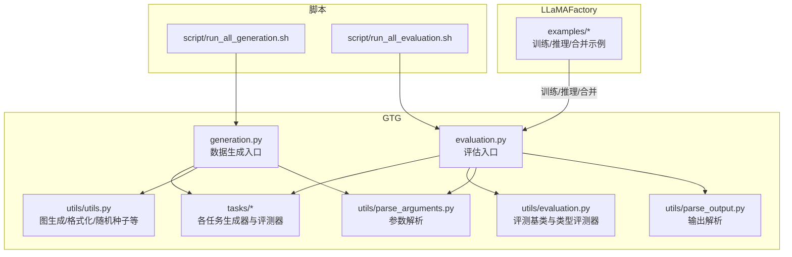
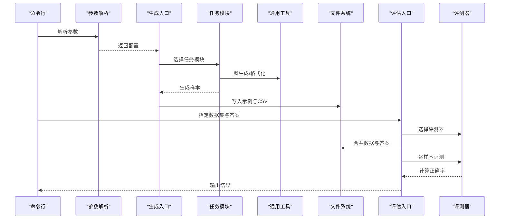
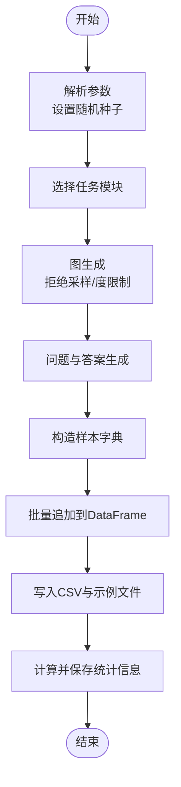
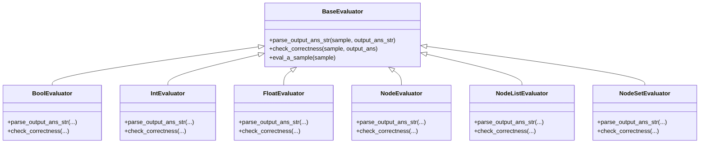
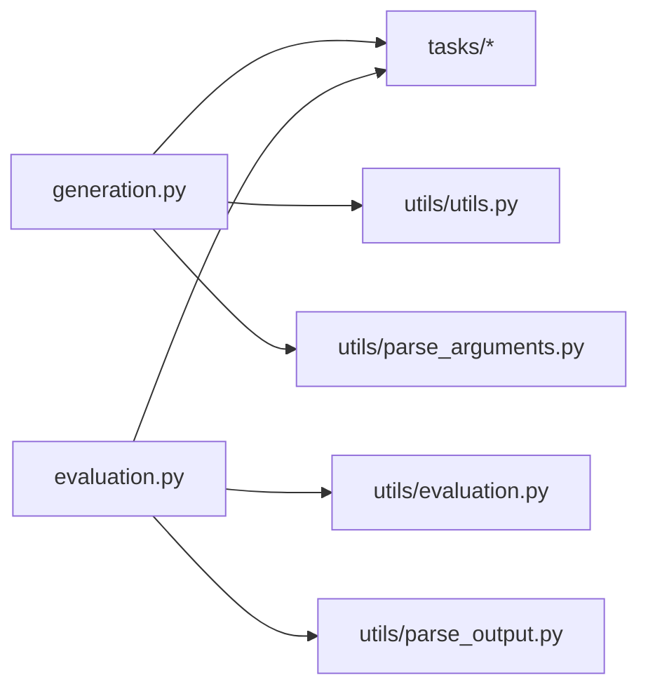

# 最佳实践

<cite>
**本文引用的文件列表**
- [README.md](file://README.md)
- [setup.py](file://setup.py)
- [GTG/generation.py](file://GTG/generation.py)
- [GTG/evaluation.py](file://GTG/evaluation.py)
- [GTG/utils/utils.py](file://GTG/utils/utils.py)
- [GTG/utils/evaluation.py](file://GTG/utils/evaluation.py)
- [GTG/utils/parse_arguments.py](file://GTG/utils/parse_arguments.py)
- [GTG/utils/parse_output.py](file://GTG/utils/parse_output.py)
- [GTG/tasks/shortest_path/shortest_path.py](file://GTG/tasks/shortest_path/shortest_path.py)
- [GTG/tasks/degree/degree.py](file://GTG/tasks/degree/degree.py)
- [GTG/tasks/topological_sort/topological_sort.py](file://GTG/tasks/topological_sort/topological_sort.py)
- [GTG/tasks/bipartite/bipartite.py](file://GTG/tasks/bipartite/bipartite.py)
- [script/run_all_generation.sh](file://script/run_all_generation.sh)
- [script/run_all_evaluation.sh](file://script/run_all_evaluation.sh)
</cite>

## 目录
1. [引言](#引言)
2. [项目结构](#项目结构)
3. [核心组件](#核心组件)
4. [架构总览](#架构总览)
5. [详细组件分析](#详细组件分析)
6. [依赖关系分析](#依赖关系分析)
7. [性能考虑](#性能考虑)
8. [故障排查指南](#故障排查指南)
9. [结论](#结论)
10. [附录](#附录)

## 引言
本文件系统性梳理 GraphInstruct 在数据集生成、评估与模型训练方面的最佳实践，围绕参数调优（图规模与密度）、性能优化（批处理与并行化）、质量保证（评估指标与交叉验证）以及数据集设计与模型评估的实用技巧展开，帮助读者在不同规模与场景下高效构建高质量的图理解与推理数据集，并稳定评估大模型表现。

## 项目结构
- 核心模块
  - GTG：动态图任务数据生成与评估框架
  - GTG/tasks：各具体图算法任务的生成器与评测器
  - GTG/utils：通用工具、解析与评估逻辑
  - script：批量生成与评估脚本
  - LLaMAFactory：基于 LLaMA-Factory 的监督微调配置与示例
- 关键入口
  - 数据生成入口：GTG/generation.py
  - 评估入口：GTG/evaluation.py
  - 参数解析：GTG/utils/parse_arguments.py
  - 输出解析：GTG/utils/parse_output.py
  - 通用图生成与格式化：GTG/utils/utils.py
  - 评测基类与类型化评测器：GTG/utils/evaluation.py

图表来源
- [GTG/generation.py](file://GTG/generation.py#L1-L107)
- [GTG/evaluation.py](file://GTG/evaluation.py#L1-L73)
- [GTG/utils/utils.py](file://GTG/utils/utils.py#L1-L617)
- [GTG/utils/evaluation.py](file://GTG/utils/evaluation.py#L1-L283)
- [GTG/utils/parse_arguments.py](file://GTG/utils/parse_arguments.py#L1-L28)
- [GTG/utils/parse_output.py](file://GTG/utils/parse_output.py#L1-L213)
- [script/run_all_generation.sh](file://script/run_all_generation.sh#L1-L72)
- [script/run_all_evaluation.sh](file://script/run_all_evaluation.sh#L1-L32)

章节来源
- [README.md](file://README.md#L1-L90)
- [setup.py](file://setup.py#L1-L26)

## 核心组件
- 数据生成管线
  - 解析参数与随机种子设置
  - 选择任务模块并生成样本
  - 批量保存为 CSV 并统计图统计信息
- 评估管线
  - 加载答案与数据集，合并后逐样本评测
  - 基于任务类型选择评测器，计算准确率并输出结果
- 评测器体系
  - 基类与布尔/整数/浮点/节点/节点集合等类型评测器
  - 输出解析与容错策略（包裹标记、数值解析、列表解析）
- 图生成与格式化
  - 随机图、BA 小世界、DAG、二分图、欧拉/哈密尔顿路径图等
  - 节点 ID 重映射、边权重注入、自然语言描述生成

章节来源
- [GTG/generation.py](file://GTG/generation.py#L1-L107)
- [GTG/evaluation.py](file://GTG/evaluation.py#L1-L73)
- [GTG/utils/evaluation.py](file://GTG/utils/evaluation.py#L1-L283)
- [GTG/utils/utils.py](file://GTG/utils/utils.py#L1-L617)
- [GTG/utils/parse_output.py](file://GTG/utils/parse_output.py#L1-L213)

## 架构总览
下图展示从命令行到任务模块再到评测器的整体流程，体现“参数解析—生成—保存—评估—汇总”的闭环。

图表来源
- [GTG/generation.py](file://GTG/generation.py#L1-L107)
- [GTG/evaluation.py](file://GTG/evaluation.py#L1-L73)
- [GTG/utils/parse_arguments.py](file://GTG/utils/parse_arguments.py#L1-L28)
- [GTG/utils/evaluation.py](file://GTG/utils/evaluation.py#L1-L283)
- [GTG/utils/utils.py](file://GTG/utils/utils.py#L1-L617)

## 详细组件分析

### 数据生成最佳实践
- 参数调优策略
  - 图规模与密度
    - 使用范围采样控制节点数量，结合平均度与概率生成不同密度的图；通过拒绝采样避免极端度分布或孤立节点。
    - 可参考：节点范围解析、平均度采样、图生成主流程与拒绝条件。
  - 随机性与可复现
    - 显式设置随机种子或基于字符串哈希生成稳定种子，确保实验可复现。
  - 输出与统计
    - 生成示例文件与完整 CSV，并补充图统计（平均度、是否定向、平均度/节点比等），便于后续质量把控。
- 性能优化建议
  - 批量生成与进度条
    - 使用进度条迭代批量生成样本，减少交互开销。
  - 并行化思路
    - 任务模块内部可按节点/边操作向量化（如邻接表遍历），外部可通过多进程拆分任务集合并行生成不同任务的数据集。
- 质量保证
  - 拒绝采样与阈值控制
    - 对极端答案（如零出度）设置上限比例，避免数据偏斜。
  - 多样性与覆盖
    - 采用多种图模型（ER、BA、WS、DAG、二分图、路径图）组合，提升数据多样性。

图表来源
- [GTG/generation.py](file://GTG/generation.py#L1-L107)
- [GTG/utils/utils.py](file://GTG/utils/utils.py#L1-L617)
- [GTG/utils/parse_arguments.py](file://GTG/utils/parse_arguments.py#L1-L28)

章节来源
- [GTG/generation.py](file://GTG/generation.py#L1-L107)
- [GTG/utils/utils.py](file://GTG/utils/utils.py#L1-L617)
- [GTG/utils/parse_arguments.py](file://GTG/utils/parse_arguments.py#L1-L28)

### 评估与质量保证最佳实践
- 评测器体系
  - 基于任务类型的评测器自动选择，统一“解析输出—校验正确性”流程。
  - 支持布尔、整数、浮点、节点、节点集合等类型，提供容错解析与误差容忍。
- 输出解析与鲁棒性
  - 包裹标记提取、布尔/数值/列表/字典/带权重列表等解析函数，降低 LLM 输出噪声影响。
- 评估流程
  - 合并数据集与答案，逐样本评测并汇总准确率，支持扩展字段输出便于二次分析。

图表来源
- [GTG/utils/evaluation.py](file://GTG/utils/evaluation.py#L1-L283)

章节来源
- [GTG/evaluation.py](file://GTG/evaluation.py#L1-L73)
- [GTG/utils/evaluation.py](file://GTG/utils/evaluation.py#L1-L283)
- [GTG/utils/parse_output.py](file://GTG/utils/parse_output.py#L1-L213)

### 典型任务实现要点
- 最短路径（数值/整数）
  - 生成加权图，使用 Dijkstra 步骤生成推理过程，答案为整数距离。
  - 注意连通性拒绝：无穷距离则重新生成。
- 度（整数）
  - 控制零度比例不超过阈值，避免极端答案导致评估失衡。
- 拓扑排序（节点序列）
  - DAG 生成，评测器校验拓扑有序性与节点完整性。
- 二分图最大匹配（边集合）
  - 评测器校验匹配合法性与二分约束。

章节来源
- [GTG/tasks/shortest_path/shortest_path.py](file://GTG/tasks/shortest_path/shortest_path.py#L1-L140)
- [GTG/tasks/degree/degree.py](file://GTG/tasks/degree/degree.py#L1-L110)
- [GTG/tasks/topological_sort/topological_sort.py](file://GTG/tasks/topological_sort/topological_sort.py#L1-L233)
- [GTG/tasks/bipartite/bipartite.py](file://GTG/tasks/bipartite/bipartite.py#L1-L135)

## 依赖关系分析
- 组件耦合
  - generation.py 与各任务模块松耦合，通过任务名映射加载模块，便于扩展新任务。
  - evaluation.py 与任务模块的评测器强耦合，需保持评测器接口一致。
- 外部依赖
  - networkx、numpy、pandas、tqdm 等用于图操作、数值计算与进度显示。
- 循环依赖
  - 当前结构未见循环导入；若新增任务评测器，请遵循统一接口，避免反向依赖。

图表来源
- [GTG/generation.py](file://GTG/generation.py#L1-L107)
- [GTG/evaluation.py](file://GTG/evaluation.py#L1-L73)
- [GTG/utils/evaluation.py](file://GTG/utils/evaluation.py#L1-L283)
- [GTG/utils/utils.py](file://GTG/utils/utils.py#L1-L617)
- [GTG/utils/parse_output.py](file://GTG/utils/parse_output.py#L1-L213)
- [GTG/utils/parse_arguments.py](file://GTG/utils/parse_arguments.py#L1-L28)

章节来源
- [setup.py](file://setup.py#L1-L26)

## 性能考虑
- 批处理与并行化
  - 生成阶段：使用进度条与批量追加 DataFrame，减少 IO 次数；可按任务拆分并行生成多个子集。
  - 评估阶段：对大型数据集分块读取与评测，避免内存峰值过高。
- 图生成效率
  - 利用向量化与邻接表遍历，避免重复计算；拒绝采样时设置合理上限，防止无效循环。
- I/O 与缓存
  - 示例文件与 CSV 分离存储，统计信息单独导出，便于快速定位异常样本。
- 环境与资源
  - 安装依赖包，确保 networkx、numpy、pandas 版本满足要求；必要时启用 GPU/CPU 加速（如 vLLM）。

章节来源
- [GTG/generation.py](file://GTG/generation.py#L1-L107)
- [GTG/utils/utils.py](file://GTG/utils/utils.py#L1-L617)
- [setup.py](file://setup.py#L1-L26)

## 故障排查指南
- 常见问题
  - 生成失败或卡死：检查图生成拒绝条件（孤立节点、度分布异常），适当放宽范围或调整概率。
  - 评测不通过：确认输出包裹标记、节点 ID 格式与解析规则一致；核对评测器类型与任务期望答案类型匹配。
  - 答案缺失：评估入口要求 CSV 包含 id 与 output 两列，确保命名与格式正确。
- 定位方法
  - 查看示例文件与统计 CSV，快速发现异常样本。
  - 使用最小化数据集（toy）先行验证流程，再逐步扩大规模。
- 参考路径
  - 生成入口与统计：[GTG/generation.py](file://GTG/generation.py#L1-L107)
  - 评估入口与准确率输出：[GTG/evaluation.py](file://GTG/evaluation.py#L1-L73)
  - 输出解析与包裹标记：[GTG/utils/parse_output.py](file://GTG/utils/parse_output.py#L1-L213)

章节来源
- [GTG/generation.py](file://GTG/generation.py#L1-L107)
- [GTG/evaluation.py](file://GTG/evaluation.py#L1-L73)
- [GTG/utils/parse_output.py](file://GTG/utils/parse_output.py#L1-L213)

## 结论
通过规范化的参数调优、稳健的评测器体系与高效的生成/评估流水线，GraphInstruct 能够在不同规模与复杂度的图任务上稳定产出高质量数据集，并为大模型的图理解与推理能力评估提供可靠支撑。建议在实际项目中：
- 以任务为导向设计图生成策略，兼顾多样性与可控性；
- 以评测器类型与输出解析为核心，建立统一的质量标准；
- 以批处理与并行化为抓手，提升大规模数据集的生成与评估效率；
- 以统计与示例文件为抓手，持续监控数据质量与异常样本。

## 附录
- 快速开始
  - 安装依赖并进入 GTG 目录安装包，运行批量生成脚本生成各任务数据集，再运行评估脚本得到准确率与详细结果。
- 参考脚本
  - 批量生成：[script/run_all_generation.sh](file://script/run_all_generation.sh#L1-L72)
  - 批量评估：[script/run_all_evaluation.sh](file://script/run_all_evaluation.sh#L1-L32)
- 训练参考
  - 基于 LLaMAFactory 的 SFT/推理/合并示例位于 LLaMAFactory/examples 下，按需调整配置文件与实验设置。

章节来源
- [README.md](file://README.md#L1-L90)
- [script/run_all_generation.sh](file://script/run_all_generation.sh#L1-L72)
- [script/run_all_evaluation.sh](file://script/run_all_evaluation.sh#L1-L32)