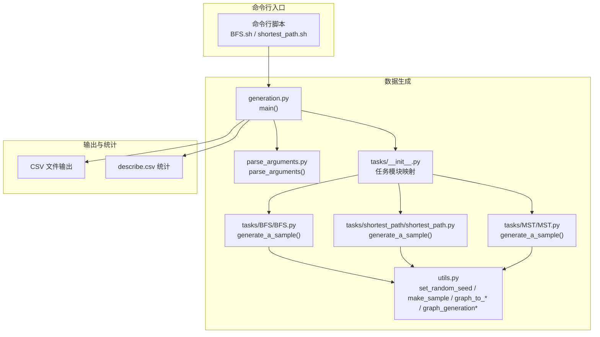
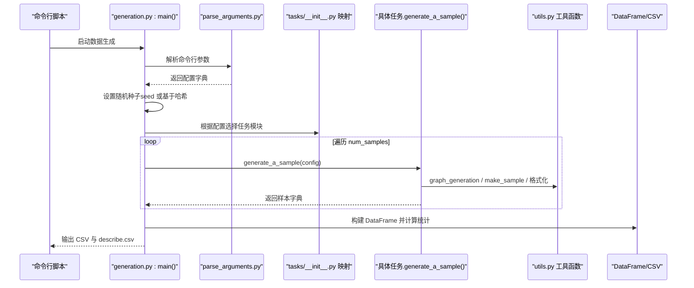
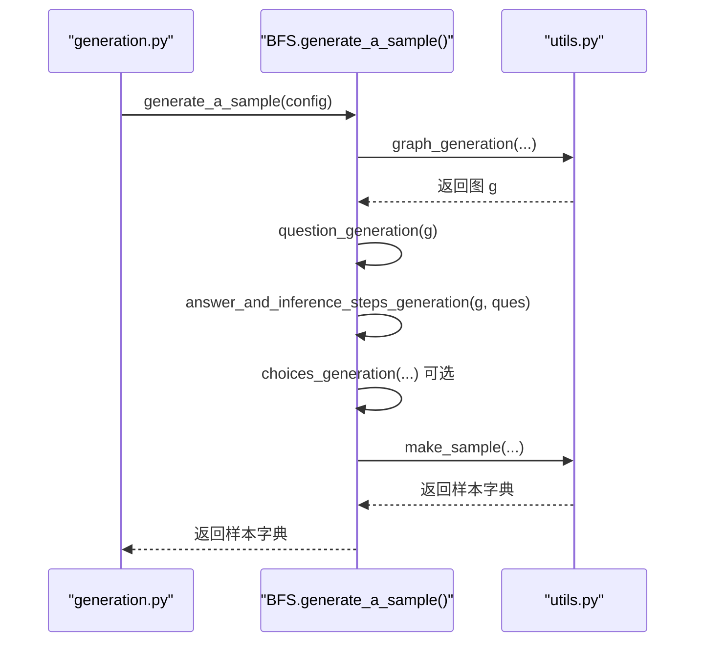
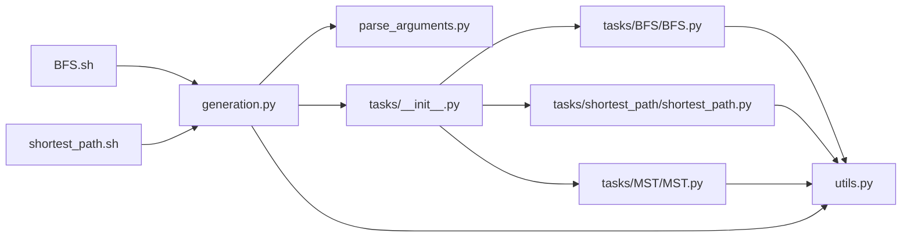

# 数据生成系统

<cite>
**本文引用的文件列表**
- [generation.py](file://GTG/generation.py)
- [parse_arguments.py](file://GTG/utils/parse_arguments.py)
- [utils.py](file://GTG/utils/utils.py)
- [__init__.py（tasks）](file://GTG/tasks/__init__.py)
- [BFS.py](file://GTG/tasks/BFS/BFS.py)
- [shortest_path.py](file://GTG/tasks/shortest_path/shortest_path.py)
- [MST.py](file://GTG/tasks/MST/MST.py)
- [evaluation.py](file://GTG/utils/evaluation.py)
- [parse_output.py](file://GTG/utils/parse_output.py)
- [BFS.sh](file://script/dataset_generation/BFS.sh)
- [shortest_path.sh](file://script/dataset_generation/shortest_path.sh)
</cite>

## 目录
1. [简介](#简介)
2. [项目结构](#项目结构)
3. [核心组件](#核心组件)
4. [架构总览](#架构总览)
5. [详细组件分析](#详细组件分析)
6. [依赖关系分析](#依赖关系分析)
7. [性能考量](#性能考量)
8. [故障排查指南](#故障排查指南)
9. [结论](#结论)
10. [附录](#附录)

## 简介
本文件深入剖析 GraphInstruct 的数据生成系统，聚焦于 generation.py 作为核心入口点的架构设计与执行流程。文档详细说明系统如何通过 parse_arguments 加载配置参数，调用 graph_generation 系列函数创建随机图、BA 模型图、WS 小世界网络等不同拓扑结构的图数据；阐述 task_module.generate_a_sample() 方法如何协调各类图论任务（如 BFS、最短路径等）生成包含问题、答案和推理步骤的完整样本；并通过代码示例路径展示数据流从参数解析→图生成→任务执行→样本构建→CSV 输出的完整链条。同时解释 utils.py 中 make_sample()、graph_to_edge_list_str() 等辅助函数在样本格式化中的作用，并提供常见问题排查指南与性能优化建议。

## 项目结构
- 核心入口：GTG/generation.py
- 参数解析：GTG/utils/parse_arguments.py
- 工具与图生成：GTG/utils/utils.py
- 任务模块聚合：GTG/tasks/__init__.py
- 具体任务实现：GTG/tasks/{task}/task.py（如 BFS、shortest_path、MST）
- 评估与解析：GTG/utils/evaluation.py、GTG/utils/parse_output.py
- 脚本入口：script/dataset_generation/*.sh

图表来源
- [generation.py](file://GTG/generation.py#L1-L107)
- [parse_arguments.py](file://GTG/utils/parse_arguments.py#L1-L28)
- [utils.py](file://GTG/utils/utils.py#L1-L617)
- [__init__.py（tasks）](file://GTG/tasks/__init__.py#L1-L24)
- [BFS.py](file://GTG/tasks/BFS/BFS.py#L1-L212)
- [shortest_path.py](file://GTG/tasks/shortest_path/shortest_path.py#L1-L140)
- [MST.py](file://GTG/tasks/MST/MST.py#L1-L267)
- [BFS.sh](file://script/dataset_generation/BFS.sh#L1-L36)
- [shortest_path.sh](file://script/dataset_generation/shortest_path.sh#L1-L36)

章节来源
- [generation.py](file://GTG/generation.py#L1-L107)
- [parse_arguments.py](file://GTG/utils/parse_arguments.py#L1-L28)
- [utils.py](file://GTG/utils/utils.py#L1-L617)
- [__init__.py（tasks）](file://GTG/tasks/__init__.py#L1-L24)
- [BFS.sh](file://script/dataset_generation/BFS.sh#L1-L36)
- [shortest_path.sh](file://script/dataset_generation/shortest_path.sh#L1-L36)

## 核心组件
- 参数解析器：负责从命令行读取任务类型、节点规模范围、采样数量、种子或哈希字符串等配置项，并统一转换为字典供后续流程使用。
- 图生成器：根据配置选择随机图、Barabási-Albert 图、Watts-Strogatz 小世界图等拓扑，确保无孤立节点、平均度合理，并对节点 ID 进行随机重映射。
- 任务模块：每个任务实现 generate_a_sample()，负责生成问题、推理步骤、答案及可选的选择项，最终以统一的样本字典返回。
- 样本构建与输出：将样本字典转为 DataFrame，计算图统计指标（平均度、是否定向），并输出 CSV 与 describe 统计文件。

章节来源
- [parse_arguments.py](file://GTG/utils/parse_arguments.py#L1-L28)
- [utils.py](file://GTG/utils/utils.py#L224-L349)
- [generation.py](file://GTG/generation.py#L1-L107)

## 架构总览
下面的序列图展示了从命令行到 CSV 输出的完整数据流。

图表来源
- [generation.py](file://GTG/generation.py#L1-L107)
- [parse_arguments.py](file://GTG/utils/parse_arguments.py#L1-L28)
- [utils.py](file://GTG/utils/utils.py#L1-L617)
- [__init__.py（tasks）](file://GTG/tasks/__init__.py#L1-L24)

## 详细组件分析

### generation.py：核心入口与执行流程
- 参数解析与种子设置
  - 使用 parse_arguments() 获取配置字典。
  - 若显式提供 seed，则直接设置；否则根据任务名与可选 hash_str 计算整数哈希作为种子，保证相同任务与标签下的可重复性。
- 任务模块选择
  - 基于 config['task'] 从 tasks 包中动态导入对应模块，形成任务映射表。
- 样本生成与展示
  - 调用 task_module.generate_a_sample(config) 生成单个样本并在控制台打印示例。
  - 连续生成前 10 个样本写入示例文件，便于快速预览。
- 批量生成与统计
  - 以字典收集各键值，循环生成 num_samples 个样本，最后转为 DataFrame。
  - 计算平均度、是否定向、节点数比值等统计指标，并输出 CSV 与 describe.csv。
- 可选回调
  - 若任务模块定义 on_finished()，则在完成后调用。

章节来源
- [generation.py](file://GTG/generation.py#L1-L107)

### parse_arguments.py：命令行参数解析
- 支持参数
  - 任务类型、节点规模范围、采样数量、种子、哈希字符串、输入/输出文件路径等。
- 处理逻辑
  - 使用 argparse 定义参数，解析后过滤空值与特殊字符串，返回标准化字典。

章节来源
- [parse_arguments.py](file://GTG/utils/parse_arguments.py#L1-L28)

### utils.py：图生成与样本格式化工具
- 随机种子设置
  - set_random_seed(seed) 同步设置 Python random 与 numpy 随机种子。
- 样本构建
  - make_sample(task_name, g, ques_str, ans_str, steps_str=None, choi_str=None, label_str=None, g_str=None, g_adj_str=None, g_adj_nl=None)
    - 统一构造样本字典，包含任务名、图的多种表示（邻接表、自然语言描述等）、节点数、边数、是否定向、问题、答案、推理步骤、可选答案与标签。
- 图格式化
  - graph_to_edge_list_str(g)：将图转换为边列表字符串。
  - graph_to_adj_str(g)：邻接表字符串。
  - graph_to_natural_language(g)：自然语言描述。
  - 辅助函数：NID/NID_edges、graph_with_egde_weight_to_str/graph_with_egde_weight_to_adj_str/graph_with_edge_weight_to_natural_language 等。
- 图生成器
  - generate_random_graph(num_nodes, ave_degree=None, directed=None)
  - generate_barabasi_albert_graph(num_nodes, ave_degree=None)
  - generate_watts_strogatz_graph(num_nodes, ave_degree=None)
  - graph_generation(config, directed=None)：按概率混合三类图，剔除度数过高或存在孤立节点的情况，确保质量。
  - graph_generation_with_edge_weight(config, directed=None)：在已有图基础上为每条边添加随机权重。
  - 其他专用图：generate_random_directed_acyclic_graph、generate_bipartite_graph、generate_Hamiltonian_path_graph、generate_Euler_path_graph。
- 节点处理
  - has_completely_isolated_node(g)：检测是否存在度为 0 的节点。
  - id_random_re_mapping(g, return_mapping=False)：对节点 ID 进行随机重映射。
  - shuffle_edges(g)：打乱边顺序。
- 哈希与显示
  - string_to_integer_hashing(s)：基于 SHA-256 的字符串到整数映射。
  - display_sample(sample, i=None)：将样本格式化为可读字符串。

章节来源
- [utils.py](file://GTG/utils/utils.py#L1-L617)

### 任务模块：以 BFS、最短路径、MST 为例
- BFS
  - generate_a_sample(config)
    - 通过 graph_generation 生成图。
    - question_generation：随机选择起点，生成问题文本。
    - answer_and_inference_steps_generation：使用 BFS 算法逐步输出访问顺序与推理过程，reject 条件为遍历长度过短。
    - choices_generation：生成干扰选项。
    - make_sample：封装样本字典。
  - 评估器 NodeListEvaluator：校验输出是否为合法 BFS 序列。
- 最短路径（带权重）
  - generate_a_sample(config)
    - graph_generation_with_edge_weight 生成带权图。
    - question_generation：随机选择起点与终点。
    - answer_and_inference_steps_generation：使用 Dijkstra 算法逐步输出候选与更新过程，reject 条件为不可达。
    - choices_generation：生成干扰答案。
    - make_sample：传入带权图的字符串与邻接表表示。
  - 评估器 IntEvaluator：比较数值正确性。
- MST（最小生成树）
  - generate_a_sample(config)
    - graph_generation_with_edge_weight(False)：强制无向图。
    - question_generation：询问 MST 总权重。
    - answer_and_inference_steps_generation：使用 Prim 算法逐步输出选边过程，reject 条件为非连通。
    - choices_generation：生成干扰答案。
    - make_sample：附加 answer_tree 字段记录选边序列。
  - 评估器 IntEvaluator：比较数值正确性。

图表来源
- [generation.py](file://GTG/generation.py#L1-L107)
- [BFS.py](file://GTG/tasks/BFS/BFS.py#L1-L212)
- [utils.py](file://GTG/utils/utils.py#L1-L617)

章节来源
- [BFS.py](file://GTG/tasks/BFS/BFS.py#L1-L212)
- [shortest_path.py](file://GTG/tasks/shortest_path/shortest_path.py#L1-L140)
- [MST.py](file://GTG/tasks/MST/MST.py#L1-L267)

### 评估与解析工具
- evaluation.py
  - 提供基础评估器基类与多种具体评估器（BoolEvaluator、IntEvaluator、FloatEvaluator、NodeListEvaluator、NodeSetEvaluator 等）。
  - eval_a_sample 流程：解析输出包裹标记、提取首个整数/浮点/节点列表等、调用 check_correctness 判定正确性。
- parse_output.py
  - 提供解析工具：parse_wrapped_answer、parse_bool、parse_first_node_id、remove_all_node_id、parse_first_integer、parse_first_float、parse_node_list、parse_list、parse_dict、parse_list_with_weight、parse_dict_with_weight 等。

章节来源
- [evaluation.py](file://GTG/utils/evaluation.py#L1-L283)
- [parse_output.py](file://GTG/utils/parse_output.py#L1-L200)

## 依赖关系分析
- generation.py 依赖
  - parse_arguments.py：参数解析。
  - utils.py：随机种子、样本构建、图生成与格式化。
  - tasks/__init__.py：任务模块映射。
  - 各任务模块：BFS、shortest_path、MST 等。
- 任务模块依赖
  - utils.py：图生成、格式化、make_sample 等。
  - evaluation.py：部分任务自定义评估器。
- 脚本入口
  - BFS.sh、shortest_path.sh：调用 generation.py 并对生成 CSV 进行节点 ID 类型转换（int_id/letter_id）。

图表来源
- [generation.py](file://GTG/generation.py#L1-L107)
- [parse_arguments.py](file://GTG/utils/parse_arguments.py#L1-L28)
- [__init__.py（tasks）](file://GTG/tasks/__init__.py#L1-L24)
- [BFS.py](file://GTG/tasks/BFS/BFS.py#L1-L212)
- [shortest_path.py](file://GTG/tasks/shortest_path/shortest_path.py#L1-L140)
- [MST.py](file://GTG/tasks/MST/MST.py#L1-L267)
- [BFS.sh](file://script/dataset_generation/BFS.sh#L1-L36)
- [shortest_path.sh](file://script/dataset_generation/shortest_path.sh#L1-L36)

## 性能考量
- 内存管理
  - 批量生成时，先以字典收集样本键值，再一次性构建 DataFrame，避免频繁 append 导致的内存抖动与拷贝开销。
  - 对于大规模数据，建议分批写入 CSV（例如每批次 10000 行），减少峰值内存占用。
- 随机性与可复现
  - 使用 set_random_seed(seed) 或基于字符串的哈希种子，确保不同任务与标签下的可重复性。
- 图生成质量控制
  - graph_generation 在生成后检查平均度与孤立节点，剔除不满足条件的样本，提高训练稳定性。
- I/O 优化
  - 示例文件仅写入前 10 个样本，避免大文件 I/O 开销。
  - 统计文件仅在全部样本生成后一次性写出，降低磁盘压力。

[本节为通用性能建议，无需特定文件引用]

## 故障排查指南
- 生成结果重复性问题
  - 现象：相同配置多次运行得到完全一致的结果。
  - 排查要点：
    - 是否显式设置了 seed？若未设置，系统会基于任务名与 hash_str 计算种子，确保相同任务与标签下的可重复性。
    - 若希望每次运行不同，应在命令行传入不同的 hash_str 或显式指定不同的 seed。
  - 参考路径
    - [generation.py](file://GTG/generation.py#L16-L27)
    - [utils.py](file://GTG/utils/utils.py#L38-L42)

- 图结构异常（孤立节点）
  - 现象：样本中出现孤立节点导致任务失败或评估异常。
  - 排查要点：
    - graph_generation 系列函数在生成后会检测孤立节点并重新生成，确保无孤立节点。
    - 若仍出现孤立节点，检查 num_nodes_range 是否过小或连接概率过低。
  - 参考路径
    - [utils.py](file://GTG/utils/utils.py#L178-L182)
    - [utils.py](file://GTG/utils/utils.py#L248-L251)
    - [utils.py](file://GTG/utils/utils.py#L276-L278)
    - [utils.py](file://GTG/utils/utils.py#L302-L304)

- 任务不可达或无解
  - 现象：某些任务（如 shortest_path）可能因图不可达而被拒绝。
  - 排查要点：
    - shortest_path 的 answer_and_inference_steps_generation 中对不可达情况会标记 reject 并重新生成。
    - MST 的 answer_and_inference_steps_generation 会对非连通图直接拒绝。
  - 参考路径
    - [shortest_path.py](file://GTG/tasks/shortest_path/shortest_path.py#L78-L91)
    - [MST.py](file://GTG/tasks/MST/MST.py#L22-L33)

- 输出格式不匹配导致评估失败
  - 现象：评估器无法解析模型输出。
  - 排查要点：
    - 使用 parse_output.py 中的解析工具（如 parse_wrapped_answer、parse_first_integer、parse_node_list 等）确保输出包裹与格式符合预期。
    - 评估器会先尝试解析，解析失败则判定错误。
  - 参考路径
    - [evaluation.py](file://GTG/utils/evaluation.py#L1-L120)
    - [parse_output.py](file://GTG/utils/parse_output.py#L1-L200)

- CSV 输出异常
  - 现象：CSV 缺少字段或统计文件未生成。
  - 排查要点：
    - generation.py 会在生成完样本后统一构建 DataFrame 并计算统计指标，确认 num_samples 与样本键一致。
  - 参考路径
    - [generation.py](file://GTG/generation.py#L71-L102)

## 结论
GraphInstruct 的数据生成系统以 generation.py 为核心入口，通过 parse_arguments 解析配置、利用 utils.py 的图生成与格式化工具、结合各任务模块的 generate_a_sample() 实现高质量样本的批量生成。系统在种子设置、图质量控制、样本格式化与统计输出方面均提供了清晰的流程与健壮的容错机制。配合脚本入口与节点 ID 转换流程，能够高效产出多任务、多拓扑结构的图数据集，支撑下游评估与训练。

[本节为总结性内容，无需特定文件引用]

## 附录
- 命令行示例路径
  - BFS 任务：[BFS.sh](file://script/dataset_generation/BFS.sh#L1-L36)
  - 最短路径任务：[shortest_path.sh](file://script/dataset_generation/shortest_path.sh#L1-L36)
- 关键实现路径
  - 参数解析：[parse_arguments.py](file://GTG/utils/parse_arguments.py#L1-L28)
  - 样本构建：[utils.py](file://GTG/utils/utils.py#L14-L35)
  - 图生成与格式化：[utils.py](file://GTG/utils/utils.py#L224-L349)
  - 任务入口（BFS）：[BFS.py](file://GTG/tasks/BFS/BFS.py#L139-L154)
  - 任务入口（最短路径）：[shortest_path.py](file://GTG/tasks/shortest_path/shortest_path.py#L115-L133)
  - 任务入口（MST）：[MST.py](file://GTG/tasks/MST/MST.py#L241-L260)