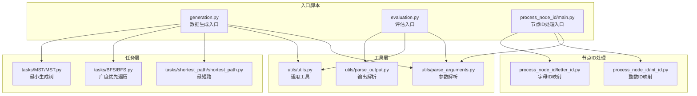
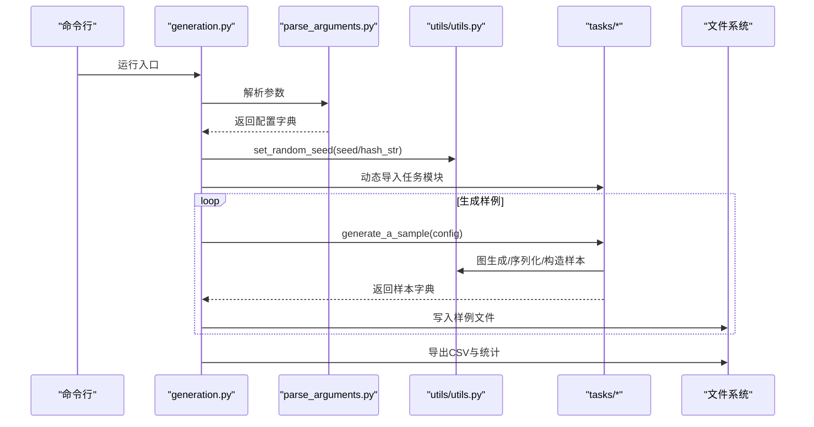
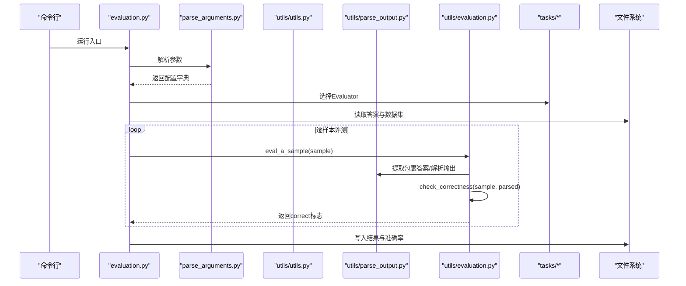
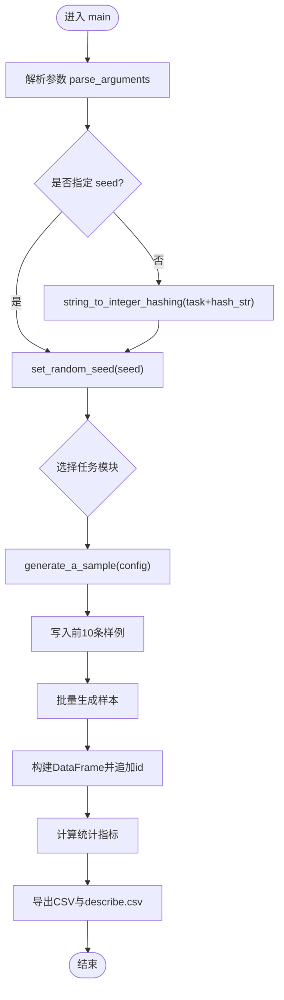
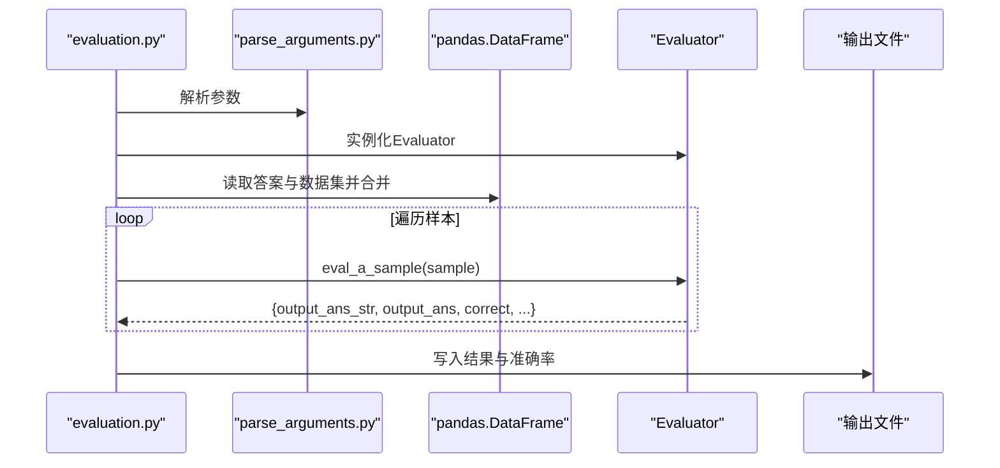
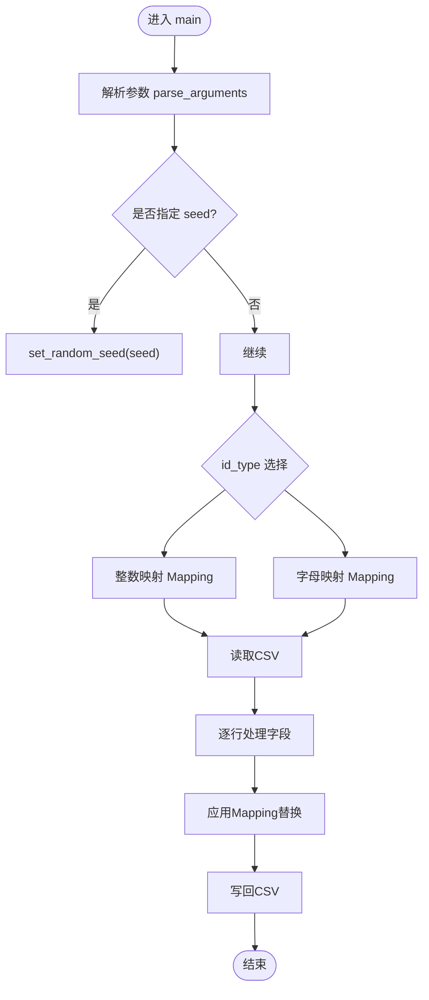
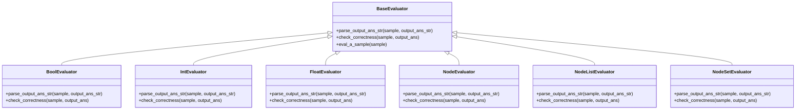
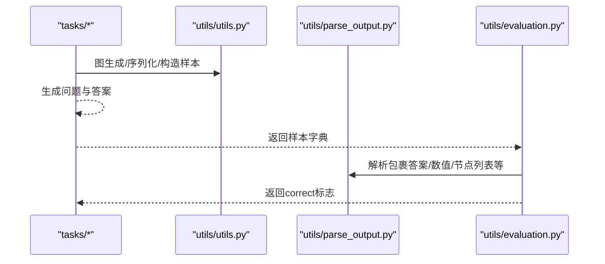
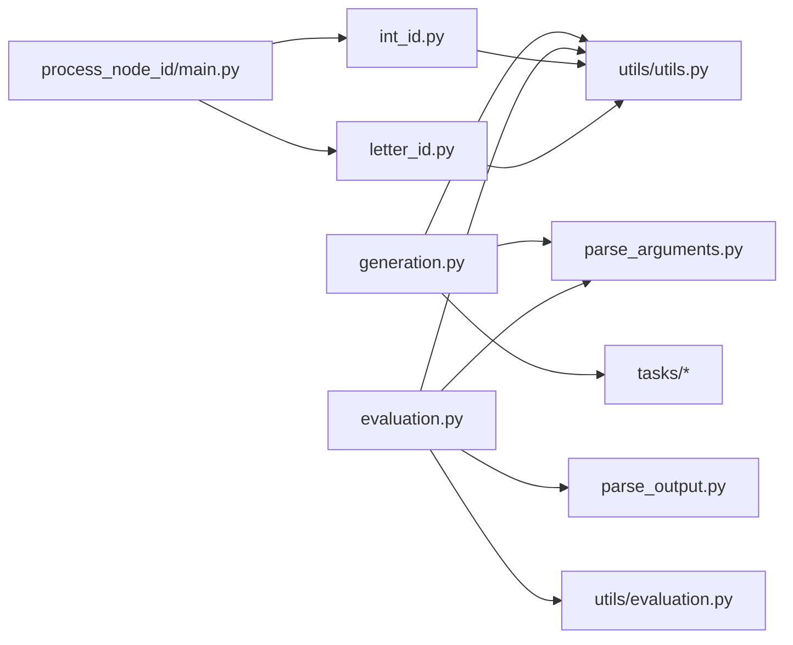

# 核心功能模块

<cite>
**本文引用的文件列表**
- [GTG/generation.py](file://GTG/generation.py)
- [GTG/evaluation.py](file://GTG/evaluation.py)
- [GTG/process_node_id/main.py](file://GTG/process_node_id/main.py)
- [GTG/utils/parse_arguments.py](file://GTG/utils/parse_arguments.py)
- [GTG/utils/parse_output.py](file://GTG/utils/parse_output.py)
- [GTG/utils/utils.py](file://GTG/utils/utils.py)
- [GTG/process_node_id/int_id.py](file://GTG/process_node_id/int_id.py)
- [GTG/process_node_id/letter_id.py](file://GTG/process_node_id/letter_id.py)
- [GTG/tasks/shortest_path/shortest_path.py](file://GTG/tasks/shortest_path/shortest_path.py)
- [GTG/tasks/BFS/BFS.py](file://GTG/tasks/BFS/BFS.py)
- [GTG/tasks/MST/MST.py](file://GTG/tasks/MST/MST.py)
- [GTG/utils/evaluation.py](file://GTG/utils/evaluation.py)
- [GTG/__init__.py](file://GTG/__init__.py)
</cite>

## 目录
1. [引言](#引言)
2. [项目结构](#项目结构)
3. [核心组件](#核心组件)
4. [架构总览](#架构总览)
5. [详细组件分析](#详细组件分析)
6. [依赖关系分析](#依赖关系分析)
7. [性能考量](#性能考量)
8. [故障排查指南](#故障排查指南)
9. [结论](#结论)

## 引言
本文件聚焦于GraphInstruct的三大核心模块：数据生成、评估系统与节点ID处理。我们将从职责边界、数据流、控制流与错误处理等维度，系统梳理generation.py作为数据生成入口点如何协调图生成与任务执行；evaluation.py如何解析与验证模型输出的正确性；utils模块提供的通用工具函数如何被各模块复用；以及process_node_id模块如何支持整数与字母两种节点标识的转换与处理。同时，通过代码级图示展示模块间调用关系与数据流，帮助读者快速把握整体设计。

## 项目结构
- GTG/generation.py：数据生成入口，负责解析配置、选择任务模块、生成样本、统计与落盘。
- GTG/evaluation.py：评估入口，负责解析配置、按任务选择评测器、合并答案与数据集、计算准确率并输出结果。
- GTG/process_node_id/main.py：节点ID处理入口，负责读取数据、根据id_type选择映射策略、对graph/graph_adj/graph_nl/nodes/question/answer等字段进行统一替换，并输出新数据集。
- GTG/utils/：
  - parse_arguments.py：命令行参数解析，统一产出字典配置。
  - parse_output.py：输出解析工具，提供包裹答案提取、布尔/整数/浮点/节点列表/字典等解析能力。
  - utils.py：通用工具，包含随机种子、样本构造、节点ID格式化、图序列化/反序列化、多种图生成策略、权重图生成、邻接表/自然语言表示等。
- GTG/tasks/*：各类任务的生成与评测实现，每个任务提供generate_a_sample与Evaluator类，Evaluator继承自utils/evaluation.py中的评测基类或特定评测器。
- GTG/process_node_id/*：整数ID与字母ID映射实现，分别将<0>/<1>/…与<0>/<1>/…映射为“0”/“1”/…或“AAA”/“BBB”/…等。

图表来源
- [GTG/generation.py](file://GTG/generation.py#L1-L107)
- [GTG/evaluation.py](file://GTG/evaluation.py#L1-L73)
- [GTG/process_node_id/main.py](file://GTG/process_node_id/main.py#L1-L58)
- [GTG/utils/parse_arguments.py](file://GTG/utils/parse_arguments.py#L1-L28)
- [GTG/utils/parse_output.py](file://GTG/utils/parse_output.py#L1-L213)
- [GTG/utils/utils.py](file://GTG/utils/utils.py#L1-L617)
- [GTG/tasks/shortest_path/shortest_path.py](file://GTG/tasks/shortest_path/shortest_path.py#L1-L140)
- [GTG/tasks/BFS/BFS.py](file://GTG/tasks/BFS/BFS.py#L1-L200)
- [GTG/tasks/MST/MST.py](file://GTG/tasks/MST/MST.py#L1-L200)
- [GTG/process_node_id/int_id.py](file://GTG/process_node_id/int_id.py#L1-L21)
- [GTG/process_node_id/letter_id.py](file://GTG/process_node_id/letter_id.py#L1-L33)

章节来源
- [GTG/generation.py](file://GTG/generation.py#L1-L107)
- [GTG/evaluation.py](file://GTG/evaluation.py#L1-L73)
- [GTG/process_node_id/main.py](file://GTG/process_node_id/main.py#L1-L58)
- [GTG/utils/parse_arguments.py](file://GTG/utils/parse_arguments.py#L1-L28)
- [GTG/utils/parse_output.py](file://GTG/utils/parse_output.py#L1-L213)
- [GTG/utils/utils.py](file://GTG/utils/utils.py#L1-L617)
- [GTG/__init__.py](file://GTG/__init__.py#L1-L4)

## 核心组件
- 数据生成入口（generation.py）
  - 职责：解析参数、设置随机种子、按任务名动态导入任务模块、生成样本、保存样例、批量生成并统计、导出CSV与描述性统计。
  - 关键流程：parse_arguments → set_random_seed → 动态选择任务模块 → generate_a_sample → 批量收集 → DataFrame落盘 → 统计指标。
- 评估入口（evaluation.py）
  - 职责：解析参数、按任务名选择Evaluator、读取答案与数据集、逐样本评测、汇总准确率并输出结果。
  - 关键流程：parse_arguments → 选择Evaluator → 合并数据与答案 → 遍历评测 → 计算准确率 → 写入结果文件。
- 节点ID处理入口（process_node_id/main.py）
  - 职责：根据id_type选择映射策略（整数/字母），对graph/graph_adj/graph_nl/nodes/question/answer等字段进行统一替换，输出新数据集。
  - 关键流程：parse_arguments → 选择Mapping → 读取CSV → 遍历每条记录 → Mapping替换 → 写回CSV。
- 工具层（utils）
  - parse_arguments：统一参数解析，返回字典配置。
  - parse_output：提供包裹答案提取、布尔/整数/浮点/节点列表/字典等解析方法。
  - utils：提供随机种子、样本构造、节点ID格式化、图序列化/反序列化、多图生成策略、权重图生成、邻接表/自然语言表示等。

章节来源
- [GTG/generation.py](file://GTG/generation.py#L1-L107)
- [GTG/evaluation.py](file://GTG/evaluation.py#L1-L73)
- [GTG/process_node_id/main.py](file://GTG/process_node_id/main.py#L1-L58)
- [GTG/utils/parse_arguments.py](file://GTG/utils/parse_arguments.py#L1-L28)
- [GTG/utils/parse_output.py](file://GTG/utils/parse_output.py#L1-L213)
- [GTG/utils/utils.py](file://GTG/utils/utils.py#L1-L617)

## 架构总览
下面以序列图展示generation.py与任务模块的协作流程，以及evaluation.py与任务评测器的协作流程。

图表来源
- [GTG/generation.py](file://GTG/generation.py#L1-L107)
- [GTG/utils/parse_arguments.py](file://GTG/utils/parse_arguments.py#L1-L28)
- [GTG/utils/utils.py](file://GTG/utils/utils.py#L1-L617)
- [GTG/tasks/shortest_path/shortest_path.py](file://GTG/tasks/shortest_path/shortest_path.py#L1-L140)

图表来源
- [GTG/evaluation.py](file://GTG/evaluation.py#L1-L73)
- [GTG/utils/parse_arguments.py](file://GTG/utils/parse_arguments.py#L1-L28)
- [GTG/utils/parse_output.py](file://GTG/utils/parse_output.py#L1-L213)
- [GTG/utils/utils.py](file://GTG/utils/utils.py#L1-L617)
- [GTG/utils/evaluation.py](file://GTG/utils/evaluation.py#L1-L283)
- [GTG/tasks/BFS/BFS.py](file://GTG/tasks/BFS/BFS.py#L1-L200)

## 详细组件分析

### 数据生成入口（generation.py）
- 参数解析与随机种子
  - 使用parse_arguments解析任务、输入输出路径、采样数量、随机种子或哈希字符串等。
  - 若未指定seed，则基于任务名与可选hash_str计算整型哈希作为随机种子，确保可重复性。
- 任务模块选择
  - 基于配置中的task字段，动态导入对应任务模块（如shortest_path、BFS、DFS、MST等）。
- 样本生成与保存
  - 先显示一条样例，再保存前10条样例到文件。
  - 批量生成num_samples条样本，收集到字典后转为DataFrame，追加id列并导出CSV。
  - 计算平均度、平均度/节点数、是否为有向图等统计指标，并导出describe.csv。
- 错误处理与收尾
  - 若任务模块定义on_finished钩子，则在生成完成后调用，用于清理或额外处理。

图表来源
- [GTG/generation.py](file://GTG/generation.py#L1-L107)
- [GTG/utils/parse_arguments.py](file://GTG/utils/parse_arguments.py#L1-L28)
- [GTG/utils/utils.py](file://GTG/utils/utils.py#L1-L617)

章节来源
- [GTG/generation.py](file://GTG/generation.py#L1-L107)

### 评估入口（evaluation.py）
- 参数解析与评测器选择
  - 解析参数后，按任务名选择对应的Evaluator类实例（如TopologicalSort、HamiltonianPath、EulerPath、BFS、DFS、Bipartite、ShortestPath、PageRank、MaximumFlow、Degree、Diameter、CommonNeighbor、Jaccard、Connectivity、Cycle、Edge、Neighbor、Predecessor、MST、ClusteringCoefficient、ConnectedComponent等）。
- 数据合并与评测
  - 读取答案文件与数据集，按id合并为DataFrame。
  - 遍历每条样本，调用Evaluator.eval_a_sample(sample)，收集输出解析字符串、解析后的答案、正确性标记等。
  - 计算正确率并输出到结果文件。
- 特殊处理
  - 对某些任务（如DFS）会额外记录路径长度与有效性等中间指标。

图表来源
- [GTG/evaluation.py](file://GTG/evaluation.py#L1-L73)
- [GTG/utils/parse_arguments.py](file://GTG/utils/parse_arguments.py#L1-L28)
- [GTG/utils/evaluation.py](file://GTG/utils/evaluation.py#L1-L283)

章节来源
- [GTG/evaluation.py](file://GTG/evaluation.py#L1-L73)

### 节点ID处理模块（process_node_id）
- 入口逻辑
  - 解析参数，若指定seed则设置随机种子。
  - 根据id_type选择Mapping（整数映射或字母映射）。
  - 读取输入CSV，逐行对graph/graph_adj/graph_nl/nodes/question/answer等字段应用Mapping替换，特殊处理MST任务的answer_tree字段，以及可选的steps/choices/label/n1/n2/cc_node_ratio等字段。
  - 将处理后的数据写回输出CSV。
- 整数ID映射（int_id.py）
  - 从输入字符串中提取所有形如<0>/<1>/…的节点ID，建立从<NID(u)>到字符串"u"的映射，然后逐个替换。
- 字母ID映射（letter_id.py）
  - 从输入字符串中提取所有形如<0>/<1>/…的节点ID，生成不重复的随机三字母名称集合，建立从<NID(u)>到名称的映射，然后逐个替换。
- 复杂度与健壮性
  - 时间复杂度近似O(N)，其中N为字段中出现的节点ID数量；空间复杂度与映射规模相关。
  - 通过正则提取与字典替换保证替换的完整性与一致性。

图表来源
- [GTG/process_node_id/main.py](file://GTG/process_node_id/main.py#L1-L58)
- [GTG/process_node_id/int_id.py](file://GTG/process_node_id/int_id.py#L1-L21)
- [GTG/process_node_id/letter_id.py](file://GTG/process_node_id/letter_id.py#L1-L33)

章节来源
- [GTG/process_node_id/main.py](file://GTG/process_node_id/main.py#L1-L58)
- [GTG/process_node_id/int_id.py](file://GTG/process_node_id/int_id.py#L1-L21)
- [GTG/process_node_id/letter_id.py](file://GTG/process_node_id/letter_id.py#L1-L33)

### 通用工具函数（utils模块）
- 参数解析（parse_arguments.py）
  - 定义任务、id类型、输入输出路径、随机种子、哈希字符串、节点范围、连接概率、样本数量等参数，解析为字典。
- 输出解析（parse_output.py）
  - 包裹答案提取：从模型输出中提取<<<...>>>之间的文本。
  - 布尔解析：识别yes/no/1/0/True/False等关键词，返回标准化字符串。
  - 数值解析：提取首个整数/浮点数，支持分数形式。
  - 节点解析：提取节点ID、节点列表、节点对列表、字典等，支持合法性校验。
  - 辅助函数：移除所有节点ID占位符、添加引号、构建节点集合等。
- 通用工具（utils.py）
  - 随机种子设置、样本构造、节点ID格式化（NID/NID_edges）、图序列化/反序列化（边列表/邻接表/自然语言）、图生成策略（随机/BA/Watts-Strogatz/带权/DAG/二分图/哈密顿/Euler等）、权重图生成、邻接表/自然语言表示、随机重映射、边打乱等。

图表来源
- [GTG/utils/evaluation.py](file://GTG/utils/evaluation.py#L1-L283)

章节来源
- [GTG/utils/parse_arguments.py](file://GTG/utils/parse_arguments.py#L1-L28)
- [GTG/utils/parse_output.py](file://GTG/utils/parse_output.py#L1-L213)
- [GTG/utils/utils.py](file://GTG/utils/utils.py#L1-L617)
- [GTG/utils/evaluation.py](file://GTG/utils/evaluation.py#L1-L283)

### 任务实现示例（以shortest_path、BFS、MST为例）
- shortest_path（最短路）
  - 生成带权重的随机图，构造起点与终点问题，使用Dijkstra算法逐步推理，输出距离与推理步骤，构造样本并返回。
  - 评测器为IntEvaluator，期望输出为整数答案。
- BFS（广度优先遍历）
  - 生成无权图，构造起始节点问题，逐步输出访问顺序与队列状态，构造样本并返回。
  - 评测器为NodeListEvaluator，评测时需校验遍历序列的层次正确性。
- MST（最小生成树）
  - 生成连通带权重无向图，Prim算法逐步构造MST并输出边序列与总权重，构造样本并返回。
  - 评测器为IntEvaluator，期望输出为总权重整数。

图表来源
- [GTG/tasks/shortest_path/shortest_path.py](file://GTG/tasks/shortest_path/shortest_path.py#L1-L140)
- [GTG/tasks/BFS/BFS.py](file://GTG/tasks/BFS/BFS.py#L1-L200)
- [GTG/tasks/MST/MST.py](file://GTG/tasks/MST/MST.py#L1-L200)
- [GTG/utils/parse_output.py](file://GTG/utils/parse_output.py#L1-L213)
- [GTG/utils/evaluation.py](file://GTG/utils/evaluation.py#L1-L283)

章节来源
- [GTG/tasks/shortest_path/shortest_path.py](file://GTG/tasks/shortest_path/shortest_path.py#L1-L140)
- [GTG/tasks/BFS/BFS.py](file://GTG/tasks/BFS/BFS.py#L1-L200)
- [GTG/tasks/MST/MST.py](file://GTG/tasks/MST/MST.py#L1-L200)

## 依赖关系分析
- 模块耦合
  - generation.py与evaluation.py均依赖parse_arguments与utils，但前者还依赖具体任务模块，后者依赖具体任务的Evaluator。
  - process_node_id/main.py依赖int_id/letter_id映射类，二者均依赖utils中的NID格式化工具。
  - 任务模块依赖utils中的图生成与序列化工具，部分任务依赖utils/evaluation.py中的评测器基类或特定评测器。
- 外部依赖
  - pandas、numpy、networkx、tqdm、argparse、re、hashlib等。
- 循环依赖
  - 未发现直接循环依赖；入口脚本仅单向依赖工具与任务模块。

图表来源
- [GTG/generation.py](file://GTG/generation.py#L1-L107)
- [GTG/evaluation.py](file://GTG/evaluation.py#L1-L73)
- [GTG/process_node_id/main.py](file://GTG/process_node_id/main.py#L1-L58)
- [GTG/utils/parse_arguments.py](file://GTG/utils/parse_arguments.py#L1-L28)
- [GTG/utils/parse_output.py](file://GTG/utils/parse_output.py#L1-L213)
- [GTG/utils/utils.py](file://GTG/utils/utils.py#L1-L617)
- [GTG/utils/evaluation.py](file://GTG/utils/evaluation.py#L1-L283)
- [GTG/process_node_id/int_id.py](file://GTG/process_node_id/int_id.py#L1-L21)
- [GTG/process_node_id/letter_id.py](file://GTG/process_node_id/letter_id.py#L1-L33)

章节来源
- [GTG/generation.py](file://GTG/generation.py#L1-L107)
- [GTG/evaluation.py](file://GTG/evaluation.py#L1-L73)
- [GTG/process_node_id/main.py](file://GTG/process_node_id/main.py#L1-L58)
- [GTG/utils/parse_arguments.py](file://GTG/utils/parse_arguments.py#L1-L28)
- [GTG/utils/parse_output.py](file://GTG/utils/parse_output.py#L1-L213)
- [GTG/utils/utils.py](file://GTG/utils/utils.py#L1-L617)
- [GTG/utils/evaluation.py](file://GTG/utils/evaluation.py#L1-L283)
- [GTG/process_node_id/int_id.py](file://GTG/process_node_id/int_id.py#L1-L21)
- [GTG/process_node_id/letter_id.py](file://GTG/process_node_id/letter_id.py#L1-L33)

## 性能考量
- 生成阶段
  - 批量生成样本时，使用字典收集后再转DataFrame，避免频繁追加导致的性能损耗。
  - 统计计算采用向量化操作（如numpy），提升效率。
- 评测阶段
  - 评测器eval_a_sample内部先提取包裹答案，再解析为具体类型，最后比较正确性；对浮点数采用相对误差阈值，兼顾鲁棒性。
- 节点ID处理
  - 正则提取与字典替换为线性复杂度；建议在大规模数据上使用更高效的字符串替换策略（如批量替换）以进一步优化。

## 故障排查指南
- 生成阶段
  - 若随机种子未固定，可能导致结果不可复现。检查是否传入seed或hash_str。
  - 若任务模块未注册，动态导入会失败。确认配置中的task名称与任务模块一致。
  - 若生成的图存在孤立节点，可能被拒绝。检查图生成策略与过滤条件。
- 评测阶段
  - 若模型输出未包裹在<<<>>>内，解析为空，正确性标记为0。请确保模型输出包含明确的答案包裹标记。
  - 浮点数评测采用相对误差阈值，若答案接近0，注意分母项的稳定性。
- 节点ID处理
  - 若id_type未匹配，映射类选择失败。确认配置中的id_type为int_id或letter_id。
  - 若输入CSV字段缺失，映射替换可能不完整。检查字段清单（graph/graph_adj/graph_nl/nodes/question/answer等）。

章节来源
- [GTG/generation.py](file://GTG/generation.py#L1-L107)
- [GTG/evaluation.py](file://GTG/evaluation.py#L1-L73)
- [GTG/utils/parse_output.py](file://GTG/utils/parse_output.py#L1-L213)
- [GTG/utils/utils.py](file://GTG/utils/utils.py#L1-L617)
- [GTG/process_node_id/main.py](file://GTG/process_node_id/main.py#L1-L58)

## 结论
GraphInstruct通过清晰的三层架构实现了从数据生成、评测到节点ID处理的完整闭环。generation.py与evaluation.py分别承担入口职责，借助utils模块提供的一致化工具链，任务模块专注于各自领域的图生成与评测逻辑。process_node_id模块提供了灵活的节点ID映射能力，支持整数与字母两种标识风格，便于下游模型训练与评测的多样化需求。整体设计具备良好的扩展性与可维护性，适合持续引入新的任务与评测策略。