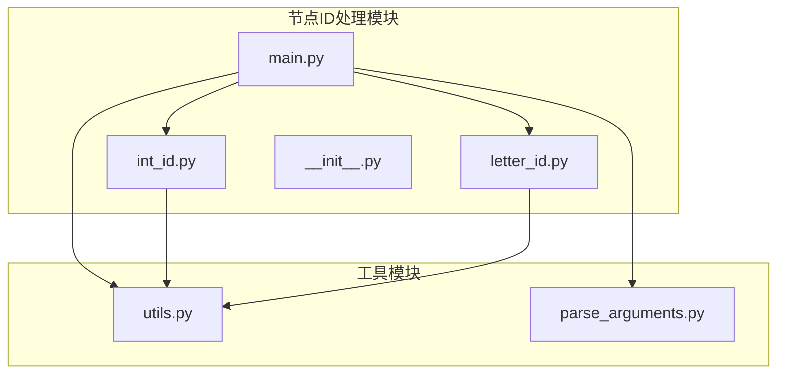
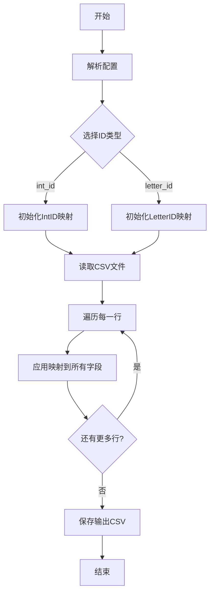
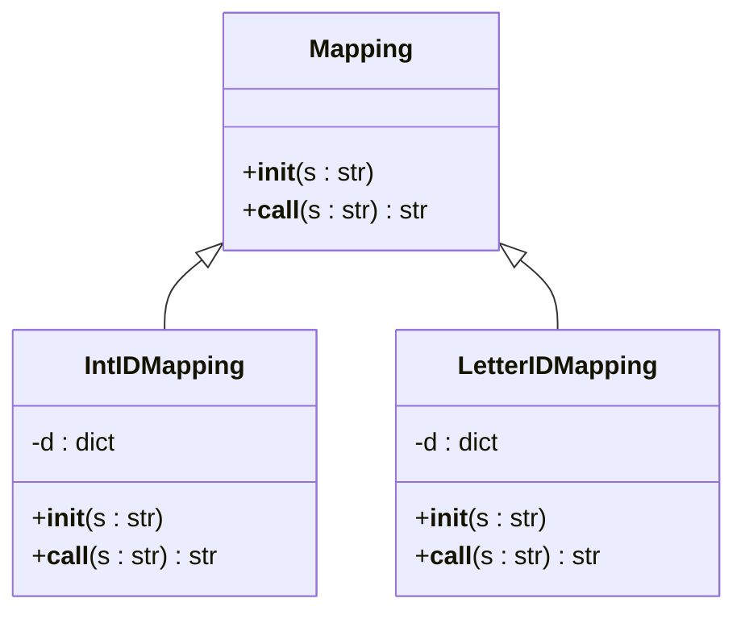
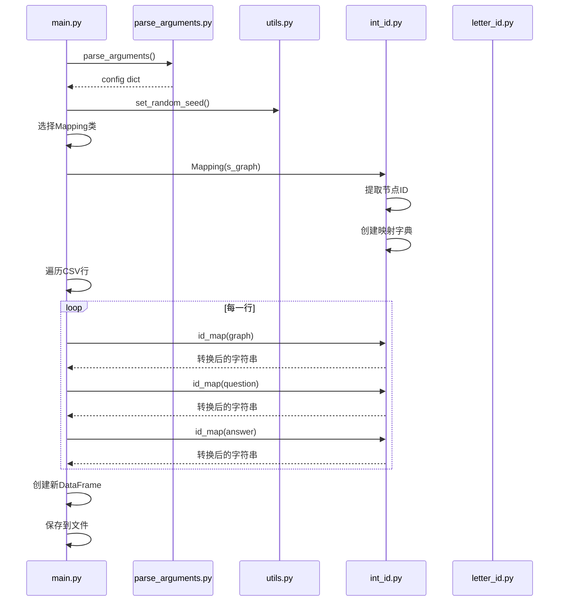
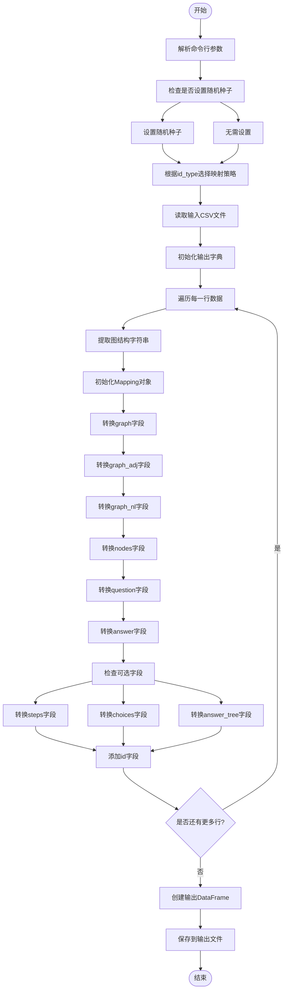
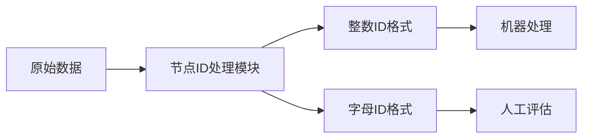
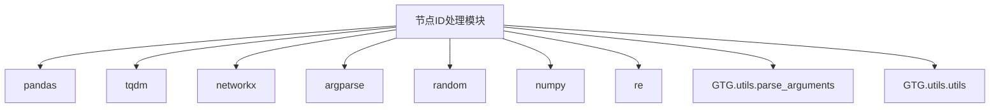

# 节点ID处理模块

<cite>
**本文档中引用的文件**  
- [main.py](file://GTG/process_node_id/main.py)
- [int_id.py](file://GTG/process_node_id/int_id.py)
- [letter_id.py](file://GTG/process_node_id/letter_id.py)
- [utils.py](file://GTG/utils/utils.py)
- [parse_arguments.py](file://GTG/utils/parse_arguments.py)
</cite>

## 目录
1. [简介](#简介)
2. [项目结构](#项目结构)
3. [核心组件](#核心组件)
4. [架构概述](#架构概述)
5. [详细组件分析](#详细组件分析)
6. [依赖分析](#依赖分析)
7. [性能考虑](#性能考虑)
8. [故障排除指南](#故障排除指南)
9. [结论](#结论)

## 简介
节点ID处理模块是GraphInstruct系统中的关键组件，负责将图数据中的节点标识从一种格式转换为另一种格式。该模块支持两种主要的映射策略：整数ID（int_id）和字母ID（letter_id），允许用户根据需求选择最适合的表示方式。此模块在数据预处理阶段发挥重要作用，特别是在需要提高数据可读性或适应不同评估场景时。通过灵活的配置选项，用户可以轻松地将原始的整数节点ID转换为更具语义意义的字母ID，从而便于人工审查和分析。

**Section sources**
- [main.py](file://GTG/process_node_id/main.py#L1-L58)

## 项目结构
节点ID处理模块位于`GTG/process_node_id/`目录下，包含三个核心文件：`main.py`、`int_id.py`和`letter_id.py`。`main.py`作为主入口点，负责解析配置并协调整个转换过程。`int_id.py`和`letter_id.py`分别实现了两种不同的ID映射策略。该模块与`GTG/utils/`目录下的工具函数紧密集成，利用`parse_arguments.py`进行参数解析，并使用`utils.py`中的辅助函数进行节点ID格式化和随机种子设置。整体结构清晰，职责分离明确，便于维护和扩展。

**Diagram sources**
- [main.py](file://GTG/process_node_id/main.py#L1-L58)
- [int_id.py](file://GTG/process_node_id/int_id.py#L1-L21)
- [letter_id.py](file://GTG/process_node_id/letter_id.py#L1-L33)
- [utils.py](file://GTG/utils/utils.py#L1-L617)
- [parse_arguments.py](file://GTG/utils/parse_arguments.py#L1-L28)

**Section sources**
- [main.py](file://GTG/process_node_id/main.py#L1-L58)
- [int_id.py](file://GTG/process_node_id/int_id.py#L1-L21)
- [letter_id.py](file://GTG/process_node_id/letter_id.py#L1-L33)

## 核心组件
节点ID处理模块的核心在于`Mapping`类的实现，该类在`int_id.py`和`letter_id.py`中分别提供了不同的映射逻辑。`main.py`中的主函数负责根据配置选择适当的映射策略，并对CSV文件中的各个字段进行批量转换。`NID`函数在`utils.py`中定义，用于将节点ID格式化为`<数字>`的形式，这是模块识别和处理节点标识的基础。整个模块的设计强调了灵活性和可扩展性，使得添加新的映射策略变得简单直接。

**Section sources**
- [main.py](file://GTG/process_node_id/main.py#L1-L58)
- [int_id.py](file://GTG/process_node_id/int_id.py#L1-L21)
- [letter_id.py](file://GTG/process_node_id/letter_id.py#L1-L33)
- [utils.py](file://GTG/utils/utils.py#L56-L64)

## 架构概述
该模块采用配置驱动的架构，`main.py`作为控制中心，根据用户提供的配置文件动态选择`int_id.Mapping`或`letter_id.Mapping`类。初始化过程首先通过正则表达式`<(\d+)>`从输入字符串中提取所有节点ID，确定图中节点的总数。随后，根据所选策略生成从原始ID到目标ID的映射字典。转换过程通过简单的字符串替换完成，确保了图结构语义的一致性。这种设计使得模块能够高效地处理大规模数据集，同时保持代码的简洁性和可维护性。

**Diagram sources**
- [main.py](file://GTG/process_node_id/main.py#L1-L58)
- [int_id.py](file://GTG/process_node_id/int_id.py#L1-L21)
- [letter_id.py](file://GTG/process_node_id/letter_id.py#L1-L33)

## 详细组件分析

### Mapping类分析
`Mapping`类是节点ID处理模块的核心，其实现因映射策略而异。在`int_id.py`中，`Mapping`类将`<0>`, `<1>`等标识直接映射为`0`, `1`等整数字符串。而在`letter_id.py`中，它生成随机的三个大写字母组合（如'ABC', 'XYZ'）作为新的节点标识。两个类都遵循相同的接口，即通过`__call__`方法接收一个字符串并返回转换后的字符串，这保证了`main.py`中调用的一致性。

#### 对于面向对象的组件：

**Diagram sources**
- [int_id.py](file://GTG/process_node_id/int_id.py#L5-L21)
- [letter_id.py](file://GTG/process_node_id/letter_id.py#L12-L33)

#### 对于API/服务组件：

**Diagram sources**
- [main.py](file://GTG/process_node_id/main.py#L1-L58)
- [int_id.py](file://GTG/process_node_id/int_id.py#L1-L21)
- [letter_id.py](file://GTG/process_node_id/letter_id.py#L1-L33)
- [parse_arguments.py](file://GTG/utils/parse_arguments.py#L1-L28)

#### 对于复杂逻辑组件：

**Diagram sources**
- [main.py](file://GTG/process_node_id/main.py#L1-L58)

**Section sources**
- [main.py](file://GTG/process_node_id/main.py#L1-L58)
- [int_id.py](file://GTG/process_node_id/int_id.py#L1-L21)
- [letter_id.py](file://GTG/process_node_id/letter_id.py#L1-L33)

### 概念概述
该模块的设计理念是提供一种简单而强大的机制，用于转换图数据中的节点标识。通过将映射逻辑封装在独立的类中，模块实现了高度的可扩展性。用户可以根据具体需求选择最合适的ID格式，无论是为了计算效率（整数ID）还是为了可读性（字母ID）。这种灵活性使得该模块成为图数据预处理流程中的重要工具。

## 依赖分析
节点ID处理模块依赖于多个外部库和内部模块。它使用`pandas`进行CSV文件的读写操作，`tqdm`提供进度条显示，`networkx`用于图结构的内部表示（间接通过`utils.py`），以及`argparse`进行命令行参数解析。在内部，它紧密依赖于`GTG/utils/`目录下的`parse_arguments.py`和`utils.py`，这些工具模块提供了参数解析、随机种子设置和节点ID格式化等基础功能。这种依赖关系确保了模块的稳定性和一致性。

**Diagram sources**
- [main.py](file://GTG/process_node_id/main.py#L1-L58)
- [int_id.py](file://GTG/process_node_id/int_id.py#L1-L21)
- [letter_id.py](file://GTG/process_node_id/letter_id.py#L1-L33)
- [utils.py](file://GTG/utils/utils.py#L1-L617)
- [parse_arguments.py](file://GTG/utils/parse_arguments.py#L1-L28)

**Section sources**
- [main.py](file://GTG/process_node_id/main.py#L1-L58)
- [int_id.py](file://GTG/process_node_id/int_id.py#L1-L21)
- [letter_id.py](file://GTG/process_node_id/letter_id.py#L1-L33)
- [utils.py](file://GTG/utils/utils.py#L1-L617)
- [parse_arguments.py](file://GTG/utils/parse_arguments.py#L1-L28)

## 性能考虑
该模块在设计时考虑了性能因素。字符串替换操作的时间复杂度为O(n*m)，其中n是字符串长度，m是映射字典的大小。对于大规模数据集，这可能会成为性能瓶颈。然而，通过使用`pandas`的向量化操作和`tqdm`的进度指示，模块能够高效地处理大量数据。此外，映射字典在初始化时一次性创建，避免了在循环中重复计算，从而优化了整体性能。对于非常大的图，建议使用整数ID映射，因为它比生成随机字母组合更高效。

## 故障排除指南
在使用节点ID处理模块时，可能会遇到一些常见问题。例如，如果输入CSV文件中的节点ID格式不正确（如缺少`<`和`>`符号），映射过程将无法正确提取节点。此外，如果图的规模非常大，`letter_id`策略可能会因为随机生成的字母组合重复而导致性能下降。为了解决这些问题，建议在运行模块前验证输入数据的格式，并在处理大型图时优先选择`int_id`策略。如果遇到映射失败，应检查`NID`函数的输出，确保节点ID被正确格式化。

**Section sources**
- [main.py](file://GTG/process_node_id/main.py#L1-L58)
- [int_id.py](file://GTG/process_node_id/int_id.py#L1-L21)
- [letter_id.py](file://GTG/process_node_id/letter_id.py#L1-L33)
- [utils.py](file://GTG/utils/utils.py#L56-L64)

## 结论
节点ID处理模块是一个设计精良、功能强大的工具，能够有效地转换图数据中的节点标识。通过提供`int_id`和`letter_id`两种映射策略，它满足了不同场景下的需求，无论是为了计算效率还是为了人工可读性。模块的架构清晰，依赖关系明确，易于维护和扩展。未来的工作可以包括添加更多的映射策略，如自定义字母序列或基于哈希的映射，以进一步增强其灵活性和实用性。