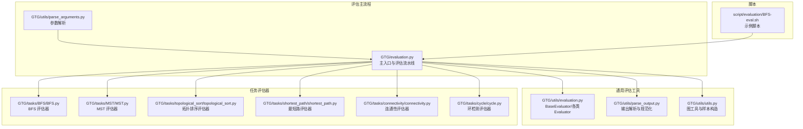
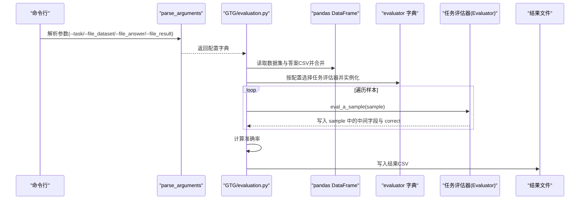
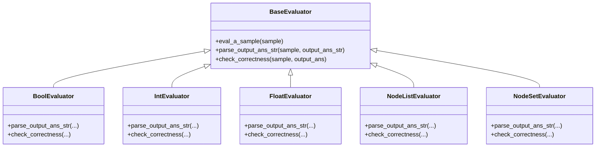
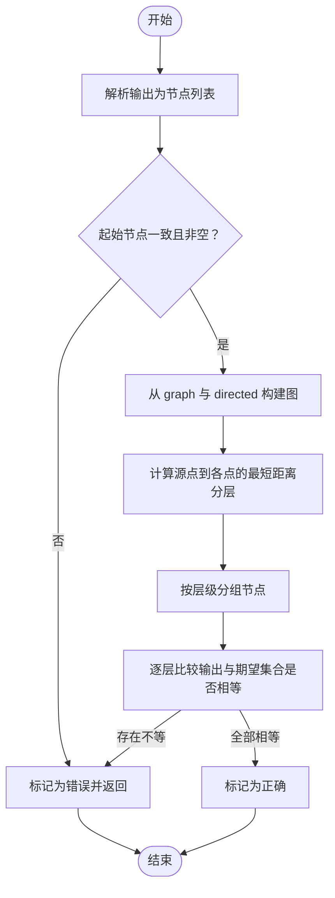
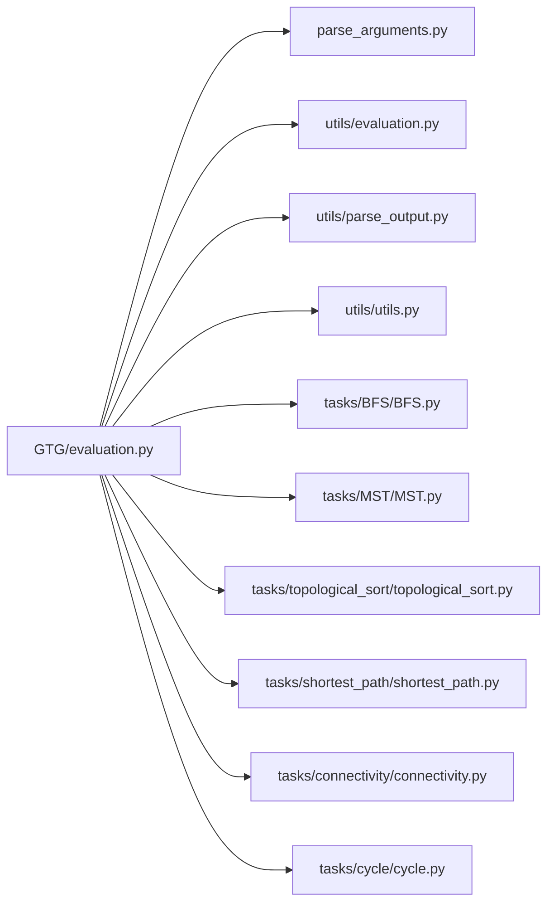

# 评估系统

<cite>
**本文引用的文件**
- [GTG/evaluation.py](file://GTG/evaluation.py)
- [GTG/utils/evaluation.py](file://GTG/utils/evaluation.py)
- [GTG/utils/parse_output.py](file://GTG/utils/parse_output.py)
- [GTG/utils/parse_arguments.py](file://GTG/utils/parse_arguments.py)
- [GTG/utils/utils.py](file://GTG/utils/utils.py)
- [GTG/tasks/BFS/BFS.py](file://GTG/tasks/BFS/BFS.py)
- [GTG/tasks/MST/MST.py](file://GTG/tasks/MST/MST.py)
- [GTG/tasks/topological_sort/topological_sort.py](file://GTG/tasks/topological_sort/topological_sort.py)
- [GTG/tasks/shortest_path/shortest_path.py](file://GTG/tasks/shortest_path/shortest_path.py)
- [GTG/tasks/connectivity/connectivity.py](file://GTG/tasks/connectivity/connectivity.py)
- [GTG/tasks/cycle/cycle.py](file://GTG/tasks/cycle/cycle.py)
- [script/evaluation/BFS-eval.sh](file://script/evaluation/BFS-eval.sh)
</cite>

## 目录
1. [简介](#简介)
2. [项目结构](#项目结构)
3. [核心组件](#核心组件)
4. [架构总览](#架构总览)
5. [详细组件分析](#详细组件分析)
6. [依赖关系分析](#依赖关系分析)
7. [性能考量](#性能考量)
8. [故障排查指南](#故障排查指南)
9. [结论](#结论)
10. [附录](#附录)

## 简介
本文件围绕 GraphInstruct 的评估系统展开，以 GTG/evaluation.py 为核心，系统性解析其如何通过配置文件加载待评估的数据集与模型输出结果，如何依据任务类型动态实例化对应的评估器并逐样本执行评估，以及最终如何计算准确率并持久化结果。同时，文档阐述 utils/evaluation.py 中通用评估逻辑（如字符串规范化、数值精度处理、节点列表解析等）的复用方式，并给出常见问题的调试方法与最佳实践建议。

## 项目结构
评估系统主要由以下模块组成：
- 主入口与配置解析：GTG/evaluation.py、GTG/utils/parse_arguments.py
- 通用评估工具：GTG/utils/evaluation.py、GTG/utils/parse_output.py、GTG/utils/utils.py
- 任务评估器：各任务目录下的 Evaluator 类（如 BFS、MST、topological_sort、shortest_path、connectivity、cycle 等）
- 批量执行脚本：script/evaluation/*.sh

图表来源
- [GTG/evaluation.py](file://GTG/evaluation.py#L1-L73)
- [GTG/utils/parse_arguments.py](file://GTG/utils/parse_arguments.py#L1-L28)
- [GTG/utils/evaluation.py](file://GTG/utils/evaluation.py#L1-L283)
- [GTG/utils/parse_output.py](file://GTG/utils/parse_output.py#L1-L213)
- [GTG/utils/utils.py](file://GTG/utils/utils.py#L1-L617)
- [GTG/tasks/BFS/BFS.py](file://GTG/tasks/BFS/BFS.py#L1-L212)
- [GTG/tasks/MST/MST.py](file://GTG/tasks/MST/MST.py#L1-L267)
- [GTG/tasks/topological_sort/topological_sort.py](file://GTG/tasks/topological_sort/topological_sort.py#L1-L233)
- [GTG/tasks/shortest_path/shortest_path.py](file://GTG/tasks/shortest_path/shortest_path.py#L1-L140)
- [GTG/tasks/connectivity/connectivity.py](file://GTG/tasks/connectivity/connectivity.py#L1-L125)
- [GTG/tasks/cycle/cycle.py](file://GTG/tasks/cycle/cycle.py#L1-L166)
- [script/evaluation/BFS-eval.sh](file://script/evaluation/BFS-eval.sh#L1-L14)

章节来源
- [GTG/evaluation.py](file://GTG/evaluation.py#L1-L73)
- [GTG/utils/parse_arguments.py](file://GTG/utils/parse_arguments.py#L1-L28)

## 核心组件
- 配置与入口
  - 通过命令行参数解析获取任务名与数据/答案/结果文件路径，随后按任务名从 evaluator 字典动态实例化对应 Evaluator。
- 数据加载与合并
  - 使用 pandas 读取数据集与答案 CSV 文件，并基于 id 进行内连接，形成待评估样本集合。
- 逐样本评估
  - 对每个样本调用 Evaluator.eval_a_sample(sample)，该方法内部完成输出解析、规范化与正确性判定。
- 结果统计与持久化
  - 将每条样本的中间字段（如 output_ans_str、output_ans、correct 等）收集到 df_result_dict，计算准确率并写入结果文件。

章节来源
- [GTG/evaluation.py](file://GTG/evaluation.py#L1-L73)
- [GTG/utils/parse_arguments.py](file://GTG/utils/parse_arguments.py#L1-L28)

## 架构总览
评估系统采用“主流程驱动 + 任务评估器扩展”的模式：
- 主流程负责 IO、调度与聚合；各任务通过继承统一的 BaseEvaluator 或特定类型评估器（如 NodeListEvaluator、IntEvaluator、BoolEvaluator）实现判题逻辑。
- 通用解析器提供字符串规范化、数值提取、节点列表解析等能力，供任务评估器复用。

图表来源
- [GTG/evaluation.py](file://GTG/evaluation.py#L1-L73)
- [GTG/utils/parse_arguments.py](file://GTG/utils/parse_arguments.py#L1-L28)
- [GTG/utils/evaluation.py](file://GTG/utils/evaluation.py#L1-L283)

## 详细组件分析

### 评估主流程（GTG/evaluation.py）
- 配置解析：从命令行读取任务名与文件路径。
- 评估器字典：根据任务名映射到对应任务的 Evaluator 类并实例化。
- 数据加载与合并：读取数据集与答案 CSV，按 id 合并，保证样本完整性。
- 逐样本评估：遍历合并后的样本，调用 Evaluator.eval_a_sample(sample)，并将 sample 中的关键字段追加到 df_result_dict。
- 准确率计算与持久化：对 correct 列求均值得到准确率，并将完整结果写入 CSV 文件。

章节来源
- [GTG/evaluation.py](file://GTG/evaluation.py#L1-L73)

### 通用评估器基类与类型化评估器（GTG/utils/evaluation.py）
- BaseEvaluator：定义 eval_a_sample 的通用流程：解析包裹的答案字符串、将字符串解析为目标类型、再由子类实现 check_correctness。
- BoolEvaluator、IntEvaluator、FloatEvaluator：分别面向布尔、整数、浮点数答案，提供 parse_output_ans_str 与 check_correctness 的默认实现。
- NodeListEvaluator、NodeSetEvaluator：面向节点序列或节点集合的评估，提供节点列表解析与集合比较逻辑。
- 旧版函数式评估：eval_bool、eval_integer、eval_float、eval_node_in_list、eval_a_node、eval_ad_location、eval_node_set 等，用于兼容或特定场景。

图表来源
- [GTG/utils/evaluation.py](file://GTG/utils/evaluation.py#L1-L283)

章节来源
- [GTG/utils/evaluation.py](file://GTG/utils/evaluation.py#L1-L283)

### 输出解析与规范化（GTG/utils/parse_output.py）
- parse_wrapped_answer：从模型输出中提取包裹标记内的目标字符串。
- parse_bool、parse_first_integer、parse_first_float：从文本中提取布尔、首个整数、首个浮点数（支持分数形式）。
- parse_first_node_id、parse_node_list、parse_list、parse_dict：解析节点标识、节点列表、列表、字典等结构化内容。
- remove_all_node_id：移除输出中的节点标识，便于数值解析。
- parse_edge_list、parse_list_with_weight、parse_dict_with_weight：解析带权重的边列表与字典。

章节来源
- [GTG/utils/parse_output.py](file://GTG/utils/parse_output.py#L1-L213)

### 图工具与样本构造（GTG/utils/utils.py）
- make_sample：构造标准样本字典，包含任务名、图表示、节点信息、有向性、问题、答案等。
- NID/NID_edges：将节点或边格式化为带尖括号的标准节点标识。
- graph_to_edge_list_str、edge_list_str_to_graph：图的字符串与对象互转。
- graph_with_egde_weight_to_str、graph_with_egde_weight_to_adj_str、graph_with_edge_weight_to_natural_language：带权重图的多种表示。
- graph_generation/graph_generation_with_edge_weight：随机图生成与带权重图生成。
- 其他辅助函数：邻接信息、节点重映射、图算法相关工具。

章节来源
- [GTG/utils/utils.py](file://GTG/utils/utils.py#L1-L617)

### 任务评估器示例

#### BFS 评估器（GTG/tasks/BFS/BFS.py）
- 继承 NodeListEvaluator，实现 check_correctness：校验输出是否为合法 BFS 序列，要求起始节点一致且按层次分组正确。
- 在评估主流程中，若任务为 DFS，则会额外记录路径长度与有效路径长度等字段。

图表来源
- [GTG/tasks/BFS/BFS.py](file://GTG/tasks/BFS/BFS.py#L157-L212)
- [GTG/utils/utils.py](file://GTG/utils/utils.py#L82-L96)

章节来源
- [GTG/tasks/BFS/BFS.py](file://GTG/tasks/BFS/BFS.py#L1-L212)
- [GTG/utils/utils.py](file://GTG/utils/utils.py#L82-L96)

#### MST 评估器（GTG/tasks/MST/MST.py）
- 继承 IntEvaluator，使用网络库计算最小生成树总权重并与答案比对。
- 生成阶段确保图为连通无向图，避免无效样本。

章节来源
- [GTG/tasks/MST/MST.py](file://GTG/tasks/MST/MST.py#L1-L267)

#### 拓扑排序评估器（GTG/tasks/topological_sort/topological_sort.py）
- 继承 NodeListEvaluator，check_correctness：验证输出是否满足拓扑排序条件（入度为 0 的节点顺序正确）。
- 提供独立的 eval_a_sample（非继承自通用基类），直接解析输出列表并校验。

章节来源
- [GTG/tasks/topological_sort/topological_sort.py](file://GTG/tasks/topological_sort/topological_sort.py#L1-L233)

#### 最短路评估器（GTG/tasks/shortest_path/shortest_path.py）
- 继承 IntEvaluator，使用 Dijkstra 算法计算两点间最短距离并与答案比对。
- 生成阶段排除不可达情况，保证答案有效。

章节来源
- [GTG/tasks/shortest_path/shortest_path.py](file://GTG/tasks/shortest_path/shortest_path.py#L1-L140)

#### 连通性评估器（GTG/tasks/connectivity/connectivity.py）
- 继承 BoolEvaluator，使用 DFS 检测两点之间是否存在路径（有向/无向视图而定）。

章节来源
- [GTG/tasks/connectivity/connectivity.py](file://GTG/tasks/connectivity/connectivity.py#L1-L125)

#### 环检测评估器（GTG/tasks/cycle/cycle.py）
- 继承 BoolEvaluator，使用拓扑排序检测是否存在环（有向图）。

章节来源
- [GTG/tasks/cycle/cycle.py](file://GTG/tasks/cycle/cycle.py#L1-L166)

## 依赖关系分析
- 评估主流程依赖：
  - 配置解析：parse_arguments
  - 通用评估器：BaseEvaluator 及其子类
  - 输出解析：parse_output 工具
  - 图工具：utils 中的图转换与生成函数
  - 任务评估器：各任务目录下的 Evaluator
- 评估器字典映射：
  - 通过任务名映射到对应 Evaluator 类，实现多态实例化与判题逻辑。

图表来源
- [GTG/evaluation.py](file://GTG/evaluation.py#L1-L73)
- [GTG/utils/parse_arguments.py](file://GTG/utils/parse_arguments.py#L1-L28)
- [GTG/utils/evaluation.py](file://GTG/utils/evaluation.py#L1-L283)
- [GTG/utils/parse_output.py](file://GTG/utils/parse_output.py#L1-L213)
- [GTG/utils/utils.py](file://GTG/utils/utils.py#L1-L617)
- [GTG/tasks/BFS/BFS.py](file://GTG/tasks/BFS/BFS.py#L1-L212)
- [GTG/tasks/MST/MST.py](file://GTG/tasks/MST/MST.py#L1-L267)
- [GTG/tasks/topological_sort/topological_sort.py](file://GTG/tasks/topological_sort/topological_sort.py#L1-L233)
- [GTG/tasks/shortest_path/shortest_path.py](file://GTG/tasks/shortest_path/shortest_path.py#L1-L140)
- [GTG/tasks/connectivity/connectivity.py](file://GTG/tasks/connectivity/connectivity.py#L1-L125)
- [GTG/tasks/cycle/cycle.py](file://GTG/tasks/cycle/cycle.py#L1-L166)

章节来源
- [GTG/evaluation.py](file://GTG/evaluation.py#L1-L73)

## 性能考量
- I/O 与内存
  - pandas 合并与迭代样本时注意大文件内存占用，建议分批处理或限制样本规模。
- 评估复杂度
  - BFS/拓扑排序等算法在大规模图上可能较慢，可考虑缓存图结构或预处理。
- 并发
  - 当前实现为串行评估，若需加速可在样本级别并行（注意线程安全与共享资源）。

## 故障排查指南
- 输出格式不匹配
  - 现象：correct 始终为 0。
  - 排查：确认模型输出是否包含包裹标记，检查 parse_wrapped_answer 是否能正确提取；核对 parse_output.py 中的解析规则是否与模型输出一致。
  - 参考路径
    - [GTG/utils/parse_output.py](file://GTG/utils/parse_output.py#L1-L213)
    - [GTG/utils/evaluation.py](file://GTG/utils/evaluation.py#L1-L283)
- 节点 ID 类型不一致
  - 现象：节点列表解析失败或集合比较不相等。
  - 排查：确认数据集中 graph/nodes 与输出中的节点标识格式一致；使用 parse_node_list 时会校验节点集合，确保输出节点在合法集合内。
  - 参考路径
    - [GTG/utils/parse_output.py](file://GTG/utils/parse_output.py#L101-L118)
    - [GTG/utils/utils.py](file://GTG/utils/utils.py#L56-L71)
- 浮点精度误差
  - 现象：浮点数答案误判。
  - 排查：检查 FloatEvaluator 的相对误差阈值是否合理；必要时调整容差。
  - 参考路径
    - [GTG/utils/evaluation.py](file://GTG/utils/evaluation.py#L82-L95)
- BFS 序列合法性
  - 现象：BFS 评估失败。
  - 排查：确认输出起始节点与问题一致；检查分层集合是否严格相等。
  - 参考路径
    - [GTG/tasks/BFS/BFS.py](file://GTG/tasks/BFS/BFS.py#L157-L212)
- 任务未覆盖
  - 现象：任务名不在 evaluator 字典中。
  - 排查：确认任务名大小写与键一致；或在 GTG/evaluation.py 的字典中添加映射。
  - 参考路径
    - [GTG/evaluation.py](file://GTG/evaluation.py#L14-L36)

## 结论
GraphInstruct 的评估系统通过“主流程 + 任务评估器”的解耦设计，实现了对多任务的统一评估。主流程负责数据加载、样本合并与结果聚合，而各任务评估器专注于判题逻辑。通用评估工具提供了强大的输出解析与规范化能力，使得不同任务可以快速接入并保持一致的评估体验。建议在实际使用中：
- 使用标准数据集进行回归测试，确保评估稳定性；
- 明确模型输出格式，确保包裹标记与解析规则一致；
- 针对任务特性调整误差阈值与判题策略；
- 大规模评估时考虑并行化与内存优化。

## 附录
- 示例脚本
  - BFS 评估脚本展示了如何指定数据集、答案与结果文件路径并运行评估。
  - 参考路径
    - [script/evaluation/BFS-eval.sh](file://script/evaluation/BFS-eval.sh#L1-L14)